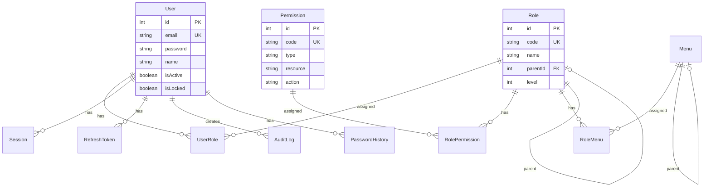
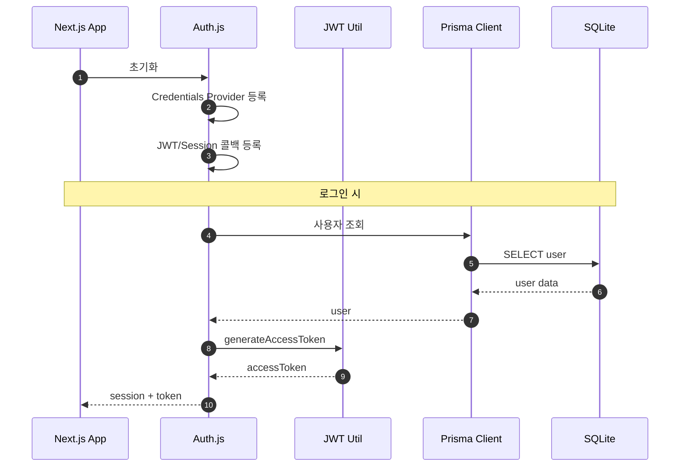

# 상세설계: TSK-01-01 Prisma 스키마 및 Auth.js 설정

**Template Version:** 3.0.0 — **Last Updated:** 2026-01-26

---

## 0. 문서 메타데이터

| 항목 | 내용 |
|------|------|
| Task ID | TSK-01-01 |
| Task명 | Prisma 스키마 및 Auth.js 설정 |
| Category | infrastructure |
| 상태 | [dd] 상세설계 |
| 작성일 | 2026-01-26 |
| 작성자 | Claude |

### 상위 문서 참조

| 문서 유형 | 경로 | 참조 섹션 |
|----------|------|----------|
| PRD | `.orchay/projects/auth-system/prd.md` | 섹션 4.1, 4.2, 4.3 |
| TRD | `.orchay/projects/auth-system/trd.md` | 섹션 1, 2, 4 |
| WBS | `.orchay/projects/auth-system/wbs.yaml` | TSK-01-01 |
| 상위 Work Package | WP-01: 기반 구축 | - |

---

## 1. 일관성 검증 결과

### 1.1 검증 요약

| 구분 | 통과 | 경고 | 실패 |
|------|------|------|------|
| PRD ↔ TRD | 5개 | 0개 | 0개 |
| TRD ↔ 상세설계 | 5개 | 0개 | 0개 |

### 1.2 검증 상세

| 검증 ID | 검증 항목 | 결과 | 비고 |
|---------|----------|------|------|
| CHK-PRD-01 | 데이터 모델 완전성 | PASS | 10개 모델 정의 |
| CHK-PRD-02 | 인증 요구사항 | PASS | JWT, bcrypt |
| CHK-TRD-01 | 기술 스택 준수 | PASS | Prisma 7.x, Auth.js 5.x |
| CHK-TRD-02 | 스키마 일치성 | PASS | TRD 2.2 참조 |
| CHK-TRD-03 | 보안 설정 | PASS | RS256, bcrypt |

---

## 2. 목적 및 범위

### 2.1 목적
MES Portal Auth System의 데이터베이스 스키마와 인증 프레임워크 기반을 구축하여 후속 Task(로그인, RBAC, 감사로그)의 토대 마련

### 2.2 범위

**포함 범위**:
- Prisma 스키마 생성 (10개 모델)
- Auth.js v5 Credentials Provider 설정
- JWT RS256 서명 유틸리티
- bcrypt 비밀번호 해싱 유틸리티
- 기본 역할/권한 시드 데이터

**제외 범위**:
- 로그인/로그아웃 API → TSK-02-01
- RBAC API → TSK-03-01
- 감사 로그 → TSK-04-01

---

## 3. 기술 스택

| 구분 | 기술 | 버전 | 용도 |
|------|------|------|------|
| ORM | Prisma | 7.x | 데이터베이스 스키마 및 클라이언트 |
| Database | SQLite | - | MVP 데이터베이스 |
| Auth | Auth.js (NextAuth) | 5.x | 인증 프레임워크 |
| JWT | jose | 5.x | JWT 생성/검증 |
| Password | bcrypt | 5.x | 비밀번호 해싱 |
| Validation | zod | 3.x | 스키마 검증 |
| Framework | Next.js | 16.x | App Router |

---

## 4. 용어/가정/제약

### 4.1 용어 정의
| 용어 | 정의 |
|------|------|
| RBAC | Role-Based Access Control, 역할 기반 접근 제어 |
| JWT | JSON Web Token, 클레임 기반 인증 토큰 |
| Access Token | 리소스 접근용 단기 토큰 (15분) |
| Refresh Token | Access Token 갱신용 장기 토큰 (7일) |

### 4.2 가정 (Assumptions)
- SQLite를 MVP 단계에서 사용, 프로덕션은 PostgreSQL 전환 예정
- 단일 인스턴스 운영 (MVP)

### 4.3 제약 (Constraints)
- Next.js 16.x App Router 환경
- Ant Design 6.x 컴포넌트 사용
- JWT 기반 Stateless 인증

---

## 5. 시스템/모듈 구조

### 5.1 모듈 역할 및 책임

| 모듈 | 역할 | 책임 |
|------|------|------|
| prisma/schema.prisma | 데이터 모델 정의 | 테이블 구조, 관계, 인덱스 정의 |
| lib/auth/index.ts | Auth.js 설정 | Credentials Provider, JWT 콜백 |
| lib/auth/jwt.ts | JWT 유틸리티 | 토큰 생성/검증/디코딩 |
| lib/auth/password.ts | 비밀번호 유틸리티 | 해싱, 비교, 정책 검증 |
| prisma/seed.ts | 시드 데이터 | 기본 역할/권한/사용자 생성 |

### 5.2 모듈 구조도

```
mes-portal/
├── prisma/
│   ├── schema.prisma        # Prisma 스키마
│   ├── seed.ts              # 시드 스크립트
│   └── migrations/          # 마이그레이션 파일
├── lib/
│   └── auth/
│       ├── index.ts         # Auth.js 설정
│       ├── jwt.ts           # JWT 유틸리티
│       └── password.ts      # 비밀번호 유틸리티
└── app/
    └── api/
        └── auth/
            └── [...nextauth]/
                └── route.ts # Auth.js 라우트
```

### 5.3 외부 의존성

| 의존성 | 유형 | 용도 |
|--------|------|------|
| @prisma/client | Library | Prisma 클라이언트 |
| next-auth | Library | Auth.js 프레임워크 |
| jose | Library | JWT 생성/검증 |
| bcrypt | Library | 비밀번호 해싱 |
| zod | Library | 스키마 검증 |

---

## 6. 데이터 모델

### 6.1 엔티티 정의

#### Entity: User
| 필드명 | 타입 | 필수 | 설명 | 제약조건 |
|--------|------|------|------|----------|
| id | Int | Y | 고유 식별자 | PK, Auto Increment |
| email | String | Y | 이메일 | Unique |
| password | String | Y | 비밀번호 해시 | bcrypt |
| name | String | Y | 이름 | - |
| phone | String | N | 연락처 | - |
| department | String | N | 부서 | - |
| isActive | Boolean | Y | 활성화 상태 | Default: true |
| isLocked | Boolean | Y | 잠금 상태 | Default: false |
| lockUntil | DateTime | N | 잠금 해제 시간 | - |
| failedLoginAttempts | Int | Y | 로그인 실패 횟수 | Default: 0 |
| passwordChangedAt | DateTime | Y | 비밀번호 변경일 | Default: now() |
| mustChangePassword | Boolean | Y | 비밀번호 변경 필요 | Default: true |
| lastLoginAt | DateTime | N | 최근 로그인 | - |
| createdAt | DateTime | Y | 생성일시 | Default: now() |
| updatedAt | DateTime | Y | 수정일시 | Auto Update |

#### Entity: Role
| 필드명 | 타입 | 필수 | 설명 | 제약조건 |
|--------|------|------|------|----------|
| id | Int | Y | 고유 식별자 | PK |
| code | String | Y | 역할 코드 | Unique |
| name | String | Y | 역할명 | - |
| description | String | N | 설명 | - |
| parentId | Int | N | 상위 역할 | FK → Role |
| level | Int | Y | 역할 레벨 | Default: 0 |
| isSystem | Boolean | Y | 시스템 역할 | Default: false |
| isActive | Boolean | Y | 활성화 상태 | Default: true |

#### Entity: Permission
| 필드명 | 타입 | 필수 | 설명 | 제약조건 |
|--------|------|------|------|----------|
| id | Int | Y | 고유 식별자 | PK |
| code | String | Y | 권한 코드 | Unique |
| name | String | Y | 권한명 | - |
| type | String | Y | 권한 유형 | MENU/SCREEN/API/DATA |
| resource | String | Y | 리소스 경로 | - |
| action | String | Y | 액션 | CREATE/READ/UPDATE/DELETE |
| description | String | N | 설명 | - |
| isActive | Boolean | Y | 활성화 상태 | Default: true |

#### Entity: Session
| 필드명 | 타입 | 필수 | 설명 | 제약조건 |
|--------|------|------|------|----------|
| id | Int | Y | 고유 식별자 | PK |
| userId | Int | Y | 사용자 ID | FK → User |
| token | String | Y | 세션 토큰 | Unique |
| userAgent | String | N | 브라우저 정보 | - |
| ip | String | N | IP 주소 | - |
| deviceType | String | N | 기기 유형 | DESKTOP/MOBILE/TABLET |
| expiresAt | DateTime | Y | 만료 시간 | - |
| createdAt | DateTime | Y | 생성일시 | Default: now() |

#### Entity: RefreshToken
| 필드명 | 타입 | 필수 | 설명 | 제약조건 |
|--------|------|------|------|----------|
| id | Int | Y | 고유 식별자 | PK |
| userId | Int | Y | 사용자 ID | FK → User |
| token | String | Y | 토큰 | Unique |
| expiresAt | DateTime | Y | 만료 시간 | - |
| revokedAt | DateTime | N | 폐기 시간 | - |
| createdAt | DateTime | Y | 생성일시 | Default: now() |

#### Entity: AuditLog
| 필드명 | 타입 | 필수 | 설명 | 제약조건 |
|--------|------|------|------|----------|
| id | Int | Y | 고유 식별자 | PK |
| userId | Int | N | 사용자 ID | FK → User |
| action | String | Y | 액션 | LOGIN/LOGOUT 등 |
| resource | String | N | 대상 리소스 | - |
| resourceId | String | N | 리소스 ID | - |
| details | String | N | 상세 정보 | JSON |
| ip | String | N | IP 주소 | - |
| userAgent | String | N | 브라우저 정보 | - |
| status | String | Y | 상태 | SUCCESS/FAILURE |
| errorMessage | String | N | 에러 메시지 | - |
| createdAt | DateTime | Y | 생성일시 | Default: now() |

### 6.2 관계 다이어그램



### 6.3 인덱스 및 제약조건

| 엔티티 | 인덱스/제약 | 필드 | 목적 |
|--------|------------|------|------|
| User | Unique | email | 이메일 유일성 |
| Role | Unique | code | 역할 코드 유일성 |
| Permission | Unique | code | 권한 코드 유일성 |
| Permission | Index | [type] | 유형별 조회 성능 |
| Permission | Index | [resource] | 리소스별 조회 성능 |
| Session | Index | [userId, expiresAt] | 세션 조회 성능 |
| AuditLog | Index | [userId, action, createdAt] | 감사 로그 조회 성능 |
| UserRole | Unique | [userId, roleId] | 중복 할당 방지 |
| RolePermission | Unique | [roleId, permissionId] | 중복 매핑 방지 |

---

## 7. 인터페이스 계약

### 7.1 JWT 유틸리티 API

| 함수 | 입력 | 출력 | 설명 |
|------|------|------|------|
| generateAccessToken | payload | string | Access Token 생성 (15분) |
| generateRefreshToken | payload | string | Refresh Token 생성 (7일) |
| verifyToken | token | payload | 토큰 검증 및 페이로드 반환 |
| decodeToken | token | payload | 토큰 디코딩 (검증 없음) |

### 7.2 비밀번호 유틸리티 API

| 함수 | 입력 | 출력 | 설명 |
|------|------|------|------|
| hashPassword | password | string | bcrypt 해싱 (rounds: 10) |
| comparePassword | password, hash | boolean | 비밀번호 비교 |
| validatePasswordPolicy | password | ValidationResult | 정책 검증 |

### 7.3 Access Token Payload 구조

| 필드 | 타입 | 설명 |
|------|------|------|
| sub | string | 사용자 ID |
| email | string | 이메일 |
| name | string | 이름 |
| roles | string[] | 역할 코드 배열 |
| permissions | string[] | 권한 코드 배열 |
| iat | number | 발급 시간 |
| exp | number | 만료 시간 |
| jti | string | 토큰 고유 ID |

---

## 8. 프로세스 흐름

### 8.1 Auth.js 초기화 흐름

1. **앱 시작**: Next.js 앱 시작 시 Auth.js 초기화
2. **Credentials Provider 등록**: 이메일/비밀번호 인증 Provider 설정
3. **JWT 콜백 설정**: 토큰 생성/갱신 시 커스텀 페이로드 추가
4. **세션 콜백 설정**: 세션 정보에 사용자 역할/권한 포함

### 8.2 시퀀스 다이어그램



---

## 9. 시드 데이터

### 9.1 기본 역할

| 코드 | 이름 | 레벨 | 상위 역할 | 시스템 |
|------|------|------|----------|--------|
| SYSTEM_ADMIN | 시스템 관리자 | 0 | - | true |
| SECURITY_ADMIN | 보안 관리자 | 1 | SYSTEM_ADMIN | true |
| OPERATION_ADMIN | 운영 관리자 | 1 | SYSTEM_ADMIN | true |
| PRODUCTION_MANAGER | 생산 관리자 | 2 | OPERATION_ADMIN | false |
| QUALITY_MANAGER | 품질 관리자 | 2 | OPERATION_ADMIN | false |
| EQUIPMENT_MANAGER | 설비 관리자 | 2 | OPERATION_ADMIN | false |
| USER | 일반 사용자 | 3 | - | true |

### 9.2 기본 권한

| 코드 | 이름 | 유형 | 리소스 | 액션 |
|------|------|------|--------|------|
| user:read | 사용자 조회 | API | /api/users | READ |
| user:create | 사용자 생성 | API | /api/users | CREATE |
| user:update | 사용자 수정 | API | /api/users | UPDATE |
| user:delete | 사용자 삭제 | API | /api/users | DELETE |
| role:read | 역할 조회 | API | /api/roles | READ |
| role:create | 역할 생성 | API | /api/roles | CREATE |
| role:update | 역할 수정 | API | /api/roles | UPDATE |
| role:delete | 역할 삭제 | API | /api/roles | DELETE |
| permission:read | 권한 조회 | API | /api/permissions | READ |
| audit-log:read | 감사 로그 조회 | API | /api/audit-logs | READ |
| audit-log:export | 감사 로그 내보내기 | API | /api/audit-logs/export | EXPORT |
| security:read | 보안 설정 조회 | API | /api/security-settings | READ |
| security:update | 보안 설정 수정 | API | /api/security-settings | UPDATE |

### 9.3 기본 보안 설정

| 키 | 값 | 타입 | 설명 |
|-----|-----|------|------|
| PASSWORD_MIN_LENGTH | 8 | NUMBER | 비밀번호 최소 길이 |
| PASSWORD_REQUIRE_UPPERCASE | true | BOOLEAN | 대문자 필수 |
| PASSWORD_REQUIRE_LOWERCASE | true | BOOLEAN | 소문자 필수 |
| PASSWORD_REQUIRE_NUMBER | true | BOOLEAN | 숫자 필수 |
| PASSWORD_REQUIRE_SPECIAL | true | BOOLEAN | 특수문자 필수 |
| PASSWORD_EXPIRY_DAYS | 90 | NUMBER | 비밀번호 만료 기간 |
| PASSWORD_HISTORY_COUNT | 5 | NUMBER | 재사용 금지 횟수 |
| MAX_LOGIN_ATTEMPTS | 5 | NUMBER | 최대 로그인 실패 횟수 |
| LOCKOUT_DURATION_MINUTES | 30 | NUMBER | 계정 잠금 시간 |
| SESSION_TIMEOUT_MINUTES | 30 | NUMBER | 세션 타임아웃 |
| MAX_CONCURRENT_SESSIONS | 3 | NUMBER | 최대 동시 세션 |
| ACCESS_TOKEN_EXPIRY_MINUTES | 15 | NUMBER | Access Token 만료 |
| REFRESH_TOKEN_EXPIRY_DAYS | 7 | NUMBER | Refresh Token 만료 |

### 9.4 테스트 사용자

| 이메일 | 이름 | 역할 | 비밀번호 |
|--------|------|------|----------|
| admin@mes.local | 시스템 관리자 | SYSTEM_ADMIN | Admin123! |
| security@mes.local | 보안 관리자 | SECURITY_ADMIN | Security123! |
| user@mes.local | 일반 사용자 | USER | User123! |

---

## 10. 비즈니스 규칙 구현 명세

| 규칙 ID | 규칙 설명 | 구현 위치 | 구현 방식 |
|---------|----------|----------|----------|
| BR-AUTH-001 | 비밀번호 bcrypt 해싱 | lib/auth/password.ts | bcrypt.hash(rounds: 10) |
| BR-AUTH-002 | JWT RS256 서명 | lib/auth/jwt.ts | jose 라이브러리 |
| BR-AUTH-003 | Access Token 15분 | lib/auth/jwt.ts | exp 클레임 |
| BR-AUTH-004 | Refresh Token 7일 | lib/auth/jwt.ts | exp 클레임 |

---

## 11. 오류/예외 처리

### 11.1 예상 오류 상황

| 오류 상황 | 오류 코드 | 사용자 메시지 | 복구 전략 |
|----------|----------|--------------|----------|
| DB 연결 실패 | DB_CONNECTION_ERROR | 서비스 연결 오류 | 재시도 후 서비스 알림 |
| 스키마 마이그레이션 실패 | MIGRATION_ERROR | - | 수동 복구 필요 |
| JWT 키 로드 실패 | JWT_KEY_ERROR | 인증 서비스 오류 | 환경변수 확인 |

---

## 12. 구현 체크리스트

### Backend
- [ ] Prisma 스키마 작성 (10개 모델)
- [ ] 마이그레이션 생성 및 적용
- [ ] Auth.js 설정 (Credentials Provider)
- [ ] JWT 유틸리티 구현
- [ ] 비밀번호 유틸리티 구현
- [ ] 시드 스크립트 작성
- [ ] 단위 테스트 작성

### 환경 설정
- [ ] 환경변수 설정 (DATABASE_URL, AUTH_SECRET, JWT_SECRET)
- [ ] package.json 스크립트 추가

---

## 13. 다음 단계

- `/wf:build TSK-01-01` 명령어로 TDD 기반 구현 진행

---

## 관련 문서

- PRD: `.orchay/projects/auth-system/prd.md`
- TRD: `.orchay/projects/auth-system/trd.md`
- WBS: `.orchay/projects/auth-system/wbs.yaml`
