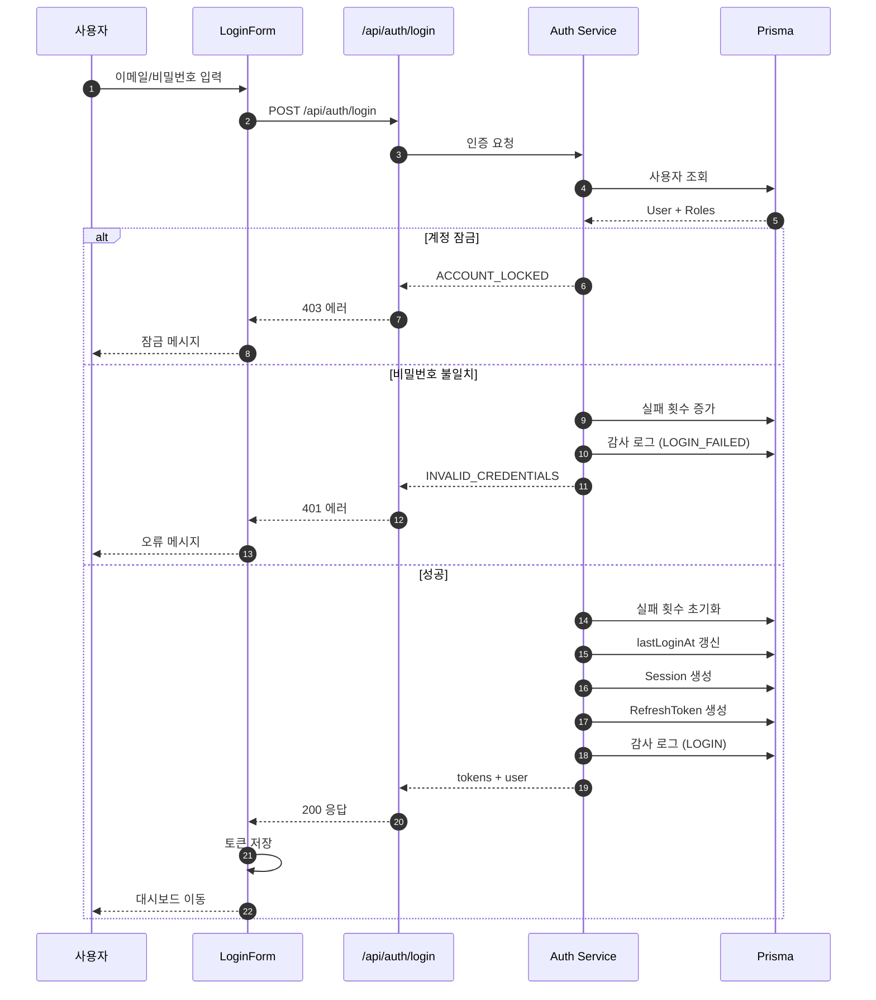
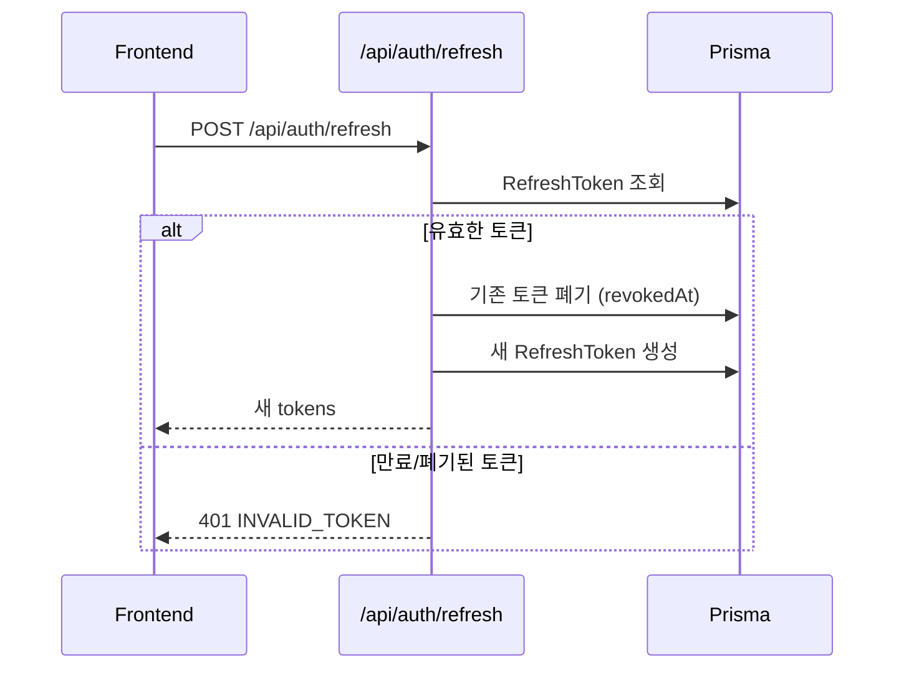

# 상세설계: TSK-02-01 로그인/로그아웃 API 및 화면

**Template Version:** 3.0.0 — **Last Updated:** 2026-01-26

---

## 0. 문서 메타데이터

| 항목 | 내용 |
|------|------|
| Task ID | TSK-02-01 |
| Task명 | 로그인/로그아웃 API 및 화면 |
| Category | development |
| 상태 | [dd] 상세설계 |
| 작성일 | 2026-01-26 |
| 작성자 | Claude |

### 상위 문서 참조

| 문서 유형 | 경로 | 참조 섹션 |
|----------|------|----------|
| PRD | `.orchay/projects/auth-system/prd.md` | 섹션 4.1.1, 4.1.2 |
| TRD | `.orchay/projects/auth-system/trd.md` | 섹션 3.1, 4.1, 4.2 |
| WBS | `.orchay/projects/auth-system/wbs.yaml` | TSK-02-01 |
| 상위 Work Package | WP-02: 인증 시스템 | - |

---

## 1. 목적 및 범위

### 1.1 목적
JWT 기반 로그인/로그아웃 API 및 화면 구현으로 Auth System의 핵심 인증 플로우 완성

### 1.2 범위

**포함 범위**:
- POST /api/auth/login (Access + Refresh Token 발급)
- POST /api/auth/logout (토큰 무효화)
- POST /api/auth/refresh (토큰 갱신)
- GET /api/auth/me (현재 사용자 정보)
- 로그인 화면 (LoginForm 컴포넌트)
- 감사 로그 기록 (로그인 성공/실패)

**제외 범위**:
- 비밀번호 정책 검증 → TSK-02-02
- 비밀번호 변경/찾기 → TSK-02-03

---

## 2. 기술 스택

| 구분 | 기술 | 버전 | 용도 |
|------|------|------|------|
| Framework | Next.js | 16.x | App Router API Routes |
| Auth | Auth.js | 5.x | Credentials Provider 활용 |
| UI | Ant Design | 6.x | Form, Input, Button |
| Styling | TailwindCSS | 4.x | 레이아웃 |
| ORM | Prisma | 7.x | 데이터 조회/저장 |

---

## 3. 인터페이스 계약 (API Contract)

### 3.1 엔드포인트 목록

| Method | Endpoint | 설명 | 인증 필요 |
|--------|----------|------|----------|
| POST | /api/auth/login | 로그인 | No |
| POST | /api/auth/logout | 로그아웃 | Yes |
| POST | /api/auth/refresh | 토큰 갱신 | No (Refresh Token) |
| GET | /api/auth/me | 현재 사용자 정보 | Yes |

### 3.2 POST /api/auth/login

#### 요청
| 파라미터 | 타입 | 필수 | 설명 |
|----------|------|------|------|
| email | string | Y | 이메일 |
| password | string | Y | 비밀번호 |
| rememberMe | boolean | N | 자동 로그인 |

#### 응답 (성공 200)
| 필드 | 타입 | 설명 |
|------|------|------|
| accessToken | string | JWT Access Token |
| refreshToken | string | JWT Refresh Token |
| user | object | 사용자 정보 |
| user.id | number | 사용자 ID |
| user.email | string | 이메일 |
| user.name | string | 이름 |
| user.roles | string[] | 역할 코드 배열 |
| user.permissions | string[] | 권한 코드 배열 |

#### 에러 응답

| 코드 | 에러 코드 | 설명 |
|------|----------|------|
| 400 | VALIDATION_ERROR | 필수 필드 누락 |
| 401 | INVALID_CREDENTIALS | 이메일 또는 비밀번호 오류 |
| 403 | ACCOUNT_LOCKED | 계정 잠금 상태 |
| 403 | ACCOUNT_INACTIVE | 계정 비활성화 |

### 3.3 POST /api/auth/logout

#### 요청
- Authorization: Bearer {accessToken}

#### 응답 (성공 200)
```json
{ "success": true }
```

### 3.4 POST /api/auth/refresh

#### 요청
| 파라미터 | 타입 | 필수 | 설명 |
|----------|------|------|------|
| refreshToken | string | Y | Refresh Token |

#### 응답 (성공 200)
| 필드 | 타입 | 설명 |
|------|------|------|
| accessToken | string | 새 Access Token |
| refreshToken | string | 새 Refresh Token (Rotation) |

### 3.5 GET /api/auth/me

#### 요청
- Authorization: Bearer {accessToken}

#### 응답 (성공 200)
| 필드 | 타입 | 설명 |
|------|------|------|
| user | object | 사용자 정보 |
| roles | object[] | 역할 상세 |
| permissions | string[] | 권한 코드 배열 |

---

## 4. 프로세스 흐름

### 4.1 로그인 플로우



### 4.2 토큰 갱신 플로우



---

## 5. UI 설계

### 5.1 로그인 화면 레이아웃

```
┌─────────────────────────────────────────────────────────────┐
│                                                             │
│                    ┌─────────────────────┐                  │
│                    │       LOGO          │                  │
│                    └─────────────────────┘                  │
│                                                             │
│                    ┌─────────────────────┐                  │
│                    │ 이메일              │                  │
│                    │ [_______________]   │                  │
│                    │                     │                  │
│                    │ 비밀번호            │                  │
│                    │ [_______________]   │                  │
│                    │                     │                  │
│                    │ [x] 자동 로그인     │                  │
│                    │                     │                  │
│                    │ [    로그인    ]    │                  │
│                    │                     │                  │
│                    │ 비밀번호 찾기       │                  │
│                    └─────────────────────┘                  │
│                                                             │
└─────────────────────────────────────────────────────────────┘
```

### 5.2 컴포넌트 구조

| 컴포넌트 | 역할 | 위치 |
|----------|------|------|
| LoginPage | 로그인 페이지 | app/(auth)/login/page.tsx |
| LoginForm | 로그인 폼 | components/auth/LoginForm.tsx |

### 5.3 data-testid

| data-testid | 요소 |
|-------------|------|
| login-form | 폼 컨테이너 |
| email-input | 이메일 입력 |
| password-input | 비밀번호 입력 |
| remember-checkbox | 자동 로그인 체크박스 |
| login-button | 로그인 버튼 |
| error-message | 에러 메시지 |

---

## 6. 구현 체크리스트

### Backend
- [ ] POST /api/auth/login 구현
- [ ] POST /api/auth/logout 구현
- [ ] POST /api/auth/refresh 구현
- [ ] GET /api/auth/me 구현
- [ ] 감사 로그 기록

### Frontend
- [ ] LoginPage 구현
- [ ] LoginForm 컴포넌트
- [ ] 토큰 저장/관리
- [ ] 에러 처리 UI

---

## 7. 다음 단계

- `/wf:build TSK-02-01` 명령어로 TDD 기반 구현 진행
