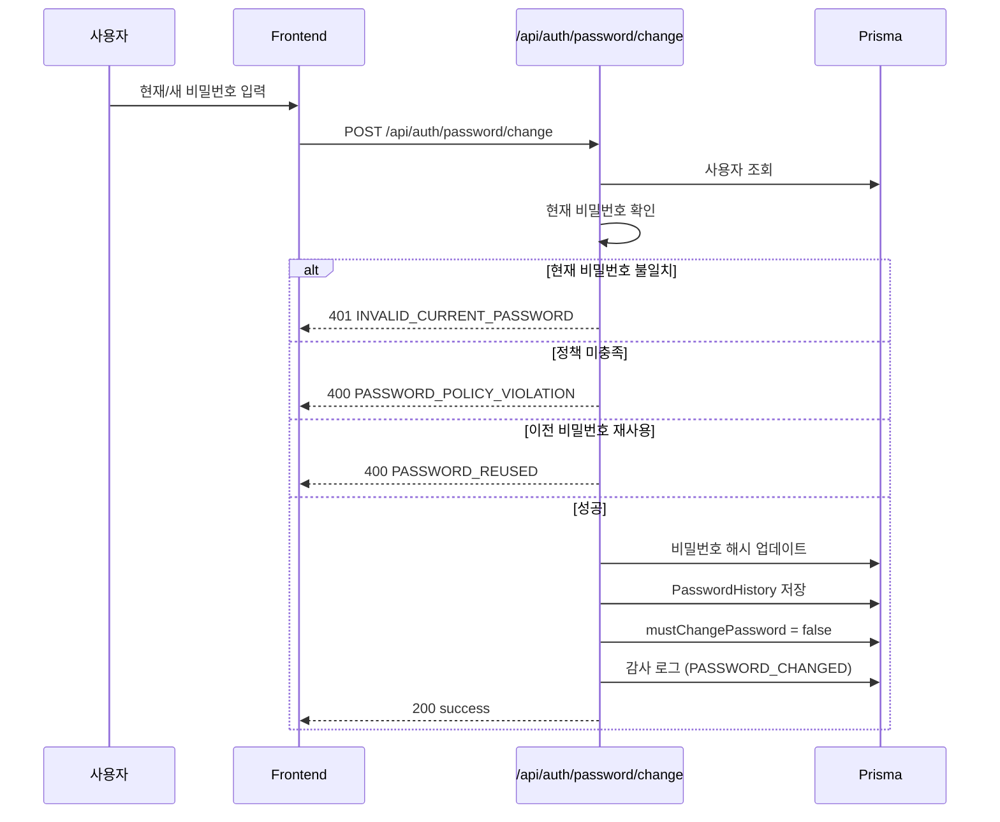
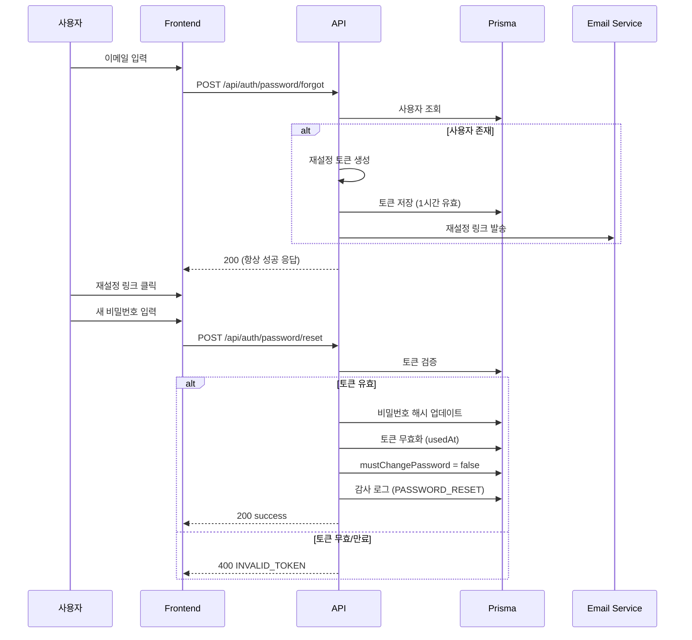

# 상세설계: TSK-02-03 비밀번호 변경/찾기/재설정

**Template Version:** 3.0.0 — **Last Updated:** 2026-01-26

---

## 0. 문서 메타데이터

| 항목 | 내용 |
|------|------|
| Task ID | TSK-02-03 |
| Task명 | 비밀번호 변경/찾기/재설정 |
| Category | development |
| 상태 | [dd] 상세설계 |
| 작성일 | 2026-01-26 |
| 작성자 | Claude |

### 상위 문서 참조

| 문서 유형 | 경로 | 참조 섹션 |
|----------|------|----------|
| PRD | `.orchay/projects/auth-system/prd.md` | 섹션 4.1.6 |
| TRD | `.orchay/projects/auth-system/trd.md` | 섹션 3.3 |
| WBS | `.orchay/projects/auth-system/wbs.yaml` | TSK-02-03 |
| 상위 Work Package | WP-02: 인증 시스템 | - |

---

## 1. 목적 및 범위

### 1.1 목적
비밀번호 변경 및 분실 시 재설정 기능 구현

### 1.2 범위

**포함 범위**:
- POST /api/auth/password/change (비밀번호 변경)
- POST /api/auth/password/forgot (비밀번호 찾기 - 이메일 발송)
- POST /api/auth/password/reset (비밀번호 재설정)
- 비밀번호 변경 화면 (PasswordChangeForm)
- 비밀번호 재설정 화면 (PasswordResetForm)
- 비밀번호 이력 저장

**제외 범위**:
- 이메일 실제 발송 (콘솔 로그로 대체, 추후 이메일 서비스 연동)

---

## 2. 기술 스택

| 구분 | 기술 | 버전 | 용도 |
|------|------|------|------|
| Framework | Next.js | 16.x | App Router API Routes |
| Validation | zod | 4.x | 스키마 검증 |
| Password | bcrypt | 6.x | 해시/비교 |
| UI | Ant Design | 6.x | Form, Input, Button |
| Token | crypto | Node.js built-in | 재설정 토큰 생성 |

---

## 3. 인터페이스 계약 (API Contract)

### 3.1 엔드포인트 목록

| Method | Endpoint | 설명 | 인증 필요 |
|--------|----------|------|----------|
| POST | /api/auth/password/change | 비밀번호 변경 | Yes |
| POST | /api/auth/password/forgot | 비밀번호 찾기 | No |
| POST | /api/auth/password/reset | 비밀번호 재설정 | No |

### 3.2 POST /api/auth/password/change

#### 요청
| 파라미터 | 타입 | 필수 | 설명 |
|----------|------|------|------|
| currentPassword | string | Y | 현재 비밀번호 |
| newPassword | string | Y | 새 비밀번호 |
| confirmPassword | string | Y | 새 비밀번호 확인 |

#### 응답 (성공 200)
```json
{ "success": true }
```

#### 에러 응답

| 코드 | 에러 코드 | 설명 |
|------|----------|------|
| 400 | VALIDATION_ERROR | 필수 필드 누락/형식 오류 |
| 400 | PASSWORD_MISMATCH | 새 비밀번호 확인 불일치 |
| 400 | PASSWORD_POLICY_VIOLATION | 비밀번호 정책 미충족 |
| 400 | PASSWORD_REUSED | 이전 비밀번호 재사용 |
| 401 | INVALID_CURRENT_PASSWORD | 현재 비밀번호 불일치 |
| 401 | UNAUTHORIZED | 인증 필요 |

### 3.3 POST /api/auth/password/forgot

#### 요청
| 파라미터 | 타입 | 필수 | 설명 |
|----------|------|------|------|
| email | string | Y | 가입 이메일 |

#### 응답 (성공 200)
```json
{
  "success": true,
  "message": "비밀번호 재설정 이메일이 발송되었습니다."
}
```

**Note**: 보안상 이메일 존재 여부와 관계없이 동일한 응답 반환

### 3.4 POST /api/auth/password/reset

#### 요청
| 파라미터 | 타입 | 필수 | 설명 |
|----------|------|------|------|
| token | string | Y | 재설정 토큰 |
| newPassword | string | Y | 새 비밀번호 |
| confirmPassword | string | Y | 새 비밀번호 확인 |

#### 응답 (성공 200)
```json
{ "success": true }
```

#### 에러 응답

| 코드 | 에러 코드 | 설명 |
|------|----------|------|
| 400 | INVALID_TOKEN | 토큰 유효하지 않음 |
| 400 | TOKEN_EXPIRED | 토큰 만료 (1시간) |
| 400 | PASSWORD_POLICY_VIOLATION | 비밀번호 정책 미충족 |

---

## 4. 프로세스 흐름

### 4.1 비밀번호 변경 플로우



### 4.2 비밀번호 찾기/재설정 플로우



---

## 5. UI 설계

### 5.1 비밀번호 변경 화면

```
┌─────────────────────────────────────────────────────────────┐
│                    비밀번호 변경                            │
├─────────────────────────────────────────────────────────────┤
│                                                             │
│  현재 비밀번호                                              │
│  [_______________________________________________]          │
│                                                             │
│  새 비밀번호                                                │
│  [_______________________________________________]          │
│  ○ 8자 이상  ○ 대문자  ○ 소문자  ○ 숫자  ○ 특수문자       │
│                                                             │
│  새 비밀번호 확인                                           │
│  [_______________________________________________]          │
│                                                             │
│  [        비밀번호 변경        ]                            │
│                                                             │
└─────────────────────────────────────────────────────────────┘
```

### 5.2 비밀번호 재설정 화면

```
┌─────────────────────────────────────────────────────────────┐
│                    비밀번호 재설정                          │
├─────────────────────────────────────────────────────────────┤
│                                                             │
│  새 비밀번호                                                │
│  [_______________________________________________]          │
│  ○ 8자 이상  ○ 대문자  ○ 소문자  ○ 숫자  ○ 특수문자       │
│                                                             │
│  새 비밀번호 확인                                           │
│  [_______________________________________________]          │
│                                                             │
│  [        비밀번호 재설정        ]                          │
│                                                             │
└─────────────────────────────────────────────────────────────┘
```

### 5.3 data-testid

| data-testid | 요소 |
|-------------|------|
| password-change-form | 비밀번호 변경 폼 |
| current-password-input | 현재 비밀번호 |
| new-password-input | 새 비밀번호 |
| confirm-password-input | 비밀번호 확인 |
| password-change-button | 변경 버튼 |
| password-reset-form | 재설정 폼 |
| password-reset-button | 재설정 버튼 |
| password-strength-indicator | 강도 표시 |

---

## 6. 데이터 모델

### 6.1 PasswordResetToken (Prisma 스키마 확장 필요)

```prisma
model PasswordResetToken {
  id        Int       @id @default(autoincrement())
  userId    Int
  token     String    @unique
  expiresAt DateTime
  usedAt    DateTime?
  createdAt DateTime  @default(now())

  user      User      @relation(fields: [userId], references: [id])
}
```

---

## 7. 구현 체크리스트

### Backend
- [ ] PasswordResetToken 모델 추가 (Prisma)
- [ ] POST /api/auth/password/change 구현
- [ ] POST /api/auth/password/forgot 구현
- [ ] POST /api/auth/password/reset 구현
- [ ] 비밀번호 이력 저장 로직

### Frontend
- [ ] PasswordChangeForm 컴포넌트
- [ ] PasswordResetForm 컴포넌트
- [ ] /settings/password 페이지
- [ ] /reset-password 페이지

---

## 8. 다음 단계

- `/wf:build TSK-02-03` 명령어로 TDD 기반 구현 진행
