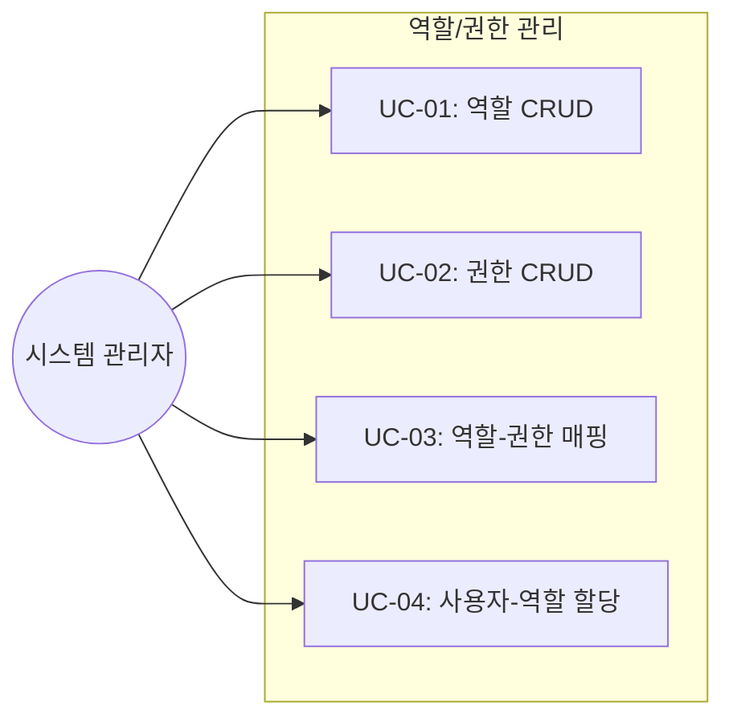

# TSK-03-01 - 역할/권한 CRUD API 설계 문서

## 문서 정보

| 항목 | 내용 |
|------|------|
| Task ID | TSK-03-01 |
| 문서 버전 | 1.0 |
| 작성일 | 2026-01-26 |
| 상태 | 작성중 |
| 카테고리 | development |

---

## 1. 개요

### 1.1 배경 및 문제 정의

**현재 상황:**
- 기본 역할/권한 시드 데이터만 존재
- 역할/권한 관리 API 미구현

**해결하려는 문제:**
- RBAC 기반 역할/권한 관리 시스템 필요
- 동적 역할 생성 및 권한 매핑 필요

### 1.2 목적 및 기대 효과

**목적:**
- 역할(Role) CRUD API 구현
- 권한(Permission) CRUD API 구현
- 역할-권한 매핑 API 구현
- 사용자-역할 할당 API 구현

**기대 효과:**
- 관리자가 동적으로 역할/권한 관리 가능
- 유연한 접근 제어 체계 구축

### 1.3 범위

**포함:**
- GET/POST/PUT/DELETE /api/roles
- GET/POST/PUT/DELETE /api/permissions
- PUT /api/roles/:id/permissions (역할-권한 매핑)
- PUT /api/users/:id/roles (사용자-역할 할당)

**제외:**
- CASL 기반 미들웨어 → TSK-03-02
- usePermission Hook → TSK-03-03

### 1.4 참조 문서

| 문서 | 경로 | 관련 섹션 |
|------|------|----------|
| PRD | `.orchay/projects/auth-system/prd.md` | 4.2.1, 4.2.2, 4.2.3 |
| TRD | `.orchay/projects/auth-system/trd.md` | 3.3 |

---

## 2. 사용자 분석

### 2.1 대상 사용자

| 사용자 유형 | 특성 | 주요 니즈 |
|------------|------|----------|
| 시스템 관리자 | SYSTEM_ADMIN 역할 | 역할/권한 전체 관리 |
| 보안 관리자 | SECURITY_ADMIN 역할 | 권한 매핑 관리 |

---

## 3. 유즈케이스

### 3.1 유즈케이스 다이어그램



### 3.2 유즈케이스 상세

#### UC-01: 역할 CRUD

| 항목 | 내용 |
|------|------|
| 액터 | 시스템 관리자 |
| 목적 | 역할 생성/조회/수정/삭제 |
| 사전 조건 | SYSTEM_ADMIN 권한 보유 |
| 사후 조건 | 역할 데이터 변경 |

**기본 흐름:**
1. 관리자가 역할 목록을 조회한다
2. 관리자가 새 역할을 생성한다
3. 관리자가 역할 정보를 수정한다
4. 관리자가 역할을 삭제한다

**예외 흐름:**
- 시스템 역할(isSystem=true) 삭제 불가
- 중복 역할 코드 생성 불가

#### UC-02: 권한 CRUD

| 항목 | 내용 |
|------|------|
| 액터 | 시스템 관리자 |
| 목적 | 권한 생성/조회/수정/삭제 |
| 사전 조건 | SYSTEM_ADMIN 권한 보유 |
| 사후 조건 | 권한 데이터 변경 |

#### UC-03: 역할-권한 매핑

| 항목 | 내용 |
|------|------|
| 액터 | 시스템/보안 관리자 |
| 목적 | 역할에 권한 할당/해제 |
| 사전 조건 | 역할 및 권한 존재 |
| 사후 조건 | RolePermission 매핑 변경 |

#### UC-04: 사용자-역할 할당

| 항목 | 내용 |
|------|------|
| 액터 | 시스템 관리자 |
| 목적 | 사용자에게 역할 할당/해제 |
| 사전 조건 | 사용자 및 역할 존재 |
| 사후 조건 | UserRole 매핑 변경 |

---

## 4. API 설계

### 4.1 엔드포인트 목록

| Method | Endpoint | 설명 | 권한 |
|--------|----------|------|------|
| GET | /api/roles | 역할 목록 조회 | role:read |
| GET | /api/roles/:id | 역할 상세 조회 | role:read |
| POST | /api/roles | 역할 생성 | role:create |
| PUT | /api/roles/:id | 역할 수정 | role:update |
| DELETE | /api/roles/:id | 역할 삭제 | role:delete |
| PUT | /api/roles/:id/permissions | 역할-권한 매핑 | role:update |
| GET | /api/permissions | 권한 목록 조회 | permission:read |
| GET | /api/permissions/:id | 권한 상세 조회 | permission:read |
| POST | /api/permissions | 권한 생성 | permission:create |
| PUT | /api/permissions/:id | 권한 수정 | permission:update |
| DELETE | /api/permissions/:id | 권한 삭제 | permission:delete |
| PUT | /api/users/:id/roles | 사용자-역할 할당 | user:update |

### 4.2 GET /api/roles

#### 요청

| 파라미터 | 타입 | 필수 | 설명 |
|----------|------|------|------|
| page | number | N | 페이지 번호 (기본 1) |
| pageSize | number | N | 페이지 크기 (기본 10) |
| search | string | N | 검색어 (코드, 이름) |
| isActive | boolean | N | 활성화 상태 필터 |

#### 응답 (200)

```json
{
  "success": true,
  "data": {
    "items": [
      {
        "id": 1,
        "code": "SYSTEM_ADMIN",
        "name": "시스템 관리자",
        "description": "모든 권한 보유",
        "parentId": null,
        "level": 0,
        "isSystem": true,
        "isActive": true,
        "permissionCount": 15,
        "userCount": 1
      }
    ],
    "total": 10,
    "page": 1,
    "pageSize": 10,
    "totalPages": 1
  }
}
```

### 4.3 POST /api/roles

#### 요청

```json
{
  "code": "QUALITY_INSPECTOR",
  "name": "품질 검사자",
  "description": "품질 검사 관련 권한",
  "parentId": 4,
  "isActive": true
}
```

#### 응답 (201)

```json
{
  "success": true,
  "data": {
    "id": 8,
    "code": "QUALITY_INSPECTOR",
    "name": "품질 검사자",
    "description": "품질 검사 관련 권한",
    "parentId": 4,
    "level": 3,
    "isSystem": false,
    "isActive": true
  }
}
```

### 4.4 PUT /api/roles/:id/permissions

#### 요청

```json
{
  "permissionIds": [1, 2, 3, 5, 8]
}
```

#### 응답 (200)

```json
{
  "success": true,
  "data": {
    "roleId": 8,
    "permissions": [
      { "id": 1, "code": "user:read", "name": "사용자 조회" },
      { "id": 2, "code": "user:create", "name": "사용자 생성" }
    ]
  }
}
```

### 4.5 PUT /api/users/:id/roles

#### 요청

```json
{
  "roleIds": [2, 5]
}
```

#### 응답 (200)

```json
{
  "success": true,
  "data": {
    "userId": 10,
    "roles": [
      { "id": 2, "code": "SECURITY_ADMIN", "name": "보안 관리자" },
      { "id": 5, "code": "QUALITY_MANAGER", "name": "품질 관리자" }
    ]
  }
}
```

---

## 5. 데이터 모델

### 5.1 관련 엔티티

| 엔티티 | 설명 |
|--------|------|
| Role | 역할 |
| Permission | 권한 |
| RolePermission | 역할-권한 매핑 |
| UserRole | 사용자-역할 매핑 |

### 5.2 DTO

#### CreateRoleDto

```typescript
interface CreateRoleDto {
  code: string       // 필수, 유일
  name: string       // 필수
  description?: string
  parentId?: number
  isActive?: boolean // 기본 true
}
```

#### UpdateRoleDto

```typescript
interface UpdateRoleDto {
  name?: string
  description?: string
  parentId?: number
  isActive?: boolean
}
```

#### CreatePermissionDto

```typescript
interface CreatePermissionDto {
  code: string       // 필수, 유일
  name: string       // 필수
  type: 'MENU' | 'SCREEN' | 'API' | 'DATA'
  resource: string
  action: 'CREATE' | 'READ' | 'UPDATE' | 'DELETE'
  description?: string
  isActive?: boolean // 기본 true
}
```

---

## 6. 비즈니스 규칙

### 6.1 핵심 규칙

| 규칙 ID | 규칙 설명 | 적용 상황 | 예외 |
|---------|----------|----------|------|
| BR-03-01 | 시스템 역할 삭제 불가 | DELETE /api/roles/:id | SYSTEM_ADMIN만 예외 허용 불가 |
| BR-03-02 | 중복 코드 불가 | POST /api/roles | - |
| BR-03-03 | 역할 계층 레벨 자동 계산 | POST /api/roles | parentId 기반 |
| BR-03-04 | 하위 역할 권한 자동 상속 | 권한 체크 시 | - |

### 6.2 규칙 상세 설명

**BR-03-01: 시스템 역할 삭제 불가**

isSystem=true인 역할은 삭제할 수 없음. 이는 핵심 시스템 역할 보호를 위함.

**BR-03-03: 역할 계층 레벨 자동 계산**

parentId가 지정되면 부모 역할의 level + 1로 자동 설정.

---

## 7. 에러 처리

### 7.1 예상 에러 상황

| 상황 | 코드 | 메시지 | 복구 방법 |
|------|------|--------|----------|
| 역할 없음 | ROLE_NOT_FOUND | 역할을 찾을 수 없습니다 | ID 확인 |
| 시스템 역할 삭제 | SYSTEM_ROLE_DELETE | 시스템 역할은 삭제할 수 없습니다 | - |
| 중복 코드 | DUPLICATE_CODE | 이미 존재하는 코드입니다 | 다른 코드 사용 |
| 권한 없음 | UNAUTHORIZED | 권한이 없습니다 | 관리자 문의 |

---

## 8. 구현 체크리스트

### Backend

- [ ] GET /api/roles 구현
- [ ] GET /api/roles/:id 구현
- [ ] POST /api/roles 구현
- [ ] PUT /api/roles/:id 구현
- [ ] DELETE /api/roles/:id 구현
- [ ] PUT /api/roles/:id/permissions 구현
- [ ] GET /api/permissions 구현
- [ ] GET /api/permissions/:id 구현
- [ ] POST /api/permissions 구현
- [ ] PUT /api/permissions/:id 구현
- [ ] DELETE /api/permissions/:id 구현
- [ ] PUT /api/users/:id/roles 구현

### 테스트

- [ ] 역할 CRUD 단위 테스트
- [ ] 권한 CRUD 단위 테스트
- [ ] 역할-권한 매핑 테스트
- [ ] 사용자-역할 할당 테스트

---

## 9. 연관 문서

| 문서 | 경로 | 용도 |
|------|------|------|
| 요구사항 추적 매트릭스 | `025-traceability-matrix.md` | PRD → 설계 → 테스트 양방향 추적 |
| 테스트 명세서 | `026-test-specification.md` | 단위/E2E/매뉴얼 테스트 상세 정의 |

---

## 변경 이력

| 버전 | 일자 | 작성자 | 변경 내용 |
|------|------|--------|----------|
| 1.0 | 2026-01-26 | Claude | 최초 작성 |
