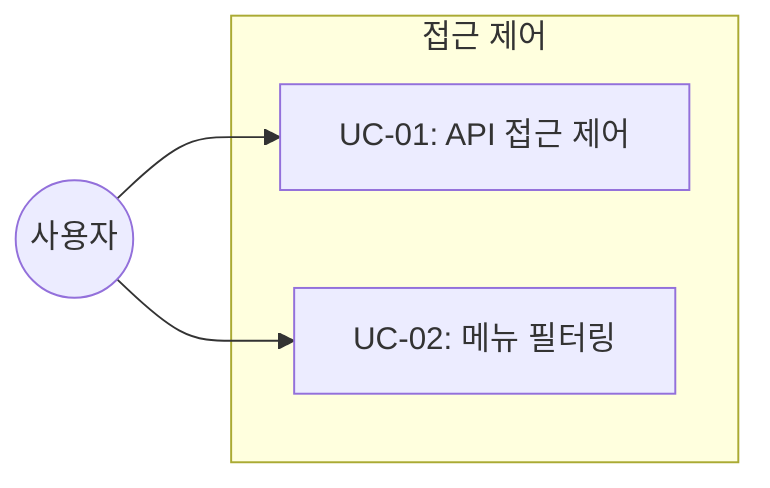

# TSK-03-02 - 메뉴/API 접근 제어 미들웨어 설계 문서

## 문서 정보

| 항목 | 내용 |
|------|------|
| Task ID | TSK-03-02 |
| 문서 버전 | 1.0 |
| 작성일 | 2026-01-26 |
| 상태 | 작성중 |
| 카테고리 | development |

---

## 1. 개요

### 1.1 배경 및 문제 정의

**현재 상황:**
- 역할/권한 CRUD API 구현 완료 (TSK-03-01)
- 메뉴/API 접근 제어 미적용

**해결하려는 문제:**
- API 엔드포인트별 권한 체크 필요
- 메뉴 표시 권한 필터링 필요
- CASL 기반 동적 권한 체크 시스템 필요

### 1.2 목적 및 기대 효과

**목적:**
- CASL Ability 기반 권한 체크 구현
- Next.js Middleware 권한 체크 구현
- 권한 기반 메뉴 필터링 구현

**기대 효과:**
- 권한 없는 API 접근 차단 (403)
- 권한 기반 메뉴 동적 표시
- 일관된 권한 체크 로직 적용

### 1.3 범위

**포함:**
- CASL Ability 정의 (`lib/auth/ability.ts`)
- Next.js Middleware 권한 체크 (`middleware.ts`)
- 권한 기반 메뉴 필터링 (`getAuthorizedMenus`)
- 403 Forbidden 응답 처리

**제외:**
- usePermission Hook → TSK-03-03
- PermissionGuard 컴포넌트 → TSK-03-03

### 1.4 참조 문서

| 문서 | 경로 | 관련 섹션 |
|------|------|----------|
| PRD | `.orchay/projects/auth-system/prd.md` | 4.2.5, 4.2.7 |
| TRD | `.orchay/projects/auth-system/trd.md` | 3.3 |

---

## 2. 사용자 분석

### 2.1 대상 사용자

| 사용자 유형 | 특성 | 주요 니즈 |
|------------|------|----------|
| 개발자 | 권한 체크 로직 사용 | 간단한 API로 권한 체크 |
| 시스템 관리자 | 권한 관리 | API/메뉴 접근 제어 |

---

## 3. 유즈케이스

### 3.1 유즈케이스 다이어그램



### 3.2 유즈케이스 상세

#### UC-01: API 접근 제어

| 항목 | 내용 |
|------|------|
| 액터 | 인증된 사용자 |
| 목적 | 권한 기반 API 접근 제어 |
| 사전 조건 | 사용자 인증 완료 |
| 사후 조건 | 허용/거부 결정 |

**기본 흐름:**
1. 사용자가 API 요청을 보낸다
2. 미들웨어가 JWT에서 권한 정보를 추출한다
3. CASL로 권한을 체크한다
4. 권한이 있으면 요청을 진행한다

**예외 흐름:**
- 3a. 권한이 없으면 403 Forbidden을 반환한다

#### UC-02: 메뉴 필터링

| 항목 | 내용 |
|------|------|
| 액터 | 인증된 사용자 |
| 목적 | 권한 기반 메뉴 표시 |
| 사전 조건 | 사용자 인증 완료 |
| 사후 조건 | 허용된 메뉴만 표시 |

**기본 흐름:**
1. 사용자가 메뉴 목록을 요청한다
2. 시스템이 사용자의 역할/권한을 조회한다
3. 허용된 메뉴만 필터링하여 반환한다

---

## 4. 기술 설계

### 4.1 CASL Ability 구조

```typescript
// lib/auth/ability.ts
import { defineAbility, AbilityBuilder, PureAbility } from '@casl/ability'

type Actions = 'create' | 'read' | 'update' | 'delete' | 'manage'
type Subjects = 'User' | 'Role' | 'Permission' | 'Menu' | 'all'

export type AppAbility = PureAbility<[Actions, Subjects]>

export function defineAbilityFor(permissions: string[]): AppAbility {
  const { can, cannot, build } = new AbilityBuilder<AppAbility>(PureAbility)

  // 권한 코드에서 Ability 규칙 생성
  permissions.forEach((permission) => {
    const [resource, action] = permission.split(':')
    can(action as Actions, resource as Subjects)
  })

  return build()
}
```

### 4.2 Middleware 권한 체크

```typescript
// middleware.ts
import { NextResponse } from 'next/server'
import type { NextRequest } from 'next/server'
import { getToken } from 'next-auth/jwt'

// API 경로별 필요 권한 매핑
const API_PERMISSIONS: Record<string, { action: string; resource: string }> = {
  'POST /api/roles': { action: 'create', resource: 'Role' },
  'PUT /api/roles/*': { action: 'update', resource: 'Role' },
  'DELETE /api/roles/*': { action: 'delete', resource: 'Role' },
  // ... 추가 매핑
}

export async function middleware(request: NextRequest) {
  const token = await getToken({ req: request })

  // API 권한 체크
  if (request.nextUrl.pathname.startsWith('/api/')) {
    const permissionKey = `${request.method} ${request.nextUrl.pathname}`
    const required = findRequiredPermission(permissionKey)

    if (required && !hasPermission(token?.permissions, required)) {
      return NextResponse.json(
        { success: false, error: { code: 'FORBIDDEN', message: '권한이 없습니다' } },
        { status: 403 }
      )
    }
  }

  return NextResponse.next()
}
```

### 4.3 메뉴 필터링

```typescript
// lib/auth/menu-filter.ts
export async function getAuthorizedMenus(
  userId: number
): Promise<MenuItem[]> {
  // 1. 사용자의 역할 조회
  const user = await prisma.user.findUnique({
    where: { id: userId },
    include: {
      userRoles: {
        include: {
          role: {
            include: {
              roleMenus: {
                include: { menu: true }
              }
            }
          }
        }
      }
    }
  })

  // 2. 허용된 메뉴 ID 수집
  const allowedMenuIds = new Set<number>()
  user?.userRoles.forEach(ur => {
    ur.role.roleMenus.forEach(rm => {
      allowedMenuIds.add(rm.menuId)
    })
  })

  // 3. 메뉴 트리 필터링 (부모 메뉴 자동 포함)
  return filterMenuTree(allMenus, allowedMenuIds)
}
```

### 4.4 에러 응답 형식

```json
{
  "success": false,
  "error": {
    "code": "FORBIDDEN",
    "message": "권한이 없습니다",
    "requiredPermission": "role:create"
  }
}
```

---

## 5. 파일 구조

```
lib/
├── auth/
│   ├── ability.ts          # CASL Ability 정의
│   ├── menu-filter.ts      # 메뉴 필터링 유틸
│   └── __tests__/
│       ├── ability.test.ts
│       └── menu-filter.test.ts
middleware.ts               # Next.js 미들웨어
```

---

## 6. 비즈니스 규칙

### 6.1 핵심 규칙

| 규칙 ID | 규칙 설명 | 적용 상황 |
|---------|----------|----------|
| BR-03-04 | 하위 역할 권한 자동 상속 | 권한 체크 시 |
| BR-03-05 | 부모 메뉴 자동 포함 | 메뉴 필터링 시 |

### 6.2 규칙 상세 설명

**BR-03-04: 하위 역할 권한 자동 상속**

부모 역할이 가진 권한은 자식 역할에게 자동 상속됩니다.

**BR-03-05: 부모 메뉴 자동 포함**

자식 메뉴에 대한 권한이 있으면 부모 메뉴도 자동으로 표시됩니다.

---

## 7. 에러 처리

### 7.1 예상 에러 상황

| 상황 | 코드 | 메시지 | 복구 방법 |
|------|------|--------|----------|
| 권한 없음 | FORBIDDEN | 권한이 없습니다 | 관리자 문의 |
| 토큰 만료 | TOKEN_EXPIRED | 인증이 만료되었습니다 | 재로그인 |
| 잘못된 토큰 | INVALID_TOKEN | 유효하지 않은 인증입니다 | 재로그인 |

---

## 8. 구현 체크리스트

### Backend

- [ ] CASL Ability 정의 (`lib/auth/ability.ts`)
- [ ] Next.js Middleware 권한 체크 (`middleware.ts`)
- [ ] 메뉴 필터링 유틸 (`lib/auth/menu-filter.ts`)
- [ ] 403 Forbidden 응답 처리

### 테스트

- [ ] CASL Ability 단위 테스트
- [ ] 미들웨어 권한 체크 테스트
- [ ] 메뉴 필터링 테스트

---

## 9. 연관 문서

| 문서 | 경로 | 용도 |
|------|------|------|
| 요구사항 추적 매트릭스 | `025-traceability-matrix.md` | PRD → 설계 → 테스트 양방향 추적 |
| 테스트 명세서 | `026-test-specification.md` | 단위/E2E/매뉴얼 테스트 상세 정의 |

---

## 변경 이력

| 버전 | 일자 | 작성자 | 변경 내용 |
|------|------|--------|----------|
| 1.0 | 2026-01-26 | Claude | 최초 작성 |
