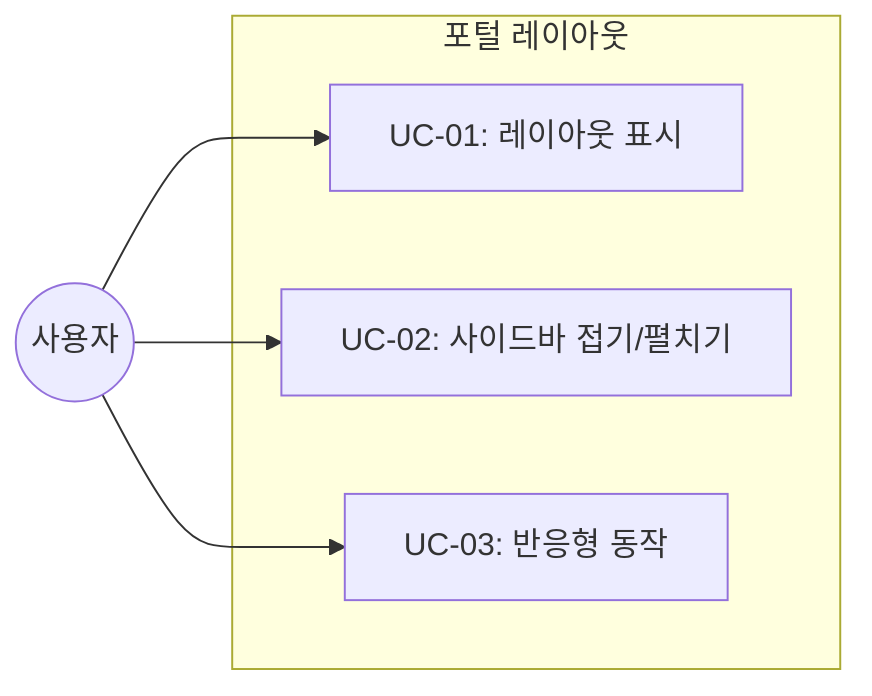
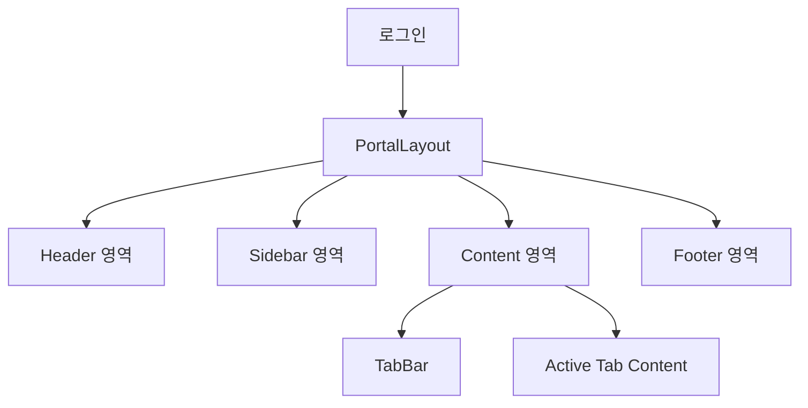

# TSK-01-01 - 레이아웃 컴포넌트 구조 설계 문서

## 문서 정보

| 항목 | 내용 |
|------|------|
| Task ID | TSK-01-01 |
| 문서 버전 | 1.0 |
| 작성일 | 2026-01-20 |
| 상태 | 작성중 |
| 카테고리 | development |

---

## 1. 개요

### 1.1 배경 및 문제 정의

**현재 상황:**
- MES Portal 프로젝트 초기 단계
- 기본 Next.js 프로젝트 구조만 존재 (TSK-00-01, TSK-00-02 선행 필요)
- 포털 레이아웃 구조가 정의되어 있지 않음

**해결하려는 문제:**
- 일관된 포털 레이아웃 구조 필요
- 헤더, 사이드바, 컨텐츠, 푸터 영역의 명확한 분리 필요
- MDI 탭 바를 수용할 수 있는 유연한 구조 필요

### 1.2 목적 및 기대 효과

**목적:**
- MES Portal의 기본 레이아웃 구조 컴포넌트 구현
- Ant Design Layout 컴포넌트 기반 표준 레이아웃 제공

**기대 효과:**
- 모든 포털 화면에서 일관된 레이아웃 적용
- CSS Variables를 통한 유연한 크기 조절
- 반응형 지원으로 다양한 디바이스 대응

### 1.3 범위

**포함:**
- PortalLayout 컴포넌트 생성
- Ant Design Layout 컴포넌트 활용 (Layout, Header, Sider, Content, Footer)
- 레이아웃 영역 분리
- CSS Variables 기반 크기 정의
- 기본 반응형 동작 (사이드바 접힘)

**제외:**
- 헤더 내부 컴포넌트 (TSK-01-02에서 구현)
- 사이드바 메뉴 (TSK-01-03에서 구현)
- 푸터 내부 컴포넌트 (TSK-01-04에서 구현)
- MDI 탭 바 (WP-02에서 구현)

### 1.4 참조 문서

| 문서 | 경로 | 관련 섹션 |
|------|------|----------|
| PRD | `.orchay/projects/mes-portal/prd.md` | 4.1.1 포털 화면 설계 |
| TRD | `.orchay/projects/mes-portal/trd.md` | 1.2 UI/스타일링 스택, 5. 프로젝트 구조 |

---

## 2. 사용자 분석

### 2.1 대상 사용자

| 사용자 유형 | 특성 | 주요 니즈 |
|------------|------|----------|
| 공장장/관리자 | 전체 생산 현황 관리, 데스크톱 주 사용 | 넓은 화면에서 다중 화면 동시 확인 |
| 생산 담당자 | 라인별 생산 관리, 태블릿/데스크톱 혼용 | 빠른 메뉴 접근, 작업 화면 전환 |
| 품질/설비 담당자 | 현장 모니터링, 태블릿 위주 | 터치 친화적 인터페이스 |

### 2.2 사용자 페르소나

**페르소나 1: 생산관리 팀장**
- 역할: 생산 현황 모니터링 및 의사결정
- 목표: 실시간 생산 현황 파악, 빠른 화면 전환
- 불만: 여러 화면을 오가며 정보 확인하는 번거로움
- 시나리오: 대시보드를 보면서 동시에 라인별 상세 현황 확인

---

## 3. 유즈케이스

### 3.1 유즈케이스 다이어그램



### 3.2 유즈케이스 상세

#### UC-01: 레이아웃 표시

| 항목 | 내용 |
|------|------|
| 액터 | 모든 사용자 |
| 목적 | 포털 기본 레이아웃 표시 |
| 사전 조건 | 사용자 로그인 완료 |
| 사후 조건 | 레이아웃 영역 모두 표시 |
| 트리거 | 포털 페이지 접근 |

**기본 흐름:**
1. 사용자가 포털 페이지에 접근한다
2. 시스템이 PortalLayout 컴포넌트를 렌더링한다
3. 헤더, 사이드바, 컨텐츠, 푸터 영역이 표시된다
4. 각 영역에 해당 컴포넌트가 렌더링된다

#### UC-02: 사이드바 접기/펼치기

| 항목 | 내용 |
|------|------|
| 액터 | 모든 사용자 |
| 목적 | 컨텐츠 영역 확장/축소 |
| 사전 조건 | 레이아웃 표시 상태 |
| 사후 조건 | 사이드바 상태 변경 |
| 트리거 | 토글 버튼 클릭 |

**기본 흐름:**
1. 사용자가 사이드바 토글 버튼을 클릭한다
2. 시스템이 사이드바 상태를 전환한다 (펼침 ↔ 접힘)
3. 사이드바 너비가 변경된다 (240px ↔ 60px)
4. 컨텐츠 영역이 자동으로 조절된다

---

## 4. 사용자 시나리오

### 4.1 시나리오 1: 포털 첫 진입

**상황 설명:**
사용자가 로그인 후 처음 포털에 진입하는 상황

**단계별 진행:**

| 단계 | 사용자 행동 | 시스템 반응 | 사용자 기대 |
|------|-----------|------------|------------|
| 1 | 로그인 완료 | 포털 페이지로 리다이렉트 | 메인 화면 표시 |
| 2 | 화면 확인 | 레이아웃 렌더링 완료 | 헤더/사이드바/컨텐츠/푸터 표시 |
| 3 | 메뉴 확인 | 사이드바에 메뉴 트리 표시 | 접근 가능한 메뉴 확인 |

**성공 조건:**
- 모든 레이아웃 영역이 정상 표시
- 각 영역의 크기가 설계대로 적용

### 4.2 시나리오 2: 컨텐츠 영역 확장

**상황 설명:**
사용자가 더 넓은 컨텐츠 영역이 필요한 상황

**단계별 진행:**

| 단계 | 사용자 행동 | 시스템 반응 | 사용자 기대 |
|------|-----------|------------|------------|
| 1 | 사이드바 접기 버튼 클릭 | 사이드바 축소 (240px → 60px) | 컨텐츠 영역 확장 |
| 2 | 아이콘만 표시된 사이드바 확인 | 메뉴명 숨김, 아이콘만 표시 | 메뉴 아이콘으로 식별 가능 |
| 3 | 메뉴 아이콘 호버 | 툴팁으로 메뉴명 표시 | 메뉴명 확인 가능 |

---

## 5. 화면 설계

### 5.1 화면 흐름도



### 5.2 화면별 상세

#### 화면 1: 포털 레이아웃

**화면 목적:**
MES Portal의 기본 레이아웃 구조를 제공하여 일관된 사용자 경험 제공

**진입 경로:**
- 로그인 후 자동 진입
- /portal/* 경로 접근 시

**와이어프레임:**
```
┌─────────────────────────────────────────────────────────────────────────┐
│                              HEADER (60px)                               │
│  ┌──────┬────────────────────────────────────────────────────┬────────┐ │
│  │ Logo │ [Slot: QuickMenu | Breadcrumb]           [Slot: R] │        │ │
│  └──────┴────────────────────────────────────────────────────┴────────┘ │
├─────────┬───────────────────────────────────────────────────────────────┤
│         │                    TAB BAR (40px)                              │
│ SIDEBAR │  ┌─────────────────────────────────────────────────────────┐  │
│ (240px) │  │ [Slot: MDI Tabs]                                        │  │
│         │  └─────────────────────────────────────────────────────────┘  │
│ ┌─────┐ ├───────────────────────────────────────────────────────────────┤
│ │     │ │                                                               │
│ │Slot:│ │                     CONTENT AREA                              │
│ │Menu │ │                                                               │
│ │     │ │              [Slot: Active Tab Content]                       │
│ │     │ │                                                               │
│ │     │ │                    (flex-grow: 1)                             │
│ │     │ │                                                               │
│ └─────┘ │                                                               │
│[Toggle] │                                                               │
├─────────┴───────────────────────────────────────────────────────────────┤
│                              FOOTER (30px)                               │
│              [Slot: Copyright]                    [Slot: Version]        │
└─────────────────────────────────────────────────────────────────────────┘
```

**화면 요소 설명:**

| 영역 | 설명 | CSS Variable | Ant Design 컴포넌트 |
|------|------|--------------|-------------------|
| Header | 상단 고정 헤더 | `--header-height: 60px` | `Layout.Header` |
| Sidebar | 좌측 네비게이션 | `--sidebar-width: 240px` / `--sidebar-collapsed-width: 60px` | `Layout.Sider` |
| TabBar | MDI 탭 영역 | `--tab-bar-height: 40px` | 커스텀 |
| Content | 메인 컨텐츠 | flex-grow: 1 | `Layout.Content` |
| Footer | 하단 푸터 | `--footer-height: 30px` | `Layout.Footer` |

### 5.3 반응형 동작

| 화면 크기 | 레이아웃 변화 | 사용자 경험 |
|----------|--------------|------------|
| 데스크톱 (1024px+) | 사이드바 펼침 상태 기본 | 풀 네비게이션 표시 |
| 태블릿 (768-1023px) | 사이드바 접힘 상태 기본 | 아이콘 네비게이션, 호버 시 확장 |
| 모바일 (767px-) | 사이드바 오버레이 또는 드로어 | 햄버거 메뉴로 토글 |

---

## 6. 인터랙션 설계

### 6.1 사용자 액션과 피드백

| 사용자 액션 | 즉각 피드백 | 결과 피드백 |
|------------|-----------|------------|
| 사이드바 토글 클릭 | 버튼 눌림 효과 | 사이드바 애니메이션 전환 |
| 화면 크기 변경 | 실시간 레이아웃 조절 | 반응형 상태 적용 |

### 6.2 상태별 화면 변화

| 상태 | 화면 표시 | 전환 애니메이션 |
|------|----------|---------------|
| 사이드바 펼침 | 너비 240px, 메뉴명 표시 | width transition 0.2s |
| 사이드바 접힘 | 너비 60px, 아이콘만 표시 | width transition 0.2s |

---

## 7. 데이터 요구사항

### 7.1 필요한 데이터

| 데이터 | 설명 | 출처 | 용도 |
|--------|------|------|------|
| sidebarCollapsed | 사이드바 접힘 상태 | 로컬 상태/localStorage | 사이드바 렌더링 |
| breakpoint | 현재 화면 크기 | window resize | 반응형 동작 |

### 7.2 상태 관리

```typescript
interface LayoutState {
  sidebarCollapsed: boolean;
  breakpoint: 'mobile' | 'tablet' | 'desktop';
}
```

---

## 8. 비즈니스 규칙

### 8.1 핵심 규칙

| 규칙 ID | 규칙 설명 | 적용 상황 |
|---------|----------|----------|
| BR-01 | 사이드바 상태는 세션 간 유지 | 페이지 새로고침/재접속 시 |
| BR-02 | 모바일에서는 사이드바 기본 접힘 | 화면 너비 767px 이하 |
| BR-03 | 컨텐츠 영역은 항상 스크롤 가능 | 컨텐츠가 화면 초과 시 |

---

## 9. 에러 처리

### 9.1 예상 에러 상황

| 상황 | 원인 | 대응 |
|------|------|------|
| 레이아웃 렌더링 실패 | 컴포넌트 에러 | ErrorBoundary로 폴백 UI |
| CSS Variables 미적용 | 브라우저 미지원 | fallback 값 제공 |

---

## 10. 연관 문서

| 문서 | 경로 | 용도 |
|------|------|------|
| 요구사항 추적 매트릭스 | `025-traceability-matrix.md` | PRD → 설계 → 테스트 추적 |
| 테스트 명세서 | `026-test-specification.md` | 테스트 케이스 정의 |

---

## 11. 구현 범위

### 11.1 영향받는 영역

| 영역 | 변경 내용 | 영향도 |
|------|----------|--------|
| components/layout/ | PortalLayout 컴포넌트 신규 생성 | 높음 |
| app/(portal)/layout.tsx | PortalLayout 적용 | 높음 |
| app/globals.css | CSS Variables 추가 | 중간 |

### 11.2 의존성

| 의존 항목 | 이유 | 상태 |
|----------|------|------|
| TSK-00-01 (Next.js 프로젝트 생성) | 프로젝트 기본 구조 필요 | 대기 |
| TSK-00-02 (UI 라이브러리 설정) | Ant Design Layout 컴포넌트 필요 | 대기 |

### 11.3 파일 구조

```
mes-portal/
├── app/
│   ├── (portal)/
│   │   └── layout.tsx          # PortalLayout 적용
│   └── globals.css             # CSS Variables 추가
├── components/
│   └── layout/
│       ├── PortalLayout.tsx    # 메인 레이아웃 컴포넌트
│       ├── Header.tsx          # 헤더 슬롯 (TSK-01-02)
│       ├── Sidebar.tsx         # 사이드바 슬롯 (TSK-01-03)
│       └── Footer.tsx          # 푸터 슬롯 (TSK-01-04)
```

---

## 12. 구현 명세

### 12.1 PortalLayout 컴포넌트

```typescript
// components/layout/PortalLayout.tsx
'use client';

import { Layout } from 'antd';
import { useState, ReactNode } from 'react';

const { Header, Sider, Content, Footer } = Layout;

interface PortalLayoutProps {
  children: ReactNode;
  header?: ReactNode;
  sidebar?: ReactNode;
  tabBar?: ReactNode;
  footer?: ReactNode;
}

export function PortalLayout({
  children,
  header,
  sidebar,
  tabBar,
  footer,
}: PortalLayoutProps) {
  const [collapsed, setCollapsed] = useState(false);

  return (
    <Layout className="min-h-screen">
      <Header
        className="fixed top-0 left-0 right-0 z-50 flex items-center px-4"
        style={{ height: 'var(--header-height)' }}
      >
        {header}
      </Header>

      <Layout style={{ marginTop: 'var(--header-height)' }}>
        <Sider
          collapsible
          collapsed={collapsed}
          onCollapse={setCollapsed}
          width="var(--sidebar-width)"
          collapsedWidth="var(--sidebar-collapsed-width)"
          className="fixed left-0 bottom-0 z-40"
          style={{
            top: 'var(--header-height)',
            height: 'calc(100vh - var(--header-height))'
          }}
        >
          {sidebar}
        </Sider>

        <Layout
          style={{
            marginLeft: collapsed
              ? 'var(--sidebar-collapsed-width)'
              : 'var(--sidebar-width)',
            transition: 'margin-left 0.2s',
          }}
        >
          {tabBar && (
            <div style={{ height: 'var(--tab-bar-height)' }}>
              {tabBar}
            </div>
          )}

          <Content
            className="overflow-auto"
            style={{
              minHeight: `calc(100vh - var(--header-height) - var(--tab-bar-height) - var(--footer-height))`,
            }}
          >
            {children}
          </Content>

          <Footer
            className="text-center"
            style={{ height: 'var(--footer-height)', padding: '4px 16px' }}
          >
            {footer}
          </Footer>
        </Layout>
      </Layout>
    </Layout>
  );
}
```

### 12.2 CSS Variables

```css
/* app/globals.css */
:root {
  /* 레이아웃 크기 */
  --header-height: 60px;
  --sidebar-width: 240px;
  --sidebar-collapsed-width: 60px;
  --footer-height: 30px;
  --tab-bar-height: 40px;
}
```

---

## 13. 통합 검증 체크리스트

> Task 완료 시 프로젝트에 제대로 통합되었는지 확인하는 체크리스트

### 13.1 파일 존재 확인

- [ ] `mes-portal/components/layout/PortalLayout.tsx` 파일 존재
- [ ] `mes-portal/app/(portal)/layout.tsx` 파일 존재
- [ ] `mes-portal/app/globals.css`에 CSS Variables 정의

### 13.2 컴포넌트 통합 확인

- [ ] Ant Design `Layout`, `Layout.Header`, `Layout.Sider`, `Layout.Content`, `Layout.Footer` 사용
- [ ] `app/(portal)/layout.tsx`에서 `PortalLayout` import 및 적용
- [ ] 사이드바 접기/펼치기 상태 관리 동작

### 13.3 스타일 확인

- [ ] CSS Variables `--header-height: 60px` 적용
- [ ] CSS Variables `--sidebar-width: 240px` 적용
- [ ] CSS Variables `--footer-height: 30px` 적용
- [ ] 사이드바 전환 시 애니메이션 동작

### 13.4 반응형 확인

- [ ] 데스크톱 (1024px+): 사이드바 펼침 기본
- [ ] 모바일 (767px-): 사이드바 숨김 또는 오버레이

---

## 14. 체크리스트

### 14.1 설계 완료 확인

- [x] 문제 정의 및 목적 명확화
- [x] 사용자 분석 완료
- [x] 유즈케이스 정의 완료
- [x] 사용자 시나리오 작성 완료
- [x] 화면 설계 완료 (와이어프레임)
- [x] 인터랙션 설계 완료
- [x] 데이터 요구사항 정의 완료
- [x] 비즈니스 규칙 정의 완료
- [x] 에러 처리 정의 완료
- [x] 통합 검증 체크리스트 정의

### 14.2 구현 준비

- [ ] 의존성 확인 완료 (TSK-00-01, TSK-00-02 완료 필요)
- [x] 제약 사항 검토 완료

---

## 변경 이력

| 버전 | 일자 | 작성자 | 변경 내용 |
|------|------|--------|----------|
| 1.0 | 2026-01-20 | AI | 최초 작성 |
