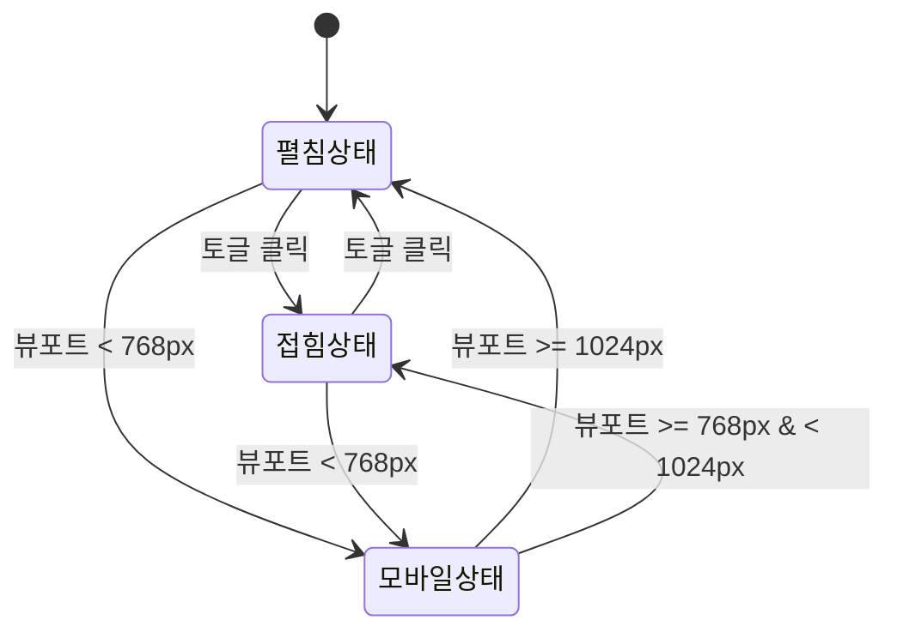

# TSK-01-01 - 레이아웃 컴포넌트 구조 UI 설계

**Version:** 1.0 — **Last Updated:** 2026-01-20

> **목적**: 포털 레이아웃 화면 설계 및 컴포넌트 구조 정의

---

## 1. 화면 목록

| 화면 ID | 화면명 | 목적 | SVG 참조 |
|---------|--------|------|----------|
| SCR-01 | 포털 레이아웃 (펼침) | 기본 레이아웃 - 사이드바 펼침 상태 | `screen-01-layout-expanded.svg` |
| SCR-02 | 포털 레이아웃 (접힘) | 기본 레이아웃 - 사이드바 접힘 상태 | `screen-02-layout-collapsed.svg` |
| SCR-03 | 포털 레이아웃 (모바일) | 반응형 - 모바일 뷰 | `screen-03-layout-mobile.svg` |

---

## 2. 화면 전환 흐름

### 2.1 상태 다이어그램



### 2.2 액션-화면 매트릭스

| 액션 | 현재 상태 | 결과 상태 | 트리거 |
|------|----------|----------|--------|
| 토글 클릭 | 펼침 | 접힘 | 사용자 |
| 토글 클릭 | 접힘 | 펼침 | 사용자 |
| 뷰포트 축소 | 펼침/접힘 | 모바일 | 시스템 |
| 뷰포트 확장 | 모바일 | 펼침 | 시스템 |

---

## 3. 화면별 상세

### 3.1 SCR-01: 포털 레이아웃 (펼침)

**화면 목적**: 기본 포털 레이아웃 - 사이드바가 펼쳐진 상태

**레이아웃 구조**:
```
┌─────────────────────────────────────────────────────────────────────────┐
│                          HEADER (60px, fixed)                            │
│  [Logo] [QuickMenu] [Breadcrumb]              [Clock] [Search] [User]   │
├─────────┬───────────────────────────────────────────────────────────────┤
│ SIDEBAR │                         TAB BAR (40px)                         │
│ (240px) │  [Tab 1] [Tab 2] [Tab 3]                                      │
│         ├───────────────────────────────────────────────────────────────┤
│ [Menu]  │                                                               │
│ [Tree]  │                     CONTENT AREA                              │
│         │                   (flex-grow: 1)                              │
│         │                                                               │
│         │                   [Active Tab Content]                        │
│         │                                                               │
│[Toggle] │                                                               │
├─────────┴───────────────────────────────────────────────────────────────┤
│                          FOOTER (30px)                                   │
│            [Copyright]                              [Version]            │
└─────────────────────────────────────────────────────────────────────────┘
```

**컴포넌트 구성**:

| 영역 | 컴포넌트 | Props | 비고 |
|------|----------|-------|------|
| Header | `Layout.Header` | `style={{ height: 60px }}` | 슬롯 |
| Sidebar | `Layout.Sider` | `width={240}, collapsible` | 토글 포함 |
| Content | `Layout.Content` | `style={{ minHeight: calc(...) }}` | 스크롤 영역 |
| Footer | `Layout.Footer` | `style={{ height: 30px }}` | 슬롯 |

**상태 관리**:
- `collapsed: false`
- `breakpoint: 'desktop'`

**사용자 액션**:

| 액션 | 요소 | 결과 |
|------|------|------|
| 토글 클릭 | Sider 토글 버튼 | SCR-02로 전환 |

---

### 3.2 SCR-02: 포털 레이아웃 (접힘)

**화면 목적**: 컨텐츠 영역 확장 - 사이드바가 접힌 상태

**레이아웃 구조**:
```
┌─────────────────────────────────────────────────────────────────────────┐
│                          HEADER (60px, fixed)                            │
│  [Logo] [QuickMenu] [Breadcrumb]              [Clock] [Search] [User]   │
├────┬────────────────────────────────────────────────────────────────────┤
│SIDE│                          TAB BAR (40px)                             │
│BAR │  [Tab 1] [Tab 2] [Tab 3]                                           │
│60px├────────────────────────────────────────────────────────────────────┤
│    │                                                                     │
│[ic]│                       CONTENT AREA (확장됨)                         │
│[ic]│                       (flex-grow: 1)                                │
│[ic]│                                                                     │
│    │                     [Active Tab Content]                            │
│    │                                                                     │
│[<>]│                                                                     │
├────┴────────────────────────────────────────────────────────────────────┤
│                          FOOTER (30px)                                   │
│            [Copyright]                              [Version]            │
└─────────────────────────────────────────────────────────────────────────┘
```

**컴포넌트 구성**:

| 영역 | 컴포넌트 | Props | 비고 |
|------|----------|-------|------|
| Sidebar | `Layout.Sider` | `collapsed={true}, collapsedWidth={60}` | 아이콘만 표시 |

**상태 관리**:
- `collapsed: true`
- `breakpoint: 'desktop'`

**사용자 액션**:

| 액션 | 요소 | 결과 |
|------|------|------|
| 토글 클릭 | Sider 토글 버튼 | SCR-01로 전환 |
| 메뉴 호버 | 사이드바 아이콘 | 툴팁으로 메뉴명 표시 |

---

### 3.3 SCR-03: 포털 레이아웃 (모바일)

**화면 목적**: 모바일 환경 최적화 레이아웃

**레이아웃 구조**:
```
┌─────────────────────────────────────────┐
│           HEADER (60px)                  │
│  [햄버거] [Logo]          [Search][User] │
├─────────────────────────────────────────┤
│              TAB BAR (40px)              │
│  [Tab 1] [Tab 2] [Tab 3] ...            │
├─────────────────────────────────────────┤
│                                         │
│            CONTENT AREA                  │
│          (전체 너비 사용)                 │
│                                         │
│         [Active Tab Content]             │
│                                         │
├─────────────────────────────────────────┤
│            FOOTER (30px)                 │
│        [Copyright] [Version]             │
└─────────────────────────────────────────┘

  ┌───────┐
  │SIDEBAR│ ← 오버레이 (Drawer)
  │(드로어)│   햄버거 클릭 시 표시
  │       │
  │[Menu] │
  │[Tree] │
  │       │
  └───────┘
```

**컴포넌트 구성**:

| 영역 | 컴포넌트 | Props | 비고 |
|------|----------|-------|------|
| Header | `Layout.Header` | - | 햄버거 메뉴 버튼 추가 |
| Sidebar | `Drawer` | `placement="left"` | 오버레이 방식 |
| Content | `Layout.Content` | - | 전체 너비 |

**상태 관리**:
- `collapsed: true` (기본 숨김)
- `breakpoint: 'mobile'`
- `drawerVisible: false`

**사용자 액션**:

| 액션 | 요소 | 결과 |
|------|------|------|
| 햄버거 클릭 | 헤더 햄버거 버튼 | Drawer 표시 |
| Drawer 닫기 | Drawer 외부 클릭/X버튼 | Drawer 숨김 |

---

## 4. 공통 컴포넌트

### 4.1 사이드바 토글 버튼

```typescript
interface ToggleButtonProps {
  collapsed: boolean;
  onClick: () => void;
}
```

**상태별 표시**:
- 펼침 상태: `<` 아이콘 (접기)
- 접힘 상태: `>` 아이콘 (펼치기)

### 4.2 햄버거 메뉴 버튼 (모바일)

```typescript
interface HamburgerButtonProps {
  onClick: () => void;
}
```

---

## 5. 반응형 설계

### 5.1 Breakpoint 정의

| Breakpoint | 너비 범위 | 레이아웃 | 사이드바 |
|------------|----------|---------|---------|
| Desktop | 1024px+ | 전체 | 펼침 (240px) |
| Tablet | 768-1023px | 전체 | 접힘 (60px) |
| Mobile | 0-767px | 단일 컬럼 | Drawer (숨김) |

### 5.2 CSS 미디어 쿼리

```css
/* Desktop (기본) */
:root {
  --sidebar-width: 240px;
}

/* Tablet */
@media (max-width: 1023px) {
  :root {
    --sidebar-width: 60px;
  }
}

/* Mobile */
@media (max-width: 767px) {
  :root {
    --sidebar-width: 0;
  }
}
```

---

## 6. 접근성

### 6.1 키보드 네비게이션

| 키 | 동작 |
|-----|------|
| Tab | 포커스 이동 |
| Enter | 버튼 활성화 |
| Escape | Drawer 닫기 (모바일) |

### 6.2 ARIA 속성

| 요소 | ARIA 속성 | 값 |
|------|----------|-----|
| Sider | `role` | `navigation` |
| Sider | `aria-expanded` | `true/false` |
| Toggle Button | `aria-label` | "사이드바 접기/펼치기" |
| Drawer | `aria-hidden` | `true/false` |

### 6.3 색상 대비

- 모든 텍스트: WCAG 2.1 AA 기준 충족 (4.5:1 이상)
- 중요 UI 요소: 3:1 이상

---

## 7. SVG 파일 목록

| 파일명 | 설명 | 뷰포트 |
|--------|------|--------|
| `screen-01-layout-expanded.svg` | 사이드바 펼침 상태 | 1280x720 |
| `screen-02-layout-collapsed.svg` | 사이드바 접힘 상태 | 1280x720 |
| `screen-03-layout-mobile.svg` | 모바일 레이아웃 | 375x667 |

---

## 관련 문서

- 설계: `010-design.md`
- 테스트 명세: `026-test-specification.md`
- 추적성 매트릭스: `025-traceability-matrix.md`
