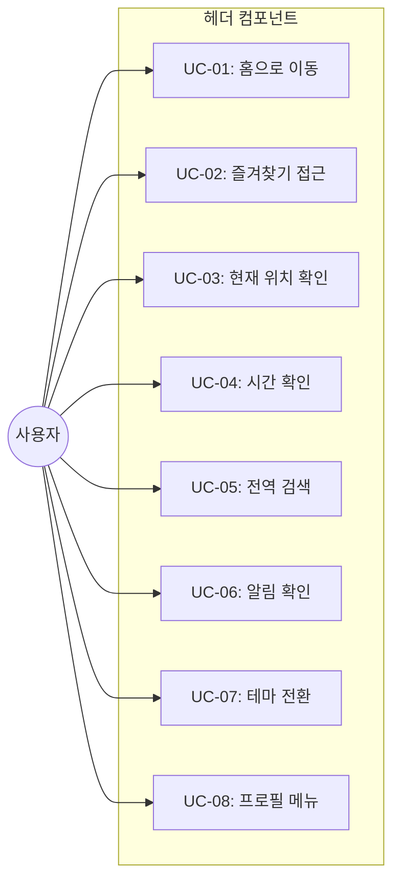

# TSK-01-02 - 헤더 컴포넌트 설계 문서

## 문서 정보

| 항목 | 내용 |
|------|------|
| Task ID | TSK-01-02 |
| 문서 버전 | 1.0 |
| 작성일 | 2026-01-20 |
| 상태 | 작성중 |
| 카테고리 | development |

---

## 1. 개요

### 1.1 배경 및 문제 정의

**현재 상황:**
- TSK-01-01에서 PortalLayout 기본 구조가 정의됨
- 헤더 영역에 대한 세부 컴포넌트가 구현되지 않음
- 사용자가 시스템을 이용하기 위한 필수 기능들(로고, 검색, 알림, 테마, 프로필)이 없음

**해결하려는 문제:**
- 포털 헤더에 필요한 모든 기능 컴포넌트 제공
- 빠른 메뉴 접근, 현재 위치 파악, 시스템 정보 표시
- 전역 검색 및 사용자 프로필 관리 기능 제공

### 1.2 목적 및 기대 효과

**목적:**
- MES Portal 헤더 컴포넌트 구현
- PRD 4.1.1 헤더(Header) 요구사항 충족

**기대 효과:**
- 사용자가 현재 위치를 항상 파악 가능 (브레드크럼)
- 전역 검색으로 빠른 메뉴/화면 접근 (Ctrl+K)
- 시스템 시계로 실시간 시간 확인
- 테마 전환으로 사용자 선호 환경 제공
- 알림 확인 및 프로필 관리 용이

### 1.3 범위

**포함:**
- 로고 영역 (클릭 시 홈 이동)
- 빠른 메뉴 버튼 (즐겨찾기 드롭다운)
- 브레드크럼 (현재 위치 경로)
- 시스템 시계 (실시간 갱신)
- 전역 검색 (Ctrl+K 단축키)
- 알림 아이콘 (뱃지)
- 테마 전환 버튼
- 사용자 프로필 드롭다운

**제외:**
- 전역 검색 모달 내부 구현 (TSK-01-05에서 상세 구현)
- 알림 패널 내부 구현 (TSK-01-06에서 상세 구현)
- 즐겨찾기 데이터 관리 (TSK-03-04에서 구현)

### 1.4 참조 문서

| 문서 | 경로 | 관련 섹션 |
|------|------|----------|
| PRD | `.orchay/projects/mes-portal/prd.md` | 4.1.1 헤더(Header) |
| TRD | `.orchay/projects/mes-portal/trd.md` | 1.2 UI/스타일링 스택, 7. PRD 요구사항 ↔ 기술 스택 매핑 |
| TSK-01-01 | `.orchay/projects/mes-portal/tasks/TSK-01-01/010-design.md` | 레이아웃 컴포넌트 구조 |

---

## 2. 사용자 분석

### 2.1 대상 사용자

| 사용자 유형 | 특성 | 주요 니즈 |
|------------|------|----------|
| 공장장/관리자 | 전체 현황 파악, 다중 화면 사용 | 빠른 메뉴 검색, 알림 확인 |
| 생산 담당자 | 빈번한 화면 전환 | 즐겨찾기 메뉴, 키보드 단축키 |
| 품질/설비 담당자 | 현장 모니터링 | 실시간 시계, 다크 모드 |

### 2.2 사용자 페르소나

**페르소나 1: 생산관리 팀장 (김팀장)**
- 역할: 생산 현황 모니터링 및 의사결정
- 목표: 여러 화면을 빠르게 전환하며 실시간 현황 파악
- 불만: 메뉴 깊숙이 있는 화면 접근이 번거로움
- 시나리오: Ctrl+K로 검색창 열어 "생산실적" 검색 후 바로 이동

**페르소나 2: 설비 관리자 (박과장)**
- 역할: 설비 상태 모니터링, 야간 근무
- 목표: 눈의 피로를 줄이며 오래 모니터링
- 불만: 밝은 화면이 야간 근무 시 불편
- 시나리오: 테마 버튼 클릭하여 다크 모드로 전환

---

## 3. 유즈케이스

### 3.1 유즈케이스 다이어그램



### 3.2 유즈케이스 상세

#### UC-01: 홈으로 이동

| 항목 | 내용 |
|------|------|
| 액터 | 모든 사용자 |
| 목적 | 메인 대시보드(홈)로 빠르게 이동 |
| 사전 조건 | 로그인 상태 |
| 사후 조건 | 홈 화면 표시 |
| 트리거 | 로고 클릭 |

**기본 흐름:**
1. 사용자가 헤더 좌측의 로고를 클릭한다
2. 시스템이 "/" 경로로 네비게이션한다
3. 홈 화면(대시보드)이 표시된다

#### UC-02: 즐겨찾기 접근

| 항목 | 내용 |
|------|------|
| 액터 | 모든 사용자 |
| 목적 | 자주 사용하는 메뉴에 빠르게 접근 |
| 사전 조건 | 즐겨찾기 메뉴 등록됨 |
| 사후 조건 | 선택한 메뉴 화면 열림 |
| 트리거 | 빠른 메뉴 버튼 클릭 |

**기본 흐름:**
1. 사용자가 빠른 메뉴 버튼(별 아이콘)을 클릭한다
2. 시스템이 즐겨찾기 메뉴 드롭다운을 표시한다
3. 사용자가 메뉴 항목을 클릭한다
4. 시스템이 해당 화면을 MDI 탭으로 연다

**대안 흐름:**
- 2a. 즐겨찾기가 없는 경우:
  - "등록된 즐겨찾기가 없습니다" 메시지 표시
  - "즐겨찾기 추가 방법" 안내 링크 제공

#### UC-03: 현재 위치 확인

| 항목 | 내용 |
|------|------|
| 액터 | 모든 사용자 |
| 목적 | 현재 보고 있는 화면의 메뉴 경로 파악 |
| 사전 조건 | 포털 화면 표시 중 |
| 사후 조건 | - |
| 트리거 | 화면 진입 시 자동 |

**기본 흐름:**
1. 사용자가 특정 화면에 진입한다
2. 시스템이 현재 메뉴 경로를 분석한다
3. 브레드크럼에 "대메뉴 > 중메뉴 > 소메뉴" 형태로 표시한다

#### UC-04: 시간 확인

| 항목 | 내용 |
|------|------|
| 액터 | 모든 사용자 |
| 목적 | 현재 시스템 시간 확인 |
| 사전 조건 | 포털 화면 표시 중 |
| 사후 조건 | - |
| 트리거 | 자동 (1초마다 갱신) |

**기본 흐름:**
1. 시스템이 현재 시간을 표시한다
2. 1초마다 시간이 갱신된다
3. 형식: "YYYY-MM-DD HH:mm:ss" 또는 "HH:mm:ss"

#### UC-05: 전역 검색

| 항목 | 내용 |
|------|------|
| 액터 | 모든 사용자 |
| 목적 | 메뉴/화면을 키워드로 빠르게 찾기 |
| 사전 조건 | 로그인 상태 |
| 사후 조건 | 검색 결과에서 선택한 화면 열림 |
| 트리거 | 검색 아이콘 클릭 또는 Ctrl+K |

**기본 흐름:**
1. 사용자가 Ctrl+K를 누르거나 검색 아이콘을 클릭한다
2. 시스템이 검색 모달을 표시한다
3. 사용자가 검색어를 입력한다
4. 시스템이 실시간으로 메뉴를 필터링하여 표시한다
5. 사용자가 결과를 선택한다
6. 시스템이 해당 화면을 MDI 탭으로 연다

**예외 흐름:**
- 4a. 검색 결과가 없는 경우:
  - "검색 결과가 없습니다" 메시지 표시

#### UC-06: 알림 확인

| 항목 | 내용 |
|------|------|
| 액터 | 모든 사용자 |
| 목적 | 시스템 알림 확인 |
| 사전 조건 | 로그인 상태 |
| 사후 조건 | 알림 확인 완료 |
| 트리거 | 알림 아이콘 클릭 |

**기본 흐름:**
1. 사용자가 알림 아이콘을 확인한다 (읽지 않은 알림 개수 뱃지)
2. 사용자가 알림 아이콘을 클릭한다
3. 시스템이 알림 패널(또는 드롭다운)을 표시한다
4. 사용자가 알림 항목을 클릭한다
5. 시스템이 해당 알림 관련 화면으로 이동한다

#### UC-07: 테마 전환

| 항목 | 내용 |
|------|------|
| 액터 | 모든 사용자 |
| 목적 | 라이트/다크 모드 전환 |
| 사전 조건 | 포털 화면 표시 중 |
| 사후 조건 | 테마 변경 적용 |
| 트리거 | 테마 버튼 클릭 |

**기본 흐름:**
1. 사용자가 테마 전환 버튼을 클릭한다
2. 시스템이 현재 테마를 토글한다 (라이트 ↔ 다크)
3. 전체 화면에 새 테마가 즉시 적용된다
4. 테마 설정이 localStorage에 저장된다

#### UC-08: 프로필 메뉴

| 항목 | 내용 |
|------|------|
| 액터 | 모든 사용자 |
| 목적 | 사용자 정보 확인 및 설정, 로그아웃 |
| 사전 조건 | 로그인 상태 |
| 사후 조건 | 선택한 메뉴 동작 수행 |
| 트리거 | 프로필 아바타/이름 클릭 |

**기본 흐름:**
1. 사용자가 프로필 영역을 클릭한다
2. 시스템이 드롭다운 메뉴를 표시한다
   - 내 정보
   - 설정
   - 로그아웃
3. 사용자가 메뉴 항목을 선택한다
4. 시스템이 해당 동작을 수행한다

---

## 4. 사용자 시나리오

### 4.1 시나리오 1: 키보드로 빠른 화면 이동

**상황 설명:**
생산관리 팀장 김팀장이 대시보드를 보다가 "생산실적" 화면을 열고 싶어한다.

**단계별 진행:**

| 단계 | 사용자 행동 | 시스템 반응 | 사용자 기대 |
|------|-----------|------------|------------|
| 1 | Ctrl+K 누름 | 검색 모달 오픈, 입력창 포커스 | 검색창 즉시 표시 |
| 2 | "생산" 입력 | 실시간 필터링된 메뉴 목록 표시 | "생산실적" 메뉴 보임 |
| 3 | 화살표 키로 선택 후 Enter | 검색 모달 닫힘, 해당 화면 오픈 | 생산실적 화면 표시 |

**성공 조건:**
- Ctrl+K로 검색 모달이 즉시 열림
- 실시간 필터링 동작
- Enter로 선택한 화면이 MDI 탭으로 열림

### 4.2 시나리오 2: 야간 근무자의 다크 모드 전환

**상황 설명:**
설비 관리자 박과장이 야간 근무를 시작하며 눈의 피로를 줄이고 싶어한다.

**단계별 진행:**

| 단계 | 사용자 행동 | 시스템 반응 | 사용자 기대 |
|------|-----------|------------|------------|
| 1 | 테마 버튼(🌙/☀️) 클릭 | 전체 화면 다크 모드 전환 | 어두운 배경으로 변경 |
| 2 | 다음 날 다시 로그인 | 다크 모드 유지 | 설정 저장됨 |

**성공 조건:**
- 테마 전환 즉시 적용
- 다음 세션에도 테마 설정 유지

### 4.3 시나리오 3: 프로필 메뉴에서 로그아웃

**상황 설명:**
사용자가 업무를 마치고 로그아웃하려 한다.

**단계별 진행:**

| 단계 | 사용자 행동 | 시스템 반응 | 사용자 기대 |
|------|-----------|------------|------------|
| 1 | 프로필 아바타 클릭 | 드롭다운 메뉴 표시 | 메뉴 항목 보임 |
| 2 | "로그아웃" 클릭 | 세션 종료, 로그인 페이지 이동 | 로그인 화면 표시 |

---

## 5. 화면 설계

### 5.1 헤더 레이아웃

**와이어프레임:**
```
┌─────────────────────────────────────────────────────────────────────────┐
│                              HEADER (60px)                               │
│  ┌──────┬────────────────────────────────────────────────────┬────────┐ │
│  │ Logo │ [⭐] QuickMenu | Breadcrumb: Home > Menu > SubMenu │ Clock  │ │
│  │ MES  │                                                    │ 14:32  │ │
│  │      │                                                    ├────────┤ │
│  │      │                                                    │ 🔍 🔔  │ │
│  │      │                                                    │ 🌙 👤  │ │
│  └──────┴────────────────────────────────────────────────────┴────────┘ │
└─────────────────────────────────────────────────────────────────────────┘

좌측 영역 (Left Section):
- 로고: 클릭 시 홈 이동
- 빠른 메뉴 버튼 (⭐): 즐겨찾기 드롭다운
- 브레드크럼: 현재 위치 경로

우측 영역 (Right Section):
- 시계: 실시간 갱신 (HH:mm:ss 또는 YYYY-MM-DD HH:mm)
- 검색 (🔍): 클릭 또는 Ctrl+K로 검색 모달
- 알림 (🔔): 읽지 않은 알림 개수 뱃지
- 테마 (🌙/☀️): 라이트/다크 토글
- 프로필 (👤): 아바타 + 이름, 드롭다운 메뉴
```

### 5.2 화면 요소 상세

| 요소 | Ant Design 컴포넌트 | 설명 | 인터랙션 |
|------|-------------------|------|----------|
| 로고 | 이미지 + Link | MES 로고, 높이 40px | 클릭 → "/" 이동 |
| 빠른 메뉴 | Dropdown + Button | 별 아이콘, 즐겨찾기 목록 | 클릭 → 드롭다운 |
| 브레드크럼 | Breadcrumb | 현재 메뉴 경로 | 항목 클릭 → 해당 메뉴 이동 |
| 시계 | 커스텀 | HH:mm:ss, 1초 갱신 | 표시만 |
| 검색 | Button + Modal | 돋보기 아이콘 | 클릭/Ctrl+K → 모달 |
| 알림 | Badge + Button | 종 아이콘, 알림 개수 | 클릭 → 알림 패널 |
| 테마 | Button | 해/달 아이콘 토글 | 클릭 → 테마 전환 |
| 프로필 | Dropdown + Avatar | 사용자 아바타/이름 | 클릭 → 드롭다운 |

### 5.3 프로필 드롭다운 메뉴

```
┌─────────────────┐
│  👤 홍길동      │
│  admin@mes.com  │
├─────────────────┤
│  📋 내 정보     │
│  ⚙️ 설정       │
├─────────────────┤
│  🚪 로그아웃    │
└─────────────────┘
```

### 5.4 반응형 동작

| 화면 크기 | 변화 | 설명 |
|----------|------|------|
| 데스크톱 (1024px+) | 전체 표시 | 모든 요소 표시 |
| 태블릿 (768-1023px) | 시계 간소화 | HH:mm만 표시 |
| 모바일 (767px-) | 아이콘만 | 텍스트 숨김, 아이콘만 표시, 프로필은 아바타만 |

---

## 6. 인터랙션 설계

### 6.1 사용자 액션과 피드백

| 사용자 액션 | 즉각 피드백 | 결과 피드백 |
|------------|-----------|------------|
| 로고 클릭 | 호버 효과 | 홈 화면 표시 |
| 빠른 메뉴 클릭 | 드롭다운 표시 | 메뉴 선택 시 화면 열림 |
| 브레드크럼 항목 클릭 | 호버 효과 | 해당 메뉴 이동 |
| Ctrl+K | 검색 모달 오픈 | 검색 결과 표시 |
| 알림 아이콘 클릭 | 알림 패널 오픈 | 알림 목록 표시 |
| 테마 버튼 클릭 | 아이콘 변경 | 전체 테마 전환 |
| 프로필 클릭 | 드롭다운 표시 | 메뉴 항목 선택 가능 |

### 6.2 키보드 단축키

| 단축키 | 동작 | 조건 |
|--------|------|------|
| Ctrl+K | 전역 검색 모달 오픈 | 입력 필드 포커스 아닐 때 |
| Escape | 모달/드롭다운 닫기 | 모달 또는 드롭다운 열린 상태 |

---

## 7. 데이터 요구사항

### 7.1 필요한 데이터

| 데이터 | 설명 | 출처 | 용도 |
|--------|------|------|------|
| currentUser | 현재 로그인 사용자 정보 | Auth.js 세션 | 프로필 표시, 역할 확인 |
| favoriteMenus | 즐겨찾기 메뉴 목록 | localStorage 또는 API | 빠른 메뉴 드롭다운 |
| currentPath | 현재 메뉴 경로 | 라우터/MDI 상태 | 브레드크럼 표시 |
| unreadNotifications | 읽지 않은 알림 개수 | API (mock) | 알림 뱃지 |
| theme | 현재 테마 (light/dark) | next-themes | 테마 상태 |

### 7.2 상태 관리

```typescript
// 헤더 관련 상태
interface HeaderState {
  isSearchOpen: boolean;
  isNotificationOpen: boolean;
  isProfileOpen: boolean;
}

// 사용자 정보 (세션)
interface UserInfo {
  id: number;
  email: string;
  name: string;
  role: string;
  avatar?: string;
}

// 브레드크럼 아이템
interface BreadcrumbItem {
  title: string;
  path?: string;
}
```

---

## 8. 비즈니스 규칙

### 8.1 핵심 규칙

| 규칙 ID | 규칙 설명 | 적용 상황 |
|---------|----------|----------|
| BR-01 | 로고 클릭은 항상 "/" 경로로 이동 | 모든 화면에서 |
| BR-02 | 시계는 1초마다 갱신 | 화면 표시 중 |
| BR-03 | 테마 설정은 localStorage에 저장 | 테마 전환 시 |
| BR-04 | 브레드크럼은 현재 활성 탭의 메뉴 경로 표시 | MDI 탭 전환 시 |
| BR-05 | 검색 모달은 Ctrl+K로 토글 | 입력 필드 포커스 아닐 때 |

---

## 9. 에러 처리

### 9.1 예상 에러 상황

| 상황 | 원인 | 사용자 메시지 | 복구 방법 |
|------|------|--------------|----------|
| 세션 만료 | 인증 토큰 만료 | "세션이 만료되었습니다" | 로그인 페이지 이동 |
| 알림 로드 실패 | API 오류 | 조용히 실패 (뱃지 0) | 재시도 버튼 (선택) |
| 즐겨찾기 없음 | 등록된 항목 없음 | "등록된 즐겨찾기가 없습니다" | 안내 메시지 표시 |

---

## 10. 연관 문서

| 문서 | 경로 | 용도 |
|------|------|------|
| 요구사항 추적 매트릭스 | `025-traceability-matrix.md` | PRD → 설계 → 테스트 추적 |
| 테스트 명세서 | `026-test-specification.md` | 테스트 케이스 정의 |

---

## 11. 구현 범위

### 11.1 영향받는 영역

| 영역 | 변경 내용 | 영향도 |
|------|----------|--------|
| components/layout/Header.tsx | 헤더 컴포넌트 신규 생성 | 높음 |
| components/layout/PortalLayout.tsx | 헤더 컴포넌트 통합 | 중간 |

### 11.2 의존성

| 의존 항목 | 이유 | 상태 |
|----------|------|------|
| TSK-01-01 (레이아웃 컴포넌트) | 헤더가 배치될 레이아웃 필요 | 진행중 (설계승인 단계) |
| TSK-00-02 (UI 라이브러리 설정) | Ant Design 컴포넌트 필요 | 대기 |

### 11.3 파일 구조

```
mes-portal/
├── components/
│   └── layout/
│       └── Header.tsx          # 헤더 컴포넌트
├── lib/
│   └── hooks/
│       └── useHotkeys.ts       # 키보드 단축키 훅 (react-hotkeys-hook)
```

---

## 12. 구현 명세

### 12.1 Header 컴포넌트

```typescript
// components/layout/Header.tsx
'use client';

import { useState, useEffect } from 'react';
import { Button, Dropdown, Avatar, Badge, Breadcrumb } from 'antd';
import {
  StarOutlined,
  SearchOutlined,
  BellOutlined,
  UserOutlined,
  LogoutOutlined,
  SettingOutlined,
  SunOutlined,
  MoonOutlined,
} from '@ant-design/icons';
import { useTheme } from 'next-themes';
import { useHotkeys } from 'react-hotkeys-hook';
import Link from 'next/link';

interface HeaderProps {
  user?: {
    name: string;
    email: string;
    avatar?: string;
  };
  breadcrumbItems?: Array<{ title: string; path?: string }>;
  unreadNotifications?: number;
  onSearchOpen?: () => void;
  onNotificationOpen?: () => void;
  onLogout?: () => void;
}

export function Header({
  user,
  breadcrumbItems = [],
  unreadNotifications = 0,
  onSearchOpen,
  onNotificationOpen,
  onLogout,
}: HeaderProps) {
  const { theme, setTheme } = useTheme();
  const [currentTime, setCurrentTime] = useState('');

  // 시계 갱신
  useEffect(() => {
    const updateTime = () => {
      const now = new Date();
      setCurrentTime(now.toLocaleTimeString('ko-KR', { hour12: false }));
    };
    updateTime();
    const timer = setInterval(updateTime, 1000);
    return () => clearInterval(timer);
  }, []);

  // Ctrl+K 단축키
  useHotkeys('ctrl+k, meta+k', (e) => {
    e.preventDefault();
    onSearchOpen?.();
  }, { enableOnFormTags: false });

  const toggleTheme = () => {
    setTheme(theme === 'dark' ? 'light' : 'dark');
  };

  // 프로필 드롭다운 메뉴
  const profileMenuItems = [
    { key: 'info', icon: <UserOutlined />, label: '내 정보' },
    { key: 'settings', icon: <SettingOutlined />, label: '설정' },
    { type: 'divider' },
    { key: 'logout', icon: <LogoutOutlined />, label: '로그아웃', onClick: onLogout },
  ];

  return (
    <div className="flex items-center justify-between w-full h-full px-4">
      {/* 좌측 영역 */}
      <div className="flex items-center gap-4">
        {/* 로고 */}
        <Link href="/" className="flex items-center">
          <span className="text-xl font-bold text-primary">MES Portal</span>
        </Link>

        {/* 빠른 메뉴 */}
        <Dropdown menu={{ items: [] }} trigger={['click']}>
          <Button type="text" icon={<StarOutlined />} />
        </Dropdown>

        {/* 브레드크럼 */}
        <Breadcrumb
          items={breadcrumbItems.map((item) => ({
            title: item.path ? <Link href={item.path}>{item.title}</Link> : item.title,
          }))}
        />
      </div>

      {/* 우측 영역 */}
      <div className="flex items-center gap-3">
        {/* 시계 */}
        <span className="text-sm tabular-nums">{currentTime}</span>

        {/* 검색 */}
        <Button
          type="text"
          icon={<SearchOutlined />}
          onClick={onSearchOpen}
          title="검색 (Ctrl+K)"
        />

        {/* 알림 */}
        <Badge count={unreadNotifications} size="small">
          <Button
            type="text"
            icon={<BellOutlined />}
            onClick={onNotificationOpen}
          />
        </Badge>

        {/* 테마 전환 */}
        <Button
          type="text"
          icon={theme === 'dark' ? <SunOutlined /> : <MoonOutlined />}
          onClick={toggleTheme}
          title={theme === 'dark' ? '라이트 모드' : '다크 모드'}
        />

        {/* 프로필 */}
        <Dropdown menu={{ items: profileMenuItems }} trigger={['click']}>
          <div className="flex items-center gap-2 cursor-pointer">
            <Avatar
              src={user?.avatar}
              icon={!user?.avatar && <UserOutlined />}
              size="small"
            />
            <span className="hidden md:inline">{user?.name}</span>
          </div>
        </Dropdown>
      </div>
    </div>
  );
}
```

### 12.2 사용 예시

```typescript
// app/(portal)/layout.tsx
import { Header } from '@/components/layout/Header';
import { PortalLayout } from '@/components/layout/PortalLayout';

export default function PortalLayoutWrapper({ children }) {
  const user = { name: '홍길동', email: 'admin@mes.com' };
  const breadcrumbItems = [
    { title: 'Home', path: '/' },
    { title: '생산관리' },
    { title: '작업지시' },
  ];

  return (
    <PortalLayout
      header={
        <Header
          user={user}
          breadcrumbItems={breadcrumbItems}
          unreadNotifications={5}
          onSearchOpen={() => console.log('Search opened')}
          onNotificationOpen={() => console.log('Notification opened')}
          onLogout={() => console.log('Logout')}
        />
      }
    >
      {children}
    </PortalLayout>
  );
}
```

---

## 13. 통합 검증 체크리스트

### 13.1 파일 존재 확인

- [ ] `components/layout/Header.tsx` 파일 존재
- [ ] `lib/hooks/useHotkeys.ts` 파일 존재 (또는 react-hotkeys-hook 직접 사용)

### 13.2 컴포넌트 통합 확인

- [ ] Ant Design Breadcrumb, Badge, Dropdown, Avatar 컴포넌트 사용
- [ ] react-hotkeys-hook으로 Ctrl+K 단축키 등록
- [ ] next-themes useTheme 훅 사용
- [ ] PortalLayout의 header slot에 Header 컴포넌트 적용

### 13.3 기능 확인

- [ ] 로고 클릭 시 "/" 경로로 이동
- [ ] 시계가 1초마다 갱신됨
- [ ] Ctrl+K 시 검색 모달 오픈 (콜백 호출)
- [ ] 테마 버튼 클릭 시 라이트/다크 전환
- [ ] 프로필 드롭다운에 내 정보/설정/로그아웃 메뉴

### 13.4 반응형 확인

- [ ] 모바일에서 프로필 이름 숨김 (아바타만 표시)
- [ ] 태블릿에서 시계 간소화 (선택적)

---

## 14. 체크리스트

### 14.1 설계 완료 확인

- [x] 문제 정의 및 목적 명확화
- [x] 사용자 분석 완료
- [x] 유즈케이스 정의 완료
- [x] 사용자 시나리오 작성 완료
- [x] 화면 설계 완료 (와이어프레임)
- [x] 인터랙션 설계 완료
- [x] 데이터 요구사항 정의 완료
- [x] 비즈니스 규칙 정의 완료
- [x] 에러 처리 정의 완료
- [x] 통합 검증 체크리스트 정의

### 14.2 구현 준비

- [ ] 의존성 확인 완료 (TSK-01-01, TSK-00-02 완료 필요)
- [x] 제약 사항 검토 완료

---

## 변경 이력

| 버전 | 일자 | 작성자 | 변경 내용 |
|------|------|--------|----------|
| 1.0 | 2026-01-20 | AI | 최초 작성 |
