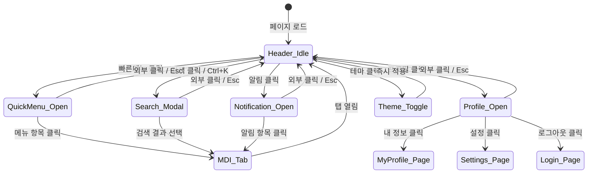

# TSK-01-02 - 헤더 컴포넌트 화면설계서

## 문서 정보

| 항목 | 내용 |
|------|------|
| Task ID | TSK-01-02 |
| 문서 버전 | 1.0 |
| 작성일 | 2026-01-20 |
| 상태 | 작성완료 |
| 기반 문서 | 010-design.md |

---

## 1. 화면 목록

| 화면 ID | 화면명 | 설명 | SVG 파일 |
|---------|--------|------|----------|
| SCR-01 | 헤더 기본 | 헤더 전체 레이아웃 및 구성 요소 | screen-01-header.svg |
| SCR-02 | 빠른 메뉴 드롭다운 | 즐겨찾기 메뉴 드롭다운 | screen-02-quick-menu.svg |
| SCR-02-E | 빠른 메뉴 (빈 상태) | 즐겨찾기 없을 때 | screen-02-quick-menu-empty.svg |
| SCR-03 | 프로필 드롭다운 | 사용자 프로필 메뉴 | screen-03-profile-dropdown.svg |
| SCR-04 | 테마 전환 | 라이트/다크 모드 토글 | screen-04-theme-toggle.svg |
| SCR-05 | 반응형 | 화면 크기별 헤더 변화 | screen-05-responsive.svg |
| SCR-06 | 검색 트리거 | 검색 버튼 및 단축키 | screen-06-search-trigger.svg |
| SCR-07 | 알림 트리거 | 알림 아이콘 및 뱃지 | screen-07-notification-trigger.svg |

---

## 2. 화면 전환 흐름

### 2.1 상태 다이어그램



### 2.2 액션-화면 매트릭스

| 현재 상태 | 사용자 액션 | 다음 상태 | 결과 |
|----------|------------|----------|------|
| Header_Idle | 로고 클릭 | Header_Idle | 홈(/) 이동 |
| Header_Idle | 빠른메뉴 버튼 클릭 | QuickMenu_Open | 드롭다운 표시 |
| Header_Idle | Ctrl+K | Search_Modal | 검색 모달 오픈 |
| Header_Idle | 검색 아이콘 클릭 | Search_Modal | 검색 모달 오픈 |
| Header_Idle | 알림 아이콘 클릭 | Notification_Open | 알림 패널 오픈 |
| Header_Idle | 테마 버튼 클릭 | Theme_Toggle → Header_Idle | 테마 전환 |
| Header_Idle | 프로필 클릭 | Profile_Open | 프로필 드롭다운 표시 |
| QuickMenu_Open | 즐겨찾기 항목 클릭 | MDI_Tab | 해당 화면 탭으로 열기 |
| Profile_Open | 로그아웃 클릭 | Login_Page | 세션 종료, 로그인 이동 |

---

## 3. 화면별 상세 설계

### 3.1 SCR-01: 헤더 기본

**SVG 참조:** `ui-assets/screen-01-header.svg`

#### 레이아웃

```
┌─────────────────────────────────────────────────────────────────────────┐
│                              HEADER (60px)                               │
│  ┌──────┬──┬─────────────────────────────────┬────────────────────────┐ │
│  │ Logo │⭐│ Breadcrumb                       │ Clock │🔍│🔔│🌙│ Profile│ │
│  └──────┴──┴─────────────────────────────────┴────────────────────────┘ │
└─────────────────────────────────────────────────────────────────────────┘
```

#### 컴포넌트 명세

| 컴포넌트 | Ant Design | 속성 | 동작 |
|----------|-----------|------|------|
| Logo | Link + Text | `href="/"`, `font-weight: bold`, `color: primary` | 클릭 → 홈 이동 |
| QuickMenu | Dropdown + Button | `type="text"`, `icon=<StarOutlined />` | 클릭 → 드롭다운 |
| Breadcrumb | Breadcrumb | `items=[{title, path}]` | 항목 클릭 → 해당 메뉴 이동 |
| Clock | 커스텀 Text | `font-family: monospace`, 1초 갱신 | 표시만 |
| SearchBtn | Button | `type="text"`, `icon=<SearchOutlined />` | 클릭 → 검색 모달 |
| NotificationBtn | Badge + Button | `count={unread}`, `icon=<BellOutlined />` | 클릭 → 알림 패널 |
| ThemeToggle | Button | `icon=<SunOutlined/MoonOutlined />` | 클릭 → 테마 전환 |
| Profile | Dropdown + Avatar | `trigger={['click']}` | 클릭 → 드롭다운 |

#### 상태

| 상태명 | 조건 | UI 변화 |
|--------|------|---------|
| 기본 | 로그인 완료 | 모든 요소 활성 |
| 로딩 | 사용자 정보 로드 중 | 프로필에 스켈레톤 |

#### 액션 상세

| 액션 | 트리거 | 결과 | 조건 |
|------|--------|------|------|
| 홈 이동 | 로고 클릭 | `router.push('/')` | - |
| 검색 오픈 | Ctrl+K / 클릭 | `onSearchOpen()` 콜백 | 입력 필드 포커스 아닐 때 |
| 테마 전환 | 클릭 | `setTheme(prev)` 토글 | - |

---

### 3.2 SCR-02: 빠른 메뉴 드롭다운

**SVG 참조:** `ui-assets/screen-02-quick-menu.svg`

#### 레이아웃

```
┌─────────────────┐
│ FAVORITES       │
├─────────────────┤
│ 📊 Dashboard    │  ← hover
│ 📄 Work Order   │
│ 📈 Production   │
├─────────────────┤
│ Add favorites   │
│ from sidebar    │
└─────────────────┘
```

#### 컴포넌트 명세

| 컴포넌트 | Ant Design | 속성 | 동작 |
|----------|-----------|------|------|
| Dropdown | Dropdown | `trigger={['click']}`, `placement="bottomLeft"` | 클릭 → 열림 |
| MenuItem | Menu.Item | `icon`, `key`, `label` | 클릭 → MDI 탭 열기 |
| EmptyState | Empty | `description="등록된 즐겨찾기가 없습니다"` | - |

#### 상태

| 상태명 | 조건 | UI 변화 |
|--------|------|---------|
| 닫힘 | 기본 | 드롭다운 숨김 |
| 열림 | 버튼 클릭 | 드롭다운 표시 |
| 호버 | 항목 위 마우스 | 배경색 `#F3F4F6` |
| 빈 상태 | 즐겨찾기 0개 | EmptyState 표시 |

---

### 3.3 SCR-02-E: 빠른 메뉴 (빈 상태)

**SVG 참조:** `ui-assets/screen-02-quick-menu-empty.svg`

#### 레이아웃

```
┌─────────────────┐
│      ⭐         │
│                 │
│ No favorites    │
│ yet             │
│                 │
│ How to add?     │
└─────────────────┘
```

#### 컴포넌트 명세

| 컴포넌트 | 속성 | 동작 |
|----------|------|------|
| Empty Icon | 회색 별 아이콘 | - |
| Empty Text | "No favorites yet" | - |
| Help Link | 파란색 밑줄 텍스트 | 클릭 → 도움말 표시 |

---

### 3.4 SCR-03: 프로필 드롭다운

**SVG 참조:** `ui-assets/screen-03-profile-dropdown.svg`

#### 레이아웃

```
┌─────────────────┐
│  👤 홍길동      │
│  admin@mes.com  │
├─────────────────┤
│  👤 내 정보     │
│  ⚙️ 설정       │  ← hover
├─────────────────┤
│  🚪 로그아웃    │  (red)
└─────────────────┘
```

#### 컴포넌트 명세

| 컴포넌트 | Ant Design | 속성 | 동작 |
|----------|-----------|------|------|
| UserInfo | Card (커스텀) | 아바타 + 이름 + 이메일 | 표시만 |
| MenuItem | Menu.Item | `icon`, `key`, `label` | 클릭 → 해당 동작 |
| LogoutItem | Menu.Item | `danger=true`, `icon=<LogoutOutlined />` | 클릭 → signOut() |

#### 액션 상세

| 액션 | 트리거 | 결과 |
|------|--------|------|
| 내 정보 | 클릭 | 내 정보 페이지/모달 |
| 설정 | 클릭 | 설정 페이지/모달 |
| 로그아웃 | 클릭 | `signOut()` → 로그인 페이지 |

---

### 3.5 SCR-04: 테마 전환

**SVG 참조:** `ui-assets/screen-04-theme-toggle.svg`

#### 상태 변화

| 현재 테마 | 아이콘 | 클릭 후 | 아이콘 변경 |
|----------|--------|---------|------------|
| Light | 🌙 (Moon) | Dark | ☀️ (Sun) |
| Dark | ☀️ (Sun) | Light | 🌙 (Moon) |

#### 동작 흐름

1. 사용자가 테마 버튼 클릭
2. `useTheme().setTheme()` 호출
3. 전체 화면 테마 즉시 적용
4. `localStorage`에 테마 저장
5. 아이콘 변경 (Sun ↔ Moon)

---

### 3.6 SCR-05: 반응형 설계

**SVG 참조:** `ui-assets/screen-05-responsive.svg`

#### Breakpoint별 변화

| Breakpoint | 너비 | 변화 |
|------------|------|------|
| Desktop | 1024px+ | 전체 요소 표시 |
| Tablet | 768-1023px | 시계 간소화 (HH:mm), 브레드크럼 축소 |
| Mobile | <768px | 브레드크럼/시계/이름 숨김, 아이콘만 표시 |

#### 숨김 처리

| 요소 | Desktop | Tablet | Mobile |
|------|---------|--------|--------|
| 로고 텍스트 | "MES Portal" | "MES Portal" | "MES" |
| 빠른 메뉴 | 표시 | 표시 | 표시 |
| 브레드크럼 | 전체 경로 | 축소 경로 | 숨김 |
| 시계 | HH:mm:ss | HH:mm | 숨김 |
| 검색 버튼 | 표시 | 표시 | 표시 |
| 알림 버튼 | 표시 | 표시 | 표시 |
| 테마 버튼 | 표시 | 표시 | 표시 |
| 프로필 이름 | 표시 | 숨김 | 숨김 |
| 프로필 아바타 | 표시 | 표시 | 표시 |

---

### 3.7 SCR-06: 검색 트리거

**SVG 참조:** `ui-assets/screen-06-search-trigger.svg`

#### 컴포넌트

| 요소 | 설명 |
|------|------|
| 검색 버튼 | 돋보기 아이콘, hover 시 배경색 변경 |
| 키보드 힌트 | `⌘K` 또는 `Ctrl+K` 표시 |

#### 단축키 동작

- **Windows/Linux:** `Ctrl + K`
- **Mac:** `⌘ + K`
- **조건:** 입력 필드에 포커스가 없을 때만 동작

> **Note:** 검색 모달 상세는 TSK-01-05에서 구현

---

### 3.8 SCR-07: 알림 트리거

**SVG 참조:** `ui-assets/screen-07-notification-trigger.svg`

#### 컴포넌트

| 요소 | 속성 | 설명 |
|------|------|------|
| 알림 버튼 | `icon=<BellOutlined />` | 종 아이콘 |
| 뱃지 | `count={unread}`, `overflowCount={99}` | 읽지 않은 개수 |

#### 뱃지 표시 규칙

| 조건 | 표시 |
|------|------|
| 읽지 않은 알림 0개 | 뱃지 숨김 |
| 1-99개 | 숫자 표시 |
| 100개+ | "99+" 표시 |

> **Note:** 알림 패널 상세는 TSK-01-06에서 구현

---

## 4. 공통 컴포넌트

### 4.1 드롭다운 스타일

```css
/* 드롭다운 공통 스타일 */
.dropdown-menu {
  border-radius: 6px;
  box-shadow: 0 4px 6px rgba(0, 0, 0, 0.1);
  border: 1px solid var(--color-border);
}

.dropdown-item:hover {
  background-color: var(--color-bg-secondary);
}
```

### 4.2 아이콘 버튼 스타일

```css
/* 헤더 아이콘 버튼 */
.header-icon-btn {
  width: 32px;
  height: 28px;
  border-radius: 4px;
  display: flex;
  align-items: center;
  justify-content: center;
}

.header-icon-btn:hover {
  background-color: var(--color-bg-secondary);
}
```

---

## 5. 반응형 설계

### 5.1 Breakpoint 정의

| 이름 | 최소 너비 | 최대 너비 |
|------|----------|----------|
| Mobile | 0 | 767px |
| Tablet | 768px | 1023px |
| Desktop | 1024px | - |

### 5.2 TailwindCSS 클래스

```jsx
// 예시: 프로필 이름 (데스크톱에서만 표시)
<span className="hidden md:inline">{user?.name}</span>

// 예시: 시계 (모바일에서 숨김)
<span className="hidden sm:block text-sm tabular-nums">{currentTime}</span>

// 예시: 브레드크럼 (태블릿 이상에서 표시)
<Breadcrumb className="hidden md:flex" items={breadcrumbItems} />
```

---

## 6. 접근성

### 6.1 키보드 네비게이션

| 키 | 동작 | 컨텍스트 |
|----|------|----------|
| Tab | 포커스 이동 | 헤더 요소 간 |
| Enter | 버튼 실행 | 포커스된 버튼 |
| Escape | 드롭다운 닫기 | 드롭다운 열린 상태 |
| Ctrl+K | 검색 모달 | 전역 |
| 화살표 ↑↓ | 메뉴 항목 이동 | 드롭다운 열린 상태 |

### 6.2 ARIA 속성

| 요소 | ARIA 속성 |
|------|----------|
| 검색 버튼 | `aria-label="전역 검색 (Ctrl+K)"` |
| 알림 버튼 | `aria-label="알림 5개"` |
| 테마 버튼 | `aria-label="다크 모드로 전환"` |
| 프로필 | `aria-haspopup="menu"`, `aria-expanded` |

### 6.3 색상 대비

| 요소 | 전경색 | 배경색 | 대비율 |
|------|--------|--------|--------|
| 로고 텍스트 | #3B82F6 | #FFFFFF | 4.5:1 |
| 일반 텍스트 | #1F2937 | #FFFFFF | 16:1 |
| 보조 텍스트 | #6B7280 | #FFFFFF | 5.4:1 |
| 뱃지 텍스트 | #FFFFFF | #EF4444 | 4.6:1 |

---

## 7. SVG 파일 목록

| 순번 | 파일명 | 설명 | 크기 |
|------|--------|------|------|
| 1 | screen-01-header.svg | 헤더 전체 레이아웃 | 1200x100 |
| 2 | screen-02-quick-menu.svg | 빠른 메뉴 드롭다운 | 400x280 |
| 3 | screen-02-quick-menu-empty.svg | 빠른 메뉴 빈 상태 | 400x220 |
| 4 | screen-03-profile-dropdown.svg | 프로필 드롭다운 | 400x300 |
| 5 | screen-04-theme-toggle.svg | 테마 전환 | 500x140 |
| 6 | screen-05-responsive.svg | 반응형 헤더 | 800x250 |
| 7 | screen-06-search-trigger.svg | 검색 트리거 | 400x160 |
| 8 | screen-07-notification-trigger.svg | 알림 트리거 | 300x150 |

---

## 변경 이력

| 버전 | 일자 | 작성자 | 변경 내용 |
|------|------|--------|----------|
| 1.0 | 2026-01-20 | AI | 최초 작성 |
