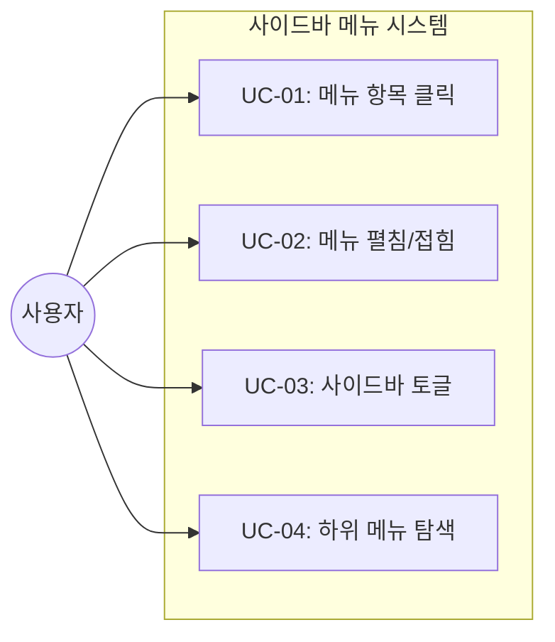
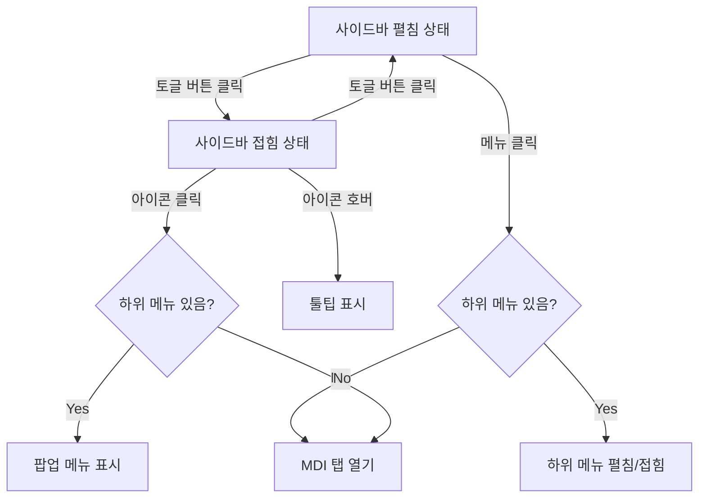

# TSK-01-03 - 사이드바 메뉴 컴포넌트 설계 문서

## 문서 정보

| 항목 | 내용 |
|------|------|
| Task ID | TSK-01-03 |
| 문서 버전 | 1.0 |
| 작성일 | 2026-01-20 |
| 상태 | 작성중 |
| 카테고리 | development |

---

## 1. 개요

### 1.1 배경 및 문제 정의

**현재 상황:**
- MES Portal 레이아웃 구조(TSK-01-01)가 완료되어 기본 레이아웃이 갖춰져 있음
- 사이드바 영역은 존재하나 실제 메뉴 컴포넌트가 아직 구현되지 않음
- 사용자가 다양한 기능 화면에 접근할 메뉴 시스템이 필요함

**해결하려는 문제:**
- 계층형 메뉴 구조로 다양한 기능 화면에 접근할 수 있어야 함
- 화면 공간 효율성을 위해 접이식 사이드바가 필요함
- 현재 위치를 명확히 표시하여 사용자 탐색 경험을 개선해야 함

### 1.2 목적 및 기대 효과

**목적:**
- 접이식 사이드바 메뉴 컴포넌트 구현
- 계층형 트리 메뉴 지원 (최대 3단계)
- MDI 시스템과 연동하여 메뉴 클릭 시 탭으로 화면 열기

**기대 효과:**
- 사용자가 원하는 화면에 쉽게 접근 가능
- 접힘/펼침 기능으로 화면 공간 효율적 활용
- 현재 선택 메뉴 강조로 사용자 위치 인지 향상

### 1.3 범위

**포함:**
- Sidebar.tsx 컴포넌트 구현
- 접이식 토글 기능 (펼침 240px / 접힘 60px)
- 계층형 트리 메뉴 (최대 3단계)
- 메뉴 아이템 (아이콘 + 메뉴명 + 화살표)
- 호버 시 하이라이트
- 현재 선택 메뉴 강조
- 접힘 상태에서 툴팁
- 하단 접기/펼치기 버튼
- MDI 컨텍스트와 연동 (openTab 호출)

**제외:**
- 실제 메뉴 데이터 API 연동 (mock 데이터 사용)
- 권한별 메뉴 필터링 (TSK-03-02에서 구현)
- 즐겨찾기 메뉴 기능 (TSK-03-04에서 구현)

### 1.4 참조 문서

| 문서 | 경로 | 관련 섹션 |
|------|------|----------|
| PRD | `.orchay/projects/mes-portal/prd.md` | 4.1.1 사이드바 메뉴 (Sidebar) |
| WBS | `.orchay/projects/mes-portal/wbs.yaml` | TSK-01-03 |

---

## 2. 사용자 분석

### 2.1 대상 사용자

| 사용자 유형 | 특성 | 주요 니즈 |
|------------|------|----------|
| 공장장/관리자 | 전체 시스템 접근 필요, 다양한 화면 빈번 전환 | 빠른 메뉴 탐색, 전체 메뉴 가시성 |
| 생산 담당자 | 생산 관련 메뉴 주로 사용, 반복 작업 | 자주 쓰는 메뉴 빠른 접근 |
| 품질/설비 담당자 | 특정 영역 메뉴 집중 사용 | 담당 영역 메뉴 쉬운 접근 |

### 2.2 사용자 페르소나

**페르소나 1: 김공장 (공장장)**
- 역할: 전체 생산 현황 관리
- 목표: 대시보드, 생산, 품질, 설비 등 다양한 화면 빠른 전환
- 불만: 메뉴가 너무 많으면 원하는 항목 찾기 어려움
- 시나리오: 아침에 대시보드 확인 후 각 영역별 상세 화면으로 이동

**페르소나 2: 이생산 (생산 담당자)**
- 역할: 작업 지시 및 실적 관리
- 목표: 생산 관련 메뉴에 빠르게 접근
- 불만: 화면 작업 중 사이드바가 너무 많은 공간 차지
- 시나리오: 작업 지시 화면과 실적 입력 화면을 번갈아 사용

---

## 3. 유즈케이스

### 3.1 유즈케이스 다이어그램



### 3.2 유즈케이스 상세

#### UC-01: 메뉴 항목 클릭

| 항목 | 내용 |
|------|------|
| 액터 | 모든 사용자 |
| 목적 | 원하는 화면으로 이동 |
| 사전 조건 | 로그인 완료, 메뉴 표시됨 |
| 사후 조건 | MDI 탭에 해당 화면 열림, 메뉴 강조 |
| 트리거 | 메뉴 아이템 클릭 |

**기본 흐름:**
1. 사용자가 메뉴 아이템을 클릭한다
2. 시스템이 해당 메뉴가 화면(leaf)인지 확인한다
3. MDI 컨텍스트의 openTab 함수를 호출한다
4. 해당 화면이 탭으로 열린다
5. 클릭한 메뉴 아이템이 강조 표시된다

**대안 흐름:**
- 2a. 만약 하위 메뉴가 있는 항목이면:
  - 하위 메뉴를 펼치거나 접는다
  - 탭은 열리지 않는다

#### UC-02: 메뉴 펼침/접힘

| 항목 | 내용 |
|------|------|
| 액터 | 모든 사용자 |
| 목적 | 하위 메뉴 확인 또는 숨김 |
| 사전 조건 | 하위 메뉴가 있는 메뉴 항목 |
| 사후 조건 | 하위 메뉴 펼침/접힘 상태 변경 |
| 트리거 | 메뉴 항목 또는 화살표 클릭 |

**기본 흐름:**
1. 사용자가 하위 메뉴가 있는 항목을 클릭한다
2. 현재 접힘 상태면 펼친다
3. 현재 펼침 상태면 접는다
4. 화살표 아이콘 방향이 변경된다

#### UC-03: 사이드바 토글

| 항목 | 내용 |
|------|------|
| 액터 | 모든 사용자 |
| 목적 | 화면 공간 확보 또는 메뉴 상세 확인 |
| 사전 조건 | 사이드바가 표시됨 |
| 사후 조건 | 사이드바 너비 변경 (240px ↔ 60px) |
| 트리거 | 토글 버튼 클릭 |

**기본 흐름:**
1. 사용자가 하단의 토글 버튼을 클릭한다
2. 현재 펼침 상태(240px)면 접힘 상태(60px)로 변경
3. 현재 접힘 상태(60px)면 펼침 상태(240px)로 변경
4. 메뉴명 표시/숨김 상태 변경

#### UC-04: 하위 메뉴 탐색 (접힘 상태)

| 항목 | 내용 |
|------|------|
| 액터 | 모든 사용자 |
| 목적 | 접힘 상태에서 메뉴 확인 |
| 사전 조건 | 사이드바가 접힘 상태 |
| 사후 조건 | 툴팁으로 메뉴명 확인 |
| 트리거 | 메뉴 아이콘 호버 |

**기본 흐름:**
1. 사이드바가 접힘 상태에서 사용자가 메뉴 아이콘에 마우스를 올린다
2. 해당 메뉴명이 툴팁으로 표시된다
3. 하위 메뉴가 있으면 팝업 메뉴로 표시된다

---

## 4. 사용자 시나리오

### 4.1 시나리오 1: 메뉴 탐색 및 화면 열기

**상황 설명:**
공장장 김공장이 아침에 출근하여 대시보드를 확인한 후 생산 현황 상세 화면으로 이동하려 한다.

**단계별 진행:**

| 단계 | 사용자 행동 | 시스템 반응 | 사용자 기대 |
|------|-----------|------------|------------|
| 1 | 사이드바에서 "생산" 메뉴를 찾는다 | 메뉴 목록 표시 | 메뉴가 잘 보임 |
| 2 | "생산" 메뉴를 클릭한다 | 하위 메뉴 펼침 | 하위 메뉴 확인 |
| 3 | "생산 현황" 메뉴를 클릭한다 | 해당 화면이 탭으로 열림 | 화면 진입 |
| 4 | 메뉴 강조 확인 | "생산 현황" 메뉴 하이라이트 | 현재 위치 인지 |

**성공 조건:**
- 원하는 화면이 MDI 탭으로 열림
- 현재 메뉴가 시각적으로 강조됨

### 4.2 시나리오 2: 사이드바 접기로 작업 공간 확보

**상황 설명:**
생산 담당자 이생산이 작업 지시 화면에서 넓은 테이블을 봐야 하는데 사이드바가 공간을 차지한다.

**단계별 진행:**

| 단계 | 사용자 행동 | 시스템 반응 | 사용자 기대 |
|------|-----------|------------|------------|
| 1 | 사이드바 하단 토글 버튼 클릭 | 사이드바가 60px로 줄어듦 | 콘텐츠 영역 확대 |
| 2 | 아이콘만 보이는 메뉴 확인 | 아이콘만 표시됨 | 메뉴 식별 가능 |
| 3 | 메뉴 아이콘에 마우스 올림 | 툴팁으로 메뉴명 표시 | 메뉴명 확인 |
| 4 | 다른 화면 필요 시 아이콘 클릭 | 해당 화면 탭으로 열림 | 정상 동작 |

**성공 조건:**
- 사이드바가 접혀서 콘텐츠 영역이 넓어짐
- 접힌 상태에서도 메뉴 사용 가능

### 4.3 시나리오 3: 3단계 계층 메뉴 탐색

**상황 설명:**
품질 담당자가 "설정 > 시스템 > 권한 관리" 와 같은 깊은 메뉴에 접근한다.

**단계별 진행:**

| 단계 | 사용자 행동 | 시스템 반응 | 사용자 기대 |
|------|-----------|------------|------------|
| 1 | "설정" 메뉴 클릭 | 1단계 펼침, 하위 메뉴 표시 | 2단계 메뉴 확인 |
| 2 | "시스템" 메뉴 클릭 | 2단계 펼침, 하위 메뉴 표시 | 3단계 메뉴 확인 |
| 3 | "권한 관리" 클릭 | 해당 화면 탭으로 열림 | 화면 진입 |

**성공 조건:**
- 3단계까지 메뉴 펼침 동작
- 현재 경로의 모든 상위 메뉴가 펼쳐진 상태 유지

---

## 5. 화면 설계

### 5.1 화면 흐름도



### 5.2 화면별 상세

#### 상태 1: 사이드바 펼침 상태 (240px)

**화면 목적:**
메뉴 전체 구조를 한눈에 파악하고 원하는 메뉴에 접근

**와이어프레임:**
```
┌────────────────────────────────────┐
│  ┌──────────────────────────────┐  │
│  │ 📊 대시보드                  │  │  ← 1단계 메뉴 (선택됨)
│  └──────────────────────────────┘  │
│  ┌──────────────────────────────┐  │
│  │ 🏭 생산                    ▼ │  │  ← 1단계 메뉴 (펼침)
│  ├──────────────────────────────┤  │
│  │   📋 작업 지시               │  │  ← 2단계 메뉴
│  │   📈 생산 현황               │  │
│  │   📝 실적 입력               │  │
│  └──────────────────────────────┘  │
│  ┌──────────────────────────────┐  │
│  │ ✅ 품질                    ▶ │  │  ← 1단계 메뉴 (접힘)
│  └──────────────────────────────┘  │
│  ┌──────────────────────────────┐  │
│  │ ⚙️ 설비                    ▶ │  │
│  └──────────────────────────────┘  │
│  ┌──────────────────────────────┐  │
│  │ ⚡ 설정                    ▼ │  │  ← 3단계 예시
│  ├──────────────────────────────┤  │
│  │   👤 사용자                ▼ │  │
│  │     - 사용자 관리            │  │  ← 3단계 메뉴
│  │     - 역할 관리              │  │
│  │   🔧 시스템                ▶ │  │
│  └──────────────────────────────┘  │
│                                    │
│  ─────────────────────────────────│
│  ┌──────────────────────────────┐  │
│  │         [◀ 접기]             │  │  ← 토글 버튼
│  └──────────────────────────────┘  │
└────────────────────────────────────┘
        너비: 240px
```

**화면 요소 설명:**

| 영역 | 설명 | 사용자 인터랙션 |
|------|------|----------------|
| 1단계 메뉴 | 주요 기능 그룹 | 클릭 시 하위 메뉴 펼침/접힘 |
| 2단계 메뉴 | 세부 기능 그룹 또는 화면 | 클릭 시 하위 메뉴 펼침 또는 화면 열기 |
| 3단계 메뉴 | 최하위 화면 | 클릭 시 MDI 탭 열기 |
| 화살표 (▼/▶) | 펼침/접힘 상태 표시 | - |
| 토글 버튼 | 사이드바 접기/펼치기 | 클릭 시 60px로 축소 |

#### 상태 2: 사이드바 접힘 상태 (60px)

**화면 목적:**
콘텐츠 영역 최대화, 아이콘으로 메뉴 식별

**와이어프레임:**
```
┌────────┐
│  📊   │  ← 아이콘만 표시
│  🏭   │
│  ✅   │
│  ⚙️   │
│  ⚡   │
│        │
│  ─────│
│  [▶]  │  ← 펼치기 버튼
└────────┘
 너비: 60px
```

**호버 시 툴팁:**
```
┌────────┐
│  🏭   │──┬──────────────┐
│        │  │   생산       │  ← 툴팁
└────────┘  └──────────────┘
```

**호버 시 팝업 메뉴 (하위 메뉴 있는 경우):**
```
┌────────┐
│  🏭   │──┬──────────────────┐
│        │  │ 📋 작업 지시     │
│        │  │ 📈 생산 현황     │
│        │  │ 📝 실적 입력     │
└────────┘  └──────────────────┘
```

### 5.3 메뉴 아이템 상태

| 상태 | 시각적 표현 |
|------|------------|
| 기본 | 배경: 투명, 텍스트: 기본 색상 |
| 호버 | 배경: 하이라이트 색상 (token 사용) |
| 선택됨 | 배경: Primary 색상, 텍스트: 흰색 또는 강조 |
| 비활성 | 텍스트: 회색, 클릭 불가 |

### 5.4 반응형 동작

| 화면 크기 | 레이아웃 변화 | 사용자 경험 |
|----------|--------------|------------|
| 데스크톱 (1024px+) | 기본 동작 (펼침/접힘 토글) | 전체 기능 사용 |
| 태블릿 (768-1023px) | 기본 접힘 상태, 토글 가능 | 콘텐츠 우선 |
| 모바일 (767px-) | 햄버거 메뉴, 오버레이로 표시 | 별도 TSK에서 구현 |

---

## 6. 인터랙션 설계

### 6.1 사용자 액션과 피드백

| 사용자 액션 | 즉각 피드백 | 결과 피드백 | 에러 피드백 |
|------------|-----------|------------|------------|
| 메뉴 아이템 클릭 | 클릭 효과 (ripple) | 화면 탭 열림/메뉴 펼침 | - |
| 메뉴 호버 | 배경색 하이라이트 | - | - |
| 토글 버튼 클릭 | 버튼 눌림 효과 | 사이드바 너비 애니메이션 | - |
| 접힘 상태 메뉴 호버 | 툴팁/팝업 메뉴 표시 | - | - |

### 6.2 애니메이션

| 요소 | 애니메이션 | duration | easing |
|------|----------|----------|--------|
| 사이드바 토글 | 너비 변화 | 200ms | ease-in-out |
| 하위 메뉴 펼침/접힘 | 높이 변화 | 150ms | ease-out |
| 메뉴 호버 | 배경색 변화 | 100ms | ease |
| 화살표 회전 | 90도 회전 | 150ms | ease |

### 6.3 키보드/접근성

| 기능 | 키보드 단축키 | 스크린 리더 안내 |
|------|-------------|-----------------|
| 메뉴 탐색 | 화살표 위/아래 | "{메뉴명}, 메뉴 항목" |
| 메뉴 선택 | Enter | "선택됨" |
| 하위 메뉴 펼침 | 화살표 오른쪽 | "펼쳐짐, {N}개 항목" |
| 하위 메뉴 접힘 | 화살표 왼쪽 | "접힘" |
| 사이드바 토글 | - | "사이드바 접힘/펼침" |

---

## 7. 데이터 요구사항

### 7.1 필요한 데이터

| 데이터 | 설명 | 출처 | 용도 |
|--------|------|------|------|
| 메뉴 목록 | 계층형 메뉴 구조 | Mock JSON (MVP) → API (추후) | 메뉴 렌더링 |
| 현재 선택 메뉴 | 활성 탭의 메뉴 경로 | MDI Context | 메뉴 강조 |
| 사이드바 상태 | 펼침/접힘 상태 | Local State 또는 Context | UI 상태 관리 |

### 7.2 메뉴 데이터 구조

```typescript
interface MenuItem {
  id: string;           // 메뉴 고유 ID
  code: string;         // 메뉴 코드
  name: string;         // 메뉴명
  path?: string;        // 화면 경로 (leaf 메뉴만)
  icon?: string;        // 아이콘 이름 (@ant-design/icons)
  children?: MenuItem[]; // 하위 메뉴
  sortOrder: number;    // 정렬 순서
  isActive: boolean;    // 활성화 여부
}
```

### 7.3 Mock 메뉴 데이터 예시

```json
{
  "menus": [
    {
      "id": "1",
      "code": "DASHBOARD",
      "name": "대시보드",
      "path": "/dashboard",
      "icon": "DashboardOutlined",
      "sortOrder": 1,
      "isActive": true
    },
    {
      "id": "2",
      "code": "PRODUCTION",
      "name": "생산",
      "icon": "BuildOutlined",
      "sortOrder": 2,
      "isActive": true,
      "children": [
        {
          "id": "2-1",
          "code": "WORK_ORDER",
          "name": "작업 지시",
          "path": "/production/work-order",
          "icon": "FileTextOutlined",
          "sortOrder": 1,
          "isActive": true
        },
        {
          "id": "2-2",
          "code": "PRODUCTION_STATUS",
          "name": "생산 현황",
          "path": "/production/status",
          "icon": "LineChartOutlined",
          "sortOrder": 2,
          "isActive": true
        }
      ]
    }
  ]
}
```

---

## 8. 비즈니스 규칙

### 8.1 핵심 규칙

| 규칙 ID | 규칙 설명 | 적용 상황 | 예외 |
|---------|----------|----------|------|
| BR-01 | 화면 메뉴 클릭 시 MDI 탭으로 열기 | 하위 메뉴가 없는 메뉴 클릭 | 없음 |
| BR-02 | 동일 화면 중복 탭 방지 | 이미 열린 화면 메뉴 클릭 | 해당 탭 활성화 |
| BR-03 | 현재 탭의 메뉴 경로 강조 | 탭 전환 시 | 매칭 메뉴 없으면 강조 없음 |
| BR-04 | 최대 3단계 메뉴 지원 | 메뉴 렌더링 | 3단계 초과 시 무시 |

### 8.2 규칙 상세 설명

**BR-01: 화면 메뉴 클릭 시 MDI 탭으로 열기**

설명: path가 있는 메뉴(leaf 메뉴)를 클릭하면 MDI 컨텍스트의 openTab 함수를 호출하여 해당 화면을 탭으로 연다.

예시:
- "생산 현황" 클릭 → openTab({ id: 'production-status', title: '생산 현황', path: '/production/status', icon: 'LineChartOutlined' })

**BR-02: 동일 화면 중복 탭 방지**

설명: 이미 열려 있는 화면의 메뉴를 다시 클릭하면 새 탭을 열지 않고 기존 탭을 활성화한다.

예시:
- "생산 현황" 탭이 이미 열린 상태에서 다시 클릭 → 해당 탭으로 전환 (setActiveTab)

**BR-03: 현재 탭의 메뉴 경로 강조**

설명: 현재 활성 탭의 경로와 일치하는 메뉴를 찾아 강조 표시하고, 상위 메뉴도 펼친 상태로 유지한다.

---

## 9. 에러 처리

### 9.1 예상 에러 상황

| 상황 | 원인 | 사용자 메시지 | 복구 방법 |
|------|------|--------------|----------|
| 메뉴 데이터 로드 실패 | 네트워크/API 오류 | "메뉴를 불러올 수 없습니다" | 재시도 버튼 |
| 잘못된 메뉴 경로 | 데이터 오류 | - (콘솔 경고) | 무시하고 계속 |
| 아이콘 없음 | 아이콘 이름 오류 | 기본 아이콘 표시 | - |

### 9.2 에러 표시 방식

| 에러 유형 | 표시 위치 | 표시 방법 |
|----------|----------|----------|
| 메뉴 로드 실패 | 사이드바 전체 | 에러 메시지 + 재시도 버튼 |
| 개별 메뉴 오류 | 해당 항목 | 숨김 또는 비활성 |

---

## 10. 연관 문서

> 상세 테스트 명세 및 요구사항 추적은 별도 문서에서 관리합니다.

| 문서 | 경로 | 용도 |
|------|------|------|
| 요구사항 추적 매트릭스 | `025-traceability-matrix.md` | PRD → 설계 → 테스트 양방향 추적 |
| 테스트 명세서 | `026-test-specification.md` | 단위/E2E/매뉴얼 테스트 상세 정의 |

---

## 11. 구현 범위

### 11.1 영향받는 영역

| 영역 | 변경 내용 | 영향도 |
|------|----------|--------|
| components/layout/Sidebar.tsx | 신규 생성 | 높음 |
| components/layout/PortalLayout.tsx | Sidebar 컴포넌트 연결 | 중간 |
| lib/mdi/context.tsx | openTab 함수 호출 | 낮음 |
| mock-data/menus.json | 메뉴 데이터 파일 생성 | 낮음 |

### 11.2 의존성

| 의존 항목 | 이유 | 상태 |
|----------|------|------|
| TSK-01-01 레이아웃 컴포넌트 | Sider 영역 제공 | 완료 예정 (승인 대기) |
| TSK-00-02 UI 라이브러리 설정 | Ant Design Menu 사용 | 대기 |

### 11.3 제약 사항

| 제약 | 설명 | 대응 방안 |
|------|------|----------|
| MDI 미구현 시 | openTab 호출 불가 | 임시 console.log 또는 router.push |
| 메뉴 API 미구현 | 실제 데이터 없음 | Mock JSON 데이터 사용 |

---

## 12. 기술 명세

### 12.1 컴포넌트 구조

```
components/
└── layout/
    └── Sidebar.tsx          # 메인 사이드바 컴포넌트
    └── SidebarMenu.tsx      # 메뉴 렌더링 컴포넌트 (optional)
```

### 12.2 사용 기술

| 기술 | 용도 |
|------|------|
| Ant Design Layout.Sider | 사이드바 레이아웃 |
| Ant Design Menu | 계층형 메뉴 렌더링 |
| @ant-design/icons | 메뉴 아이콘 |
| React useState/useContext | 상태 관리 |

### 12.3 Props 인터페이스

```typescript
interface SidebarProps {
  collapsed?: boolean;           // 외부 제어 시
  onCollapse?: (collapsed: boolean) => void;  // 상태 변경 콜백
  defaultCollapsed?: boolean;    // 초기 상태
}
```

---

## 13. 체크리스트

### 13.1 설계 완료 확인

- [x] 문제 정의 및 목적 명확화
- [x] 사용자 분석 완료
- [x] 유즈케이스 정의 완료
- [x] 사용자 시나리오 작성 완료
- [x] 화면 설계 완료 (와이어프레임)
- [x] 인터랙션 설계 완료
- [x] 데이터 요구사항 정의 완료
- [x] 비즈니스 규칙 정의 완료
- [x] 에러 처리 정의 완료

### 13.2 연관 문서 작성

- [ ] 요구사항 추적 매트릭스 작성 (→ `025-traceability-matrix.md`)
- [ ] 테스트 명세서 작성 (→ `026-test-specification.md`)

### 13.3 구현 준비

- [x] 구현 우선순위 결정
- [x] 의존성 확인 완료
- [x] 제약 사항 검토 완료

---

## 변경 이력

| 버전 | 일자 | 작성자 | 변경 내용 |
|------|------|--------|----------|
| 1.0 | 2026-01-20 | Claude | 최초 작성 |
