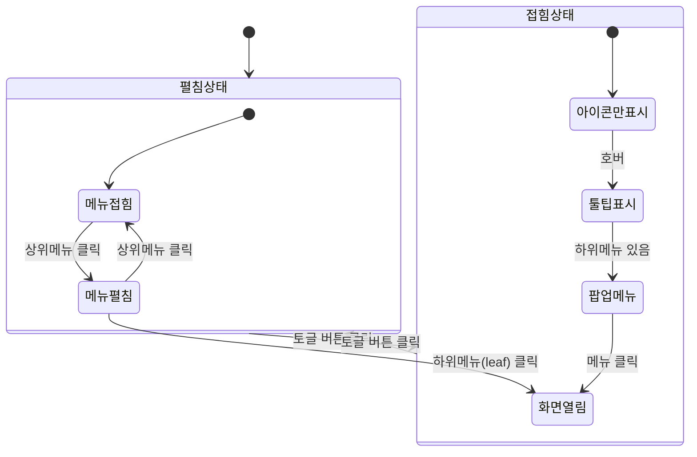

# TSK-01-03 - 사이드바 메뉴 컴포넌트 UI 설계

**Version:** 1.0 — **Last Updated:** 2026-01-20

> **목적**: 사이드바 메뉴 컴포넌트 화면 설계 및 인터랙션 정의

---

## 1. 화면 목록

| 화면 ID | 화면명 | 목적 | SVG 참조 |
|---------|--------|------|----------|
| SCR-01 | 사이드바 펼침 상태 | 전체 메뉴명 표시, 계층 구조 탐색 | `screen-01-sidebar-expanded.svg` |
| SCR-02 | 사이드바 접힘 상태 | 아이콘만 표시, 콘텐츠 영역 확대 | `screen-02-sidebar-collapsed.svg` |
| SCR-03 | 메뉴 펼침/접힘 상태 | 서브메뉴 펼침/접힘 인터랙션 | `screen-03-menu-submenu.svg` |
| SCR-04 | 접힘 상태 호버 | 툴팁 및 팝업 메뉴 표시 | `screen-04-collapsed-hover.svg` |

---

## 2. 화면 전환 흐름

### 2.1 상태 다이어그램



### 2.2 액션-화면 매트릭스

| 액션 | 현재 상태 | 결과 상태 | 트리거 |
|------|----------|----------|--------|
| 토글 버튼 클릭 | 펼침 (240px) | 접힘 (60px) | 사용자 |
| 토글 버튼 클릭 | 접힘 (60px) | 펼침 (240px) | 사용자 |
| 상위 메뉴 클릭 | 서브메뉴 접힘 | 서브메뉴 펼침 | 사용자 |
| 상위 메뉴 클릭 | 서브메뉴 펼침 | 서브메뉴 접힘 | 사용자 |
| 하위 메뉴 클릭 | - | MDI 탭 열림 | 사용자 |
| 아이콘 호버 (접힘) | 아이콘만 표시 | 툴팁/팝업 메뉴 | 사용자 |
| 탭 전환 | - | 해당 메뉴 강조 | 시스템 |

---

## 3. 화면별 상세

### 3.1 SCR-01: 사이드바 펼침 상태 (240px)

**화면 목적**: 전체 메뉴 구조를 한눈에 파악하고 원하는 메뉴에 접근

**레이아웃 구조**:
```
┌────────────────────────────────────┐
│  ┌──────────────────────────────┐  │
│  │ 📊 대시보드                  │  │  ← 1단계 메뉴 (활성)
│  └──────────────────────────────┘  │    배경: Primary 색상
│  ┌──────────────────────────────┐  │
│  │ 🏭 생산                    ▼ │  │  ← 1단계 메뉴 (펼침)
│  ├──────────────────────────────┤  │
│  │   📋 작업 지시               │  │  ← 2단계 메뉴
│  │   📈 생산 현황               │  │    들여쓰기 16px
│  │   📝 실적 입력               │  │
│  └──────────────────────────────┘  │
│  ┌──────────────────────────────┐  │
│  │ ✅ 품질                    ▶ │  │  ← 1단계 메뉴 (접힘)
│  └──────────────────────────────┘  │    화살표 ▶ 방향
│  ┌──────────────────────────────┐  │
│  │ ⚙️ 설비                    ▶ │  │
│  └──────────────────────────────┘  │
│  ┌──────────────────────────────┐  │
│  │ ⚡ 설정                    ▼ │  │  ← 3단계 구조 예시
│  ├──────────────────────────────┤  │
│  │   👤 사용자                ▼ │  │  ← 2단계 (펼침)
│  │     ├─ 사용자 관리          │  │  ← 3단계 메뉴
│  │     └─ 역할 관리            │  │    들여쓰기 32px
│  │   🔧 시스템                ▶ │  │  ← 2단계 (접힘)
│  └──────────────────────────────┘  │
│                                    │
│  ═══════════════════════════════  │  ← 구분선
│  ┌──────────────────────────────┐  │
│  │         [◀ 접기]             │  │  ← 토글 버튼 (하단 고정)
│  └──────────────────────────────┘  │
└────────────────────────────────────┘
        너비: 240px (var(--sidebar-width))
```

**컴포넌트 구성**:

| 영역 | 컴포넌트 | Props | 비고 |
|------|----------|-------|------|
| 사이드바 | `Layout.Sider` | `width={240}, collapsible, collapsed={false}` | Ant Design |
| 메뉴 | `Menu` | `mode="inline", selectedKeys, openKeys` | 계층형 |
| 1단계 | `Menu.SubMenu` | `key, icon, title` | 또는 Menu.Item |
| 2단계 | `Menu.SubMenu` / `Menu.Item` | `key, title` | 들여쓰기 자동 |
| 3단계 | `Menu.Item` | `key, title` | leaf 메뉴 |
| 토글 버튼 | `Button` | `icon={<LeftOutlined/>}` | 하단 고정 |

**상태 관리**:
- `collapsed: false`
- `selectedKeys: ['dashboard']` (현재 활성 메뉴)
- `openKeys: ['production', 'settings', 'settings-user']` (펼쳐진 서브메뉴)

**스타일 토큰**:

| 요소 | CSS Variable | 값 |
|------|-------------|-----|
| 사이드바 너비 | `--sidebar-width` | 240px |
| 메뉴 아이템 높이 | - | 40px (Ant Design 기본) |
| 아이콘 크기 | - | 16px |
| 들여쓰기 단위 | `--menu-indent` | 16px |

---

### 3.2 SCR-02: 사이드바 접힘 상태 (60px)

**화면 목적**: 콘텐츠 영역 최대화, 아이콘으로 빠른 메뉴 접근

**레이아웃 구조**:
```
┌────────┐
│  📊   │  ← 아이콘만 표시, 중앙 정렬
│  🏭   │    호버 시 툴팁 표시
│  ✅   │
│  ⚙️   │
│  ⚡   │
│        │
│        │
│        │
│  ─────│  ← 구분선
│  [▶]  │  ← 펼치기 버튼
└────────┘
 너비: 60px
```

**컴포넌트 구성**:

| 영역 | 컴포넌트 | Props | 비고 |
|------|----------|-------|------|
| 사이드바 | `Layout.Sider` | `collapsed={true}, collapsedWidth={60}` | |
| 메뉴 | `Menu` | `inlineCollapsed={true}` | 자동 툴팁 |
| 토글 버튼 | `Button` | `icon={<RightOutlined/>}` | |

**상태 관리**:
- `collapsed: true`

**사용자 액션**:

| 액션 | 요소 | 결과 |
|------|------|------|
| 아이콘 호버 | 메뉴 아이템 | 툴팁 또는 팝업 메뉴 (SCR-04) |
| 아이콘 클릭 (leaf) | 메뉴 아이템 | MDI 탭 열기 |
| 펼치기 버튼 클릭 | 토글 버튼 | SCR-01로 전환 |

---

### 3.3 SCR-03: 메뉴 펼침/접힘 상태

**화면 목적**: 서브메뉴 펼침/접힘 인터랙션 표현

**펼침 전**:
```
┌──────────────────────────────┐
│ 🏭 생산                    ▶ │  ← 서브메뉴 접힘
└──────────────────────────────┘
```

**펼침 후**:
```
┌──────────────────────────────┐
│ 🏭 생산                    ▼ │  ← 화살표 회전 (90도)
├──────────────────────────────┤
│   📋 작업 지시               │  ← 서브메뉴 노출
│   📈 생산 현황               │    슬라이드 다운 애니메이션
│   📝 실적 입력               │
└──────────────────────────────┘
```

**애니메이션**:
- 화살표 회전: 150ms, ease
- 서브메뉴 높이 변화: 150ms, ease-out
- 메뉴 아이템 페이드 인: 100ms

---

### 3.4 SCR-04: 접힘 상태 호버

**화면 목적**: 접힘 상태에서 메뉴명 확인 및 서브메뉴 접근

**단일 메뉴 호버 (툴팁)**:
```
┌────────┐
│  📊   │──┬──────────────┐
│        │  │   대시보드    │  ← 툴팁 (우측 표시)
└────────┘  └──────────────┘
```

**서브메뉴 있는 메뉴 호버 (팝업)**:
```
┌────────┐
│  🏭   │──┬──────────────────┐
│        │  │ 📋 작업 지시      │  ← 팝업 메뉴
│        │  │ 📈 생산 현황      │    (우측 플로팅)
│        │  │ 📝 실적 입력      │
└────────┘  └──────────────────┘
```

**컴포넌트 구성**:

| 상황 | 컴포넌트 | Props |
|------|----------|-------|
| 단일 메뉴 | `Tooltip` | `placement="right"` |
| 서브메뉴 | `Menu` (팝업) | Ant Design 내장 동작 |

---

## 4. 공통 컴포넌트

### 4.1 메뉴 아이템

```typescript
interface MenuItemProps {
  id: string;
  code: string;
  name: string;
  icon?: string;        // @ant-design/icons 컴포넌트명
  path?: string;        // leaf 메뉴의 경우
  children?: MenuItemProps[];
  isActive?: boolean;
}
```

**상태별 스타일**:

| 상태 | 배경색 | 텍스트색 | 아이콘색 |
|------|--------|---------|---------|
| 기본 | transparent | token.colorText | token.colorText |
| 호버 | token.colorBgTextHover | token.colorText | token.colorPrimary |
| 선택됨 | token.colorPrimaryBg | token.colorPrimary | token.colorPrimary |
| 비활성 | transparent | token.colorTextDisabled | token.colorTextDisabled |

### 4.2 토글 버튼

```typescript
interface ToggleButtonProps {
  collapsed: boolean;
  onClick: () => void;
}
```

**렌더링**:
- `collapsed === false`: `<LeftOutlined />` + "접기" 텍스트
- `collapsed === true`: `<RightOutlined />` (아이콘만)

### 4.3 메뉴 아이콘 매핑

| 메뉴 코드 | 아이콘 |
|-----------|--------|
| DASHBOARD | `DashboardOutlined` |
| PRODUCTION | `BuildOutlined` |
| QUALITY | `CheckCircleOutlined` |
| EQUIPMENT | `ToolOutlined` |
| SETTINGS | `SettingOutlined` |
| USER | `UserOutlined` |
| SYSTEM | `ControlOutlined` |

---

## 5. 반응형 설계

### 5.1 Breakpoint 정의

| Breakpoint | 너비 범위 | 사이드바 기본 상태 |
|------------|----------|------------------|
| Desktop | 1024px+ | 펼침 (240px) |
| Tablet | 768-1023px | 접힘 (60px) |
| Mobile | 0-767px | 숨김 (Drawer) |

### 5.2 반응형 동작

```typescript
const getDefaultCollapsed = (width: number): boolean => {
  if (width >= 1024) return false;  // Desktop: 펼침
  if (width >= 768) return true;    // Tablet: 접힘
  return true;                       // Mobile: 숨김
};
```

---

## 6. 접근성

### 6.1 키보드 네비게이션

| 키 | 동작 |
|-----|------|
| `Tab` | 메뉴 간 포커스 이동 |
| `Enter` | 메뉴 선택/펼침/접힘 |
| `ArrowUp` / `ArrowDown` | 메뉴 항목 간 이동 |
| `ArrowRight` | 서브메뉴 펼침 |
| `ArrowLeft` | 서브메뉴 접힘 / 상위로 이동 |

### 6.2 ARIA 속성

| 요소 | ARIA 속성 | 값 |
|------|----------|-----|
| Sider | `role` | `navigation` |
| Sider | `aria-label` | "메인 메뉴" |
| Menu | `role` | `menubar` |
| Menu.SubMenu | `aria-expanded` | `true/false` |
| Menu.SubMenu | `aria-haspopup` | `true` |
| Menu.Item | `role` | `menuitem` |
| Menu.Item (선택됨) | `aria-current` | `page` |
| Toggle Button | `aria-label` | "사이드바 접기" / "사이드바 펼치기" |

### 6.3 스크린 리더 안내

| 상황 | 안내 문구 |
|------|----------|
| 메뉴 펼침 | "{메뉴명} 펼쳐짐, {N}개 항목" |
| 메뉴 접힘 | "{메뉴명} 접힘" |
| 메뉴 선택 | "{메뉴명} 선택됨" |
| 사이드바 접힘 | "사이드바 접힘" |
| 사이드바 펼침 | "사이드바 펼쳐짐" |

### 6.4 색상 대비

- 메뉴 텍스트 vs 배경: 최소 4.5:1
- 호버/선택 상태: 명확한 시각적 구분

---

## 7. SVG 파일 목록

| 파일명 | 설명 | 뷰포트 |
|--------|------|--------|
| `screen-01-sidebar-expanded.svg` | 사이드바 펼침 상태 전체 | 240x600 |
| `screen-02-sidebar-collapsed.svg` | 사이드바 접힘 상태 전체 | 60x600 |
| `screen-03-menu-submenu.svg` | 서브메뉴 펼침/접힘 비교 | 480x200 |
| `screen-04-collapsed-hover.svg` | 접힘 상태 호버 (툴팁/팝업) | 300x200 |

---

## 관련 문서

- 설계: `010-design.md`
- 테스트 명세: `026-test-specification.md`
- 추적성 매트릭스: `025-traceability-matrix.md`

---

<!--
TSK-01-03 사이드바 메뉴 컴포넌트
Version: 1.0
Created: 2026-01-20
-->
