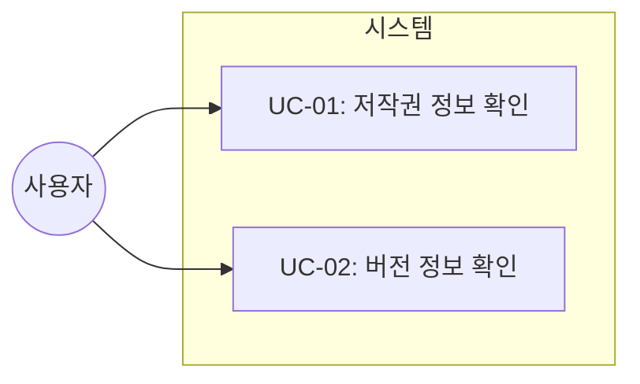

# TSK-01-04 - 푸터 컴포넌트 설계 문서

## 문서 정보

| 항목 | 내용 |
|------|------|
| Task ID | TSK-01-04 |
| 문서 버전 | 1.0 |
| 작성일 | 2026-01-20 |
| 상태 | 작성중 |
| 카테고리 | development |

---

## 1. 개요

### 1.1 배경 및 문제 정의

**현재 상황:**
- MES Portal 레이아웃 구조(TSK-01-01)가 구현되어 Header, Sider, Content, Footer 영역이 정의됨
- 푸터 영역에 실제 컴포넌트가 구현되지 않은 상태

**해결하려는 문제:**
- 포털 화면 하단에 저작권 및 버전 정보를 일관되게 표시해야 함
- 사용자가 현재 시스템 버전을 쉽게 확인할 수 있어야 함

### 1.2 목적 및 기대 효과

**목적:**
- 포털 레이아웃 하단에 고정된 푸터 컴포넌트 구현
- 저작권 표시 및 버전 정보 제공

**기대 효과:**
- 사용자 관점: 시스템 버전 정보를 쉽게 확인 가능
- 비즈니스 관점: 저작권 표시로 법적 보호, 버전 관리 용이

### 1.3 범위

**포함:**
- Footer 컴포넌트 생성
- 저작권 표시 (좌측)
- 버전 정보 (우측)
- 고정 높이 30px 적용

**제외:**
- 푸터 내 추가 링크 (개인정보처리방침, 이용약관 등) - 향후 확장
- 다국어 지원 - 향후 확장

### 1.4 참조 문서

| 문서 | 경로 | 관련 섹션 |
|------|------|----------|
| PRD | `.orchay/projects/mes-portal/prd.md` | PRD 4.1.1 푸터 (Footer) |
| TRD | `.orchay/projects/mes-portal/trd.md` | TRD 1.2 UI/스타일링 스택, TRD 1.5 CSS 중앙 집중 관리 |

---

## 2. 사용자 분석

### 2.1 대상 사용자

| 사용자 유형 | 특성 | 주요 니즈 |
|------------|------|----------|
| 모든 포털 사용자 | 공장장, 생산/품질/설비 담당자 | 시스템 버전 확인, 저작권 정보 확인 |
| IT 관리자 | 시스템 운영/유지보수 담당 | 배포된 버전 확인 |

### 2.2 사용자 페르소나

**페르소나 1: 생산 담당자**
- 역할: 라인별 생산 관리
- 목표: 시스템 사용 중 문의 시 현재 버전 확인
- 불만: 버전 정보 확인이 어려우면 문의 시 불편
- 시나리오: 시스템 오류 발생 시 IT팀에 버전 정보와 함께 문의

**페르소나 2: IT 관리자**
- 역할: 시스템 운영 관리
- 목표: 배포된 버전이 정확한지 확인
- 불만: 버전 정보가 없으면 배포 확인이 어려움
- 시나리오: 배포 후 사용자 화면에서 버전 확인

---

## 3. 유즈케이스

### 3.1 유즈케이스 다이어그램



### 3.2 유즈케이스 상세

#### UC-01: 저작권 정보 확인

| 항목 | 내용 |
|------|------|
| 액터 | 모든 포털 사용자 |
| 목적 | 시스템 저작권 정보 확인 |
| 사전 조건 | 포털에 로그인된 상태 |
| 사후 조건 | 없음 (읽기 전용) |
| 트리거 | 화면 하단 푸터 영역 확인 |

**기본 흐름:**
1. 사용자가 포털 화면에 접근한다
2. 시스템이 화면 하단에 푸터를 표시한다
3. 사용자가 푸터 좌측의 저작권 정보를 확인한다

#### UC-02: 버전 정보 확인

| 항목 | 내용 |
|------|------|
| 액터 | 모든 포털 사용자, IT 관리자 |
| 목적 | 현재 시스템 버전 확인 |
| 사전 조건 | 포털에 로그인된 상태 |
| 사후 조건 | 없음 (읽기 전용) |
| 트리거 | 화면 하단 푸터 영역 확인 |

**기본 흐름:**
1. 사용자가 포털 화면에 접근한다
2. 시스템이 화면 하단에 푸터를 표시한다
3. 사용자가 푸터 우측의 버전 정보를 확인한다

---

## 4. 사용자 시나리오

### 4.1 시나리오 1: 시스템 문의 시 버전 확인

**상황 설명:**
생산 담당자 김철수 씨가 시스템 사용 중 오류가 발생하여 IT팀에 문의하려고 한다. IT팀에서 버전 정보를 요청하여 화면 하단에서 버전을 확인한다.

**단계별 진행:**

| 단계 | 사용자 행동 | 시스템 반응 | 사용자 기대 |
|------|-----------|------------|------------|
| 1 | 포털 화면 하단을 확인 | 푸터 영역이 항상 표시됨 | 버전 정보가 보여야 함 |
| 2 | 우측의 버전 정보 확인 | "v1.0.0" 형태로 표시 | 명확한 버전 문자열 |
| 3 | IT팀에 버전 정보 전달 | - | 문의 처리 가능 |

**성공 조건:**
- 사용자가 버전 정보를 3초 이내에 찾을 수 있음
- 버전 형식이 명확하고 읽기 쉬움

### 4.2 시나리오 2: 배포 후 버전 확인

**상황 설명:**
IT 관리자가 새 버전을 배포한 후, 사용자 화면에서 배포가 정상적으로 완료되었는지 확인한다.

**단계별 진행:**

| 단계 | 사용자 행동 | 시스템 반응 | 사용자 기대 |
|------|-----------|------------|------------|
| 1 | 포털 접속 | 화면 렌더링 | 정상 접속 |
| 2 | 푸터의 버전 정보 확인 | 새 버전 표시 | 배포된 버전 확인 |

---

## 5. 화면 설계

### 5.1 화면 흐름도


푸터는 모든 포털 화면에서 레이아웃의 일부로 항상 표시된다.

### 5.2 화면별 상세

#### 화면 1: 푸터 컴포넌트

**화면 목적:**
포털 레이아웃 하단에 저작권 및 버전 정보를 표시하는 영역

**진입 경로:**
- 모든 포털 화면에서 레이아웃의 일부로 자동 표시

**와이어프레임:**
```
┌─────────────────────────────────────────────────────────────────────────────┐
│                                                                             │
│  Copyright © 2026 Company. All rights reserved.                   v1.0.0   │
│                                                                             │
└─────────────────────────────────────────────────────────────────────────────┘
   ▲                                                                   ▲
   │                                                                   │
   └── 좌측 정렬                                                우측 정렬 ──┘

   높이: 30px (var(--footer-height))
```

**화면 요소 설명:**

| 영역 | 설명 | 사용자 인터랙션 |
|------|------|----------------|
| 저작권 텍스트 | "Copyright © 2026 Company. All rights reserved." | 읽기 전용 (클릭 불가) |
| 버전 정보 | "v{버전}" 형식 (예: v1.0.0) | 읽기 전용 (클릭 불가) |

**사용자 행동 시나리오:**
1. 사용자가 포털 화면에 접속하면 하단에 푸터가 표시됨
2. 좌측에서 저작권 정보를 확인할 수 있음
3. 우측에서 버전 정보를 확인할 수 있음

### 5.3 반응형 동작

| 화면 크기 | 레이아웃 변화 | 사용자 경험 |
|----------|--------------|------------|
| 데스크톱 (1024px+) | 좌우 배치 유지 | 표준 표시 |
| 태블릿 (768-1023px) | 좌우 배치 유지 | 표준 표시 |
| 모바일 (767px-) | 좌우 배치 유지 (텍스트 축약 가능) | 필수 정보만 표시 |

---

## 6. 인터랙션 설계

### 6.1 사용자 액션과 피드백

푸터는 정적 정보 표시 컴포넌트로, 사용자 인터랙션이 없음.

| 사용자 액션 | 시스템 반응 |
|------------|-----------|
| 화면 진입 | 푸터 표시 |
| 화면 이동 | 푸터 유지 (레이아웃 일부) |

### 6.2 상태별 화면 변화

| 상태 | 화면 표시 |
|------|----------|
| 기본 상태 | 저작권 + 버전 정보 표시 |

### 6.3 키보드/접근성

| 기능 | 접근성 지원 |
|------|------------|
| 스크린 리더 | 푸터 영역으로 인식 (footer role) |
| 포커스 | 인터랙티브 요소 없으므로 포커스 불필요 |

---

## 7. 데이터 요구사항

### 7.1 필요한 데이터

| 데이터 | 설명 | 출처 | 용도 |
|--------|------|------|------|
| 저작권 연도 | 현재 연도 또는 시작 연도 | 시스템 설정 또는 하드코딩 | 저작권 표시 |
| 회사명 | 저작권 소유 회사명 | 시스템 설정 또는 하드코딩 | 저작권 표시 |
| 버전 정보 | 애플리케이션 버전 | package.json 또는 환경변수 | 버전 표시 |

### 7.2 버전 정보 출처

**옵션 1: package.json에서 가져오기**
```typescript
// package.json의 version 필드 사용
const version = process.env.NEXT_PUBLIC_APP_VERSION || '0.1.0'
```

**옵션 2: 환경변수 사용**
```
NEXT_PUBLIC_APP_VERSION=1.0.0
```

**권장: 환경변수 우선, 없으면 package.json fallback**

### 7.3 데이터 유효성 규칙

| 데이터 필드 | 규칙 |
|------------|------|
| 버전 | Semantic Versioning 형식 (예: 1.0.0) |
| 연도 | 4자리 숫자 |
| 회사명 | 비어있지 않은 문자열 |

---

## 8. 비즈니스 규칙

### 8.1 핵심 규칙

| 규칙 ID | 규칙 설명 | 적용 상황 | 예외 |
|---------|----------|----------|------|
| BR-01 | 푸터는 모든 포털 화면에서 표시되어야 함 | 포털 레이아웃 사용 시 | 로그인 화면 (인증 전) |
| BR-02 | 버전 정보는 실제 배포된 버전과 일치해야 함 | 모든 배포 시 | 없음 |
| BR-03 | 저작권 연도는 최신 상태 유지 | 연도 변경 시 | 없음 |

### 8.2 규칙 상세 설명

**BR-01: 푸터 표시 규칙**

설명: 푸터는 포털 레이아웃(PortalLayout)을 사용하는 모든 화면에서 표시됩니다. 로그인 화면은 별도 레이아웃을 사용하므로 푸터가 표시되지 않습니다.

예시:
- 대시보드: 푸터 표시 O
- 생산관리 화면: 푸터 표시 O
- 로그인 화면: 푸터 표시 X

**BR-02: 버전 동기화 규칙**

설명: 푸터에 표시되는 버전은 빌드 시점에 결정됩니다. 환경변수 또는 package.json에서 버전을 가져와 일관성을 보장합니다.

---

## 9. 에러 처리

### 9.1 예상 에러 상황

푸터는 정적 컴포넌트로 에러 상황이 거의 발생하지 않음.

| 상황 | 원인 | 대응 |
|------|------|------|
| 버전 정보 없음 | 환경변수 미설정 | 기본값 표시 (예: "v0.0.0") |

### 9.2 에러 표시 방식

| 에러 유형 | 표시 방법 |
|----------|----------|
| 버전 미설정 | 기본값으로 표시, 콘솔 경고 |

---

## 10. 연관 문서

| 문서 | 경로 | 용도 |
|------|------|------|
| 요구사항 추적 매트릭스 | `025-traceability-matrix.md` | PRD → 설계 → 테스트 양방향 추적 |
| 테스트 명세서 | `026-test-specification.md` | 단위/E2E/매뉴얼 테스트 상세 정의 |

---

## 11. 구현 범위

### 11.1 영향받는 영역

| 영역 | 변경 내용 | 영향도 |
|------|----------|--------|
| components/layout/Footer.tsx | 신규 컴포넌트 생성 | 높음 |
| PortalLayout | Footer 컴포넌트 연동 | 중간 |
| app/globals.css | --footer-height 변수 (이미 정의됨) | 낮음 |

### 11.2 의존성

| 의존 항목 | 이유 | 상태 |
|----------|------|------|
| TSK-01-01 (레이아웃 컴포넌트 구조) | 레이아웃에 Footer 영역이 정의되어 있어야 함 | 완료 (ap) |
| TSK-00-02 (UI 라이브러리 및 테마 설정) | Ant Design Layout.Footer 사용 | 대기 |

### 11.3 제약 사항

| 제약 | 설명 | 대응 방안 |
|------|------|----------|
| 높이 고정 | 30px로 고정되어야 함 (PRD 명세) | var(--footer-height) 사용 |
| TailwindCSS 레이아웃 | CSS 직접 작성 금지 (TRD 가이드) | flex justify-between 사용 |

---

## 12. 기술 설계

### 12.1 컴포넌트 구조

```
components/
└── layout/
    └── Footer.tsx       # 푸터 컴포넌트
```

### 12.2 컴포넌트 인터페이스

```typescript
// components/layout/Footer.tsx

interface FooterProps {
  className?: string  // 추가 스타일 클래스 (선택)
}

// 사용 예시
<Footer />
```

### 12.3 구현 명세

**컴포넌트 요구사항:**

| 항목 | 명세 |
|------|------|
| Ant Design 컴포넌트 | Layout.Footer |
| 높이 | var(--footer-height) = 30px |
| 레이아웃 | flex justify-between items-center |
| 좌측 콘텐츠 | 저작권 텍스트 |
| 우측 콘텐츠 | 버전 정보 |
| 배경색 | Ant Design 테마 colorBgContainer |
| 테두리 | 상단 border (colorBorderSecondary) |

**버전 정보 출처:**
- 환경변수: `NEXT_PUBLIC_APP_VERSION`
- Fallback: package.json version 필드

---

## 13. 체크리스트

### 13.1 설계 완료 확인

- [x] 문제 정의 및 목적 명확화
- [x] 사용자 분석 완료
- [x] 유즈케이스 정의 완료
- [x] 사용자 시나리오 작성 완료
- [x] 화면 설계 완료 (와이어프레임)
- [x] 인터랙션 설계 완료
- [x] 데이터 요구사항 정의 완료
- [x] 비즈니스 규칙 정의 완료
- [x] 에러 처리 정의 완료

### 13.2 연관 문서 작성

- [ ] 요구사항 추적 매트릭스 작성 (→ `025-traceability-matrix.md`)
- [ ] 테스트 명세서 작성 (→ `026-test-specification.md`)

### 13.3 구현 준비

- [x] 구현 우선순위 결정
- [x] 의존성 확인 완료
- [x] 제약 사항 검토 완료

---

## 변경 이력

| 버전 | 일자 | 작성자 | 변경 내용 |
|------|------|--------|----------|
| 1.0 | 2026-01-20 | Claude | 최초 작성 |
