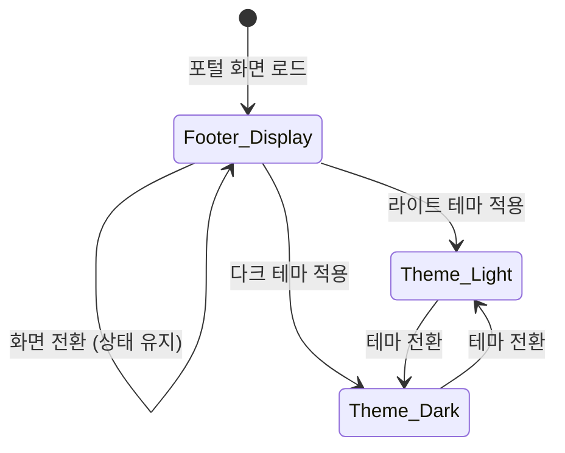

# TSK-01-04 - 푸터 컴포넌트 화면설계서

## 문서 정보

| 항목 | 내용 |
|------|------|
| Task ID | TSK-01-04 |
| 문서 버전 | 1.0 |
| 작성일 | 2026-01-20 |
| 상태 | 작성완료 |
| 기반 문서 | 010-design.md |

---

## 1. 화면 목록

| 화면 ID | 화면명 | 설명 | SVG 파일 |
|---------|--------|------|----------|
| SCR-01 | 푸터 기본 | 라이트 모드 푸터 | screen-01-footer.svg |
| SCR-01-D | 푸터 다크 모드 | 다크 모드 푸터 | screen-01-footer-dark.svg |
| SCR-02 | 반응형 푸터 | 화면 크기별 푸터 변화 | screen-02-responsive.svg |
| SCR-03 | 레이아웃 컨텍스트 | 전체 레이아웃에서의 위치 | screen-03-layout-context.svg |

---

## 2. 화면 전환 흐름

### 2.1 상태 다이어그램



### 2.2 액션-화면 매트릭스

| 현재 상태 | 사용자 액션 | 다음 상태 | 결과 |
|----------|------------|----------|------|
| Footer_Display | 화면 전환 | Footer_Display | 푸터 유지 (레이아웃 일부) |
| Theme_Light | 테마 전환 | Theme_Dark | 다크 모드 스타일 적용 |
| Theme_Dark | 테마 전환 | Theme_Light | 라이트 모드 스타일 적용 |

> **Note:** 푸터는 정적 표시 컴포넌트로 인터랙션이 없음. 테마 전환은 헤더의 테마 버튼에서 발생.

---

## 3. 화면별 상세 설계

### 3.1 SCR-01: 푸터 기본 (라이트 모드)

**SVG 참조:** `ui-assets/screen-01-footer.svg`

#### 레이아웃

```
┌─────────────────────────────────────────────────────────────────────────┐
│                              FOOTER (30px)                               │
│  ┌─────────────────────────────────────────────────────────────────────┐│
│  │ Copyright © 2026 Company. All rights reserved.              v1.0.0  ││
│  └─────────────────────────────────────────────────────────────────────┘│
│    ▲                                                              ▲     │
│    │                                                              │     │
│    └── 좌측 정렬 (text-left)                        우측 정렬 (text-right)│
└─────────────────────────────────────────────────────────────────────────┘
```

#### 컴포넌트 명세

| 컴포넌트 | Ant Design | 속성 | 동작 |
|----------|-----------|------|------|
| Footer Container | Layout.Footer | `height: var(--footer-height)`, `className: "flex justify-between items-center px-4"` | 정적 표시 |
| Copyright Text | Text | `className: "text-xs text-gray-500"` | 읽기 전용 |
| Version Text | Text | `className: "text-xs text-gray-500"` | 읽기 전용 |

#### 스타일 상세

| 속성 | 값 | CSS 변수 |
|------|------|----------|
| 높이 | 30px | `var(--footer-height)` |
| 배경색 | #FAFAFA (Light) | `colorBgContainer` |
| 상단 테두리 | 1px solid #E5E7EB | `colorBorderSecondary` |
| 좌우 패딩 | 16px | `px-4` |
| 텍스트 색상 | #6B7280 | `text-gray-500` |
| 텍스트 크기 | 12px | `text-xs` |

#### 상태

| 상태명 | 조건 | UI 변화 |
|--------|------|---------|
| 기본 | 항상 | 저작권 + 버전 표시 |

---

### 3.2 SCR-01-D: 푸터 다크 모드

**SVG 참조:** `ui-assets/screen-01-footer-dark.svg`

#### 스타일 차이

| 속성 | 라이트 모드 | 다크 모드 |
|------|------------|----------|
| 배경색 | #FAFAFA | #1F2937 |
| 상단 테두리 | #E5E7EB | #374151 |
| 텍스트 색상 | #6B7280 | #9CA3AF |

#### 테마 전환 동작

- 테마 변경 시 CSS 변수가 자동 적용됨 (next-themes)
- 푸터 컴포넌트 내부 로직 변경 없음

---

### 3.3 SCR-02: 반응형 푸터

**SVG 참조:** `ui-assets/screen-02-responsive.svg`

#### Breakpoint별 변화

| Breakpoint | 너비 | 저작권 텍스트 | 버전 |
|------------|------|--------------|------|
| Desktop | 1024px+ | "Copyright © 2026 Company. All rights reserved." | "v1.0.0" |
| Tablet | 768-1023px | "Copyright © 2026 Company." | "v1.0.0" |
| Mobile | <768px | "© 2026 Company" | "v1.0.0" |

#### 구현 방식

```tsx
// 반응형 저작권 텍스트
<span className="hidden md:inline">
  Copyright © 2026 Company. All rights reserved.
</span>
<span className="hidden sm:inline md:hidden">
  Copyright © 2026 Company.
</span>
<span className="sm:hidden">
  © 2026 Company
</span>
```

---

### 3.4 SCR-03: 레이아웃 컨텍스트

**SVG 참조:** `ui-assets/screen-03-layout-context.svg`

#### 전체 레이아웃 구조

```
┌─────────────────────────────────────────────────────────────┐
│ HEADER (60px)                                                │
├─────────┬───────────────────────────────────────────────────┤
│         │ TAB BAR (40px)                                     │
│ SIDEBAR ├───────────────────────────────────────────────────┤
│ (240px) │                                                    │
│         │ CONTENT AREA                                       │
│         │                                                    │
├─────────┴───────────────────────────────────────────────────┤
│ FOOTER (30px) ← TSK-01-04                                    │
└─────────────────────────────────────────────────────────────┘
```

#### 푸터 위치 규칙

| 규칙 | 설명 |
|------|------|
| 위치 | 레이아웃 최하단 고정 |
| 너비 | 전체 너비 (사이드바 포함) |
| z-index | 기본값 (콘텐츠 위에 올라가지 않음) |
| 스크롤 | 화면 하단에 고정 (sticky 아님, 레이아웃 일부) |

---

## 4. 공통 컴포넌트

### 4.1 Footer 컴포넌트 구조

```tsx
// components/layout/Footer.tsx
'use client';

import { Layout } from 'antd';

interface FooterProps {
  className?: string;
}

export function Footer({ className }: FooterProps) {
  const version = process.env.NEXT_PUBLIC_APP_VERSION || '0.1.0';
  const currentYear = new Date().getFullYear();
  const companyName = 'Company';

  return (
    <Layout.Footer
      className={`
        h-[var(--footer-height)]
        flex justify-between items-center
        px-4
        border-t border-gray-200 dark:border-gray-700
        bg-gray-50 dark:bg-gray-800
        ${className}
      `}
    >
      {/* Copyright - Responsive */}
      <span className="text-xs text-gray-500 dark:text-gray-400">
        <span className="hidden md:inline">
          Copyright © {currentYear} {companyName}. All rights reserved.
        </span>
        <span className="hidden sm:inline md:hidden">
          Copyright © {currentYear} {companyName}.
        </span>
        <span className="sm:hidden">
          © {currentYear} {companyName}
        </span>
      </span>

      {/* Version */}
      <span className="text-xs text-gray-500 dark:text-gray-400">
        v{version}
      </span>
    </Layout.Footer>
  );
}
```

---

## 5. 반응형 설계

### 5.1 Breakpoint 정의

| 이름 | 최소 너비 | 최대 너비 | 저작권 표시 |
|------|----------|----------|------------|
| Mobile | 0 | 639px | 축약 |
| Tablet | 640px | 1023px | 중간 |
| Desktop | 1024px | - | 전체 |

### 5.2 TailwindCSS 클래스 매핑

| Breakpoint | Prefix | 예시 |
|------------|--------|------|
| Mobile | (기본) | `sm:hidden` |
| Tablet | `sm:` | `sm:inline` |
| Desktop | `md:` | `md:inline` |

---

## 6. 접근성

### 6.1 시맨틱 마크업

| 요소 | HTML 역할 | 설명 |
|------|----------|------|
| Footer Container | `<footer>` | Ant Design Layout.Footer가 footer 태그 사용 |
| Copyright | `<span>` | 정보성 텍스트 |
| Version | `<span>` | 정보성 텍스트 |

### 6.2 스크린 리더

| 동작 | 지원 |
|------|------|
| 푸터 영역 인식 | `role="contentinfo"` 자동 적용 |
| 텍스트 읽기 | 저작권 및 버전 정보 읽기 가능 |
| 포커스 | 인터랙티브 요소 없으므로 포커스 불필요 |

### 6.3 색상 대비

| 요소 | 전경색 | 배경색 | 대비율 |
|------|--------|--------|--------|
| 텍스트 (Light) | #6B7280 | #FAFAFA | 5.4:1 |
| 텍스트 (Dark) | #9CA3AF | #1F2937 | 5.1:1 |

---

## 7. SVG 파일 목록

| 순번 | 파일명 | 설명 | 크기 |
|------|--------|------|------|
| 1 | screen-01-footer.svg | 푸터 기본 (라이트) | 1000x80 |
| 2 | screen-01-footer-dark.svg | 푸터 다크 모드 | 1000x80 |
| 3 | screen-02-responsive.svg | 반응형 푸터 | 800x200 |
| 4 | screen-03-layout-context.svg | 레이아웃 컨텍스트 | 600x400 |

---

## 8. 데이터 요구사항

### 8.1 동적 데이터

| 데이터 | 출처 | 기본값 | 설명 |
|--------|------|--------|------|
| version | `NEXT_PUBLIC_APP_VERSION` | "0.1.0" | 환경변수에서 가져옴 |
| year | `new Date().getFullYear()` | 현재 연도 | 런타임 계산 |
| companyName | 상수 | "Company" | 하드코딩 |

### 8.2 환경변수 설정

```bash
# .env.local
NEXT_PUBLIC_APP_VERSION=1.0.0
```

---

## 변경 이력

| 버전 | 일자 | 작성자 | 변경 내용 |
|------|------|--------|----------|
| 1.0 | 2026-01-20 | AI | 최초 작성 |
