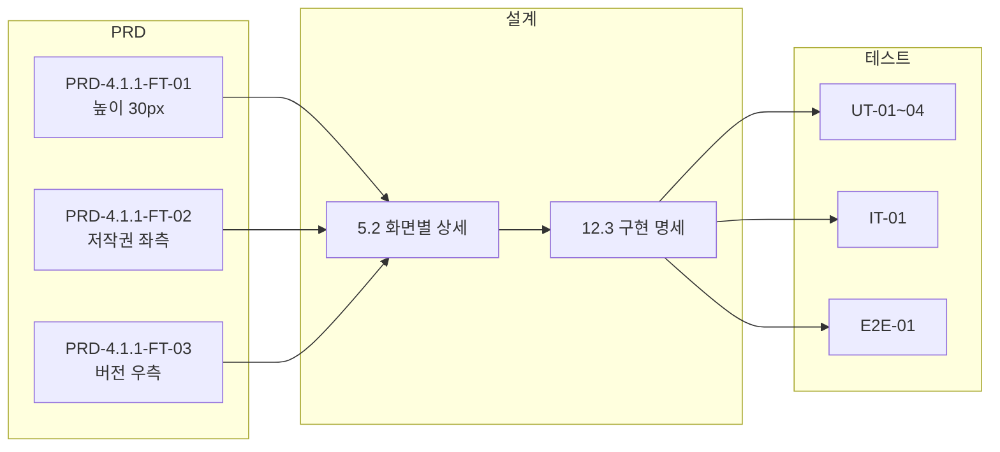

# TSK-01-04 - 푸터 컴포넌트 요구사항 추적 매트릭스

## 문서 정보

| 항목 | 내용 |
|------|------|
| Task ID | TSK-01-04 |
| 문서 버전 | 1.0 |
| 작성일 | 2026-01-20 |

---

## 1. PRD 요구사항 → 설계 추적

| PRD 요구사항 ID | PRD 요구사항 내용 | 설계 섹션 | 구현 항목 | 상태 |
|----------------|------------------|----------|----------|------|
| PRD-4.1.1-FT-01 | 푸터 높이: 고정 (30px) | 5.2 화면별 상세 | var(--footer-height) = 30px | 설계완료 |
| PRD-4.1.1-FT-02 | 좌측: 저작권 표시 | 5.2 화면별 상세 | 좌측 정렬 저작권 텍스트 | 설계완료 |
| PRD-4.1.1-FT-03 | 우측: 버전 정보 | 5.2 화면별 상세 | 우측 정렬 버전 텍스트 | 설계완료 |

---

## 2. WBS 요구사항 → 설계 추적

| WBS 항목 | 설계 반영 | 검증 방법 |
|---------|----------|----------|
| 저작권 표시 (좌측) | 5.2 화면별 상세 - 저작권 텍스트 영역 | 화면 확인 |
| 버전 정보 (우측) | 5.2 화면별 상세 - 버전 정보 영역 | 화면 확인 |
| 고정 높이 30px | 12.3 구현 명세 - var(--footer-height) | CSS 검증 |

---

## 3. WBS integrationCheck → 테스트 케이스 매핑

| integrationCheck 항목 | 테스트 유형 | 테스트 ID | 검증 내용 |
|----------------------|-----------|----------|----------|
| components/layout/Footer.tsx 파일 존재 | 단위 테스트 | UT-01 | 컴포넌트 파일 존재 확인 |
| 버전 정보는 package.json 또는 환경변수에서 가져오기 | 단위 테스트 | UT-02 | 버전 정보 출처 검증 |

---

## 4. 설계 → 테스트 케이스 추적

| 설계 항목 | 테스트 ID | 테스트 유형 | 우선순위 |
|----------|----------|-----------|---------|
| 푸터 컴포넌트 렌더링 | UT-01 | 단위 테스트 | P1 |
| 버전 정보 표시 | UT-02 | 단위 테스트 | P1 |
| 저작권 텍스트 표시 | UT-03 | 단위 테스트 | P1 |
| 푸터 높이 검증 | UT-04 | 단위 테스트 | P2 |
| 레이아웃 통합 | IT-01 | 통합 테스트 | P1 |
| 화면 표시 확인 | E2E-01 | E2E 테스트 | P1 |

---

## 5. 수용 기준 → 테스트 매핑

| WBS 수용 기준 | 테스트 ID | 검증 방법 |
|--------------|----------|----------|
| 푸터 높이 30px 고정 | UT-04, E2E-01 | CSS 속성 검증, 화면 측정 |
| 저작권 텍스트 좌측 정렬 | UT-03, E2E-01 | flexbox 정렬 검증, 화면 확인 |
| 버전 정보 우측 정렬 | UT-02, E2E-01 | flexbox 정렬 검증, 화면 확인 |

---

## 6. 추적성 요약

---

## 7. 커버리지 분석

| 구분 | 총 항목 | 추적 완료 | 커버리지 |
|------|--------|---------|----------|
| PRD 요구사항 | 3 | 3 | 100% |
| WBS 요구사항 | 3 | 3 | 100% |
| integrationCheck | 2 | 2 | 100% |
| 수용 기준 | 3 | 3 | 100% |

---

## 변경 이력

| 버전 | 일자 | 작성자 | 변경 내용 |
|------|------|--------|----------|
| 1.0 | 2026-01-20 | Claude | 최초 작성 |
