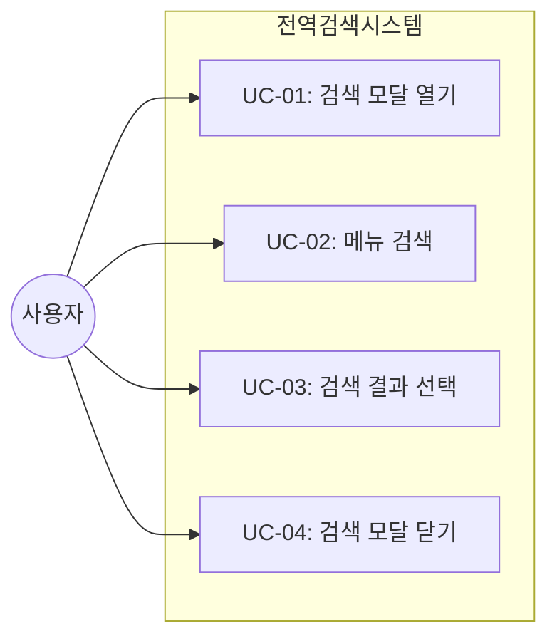
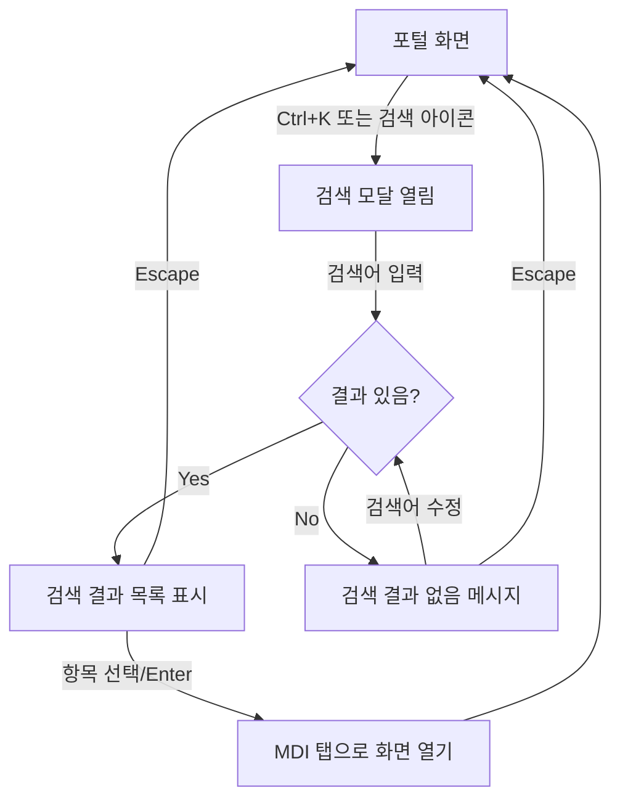

# TSK-01-05 - 전역 검색 모달 설계 문서

## 문서 정보

| 항목 | 내용 |
|------|------|
| Task ID | TSK-01-05 |
| 문서 버전 | 1.0 |
| 작성일 | 2026-01-20 |
| 상태 | 작성중 |
| 카테고리 | development |

---

## 1. 개요

### 1.1 배경 및 문제 정의

**현재 상황:**
- 사용자는 원하는 화면에 접근하기 위해 사이드바 메뉴를 계층적으로 탐색해야 함
- 메뉴가 많아지면 원하는 화면을 찾는데 시간이 소요됨
- 익숙하지 않은 사용자는 메뉴 구조를 파악하기 어려움

**해결하려는 문제:**
- 메뉴 탐색 시간 단축
- 키보드 중심 사용자를 위한 빠른 접근 방법 제공
- 화면 이름을 알고 있을 때 즉시 접근 가능

### 1.2 목적 및 기대 효과

**목적:**
- 키보드 단축키(Ctrl+K)로 즉시 접근 가능한 전역 검색 기능 제공
- 메뉴/화면을 실시간 검색하여 빠르게 원하는 화면으로 이동

**기대 효과:**
- 사용자: 화면 접근 시간 단축, 키보드만으로 빠른 탐색
- 비즈니스: 사용자 생산성 향상, UX 개선

### 1.3 범위

**포함:**
- 검색 모달 컴포넌트 (GlobalSearch)
- 메뉴/화면 실시간 검색 기능
- 검색 결과 리스트 표시
- 키보드 네비게이션 (화살표 키, Enter, Escape)
- Ctrl+K 전역 단축키
- 헤더의 검색 아이콘 클릭으로 모달 열기

**제외:**
- 검색 히스토리 저장 (향후 과제)
- 검색어 자동 완성 (향후 과제)
- 화면 내용 검색 (메뉴명만 검색)

### 1.4 참조 문서

| 문서 | 경로 | 관련 섹션 |
|------|------|----------|
| PRD | `.orchay/projects/mes-portal/prd.md` | 4.1.1 전역 검색, 키보드 단축키 |
| TRD | `.orchay/projects/mes-portal/trd.md` | - |

---

## 2. 사용자 분석

### 2.1 대상 사용자

| 사용자 유형 | 특성 | 주요 니즈 |
|------------|------|----------|
| 파워 유저 | 키보드 단축키 선호, 빠른 작업 수행 | 마우스 없이 빠르게 화면 이동 |
| 일반 사용자 | 메뉴 구조가 익숙하지 않음 | 화면 이름으로 검색하여 찾기 |
| 관리자 | 다양한 화면을 자주 이동 | 효율적인 화면 전환 |

### 2.2 사용자 페르소나

**페르소나 1: 김생산 (생산 담당자)**
- 역할: 생산라인 담당자
- 목표: 여러 생산 관련 화면을 빠르게 오가며 작업
- 불만: 메뉴를 펼쳐서 하위 화면까지 클릭하는 것이 번거로움
- 시나리오: 작업 중 "생산 실적"이라는 화면으로 바로 이동하고 싶음

**페르소나 2: 박관리 (공장장)**
- 역할: 전체 생산 현황 모니터링
- 목표: 대시보드와 각종 리포트 화면을 오가며 확인
- 불만: 화면 이름은 알지만 메뉴 어디에 있는지 기억이 안 남
- 시나리오: "대시보드" 검색해서 바로 이동

---

## 3. 유즈케이스

### 3.1 유즈케이스 다이어그램



### 3.2 유즈케이스 상세

#### UC-01: 검색 모달 열기

| 항목 | 내용 |
|------|------|
| 액터 | 로그인한 사용자 |
| 목적 | 전역 검색 모달을 열어 메뉴/화면 검색 시작 |
| 사전 조건 | 포털 화면에 접속한 상태 |
| 사후 조건 | 검색 모달이 화면 중앙에 표시됨 |
| 트리거 | Ctrl+K 단축키 또는 헤더의 검색 아이콘 클릭 |

**기본 흐름:**
1. 사용자가 Ctrl+K를 누른다
2. 시스템이 검색 모달을 화면 중앙에 표시한다
3. 검색 입력창에 자동으로 포커스가 이동한다
4. 사용자가 검색어 입력을 시작할 수 있다

**대안 흐름:**
- 1a. 사용자가 헤더의 검색 아이콘을 클릭하면:
  - 동일하게 검색 모달이 표시된다

**예외 흐름:**
- 1a. 입력 필드에 포커스가 있을 때 Ctrl+K를 누르면:
  - 브라우저 기본 동작이 실행되지 않도록 차단
  - 검색 모달이 정상적으로 열림

#### UC-02: 메뉴 검색

| 항목 | 내용 |
|------|------|
| 액터 | 로그인한 사용자 |
| 목적 | 원하는 메뉴/화면을 검색어로 찾기 |
| 사전 조건 | 검색 모달이 열린 상태 |
| 사후 조건 | 검색어와 일치하는 메뉴 목록이 표시됨 |
| 트리거 | 검색어 입력 |

**기본 흐름:**
1. 사용자가 검색어를 입력한다
2. 시스템이 실시간으로 메뉴 목록을 필터링한다
3. 검색어와 일치하는 메뉴 항목들이 리스트로 표시된다
4. 각 항목에는 아이콘, 메뉴명, 경로가 표시된다

**대안 흐름:**
- 3a. 검색 결과가 없으면:
  - "검색 결과가 없습니다" 메시지 표시

#### UC-03: 검색 결과 선택

| 항목 | 내용 |
|------|------|
| 액터 | 로그인한 사용자 |
| 목적 | 검색된 메뉴 항목을 선택하여 해당 화면으로 이동 |
| 사전 조건 | 검색 결과가 표시된 상태 |
| 사후 조건 | 해당 화면이 MDI 탭으로 열림, 검색 모달 닫힘 |
| 트리거 | 항목 클릭 또는 Enter 키 |

**기본 흐름:**
1. 사용자가 화살표 키로 원하는 항목을 선택한다
2. Enter 키를 누른다
3. 시스템이 해당 화면을 MDI 탭으로 연다
4. 검색 모달이 자동으로 닫힌다

**대안 흐름:**
- 1a. 사용자가 마우스로 항목을 클릭하면:
  - 동일하게 해당 화면이 열림

#### UC-04: 검색 모달 닫기

| 항목 | 내용 |
|------|------|
| 액터 | 로그인한 사용자 |
| 목적 | 검색을 취소하고 모달을 닫기 |
| 사전 조건 | 검색 모달이 열린 상태 |
| 사후 조건 | 검색 모달이 닫힘 |
| 트리거 | Escape 키 또는 모달 바깥 클릭 |

**기본 흐름:**
1. 사용자가 Escape 키를 누른다
2. 검색 모달이 닫힌다
3. 이전 포커스 위치로 복귀한다

---

## 4. 사용자 시나리오

### 4.1 시나리오 1: 키보드로 빠른 화면 이동

**상황 설명:**
김생산 담당자가 생산 실적 입력 화면에서 작업 중, 갑자기 대시보드를 확인해야 하는 상황이 발생했다. 메뉴를 찾아 클릭하는 것보다 빠르게 이동하고 싶다.

**단계별 진행:**

| 단계 | 사용자 행동 | 시스템 반응 | 사용자 기대 |
|------|-----------|------------|------------|
| 1 | Ctrl+K 입력 | 검색 모달이 중앙에 표시됨 | 검색창에 포커스 |
| 2 | "대시" 입력 | "대시보드" 메뉴가 필터링되어 표시 | 원하는 메뉴가 보임 |
| 3 | Enter 입력 | 대시보드 화면이 새 탭으로 열림, 모달 닫힘 | 화면 즉시 이동 |

**성공 조건:**
- 3초 이내에 원하는 화면으로 이동 완료
- 마우스 없이 키보드만으로 전체 과정 수행

### 4.2 시나리오 2: 검색 결과 없음

**상황 설명:**
박관리 공장장이 "불량" 관련 화면을 찾으려 하지만, 정확한 화면 이름을 모른다.

**단계별 진행:**

| 단계 | 사용자 행동 | 시스템 반응 | 복구 방법 |
|------|-----------|------------|----------|
| 1 | "불량현황" 검색 | "검색 결과가 없습니다" 표시 | 다른 검색어 시도 |
| 2 | 검색어 "불량" 수정 | 관련 메뉴 표시 (예: 불량 관리) | 결과에서 선택 |
| 3 | Escape로 취소 | 모달 닫힘 | 사이드바 메뉴 직접 탐색 |

---

## 5. 화면 설계

### 5.1 화면 흐름도



### 5.2 화면별 상세

#### 화면 1: 전역 검색 모달

**화면 목적:**
메뉴/화면을 빠르게 검색하고 선택하여 해당 화면으로 이동하기 위한 모달

**진입 경로:**
- Ctrl+K 단축키
- 헤더의 검색 아이콘 클릭

**와이어프레임:**
```
┌─────────────────────────────────────────────────────────┐
│                    (오버레이 배경)                        │
│                                                          │
│    ┌─────────────────────────────────────────────┐      │
│    │  🔍  메뉴 또는 화면 검색...           Ctrl+K │      │
│    ├─────────────────────────────────────────────┤      │
│    │                                              │      │
│    │  📊  대시보드                                │      │
│    │      포털 > 대시보드                         │      │
│    │  ─────────────────────────────────────────  │      │
│    │  📋  작업 지시                  ← 선택됨    │      │
│    │      생산관리 > 작업지시 > 작업 지시 조회   │      │
│    │  ─────────────────────────────────────────  │      │
│    │  📈  생산 실적                               │      │
│    │      생산관리 > 실적관리 > 생산 실적 입력   │      │
│    │                                              │      │
│    │  ↑↓ 이동  ↵ 열기  esc 닫기                 │      │
│    └─────────────────────────────────────────────┘      │
│                                                          │
└─────────────────────────────────────────────────────────┘
```

**화면 요소 설명:**

| 영역 | 설명 | 사용자 인터랙션 |
|------|------|----------------|
| 오버레이 배경 | 반투명 어두운 배경 | 클릭 시 모달 닫기 |
| 검색 입력창 | 검색어 입력 필드 | 타이핑 시 실시간 필터링 |
| Ctrl+K 힌트 | 단축키 안내 배지 | 정보 제공용 |
| 검색 결과 목록 | 메뉴 항목 리스트 | 클릭 또는 Enter로 선택 |
| 메뉴 아이콘 | 각 메뉴의 아이콘 | - |
| 메뉴명 | 화면 이름 | 검색어 매칭 부분 하이라이트 |
| 경로 표시 | 메뉴 계층 경로 | 위치 파악용 |
| 선택 표시 | 현재 선택된 항목 강조 | 화살표 키로 이동 |
| 하단 힌트 | 키보드 조작 안내 | 정보 제공용 |

**사용자 행동 시나리오:**
1. 사용자가 Ctrl+K로 모달을 열면 검색 입력창에 포커스
2. 검색어를 입력하면 실시간으로 메뉴 목록이 필터링됨
3. 화살표 키로 항목을 탐색하면 선택 항목이 변경됨
4. Enter를 누르면 해당 화면이 MDI 탭으로 열림
5. Escape를 누르면 모달이 닫힘

### 5.3 검색 결과 없음 상태

**와이어프레임:**
```
┌─────────────────────────────────────────────────┐
│  🔍  존재하지않는화면                   Ctrl+K │
├─────────────────────────────────────────────────┤
│                                                  │
│            🔍                                    │
│      검색 결과가 없습니다.                       │
│      다른 검색어를 입력해 주세요.                │
│                                                  │
│  ↑↓ 이동  ↵ 열기  esc 닫기                     │
└─────────────────────────────────────────────────┘
```

### 5.4 반응형 동작

| 화면 크기 | 레이아웃 변화 | 사용자 경험 |
|----------|--------------|------------|
| 데스크톱 (1024px+) | 모달 너비 480px, 중앙 정렬 | 최적의 검색 경험 |
| 태블릿 (768-1023px) | 모달 너비 90%, 중앙 정렬 | 동일한 UX |
| 모바일 (767px-) | 모달 너비 100%, 상단 정렬 | 키보드 입력 공간 확보 |

---

## 6. 인터랙션 설계

### 6.1 사용자 액션과 피드백

| 사용자 액션 | 즉각 피드백 | 결과 피드백 | 에러 피드백 |
|------------|-----------|------------|------------|
| Ctrl+K 입력 | 모달 즉시 표시 (fade-in) | 입력창 포커스 | - |
| 검색어 입력 | 실시간 필터링 (debounce 150ms) | 결과 목록 업데이트 | 결과 없음 메시지 |
| 화살표 키 | 선택 항목 변경 (하이라이트) | 스크롤 자동 조정 | - |
| Enter 입력 | 모달 닫힘 시작 | MDI 탭 열림 | - |
| Escape 입력 | 모달 닫힘 (fade-out) | 이전 포커스 복귀 | - |
| 바깥 클릭 | 모달 닫힘 | - | - |

### 6.2 상태별 화면 변화

| 상태 | 화면 표시 | 사용자 안내 |
|------|----------|------------|
| 초기 (입력 전) | 빈 입력창 + placeholder | "메뉴 또는 화면 검색..." |
| 검색 중 | 결과 목록 표시 | 매칭 텍스트 하이라이트 |
| 결과 없음 | 빈 상태 아이콘 + 메시지 | "검색 결과가 없습니다" |
| 항목 선택됨 | 선택 항목 배경색 강조 | 파란색 계열 하이라이트 |

### 6.3 키보드/접근성

| 기능 | 키보드 단축키 | 스크린 리더 안내 |
|------|-------------|-----------------|
| 모달 열기 | Ctrl+K (Cmd+K) | "전역 검색 열기" |
| 모달 닫기 | Escape | "검색 닫기" |
| 다음 항목 | 화살표 아래 | "{메뉴명}, {n}개 중 {m}번째" |
| 이전 항목 | 화살표 위 | "{메뉴명}, {n}개 중 {m}번째" |
| 항목 선택 | Enter | "{메뉴명} 화면 열기" |

---

## 7. 데이터 요구사항

### 7.1 필요한 데이터

| 데이터 | 설명 | 출처 | 용도 |
|--------|------|------|------|
| 메뉴 목록 | 사용자가 접근 가능한 전체 메뉴 | /api/menus API | 검색 대상 |
| 메뉴 아이콘 | 각 메뉴의 아이콘 정보 | Menu 테이블 icon 필드 | 결과 목록 표시 |
| 메뉴 경로 | 메뉴 계층 구조 | parentId 기반 트리 구조 | 경로 표시 |

### 7.2 메뉴 데이터 구조

```typescript
interface MenuItem {
  id: string;
  code: string;
  name: string;           // 검색 대상
  path: string;           // 화면 경로
  icon?: string;          // 메뉴 아이콘
  parentId?: string;      // 상위 메뉴
  sortOrder: number;
  isActive: boolean;
  children?: MenuItem[];  // 하위 메뉴
}

// 검색 결과 표시용
interface SearchResult {
  menu: MenuItem;
  breadcrumb: string;     // "생산관리 > 실적관리 > 생산 실적"
  matchIndices: number[]; // 검색어 매칭 위치 (하이라이트용)
}
```

### 7.3 데이터 유효성 규칙

| 데이터 필드 | 규칙 | 처리 |
|------------|------|------|
| 검색어 | 최소 1자 이상 | 빈 문자열이면 전체 메뉴 표시 안함 |
| 메뉴 목록 | isActive === true | 비활성 메뉴 제외 |
| 접근 권한 | 사용자 역할 기반 | 권한 없는 메뉴 제외 (서버에서 필터링됨) |

---

## 8. 비즈니스 규칙

### 8.1 핵심 규칙

| 규칙 ID | 규칙 설명 | 적용 상황 | 예외 |
|---------|----------|----------|------|
| BR-01 | 검색은 메뉴명에 대해서만 수행 | 모든 검색 | 없음 |
| BR-02 | 대소문자 구분 없이 검색 | 영문 검색 시 | 없음 |
| BR-03 | 부분 일치 검색 지원 | 모든 검색 | 없음 |
| BR-04 | 권한 있는 메뉴만 검색 결과에 표시 | 모든 검색 | 없음 |
| BR-05 | 화면(leaf) 메뉴만 선택 가능 | 결과 선택 시 | 폴더 메뉴 선택 불가 |

### 8.2 규칙 상세 설명

**BR-01: 메뉴명 검색**

설명: 검색어는 메뉴의 `name` 필드에 대해서만 매칭됩니다. 메뉴 코드, 경로 등은 검색 대상이 아닙니다.

예시:
- "생산" 검색 → "생산 관리", "생산 실적", "생산 현황" 등 표시
- "production" 검색 → 영문 메뉴명에 포함된 경우만 표시

**BR-05: 화면 메뉴만 선택 가능**

설명: 하위 메뉴가 있는 폴더 형태의 메뉴는 검색 결과에서 선택해도 화면으로 이동할 수 없습니다. path가 있는 leaf 메뉴만 선택 가능합니다.

예시:
- "생산관리" (폴더) → 결과에 표시되지만 선택 불가 (회색 처리)
- "생산 실적 입력" (화면) → 선택하면 해당 화면으로 이동

---

## 9. 에러 처리

### 9.1 예상 에러 상황

| 상황 | 원인 | 사용자 메시지 | 복구 방법 |
|------|------|--------------|----------|
| 검색 결과 없음 | 입력어와 일치하는 메뉴 없음 | "검색 결과가 없습니다" | 다른 검색어 입력 |
| 메뉴 데이터 로드 실패 | 네트워크 오류 | "메뉴를 불러올 수 없습니다" | 재시도 버튼 |
| MDI 탭 열기 실패 | 최대 탭 수 초과 | "탭을 더 열 수 없습니다" | 기존 탭 닫기 안내 |

### 9.2 에러 표시 방식

| 에러 유형 | 표시 위치 | 표시 방법 |
|----------|----------|----------|
| 검색 결과 없음 | 결과 영역 중앙 | 아이콘 + 안내 메시지 |
| 네트워크 오류 | 모달 상단 | 에러 배너 + 재시도 버튼 |
| 시스템 오류 | 토스트 알림 | 우측 상단 에러 토스트 |

---

## 10. 연관 문서

> 상세 테스트 명세 및 요구사항 추적은 별도 문서에서 관리합니다.

| 문서 | 경로 | 용도 |
|------|------|------|
| 요구사항 추적 매트릭스 | `025-traceability-matrix.md` | PRD → 설계 → 테스트 양방향 추적 |
| 테스트 명세서 | `026-test-specification.md` | 단위/E2E/매뉴얼 테스트 상세 정의 |

---

## 11. 구현 범위

### 11.1 영향받는 영역

| 영역 | 변경 내용 | 영향도 |
|------|----------|--------|
| components/common/GlobalSearch.tsx | 신규 컴포넌트 생성 | 높음 |
| components/layout/Header.tsx | 검색 아이콘 및 모달 트리거 추가 | 중간 |
| lib/hooks/useHotkeys.ts | Ctrl+K 단축키 등록 | 낮음 |
| lib/mdi/context.tsx | openTab 함수 호출 | 낮음 |

### 11.2 의존성

| 의존 항목 | 이유 | 상태 |
|----------|------|------|
| TSK-01-02: 헤더 컴포넌트 | 검색 아이콘을 헤더에 배치 | 대기 |
| TSK-03-01: 메뉴 데이터 모델 | 검색 대상 메뉴 데이터 | 대기 |
| TSK-02-01: MDI 상태 관리 | 선택한 화면을 탭으로 열기 | 대기 |

### 11.3 제약 사항

| 제약 | 설명 | 대응 방안 |
|------|------|----------|
| 메뉴 데이터 의존 | 메뉴 API가 구현되어야 실제 검색 가능 | Mock 데이터로 개발 진행 |
| MDI 연동 필요 | 탭으로 화면을 열려면 MDI 컨텍스트 필요 | MDI 구현 후 연동 |

---

## 12. 체크리스트

### 12.1 설계 완료 확인

- [x] 문제 정의 및 목적 명확화
- [x] 사용자 분석 완료
- [x] 유즈케이스 정의 완료
- [x] 사용자 시나리오 작성 완료
- [x] 화면 설계 완료 (와이어프레임)
- [x] 인터랙션 설계 완료
- [x] 데이터 요구사항 정의 완료
- [x] 비즈니스 규칙 정의 완료
- [x] 에러 처리 정의 완료

### 12.2 연관 문서 작성

- [ ] 요구사항 추적 매트릭스 작성 (→ `025-traceability-matrix.md`)
- [ ] 테스트 명세서 작성 (→ `026-test-specification.md`)

### 12.3 구현 준비

- [x] 구현 우선순위 결정
- [x] 의존성 확인 완료
- [x] 제약 사항 검토 완료

---

## 변경 이력

| 버전 | 일자 | 작성자 | 변경 내용 |
|------|------|--------|----------|
| 1.0 | 2026-01-20 | Claude | 최초 작성 |
