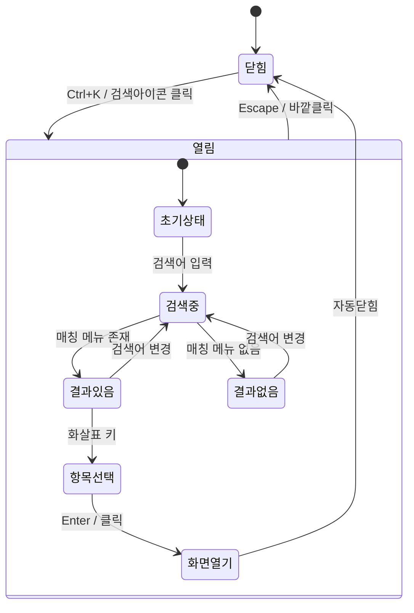

# TSK-01-05 - 전역 검색 모달 UI 설계

**Version:** 1.0 — **Last Updated:** 2026-01-20

> **목적**: 전역 검색 모달 화면 설계 및 인터랙션 정의

---

## 1. 화면 목록

| 화면 ID | 화면명 | 목적 | SVG 참조 |
|---------|--------|------|----------|
| SCR-01 | 검색 모달 (초기) | 검색어 입력 전 상태 | `screen-01-search-initial.svg` |
| SCR-02 | 검색 결과 표시 | 검색 결과 목록 | `screen-02-search-results.svg` |
| SCR-03 | 결과 없음 | 검색 결과 없음 상태 | `screen-03-search-empty.svg` |
| SCR-04 | 항목 선택 | 키보드로 항목 선택 | `screen-04-search-selected.svg` |

---

## 2. 화면 전환 흐름

### 2.1 상태 다이어그램



### 2.2 액션-화면 매트릭스

| 액션 | 현재 상태 | 결과 상태 | 트리거 |
|------|----------|----------|--------|
| Ctrl+K | 닫힘 | 열림 (초기) | 사용자 |
| 검색어 입력 | 초기/결과 | 검색 중 | 사용자 |
| 화살표 키 | 결과 있음 | 항목 선택 변경 | 사용자 |
| Enter | 항목 선택됨 | 화면 열기 → 닫힘 | 사용자 |
| Escape | 열림 | 닫힘 | 사용자 |
| 바깥 클릭 | 열림 | 닫힘 | 사용자 |

---

## 3. 화면별 상세

### 3.1 SCR-01: 검색 모달 (초기)

**화면 목적**: 검색어 입력 대기 상태

**레이아웃 구조**:
```
┌─────────────────────────────────────────────────────────┐
│                    (오버레이 배경)                        │
│                 backdrop: rgba(0,0,0,0.45)               │
│                                                          │
│    ┌─────────────────────────────────────────────┐      │
│    │  🔍  메뉴 또는 화면 검색...           Ctrl+K │      │
│    │     ↑ placeholder                    ↑ 힌트 │      │
│    ├─────────────────────────────────────────────┤      │
│    │                                              │      │
│    │            (빈 영역 - 결과 없음)             │      │
│    │                                              │      │
│    │  ↑↓ 이동  ↵ 열기  esc 닫기                 │      │
│    └─────────────────────────────────────────────┘      │
│                                                          │
└─────────────────────────────────────────────────────────┘
```

**컴포넌트 구성**:

| 영역 | 컴포넌트 | Props | 비고 |
|------|----------|-------|------|
| 오버레이 | Modal | `open, maskClosable` | Ant Design |
| 검색 입력 | Input | `prefix={<SearchOutlined/>}` | 자동 포커스 |
| 힌트 배지 | Tag | - | 우측 배치 |
| 하단 힌트 | div | - | 키보드 안내 |

**스타일**:

| 요소 | 값 |
|------|-----|
| 모달 너비 | 480px (데스크톱), 90% (태블릿), 100% (모바일) |
| 모달 위치 | 상단에서 20% |
| 입력창 높이 | 48px |
| 테두리 | border-radius: 8px |
| 그림자 | box-shadow: 0 8px 32px rgba(0,0,0,0.15) |

---

### 3.2 SCR-02: 검색 결과 표시

**화면 목적**: 검색 결과 목록 표시

**레이아웃 구조**:
```
┌─────────────────────────────────────────────────┐
│  🔍  대시                                Ctrl+K │  ← 입력된 검색어
├─────────────────────────────────────────────────┤
│                                                  │
│  ┌────────────────────────────────────────────┐ │
│  │ 📊  대시보드                              │ │  ← 결과 1 (첫 번째 자동 선택)
│  │     포털 > 대시보드                       │ │     경로 breadcrumb
│  └────────────────────────────────────────────┘ │
│  ┌────────────────────────────────────────────┐ │
│  │ 📈  대시보드 설정                          │ │  ← 결과 2
│  │     설정 > 시스템 > 대시보드 설정          │ │
│  └────────────────────────────────────────────┘ │
│                                                  │
│  ↑↓ 이동  ↵ 열기  esc 닫기                     │
└─────────────────────────────────────────────────┘
```

**컴포넌트 구성**:

| 영역 | 컴포넌트 | Props | 비고 |
|------|----------|-------|------|
| 결과 목록 | List | `dataSource={results}` | 가상화 옵션 |
| 결과 아이템 | List.Item | `onClick, className` | 선택 가능 |
| 메뉴 아이콘 | Icon | - | @ant-design/icons |
| 메뉴명 | Text | `strong` | 매칭 부분 하이라이트 |
| 경로 | Text | `type="secondary"` | 회색 표시 |

**검색어 하이라이트**:
```tsx
// 검색어 "대시"가 "대시보드"의 앞부분과 일치
<span>
  <mark>대시</mark>보드
</span>
```

---

### 3.3 SCR-03: 결과 없음

**화면 목적**: 검색 결과가 없을 때 안내

**레이아웃 구조**:
```
┌─────────────────────────────────────────────────┐
│  🔍  존재하지않는메뉴                    Ctrl+K │
├─────────────────────────────────────────────────┤
│                                                  │
│                    🔍                            │
│                                                  │
│            검색 결과가 없습니다.                │
│         다른 검색어를 입력해 주세요.            │
│                                                  │
│  ↑↓ 이동  ↵ 열기  esc 닫기                     │
└─────────────────────────────────────────────────┘
```

**컴포넌트 구성**:

| 영역 | 컴포넌트 | Props | 비고 |
|------|----------|-------|------|
| 빈 상태 | Empty | `image, description` | Ant Design |
| 아이콘 | SearchOutlined | `style={{ fontSize: 48 }}` | 회색 |
| 메시지 | Text | `type="secondary"` | 2줄 |

---

### 3.4 SCR-04: 항목 선택

**화면 목적**: 키보드로 선택된 항목 강조

**레이아웃 구조**:
```
┌─────────────────────────────────────────────────┐
│  🔍  생산                                Ctrl+K │
├─────────────────────────────────────────────────┤
│                                                  │
│  ┌────────────────────────────────────────────┐ │
│  │ 📋  작업 지시                              │ │
│  │     생산관리 > 작업지시 > 작업 지시 조회   │ │
│  └────────────────────────────────────────────┘ │
│  ╔════════════════════════════════════════════╗ │  ← 선택된 항목
│  ║ 📈  생산 현황                      ← 선택됨║ │     배경색 강조
│  ║     생산관리 > 현황 > 생산 현황            ║ │
│  ╚════════════════════════════════════════════╝ │
│  ┌────────────────────────────────────────────┐ │
│  │ 📝  생산 실적 입력                          │ │
│  │     생산관리 > 실적 > 생산 실적 입력        │ │
│  └────────────────────────────────────────────┘ │
│                                                  │
│  ↑↓ 이동  ↵ 열기  esc 닫기                     │
└─────────────────────────────────────────────────┘
```

**선택 상태 스타일**:

| 요소 | 기본 상태 | 선택 상태 |
|------|----------|----------|
| 배경색 | transparent | token.colorPrimaryBg |
| 테두리 | none | 2px solid token.colorPrimary |
| 텍스트 | token.colorText | token.colorPrimary |

---

## 4. 공통 컴포넌트

### 4.1 검색 입력창

```typescript
interface SearchInputProps {
  value: string;
  onChange: (value: string) => void;
  placeholder?: string;
  autoFocus?: boolean;
}
```

**구조**:
- 좌측: 검색 아이콘 (🔍)
- 중앙: 입력 필드
- 우측: Ctrl+K 힌트 배지

### 4.2 검색 결과 아이템

```typescript
interface SearchResultItemProps {
  menu: MenuItem;
  breadcrumb: string;
  isSelected: boolean;
  onClick: () => void;
  searchTerm: string;  // 하이라이트용
}
```

**구조**:
- 좌측: 메뉴 아이콘 (24x24)
- 우측 상단: 메뉴명 (하이라이트 적용)
- 우측 하단: 경로 breadcrumb (회색)

### 4.3 키보드 힌트

```typescript
const KeyboardHints = () => (
  <div className="keyboard-hints">
    <span>↑↓ 이동</span>
    <span>↵ 열기</span>
    <span>esc 닫기</span>
  </div>
);
```

**스타일**:
- 폰트: 12px, 회색
- 각 힌트 사이 16px 간격
- 하단 고정, padding 8px

---

## 5. 반응형 설계

### 5.1 Breakpoint 정의

| Breakpoint | 너비 범위 | 모달 너비 | 모달 위치 |
|------------|----------|----------|----------|
| Desktop | 1024px+ | 480px | 상단 20% |
| Tablet | 768-1023px | 90% | 상단 10% |
| Mobile | 0-767px | 100% | 상단 0 (전체 높이) |

### 5.2 모바일 특수 처리

```
┌─────────────────────────────────┐
│  🔍  검색...            Ctrl+K │
├─────────────────────────────────┤
│                                 │
│  📊 대시보드                    │
│     포털 > 대시보드             │
│  ─────────────────────────────  │
│  📈 생산 현황                   │
│     생산 > 현황                 │
│                                 │
│  (스크롤 영역)                  │
│                                 │
├─────────────────────────────────┤
│  ↑↓ 이동  ↵ 열기  esc 닫기    │
└─────────────────────────────────┘
```

- 전체 화면 높이 사용
- 결과 영역 스크롤 가능
- 하단 힌트 고정

---

## 6. 접근성

### 6.1 키보드 네비게이션

| 키 | 동작 |
|-----|------|
| `Ctrl+K` / `Cmd+K` | 모달 열기 |
| `Escape` | 모달 닫기 |
| `ArrowDown` | 다음 항목 선택 |
| `ArrowUp` | 이전 항목 선택 |
| `Enter` | 선택 항목 열기 |
| `Tab` | 포커스 이동 (입력창 → 닫기 버튼) |

### 6.2 ARIA 속성

| 요소 | ARIA 속성 | 값 |
|------|----------|-----|
| Modal | `role` | `dialog` |
| Modal | `aria-modal` | `true` |
| Modal | `aria-label` | "전역 검색" |
| Input | `role` | `combobox` |
| Input | `aria-expanded` | `true/false` |
| Input | `aria-controls` | `search-results` |
| Input | `aria-activedescendant` | 선택된 항목 ID |
| Results | `role` | `listbox` |
| Results | `id` | `search-results` |
| Result Item | `role` | `option` |
| Result Item | `aria-selected` | `true/false` |

### 6.3 스크린 리더 안내

| 상황 | 안내 문구 |
|------|----------|
| 모달 열림 | "전역 검색 대화상자가 열렸습니다. 메뉴를 검색하세요." |
| 검색 결과 | "{N}개의 검색 결과가 있습니다." |
| 항목 선택 | "{메뉴명}, {N}개 중 {M}번째" |
| 결과 없음 | "검색 결과가 없습니다. 다른 검색어를 입력해 주세요." |
| 항목 열기 | "{메뉴명} 화면을 엽니다." |

### 6.4 색상 대비

- 입력 텍스트 vs 배경: 최소 4.5:1
- 힌트 텍스트 vs 배경: 최소 3:1
- 선택 항목: 명확한 시각적 구분

---

## 7. 애니메이션

### 7.1 모달 열기/닫기

| 속성 | 값 |
|------|-----|
| 열기 | fade-in 200ms ease-out |
| 닫기 | fade-out 150ms ease-in |
| 오버레이 | opacity 0 → 1 (열기), 1 → 0 (닫기) |

### 7.2 검색 결과

| 속성 | 값 |
|------|-----|
| 결과 표시 | stagger fade-in 50ms each |
| 선택 변경 | background-color 100ms ease |

---

## 8. SVG 파일 목록

| 파일명 | 설명 | 뷰포트 |
|--------|------|--------|
| `screen-01-search-initial.svg` | 초기 상태 | 480x300 |
| `screen-02-search-results.svg` | 결과 표시 | 480x400 |
| `screen-03-search-empty.svg` | 결과 없음 | 480x300 |
| `screen-04-search-selected.svg` | 항목 선택 | 480x400 |

---

## 관련 문서

- 설계: `010-design.md`
- 테스트 명세: `026-test-specification.md`
- 추적성 매트릭스: `025-traceability-matrix.md`

---

<!--
TSK-01-05 전역 검색 모달
Version: 1.0
Created: 2026-01-20
-->
