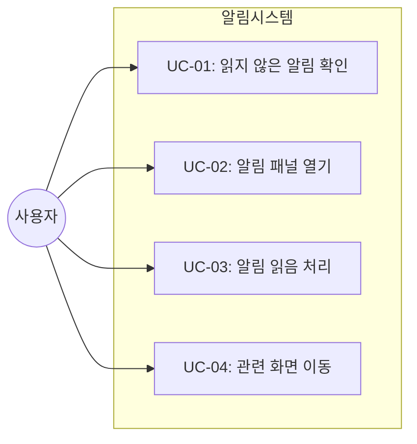
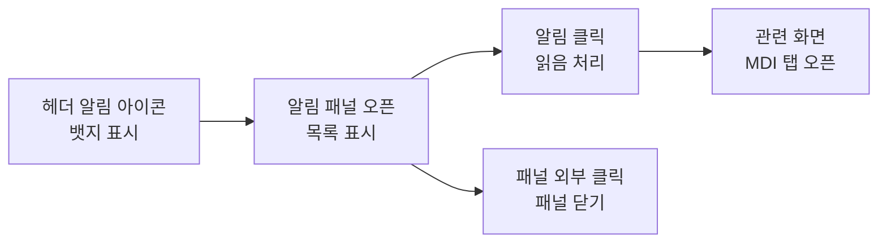

# TSK-01-06 - 알림 패널 설계 문서

## 문서 정보

| 항목 | 내용 |
|------|------|
| Task ID | TSK-01-06 |
| 문서 버전 | 1.0 |
| 작성일 | 2026-01-20 |
| 상태 | 작성중 |
| 카테고리 | development |

---

## 1. 개요

### 1.1 배경 및 문제 정의

**현재 상황:**
- 헤더 컴포넌트(TSK-01-02)에서 알림 아이콘 영역이 정의되어 있음
- 사용자가 시스템 알림을 실시간으로 확인할 방법이 없음
- 중요한 이벤트 발생 시 사용자에게 즉각적인 피드백을 제공할 수 없음

**해결하려는 문제:**
- 사용자가 중요한 시스템 알림을 놓치는 문제
- 알림을 한눈에 파악하고 관리할 수 있는 UI 필요

### 1.2 목적 및 기대 효과

**목적:**
- 알림 아이콘과 패널을 통해 사용자에게 시스템 이벤트를 전달
- 읽지 않은 알림 개수를 뱃지로 표시하여 즉각적인 인지 제공
- 알림 클릭 시 관련 화면으로 빠르게 이동할 수 있는 경로 제공

**기대 효과:**
- 사용자 관점: 중요한 알림을 놓치지 않고 빠르게 확인 및 대응 가능
- 비즈니스 관점: 시스템 이벤트에 대한 사용자 반응 속도 향상

### 1.3 범위

**포함:**
- 알림 아이콘 컴포넌트 (뱃지 포함)
- 알림 패널 컴포넌트 (드롭다운 또는 Drawer)
- 알림 목록 표시
- 알림 읽음 처리 기능
- mock JSON 데이터 기반 구현 (MVP)

**제외:**
- 실시간 알림 푸시 (WebSocket 등) - Phase 2
- 알림 설정/관리 기능 - Phase 2
- 알림 DB 저장 및 API - Phase 2

### 1.4 참조 문서

| 문서 | 경로 | 관련 섹션 |
|------|------|----------|
| PRD | `.orchay/projects/mes-portal/prd.md` | 4.1.1 알림 아이콘 |
| TRD | `.orchay/projects/mes-portal/trd.md` | - |

---

## 2. 사용자 분석

### 2.1 대상 사용자

| 사용자 유형 | 특성 | 주요 니즈 |
|------------|------|----------|
| 공장장/관리자 | 전체 현황 관리, 의사결정자 | 긴급 알림 및 중요 이벤트 빠른 확인 |
| 생산 담당자 | 라인별 생산 관리 | 작업 지시 변경, 이상 알림 확인 |
| 품질 담당자 | 품질 검사 및 관리 | 불량 발생 알림, 검사 요청 알림 |
| 설비 담당자 | 설비 상태 모니터링 | 설비 이상 알림, 유지보수 알림 |

### 2.2 사용자 페르소나

**페르소나 1: 김공장 (공장장)**
- 역할: 전체 생산 현황 관리 및 의사결정
- 목표: 중요한 이벤트를 놓치지 않고 즉시 대응
- 불만: 여러 화면을 전환하면서 알림을 확인해야 함
- 시나리오: 아침 출근 후 밤 사이 발생한 알림을 한 번에 확인하고 처리

---

## 3. 유즈케이스

### 3.1 유즈케이스 다이어그램



### 3.2 유즈케이스 상세

#### UC-01: 읽지 않은 알림 확인

| 항목 | 내용 |
|------|------|
| 액터 | 로그인한 사용자 |
| 목적 | 읽지 않은 알림 개수를 빠르게 파악 |
| 사전 조건 | 사용자가 로그인한 상태 |
| 사후 조건 | 알림 뱃지에 읽지 않은 알림 개수 표시 |
| 트리거 | 페이지 로드 시 자동 |

**기본 흐름:**
1. 사용자가 포털에 로그인한다
2. 시스템이 헤더의 알림 아이콘에 뱃지를 표시한다
3. 뱃지에 읽지 않은 알림 개수가 표시된다

**대안 흐름:**
- 2a. 읽지 않은 알림이 0개인 경우:
  - 뱃지를 표시하지 않거나 0으로 표시

#### UC-02: 알림 패널 열기

| 항목 | 내용 |
|------|------|
| 액터 | 로그인한 사용자 |
| 목적 | 알림 목록을 확인 |
| 사전 조건 | 사용자가 로그인한 상태 |
| 사후 조건 | 알림 패널이 열리고 알림 목록이 표시됨 |
| 트리거 | 알림 아이콘 클릭 |

**기본 흐름:**
1. 사용자가 헤더의 알림 아이콘을 클릭한다
2. 시스템이 알림 패널(드롭다운/Drawer)을 연다
3. 알림 목록이 최신순으로 표시된다

#### UC-03: 알림 읽음 처리

| 항목 | 내용 |
|------|------|
| 액터 | 로그인한 사용자 |
| 목적 | 확인한 알림을 읽음으로 표시 |
| 사전 조건 | 알림 패널이 열린 상태 |
| 사후 조건 | 해당 알림이 읽음 상태로 변경, 뱃지 개수 감소 |
| 트리거 | 알림 항목 클릭 |

**기본 흐름:**
1. 사용자가 알림 패널에서 알림 항목을 클릭한다
2. 시스템이 해당 알림을 읽음 상태로 변경한다
3. 뱃지의 읽지 않은 알림 개수가 감소한다

#### UC-04: 관련 화면 이동

| 항목 | 내용 |
|------|------|
| 액터 | 로그인한 사용자 |
| 목적 | 알림과 관련된 상세 화면으로 이동 |
| 사전 조건 | 알림 패널이 열린 상태 |
| 사후 조건 | 관련 화면이 MDI 탭으로 열림 |
| 트리거 | 알림 항목 클릭 |

**기본 흐름:**
1. 사용자가 알림 항목을 클릭한다
2. 시스템이 알림을 읽음 처리한다
3. 시스템이 알림과 관련된 화면을 MDI 탭으로 연다
4. 알림 패널이 닫힌다

**대안 흐름:**
- 3a. 관련 화면 경로가 없는 경우:
  - 알림 읽음 처리만 수행하고 화면 이동 없음

---

## 4. 사용자 시나리오

### 4.1 시나리오 1: 아침 출근 후 알림 확인

**상황 설명:**
김공장(공장장)이 아침 출근 후 포털에 로그인하여 밤 사이 발생한 알림을 확인하는 상황

**단계별 진행:**

| 단계 | 사용자 행동 | 시스템 반응 | 사용자 기대 |
|------|-----------|------------|------------|
| 1 | 포털 로그인 | 헤더에 알림 아이콘과 뱃지(5) 표시 | 밤 사이 5건의 알림 발생 확인 |
| 2 | 알림 아이콘 클릭 | 알림 패널 오픈, 5개 알림 목록 표시 | 알림 내용 확인 가능 |
| 3 | "설비 이상 알림" 클릭 | 알림 읽음 처리, 설비 현황 화면 오픈 | 설비 상태 상세 확인 |
| 4 | 다시 알림 아이콘 확인 | 뱃지가 4로 감소 | 1건 읽음 처리 확인 |

**성공 조건:**
- 모든 알림을 확인하고 필요한 화면으로 이동할 수 있음
- 읽은 알림과 읽지 않은 알림이 시각적으로 구분됨

### 4.2 시나리오 2: 알림이 없는 경우

**상황 설명:**
사용자가 로그인했을 때 읽지 않은 알림이 없는 상황

**단계별 진행:**

| 단계 | 사용자 행동 | 시스템 반응 | 사용자 기대 |
|------|-----------|------------|------------|
| 1 | 포털 로그인 | 알림 아이콘에 뱃지 없음 또는 0 표시 | 새 알림 없음 확인 |
| 2 | 알림 아이콘 클릭 | 알림 패널 오픈, "알림이 없습니다" 표시 | 빈 상태 안내 |

---

## 5. 화면 설계

### 5.1 화면 흐름도



### 5.2 화면별 상세

#### 화면 1: 알림 아이콘 (헤더 내)

**화면 목적:**
읽지 않은 알림 개수를 빠르게 확인하고 알림 패널에 접근하는 진입점

**진입 경로:**
- 헤더 우측 영역에 항상 표시

**와이어프레임:**
```
┌───────────────────────────────────────────────────────────────────┐
│  헤더                                                              │
│  ... [시계] [검색] [🔔] [테마] [사용자]                            │
│                      ↑                                             │
│                     (5) ← 읽지 않은 알림 뱃지                       │
└───────────────────────────────────────────────────────────────────┘
```

**화면 요소 설명:**

| 영역 | 설명 | 사용자 인터랙션 |
|------|------|----------------|
| 알림 아이콘 | 종 모양 아이콘 (BellOutlined) | 클릭 시 알림 패널 오픈 |
| 뱃지 | 읽지 않은 알림 개수 | 자동 업데이트 |

#### 화면 2: 알림 패널 (드롭다운)

**화면 목적:**
알림 목록을 표시하고 개별 알림을 확인/처리하는 패널

**진입 경로:**
- 알림 아이콘 클릭

**와이어프레임:**
```
                                    ┌─────────────────────────────────┐
                                    │  알림                      ✕    │
                                    ├─────────────────────────────────┤
                                    │ ● 설비 이상 발생               │
                                    │   A라인 1호기 온도 이상        │
                                    │   5분 전                        │
                                    ├─────────────────────────────────┤
                                    │ ● 작업 지시 변경               │
                                    │   WO-2026-001 수량 변경됨      │
                                    │   10분 전                       │
                                    ├─────────────────────────────────┤
                                    │ ○ 품질 검사 완료               │
                                    │   LOT-2026-001 검사 합격       │
                                    │   1시간 전                      │
                                    ├─────────────────────────────────┤
                                    │        알림이 더 없습니다       │
                                    │                                 │
                                    │      [모두 읽음 처리]          │
                                    └─────────────────────────────────┘
```

**화면 요소 설명:**

| 영역 | 설명 | 사용자 인터랙션 |
|------|------|----------------|
| 패널 헤더 | "알림" 타이틀 + 닫기 버튼 | 닫기 클릭 시 패널 닫힘 |
| 알림 아이템 | 아이콘/점 + 제목 + 설명 + 시간 | 클릭 시 읽음 처리 + 화면 이동 |
| 읽지 않음 표시 | 채워진 점 (●) | 시각적 구분 |
| 읽음 표시 | 빈 점 (○) | 시각적 구분 |
| 모두 읽음 버튼 | 전체 읽음 처리 버튼 | 클릭 시 모든 알림 읽음 처리 |

**사용자 행동 시나리오:**
1. 사용자가 알림 아이콘을 클릭하면 드롭다운 패널이 열린다
2. 읽지 않은 알림은 채워진 점(●)으로, 읽은 알림은 빈 점(○)으로 표시된다
3. 알림 항목을 클릭하면 읽음 처리되고 관련 화면으로 이동한다
4. 패널 외부 클릭 또는 ✕ 버튼 클릭 시 패널이 닫힌다

### 5.3 반응형 동작

| 화면 크기 | 레이아웃 변화 | 사용자 경험 |
|----------|--------------|------------|
| 데스크톱 (1024px+) | 드롭다운 형태, 너비 320px | 헤더 아래로 자연스럽게 표시 |
| 태블릿 (768-1023px) | 드롭다운 형태, 너비 300px | 동일한 UX |
| 모바일 (767px-) | Drawer 형태 (우측에서 슬라이드) | 전체 너비 또는 고정 너비 |

---

## 6. 인터랙션 설계

### 6.1 사용자 액션과 피드백

| 사용자 액션 | 즉각 피드백 | 결과 피드백 | 에러 피드백 |
|------------|-----------|------------|------------|
| 알림 아이콘 호버 | 커서 변경 (pointer) | - | - |
| 알림 아이콘 클릭 | 패널 애니메이션 오픈 | 알림 목록 로드 | 로드 실패 시 메시지 |
| 알림 항목 호버 | 배경색 하이라이트 | - | - |
| 알림 항목 클릭 | 클릭 효과 | 읽음 처리 + 화면 이동 | - |
| 모두 읽음 클릭 | 버튼 로딩 상태 | 모든 알림 읽음 표시 | 실패 시 토스트 |

### 6.2 상태별 화면 변화

| 상태 | 화면 표시 | 사용자 안내 |
|------|----------|------------|
| 초기 로딩 | 스피너 표시 | "알림을 불러오는 중..." |
| 데이터 없음 | 빈 상태 아이콘 + 메시지 | "새로운 알림이 없습니다" |
| 정상 표시 | 알림 목록 | - |
| 에러 발생 | 에러 메시지 | "알림을 불러올 수 없습니다" |

### 6.3 키보드/접근성

| 기능 | 키보드 단축키 | 스크린 리더 안내 |
|------|-------------|-----------------|
| 패널 열기 | (단축키 미지정) | "알림 5건, 버튼" |
| 패널 닫기 | Esc | "알림 패널 닫기" |
| 알림 항목 탐색 | Tab | "알림: 설비 이상 발생, 5분 전, 읽지 않음" |
| 알림 선택 | Enter | "알림 읽음 처리됨, 설비 현황 화면으로 이동" |

---

## 7. 데이터 요구사항

### 7.1 필요한 데이터

| 데이터 | 설명 | 출처 | 용도 |
|--------|------|------|------|
| notifications | 알림 목록 | mock JSON (MVP) / API (Phase 2) | 알림 패널 목록 표시 |
| unreadCount | 읽지 않은 알림 개수 | notifications에서 계산 | 뱃지 숫자 표시 |

### 7.2 알림 데이터 구조

```typescript
interface Notification {
  id: string;           // 알림 고유 ID
  type: NotificationType; // 알림 유형 (info, warning, error, success)
  title: string;        // 알림 제목
  message: string;      // 알림 상세 내용
  isRead: boolean;      // 읽음 여부
  createdAt: string;    // 생성 시간 (ISO 8601)
  link?: string;        // 관련 화면 경로 (MDI 탭 오픈용)
  linkTitle?: string;   // 관련 화면 제목
}

type NotificationType = 'info' | 'warning' | 'error' | 'success';
```

### 7.3 Mock 데이터 예시

```json
{
  "notifications": [
    {
      "id": "noti-001",
      "type": "error",
      "title": "설비 이상 발생",
      "message": "A라인 1호기 온도 이상 감지됨",
      "isRead": false,
      "createdAt": "2026-01-20T09:25:00Z",
      "link": "/equipment/status",
      "linkTitle": "설비 현황"
    },
    {
      "id": "noti-002",
      "type": "warning",
      "title": "작업 지시 변경",
      "message": "WO-2026-001 수량이 100 → 150으로 변경됨",
      "isRead": false,
      "createdAt": "2026-01-20T09:20:00Z",
      "link": "/production/work-order",
      "linkTitle": "작업 지시"
    },
    {
      "id": "noti-003",
      "type": "success",
      "title": "품질 검사 완료",
      "message": "LOT-2026-001 검사 합격",
      "isRead": true,
      "createdAt": "2026-01-20T08:30:00Z",
      "link": "/quality/inspection",
      "linkTitle": "품질 검사"
    }
  ]
}
```

### 7.4 데이터 유효성 규칙

| 데이터 필드 | 규칙 | 위반 시 처리 |
|------------|------|--------------|
| id | 필수, 고유 | 중복 ID 무시 |
| type | 필수, enum 값 | 기본값 'info' 사용 |
| title | 필수, 1-100자 | 표시 불가 |
| message | 선택, 최대 500자 | 초과 시 말줄임 |
| createdAt | 필수, ISO 8601 | 파싱 실패 시 현재 시간 |

---

## 8. 비즈니스 규칙

### 8.1 핵심 규칙

| 규칙 ID | 규칙 설명 | 적용 상황 | 예외 |
|---------|----------|----------|------|
| BR-01 | 알림 목록은 최신순으로 정렬 | 알림 패널 로드 시 | 없음 |
| BR-02 | 읽지 않은 알림은 시각적으로 강조 | 알림 목록 표시 시 | 없음 |
| BR-03 | 알림 클릭 시 자동으로 읽음 처리 | 알림 항목 클릭 시 | 없음 |
| BR-04 | 뱃지는 읽지 않은 알림 개수 표시 | 항상 | 0개면 뱃지 숨김 |
| BR-05 | 뱃지 최대 표시 개수는 99+ | 100개 이상일 때 | 없음 |

### 8.2 규칙 상세 설명

**BR-01: 알림 정렬**
- 가장 최근 알림이 목록 상단에 표시
- createdAt 기준 내림차순 정렬

**BR-04: 뱃지 표시 규칙**
- 0개: 뱃지 숨김 또는 표시 안 함
- 1-99개: 실제 숫자 표시
- 100개 이상: "99+" 표시

---

## 9. 에러 처리

### 9.1 예상 에러 상황

| 상황 | 원인 | 사용자 메시지 | 복구 방법 |
|------|------|--------------|----------|
| 알림 로드 실패 | 네트워크/서버 오류 | "알림을 불러올 수 없습니다" | 재시도 버튼 |
| 읽음 처리 실패 | 네트워크/서버 오류 | "알림 상태 변경에 실패했습니다" | 자동 재시도 또는 무시 |
| Mock 데이터 파싱 오류 | JSON 형식 오류 | "알림 데이터를 처리할 수 없습니다" | 개발 환경 로그 |

### 9.2 에러 표시 방식

| 에러 유형 | 표시 위치 | 표시 방법 |
|----------|----------|----------|
| 로드 실패 | 알림 패널 내부 | 에러 메시지 + 재시도 버튼 |
| 읽음 처리 실패 | 토스트 알림 | 경고 토스트 (자동 닫힘) |

---

## 10. 연관 문서

> 상세 테스트 명세 및 요구사항 추적은 별도 문서에서 관리합니다.

| 문서 | 경로 | 용도 |
|------|------|------|
| 요구사항 추적 매트릭스 | `025-traceability-matrix.md` | PRD → 설계 → 테스트 양방향 추적 |
| 테스트 명세서 | `026-test-specification.md` | 단위/E2E/매뉴얼 테스트 상세 정의 |

---

## 11. 구현 범위

### 11.1 영향받는 영역

| 영역 | 변경 내용 | 영향도 |
|------|----------|--------|
| components/common/NotificationPanel.tsx | 신규 생성 | 높음 |
| components/layout/Header.tsx | 알림 아이콘/패널 통합 | 중간 |
| mock-data/notifications.json | 신규 생성 | 낮음 |

### 11.2 의존성

| 의존 항목 | 이유 | 상태 |
|----------|------|------|
| TSK-01-02 (헤더 컴포넌트) | 알림 아이콘이 헤더에 위치 | 진행중 |

### 11.3 제약 사항

| 제약 | 설명 | 대응 방안 |
|------|------|----------|
| MVP 단계 | 실시간 알림 푸시 미지원 | mock JSON 데이터 사용 |
| 데이터 영속성 | 새로고침 시 읽음 상태 초기화 | localStorage 사용 또는 Phase 2 API 연동 |

### 11.4 사용 컴포넌트

| 컴포넌트 | 용도 |
|----------|------|
| Ant Design Badge | 뱃지 표시 |
| Ant Design Dropdown 또는 Drawer | 알림 패널 |
| Ant Design List | 알림 목록 |
| Ant Design Empty | 빈 상태 표시 |
| @ant-design/icons BellOutlined | 알림 아이콘 |

---

## 12. 체크리스트

### 12.1 설계 완료 확인

- [x] 문제 정의 및 목적 명확화
- [x] 사용자 분석 완료
- [x] 유즈케이스 정의 완료
- [x] 사용자 시나리오 작성 완료
- [x] 화면 설계 완료 (와이어프레임)
- [x] 인터랙션 설계 완료
- [x] 데이터 요구사항 정의 완료
- [x] 비즈니스 규칙 정의 완료
- [x] 에러 처리 정의 완료

### 12.2 연관 문서 작성

- [ ] 요구사항 추적 매트릭스 작성 (→ `025-traceability-matrix.md`)
- [ ] 테스트 명세서 작성 (→ `026-test-specification.md`)

### 12.3 구현 준비

- [x] 구현 우선순위 결정
- [x] 의존성 확인 완료
- [x] 제약 사항 검토 완료

---

## 변경 이력

| 버전 | 일자 | 작성자 | 변경 내용 |
|------|------|--------|----------|
| 1.0 | 2026-01-20 | Claude | 최초 작성 |
