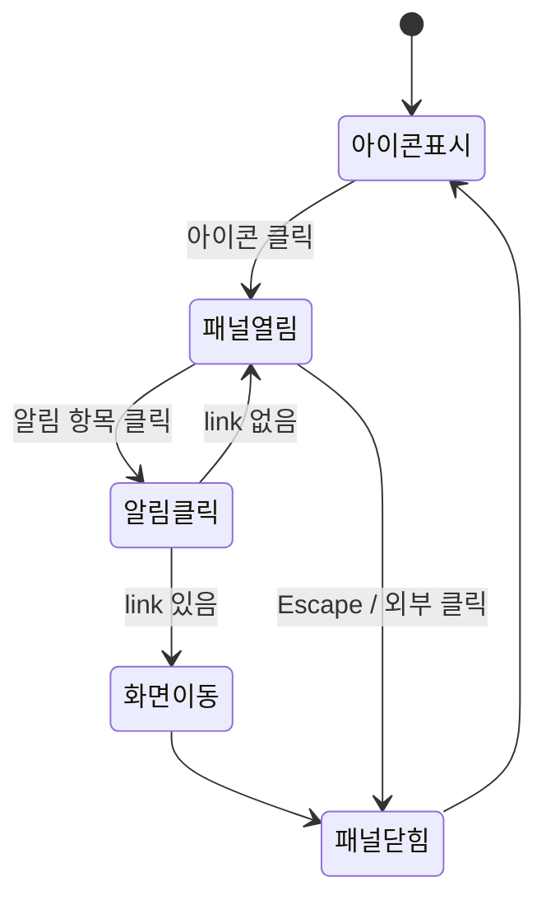

# TSK-01-06 - 알림 패널 UI 설계

**Version:** 1.0 — **Last Updated:** 2026-01-20

---

## 1. 화면 목록

| 화면 ID | 화면명 | 목적 |
|---------|--------|------|
| SCR-01 | 알림 아이콘 + 뱃지 | 읽지 않은 알림 개수 표시 |
| SCR-02 | 알림 패널 | 알림 목록 표시 및 관리 |
| SCR-03 | 알림 없음 상태 | 빈 상태 안내 |

---

## 2. 화면 전환 흐름



---

## 3. 화면별 상세

### 3.1 SCR-01: 알림 아이콘 + 뱃지

```
┌──────────────────────────────────────────────────────┐
│  헤더 우측                                            │
│  ... [시계] [검색] [🔔 (5)] [테마] [사용자]           │
│                       ↑                              │
│                  알림 아이콘 + 뱃지                   │
└──────────────────────────────────────────────────────┘
```

**뱃지 표시 규칙:**
- 0개: 뱃지 숨김
- 1-99개: 숫자 표시
- 100+: "99+" 표시

### 3.2 SCR-02: 알림 패널

```
                              ┌─────────────────────────────────┐
                              │  알림                      ✕    │
                              ├─────────────────────────────────┤
                              │ ● 설비 이상 발생               │
                              │   A라인 1호기 온도 이상        │
                              │   5분 전                  error │
                              ├─────────────────────────────────┤
                              │ ● 작업 지시 변경               │
                              │   WO-2026-001 수량 변경됨      │
                              │   10분 전               warning │
                              ├─────────────────────────────────┤
                              │ ○ 품질 검사 완료               │
                              │   LOT-2026-001 검사 합격       │
                              │   1시간 전              success │
                              ├─────────────────────────────────┤
                              │        [모두 읽음 처리]        │
                              └─────────────────────────────────┘
```

**컴포넌트:**
- Ant Design Dropdown 또는 Drawer
- Ant Design List
- Ant Design Badge

**상태 표시:**
- ● (채워진 원): 읽지 않음 - 배경색 강조
- ○ (빈 원): 읽음 - 일반 배경

**알림 유형 아이콘:**
| type | 색상 | 아이콘 |
|------|------|--------|
| error | red | ExclamationCircle |
| warning | orange | WarningOutlined |
| success | green | CheckCircle |
| info | blue | InfoCircle |

### 3.3 SCR-03: 알림 없음

```
┌─────────────────────────────────┐
│  알림                      ✕    │
├─────────────────────────────────┤
│                                  │
│            🔔                    │
│                                  │
│     새로운 알림이 없습니다.      │
│                                  │
└─────────────────────────────────┘
```

---

## 4. 반응형 설계

| Breakpoint | 레이아웃 |
|------------|---------|
| Desktop (1024px+) | 드롭다운 (너비 320px) |
| Tablet (768-1023px) | 드롭다운 (너비 300px) |
| Mobile (767px-) | Drawer (우측 슬라이드) |

---

## 5. 접근성

| 요소 | ARIA 속성 |
|------|----------|
| 알림 아이콘 | `aria-label="알림 {n}건"` |
| 패널 | `role="dialog"`, `aria-label="알림 목록"` |
| 알림 항목 | `role="listitem"` |
| 모두 읽음 버튼 | `aria-label="모든 알림 읽음 처리"` |

---

## 6. 애니메이션

| 요소 | 애니메이션 |
|------|----------|
| 패널 열기 | fade-in 200ms |
| 패널 닫기 | fade-out 150ms |
| 알림 읽음 | 배경색 전환 150ms |
