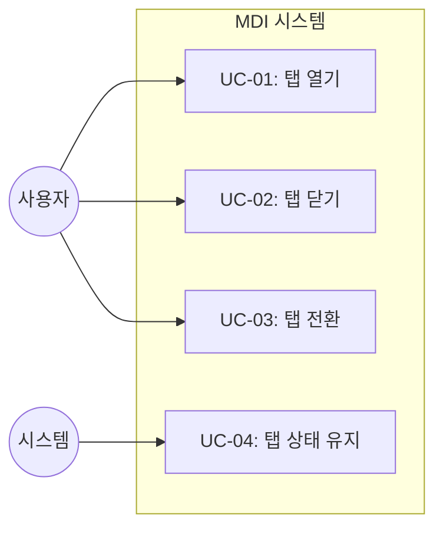
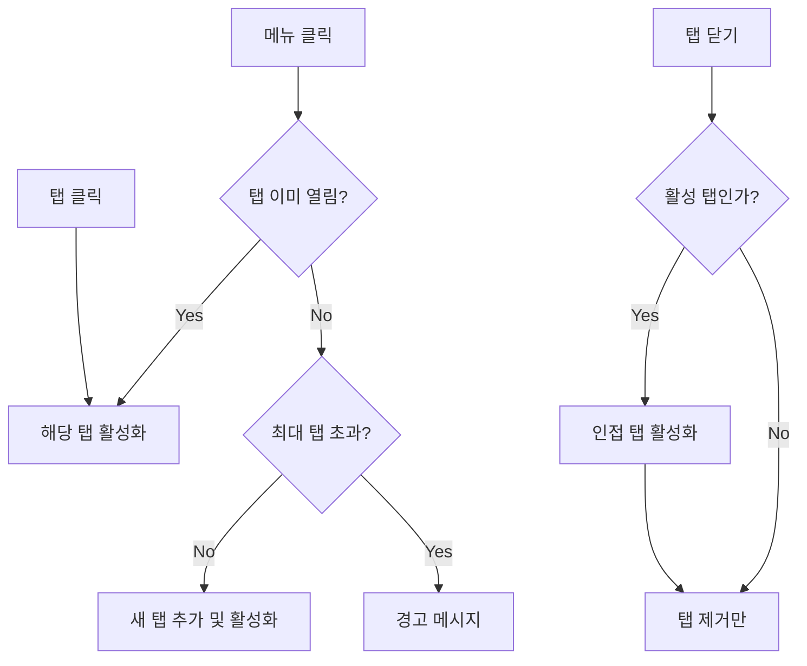

# TSK-02-01 - MDI 상태 관리 설계 문서

## 문서 정보

| 항목 | 내용 |
|------|------|
| Task ID | TSK-02-01 |
| 문서 버전 | 1.0 |
| 작성일 | 2026-01-20 |
| 상태 | 작성중 |
| 카테고리 | development |

---

## 1. 개요

### 1.1 배경 및 문제 정의

**현재 상황:**
- MES Portal은 다양한 화면(대시보드, 생산관리, 품질관리 등)을 동시에 열고 전환하며 작업해야 하는 제조 현장의 요구사항이 있음
- 일반적인 SPA 라우팅은 한 번에 하나의 화면만 표시하여 사용자가 여러 화면 간 데이터를 비교하거나 참조하며 작업하기 어려움
- 화면 전환 시 이전 화면의 입력 데이터나 스크롤 위치 등의 상태가 유실됨

**해결하려는 문제:**
- 사용자가 여러 화면을 탭으로 열고 전환하며 작업할 수 있는 MDI(Multiple Document Interface) 기능 필요
- 탭 전환 시 각 화면의 상태(폼 입력값, 스크롤 위치 등)가 유지되어야 함
- 탭의 열기/닫기/전환을 위한 중앙 집중식 상태 관리 필요

### 1.2 목적 및 기대 효과

**목적:**
- MDI 시스템의 핵심인 탭 상태를 관리하는 Context/Store 구현
- 탭 열기/닫기/전환을 위한 표준화된 API 제공
- 비활성 탭의 화면 상태를 유지하는 메커니즘 구현

**기대 효과:**
- 사용자 관점: 여러 화면을 동시에 열어 데이터 비교 및 참조 작업 가능
- 사용자 관점: 탭 전환 시 이전 작업 상태가 보존되어 연속적인 작업 가능
- 개발자 관점: 표준화된 MDI API로 일관된 탭 관리 로직 구현 가능

### 1.3 범위

**포함:**
- MDI Context/Store 생성 (React Context API 사용)
- 탭 목록 상태 관리 (열린 탭 배열)
- 활성 탭 상태 관리 (현재 선택된 탭)
- 탭 열기/닫기/전환 함수
- 탭 상태 유지 기능 (비활성 탭 unmount 방지)
- useMDI 커스텀 훅

**제외:**
- TabBar UI 컴포넌트 (TSK-02-02에서 구현)
- 탭 드래그 앤 드롭 (TSK-02-03에서 구현)
- 탭 컨텍스트 메뉴 (TSK-02-04에서 구현)
- MDI 컨텐츠 영역 컴포넌트 (TSK-02-05에서 구현)

### 1.4 참조 문서

| 문서 | 경로 | 관련 섹션 |
|------|------|----------|
| PRD | `.orchay/projects/mes-portal/prd.md` | 4.1.1 MDI |
| TRD | `.orchay/projects/mes-portal/trd.md` | - |

---

## 2. 사용자 분석

### 2.1 대상 사용자

| 사용자 유형 | 특성 | 주요 니즈 |
|------------|------|----------|
| 공장장/관리자 | 전체 현황 파악 필요 | 대시보드와 상세 화면 동시 조회 |
| 생산 담당자 | 라인별 작업 관리 | 작업 지시와 실적 입력 화면 동시 열기 |
| 품질 담당자 | 검사 결과 비교 분석 | 여러 검사 결과 화면 비교 |

### 2.2 사용자 페르소나

**페르소나 1: 김생산 (생산 담당자)**
- 역할: 생산 라인 A 담당자
- 목표: 작업 지시 확인하면서 생산 실적 입력
- 불만: 기존 시스템에서 화면 전환 시 입력 중인 데이터가 사라짐
- 시나리오: 작업 지시 화면에서 지시 내용 확인 → 실적 입력 화면에서 입력 → 다시 작업 지시 확인 (반복)

---

## 3. 유즈케이스

### 3.1 유즈케이스 다이어그램



### 3.2 유즈케이스 상세

#### UC-01: 탭 열기

| 항목 | 내용 |
|------|------|
| 액터 | 사용자 (메뉴 클릭 또는 링크) |
| 목적 | 새로운 화면을 탭으로 열기 |
| 사전 조건 | 사용자가 로그인되어 있음 |
| 사후 조건 | 새 탭이 탭 목록에 추가되고 활성화됨 |
| 트리거 | 메뉴 클릭, 링크 클릭, 검색 결과 선택 |

**기본 흐름:**
1. 사용자가 메뉴 또는 링크를 클릭한다
2. 시스템이 해당 화면의 탭 ID를 생성한다
3. 시스템이 탭 목록에 새 탭을 추가한다
4. 시스템이 새 탭을 활성 탭으로 설정한다
5. 화면이 새 탭의 콘텐츠로 전환된다

**대안 흐름:**
- 2a. 이미 열린 탭인 경우:
  - 시스템이 새 탭을 추가하지 않고 기존 탭을 활성화한다
  - 기존 탭의 콘텐츠가 표시된다

**예외 흐름:**
- 2b. 최대 탭 개수 초과 시:
  - 시스템이 "탭을 더 이상 열 수 없습니다" 메시지 표시
  - 사용자가 기존 탭을 닫고 다시 시도할 수 있다

#### UC-02: 탭 닫기

| 항목 | 내용 |
|------|------|
| 액터 | 사용자 |
| 목적 | 열린 탭을 닫기 |
| 사전 조건 | 하나 이상의 탭이 열려 있음 |
| 사후 조건 | 탭이 목록에서 제거됨 |
| 트리거 | 탭의 닫기(✕) 버튼 클릭, Ctrl+W 단축키 |

**기본 흐름:**
1. 사용자가 탭의 닫기 버튼을 클릭한다
2. 시스템이 해당 탭을 탭 목록에서 제거한다
3. 닫힌 탭이 활성 탭이었다면 인접 탭을 활성화한다
4. 화면이 새 활성 탭의 콘텐츠로 전환된다

**대안 흐름:**
- 3a. 마지막 탭을 닫는 경우:
  - 빈 상태 또는 기본 화면(대시보드)을 표시한다

**예외 흐름:**
- 1a. closable이 false인 탭인 경우:
  - 닫기 버튼이 표시되지 않음
  - 닫기 시도 무시

#### UC-03: 탭 전환

| 항목 | 내용 |
|------|------|
| 액터 | 사용자 |
| 목적 | 다른 탭으로 전환 |
| 사전 조건 | 두 개 이상의 탭이 열려 있음 |
| 사후 조건 | 선택한 탭이 활성 탭이 됨 |
| 트리거 | 탭 클릭, Ctrl+Tab 단축키 |

**기본 흐름:**
1. 사용자가 탭을 클릭한다
2. 시스템이 클릭한 탭을 활성 탭으로 설정한다
3. 이전 탭의 화면이 숨겨지고 새 탭의 화면이 표시된다
4. 새 탭의 화면 상태(스크롤, 입력값 등)가 복원된다

---

## 4. 사용자 시나리오

### 4.1 시나리오 1: 여러 화면 동시 작업

**상황 설명:**
생산 담당자 김생산이 작업 지시 내용을 확인하면서 생산 실적을 입력해야 한다. 작업 지시 화면과 실적 입력 화면을 번갈아 보며 작업한다.

**단계별 진행:**

| 단계 | 사용자 행동 | 시스템 반응 | 사용자 기대 |
|------|-----------|------------|------------|
| 1 | 메뉴에서 '작업 지시' 클릭 | 작업 지시 탭 열림 | 작업 지시 화면 표시 |
| 2 | 메뉴에서 '실적 입력' 클릭 | 실적 입력 탭 열림 | 두 번째 탭 추가, 전환 |
| 3 | 실적 입력 폼에 데이터 입력 | 폼 상태 저장 | 입력값 표시 |
| 4 | '작업 지시' 탭 클릭 | 작업 지시 탭 활성화 | 작업 지시 화면으로 전환 |
| 5 | '실적 입력' 탭 클릭 | 실적 입력 탭 활성화 | 이전 입력값 유지됨 |

**성공 조건:**
- 탭 전환 시 이전에 입력한 데이터가 유지됨
- 두 탭 사이를 빠르게 전환할 수 있음

### 4.2 시나리오 2: 탭 정리

**상황 설명:**
여러 화면을 열어 작업하다 더 이상 필요 없는 화면을 닫아 탭을 정리한다.

**단계별 진행:**

| 단계 | 사용자 행동 | 시스템 반응 | 복구 방법 |
|------|-----------|------------|----------|
| 1 | 탭의 ✕ 버튼 클릭 | 탭 닫힘, 인접 탭 활성화 | - |
| 2 | 활성 탭의 ✕ 클릭 | 탭 닫힘, 오른쪽/왼쪽 탭 활성화 | - |
| 3 | 마지막 탭 닫기 | 탭 닫힘, 빈 상태 표시 | 메뉴에서 새 화면 열기 |

---

## 5. 화면 설계

> 이 Task는 상태 관리 로직만 담당하며 UI 컴포넌트는 TSK-02-02, TSK-02-05에서 구현합니다.

### 5.1 화면 흐름도



### 5.2 탭 데이터 구조

```typescript
interface Tab {
  id: string;           // 고유 식별자 (예: "work-order-123")
  title: string;        // 탭에 표시할 제목
  path: string;         // 화면 경로 (예: "/work-order")
  icon?: string;        // 아이콘 식별자 (예: "FileText")
  closable: boolean;    // 닫기 가능 여부 (기본값: true)
  params?: Record<string, unknown>; // 화면에 전달할 파라미터
}

interface MDIState {
  tabs: Tab[];          // 열린 탭 목록
  activeTabId: string | null;  // 현재 활성 탭 ID
}
```

---

## 6. 인터랙션 설계

### 6.1 탭 액션 API

| 함수명 | 파라미터 | 설명 | 반환값 |
|--------|---------|------|--------|
| openTab | tab: Tab | 새 탭 열기 (중복 시 활성화) | void |
| closeTab | tabId: string | 탭 닫기 | void |
| setActiveTab | tabId: string | 활성 탭 변경 | void |
| getTab | tabId: string | 탭 정보 조회 | Tab \| undefined |
| getTabs | - | 전체 탭 목록 조회 | Tab[] |

### 6.2 탭 열기 동작

| 조건 | 동작 |
|------|------|
| 새로운 탭 | 탭 목록 끝에 추가, 활성화 |
| 이미 열린 탭 (동일 ID) | 기존 탭 활성화, 새로 추가 안 함 |
| 최대 개수 초과 | toast 경고, 추가 안 함 |

### 6.3 탭 닫기 동작

| 조건 | 동작 |
|------|------|
| 비활성 탭 닫기 | 탭 목록에서 제거 |
| 활성 탭 닫기 (오른쪽 탭 있음) | 탭 제거, 오른쪽 탭 활성화 |
| 활성 탭 닫기 (왼쪽만 있음) | 탭 제거, 왼쪽 탭 활성화 |
| 마지막 탭 닫기 | 탭 제거, activeTabId = null |

---

## 7. 데이터 요구사항

### 7.1 필요한 데이터

| 데이터 | 설명 | 출처 | 용도 |
|--------|------|------|------|
| Tab 객체 | 탭 정보 | 메뉴/라우터 | 탭 목록 관리 |
| activeTabId | 활성 탭 식별자 | 사용자 액션 | 화면 표시 |
| maxTabs | 최대 탭 개수 | 설정 (기본값: 10) | 탭 개수 제한 |

### 7.2 상태 저장

| 항목 | 저장 위치 | 지속성 |
|------|----------|--------|
| 탭 목록 | React State | 세션 내 |
| 활성 탭 | React State | 세션 내 |
| (선택) 탭 상태 복원 | sessionStorage | 새로고침 유지 |

---

## 8. 비즈니스 규칙

### 8.1 핵심 규칙

| 규칙 ID | 규칙 설명 | 적용 상황 | 예외 |
|---------|----------|----------|------|
| BR-01 | 동일 ID 탭 중복 열기 불가 | openTab 호출 시 | - |
| BR-02 | 최대 탭 개수 제한 | openTab 호출 시 | 관리자 설정 변경 |
| BR-03 | closable=false 탭은 닫기 불가 | closeTab 호출 시 | - |
| BR-04 | 탭 전환 시 상태 유지 | setActiveTab 호출 시 | - |

### 8.2 규칙 상세 설명

**BR-01: 동일 ID 탭 중복 열기 불가**

설명: 같은 화면을 여러 탭으로 열면 사용자 혼란과 상태 동기화 문제 발생. 동일 ID로 openTab 호출 시 새 탭 추가 대신 기존 탭 활성화.

예시:
- 작업 지시 목록(work-order-list) 탭이 열린 상태에서 메뉴에서 다시 클릭 → 기존 탭 활성화
- 작업 지시 상세(work-order-123)와 작업 지시 목록(work-order-list)는 ID가 다르므로 각각 열림

**BR-02: 최대 탭 개수 제한**

설명: 너무 많은 탭은 성능 저하와 사용성 문제 발생. 기본 최대 10개로 제한.

예시:
- 10개 탭이 열린 상태에서 11번째 탭 열기 시도 → "탭을 더 이상 열 수 없습니다" 토스트
- 탭 닫기 후 다시 열기 가능

---

## 9. 에러 처리

### 9.1 예상 에러 상황

| 상황 | 원인 | 사용자 메시지 | 복구 방법 |
|------|------|--------------|----------|
| 최대 탭 초과 | 10개 이상 열기 | "탭을 더 이상 열 수 없습니다. 기존 탭을 닫고 다시 시도하세요." | 기존 탭 닫기 |
| 닫기 불가 탭 | closable=false | (무시, 닫기 버튼 미표시) | - |
| 존재하지 않는 탭 활성화 | 잘못된 ID | 콘솔 경고 | - |

### 9.2 에러 표시 방식

| 에러 유형 | 표시 위치 | 표시 방법 |
|----------|----------|----------|
| 최대 탭 초과 | 화면 상단 | Toast 경고 |
| 개발 오류 | 콘솔 | console.warn |

---

## 10. 연관 문서

> 상세 테스트 명세 및 요구사항 추적은 별도 문서에서 관리합니다.

| 문서 | 경로 | 용도 |
|------|------|------|
| 요구사항 추적 매트릭스 | `025-traceability-matrix.md` | PRD → 설계 → 테스트 양방향 추적 |
| 테스트 명세서 | `026-test-specification.md` | 단위/E2E/매뉴얼 테스트 상세 정의 |

---

## 11. 구현 범위

### 11.1 구현 파일 구조

```
mes-portal/
└── lib/
    └── mdi/
        ├── context.tsx      # MDI Context 및 Provider
        ├── types.ts         # 타입 정의
        └── index.ts         # 내보내기
```

### 11.2 영향받는 영역

| 영역 | 변경 내용 | 영향도 |
|------|----------|--------|
| lib/mdi/ | 새로 생성 | 높음 |
| app/(portal)/layout.tsx | MDIProvider 래핑 | 중간 |

### 11.3 의존성

| 의존 항목 | 이유 | 상태 |
|----------|------|------|
| TSK-00-02 (UI 라이브러리 설정) | React Context 사용 | 완료 |

### 11.4 제약 사항

| 제약 | 설명 | 대응 방안 |
|------|------|----------|
| SSR 제약 | Context는 클라이언트에서만 동작 | 'use client' 지시어 사용 |
| 세션 간 상태 | 새로고침 시 탭 상태 초기화 | sessionStorage 저장 (선택적) |

---

## 12. 체크리스트

### 12.1 설계 완료 확인

- [x] 문제 정의 및 목적 명확화
- [x] 사용자 분석 완료
- [x] 유즈케이스 정의 완료
- [x] 사용자 시나리오 작성 완료
- [x] 데이터 구조 설계 완료
- [x] 인터랙션 설계 완료
- [x] 비즈니스 규칙 정의 완료
- [x] 에러 처리 정의 완료

### 12.2 연관 문서 작성

- [ ] 요구사항 추적 매트릭스 작성 (→ `025-traceability-matrix.md`)
- [ ] 테스트 명세서 작성 (→ `026-test-specification.md`)

### 12.3 구현 준비

- [x] 구현 우선순위 결정
- [x] 의존성 확인 완료
- [x] 제약 사항 검토 완료

---

## 변경 이력

| 버전 | 일자 | 작성자 | 변경 내용 |
|------|------|--------|----------|
| 1.0 | 2026-01-20 | Claude | 최초 작성 |
