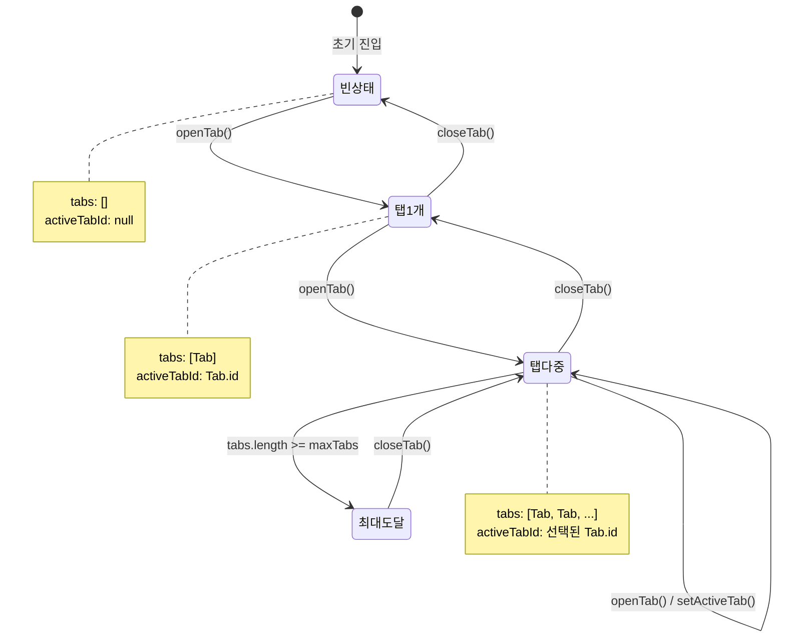

# TSK-02-01 - MDI 상태 관리 화면 설계

## 문서 정보

| 항목 | 내용 |
|------|------|
| Task ID | TSK-02-01 |
| 문서 버전 | 1.0 |
| 작성일 | 2026-01-20 |
| 상태 | 작성중 |

---

## 1. 화면 목록

> **참고**: 이 Task는 MDI 상태 관리 **로직**을 담당하며, 실제 UI 컴포넌트는 TSK-02-02(탭 바), TSK-02-05(컨텐츠 영역)에서 구현합니다.
> 이 문서는 상태 관리가 지원하는 UI 동작의 개념적 흐름을 정의합니다.

| 화면 ID | 화면명 | 설명 | SVG 참조 | 관련 Task |
|---------|--------|------|----------|-----------|
| SCR-01 | MDI 상태 흐름 | 탭 열기/닫기/전환 상태 변화 | `ui-assets/screen-01-mdi-state-flow.svg` | TSK-02-01 |
| SCR-02 | 탭 바 개념도 | 탭 바의 상태별 표현 | `ui-assets/screen-02-tab-bar-states.svg` | TSK-02-02 |

---

## 2. 화면 전환 흐름

### 2.1 상태 다이어그램



### 2.2 액션-화면 매트릭스

| 사용자 액션 | 현재 상태 | 시스템 동작 | 결과 상태 |
|------------|----------|------------|----------|
| 메뉴 클릭 | 빈 상태 | openTab() | 탭 1개 |
| 메뉴 클릭 | 탭 1개 | openTab() | 탭 다중 |
| 메뉴 클릭 (중복) | 탭 다중 | setActiveTab() | 탭 다중 (기존 탭 활성화) |
| 탭 클릭 | 탭 다중 | setActiveTab() | 탭 다중 (활성 탭 변경) |
| 닫기 버튼 | 탭 다중 | closeTab() | 탭 다중 또는 탭 1개 |
| 닫기 버튼 | 탭 1개 | closeTab() | 빈 상태 |
| 메뉴 클릭 | 최대 도달 | 경고 toast | 최대 도달 (변화 없음) |

---

## 3. 화면별 상세

### 3.1 SCR-01: MDI 상태 흐름

**화면 목적:**
MDI Context의 상태 변화와 각 액션 함수의 동작을 시각적으로 표현

**레이아웃:**
```
┌─────────────────────────────────────────────────────────────────┐
│                      MDI 상태 흐름도                              │
├─────────────────────────────────────────────────────────────────┤
│                                                                   │
│   ┌─────────────┐    openTab()    ┌─────────────┐               │
│   │             │  ─────────────► │             │               │
│   │  빈 상태     │                 │   탭 1개    │               │
│   │  tabs: []   │  ◄─────────────  │  tabs: [A]  │               │
│   │             │    closeTab()   │             │               │
│   └─────────────┘                 └─────────────┘               │
│                                          │                       │
│                                          │ openTab()             │
│                                          ▼                       │
│                                   ┌─────────────┐               │
│                                   │             │               │
│                                   │   탭 다중   │ ◄──┐          │
│                                   │ tabs:[A,B,C]│    │          │
│                                   │             │ ───┘          │
│                                   └─────────────┘  setActiveTab │
│                                                                   │
└─────────────────────────────────────────────────────────────────┘
```

**컴포넌트:**
- 이 화면은 개발자 이해를 위한 다이어그램이며 실제 UI 아님

**상태:**
- 각 박스는 MDI 상태를 나타냄
- 화살표는 액션 함수 호출을 나타냄

**액션:**
- 다이어그램 확인 후 구현 시 참조

### 3.2 SCR-02: 탭 바 상태별 표현

**화면 목적:**
탭 바가 각 상태에서 어떻게 표현되는지 시각화

**레이아웃:**
```
[상태 1: 빈 상태]
┌─────────────────────────────────────────────────────────────────┐
│  (탭 없음 - 빈 탭 바)                                            │
└─────────────────────────────────────────────────────────────────┘

[상태 2: 탭 1개]
┌─────────────────────────────────────────────────────────────────┐
│  ┌──────────────────┐                                            │
│  │ 📋 작업 지시  ✕  │ ← 활성                                     │
│  └──────────────────┘                                            │
└─────────────────────────────────────────────────────────────────┘

[상태 3: 탭 다중 - 두 번째 활성]
┌─────────────────────────────────────────────────────────────────┐
│  ┌──────────────────┐ ┌──────────────────┐ ┌──────────────────┐ │
│  │ 📋 작업 지시  ✕  │ │ 📊 실적 입력  ✕  │ │ 🔍 품질 검사  ✕  │ │
│  └──────────────────┘ └──────────────────┘ └──────────────────┘ │
│        (비활성)              (활성)              (비활성)         │
└─────────────────────────────────────────────────────────────────┘

[상태 4: 닫기 불가 탭 포함]
┌─────────────────────────────────────────────────────────────────┐
│  ┌──────────────────┐ ┌──────────────────┐                       │
│  │ 🏠 홈           │ │ 📋 작업 지시  ✕  │                       │
│  └──────────────────┘ └──────────────────┘                       │
│    (닫기버튼 없음)         (활성, 닫기 가능)                        │
└─────────────────────────────────────────────────────────────────┘
```

**컴포넌트:**
| 영역 | 설명 | 역할 |
|------|------|------|
| 탭 아이템 | 아이콘 + 제목 + 닫기 버튼 | 탭 표현 |
| 활성 탭 | 강조 스타일 (배경색, 테두리) | 현재 선택된 탭 표시 |
| 닫기 버튼 | ✕ 아이콘 | closable=true일 때만 표시 |

**상태:**
| 상태 | 탭 바 표현 |
|------|-----------|
| 빈 상태 | 탭 없음 또는 "화면을 열어주세요" 안내 |
| 탭 1개 | 해당 탭만 표시, 활성 상태 |
| 탭 다중 | 모든 탭 표시, 활성 탭 강조 |

**액션:**
| 액션 | 트리거 | 결과 |
|------|--------|------|
| 탭 클릭 | 탭 영역 클릭 | setActiveTab 호출 |
| 닫기 버튼 | ✕ 클릭 | closeTab 호출 |

---

## 4. 공통 컴포넌트

> 이 Task에서는 상태 관리만 담당하므로 공통 UI 컴포넌트 정의 없음.
> 관련 UI 컴포넌트는 다음 Task에서 정의:
> - TSK-02-02: TabBar, TabItem
> - TSK-02-05: MDIContent

---

## 5. 반응형 설계

| Breakpoint | 탭 바 동작 | 비고 |
|------------|-----------|------|
| Desktop (≥1024px) | 탭 전체 표시, 스크롤 또는 드롭다운 | 상태 관리 동일 |
| Tablet (768-1023px) | 탭 전체 표시, 스크롤 | 상태 관리 동일 |
| Mobile (<768px) | 탭 숨김 또는 드롭다운 | 상태 관리 동일 |

> 상태 관리는 화면 크기와 무관하게 동일하게 동작합니다.
> UI 적응은 TSK-02-02에서 처리합니다.

---

## 6. 접근성

| 항목 | 요구사항 | 구현 방법 |
|------|---------|----------|
| 키보드 네비게이션 | 탭 간 이동 | Tab/Arrow 키로 탭 포커스 이동 (TSK-02-02) |
| ARIA | 탭 역할 표시 | role="tablist", role="tab" (TSK-02-02) |
| 색상 대비 | 활성/비활성 구분 | 테마 토큰 사용 (TSK-00-02) |

---

## 7. SVG 파일 목록

| 파일명 | 설명 | 크기 |
|--------|------|------|
| `screen-01-mdi-state-flow.svg` | MDI 상태 흐름 다이어그램 | 800x600 |
| `screen-02-tab-bar-states.svg` | 탭 바 상태별 표현 | 1200x400 |

---

## 변경 이력

| 버전 | 일자 | 작성자 | 변경 내용 |
|------|------|--------|----------|
| 1.0 | 2026-01-20 | Claude | 최초 작성 |
