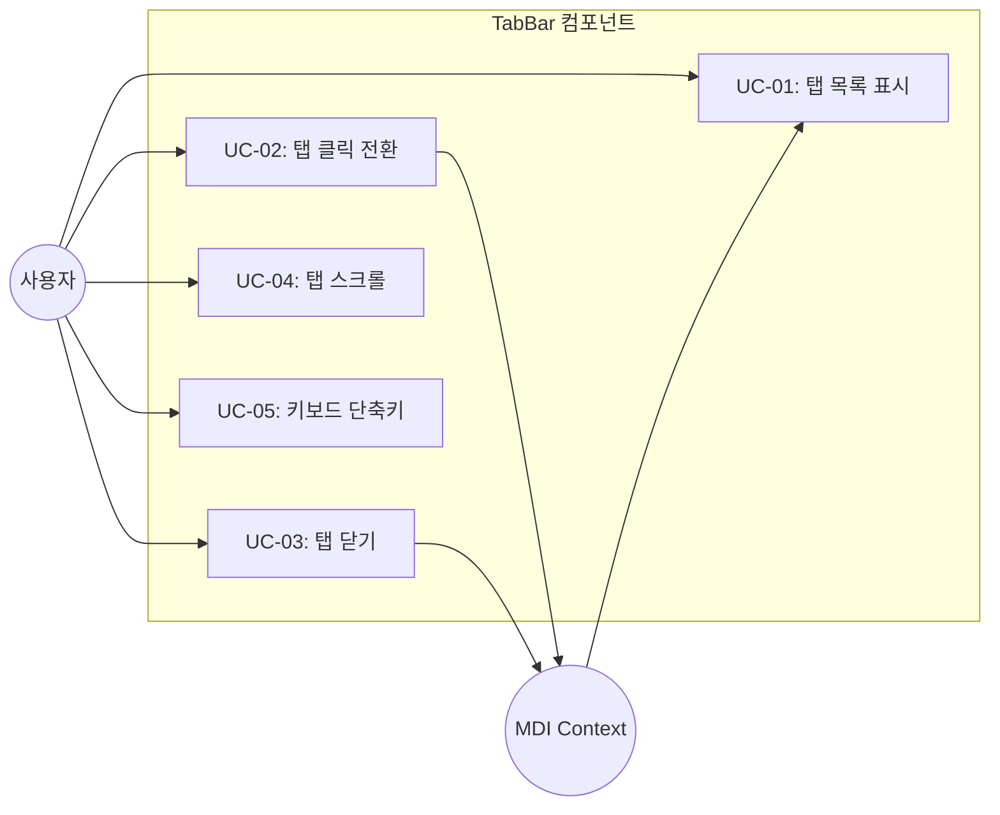
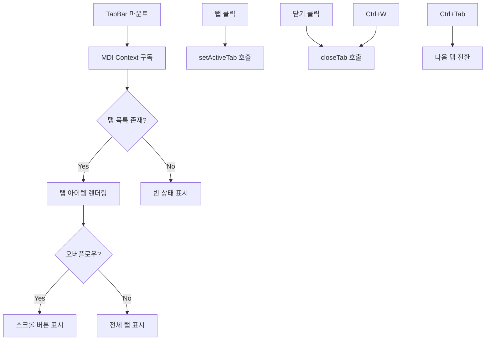
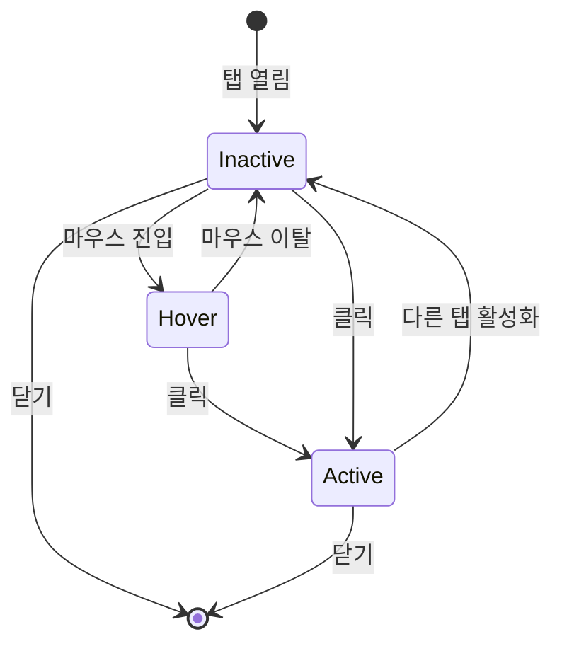

# TSK-02-02 - 탭 바 컴포넌트 설계 문서

## 문서 정보

| 항목 | 내용 |
|------|------|
| Task ID | TSK-02-02 |
| 문서 버전 | 1.0 |
| 작성일 | 2026-01-20 |
| 상태 | 작성중 |
| 카테고리 | development |

---

## 1. 개요

### 1.1 배경 및 문제 정의

**현재 상황:**
- MES Portal은 MDI(Multiple Document Interface) 시스템을 통해 여러 화면을 탭으로 관리해야 함
- TSK-02-01에서 MDI 상태 관리 (Context/Store)가 구현될 예정
- 사용자가 탭을 시각적으로 확인하고 조작할 수 있는 UI 컴포넌트가 필요함

**해결하려는 문제:**
- 열린 탭 목록을 시각적으로 표시하고 활성 탭을 강조해야 함
- 탭 클릭으로 화면 전환, 닫기 버튼으로 탭 닫기 기능 필요
- 탭이 많아질 경우 오버플로우 처리 (스크롤 또는 드롭다운)
- 일관된 UI/UX로 사용자 경험 향상

### 1.2 목적 및 기대 효과

**목적:**
- MDI 탭 영역의 UI 컴포넌트 구현
- 탭 목록 렌더링 및 활성 탭 표시
- 탭 클릭/닫기 이벤트 핸들링
- 탭 오버플로우 시 스크롤 처리

**기대 효과:**
- 사용자 관점: 열린 화면을 한눈에 파악하고 빠르게 전환 가능
- 사용자 관점: 직관적인 탭 닫기 동작으로 화면 정리 용이
- 개발자 관점: MDI Context와 연동된 재사용 가능한 컴포넌트 확보

### 1.3 범위

**포함:**
- TabBar 컴포넌트 생성
- 탭 아이템 렌더링 (아이콘 + 화면명 + 닫기 버튼)
- 활성 탭 시각적 강조
- 탭 클릭 시 활성 탭 전환
- 닫기 버튼 클릭 시 탭 닫기
- 탭 오버플로우 시 좌우 스크롤
- 키보드 네비게이션 (Ctrl+Tab, Ctrl+W)

**제외:**
- MDI 상태 관리 로직 (TSK-02-01 범위)
- 탭 드래그 앤 드롭 순서 변경 (TSK-02-03 범위)
- 탭 우클릭 컨텍스트 메뉴 (TSK-02-04 범위)
- MDI 컨텐츠 영역 (TSK-02-05 범위)

### 1.4 참조 문서

| 문서 | 경로 | 관련 섹션 |
|------|------|----------|
| PRD | `.orchay/projects/mes-portal/PRD.md` | 4.1.1 탭 바 (Tab Bar) |
| TRD | `.orchay/projects/mes-portal/TRD.md` | 1.2 UI/스타일링 스택, 7 PRD-기술 매핑 |
| TSK-02-01 설계 | `tasks/TSK-02-01/010-design.md` | MDI 상태 관리, Tab 데이터 구조 |

---

## 2. 사용자 분석

### 2.1 대상 사용자

| 사용자 유형 | 특성 | 주요 니즈 |
|------------|------|----------|
| 공장장/관리자 | 여러 현황 화면 동시 모니터링 | 탭 간 빠른 전환, 현재 위치 파악 |
| 생산 담당자 | 작업 지시/실적 화면 반복 전환 | 불필요한 탭 정리, 자주 쓰는 탭 유지 |
| 품질/설비 담당자 | 상세 데이터 비교 분석 | 여러 탭 열어두고 비교 작업 |

### 2.2 사용자 페르소나

**페르소나 1: 박관리 (공장 관리자)**
- 역할: 전체 생산 현황 모니터링
- 목표: 대시보드, 라인별 현황, 품질 현황 화면을 동시에 열어두고 상황 파악
- 불만: 탭이 많아지면 어떤 화면이 열려있는지 파악하기 어려움
- 기대: 아이콘과 화면명으로 탭 구분, 불필요한 탭은 빠르게 닫기

**페르소나 2: 김생산 (생산 담당자)**
- 역할: 생산 라인 담당
- 목표: 작업 지시 확인과 실적 입력을 번갈아 수행
- 불만: 키보드로 빠르게 탭 전환이 안 되면 불편
- 기대: Ctrl+Tab으로 탭 전환, Ctrl+W로 탭 닫기

---

## 3. 유즈케이스

### 3.1 유즈케이스 다이어그램



### 3.2 유즈케이스 상세

#### UC-01: 탭 목록 표시

| 항목 | 내용 |
|------|------|
| 액터 | 시스템 (자동) |
| 목적 | MDI Context의 탭 목록을 화면에 표시 |
| 사전 조건 | MDI Context가 초기화되어 있음 |
| 사후 조건 | 탭 목록이 TabBar에 렌더링됨 |
| 트리거 | 컴포넌트 마운트 또는 탭 목록 변경 |

**기본 흐름:**
1. TabBar가 마운트된다
2. MDI Context에서 탭 목록(tabs)과 활성 탭(activeTabId)을 구독한다
3. 탭 목록을 순회하며 각 탭 아이템을 렌더링한다
4. 활성 탭에 강조 스타일을 적용한다

**대안 흐름:**
- 1a. 탭 목록이 비어있는 경우:
  - 빈 상태 또는 기본 안내 메시지 표시

#### UC-02: 탭 클릭 전환

| 항목 | 내용 |
|------|------|
| 액터 | 사용자 |
| 목적 | 다른 탭으로 전환 |
| 사전 조건 | 두 개 이상의 탭이 열려 있음 |
| 사후 조건 | 클릭한 탭이 활성 탭이 됨 |
| 트리거 | 탭 아이템 클릭 |

**기본 흐름:**
1. 사용자가 비활성 탭을 클릭한다
2. TabBar가 MDI Context의 setActiveTab 함수를 호출한다
3. MDI Context가 활성 탭을 업데이트한다
4. TabBar가 새로운 활성 탭에 강조 스타일을 적용한다

**대안 흐름:**
- 1a. 이미 활성화된 탭을 클릭한 경우:
  - 아무 동작 없음 (이미 활성 상태)

#### UC-03: 탭 닫기

| 항목 | 내용 |
|------|------|
| 액터 | 사용자 |
| 목적 | 탭 닫기 |
| 사전 조건 | 하나 이상의 탭이 열려 있음, 탭의 closable이 true |
| 사후 조건 | 탭이 탭 목록에서 제거됨 |
| 트리거 | 탭의 닫기(X) 버튼 클릭 또는 Ctrl+W |

**기본 흐름:**
1. 사용자가 탭의 닫기 버튼을 클릭한다
2. 이벤트 버블링을 방지한다 (탭 클릭 이벤트와 분리)
3. TabBar가 MDI Context의 closeTab 함수를 호출한다
4. MDI Context가 탭을 목록에서 제거하고 필요시 인접 탭을 활성화한다
5. TabBar가 업데이트된 탭 목록을 렌더링한다

**예외 흐름:**
- 1a. closable이 false인 탭인 경우:
  - 닫기 버튼이 표시되지 않음

#### UC-04: 탭 스크롤

| 항목 | 내용 |
|------|------|
| 액터 | 사용자 또는 시스템 |
| 목적 | 보이지 않는 탭에 접근 |
| 사전 조건 | 탭 개수가 표시 영역을 초과함 |
| 사후 조건 | 스크롤하여 원하는 탭이 보임 |
| 트리거 | 마우스 휠, 스크롤 버튼 클릭, 새 탭 열기 |

**기본 흐름:**
1. 탭 개수가 TabBar 너비를 초과한다
2. 좌우 스크롤 버튼이 나타난다
3. 사용자가 스크롤 버튼을 클릭하거나 마우스 휠을 사용한다
4. 탭 목록이 스크롤된다

**대안 흐름:**
- 3a. 새 탭이 열리는 경우:
  - 새 탭이 보이도록 자동 스크롤

#### UC-05: 키보드 단축키

| 항목 | 내용 |
|------|------|
| 액터 | 사용자 |
| 목적 | 키보드로 탭 제어 |
| 사전 조건 | TabBar가 마운트되어 있음 |
| 사후 조건 | 단축키에 해당하는 동작 수행 |
| 트리거 | Ctrl+Tab, Ctrl+Shift+Tab, Ctrl+W |

**기본 흐름:**
1. 사용자가 Ctrl+Tab을 누른다
2. 다음 탭으로 전환된다
3. 마지막 탭에서는 첫 번째 탭으로 순환한다

**단축키 목록:**
| 단축키 | 동작 |
|--------|------|
| Ctrl+Tab | 다음 탭으로 전환 |
| Ctrl+Shift+Tab | 이전 탭으로 전환 |
| Ctrl+W | 현재 활성 탭 닫기 |

---

## 4. 사용자 시나리오

### 4.1 시나리오 1: 탭 전환 작업

**상황 설명:**
생산 담당자가 작업 지시 화면과 실적 입력 화면을 번갈아 보며 작업한다.

**단계별 진행:**

| 단계 | 사용자 행동 | 시스템 반응 | 사용자 기대 |
|------|-----------|------------|------------|
| 1 | TabBar에서 "작업 지시" 탭 확인 | 탭 목록에 표시됨 | 현재 위치 파악 |
| 2 | "실적 입력" 탭 클릭 | 탭 강조 이동, 화면 전환 | 실적 입력 화면 표시 |
| 3 | Ctrl+Tab 누름 | 다음 탭(작업 지시)으로 전환 | 빠른 탭 전환 |
| 4 | Ctrl+Tab 반복 | 탭 순환 | 연속 전환 가능 |

**성공 조건:**
- 탭 클릭과 키보드 단축키로 빠르게 전환 가능
- 활성 탭이 명확하게 구분됨

### 4.2 시나리오 2: 탭 정리

**상황 설명:**
많은 화면을 열어 작업하다 불필요한 탭을 닫아 정리한다.

**단계별 진행:**

| 단계 | 사용자 행동 | 시스템 반응 | 복구 방법 |
|------|-----------|------------|----------|
| 1 | 불필요한 탭의 X 버튼 클릭 | 탭 닫힘 | 메뉴에서 다시 열기 |
| 2 | Ctrl+W 누름 | 현재 활성 탭 닫힘 | 메뉴에서 다시 열기 |
| 3 | 마지막 탭 닫기 | 빈 상태 표시 | 메뉴에서 새 화면 열기 |

**성공 조건:**
- 닫기 버튼과 단축키로 탭 닫기 가능
- 탭 닫기가 탭 전환과 혼동되지 않음 (이벤트 분리)

### 4.3 시나리오 3: 많은 탭 관리

**상황 설명:**
관리자가 10개 이상의 화면을 열어 모니터링한다.

**단계별 진행:**

| 단계 | 사용자 행동 | 시스템 반응 | 사용자 기대 |
|------|-----------|------------|------------|
| 1 | 10개 이상 탭 열기 | 스크롤 버튼 표시 | 모든 탭 접근 가능 |
| 2 | 오른쪽 스크롤 버튼 클릭 | 탭 목록 오른쪽으로 이동 | 숨겨진 탭 표시 |
| 3 | 마우스 휠 사용 | 탭 목록 좌우 스크롤 | 직관적인 스크롤 |
| 4 | 새 탭 열기 | 새 탭으로 자동 스크롤 | 새 탭 즉시 확인 |

**성공 조건:**
- 탭이 많아도 모든 탭에 접근 가능
- 스크롤이 부드럽고 직관적

---

## 5. 화면 설계

### 5.1 화면 흐름도



### 5.2 TabBar 레이아웃

```
+------------------------------------------------------------------------+
| [<] | [Icon] Tab 1 [x] | [Icon] Tab 2 [x] | [Icon] Tab 3 [x] | ... | [>] |
+------------------------------------------------------------------------+
  |                        |                                          |
  |                        |                                          |
  스크롤 버튼              탭 아이템                                  스크롤 버튼
  (오버플로우 시)          (활성 탭 강조)                             (오버플로우 시)
```

### 5.3 탭 아이템 구조

```
+---------------------+
| [Icon] 화면명  [X] |
+---------------------+
   |      |       |
   |      |       +-- 닫기 버튼 (closable=true인 경우만)
   |      +---------- 화면명 (텍스트, 최대 길이 제한)
   +----------------- 아이콘 (선택적)
```

### 5.4 상태별 스타일

| 상태 | 배경색 | 텍스트 색상 | 테두리 |
|------|--------|------------|--------|
| 기본 | transparent | text-gray-600 | 없음 |
| 호버 | bg-gray-100 | text-gray-800 | 없음 |
| 활성 | bg-white | text-primary | 하단 강조선 |
| 비활성 | transparent | text-gray-500 | 없음 |

### 5.5 컴포넌트 구조

```
components/mdi/
+-- TabBar.tsx           # 메인 TabBar 컴포넌트
+-- TabItem.tsx          # 개별 탭 아이템 컴포넌트
+-- TabScrollButton.tsx  # 스크롤 버튼 컴포넌트 (선택적)
+-- index.ts             # 내보내기
```

---

## 6. 인터랙션 설계

### 6.1 액션-피드백 매핑

| 액션 | 트리거 | 피드백 | 지연시간 |
|------|--------|--------|---------|
| 탭 호버 | 마우스 진입 | 배경색 변경 | 0ms |
| 탭 클릭 | 마우스 클릭 | 활성 탭 변경 | 0ms |
| 닫기 클릭 | X 버튼 클릭 | 탭 제거 애니메이션 | 150ms |
| 스크롤 | 버튼 클릭/휠 | 탭 목록 이동 | 200ms |
| Ctrl+Tab | 키 입력 | 다음 탭 활성화 | 0ms |
| Ctrl+W | 키 입력 | 활성 탭 닫힘 | 0ms |

### 6.2 상태별 변화

**탭 아이템 상태 전이:**



### 6.3 키보드 네비게이션

| 키 조합 | 동작 | 조건 |
|---------|------|------|
| Ctrl+Tab | 다음 탭 전환 | 탭 2개 이상 |
| Ctrl+Shift+Tab | 이전 탭 전환 | 탭 2개 이상 |
| Ctrl+W | 현재 탭 닫기 | closable=true |
| Ctrl+1~9 | N번째 탭 전환 (선택적) | 해당 탭 존재 |

### 6.4 접근성 고려사항

| 항목 | 구현 방법 |
|------|----------|
| 탭 역할 | role="tablist", role="tab" |
| 선택 상태 | aria-selected="true/false" |
| 닫기 버튼 | aria-label="탭 닫기" |
| 포커스 관리 | tabIndex, focus 순서 |
| 키보드 접근 | Tab/Shift+Tab으로 이동 |

---

## 7. 데이터 요구사항

### 7.1 필요한 데이터

| 데이터 | 설명 | 출처 | 용도 |
|--------|------|------|------|
| tabs | 열린 탭 목록 | MDI Context | 탭 렌더링 |
| activeTabId | 활성 탭 ID | MDI Context | 활성 탭 표시 |

### 7.2 Tab 인터페이스 (TSK-02-01 정의 참조)

```typescript
interface Tab {
  id: string           // 고유 식별자
  title: string        // 탭에 표시할 제목
  path: string         // 화면 경로
  icon?: string        // 아이콘 식별자 (Ant Design 아이콘명)
  closable: boolean    // 닫기 가능 여부
  params?: Record<string, unknown>  // 화면 파라미터
}
```

### 7.3 MDI Context 인터페이스 (TSK-02-01 정의 참조)

```typescript
interface MDIContextValue {
  tabs: Tab[]
  activeTabId: string | null
  openTab: (tab: Tab) => void
  closeTab: (tabId: string) => void
  setActiveTab: (tabId: string) => void
  getTab: (tabId: string) => Tab | undefined
  getTabs: () => Tab[]
}
```

---

## 8. 비즈니스 규칙

### 8.1 핵심 규칙

| 규칙 ID | 규칙 설명 | 적용 상황 | 예외 |
|---------|----------|----------|------|
| BR-01 | 활성 탭은 항상 시각적으로 구분 | 탭 렌더링 시 | - |
| BR-02 | closable=false 탭은 닫기 버튼 숨김 | 탭 렌더링 시 | - |
| BR-03 | 탭 클릭과 닫기 클릭은 분리 | 이벤트 처리 시 | - |
| BR-04 | 오버플로우 시 스크롤 제공 | 탭 개수 초과 시 | - |
| BR-05 | 새 탭 열림 시 자동 스크롤 | 새 탭 추가 시 | - |

### 8.2 규칙 상세 설명

**BR-01: 활성 탭 시각적 구분**

설명: 사용자가 현재 어떤 화면을 보고 있는지 명확히 파악할 수 있도록 활성 탭을 강조 표시한다.

구현:
- 활성 탭에 하단 강조선 (Primary 색상)
- 활성 탭 배경색 밝게
- 활성 탭 텍스트 색상 강조

**BR-03: 탭 클릭과 닫기 클릭 분리**

설명: 닫기 버튼을 클릭했을 때 탭 전환이 발생하지 않도록 이벤트 버블링을 방지한다.

구현:
```typescript
const handleClose = (e: React.MouseEvent, tabId: string) => {
  e.stopPropagation()  // 탭 클릭 이벤트로 버블링 방지
  closeTab(tabId)
}
```

**BR-04: 오버플로우 스크롤**

설명: 탭이 TabBar 너비를 초과하면 좌우 스크롤 버튼을 표시하고, 마우스 휠로도 스크롤 가능하게 한다.

구현:
- ResizeObserver로 오버플로우 감지
- 좌우 스크롤 버튼 조건부 렌더링
- wheel 이벤트로 수평 스크롤

---

## 9. 에러 처리

### 9.1 예상 에러 상황

| 상황 | 원인 | 사용자 메시지 | 복구 방법 |
|------|------|--------------|----------|
| MDI Context 없음 | Provider 미설정 | 콘솔 에러 | Provider 래핑 확인 |
| 탭 렌더링 실패 | 잘못된 탭 데이터 | 해당 탭 건너뜀 | 탭 데이터 검증 |
| 아이콘 로드 실패 | 잘못된 아이콘명 | 기본 아이콘 표시 | - |

### 9.2 에러 표시 방식

| 에러 유형 | 표시 위치 | 표시 방법 |
|----------|----------|----------|
| Context 오류 | 콘솔 | console.error + throw |
| 렌더링 오류 | UI | 해당 탭 숨김 또는 플레이스홀더 |
| 개발 경고 | 콘솔 | console.warn |

### 9.3 방어적 코딩

```typescript
// 탭 데이터 검증
const isValidTab = (tab: unknown): tab is Tab => {
  return (
    typeof tab === 'object' &&
    tab !== null &&
    typeof (tab as Tab).id === 'string' &&
    typeof (tab as Tab).title === 'string'
  )
}

// 안전한 렌더링
{tabs.filter(isValidTab).map(tab => (
  <TabItem key={tab.id} tab={tab} />
))}
```

---

## 10. 연관 문서

> 상세 테스트 명세 및 요구사항 추적은 별도 문서에서 관리합니다.

| 문서 | 경로 | 용도 |
|------|------|------|
| 요구사항 추적 매트릭스 | `025-traceability-matrix.md` | PRD -> 설계 -> 테스트 양방향 추적 |
| 테스트 명세서 | `026-test-specification.md` | 단위/E2E/매뉴얼 테스트 상세 정의 |

---

## 11. 구현 범위

### 11.1 구현 파일 구조

```
mes-portal/
+-- components/
|   +-- mdi/
|       +-- TabBar.tsx          # 메인 TabBar 컴포넌트
|       +-- TabItem.tsx         # 개별 탭 아이템 (선택적 분리)
|       +-- index.ts            # 내보내기
+-- lib/
    +-- hooks/
        +-- useTabKeyboard.ts   # 탭 관련 키보드 단축키 훅 (선택적)
```

### 11.2 영향받는 영역

| 영역 | 변경 내용 | 영향도 |
|------|----------|--------|
| components/mdi/ | 새로 생성 | 높음 |
| components/layout/PortalLayout.tsx | tabBar prop 전달 | 중간 |
| app/(portal)/layout.tsx | TabBar 컴포넌트 사용 | 중간 |

### 11.3 의존성

| 의존 항목 | 이유 | 상태 |
|----------|------|------|
| TSK-02-01 (MDI 상태 관리) | Context/Store 제공 | 선행 필요 |
| TSK-00-02 (UI 라이브러리 설정) | Ant Design, TailwindCSS 사용 | 완료 |

### 11.4 제약 사항

| 제약 | 설명 | 대응 방안 |
|------|------|----------|
| SSR 제약 | 클라이언트 전용 컴포넌트 | 'use client' 지시어 |
| Ant Design Tabs | 커스터마이징 제한 | 커스텀 컴포넌트로 구현 |
| 아이콘 동적 로드 | 번들 크기 | 자주 쓰는 아이콘만 import |

### 11.5 구현 고려사항

**1. Ant Design Tabs vs 커스텀 컴포넌트**

옵션 A: Ant Design Tabs 커스터마이징
- 장점: 접근성, 키보드 네비게이션 내장
- 단점: 스타일 오버라이드 복잡, 드래그앤드롭 연동 어려움

옵션 B: 커스텀 컴포넌트
- 장점: 완전한 제어, 드래그앤드롭 쉬운 연동
- 단점: 접근성 직접 구현 필요

**권장**: 옵션 B (커스텀 컴포넌트)
- TSK-02-03 드래그앤드롭 구현을 고려하면 커스텀이 유리
- Ant Design 스타일 토큰만 활용하여 일관성 유지

**2. 키보드 단축키 구현**

- react-hotkeys-hook 라이브러리 사용 (TRD 명시)
- 입력 필드 포커스 시 단축키 비활성화 고려
- 기존 브라우저 단축키와 충돌 주의 (Ctrl+W는 브라우저 탭 닫기)

**3. 스크롤 구현**

- CSS overflow-x: auto로 기본 스크롤
- 스크롤 버튼은 JavaScript로 scrollLeft 제어
- wheel 이벤트로 수평 스크롤 변환

---

## 12. 체크리스트

### 12.1 설계 완료 확인

- [x] 문제 정의 및 목적 명확화
- [x] 사용자 분석 완료
- [x] 유즈케이스 정의 완료
- [x] 사용자 시나리오 작성 완료
- [x] 화면 설계 완료
- [x] 인터랙션 설계 완료
- [x] 데이터 요구사항 정의 완료
- [x] 비즈니스 규칙 정의 완료
- [x] 에러 처리 정의 완료

### 12.2 연관 문서 작성

- [ ] 요구사항 추적 매트릭스 작성 (-> `025-traceability-matrix.md`)
- [ ] 테스트 명세서 작성 (-> `026-test-specification.md`)

### 12.3 구현 준비

- [x] 구현 파일 구조 결정
- [x] 의존성 확인 완료 (TSK-02-01 선행 필요)
- [x] 제약 사항 검토 완료
- [x] 구현 방식 결정 (커스텀 컴포넌트)

---

## 변경 이력

| 버전 | 일자 | 작성자 | 변경 내용 |
|------|------|--------|----------|
| 1.0 | 2026-01-20 | Claude | 최초 작성 |
