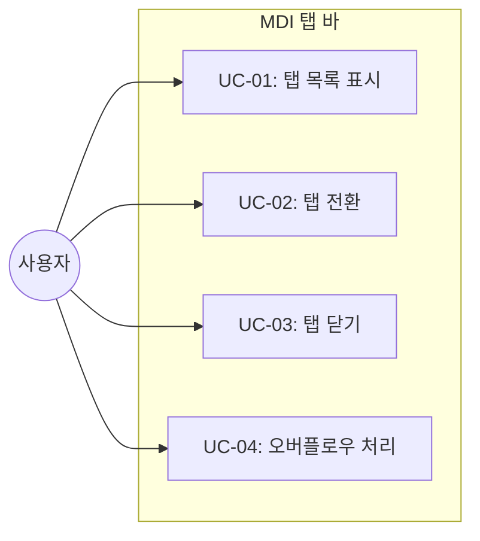
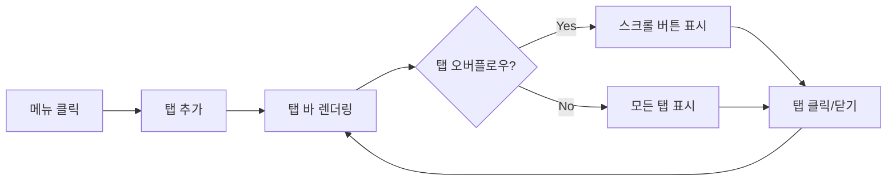

# TSK-02-02 - 탭 바 컴포넌트 설계 문서

## 문서 정보

| 항목 | 내용 |
|------|------|
| Task ID | TSK-02-02 |
| 문서 버전 | 1.0 |
| 작성일 | 2026-01-20 |
| 상태 | 작성중 |
| 카테고리 | development |

---

## 1. 개요

### 1.1 배경 및 문제 정의

**현재 상황:**
- PortalLayout 컴포넌트 구조는 완성됨 (TSK-01-01 완료)
- MDI 상태 관리 구조가 구현 예정 (TSK-02-01)
- MDI 탭을 시각적으로 표현할 탭 바 컴포넌트가 필요

**해결하려는 문제:**
- 다중 화면(탭) 전환을 위한 UI 부재
- 열린 탭 목록을 시각적으로 표시할 방법 필요
- 탭 닫기, 활성 탭 강조 등 기본 탭 인터랙션 필요

### 1.2 목적 및 기대 효과

**목적:**
- MDI 시스템의 탭 바 UI 컴포넌트 구현
- 열린 화면 목록을 탭 형태로 표시
- 탭 클릭/닫기 등 기본 인터랙션 제공

**기대 효과:**
- 여러 화면 동시 열기 및 빠른 전환 가능
- 현재 작업 중인 화면을 명확히 인지
- 탭 닫기로 메모리 및 화면 정리 용이

### 1.3 범위

**포함:**
- 탭 아이템 (아이콘 + 화면명 + 닫기 버튼)
- 활성 탭 강조 표시
- 탭 클릭 시 전환
- 닫기 버튼 클릭 시 탭 닫기
- 탭 오버플로우 시 스크롤 또는 드롭다운

**제외:**
- MDI 상태 관리 (TSK-02-01에서 구현)
- 탭 드래그 앤 드롭 (TSK-02-03에서 구현)
- 탭 컨텍스트 메뉴 (TSK-02-04에서 구현)
- MDI 컨텐츠 영역 (TSK-02-05에서 구현)

### 1.4 참조 문서

| 문서 | 경로 | 관련 섹션 |
|------|------|----------|
| PRD | `.orchay/projects/mes-portal/prd.md` | 4.1.1 탭 바 (Tab Bar), MDI |
| TSK-01-01 설계 | `.orchay/projects/mes-portal/tasks/TSK-01-01/010-design.md` | 레이아웃 구조 |

---

## 2. 사용자 분석

### 2.1 대상 사용자

| 사용자 유형 | 특성 | 주요 니즈 |
|------------|------|----------|
| 공장장/관리자 | 다수 화면 동시 모니터링 | 탭으로 빠르게 화면 전환, 여러 화면 열어두기 |
| 생산 담당자 | 작업 지시와 실적 입력 병행 | 관련 화면 간 빠른 이동 |
| 일반 사용자 | 단일 작업 집중 | 필요 없는 탭 정리, 현재 탭 명확히 인지 |

### 2.2 사용자 페르소나

**페르소나 1: 생산관리 팀장**
- 역할: 생산 현황 모니터링 및 의사결정
- 목표: 대시보드와 상세 화면을 동시에 열어 비교 분석
- 불만: 화면 전환 시 이전 화면 데이터 초기화
- 시나리오: 대시보드 탭 + 라인별 현황 탭 + 작업지시 탭을 동시에 열고 전환

---

## 3. 유즈케이스

### 3.1 유즈케이스 다이어그램



### 3.2 유즈케이스 상세

#### UC-01: 탭 목록 표시

| 항목 | 내용 |
|------|------|
| 액터 | 모든 사용자 |
| 목적 | 열린 화면 목록을 탭으로 표시 |
| 사전 조건 | MDI Context에 탭 목록 존재 |
| 사후 조건 | 탭 목록이 화면에 렌더링 |
| 트리거 | 포털 레이아웃 렌더링 시 |

**기본 흐름:**
1. 시스템이 MDI Context에서 탭 목록을 가져온다
2. 각 탭을 탭 아이템으로 렌더링한다
3. 활성 탭에 강조 스타일을 적용한다
4. 닫기 버튼이 있는 탭에 닫기 아이콘을 표시한다

#### UC-02: 탭 전환

| 항목 | 내용 |
|------|------|
| 액터 | 모든 사용자 |
| 목적 | 다른 화면으로 전환 |
| 사전 조건 | 탭 목록에 2개 이상 탭 존재 |
| 사후 조건 | 클릭한 탭이 활성화 |
| 트리거 | 탭 클릭 |

**기본 흐름:**
1. 사용자가 비활성 탭을 클릭한다
2. 시스템이 MDI Context의 setActiveTab을 호출한다
3. 해당 탭이 활성 상태로 변경된다
4. 컨텐츠 영역에 해당 화면이 표시된다

#### UC-03: 탭 닫기

| 항목 | 내용 |
|------|------|
| 액터 | 모든 사용자 |
| 목적 | 불필요한 탭 제거 |
| 사전 조건 | 닫기 가능한 탭 존재 |
| 사후 조건 | 탭 목록에서 제거, 필요 시 활성 탭 변경 |
| 트리거 | 탭 닫기 버튼 클릭 |

**기본 흐름:**
1. 사용자가 탭의 닫기(✕) 버튼을 클릭한다
2. 시스템이 MDI Context의 closeTab을 호출한다
3. 해당 탭이 목록에서 제거된다
4. 닫은 탭이 활성 탭이었으면 인접 탭으로 활성 전환

**예외 흐름:**
- 1a. 탭이 closable: false인 경우:
  - 닫기 버튼이 표시되지 않음
  - 닫기 액션 불가

#### UC-04: 오버플로우 처리

| 항목 | 내용 |
|------|------|
| 액터 | 모든 사용자 |
| 목적 | 많은 탭 열렸을 때 접근성 보장 |
| 사전 조건 | 탭 너비 합계가 탭 바 너비 초과 |
| 사후 조건 | 스크롤 또는 드롭다운으로 모든 탭 접근 가능 |
| 트리거 | 탭 개수 증가로 오버플로우 발생 |

**기본 흐름:**
1. 탭 개수 증가로 탭 바 영역 초과
2. 시스템이 좌우 스크롤 버튼을 표시한다
3. 사용자가 스크롤 버튼을 클릭하여 탭 이동
4. 또는 드롭다운 메뉴로 전체 탭 목록 표시

---

## 4. 사용자 시나리오

### 4.1 시나리오 1: 다중 화면 작업

**상황 설명:**
생산관리 팀장이 대시보드를 보면서 라인별 상세 현황을 확인하는 상황

**단계별 진행:**

| 단계 | 사용자 행동 | 시스템 반응 | 사용자 기대 |
|------|-----------|------------|------------|
| 1 | 메뉴에서 대시보드 클릭 | 대시보드 탭 생성 및 활성화 | 대시보드 화면 표시 |
| 2 | 메뉴에서 1라인 현황 클릭 | 1라인 현황 탭 추가, 활성화 | 1라인 화면 표시, 대시보드 탭 유지 |
| 3 | 대시보드 탭 클릭 | 대시보드 탭 활성화 | 대시보드 화면으로 전환 |
| 4 | 1라인 현황 탭 닫기 버튼 클릭 | 1라인 탭 제거, 대시보드 활성 유지 | 대시보드만 남음 |

**성공 조건:**
- 탭 간 전환 시 데이터 상태 유지
- 탭 닫기 후 정상적인 화면 표시

### 4.2 시나리오 2: 많은 탭 열기

**상황 설명:**
여러 화면을 동시에 열어 비교 작업을 하는 상황

**단계별 진행:**

| 단계 | 사용자 행동 | 시스템 반응 | 사용자 기대 |
|------|-----------|------------|------------|
| 1 | 10개 이상 화면 순차 열기 | 탭이 계속 추가됨 | 모든 탭 접근 가능 |
| 2 | 탭 바 영역 초과 | 스크롤 버튼 표시 | 스크롤로 모든 탭 접근 |
| 3 | 스크롤 버튼 클릭 | 탭 목록 스크롤 | 숨겨진 탭 표시 |

---

## 5. 화면 설계

### 5.1 화면 흐름도



### 5.2 화면별 상세

#### 화면 1: 탭 바

**화면 목적:**
MDI 시스템의 열린 화면 목록을 탭 형태로 표시하고 전환/닫기 기능 제공

**진입 경로:**
- 포털 레이아웃의 탭 바 영역에 항상 표시

**와이어프레임 - 기본 상태:**
```
┌─────────────────────────────────────────────────────────────────────────────┐
│  ┌──────────────┐ ┌──────────────┐ ┌──────────────┐                         │
│  │ 📊 대시보드   │ │ 📋 작업지시 ✕│ │ 📈 생산현황 ✕│                         │
│  │   (활성)     │ │              │ │              │                         │
│  └──────────────┘ └──────────────┘ └──────────────┘                         │
└─────────────────────────────────────────────────────────────────────────────┘
  ↑ 활성 탭 강조      ↑ 닫기 버튼       ↑ 비활성 탭
```

**와이어프레임 - 오버플로우 상태:**
```
┌─────────────────────────────────────────────────────────────────────────────┐
│ ◀ ┌──────────┐ ┌──────────┐ ┌──────────┐ ┌──────────┐ ┌──────────┐ ... ▶ ▼ │
│   │ 📊 대시..│ │ 📋 작업..│ │ 📈 생산..│ │ 🔧 설비..│ │ 📦 재고..│        │
│   └──────────┘ └──────────┘ └──────────┘ └──────────┘ └──────────┘        │
└─────────────────────────────────────────────────────────────────────────────┘
 ↑ 좌 스크롤                                                 ↑ 우 스크롤  ↑ 드롭다운
```

**화면 요소 설명:**

| 영역 | 설명 | 사용자 인터랙션 |
|------|------|----------------|
| 탭 아이템 | 아이콘 + 화면명 + 닫기 버튼 | 클릭 시 해당 화면으로 전환 |
| 활성 탭 | 현재 보고 있는 화면의 탭 | 배경색/테두리로 강조 |
| 닫기 버튼 | ✕ 아이콘 | 클릭 시 탭 닫기 |
| 스크롤 버튼 | ◀ / ▶ | 클릭 시 탭 목록 스크롤 |
| 드롭다운 버튼 | ▼ | 클릭 시 전체 탭 목록 표시 |

### 5.3 탭 아이템 상태

| 상태 | 스타일 | 설명 |
|------|--------|------|
| 기본 (비활성) | 배경: 투명, 텍스트: muted | 열려 있으나 현재 보지 않는 탭 |
| 활성 | 배경: primary-bg, 하단 border | 현재 보고 있는 탭 |
| 호버 | 배경: hover-bg | 마우스 올린 상태 |
| 닫기 불가 | 닫기 버튼 숨김 | closable: false 탭 |

### 5.4 반응형 동작

| 화면 크기 | 레이아웃 변화 | 사용자 경험 |
|----------|--------------|------------|
| 데스크톱 (1024px+) | 탭 전체 표시 또는 스크롤 | 충분한 공간에서 다중 탭 관리 |
| 태블릿 (768-1023px) | 탭 축소 표시 (아이콘 위주) | 터치로 탭 전환 |
| 모바일 (767px-) | 드롭다운 셀렉트 형태 | 공간 효율적 탭 선택 |

---

## 6. 인터랙션 설계

### 6.1 사용자 액션과 피드백

| 사용자 액션 | 즉각 피드백 | 결과 피드백 | 에러 피드백 |
|------------|-----------|------------|------------|
| 탭 클릭 | 클릭 효과 (배경 변화) | 활성 탭 변경, 컨텐츠 전환 | - |
| 닫기 버튼 클릭 | 버튼 눌림 효과 | 탭 제거 애니메이션 | - |
| 스크롤 버튼 클릭 | 버튼 눌림 효과 | 탭 목록 스크롤 | 더 이상 스크롤 불가 시 비활성화 |
| 탭 호버 | 배경색 변화 | - | - |

### 6.2 상태별 화면 변화

| 상태 | 화면 표시 | 사용자 안내 |
|------|----------|------------|
| 탭 없음 | 빈 탭 바 또는 홈 탭 표시 | "메뉴에서 화면을 선택하세요" |
| 단일 탭 | 탭 1개 표시, 닫기 버튼 숨김 (옵션) | - |
| 다중 탭 | 탭 목록 표시, 닫기 버튼 활성 | - |
| 오버플로우 | 스크롤/드롭다운 버튼 표시 | 좌우 화살표로 더 많은 탭 암시 |

### 6.3 키보드/접근성

| 기능 | 키보드 단축키 | 스크린 리더 안내 |
|------|-------------|-----------------|
| 탭 전환 | Ctrl+Tab (다음), Ctrl+Shift+Tab (이전) | "{화면명} 탭, {n}번째 중 {m}개" |
| 탭 닫기 | Ctrl+W | "{화면명} 탭 닫기" |
| 탭 포커스 | Tab 키 | 탭 목록 내 이동 |

---

## 7. 데이터 요구사항

### 7.1 필요한 데이터

| 데이터 | 설명 | 출처 | 용도 |
|--------|------|------|------|
| tabs | 열린 탭 목록 배열 | MDI Context | 탭 목록 렌더링 |
| activeTabId | 현재 활성 탭 ID | MDI Context | 활성 탭 강조 |
| openTab | 새 탭 열기 함수 | MDI Context | 탭 추가 |
| closeTab | 탭 닫기 함수 | MDI Context | 탭 제거 |
| setActiveTab | 활성 탭 변경 함수 | MDI Context | 탭 전환 |

### 7.2 데이터 타입

```typescript
interface Tab {
  id: string;          // 고유 ID
  title: string;       // 화면명 (탭에 표시)
  path: string;        // 라우트 경로
  icon?: ReactNode;    // 탭 아이콘
  closable?: boolean;  // 닫기 가능 여부 (기본 true)
}

interface MDIContextValue {
  tabs: Tab[];
  activeTabId: string | null;
  openTab: (tab: Omit<Tab, 'id'> & { id?: string }) => void;
  closeTab: (tabId: string) => void;
  setActiveTab: (tabId: string) => void;
}
```

---

## 8. 비즈니스 규칙

### 8.1 핵심 규칙

| 규칙 ID | 규칙 설명 | 적용 상황 | 예외 |
|---------|----------|----------|------|
| BR-01 | 마지막 탭은 닫을 수 없음 | 탭이 1개만 남았을 때 | 홈 탭 등 기본 탭 설정 시 |
| BR-02 | 활성 탭 닫기 시 인접 탭 활성화 | 닫은 탭이 활성 탭일 때 | 우측 탭 우선, 없으면 좌측 |
| BR-03 | 같은 화면 중복 열기 불가 | 이미 열린 화면 메뉴 클릭 | 해당 탭으로 전환 |
| BR-04 | 최대 탭 개수 제한 | 탭 개수 초과 시 | 경고 메시지 표시 |

### 8.2 규칙 상세 설명

**BR-01: 마지막 탭 보호**

설명: 사용자가 모든 탭을 닫아 빈 화면이 되는 것을 방지

예시:
- 탭 1개 남았을 때: 닫기 버튼 비활성화 또는 숨김
- 홈 탭 설정 시: 홈 탭은 항상 유지, closable: false

**BR-02: 활성 탭 닫기 시 전환 로직**

설명: 현재 보고 있는 탭을 닫을 때 자연스러운 전환

예시:
- [A, B(활성), C] 에서 B 닫기 → C 활성화 (우측 우선)
- [A, B, C(활성)] 에서 C 닫기 → B 활성화 (좌측으로)

---

## 9. 에러 처리

### 9.1 예상 에러 상황

| 상황 | 원인 | 사용자 메시지 | 복구 방법 |
|------|------|--------------|----------|
| 최대 탭 초과 | 너무 많은 탭 열기 | "최대 {n}개 탭까지 열 수 있습니다" | 기존 탭 닫고 재시도 |
| 탭 닫기 실패 | 저장되지 않은 데이터 | "저장되지 않은 변경사항이 있습니다" | 저장 또는 무시 선택 |

### 9.2 에러 표시 방식

| 에러 유형 | 표시 위치 | 표시 방법 |
|----------|----------|----------|
| 탭 제한 초과 | 화면 상단 | 토스트 알림 |
| 저장 확인 필요 | 모달 | 확인 다이얼로그 |

---

## 10. 연관 문서

| 문서 | 경로 | 용도 |
|------|------|------|
| 요구사항 추적 매트릭스 | `025-traceability-matrix.md` | PRD → 설계 → 테스트 추적 |
| 테스트 명세서 | `026-test-specification.md` | 테스트 케이스 정의 |

---

## 11. 구현 범위

### 11.1 영향받는 영역

| 영역 | 변경 내용 | 영향도 |
|------|----------|--------|
| components/mdi/TabBar.tsx | 탭 바 컴포넌트 신규 생성 | 높음 |
| components/layout/PortalLayout.tsx | TabBar 통합 | 중간 |

### 11.2 의존성

| 의존 항목 | 이유 | 상태 |
|----------|------|------|
| TSK-02-01 (MDI 상태 관리) | MDI Context 제공 필요 | 대기 |
| TSK-00-02 (UI 라이브러리 설정) | Ant Design 컴포넌트 필요 | 대기 |

### 11.3 파일 구조

```
mes-portal/
├── components/
│   └── mdi/
│       ├── TabBar.tsx           # 탭 바 메인 컴포넌트
│       ├── TabItem.tsx          # 개별 탭 아이템 컴포넌트
│       └── index.ts             # 내보내기
```

---

## 12. 구현 명세

### 12.1 TabBar 컴포넌트

```typescript
// components/mdi/TabBar.tsx
'use client';

import { useMDI } from '@/lib/mdi/context';
import { TabItem } from './TabItem';
import { LeftOutlined, RightOutlined, DownOutlined } from '@ant-design/icons';
import { Dropdown } from 'antd';
import { useRef, useState, useEffect } from 'react';

export function TabBar() {
  const { tabs, activeTabId, setActiveTab, closeTab } = useMDI();
  const containerRef = useRef<HTMLDivElement>(null);
  const [showLeftScroll, setShowLeftScroll] = useState(false);
  const [showRightScroll, setShowRightScroll] = useState(false);

  // 스크롤 상태 감지
  useEffect(() => {
    const container = containerRef.current;
    if (!container) return;

    const checkScroll = () => {
      setShowLeftScroll(container.scrollLeft > 0);
      setShowRightScroll(
        container.scrollLeft < container.scrollWidth - container.clientWidth
      );
    };

    checkScroll();
    container.addEventListener('scroll', checkScroll);
    window.addEventListener('resize', checkScroll);

    return () => {
      container.removeEventListener('scroll', checkScroll);
      window.removeEventListener('resize', checkScroll);
    };
  }, [tabs]);

  const scroll = (direction: 'left' | 'right') => {
    const container = containerRef.current;
    if (!container) return;
    const scrollAmount = 200;
    container.scrollBy({
      left: direction === 'left' ? -scrollAmount : scrollAmount,
      behavior: 'smooth',
    });
  };

  const handleTabClick = (tabId: string) => {
    setActiveTab(tabId);
  };

  const handleTabClose = (tabId: string, e: React.MouseEvent) => {
    e.stopPropagation();
    closeTab(tabId);
  };

  // 드롭다운 메뉴 아이템
  const dropdownItems = tabs.map((tab) => ({
    key: tab.id,
    label: tab.title,
    icon: tab.icon,
    onClick: () => setActiveTab(tab.id),
  }));

  return (
    <div
      className="flex items-center h-full bg-gray-100 dark:bg-gray-800 border-b"
      style={{ height: 'var(--tab-bar-height)' }}
    >
      {/* 좌측 스크롤 버튼 */}
      {showLeftScroll && (
        <button
          onClick={() => scroll('left')}
          className="px-2 h-full hover:bg-gray-200 dark:hover:bg-gray-700"
          aria-label="이전 탭"
        >
          <LeftOutlined />
        </button>
      )}

      {/* 탭 컨테이너 */}
      <div
        ref={containerRef}
        className="flex-1 flex items-center overflow-x-auto scrollbar-hide"
        style={{ scrollBehavior: 'smooth' }}
      >
        {tabs.map((tab) => (
          <TabItem
            key={tab.id}
            tab={tab}
            isActive={tab.id === activeTabId}
            onClick={() => handleTabClick(tab.id)}
            onClose={(e) => handleTabClose(tab.id, e)}
          />
        ))}
      </div>

      {/* 우측 스크롤 버튼 */}
      {showRightScroll && (
        <button
          onClick={() => scroll('right')}
          className="px-2 h-full hover:bg-gray-200 dark:hover:bg-gray-700"
          aria-label="다음 탭"
        >
          <RightOutlined />
        </button>
      )}

      {/* 드롭다운 메뉴 (전체 탭 목록) */}
      {tabs.length > 5 && (
        <Dropdown menu={{ items: dropdownItems }} trigger={['click']}>
          <button
            className="px-2 h-full hover:bg-gray-200 dark:hover:bg-gray-700"
            aria-label="모든 탭 보기"
          >
            <DownOutlined />
          </button>
        </Dropdown>
      )}
    </div>
  );
}
```

### 12.2 TabItem 컴포넌트

```typescript
// components/mdi/TabItem.tsx
'use client';

import { CloseOutlined } from '@ant-design/icons';
import type { Tab } from '@/lib/mdi/types';

interface TabItemProps {
  tab: Tab;
  isActive: boolean;
  onClick: () => void;
  onClose: (e: React.MouseEvent) => void;
}

export function TabItem({ tab, isActive, onClick, onClose }: TabItemProps) {
  const closable = tab.closable !== false;

  return (
    <div
      onClick={onClick}
      className={`
        flex items-center gap-2 px-3 h-full min-w-[120px] max-w-[200px]
        cursor-pointer select-none transition-colors
        border-r border-gray-200 dark:border-gray-700
        ${isActive
          ? 'bg-white dark:bg-gray-900 border-b-2 border-b-blue-500'
          : 'hover:bg-gray-200 dark:hover:bg-gray-700'
        }
      `}
      role="tab"
      aria-selected={isActive}
      tabIndex={0}
    >
      {/* 아이콘 */}
      {tab.icon && <span className="text-sm">{tab.icon}</span>}

      {/* 제목 */}
      <span className="flex-1 truncate text-sm">{tab.title}</span>

      {/* 닫기 버튼 */}
      {closable && (
        <button
          onClick={onClose}
          className="p-1 rounded hover:bg-gray-300 dark:hover:bg-gray-600 transition-colors"
          aria-label={`${tab.title} 탭 닫기`}
        >
          <CloseOutlined className="text-xs" />
        </button>
      )}
    </div>
  );
}
```

### 12.3 CSS 추가 (globals.css)

```css
/* 스크롤바 숨김 */
.scrollbar-hide {
  -ms-overflow-style: none;
  scrollbar-width: none;
}
.scrollbar-hide::-webkit-scrollbar {
  display: none;
}
```

---

## 13. 통합 검증 체크리스트

> Task 완료 시 프로젝트에 제대로 통합되었는지 확인하는 체크리스트

### 13.1 파일 존재 확인

- [ ] `mes-portal/components/mdi/TabBar.tsx` 파일 존재
- [ ] `mes-portal/components/mdi/TabItem.tsx` 파일 존재
- [ ] `mes-portal/components/mdi/index.ts` 내보내기 파일 존재

### 13.2 컴포넌트 통합 확인

- [ ] MDI Context에서 탭 목록 구독
- [ ] 탭 클릭 시 `setActiveTab` 함수 호출
- [ ] 닫기 버튼 클릭 시 `closeTab` 함수 호출
- [ ] PortalLayout에서 TabBar 렌더링

### 13.3 스타일 확인

- [ ] 탭 바 높이 `--tab-bar-height: 40px` 적용
- [ ] 활성 탭 시각적 강조 (배경색/하단 border)
- [ ] 호버 상태 스타일 적용
- [ ] 스크롤바 숨김 스타일 적용

### 13.4 기능 확인

- [ ] 탭 목록 정상 렌더링
- [ ] 탭 클릭 시 활성 탭 변경
- [ ] 닫기 버튼 클릭 시 탭 제거
- [ ] 오버플로우 시 스크롤 버튼 표시
- [ ] 드롭다운 메뉴로 전체 탭 목록 표시

---

## 14. 체크리스트

### 14.1 설계 완료 확인

- [x] 문제 정의 및 목적 명확화
- [x] 사용자 분석 완료
- [x] 유즈케이스 정의 완료
- [x] 사용자 시나리오 작성 완료
- [x] 화면 설계 완료 (와이어프레임)
- [x] 인터랙션 설계 완료
- [x] 데이터 요구사항 정의 완료
- [x] 비즈니스 규칙 정의 완료
- [x] 에러 처리 정의 완료
- [x] 통합 검증 체크리스트 정의

### 14.2 구현 준비

- [ ] 의존성 확인 완료 (TSK-02-01 완료 필요)
- [x] 제약 사항 검토 완료

---

## 변경 이력

| 버전 | 일자 | 작성자 | 변경 내용 |
|------|------|--------|----------|
| 1.0 | 2026-01-20 | AI | 최초 작성 |
