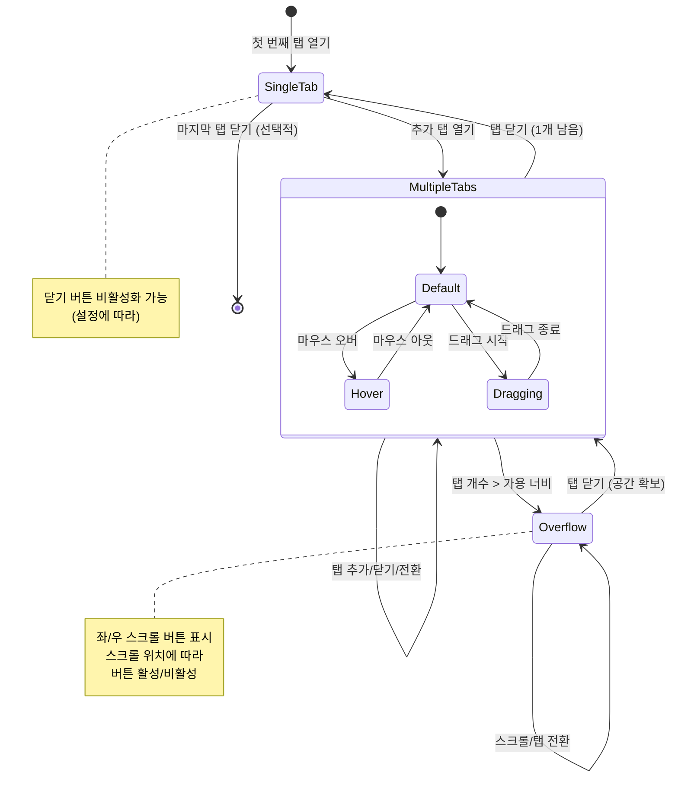

# TSK-02-02 - 탭 바 컴포넌트 UI 설계

**Version:** 1.0 — **Last Updated:** 2026-01-20

> **목적**: MDI 시스템에서 열린 화면들을 탭 형태로 관리하고, 탭 전환/닫기/순서 변경 등의 인터랙션을 제공하는 탭 바 컴포넌트 UI 설계

---

## 1. 화면 목록

| 화면 ID | 화면명 | 목적 | SVG 참조 |
|---------|--------|------|----------|
| SCR-01 | 탭 바 (기본 상태) | 여러 탭이 열린 상태, 하나의 탭이 활성화됨 | `screen-01-tabbar-default.svg` |
| SCR-02 | 탭 바 (호버 상태) | 탭 및 닫기 버튼 호버 시 시각적 피드백 | `screen-02-tabbar-hover.svg` |
| SCR-03 | 탭 바 (오버플로우 상태) | 탭이 많아 스크롤 버튼 표시됨 | `screen-03-tabbar-overflow.svg` |
| SCR-04 | 탭 바 (단일 탭 상태) | 탭이 하나만 열린 경우 | `screen-04-tabbar-single.svg` |

---

## 2. 화면 전환 흐름

### 2.1 상태 다이어그램



### 2.2 액션-화면 매트릭스

| 액션 | 현재 상태 | 결과 상태 | 트리거 | 비고 |
|------|----------|----------|--------|------|
| 메뉴에서 화면 열기 | SingleTab | MultipleTabs | 사이드바 메뉴 클릭 | 새 탭 추가 및 활성화 |
| 탭 클릭 | MultipleTabs | MultipleTabs | 비활성 탭 클릭 | 해당 탭 활성화 |
| 탭 닫기 | MultipleTabs | MultipleTabs/SingleTab | 닫기 버튼 클릭 | 인접 탭 활성화 |
| 탭 닫기 (마지막) | SingleTab | Empty (선택적) | 닫기 버튼 클릭 | 빈 상태 또는 닫기 방지 |
| 탭 호버 | Default | Hover | 마우스 진입 | 호버 스타일 적용 |
| 탭 드래그 | Default | Dragging | 드래그 시작 | 순서 변경 UI |
| 스크롤 좌측 | Overflow | Overflow | 좌측 버튼 클릭 | 탭 목록 좌측 스크롤 |
| 스크롤 우측 | Overflow | Overflow | 우측 버튼 클릭 | 탭 목록 우측 스크롤 |
| Ctrl+W | Any | Any | 키보드 단축키 | 활성 탭 닫기 |
| Ctrl+Tab | Any | Any | 키보드 단축키 | 다음 탭으로 전환 |

---

## 3. 화면별 상세

### 3.1 SCR-01: 탭 바 (기본 상태)

**화면 목적**: 여러 탭이 열린 기본 상태로, 하나의 탭이 활성화되어 있음

**레이아웃 구조**:
```
┌───────────────────────────────────────────────────────────────────────────────────┐
│  ┌────────────────┐ ┌────────────────┐ ┌────────────────┐                        │
│  │ [icon] Tab 1  x│ │ [icon] Tab 2  x│ │ [icon] Tab 3  x│                        │
│  │   ─────────    │ └────────────────┘ └────────────────┘                        │
│  │   (활성 탭)     │   (비활성 탭)        (비활성 탭)                               │
│  └────────────────┘                                                              │
│  ═══════════════════════════════════════════════════════════════════════════════ │
└───────────────────────────────────────────────────────────────────────────────────┘
         탭 바 높이: 40px (--tab-bar-height)
```

**컴포넌트 구성**:

| 컴포넌트 | 역할 | Props | 비고 |
|----------|------|-------|------|
| `TabBar` | 탭 바 컨테이너 | `tabs`, `activeTabId`, `onTabClick`, `onTabClose` | 전체 탭 목록 관리 |
| `TabItem` | 개별 탭 아이템 | `tab`, `isActive`, `onClick`, `onClose` | 아이콘 + 화면명 + 닫기 버튼 |
| `TabCloseButton` | 닫기 버튼 | `onClose`, `disabled` | x 아이콘 |

**상태 관리**:
- `tabs`: 열린 탭 목록 (MDI Context)
- `activeTabId`: 현재 활성 탭 ID (MDI Context)
- `scrollPosition`: 탭 목록 스크롤 위치 (로컬 상태)

**사용자 액션**:

| 액션 | 요소 | 결과 |
|------|------|------|
| 탭 클릭 | TabItem | 해당 탭 활성화 |
| 닫기 버튼 클릭 | TabCloseButton | 탭 닫기 |
| 탭 더블 클릭 | TabItem | 탭 이름 편집 (선택적) |
| 탭 우클릭 | TabItem | 컨텍스트 메뉴 표시 |
| 탭 드래그 | TabItem | 탭 순서 변경 |

---

### 3.2 SCR-02: 탭 바 (호버 상태)

**화면 목적**: 탭 또는 닫기 버튼에 마우스를 올렸을 때의 시각적 피드백

**레이아웃 구조**:
```
┌───────────────────────────────────────────────────────────────────────────────────┐
│  ┌────────────────┐ ┌────────────────┐ ┌────────────────┐                        │
│  │ [icon] Tab 1  x│ │░░░░░░░░░░░░░░░░│ │ [icon] Tab 3  x│                        │
│  │   ─────────    │ │ [icon] Tab 2 (x)│ └────────────────┘                        │
│  │   (활성 탭)     │ │  ↑ 호버 상태   │   (비활성 탭)                               │
│  └────────────────┘ │  닫기 버튼 강조 │                                           │
│                     └────────────────┘                                            │
│  ═══════════════════════════════════════════════════════════════════════════════ │
└───────────────────────────────────────────────────────────────────────────────────┘
```

**호버 스타일 정의**:

| 요소 | 기본 상태 | 호버 상태 |
|------|----------|----------|
| 비활성 탭 배경 | `#F5F5F5` | `#E8E8E8` |
| 활성 탭 배경 | `#FFFFFF` | `#FFFFFF` (변화 없음) |
| 닫기 버튼 | `#9CA3AF` (보임/숨김) | `#6B7280` + 배경 `#0000000A` |
| 닫기 버튼 호버 | - | `#DC2626` + 배경 `#FEE2E2` |

**컴포넌트 구성**:

| 컴포넌트 | 역할 | 상태 |
|----------|------|------|
| `TabItem` | 탭 호버 감지 | `isHovered` 상태 |
| `TabCloseButton` | 닫기 버튼 호버 감지 | `isHovered` 상태, 별도 호버 스타일 |

---

### 3.3 SCR-03: 탭 바 (오버플로우 상태)

**화면 목적**: 탭이 많아 가용 너비를 초과할 때 좌우 스크롤 버튼 표시

**레이아웃 구조**:
```
┌───────────────────────────────────────────────────────────────────────────────────┐
│ [<] ┌───────────┐┌───────────┐┌───────────┐┌───────────┐┌───────────┐┌───┐ [>] │
│     │ Tab 1   x ││ Tab 2   x ││ Tab 3   x ││ Tab 4   x ││ Tab 5   x ││Tab│     │
│     │   ────    │└───────────┘└───────────┘└───────────┘└───────────┘│...│     │
│     │ (활성)    │                                                    └───┘     │
│     └───────────┘                                                              │
│  ═══════════════════════════════════════════════════════════════════════════════ │
└───────────────────────────────────────────────────────────────────────────────────┘
  ↑                                                                             ↑
  스크롤 좌측 버튼                                                         스크롤 우측 버튼
  (시작 위치면 비활성)                                                    (끝 위치면 비활성)
```

**컴포넌트 구성**:

| 컴포넌트 | 역할 | Props | 비고 |
|----------|------|-------|------|
| `TabBar` | 오버플로우 감지 | `isOverflowing` | ResizeObserver 사용 |
| `ScrollButton` | 스크롤 버튼 | `direction`, `disabled`, `onClick` | 좌/우 화살표 |
| `TabList` | 탭 목록 컨테이너 | `scrollLeft` | overflow: hidden, 스크롤 가능 |

**스크롤 버튼 동작**:

| 버튼 | 클릭 시 동작 | 비활성화 조건 |
|------|-------------|--------------|
| 좌측 `<` | 탭 너비만큼 좌측 스크롤 | `scrollLeft === 0` |
| 우측 `>` | 탭 너비만큼 우측 스크롤 | `scrollLeft + width >= scrollWidth` |

**키보드 지원**:

| 키 | 동작 |
|-----|------|
| Left Arrow | 스크롤 버튼 포커스 시 좌측 스크롤 |
| Right Arrow | 스크롤 버튼 포커스 시 우측 스크롤 |

---

### 3.4 SCR-04: 탭 바 (단일 탭 상태)

**화면 목적**: 탭이 하나만 열린 상태로, 닫기 버튼 비활성화 가능

**레이아웃 구조**:
```
┌───────────────────────────────────────────────────────────────────────────────────┐
│  ┌────────────────┐                                                              │
│  │ [icon] Tab 1  x│                                                              │
│  │   ─────────    │                                                              │
│  │   (활성 탭)     │   닫기 버튼 비활성화 (설정에 따라)                              │
│  └────────────────┘                                                              │
│  ═══════════════════════════════════════════════════════════════════════════════ │
└───────────────────────────────────────────────────────────────────────────────────┘
```

**동작 옵션**:

| 옵션 | 설명 | 기본값 |
|------|------|--------|
| `allowCloseLastTab` | 마지막 탭 닫기 허용 여부 | `false` |
| `showCloseButton` | 단일 탭에서 닫기 버튼 표시 여부 | `true` (비활성) |

**닫기 버튼 상태**:

| 조건 | 닫기 버튼 상태 | 클릭 시 동작 |
|------|--------------|-------------|
| 탭 개수 > 1 | 활성 | 탭 닫기 |
| 탭 개수 = 1, `allowCloseLastTab = true` | 활성 | 탭 닫기 → 빈 상태 |
| 탭 개수 = 1, `allowCloseLastTab = false` | 비활성 (회색) | 동작 없음 |

---

## 4. 공통 컴포넌트

### 4.1 TabBar

탭 목록을 관리하는 컨테이너 컴포넌트

```typescript
interface TabBarProps {
  tabs: Tab[];
  activeTabId: string;
  onTabClick: (tabId: string) => void;
  onTabClose: (tabId: string) => void;
  onTabReorder?: (startIndex: number, endIndex: number) => void;
  allowCloseLastTab?: boolean;
}

interface Tab {
  id: string;
  title: string;
  icon?: string;
  path: string;
  closable?: boolean;
}
```

**스타일 적용**:
```css
.tab-bar {
  height: var(--tab-bar-height, 40px);
  display: flex;
  align-items: center;
  background: #FAFAFA;
  border-bottom: 1px solid #E5E7EB;
  overflow: hidden;
}

.tab-bar__list {
  display: flex;
  flex: 1;
  overflow-x: hidden;
  scroll-behavior: smooth;
}
```

### 4.2 TabItem

개별 탭을 표시하는 컴포넌트

```typescript
interface TabItemProps {
  tab: Tab;
  isActive: boolean;
  onClick: () => void;
  onClose: () => void;
  canClose: boolean;
  isDragging?: boolean;
}
```

**스타일 적용**:
```css
.tab-item {
  display: flex;
  align-items: center;
  gap: 8px;
  padding: 0 12px;
  height: 32px;
  margin: 4px 2px;
  border-radius: 4px;
  cursor: pointer;
  user-select: none;
  transition: background-color 0.2s;
}

.tab-item--active {
  background: #FFFFFF;
  border-bottom: 2px solid #1677ff;
  font-weight: 500;
}

.tab-item--inactive {
  background: #F5F5F5;
  color: #6B7280;
}

.tab-item--inactive:hover {
  background: #E8E8E8;
}

.tab-item__icon {
  width: 16px;
  height: 16px;
}

.tab-item__title {
  font-size: 14px;
  max-width: 120px;
  overflow: hidden;
  text-overflow: ellipsis;
  white-space: nowrap;
}
```

### 4.3 TabCloseButton

탭 닫기 버튼 컴포넌트

```typescript
interface TabCloseButtonProps {
  onClick: (e: React.MouseEvent) => void;
  disabled?: boolean;
}
```

**스타일 적용**:
```css
.tab-close-button {
  display: flex;
  align-items: center;
  justify-content: center;
  width: 16px;
  height: 16px;
  border-radius: 4px;
  cursor: pointer;
  color: #9CA3AF;
  transition: all 0.2s;
}

.tab-close-button:hover {
  background: #FEE2E2;
  color: #DC2626;
}

.tab-close-button--disabled {
  opacity: 0.4;
  cursor: not-allowed;
}

.tab-close-button--disabled:hover {
  background: transparent;
  color: #9CA3AF;
}
```

### 4.4 ScrollButton

탭 목록 스크롤 버튼 컴포넌트

```typescript
interface ScrollButtonProps {
  direction: 'left' | 'right';
  onClick: () => void;
  disabled: boolean;
}
```

**스타일 적용**:
```css
.scroll-button {
  display: flex;
  align-items: center;
  justify-content: center;
  width: 24px;
  height: 32px;
  background: #FAFAFA;
  border: 1px solid #E5E7EB;
  cursor: pointer;
  color: #6B7280;
  transition: all 0.2s;
}

.scroll-button:hover:not(:disabled) {
  background: #F0F0F0;
  color: #1F2937;
}

.scroll-button:disabled {
  opacity: 0.4;
  cursor: not-allowed;
}
```

---

## 5. 컨텍스트 메뉴

### 5.1 탭 우클릭 메뉴

```typescript
interface TabContextMenu {
  items: ContextMenuItem[];
}

interface ContextMenuItem {
  key: string;
  label: string;
  icon?: string;
  disabled?: boolean;
  danger?: boolean;
  onClick: () => void;
}
```

**메뉴 항목**:

| 항목 | 키 | 아이콘 | 동작 | 비활성화 조건 |
|------|-----|-------|------|--------------|
| 닫기 | `close` | CloseOutlined | 현재 탭 닫기 | 마지막 탭 & !allowCloseLastTab |
| 다른 탭 모두 닫기 | `closeOthers` | CloseCircleOutlined | 다른 모든 탭 닫기 | 탭 개수 <= 1 |
| 오른쪽 탭 모두 닫기 | `closeRight` | DoubleRightOutlined | 우측 탭 모두 닫기 | 우측 탭 없음 |
| 새로고침 | `refresh` | ReloadOutlined | 현재 탭 리로드 | - |

---

## 6. 반응형 설계

### 6.1 Breakpoint 정의

| Breakpoint | 너비 범위 | 탭 바 동작 |
|------------|----------|----------|
| Desktop | 1024px+ | 탭 최대 너비 200px, 여러 탭 표시 |
| Tablet | 768-1023px | 탭 최대 너비 150px, 스크롤 발생 빠름 |
| Mobile | 0-767px | 탭 최대 너비 120px, 아이콘만 표시 옵션 |

### 6.2 탭 너비 계산

```css
.tab-item {
  /* 최소 너비 */
  min-width: 80px;

  /* 최대 너비 */
  max-width: 200px;

  /* 가용 너비에 따른 동적 조절 */
  flex: 0 1 auto;
}

@media (max-width: 1023px) {
  .tab-item {
    max-width: 150px;
  }
}

@media (max-width: 767px) {
  .tab-item {
    max-width: 120px;
  }

  .tab-item__title {
    /* 모바일에서 긴 제목 숨김 가능 */
    max-width: 60px;
  }
}
```

---

## 7. 접근성

### 7.1 키보드 네비게이션

| 키 | 동작 | 조건 |
|-----|------|------|
| Tab | 탭 바 내 포커스 이동 | 기본 동작 |
| Enter / Space | 포커스된 탭 활성화 | 탭에 포커스 |
| Delete / Backspace | 포커스된 탭 닫기 | 탭에 포커스 |
| Ctrl+Tab | 다음 탭으로 전환 | 전역 단축키 |
| Ctrl+Shift+Tab | 이전 탭으로 전환 | 전역 단축키 |
| Ctrl+W | 활성 탭 닫기 | 전역 단축키 |
| Home | 첫 번째 탭으로 이동 | 탭 목록에 포커스 |
| End | 마지막 탭으로 이동 | 탭 목록에 포커스 |
| Arrow Left/Right | 이전/다음 탭으로 포커스 이동 | 탭 목록에 포커스 |

### 7.2 ARIA 속성

| 요소 | ARIA 속성 | 값 |
|------|----------|-----|
| TabBar | `role` | `tablist` |
| TabItem | `role` | `tab` |
| TabItem | `aria-selected` | `true` / `false` |
| TabItem | `aria-controls` | `tabpanel-{id}` |
| TabItem (활성) | `tabindex` | `0` |
| TabItem (비활성) | `tabindex` | `-1` |
| TabCloseButton | `aria-label` | `{탭 이름} 닫기` |
| ScrollButton (좌) | `aria-label` | `이전 탭 보기` |
| ScrollButton (우) | `aria-label` | `다음 탭 보기` |

### 7.3 색상 대비

| 요소 | 전경색 | 배경색 | 대비율 | WCAG AA |
|------|--------|--------|--------|---------|
| 활성 탭 텍스트 | #1F2937 | #FFFFFF | 14.7:1 | Pass |
| 비활성 탭 텍스트 | #6B7280 | #F5F5F5 | 5.0:1 | Pass |
| 닫기 버튼 (기본) | #9CA3AF | #F5F5F5 | 3.2:1 | AA Large |
| 닫기 버튼 (호버) | #DC2626 | #FEE2E2 | 5.5:1 | Pass |

### 7.4 포커스 표시

```css
.tab-item:focus-visible {
  outline: 2px solid #1677ff;
  outline-offset: 2px;
}

.tab-close-button:focus-visible {
  outline: 2px solid #1677ff;
  outline-offset: 1px;
}

.scroll-button:focus-visible {
  outline: 2px solid #1677ff;
  outline-offset: 1px;
}
```

---

## 8. SVG 파일 목록

| 파일명 | 설명 | 뷰포트 |
|--------|------|--------|
| `screen-01-tabbar-default.svg` | 기본 상태 (여러 탭, 하나 활성) | 960x80 |
| `screen-02-tabbar-hover.svg` | 호버 상태 (탭/닫기 버튼 호버) | 960x80 |
| `screen-03-tabbar-overflow.svg` | 오버플로우 상태 (스크롤 버튼 표시) | 960x80 |
| `screen-04-tabbar-single.svg` | 단일 탭 상태 (닫기 버튼 비활성화) | 960x80 |

---

## 9. 컴포넌트 구조

```
components/
└── mdi/
    ├── TabBar.tsx              # 탭 바 컨테이너
    ├── TabItem.tsx             # 개별 탭 아이템
    ├── TabCloseButton.tsx      # 탭 닫기 버튼
    ├── ScrollButton.tsx        # 스크롤 버튼
    ├── TabContextMenu.tsx      # 탭 컨텍스트 메뉴
    └── TabBar.module.css       # 탭 바 스타일

hooks/
└── mdi/
    ├── useTabBar.ts            # 탭 바 로직 훅
    ├── useTabOverflow.ts       # 오버플로우 감지 훅
    └── useTabDragDrop.ts       # 드래그 앤 드롭 훅
```

---

## 10. 디자인 토큰

### 10.1 크기 토큰

```css
:root {
  --tab-bar-height: 40px;
  --tab-item-height: 32px;
  --tab-item-min-width: 80px;
  --tab-item-max-width: 200px;
  --tab-item-padding: 0 12px;
  --tab-item-gap: 8px;
  --tab-item-margin: 4px 2px;
  --tab-item-border-radius: 4px;
  --tab-icon-size: 16px;
  --tab-close-button-size: 16px;
  --scroll-button-width: 24px;
}
```

### 10.2 색상 토큰

```css
:root {
  /* 탭 바 배경 */
  --tab-bar-bg: #FAFAFA;
  --tab-bar-border: #E5E7EB;

  /* 활성 탭 */
  --tab-active-bg: #FFFFFF;
  --tab-active-text: #1F2937;
  --tab-active-indicator: #1677ff;

  /* 비활성 탭 */
  --tab-inactive-bg: #F5F5F5;
  --tab-inactive-text: #6B7280;
  --tab-inactive-hover-bg: #E8E8E8;

  /* 닫기 버튼 */
  --tab-close-color: #9CA3AF;
  --tab-close-hover-color: #DC2626;
  --tab-close-hover-bg: #FEE2E2;
  --tab-close-disabled-opacity: 0.4;

  /* 스크롤 버튼 */
  --scroll-button-bg: #FAFAFA;
  --scroll-button-hover-bg: #F0F0F0;
  --scroll-button-color: #6B7280;
  --scroll-button-hover-color: #1F2937;
}
```

---

## 관련 문서

- 설계: `010-design.md`
- 테스트 명세: `026-test-specification.md`
- 추적성 매트릭스: `025-traceability-matrix.md`
- 관련 컴포넌트: TSK-02-05 (MDI 컨텐츠 영역)
