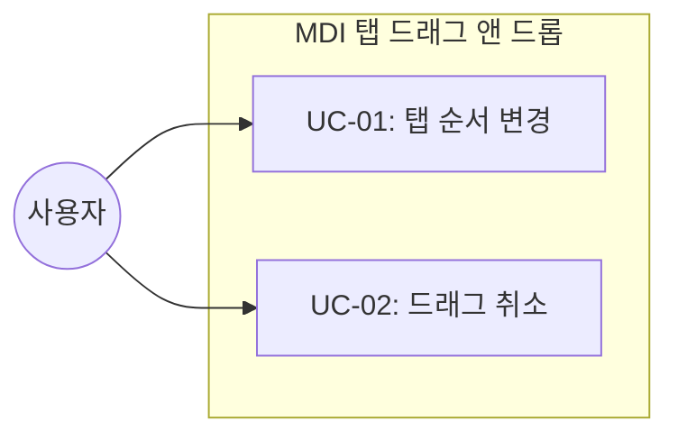
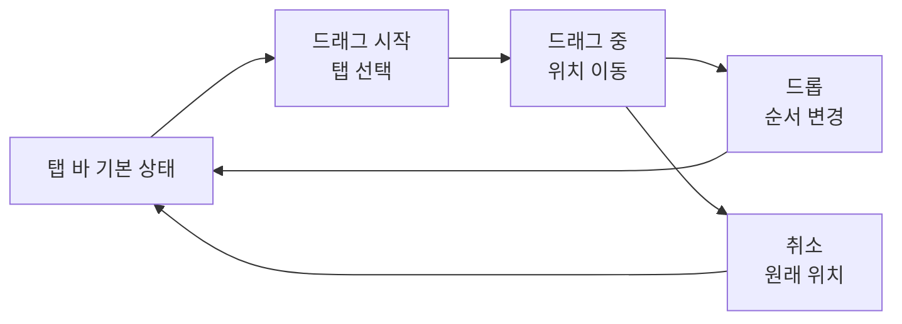
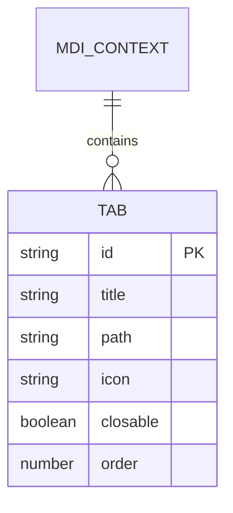

# TSK-02-03 - 탭 드래그 앤 드롭 설계 문서

## 문서 정보

| 항목 | 내용 |
|------|------|
| Task ID | TSK-02-03 |
| 문서 버전 | 1.0 |
| 작성일 | 2026-01-20 |
| 상태 | 작성중 |
| 카테고리 | development |

---

## 1. 개요

### 1.1 배경 및 문제 정의

**현재 상황:**
- MDI 탭 바 컴포넌트(TSK-02-02)가 구현되어 탭 목록 표시 및 전환 기능 제공
- 사용자가 탭의 순서를 변경하려면 탭을 닫고 다시 여는 방식으로만 가능

**해결하려는 문제:**
- 사용자가 자주 사용하는 탭을 원하는 위치에 배치하기 어려움
- 탭 개수가 많아질수록 원하는 탭을 찾는데 시간 소요
- 작업 흐름에 맞게 탭 순서를 정리하지 못하는 불편함

### 1.2 목적 및 기대 효과

**목적:**
- 탭을 드래그하여 원하는 위치로 이동할 수 있는 기능 제공
- 직관적인 시각적 피드백으로 드래그 상태 표현

**기대 효과:**
- 사용자의 작업 효율성 향상 (관련 탭을 그룹핑하여 배치 가능)
- 탭 접근성 개선 (자주 사용하는 탭을 왼쪽에 배치)
- 개인화된 작업 환경 구성

### 1.3 범위

**포함:**
- 탭 아이템 드래그 시작/이동/드롭 처리
- 드래그 중 시각적 피드백 (고스트 이미지, 드롭 위치 표시)
- 드롭 시 탭 순서 업데이트
- MDI Context/Store에 reorderTabs 함수 추가

**제외:**
- 탭을 다른 창으로 분리 (분할 화면 기능)
- 탭 그룹핑 기능
- 외부 요소를 탭으로 드래그하여 추가

### 1.4 참조 문서

| 문서 | 경로 | 관련 섹션 |
|------|------|----------|
| PRD | `.orchay/projects/mes-portal/prd.md` | PRD 4.1.1 탭 드래그 앤 드롭 |
| TRD | `.orchay/projects/mes-portal/trd.md` | TRD 7. PRD 요구사항 ↔ 기술 스택 매핑 |

---

## 2. 사용자 분석

### 2.1 대상 사용자

| 사용자 유형 | 특성 | 주요 니즈 |
|------------|------|----------|
| 공장장/관리자 | 여러 화면을 동시에 모니터링, 데스크톱 환경 | 대시보드/리포트 탭을 한눈에 보기 좋게 배치 |
| 생산 담당자 | 작업 지시와 실적 입력을 번갈아 수행 | 관련 업무 탭을 인접하게 배치 |
| 품질 담당자 | 검사 결과 입력과 불량 관리를 동시 진행 | 연관된 탭을 나란히 배치하여 비교 |

### 2.2 사용자 페르소나

**페르소나 1: 김 생산팀장**
- 역할: 생산 관리자, PC 능숙
- 목표: 여러 라인의 생산 현황을 효율적으로 모니터링
- 불만: 탭이 많아지면 원하는 탭 찾기가 어려움
- 시나리오: 아침에 출근하여 각 라인별 대시보드를 열고, 중요한 라인 탭을 왼쪽에 배치하여 빠르게 확인

---

## 3. 유즈케이스

### 3.1 유즈케이스 다이어그램



### 3.2 유즈케이스 상세

#### UC-01: 탭 순서 변경

| 항목 | 내용 |
|------|------|
| 액터 | 포털 사용자 |
| 목적 | 탭의 순서를 원하는 위치로 변경 |
| 사전 조건 | 2개 이상의 탭이 열려 있음 |
| 사후 조건 | 탭 순서가 변경되고 유지됨 |
| 트리거 | 사용자가 탭을 마우스로 드래그 시작 |

**기본 흐름:**
1. 사용자가 이동할 탭을 마우스로 클릭한 채 드래그를 시작한다
2. 시스템이 드래그 중인 탭에 시각적 피드백(반투명 고스트)을 표시한다
3. 사용자가 탭을 원하는 위치로 이동한다
4. 시스템이 드롭 가능한 위치를 표시(하이라이트 또는 인디케이터)한다
5. 사용자가 마우스를 놓아 탭을 드롭한다
6. 시스템이 탭 순서를 업데이트하고 새 위치에 탭을 배치한다

**대안 흐름:**
- 3a. 탭 바 영역 밖으로 드래그하는 경우:
  - 시스템이 드롭 불가 표시(금지 커서)를 보여준다
  - 마우스를 놓으면 원래 위치로 복귀한다

**예외 흐름:**
- 1a. 탭이 1개만 열려 있는 경우:
  - 드래그는 가능하나 드롭 위치가 동일하여 변경 없음

#### UC-02: 드래그 취소

| 항목 | 내용 |
|------|------|
| 액터 | 포털 사용자 |
| 목적 | 드래그 중 순서 변경을 취소 |
| 사전 조건 | 탭 드래그가 진행 중 |
| 사후 조건 | 탭이 원래 위치에 그대로 유지됨 |
| 트리거 | ESC 키 입력 또는 탭 바 영역 밖에서 마우스 놓음 |

**기본 흐름:**
1. 사용자가 탭을 드래그하는 중에 ESC 키를 누른다
2. 시스템이 드래그를 취소하고 탭을 원래 위치로 복귀시킨다
3. 드래그 관련 시각적 피드백이 제거된다

---

## 4. 사용자 시나리오

### 4.1 시나리오 1: 업무별 탭 그룹핑

**상황 설명:**
김 생산팀장은 아침 점검을 위해 대시보드, 1라인 현황, 2라인 현황, 작업 지시 목록 탭을 열었다. 대시보드 탭이 맨 오른쪽에 있어 자주 클릭하기 불편하다.

**단계별 진행:**

| 단계 | 사용자 행동 | 시스템 반응 | 사용자 기대 |
|------|-----------|------------|------------|
| 1 | 대시보드 탭을 클릭하고 드래그 시작 | 탭이 반투명해지고 마우스를 따라 이동 | 탭이 선택되었음을 인지 |
| 2 | 탭을 맨 왼쪽으로 드래그 | 드롭 위치에 세로 인디케이터 표시 | 탭이 해당 위치에 놓일 것임을 인지 |
| 3 | 마우스 버튼을 놓음 | 탭이 맨 왼쪽으로 이동, 다른 탭이 오른쪽으로 밀림 | 탭 순서 변경 완료 확인 |

**성공 조건:**
- 대시보드 탭이 탭 바의 맨 왼쪽에 위치함
- 다른 탭들의 상대적 순서는 유지됨
- 탭 전환 시 화면 상태가 그대로 유지됨

### 4.2 시나리오 2: 드래그 취소

**상황 설명:**
사용자가 실수로 탭을 드래그하기 시작했으나 순서를 변경하고 싶지 않다.

**단계별 진행:**

| 단계 | 사용자 행동 | 시스템 반응 | 복구 방법 |
|------|-----------|------------|----------|
| 1 | 탭을 드래그 중 ESC 키 누름 | 드래그 취소, 탭이 원래 위치로 복귀 | 자동 복구 |

---

## 5. 화면 설계

### 5.1 화면 흐름도



### 5.2 화면별 상세

#### 화면 1: 탭 바 (기본 상태)

**화면 목적:**
MDI 탭 목록을 표시하고 탭 간 전환 및 순서 변경을 지원하는 영역

**진입 경로:**
- 포털 메인 레이아웃의 컨텐츠 영역 상단에 항상 표시

**와이어프레임:**
```
┌─────────────────────────────────────────────────────────────────────────────┐
│  ┌─────────────┐┌─────────────┐┌─────────────┐┌─────────────┐              │
│  │ 🏠 대시보드 ✕││ 📋 1라인 현황✕││ 📋 2라인 현황✕││ 📄 작업지시 ✕│              │
│  └─────────────┘└─────────────┘└─────────────┘└─────────────┘              │
│   ▲ 활성 탭                                                                 │
└─────────────────────────────────────────────────────────────────────────────┘
```

**화면 요소 설명:**

| 영역 | 설명 | 사용자 인터랙션 |
|------|------|----------------|
| 탭 아이템 | 아이콘 + 화면명 + 닫기 버튼 | 클릭: 탭 전환, 드래그: 순서 변경 |
| 활성 탭 | 현재 선택된 탭 강조 | 하단 테두리 또는 배경색으로 구분 |
| 닫기 버튼 | 탭 닫기 기능 | 클릭 시 탭 닫기 |

#### 화면 2: 드래그 중 상태

**화면 목적:**
드래그 중인 탭과 드롭 가능 위치를 시각적으로 표시

**와이어프레임:**
```
┌─────────────────────────────────────────────────────────────────────────────┐
│  ┌─────────────┐   │   ┌─────────────┐┌─────────────┐┌─────────────┐       │
│  │ 📋 1라인 현황│   │   │ 📋 2라인 현황││ 📄 작업지시 │              │       │
│  └─────────────┘   │   └─────────────┘└─────────────┘              │       │
│                    │                                                        │
│         ┌─────────────┐                                                     │
│         │ 🏠 대시보드 │  ← 드래그 중인 탭 (반투명, 마우스 따라다님)          │
│         │   (Ghost)   │                                                     │
│         └─────────────┘                                                     │
│                    ▲                                                        │
│              드롭 위치 인디케이터 (파란색 세로 라인)                          │
└─────────────────────────────────────────────────────────────────────────────┘
```

**화면 요소 설명:**

| 영역 | 설명 | 사용자 인터랙션 |
|------|------|----------------|
| 드래그 고스트 | 드래그 중인 탭의 반투명 복제 | 마우스 커서를 따라 이동 |
| 원래 탭 위치 | 빈 공간 또는 placeholder | 시각적으로 원래 위치 표시 |
| 드롭 인디케이터 | 파란색 세로 라인 (2-3px) | 드롭 시 탭이 삽입될 위치 표시 |

### 5.3 반응형 동작

| 화면 크기 | 레이아웃 변화 | 사용자 경험 |
|----------|--------------|------------|
| 데스크톱 (1024px+) | 전체 탭 바 표시, 드래그 앤 드롭 완전 지원 | 최적의 드래그 경험 |
| 태블릿 (768-1023px) | 탭 오버플로우 시 스크롤, 터치 드래그 지원 | 터치로 길게 눌러 드래그 |
| 모바일 (767px-) | 탭 드롭다운 또는 가로 스크롤, 드래그 비활성화 | 탭 선택만 가능 |

---

## 6. 인터랙션 설계

### 6.1 사용자 액션과 피드백

| 사용자 액션 | 즉각 피드백 | 결과 피드백 | 에러 피드백 |
|------------|-----------|------------|------------|
| 탭 드래그 시작 | 탭 반투명화, 커서 변경 (grabbing) | - | - |
| 드래그 중 이동 | 고스트 탭 마우스 따라 이동, 드롭 위치 인디케이터 | - | 탭 바 밖: 금지 커서 |
| 드롭 | 탭 순서 즉시 변경, 애니메이션 | 탭 새 위치 고정 | - |
| ESC 키 (드래그 중) | 드래그 취소 | 탭 원래 위치 복귀 | - |

### 6.2 상태별 화면 변화

| 상태 | 화면 표시 | 사용자 안내 |
|------|----------|------------|
| 기본 상태 | 탭 목록 정상 표시 | 탭 hover 시 pointer 커서 |
| 드래그 시작 | 드래그 탭 반투명, 다른 탭 정상 | grabbing 커서 |
| 드래그 중 (유효 위치) | 드롭 인디케이터 표시 | 파란색 세로 라인 |
| 드래그 중 (무효 위치) | 드롭 인디케이터 없음 | not-allowed 커서 |
| 드롭 완료 | 탭 새 위치로 이동 | 부드러운 전환 애니메이션 |

### 6.3 키보드/접근성

| 기능 | 키보드 단축키 | 스크린 리더 안내 |
|------|-------------|-----------------|
| 드래그 취소 | ESC | "탭 이동이 취소되었습니다" |
| 탭 선택 (드래그 없이) | Enter/Space | "{탭 이름} 선택됨" |

---

## 7. 데이터 요구사항

### 7.1 필요한 데이터

| 데이터 | 설명 | 출처 | 용도 |
|--------|------|------|------|
| tabs[] | 열린 탭 목록 배열 | MDI Context/Store | 탭 순서 관리 |
| dragIndex | 드래그 중인 탭의 현재 인덱스 | 로컬 상태 | 드래그 시작 위치 추적 |
| hoverIndex | 드래그 중 호버된 위치의 인덱스 | 로컬 상태 | 드롭 위치 결정 |

### 7.2 데이터 관계



**관계 설명:**
- MDI Context가 탭 배열을 관리
- 탭 순서는 배열의 인덱스로 결정
- reorderTabs 함수로 배열 순서 변경

### 7.3 데이터 유효성 규칙

| 데이터 필드 | 규칙 | 위반 시 메시지 |
|------------|------|---------------|
| dragIndex | 0 이상, tabs.length 미만 | 내부 에러 (사용자에게 표시 안함) |
| hoverIndex | 0 이상, tabs.length 이하 | 내부 에러 (사용자에게 표시 안함) |

---

## 8. 비즈니스 규칙

### 8.1 핵심 규칙

| 규칙 ID | 규칙 설명 | 적용 상황 | 예외 |
|---------|----------|----------|------|
| BR-01 | 탭 순서 변경은 세션 동안 유지 | 탭 드래그 앤 드롭 완료 시 | 페이지 새로고침 시 초기화 (MVP) |
| BR-02 | 동일 위치 드롭 시 순서 변경 없음 | 드래그 시작 위치 = 드롭 위치 | - |
| BR-03 | 탭 바 영역 내에서만 드롭 가능 | 드래그 중 | 영역 밖 드롭 시 취소 |

### 8.2 규칙 상세 설명

**BR-01: 탭 순서 유지**

설명: 사용자가 탭 순서를 변경하면 해당 세션 동안은 변경된 순서가 유지된다. MVP 단계에서는 페이지 새로고침 시 초기화되며, 향후 localStorage 또는 서버 저장 기능 추가 가능.

예시:
- 탭 A, B, C 순서에서 C를 맨 앞으로 드래그 → C, A, B 순서로 유지
- 새 탭 D를 열면 → C, A, B, D (맨 뒤에 추가)

**BR-02: 동일 위치 드롭**

설명: 탭을 드래그했다가 원래 위치에 드롭하면 아무 변경 없음. 불필요한 상태 업데이트 방지.

---

## 9. 에러 처리

### 9.1 예상 에러 상황

| 상황 | 원인 | 사용자 메시지 | 복구 방법 |
|------|------|--------------|----------|
| 드래그 중 탭 닫힘 | 다른 액션으로 탭이 닫힘 | - (조용히 취소) | 자동 드래그 취소 |
| 탭 바 영역 밖 드롭 | 사용자 실수 | - (조용히 취소) | 탭 원래 위치 복귀 |

### 9.2 에러 표시 방식

| 에러 유형 | 표시 위치 | 표시 방법 |
|----------|----------|----------|
| 드롭 불가 영역 | 마우스 커서 | not-allowed 커서 |

---

## 10. 연관 문서

> 상세 테스트 명세 및 요구사항 추적은 별도 문서에서 관리합니다.

| 문서 | 경로 | 용도 |
|------|------|------|
| 요구사항 추적 매트릭스 | `025-traceability-matrix.md` | PRD → 설계 → 테스트 양방향 추적 |
| 테스트 명세서 | `026-test-specification.md` | 단위/E2E/매뉴얼 테스트 상세 정의 |

---

## 11. 구현 범위

### 11.1 영향받는 영역

| 영역 | 변경 내용 | 영향도 |
|------|----------|--------|
| components/mdi/TabBar.tsx | DnD 기능 추가 | 높음 |
| lib/mdi/context.tsx (또는 store.ts) | reorderTabs 함수 추가 | 중간 |
| package.json | @dnd-kit 또는 react-dnd 의존성 추가 | 낮음 |

### 11.2 의존성

| 의존 항목 | 이유 | 상태 |
|----------|------|------|
| TSK-02-01 (MDI 상태 관리) | 탭 목록 상태 관리 필요 | 대기 |
| TSK-02-02 (탭 바 컴포넌트) | 탭 바 UI에 DnD 기능 통합 | 대기 |

### 11.3 제약 사항

| 제약 | 설명 | 대응 방안 |
|------|------|----------|
| TRD 권장 라이브러리 | react-dnd 또는 @dnd-kit 사용 | @dnd-kit 권장 (더 현대적인 API) |
| 모바일 지원 | 터치 드래그 복잡성 | MVP에서는 데스크톱 우선, 모바일 드래그 비활성화 |

---

## 12. 기술 설계

### 12.1 라이브러리 선택

**@dnd-kit 선택 이유:**
- 현대적인 API 설계 (hooks 기반)
- 접근성 지원 내장 (키보드 DnD)
- 가벼운 번들 크기
- React 18+ 완벽 호환

### 12.2 컴포넌트 구조

```
components/mdi/
├── TabBar.tsx              # 탭 바 컨테이너 (DndContext 래핑)
├── TabItem.tsx             # 드래그 가능한 탭 아이템
├── SortableTabItem.tsx     # @dnd-kit useSortable 적용
└── TabDropIndicator.tsx    # 드롭 위치 인디케이터
```

### 12.3 핵심 인터페이스

```typescript
// MDI Context에 추가할 함수
interface MDIContextValue {
  // 기존...
  tabs: Tab[];
  activeTabId: string | null;
  openTab: (tab: Tab) => void;
  closeTab: (tabId: string) => void;
  setActiveTab: (tabId: string) => void;

  // 새로 추가
  reorderTabs: (activeId: string, overId: string) => void;
}

// 탭 순서 변경 함수
function reorderTabs(activeId: string, overId: string): void {
  // activeId: 드래그 중인 탭 ID
  // overId: 드롭 위치의 탭 ID
  // 배열에서 activeId 탭을 overId 탭 위치로 이동
}
```

### 12.4 핵심 구현 로직

```typescript
// @dnd-kit을 사용한 탭 순서 변경
import { DndContext, closestCenter, DragEndEvent } from '@dnd-kit/core';
import { SortableContext, horizontalListSortingStrategy } from '@dnd-kit/sortable';

function handleDragEnd(event: DragEndEvent) {
  const { active, over } = event;

  if (over && active.id !== over.id) {
    reorderTabs(active.id as string, over.id as string);
  }
}
```

---

## 13. 체크리스트

### 13.1 설계 완료 확인

- [x] 문제 정의 및 목적 명확화
- [x] 사용자 분석 완료
- [x] 유즈케이스 정의 완료
- [x] 사용자 시나리오 작성 완료
- [x] 화면 설계 완료 (와이어프레임)
- [x] 인터랙션 설계 완료
- [x] 데이터 요구사항 정의 완료
- [x] 비즈니스 규칙 정의 완료
- [x] 에러 처리 정의 완료

### 13.2 연관 문서 작성

- [ ] 요구사항 추적 매트릭스 작성 (→ `025-traceability-matrix.md`)
- [ ] 테스트 명세서 작성 (→ `026-test-specification.md`)

### 13.3 구현 준비

- [x] 구현 우선순위 결정 (TSK-02-01, TSK-02-02 완료 후)
- [x] 의존성 확인 완료
- [x] 제약 사항 검토 완료

---

## 변경 이력

| 버전 | 일자 | 작성자 | 변경 내용 |
|------|------|--------|----------|
| 1.0 | 2026-01-20 | Claude | 최초 작성 |
