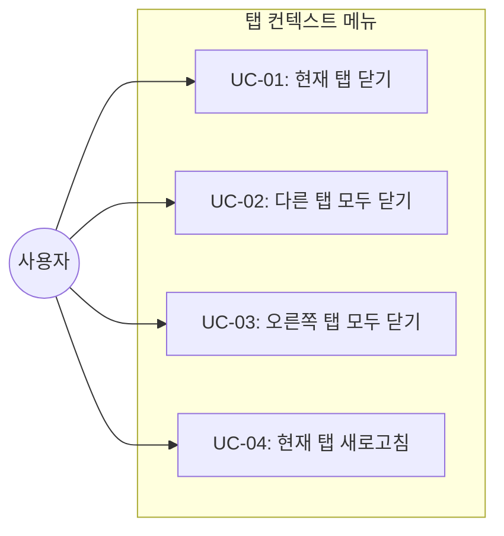
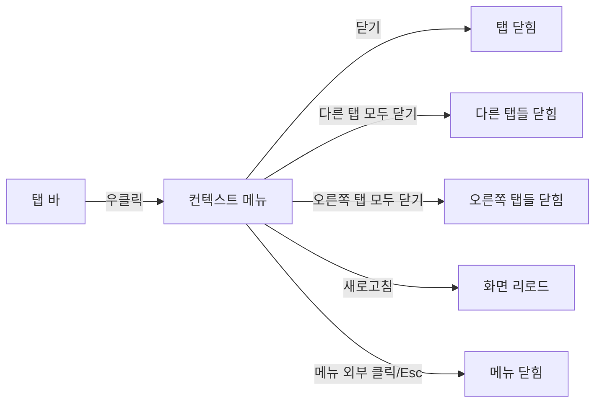
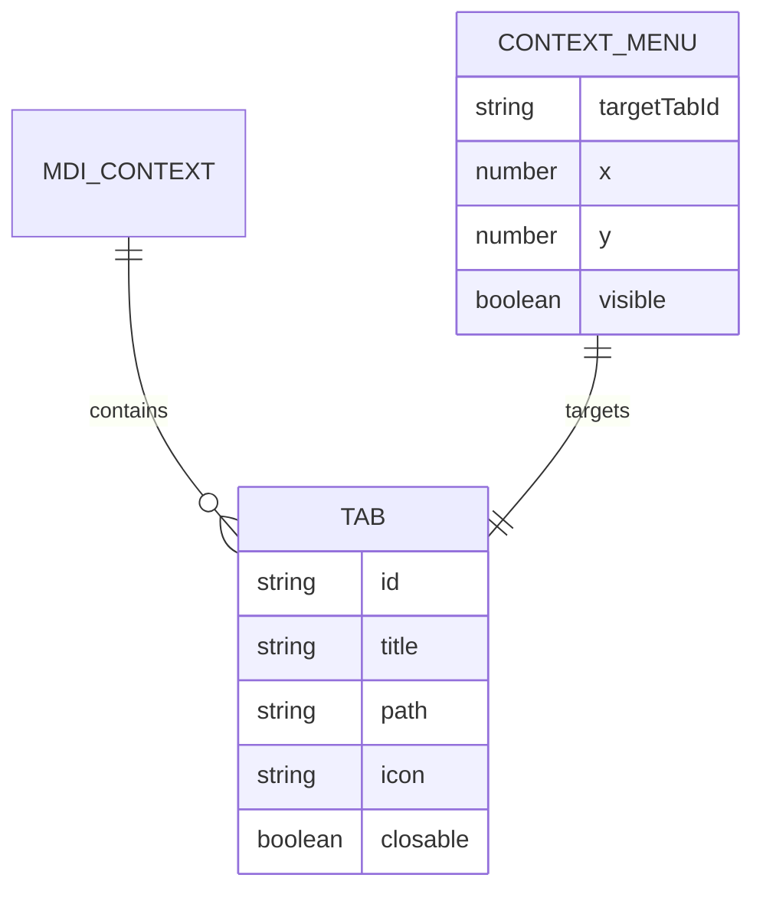

# TSK-02-04 - 탭 컨텍스트 메뉴 설계 문서

## 문서 정보

| 항목 | 내용 |
|------|------|
| Task ID | TSK-02-04 |
| 문서 버전 | 1.0 |
| 작성일 | 2026-01-20 |
| 상태 | 작성중 |
| 카테고리 | development |

---

## 1. 개요

### 1.1 배경 및 문제 정의

**현재 상황:**
- MDI 탭 바 컴포넌트(TSK-02-02)가 구현되어 탭 클릭/닫기 기본 기능 제공
- 사용자가 여러 탭을 열어 작업할 때 개별 탭 닫기만 가능
- 탭 관리를 위한 빠른 접근 방법이 없음

**해결하려는 문제:**
- 여러 탭을 한 번에 정리할 수 없는 불편함
- 탭 새로고침을 위해 탭을 닫고 다시 열어야 하는 번거로움
- 작업 효율성 저하

### 1.2 목적 및 기대 효과

**목적:**
- 탭 우클릭 컨텍스트 메뉴를 통한 빠른 탭 관리 기능 제공

**기대 효과:**
- 사용자 관점: 여러 탭을 빠르게 정리하고 새로고침 가능
- 비즈니스 관점: 생산성 향상, 데스크톱 애플리케이션 수준의 UX 제공

### 1.3 범위

**포함:**
- 탭 우클릭 시 컨텍스트 메뉴 표시
- 닫기 (현재 탭)
- 다른 탭 모두 닫기
- 오른쪽 탭 모두 닫기
- 새로고침 (현재 탭 컨텐츠 리로드)

**제외:**
- 왼쪽 탭 모두 닫기 (향후 확장)
- 탭 복제 기능 (향후 확장)
- 탭 고정 기능 (향후 확장)

### 1.4 참조 문서

| 문서 | 경로 | 관련 섹션 |
|------|------|----------|
| PRD | `.orchay/projects/mes-portal/prd.md` | 4.1.1 탭 바 (Tab Bar) - 탭 우클릭 컨텍스트 메뉴 |
| TRD | `.orchay/projects/mes-portal/trd.md` | - |

---

## 2. 사용자 분석

### 2.1 대상 사용자

| 사용자 유형 | 특성 | 주요 니즈 |
|------------|------|----------|
| MES 포털 사용자 | 여러 화면을 동시에 열어 작업하는 사용자 | 탭을 빠르게 정리하고 관리하고 싶음 |
| 생산 담당자 | 작업 지시, 실적 입력 등 다중 화면 사용 | 불필요한 탭 일괄 정리 |
| 관리자 | 대시보드, 리포트 등 다양한 화면 확인 | 화면 새로고침으로 최신 데이터 확인 |

### 2.2 사용자 페르소나

**페르소나 1: 김생산 (생산 담당자)**
- 역할: 생산라인 담당자
- 목표: 작업 지시 확인, 실적 입력을 빠르게 처리
- 불만: 작업 완료 후 열린 탭들을 하나씩 닫아야 함
- 시나리오: 작업 완료 후 현재 탭을 제외한 모든 탭을 한 번에 닫고 싶음

---

## 3. 유즈케이스

### 3.1 유즈케이스 다이어그램



### 3.2 유즈케이스 상세

#### UC-01: 현재 탭 닫기

| 항목 | 내용 |
|------|------|
| 액터 | MES 포털 사용자 |
| 목적 | 현재 탭을 컨텍스트 메뉴로 닫기 |
| 사전 조건 | 탭이 1개 이상 열려 있음 |
| 사후 조건 | 해당 탭이 닫히고 인접 탭이 활성화됨 |
| 트리거 | 탭 우클릭 → "닫기" 선택 |

**기본 흐름:**
1. 사용자가 탭을 우클릭한다
2. 컨텍스트 메뉴가 표시된다
3. 사용자가 "닫기"를 클릭한다
4. 해당 탭이 닫힌다
5. 인접한 탭이 활성화된다

**예외 흐름:**
- 3a. closable이 false인 탭인 경우:
  - "닫기" 메뉴 비활성화 또는 숨김

#### UC-02: 다른 탭 모두 닫기

| 항목 | 내용 |
|------|------|
| 액터 | MES 포털 사용자 |
| 목적 | 현재 탭을 제외한 모든 탭 닫기 |
| 사전 조건 | 탭이 2개 이상 열려 있음 |
| 사후 조건 | 현재 탭만 남고 나머지 탭 모두 닫힘 |
| 트리거 | 탭 우클릭 → "다른 탭 모두 닫기" 선택 |

**기본 흐름:**
1. 사용자가 탭을 우클릭한다
2. 컨텍스트 메뉴가 표시된다
3. 사용자가 "다른 탭 모두 닫기"를 클릭한다
4. 현재 탭을 제외한 모든 closable 탭이 닫힌다
5. 현재 탭이 활성 상태를 유지한다

**예외 흐름:**
- 3a. 다른 탭이 없거나 모두 closable=false인 경우:
  - 메뉴 비활성화

#### UC-03: 오른쪽 탭 모두 닫기

| 항목 | 내용 |
|------|------|
| 액터 | MES 포털 사용자 |
| 목적 | 현재 탭 오른쪽에 있는 모든 탭 닫기 |
| 사전 조건 | 현재 탭 오른쪽에 탭이 1개 이상 있음 |
| 사후 조건 | 현재 탭 오른쪽의 모든 탭이 닫힘 |
| 트리거 | 탭 우클릭 → "오른쪽 탭 모두 닫기" 선택 |

**기본 흐름:**
1. 사용자가 탭을 우클릭한다
2. 컨텍스트 메뉴가 표시된다
3. 사용자가 "오른쪽 탭 모두 닫기"를 클릭한다
4. 현재 탭 오른쪽의 모든 closable 탭이 닫힌다
5. 현재 탭이 활성 상태를 유지한다

**예외 흐름:**
- 3a. 오른쪽에 탭이 없거나 모두 closable=false인 경우:
  - 메뉴 비활성화

#### UC-04: 현재 탭 새로고침

| 항목 | 내용 |
|------|------|
| 액터 | MES 포털 사용자 |
| 목적 | 현재 탭의 화면 컨텐츠 리로드 |
| 사전 조건 | 탭이 열려 있음 |
| 사후 조건 | 탭 화면이 리로드됨 |
| 트리거 | 탭 우클릭 → "새로고침" 선택 |

**기본 흐름:**
1. 사용자가 탭을 우클릭한다
2. 컨텍스트 메뉴가 표시된다
3. 사용자가 "새로고침"을 클릭한다
4. 해당 탭의 화면이 리로드된다
5. 화면이 초기 상태로 다시 렌더링된다

---

## 4. 사용자 시나리오

### 4.1 시나리오 1: 작업 완료 후 탭 정리

**상황 설명:**
김생산 담당자가 여러 작업 지시 화면을 열어 작업을 완료한 후, 현재 보고 있는 대시보드를 제외한 모든 탭을 정리하고 싶다.

**단계별 진행:**

| 단계 | 사용자 행동 | 시스템 반응 | 사용자 기대 |
|------|-----------|------------|------------|
| 1 | 대시보드 탭 우클릭 | 컨텍스트 메뉴 표시 | 탭 관리 옵션이 보임 |
| 2 | "다른 탭 모두 닫기" 클릭 | 다른 탭들이 닫힘 | 대시보드만 남음 |
| 3 | 정리된 화면 확인 | 대시보드만 표시됨 | 깔끔한 화면 |

**성공 조건:**
- 대시보드 탭만 남고 모든 작업 지시 탭이 닫힘

### 4.2 시나리오 2: 데이터 새로고침

**상황 설명:**
관리자가 대시보드에서 실시간 생산 현황을 확인하다가, 최신 데이터를 다시 불러오고 싶다.

**단계별 진행:**

| 단계 | 사용자 행동 | 시스템 반응 | 복구 방법 |
|------|-----------|------------|----------|
| 1 | 대시보드 탭 우클릭 | 컨텍스트 메뉴 표시 | - |
| 2 | "새로고침" 클릭 | 화면 리로드 시작 | - |
| 3 | 로딩 완료 대기 | 최신 데이터 표시 | - |

---

## 5. 화면 설계

### 5.1 화면 흐름도



### 5.2 화면별 상세

#### 화면 1: 탭 컨텍스트 메뉴

**화면 목적:**
탭 관리를 위한 빠른 액션 메뉴 제공

**진입 경로:**
- 탭 바에서 특정 탭을 우클릭

**와이어프레임:**
```
┌───────────────────────────────────────────────────────────────────────┐
│  [작업지시] × [대시보드] × [생산실적] × [품질검사] ×                    │
│                  ↑                                                     │
│          우클릭 지점                                                   │
│          ┌─────────────────────┐                                      │
│          │ 닫기              ✕ │                                      │
│          ├─────────────────────┤                                      │
│          │ 다른 탭 모두 닫기    │                                      │
│          │ 오른쪽 탭 모두 닫기  │                                      │
│          ├─────────────────────┤                                      │
│          │ 새로고침          ↻ │                                      │
│          └─────────────────────┘                                      │
│                                                                        │
└───────────────────────────────────────────────────────────────────────┘
```

**화면 요소 설명:**

| 영역 | 설명 | 사용자 인터랙션 |
|------|------|----------------|
| 닫기 | 현재 탭 닫기 | 클릭 시 탭 닫힘 |
| 다른 탭 모두 닫기 | 현재 탭 제외 모두 닫기 | 클릭 시 다른 탭 모두 닫힘 |
| 오른쪽 탭 모두 닫기 | 현재 탭 오른쪽 모두 닫기 | 클릭 시 오른쪽 탭 모두 닫힘 |
| 새로고침 | 현재 탭 컨텐츠 리로드 | 클릭 시 화면 새로고침 |

**사용자 행동 시나리오:**
1. 사용자가 탭을 우클릭하면 컨텍스트 메뉴가 마우스 위치에 표시된다
2. 메뉴 항목을 클릭하면 해당 액션이 수행된다
3. 메뉴 외부를 클릭하거나 Esc를 누르면 메뉴가 닫힌다

### 5.3 컨텍스트 메뉴 상태별 표시

| 상황 | 닫기 | 다른 탭 모두 닫기 | 오른쪽 탭 모두 닫기 | 새로고침 |
|------|------|----------------|------------------|---------|
| 일반 탭 | 활성 | 활성 | 활성 | 활성 |
| closable=false 탭 | 비활성 | 활성 | 활성 | 활성 |
| 탭 1개만 있음 | 활성 | 비활성 | 비활성 | 활성 |
| 가장 오른쪽 탭 | 활성 | 활성 | 비활성 | 활성 |

---

## 6. 인터랙션 설계

### 6.1 사용자 액션과 피드백

| 사용자 액션 | 즉각 피드백 | 결과 피드백 | 에러 피드백 |
|------------|-----------|------------|------------|
| 탭 우클릭 | 컨텍스트 메뉴 표시 | - | - |
| 메뉴 항목 호버 | 배경색 하이라이트 | - | - |
| 닫기 클릭 | 메뉴 닫힘 | 탭 닫힘 | - |
| 다른 탭 모두 닫기 클릭 | 메뉴 닫힘 | 탭들 닫힘 | - |
| 새로고침 클릭 | 메뉴 닫힘 + 로딩 표시 | 화면 갱신 완료 | - |

### 6.2 상태별 화면 변화

| 상태 | 화면 표시 | 사용자 안내 |
|------|----------|------------|
| 메뉴 표시 | 드롭다운 메뉴 | 마우스 위치에 메뉴 표시 |
| 항목 비활성 | 회색 텍스트, 클릭 불가 | 해당 액션 불가 상태임을 시각적 표시 |
| 새로고침 중 | 탭 아이콘 스피너 | 로딩 중임을 표시 |

### 6.3 키보드/접근성

| 기능 | 키보드 단축키 | 스크린 리더 안내 |
|------|-------------|-----------------|
| 메뉴 닫기 | Esc | "메뉴 닫힘" |
| 메뉴 항목 탐색 | 위/아래 화살표 | "{메뉴 항목명}" |
| 메뉴 항목 선택 | Enter | "{액션} 실행" |

---

## 7. 데이터 요구사항

### 7.1 필요한 데이터

| 데이터 | 설명 | 출처 | 용도 |
|--------|------|------|------|
| tabs | 현재 열린 탭 목록 | MDI Context | 메뉴 상태 결정 |
| activeTabId | 현재 활성 탭 ID | MDI Context | 액션 대상 결정 |
| targetTabId | 우클릭한 탭 ID | 이벤트 | 컨텍스트 메뉴 대상 |
| tabIndex | 탭 순서 | MDI Context | 오른쪽 탭 판단 |

### 7.2 데이터 관계



### 7.3 데이터 유효성 규칙

| 데이터 필드 | 규칙 | 위반 시 동작 |
|------------|------|-------------|
| targetTabId | tabs에 존재해야 함 | 메뉴 표시 안 함 |
| closable | boolean | false면 닫기 비활성화 |

---

## 8. 비즈니스 규칙

### 8.1 핵심 규칙

| 규칙 ID | 규칙 설명 | 적용 상황 | 예외 |
|---------|----------|----------|------|
| BR-01 | closable=false인 탭은 닫을 수 없음 | 모든 닫기 액션 | 없음 |
| BR-02 | 현재 탭이 닫히면 인접 탭 활성화 | 닫기 액션 | 마지막 탭이면 이전 탭 |
| BR-03 | 새로고침은 화면 컴포넌트를 리마운트 | 새로고침 액션 | 없음 |

### 8.2 규칙 상세 설명

**BR-01: closable 속성 준수**

설명: MDI 시스템에서 일부 탭(예: 홈, 대시보드)은 닫을 수 없도록 설정될 수 있다. 컨텍스트 메뉴의 모든 닫기 관련 액션은 이 속성을 준수해야 한다.

예시:
- 홈 탭(closable=false) 우클릭 시: "닫기" 메뉴 비활성화
- "다른 탭 모두 닫기" 시: closable=false인 탭은 남김

**BR-02: 탭 닫힘 후 활성화 규칙**

설명: 현재 활성화된 탭이 닫히면 인접한 탭을 활성화해야 한다.

예시:
- 탭 순서 [A, B(활성), C] → B 닫힘 → C 활성화
- 탭 순서 [A, B(활성)] → B 닫힘 → A 활성화
- 탭 순서 [A(활성)] → A 닫힘 → 탭 없음 상태

**BR-03: 새로고침 구현 방식**

설명: 탭 새로고침은 화면 컴포넌트를 완전히 리마운트하여 초기 상태로 되돌린다.

예시:
- 폼에 입력된 값은 초기화됨
- 테이블 검색 조건은 리셋됨
- API 데이터는 다시 fetch됨

---

## 9. 에러 처리

### 9.1 예상 에러 상황

| 상황 | 원인 | 사용자 메시지 | 복구 방법 |
|------|------|--------------|----------|
| 탭을 찾을 수 없음 | 동시성 이슈로 탭이 이미 닫힘 | 표시 안 함 | 메뉴 자동 닫힘 |

### 9.2 에러 표시 방식

| 에러 유형 | 표시 위치 | 표시 방법 |
|----------|----------|----------|
| 탭 없음 | - | 조용히 무시 (메뉴 닫힘) |

---

## 10. 연관 문서

> 상세 테스트 명세 및 요구사항 추적은 별도 문서에서 관리합니다.

| 문서 | 경로 | 용도 |
|------|------|------|
| 요구사항 추적 매트릭스 | `025-traceability-matrix.md` | PRD → 설계 → 테스트 양방향 추적 |
| 테스트 명세서 | `026-test-specification.md` | 단위/E2E/매뉴얼 테스트 상세 정의 |

---

## 11. 구현 범위

### 11.1 영향받는 영역

| 영역 | 변경 내용 | 영향도 |
|------|----------|--------|
| components/mdi/TabContextMenu.tsx | 신규 생성 | 높음 |
| components/mdi/TabBar.tsx | 컨텍스트 메뉴 연동 | 중간 |
| lib/mdi/context.tsx | closeOtherTabs, closeRightTabs, refreshTab 함수 추가 | 중간 |

### 11.2 의존성

| 의존 항목 | 이유 | 상태 |
|----------|------|------|
| TSK-02-01 (MDI 상태 관리) | MDI Context 필요 | 대기 |
| TSK-02-02 (탭 바 컴포넌트) | 컨텍스트 메뉴 부착 대상 | 대기 |

### 11.3 제약 사항

| 제약 | 설명 | 대응 방안 |
|------|------|----------|
| Ant Design 버전 | Dropdown contextMenu trigger 지원 필요 | Ant Design 6.x 사용 |

---

## 12. 컴포넌트 설계

### 12.1 TabContextMenu 컴포넌트

```tsx
interface TabContextMenuProps {
  tabId: string;
  children: React.ReactNode;
}

// 사용 예시
<TabContextMenu tabId={tab.id}>
  <TabItem {...tab} />
</TabContextMenu>
```

### 12.2 MDI Context 확장

```tsx
interface MDIContextValue {
  // 기존...
  tabs: Tab[];
  activeTabId: string;
  openTab: (tab: Tab) => void;
  closeTab: (tabId: string) => void;
  setActiveTab: (tabId: string) => void;

  // 신규 추가
  closeOtherTabs: (tabId: string) => void;
  closeRightTabs: (tabId: string) => void;
  refreshTab: (tabId: string) => void;
}
```

### 12.3 메뉴 항목 정의

```tsx
const menuItems = [
  { key: 'close', label: '닫기', icon: <CloseOutlined /> },
  { type: 'divider' },
  { key: 'closeOthers', label: '다른 탭 모두 닫기' },
  { key: 'closeRight', label: '오른쪽 탭 모두 닫기' },
  { type: 'divider' },
  { key: 'refresh', label: '새로고침', icon: <ReloadOutlined /> },
];
```

---

## 13. 체크리스트

### 13.1 설계 완료 확인

- [x] 문제 정의 및 목적 명확화
- [x] 사용자 분석 완료
- [x] 유즈케이스 정의 완료
- [x] 사용자 시나리오 작성 완료
- [x] 화면 설계 완료 (와이어프레임)
- [x] 인터랙션 설계 완료
- [x] 데이터 요구사항 정의 완료
- [x] 비즈니스 규칙 정의 완료
- [x] 에러 처리 정의 완료

### 13.2 연관 문서 작성

- [ ] 요구사항 추적 매트릭스 작성 (→ `025-traceability-matrix.md`)
- [ ] 테스트 명세서 작성 (→ `026-test-specification.md`)

### 13.3 구현 준비

- [x] 구현 우선순위 결정
- [x] 의존성 확인 완료
- [x] 제약 사항 검토 완료

---

## 변경 이력

| 버전 | 일자 | 작성자 | 변경 내용 |
|------|------|--------|----------|
| 1.0 | 2026-01-20 | Claude | 최초 작성 |
