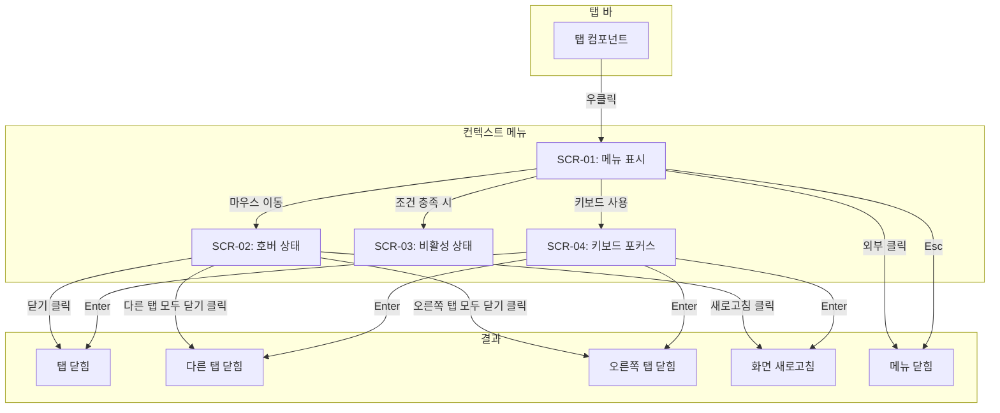
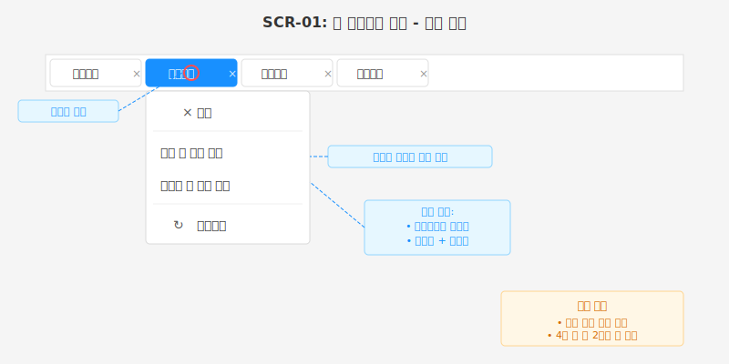
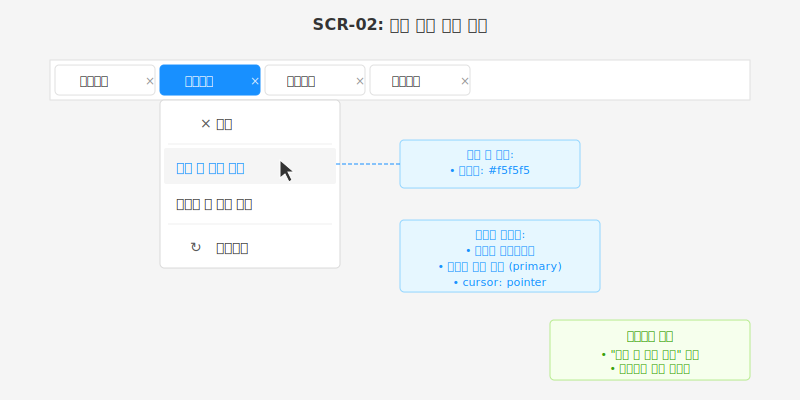
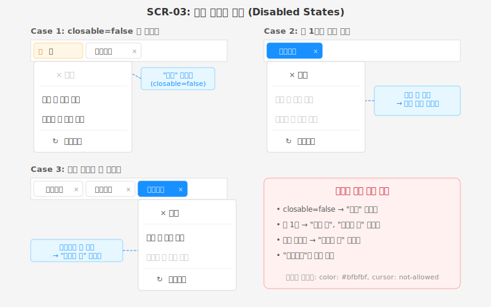
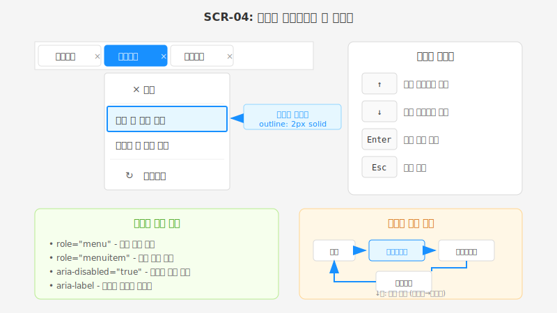

# TSK-02-04 - 탭 컨텍스트 메뉴 UI 설계서

## 문서 정보

| 항목 | 내용 |
|------|------|
| Task ID | TSK-02-04 |
| 문서 버전 | 1.0 |
| 작성일 | 2026-01-20 |
| 상태 | 작성완료 |
| 관련 설계 문서 | `010-design.md` |

---

## 1. 화면 목록

| 화면 ID | 화면명 | 설명 | 진입 경로 |
|---------|--------|------|----------|
| SCR-01 | 컨텍스트 메뉴 기본 | 탭 우클릭 시 표시되는 기본 메뉴 | 탭 바 → 탭 우클릭 |
| SCR-02 | 메뉴 항목 호버 | 메뉴 항목에 마우스 오버 시 상태 | SCR-01 → 마우스 호버 |
| SCR-03 | 비활성 상태 | 조건에 따른 메뉴 비활성 상태 | SCR-01 (조건부) |
| SCR-04 | 키보드 네비게이션 | 키보드로 메뉴 탐색 시 포커스 상태 | SCR-01 → 키보드 입력 |

---

## 2. 화면 전환 흐름



---

## 3. 화면별 상세

### 3.1 SCR-01: 컨텍스트 메뉴 기본 상태

#### 와이어프레임



#### 화면 목적

탭을 우클릭했을 때 해당 탭에 대해 수행할 수 있는 액션 메뉴를 제공합니다.

#### 레이아웃 구성

| 영역 | 설명 | 크기 |
|------|------|------|
| 메뉴 컨테이너 | 드롭다운 메뉴 전체 영역 | width: 180px, auto height |
| 메뉴 항목 | 개별 액션 버튼 | height: 36px |
| 구분선 | 항목 그룹 구분 | height: 1px |

#### 컴포넌트 목록

| 컴포넌트 | 타입 | 설명 |
|----------|------|------|
| 메뉴 컨테이너 | `Dropdown.Menu` | Ant Design Dropdown 메뉴 |
| 닫기 | `Menu.Item` | 현재 탭 닫기 액션 |
| 다른 탭 모두 닫기 | `Menu.Item` | 다른 탭 일괄 닫기 액션 |
| 오른쪽 탭 모두 닫기 | `Menu.Item` | 오른쪽 탭 일괄 닫기 액션 |
| 새로고침 | `Menu.Item` | 탭 컨텐츠 리로드 액션 |
| 구분선 | `Menu.Divider` | 그룹 구분 |

#### 상태 정의

| 상태 | 조건 | 화면 표시 |
|------|------|----------|
| 표시 | 탭 우클릭 이벤트 발생 | 마우스 위치에 메뉴 표시 |
| 숨김 | 외부 클릭 / Esc / 액션 실행 | 메뉴 사라짐 |

#### 액션 정의

| 액션 | 트리거 | 결과 |
|------|--------|------|
| 메뉴 표시 | 탭 `onContextMenu` | 메뉴 visible=true |
| 닫기 실행 | "닫기" 클릭 | `closeTab(tabId)` 호출 |
| 다른 탭 닫기 실행 | "다른 탭 모두 닫기" 클릭 | `closeOtherTabs(tabId)` 호출 |
| 오른쪽 탭 닫기 실행 | "오른쪽 탭 모두 닫기" 클릭 | `closeRightTabs(tabId)` 호출 |
| 새로고침 실행 | "새로고침" 클릭 | `refreshTab(tabId)` 호출 |
| 메뉴 닫기 | 외부 클릭 / Esc | 메뉴 visible=false |

---

### 3.2 SCR-02: 메뉴 항목 호버 상태

#### 와이어프레임



#### 화면 목적

사용자가 메뉴 항목 위에 마우스를 올렸을 때 시각적 피드백을 제공하여 선택 가능한 항목임을 인지시킵니다.

#### 스타일 변화

| 요소 | 기본 상태 | 호버 상태 |
|------|----------|----------|
| 배경색 | `transparent` | `#f5f5f5` |
| 텍스트 색상 | `#333333` | `#1890ff` (primary) |
| 커서 | `default` | `pointer` |
| 전환 효과 | - | `transition: all 0.2s` |

#### 접근성 고려사항

- 호버 시 충분한 색상 대비 유지 (WCAG 2.1 AA 기준)
- 포커스 상태와 호버 상태 동일하게 적용 (키보드 사용자 배려)

---

### 3.3 SCR-03: 비활성 상태 (Disabled States)

#### 와이어프레임



#### 화면 목적

특정 조건에서 실행할 수 없는 메뉴 항목을 비활성화하여 사용자 혼란을 방지합니다.

#### 비활성 조건

| 메뉴 항목 | 비활성 조건 | 이유 |
|----------|------------|------|
| 닫기 | `tab.closable === false` | 닫을 수 없는 탭 (홈 등) |
| 다른 탭 모두 닫기 | `tabs.length === 1` 또는 모든 다른 탭이 `closable=false` | 닫을 다른 탭 없음 |
| 오른쪽 탭 모두 닫기 | 현재 탭이 마지막 탭 또는 오른쪽 탭이 모두 `closable=false` | 닫을 오른쪽 탭 없음 |
| 새로고침 | 없음 (항상 활성) | 모든 탭 새로고침 가능 |

#### 비활성 스타일

| 요소 | 활성 상태 | 비활성 상태 |
|------|----------|------------|
| 텍스트 색상 | `#333333` | `#bfbfbf` |
| 아이콘 색상 | `#595959` | `#bfbfbf` |
| 커서 | `pointer` | `not-allowed` |
| 호버 효과 | 적용 | 미적용 |
| 클릭 | 이벤트 발생 | 이벤트 무시 |

---

### 3.4 SCR-04: 키보드 네비게이션

#### 와이어프레임



#### 화면 목적

키보드만으로 컨텍스트 메뉴를 탐색하고 실행할 수 있도록 접근성을 보장합니다.

#### 키보드 컨트롤

| 키 | 동작 | 스크린 리더 안내 |
|----|------|-----------------|
| `↑` (Up Arrow) | 이전 메뉴 항목으로 포커스 이동 | "{항목명}" |
| `↓` (Down Arrow) | 다음 메뉴 항목으로 포커스 이동 | "{항목명}" |
| `Enter` | 포커스된 메뉴 항목 실행 | "{항목명} 실행됨" |
| `Esc` | 메뉴 닫기 | "메뉴 닫힘" |
| `Tab` | 메뉴 닫기 (포커스 이탈) | "메뉴 닫힘" |

#### 포커스 스타일

| 요소 | 포커스 스타일 |
|------|-------------|
| 메뉴 항목 | `outline: 2px solid #1890ff; background: #e6f7ff;` |
| 포커스 순환 | 마지막 항목에서 ↓ → 첫 항목으로 순환 |
| 비활성 항목 | 포커스 이동 시 건너뜀 |

#### ARIA 속성

```tsx
// 메뉴 컨테이너
<div role="menu" aria-label="탭 컨텍스트 메뉴">

// 메뉴 항목
<div
  role="menuitem"
  aria-disabled={isDisabled}
  tabIndex={isFocused ? 0 : -1}
>
  {label}
</div>

// 구분선
<div role="separator" />
```

---

## 4. 디자인 토큰

### 4.1 색상

| 토큰 | 값 | 용도 |
|------|-----|------|
| `--menu-bg` | `#ffffff` | 메뉴 배경 |
| `--menu-border` | `#d9d9d9` | 메뉴 테두리 |
| `--menu-shadow` | `0 2px 8px rgba(0,0,0,0.15)` | 메뉴 그림자 |
| `--menu-item-hover-bg` | `#f5f5f5` | 호버 배경 |
| `--menu-item-focus-bg` | `#e6f7ff` | 포커스 배경 |
| `--menu-item-text` | `#333333` | 기본 텍스트 |
| `--menu-item-text-hover` | `#1890ff` | 호버 텍스트 |
| `--menu-item-text-disabled` | `#bfbfbf` | 비활성 텍스트 |
| `--menu-divider` | `#f0f0f0` | 구분선 |

### 4.2 간격

| 토큰 | 값 | 용도 |
|------|-----|------|
| `--menu-padding` | `4px` | 메뉴 내부 패딩 |
| `--menu-item-padding-x` | `16px` | 항목 좌우 패딩 |
| `--menu-item-padding-y` | `8px` | 항목 상하 패딩 |
| `--menu-item-gap` | `8px` | 아이콘-텍스트 간격 |
| `--menu-border-radius` | `4px` | 메뉴 모서리 둥글기 |

### 4.3 타이포그래피

| 토큰 | 값 | 용도 |
|------|-----|------|
| `--menu-font-family` | `'Segoe UI', sans-serif` | 폰트 |
| `--menu-font-size` | `13px` | 메뉴 항목 텍스트 크기 |
| `--menu-icon-size` | `14px` | 아이콘 크기 |

---

## 5. 반응형 고려사항

### 5.1 데스크톱 (기본)

- 메뉴 너비: 180px 고정
- 마우스 위치 기준 메뉴 표시
- 화면 경계 충돌 시 반대 방향으로 표시

### 5.2 화면 경계 처리

```
메뉴 표시 위치 계산:
- x: min(mouseX, viewportWidth - menuWidth - 8)
- y: min(mouseY, viewportHeight - menuHeight - 8)

화면 오른쪽 경계 초과 시 → 왼쪽으로 표시
화면 하단 경계 초과 시 → 위쪽으로 표시
```

---

## 6. 애니메이션

### 6.1 메뉴 표시/숨김

```css
/* 표시 */
@keyframes menuFadeIn {
  from {
    opacity: 0;
    transform: scale(0.95);
  }
  to {
    opacity: 1;
    transform: scale(1);
  }
}

/* 숨김 */
@keyframes menuFadeOut {
  from {
    opacity: 1;
    transform: scale(1);
  }
  to {
    opacity: 0;
    transform: scale(0.95);
  }
}

.menu-enter {
  animation: menuFadeIn 0.15s ease-out;
}

.menu-exit {
  animation: menuFadeOut 0.1s ease-in;
}
```

### 6.2 항목 호버

```css
.menu-item {
  transition: background-color 0.2s, color 0.2s;
}
```

---

## 7. 체크리스트

### 7.1 디자인 완료 확인

- [x] 화면 목록 정의
- [x] 화면 전환 흐름 다이어그램
- [x] 각 화면별 와이어프레임 (SVG)
- [x] 컴포넌트 목록 및 상태 정의
- [x] 디자인 토큰 정의

### 7.2 접근성 확인

- [x] 키보드 네비게이션 지원
- [x] ARIA 속성 정의
- [x] 색상 대비 확인 (WCAG 2.1 AA)
- [x] 포커스 표시 스타일

### 7.3 UI 에셋

- [x] `ui-assets/SCR-01-context-menu-default.svg`
- [x] `ui-assets/SCR-02-menu-item-hover.svg`
- [x] `ui-assets/SCR-03-disabled-states.svg`
- [x] `ui-assets/SCR-04-keyboard-navigation.svg`

---

## 변경 이력

| 버전 | 일자 | 작성자 | 변경 내용 |
|------|------|--------|----------|
| 1.0 | 2026-01-20 | Claude | 최초 작성 |
