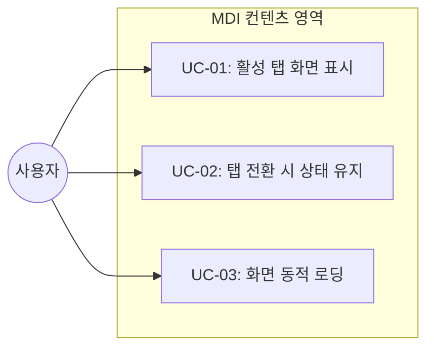
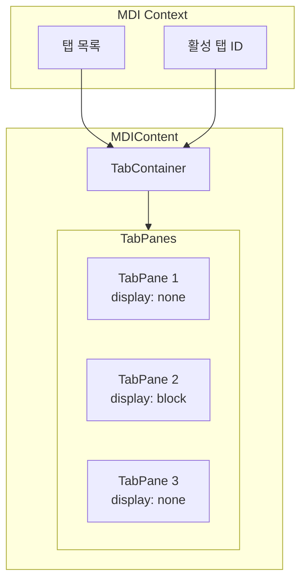
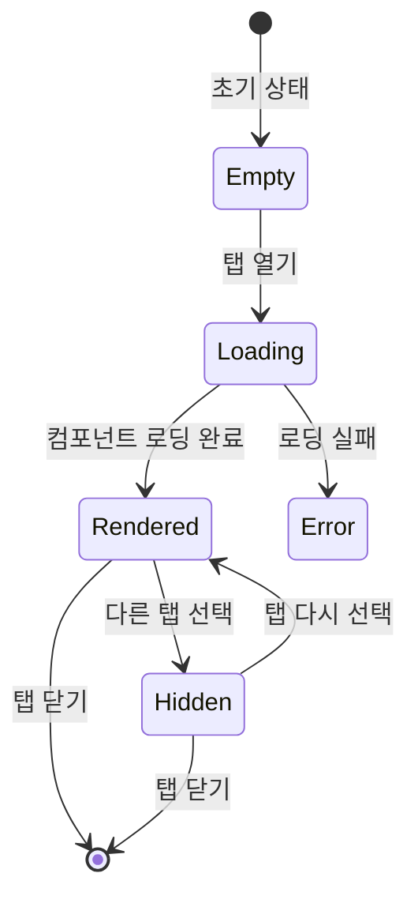
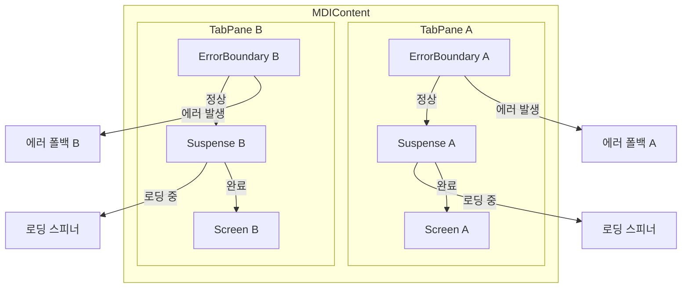

# TSK-02-05 - MDI 컨텐츠 영역 설계 문서

## 문서 정보

| 항목 | 내용 |
|------|------|
| Task ID | TSK-02-05 |
| 문서 버전 | 1.0 |
| 작성일 | 2026-01-20 |
| 상태 | 작성중 |
| 카테고리 | development |

---

## 1. 개요

### 1.1 배경 및 문제 정의

**현재 상황:**
- MDI 상태 관리(TSK-02-01)와 탭 바 컴포넌트(TSK-02-02)가 구현 대기 중
- 탭 바에서 선택된 화면을 실제로 표시할 컨텐츠 영역이 필요
- 탭 전환 시 이전 화면 상태를 유지하는 메커니즘 필요

**해결하려는 문제:**
- 활성화된 탭의 화면 컴포넌트를 동적으로 로딩하고 렌더링
- 비활성 탭의 화면 상태를 유지하여 데이터 손실 방지
- 코드 스플리팅을 통한 초기 로딩 성능 최적화

### 1.2 목적 및 기대 효과

**목적:**
- MDI 탭 시스템에서 활성 탭의 화면을 렌더링하는 컨텐츠 영역 컴포넌트 구현
- 동적 컴포넌트 로딩을 통한 효율적인 화면 관리

**기대 효과:**
- 탭 전환 시 빠른 화면 전환 (상태 유지로 재로딩 불필요)
- React.lazy를 통한 코드 스플리팅으로 초기 번들 크기 최적화
- 사용자가 작업 중인 데이터 손실 방지

### 1.3 범위

**포함:**
- MDIContent 컴포넌트 생성
- 활성 탭 화면 렌더링
- 비활성 탭 화면 상태 유지 (display: none)
- 동적 컴포넌트 로딩 (React.lazy + Suspense)
- 화면 경로 → 컴포넌트 매핑 시스템

**제외:**
- MDI 상태 관리 (TSK-02-01에서 구현)
- 탭 바 UI (TSK-02-02에서 구현)
- 탭 드래그 앤 드롭 (TSK-02-03에서 구현)
- 탭 컨텍스트 메뉴 (TSK-02-04에서 구현)
- 개별 화면 컴포넌트 구현 (각 화면 Task에서 구현)

### 1.4 참조 문서

| 문서 | 경로 | 관련 섹션 |
|------|------|----------|
| PRD | `.orchay/projects/mes-portal/prd.md` | 4.1.1 컨텐츠 영역 (Content Area) |
| TRD | `.orchay/projects/mes-portal/trd.md` | 1.1 코어 스택, 5. 프로젝트 구조 |

---

## 2. 사용자 분석

### 2.1 대상 사용자

| 사용자 유형 | 특성 | 주요 니즈 |
|------------|------|----------|
| 공장장/관리자 | 다중 화면 동시 작업, 데스크톱 주 사용 | 여러 화면을 열어두고 빠르게 전환하며 데이터 비교 |
| 생산 담당자 | 작업 지시/실적 입력, 빈번한 화면 전환 | 폼 입력 중 탭 전환해도 데이터 유지 |
| 품질/설비 담당자 | 모니터링 화면 상시 확인 | 실시간 데이터 갱신 상태 유지 |

### 2.2 사용자 페르소나

**페르소나 1: 생산관리 팀장**
- 역할: 생산 현황 모니터링 및 의사결정
- 목표: 대시보드를 보면서 동시에 라인별 상세 현황 비교
- 불만: 화면 전환 시 이전 화면의 필터/정렬 설정이 초기화됨
- 시나리오: 대시보드 탭과 생산실적 탭을 번갈아 확인하며 데이터 비교

**페르소나 2: 생산 담당자**
- 역할: 작업 지시 확인 및 생산 실적 입력
- 목표: 작업 지시 화면을 참고하면서 실적 입력
- 불만: 실적 입력 중 작업 지시 확인하러 갔다 오면 입력 내용이 사라짐
- 시나리오: 실적 입력 폼 작성 중 작업 지시 탭으로 이동했다가 다시 돌아옴

---

## 3. 유즈케이스

### 3.1 유즈케이스 다이어그램



### 3.2 유즈케이스 상세

#### UC-01: 활성 탭 화면 표시

| 항목 | 내용 |
|------|------|
| 액터 | 모든 사용자 |
| 목적 | 현재 선택된 탭의 화면 내용 표시 |
| 사전 조건 | 최소 1개 이상의 탭이 열려 있음 |
| 사후 조건 | 활성 탭의 화면 컴포넌트가 표시됨 |
| 트리거 | 탭 선택 또는 새 탭 열기 |

**기본 흐름:**
1. 사용자가 탭을 클릭하거나 메뉴를 선택하여 새 탭을 연다
2. 시스템이 MDI Context에서 활성 탭 정보를 가져온다
3. 시스템이 탭의 path에 해당하는 화면 컴포넌트를 찾는다
4. 시스템이 해당 컴포넌트를 컨텐츠 영역에 렌더링한다
5. 사용자에게 활성 탭의 화면이 표시된다

**예외 흐름:**
- 3a. 화면 컴포넌트를 찾을 수 없는 경우:
  - 시스템이 404 Not Found 화면을 표시한다
  - 사용자에게 "화면을 찾을 수 없습니다" 메시지 표시

#### UC-02: 탭 전환 시 상태 유지

| 항목 | 내용 |
|------|------|
| 액터 | 모든 사용자 |
| 목적 | 비활성 탭의 화면 상태 유지 |
| 사전 조건 | 2개 이상의 탭이 열려 있음 |
| 사후 조건 | 이전 탭의 화면 상태가 보존됨 |
| 트리거 | 다른 탭 선택 |

**기본 흐름:**
1. 사용자가 현재 탭(A)에서 작업 중 (폼 입력, 필터 설정 등)
2. 사용자가 다른 탭(B)을 클릭한다
3. 시스템이 탭 A의 화면을 display: none으로 숨긴다 (unmount 하지 않음)
4. 시스템이 탭 B의 화면을 display: block으로 표시한다
5. 사용자가 다시 탭 A를 클릭하면 이전 상태가 그대로 유지됨

**성공 조건:**
- 폼 입력 값 유지
- 스크롤 위치 유지
- 필터/정렬 상태 유지
- 선택된 행 유지

#### UC-03: 화면 동적 로딩

| 항목 | 내용 |
|------|------|
| 액터 | 시스템 |
| 목적 | 필요한 화면만 동적으로 로딩하여 성능 최적화 |
| 사전 조건 | 새 탭 열기 요청 |
| 사후 조건 | 화면 컴포넌트가 로딩되어 렌더링됨 |
| 트리거 | 처음 열리는 화면 탭 |

**기본 흐름:**
1. 사용자가 처음 접근하는 화면의 탭을 연다
2. 시스템이 해당 화면 컴포넌트를 동적 import 한다
3. 로딩 중 Suspense fallback (로딩 스피너) 표시
4. 컴포넌트 로딩 완료 후 화면 렌더링
5. 이후 같은 화면 접근 시 캐시된 컴포넌트 사용

---

## 4. 사용자 시나리오

### 4.1 시나리오 1: 다중 화면 작업

**상황 설명:**
생산관리 팀장이 대시보드와 생산실적 화면을 번갈아 보며 데이터를 비교하는 상황

**단계별 진행:**

| 단계 | 사용자 행동 | 시스템 반응 | 사용자 기대 |
|------|-----------|------------|------------|
| 1 | 대시보드 메뉴 클릭 | 대시보드 탭 열림, 화면 표시 | 대시보드 KPI 확인 |
| 2 | 생산실적 메뉴 클릭 | 새 탭 열림, 생산실적 화면 로딩 | 생산실적 목록 확인 |
| 3 | 생산실적 필터 설정 (라인 A) | 필터 적용, 데이터 재조회 | 라인 A 실적만 표시 |
| 4 | 대시보드 탭 클릭 | 대시보드 화면 표시, 생산실적 숨김 | 대시보드 확인 |
| 5 | 생산실적 탭 클릭 | 생산실적 화면 표시 (필터 유지) | 라인 A 필터 그대로 적용 |

**성공 조건:**
- 탭 전환이 빠름 (재로딩 없음)
- 필터 설정 유지됨
- 스크롤 위치 유지됨

### 4.2 시나리오 2: 폼 입력 중 탭 전환

**상황 설명:**
생산 담당자가 실적 입력 폼을 작성하다가 작업 지시를 확인하고 돌아오는 상황

**단계별 진행:**

| 단계 | 사용자 행동 | 시스템 반응 | 사용자 기대 |
|------|-----------|------------|------------|
| 1 | 실적 입력 폼에서 3개 필드 입력 | 폼 상태 업데이트 | 입력 값 표시 |
| 2 | 작업 지시 탭 클릭 | 작업 지시 화면 표시, 실적 입력 숨김 | 작업 지시 내용 확인 |
| 3 | 작업 지시 내용 확인 | 화면 표시 | 필요한 정보 획득 |
| 4 | 실적 입력 탭 클릭 | 실적 입력 화면 표시 (입력 값 유지) | 이전 입력 내용 그대로 |
| 5 | 나머지 필드 입력 후 저장 | 폼 제출, 성공 메시지 | 실적 등록 완료 |

**성공 조건:**
- 폼 입력 값 손실 없음
- 폼 유효성 상태 유지
- 포커스 위치는 초기화 가능 (허용)

### 4.3 시나리오 3: 화면 처음 로딩

**상황 설명:**
사용자가 처음 접근하는 화면을 열 때 동적 로딩이 발생하는 상황

**단계별 진행:**

| 단계 | 사용자 행동 | 시스템 반응 | 사용자 기대 |
|------|-----------|------------|------------|
| 1 | 설비현황 메뉴 클릭 (처음) | 새 탭 열림, 로딩 스피너 표시 | 잠시 대기 |
| 2 | 대기 | 컴포넌트 동적 import 진행 | 로딩 중 표시 |
| 3 | 로딩 완료 | 설비현황 화면 렌더링 | 화면 표시 |
| 4 | 탭 닫고 다시 메뉴 클릭 | 즉시 화면 표시 (캐시 사용) | 빠른 로딩 |

---

## 5. 화면 설계

### 5.1 화면 흐름도



### 5.2 화면별 상세

#### 화면 1: MDI 컨텐츠 영역

**화면 목적:**
MDI 탭 시스템에서 각 탭의 화면 컴포넌트를 렌더링하고 관리하는 컨테이너

**진입 경로:**
- 포털 레이아웃의 컨텐츠 영역에 항상 표시
- 탭 바 아래에 위치

**와이어프레임:**
```
┌─────────────────────────────────────────────────────────────────┐
│  ┌─────────┬─────────┬─────────┐                               │
│  │ Tab 1 ✕ │ Tab 2 ✕ │ Tab 3 ✕ │ (탭 바 - TSK-02-02)           │
│  └─────────┴─────────┴─────────┘                               │
├─────────────────────────────────────────────────────────────────┤
│                                                                 │
│  ┌─────────────────────────────────────────────────────────┐   │
│  │                                                         │   │
│  │                  활성 탭 컨텐츠                          │   │
│  │                                                         │   │
│  │   ┌─────────────────────────────────────────────────┐   │   │
│  │   │                                                 │   │   │
│  │   │        화면 컴포넌트 렌더링 영역                  │   │   │
│  │   │                                                 │   │   │
│  │   │     (동적 import로 로딩된 Screen 컴포넌트)       │   │   │
│  │   │                                                 │   │   │
│  │   └─────────────────────────────────────────────────┘   │   │
│  │                                                         │   │
│  └─────────────────────────────────────────────────────────┘   │
│                                                                 │
│  ┌ ─ ─ ─ ─ ─ ─ ─ ─ ─ ─ ─ ─ ─ ─ ─ ─ ─ ─ ─ ─ ─ ─ ─ ─ ─ ─ ─ ┐   │
│  │                                                         │   │
│  │             비활성 탭 컨텐츠 (display: none)             │   │
│  │                                                         │   │
│  └ ─ ─ ─ ─ ─ ─ ─ ─ ─ ─ ─ ─ ─ ─ ─ ─ ─ ─ ─ ─ ─ ─ ─ ─ ─ ─ ─ ┘   │
│                                                                 │
└─────────────────────────────────────────────────────────────────┘
```

**화면 요소 설명:**

| 영역 | 설명 | 비고 |
|------|------|------|
| MDIContent | 전체 컨테이너 | 탭 바 아래 전체 영역 차지 |
| TabPane (활성) | 활성 탭의 화면 | display: block, 사용자에게 표시 |
| TabPane (비활성) | 비활성 탭의 화면 | display: none, DOM에 유지 |
| Screen 컴포넌트 | 실제 화면 내용 | React.lazy로 동적 로딩 |

### 5.3 상태별 화면

#### 로딩 상태

```
┌─────────────────────────────────────────────────────────────────┐
│                                                                 │
│                                                                 │
│                         ⟳                                      │
│                    화면을 불러오는 중...                         │
│                                                                 │
│                                                                 │
└─────────────────────────────────────────────────────────────────┘
```

#### 에러 상태 (화면 없음/권한 없음)

```
┌─────────────────────────────────────────────────────────────────┐
│                                                                 │
│                         ⚠                                      │
│                                                                 │
│            요청하신 화면에 접근할 수 없습니다                     │
│                                                                 │
│                    [ 홈으로 이동 ]                              │
│                                                                 │
└─────────────────────────────────────────────────────────────────┘
```

> 보안상 화면 존재 여부와 권한 부족을 구분하지 않음 (경로 열거 공격 방지)

#### 빈 상태 (탭 없음)

```
┌─────────────────────────────────────────────────────────────────┐
│                                                                 │
│                         📋                                     │
│                                                                 │
│               열린 화면이 없습니다                               │
│                                                                 │
│         좌측 메뉴에서 화면을 선택하거나                          │
│         Ctrl+K로 검색하여 화면을 열어주세요.                     │
│                                                                 │
└─────────────────────────────────────────────────────────────────┘
```

### 5.4 반응형 동작

| 화면 크기 | 레이아웃 변화 | 사용자 경험 |
|----------|--------------|------------|
| 데스크톱 (1024px+) | 전체 영역 사용 | 넓은 화면으로 데이터 테이블/차트 최적 표시 |
| 태블릿 (768-1023px) | 사이드바 접힘 시 확장 | 터치 친화적 여백 |
| 모바일 (767px-) | 사이드바 완전 숨김, 전체 너비 | 단일 화면 집중 모드 |

---

## 6. 인터랙션 설계

### 6.1 사용자 액션과 피드백

| 사용자 액션 | 즉각 피드백 | 결과 피드백 | 에러 피드백 |
|------------|-----------|------------|------------|
| 탭 클릭 | 탭 활성화 표시 | 화면 전환 | - |
| 새 탭 열기 | 탭 추가, 로딩 스피너 | 화면 렌더링 | 화면 없음 메시지 |
| 탭 닫기 | 탭 제거 | 다른 탭 활성화 | - |

### 6.2 상태별 화면 변화

| 상태 | 화면 표시 | 사용자 안내 |
|------|----------|------------|
| 초기 로딩 | Spin 컴포넌트 | "화면을 불러오는 중..." |
| 탭 없음 | Empty 컴포넌트 | "열린 화면이 없습니다" |
| 화면 없음 | Result (warning) | "화면을 찾을 수 없습니다" |
| 로딩 에러 | Result (error) | "화면을 불러올 수 없습니다" |

### 6.3 키보드/접근성

| 기능 | 키보드 단축키 | 스크린 리더 안내 |
|------|-------------|-----------------|
| 탭 전환 | Ctrl+Tab | "다음 탭으로 이동" |
| 탭 닫기 | Ctrl+W | "현재 탭 닫기" |
| 컨텐츠 영역 포커스 | Tab | "메인 컨텐츠 영역" |

---

## 7. 데이터 요구사항

### 7.1 필요한 데이터

| 데이터 | 설명 | 출처 | 용도 |
|--------|------|------|------|
| tabs | 열린 탭 목록 | MDI Context | 탭별 화면 렌더링 |
| activeTabId | 현재 활성 탭 ID | MDI Context | 활성 화면 결정 |
| tab.path | 화면 경로 | 탭 데이터 | 컴포넌트 매핑 |
| screenRegistry | 화면-컴포넌트 매핑 | 설정 파일 | 동적 import |

### 7.2 데이터 구조

**Tab 인터페이스:**
```typescript
interface Tab {
  id: string;           // 탭 고유 ID
  title: string;        // 탭 제목
  path: string;         // 화면 경로 (예: '/dashboard', '/production/list')
  icon?: string;        // 탭 아이콘
  closable: boolean;    // 닫기 가능 여부
}
```

**Screen Registry:**
```typescript
// 화면 경로 → 컴포넌트 매핑 (불변)
const screenRegistry: Record<string, () => Promise<{ default: ComponentType }>> = Object.freeze({
  '/dashboard': () => import('@/screens/dashboard/Dashboard'),
  '/production/list': () => import('@/screens/production/ProductionList'),
  '/production/detail': () => import('@/screens/production/ProductionDetail'),
  // ...
});

// 경로 검증 유틸리티 (OWASP A03:2021 Injection 대응)
const validateScreenPath = (path: string): boolean => {
  if (!path.startsWith('/')) return false;
  if (path.includes('..') || path.includes(':')) return false;
  return /^\/[a-zA-Z0-9\-\/]*$/.test(path) && path in screenRegistry;
};
```

### 7.3 상태 관리



---

## 8. 비즈니스 규칙

### 8.1 핵심 규칙

| 규칙 ID | 규칙 설명 | 적용 상황 | 예외 |
|---------|----------|----------|------|
| BR-01 | 비활성 탭 화면은 unmount하지 않는다 | 탭 전환 시 | 메모리 부족 경고 시 |
| BR-02 | 화면 컴포넌트는 동적 import로 로딩한다 | 새 화면 열기 시 | - |
| BR-03 | 탭이 없으면 빈 상태 화면을 표시한다 | 모든 탭 닫힘 | 홈 탭 고정 설정 시 |
| BR-04 | 화면 경로가 없으면 404 화면을 표시한다 | 잘못된 경로 | - |
| BR-05 | 최대 탭 개수는 10개로 제한한다 | 새 탭 열기 시 | - |
| BR-06 | 화면 로딩 전 권한 검사를 수행한다 | 화면 컴포넌트 로딩 시 | - |
| BR-07 | screenRegistry는 불변(freeze)으로 유지한다 | 앱 초기화 시 | - |

### 8.2 규칙 상세 설명

**BR-01: 비활성 탭 화면 유지**

설명: 탭 전환 시 비활성화되는 화면은 DOM에서 제거(unmount)하지 않고 CSS display: none으로 숨긴다. 이를 통해:
- 폼 입력 값 유지
- 스크롤 위치 유지
- 컴포넌트 내부 상태 유지
- API 재호출 방지

예시:
- 실적 입력 폼 작성 중 → 다른 탭 이동 → 돌아오면 입력 값 유지
- 테이블 스크롤 후 → 다른 탭 이동 → 돌아오면 스크롤 위치 유지

**BR-02: 동적 컴포넌트 로딩**

설명: 화면 컴포넌트는 React.lazy와 동적 import를 사용하여 필요할 때만 로딩한다. 이를 통해:
- 초기 번들 크기 최소화
- 첫 로딩 시간 단축
- 사용하지 않는 화면은 로딩하지 않음

**BR-05: 최대 탭 개수 제한**

설명: 동시에 열 수 있는 탭의 최대 개수를 10개로 제한한다. 이를 통해:
- 메모리 사용량 제어
- 브라우저 성능 유지
- 사용자 탐색 복잡도 제한

11번째 탭 열기 시도 시:
- 알림 메시지: "최대 10개의 탭만 열 수 있습니다"
- 가장 오래된 탭 닫기 옵션 제공 (선택적)

**BR-06: 화면 레벨 권한 검사**

설명: 화면 컴포넌트 로딩 전에 사용자의 접근 권한을 검사한다. 이를 통해:
- 메뉴 권한 필터링 우회 방지
- 탭 데이터 조작을 통한 무단 접근 차단
- OWASP A01:2021 Broken Access Control 대응

권한 검사 흐름:
```typescript
const loadScreen = async (path: string, userRole: string) => {
  if (!screenRegistry[path]) return ScreenNotFound;

  const hasPermission = await checkScreenPermission(path, userRole);
  if (!hasPermission) return AccessDenied;

  return screenRegistry[path]();
};
```

**BR-07: screenRegistry 불변성 유지**

설명: screenRegistry 객체는 앱 초기화 시 Object.freeze()로 동결한다. 이를 통해:
- 런타임 조작 방지
- 동적 경로 주입 공격 차단
- OWASP A08:2021 Software and Data Integrity 대응

---

## 9. 에러 처리

### 9.1 예상 에러 상황

| 상황 | 원인 | 사용자 메시지 | 복구 방법 |
|------|------|--------------|----------|
| 컴포넌트 로딩 실패 | 네트워크 오류, 파일 없음 | "화면을 불러올 수 없습니다" | 새로고침 버튼 |
| 화면 경로 없음 | 잘못된 경로 매핑 | "화면을 찾을 수 없습니다" | 홈으로 이동 |
| 렌더링 오류 | 컴포넌트 에러 | "화면 표시 중 오류가 발생했습니다" | 탭 새로고침 |

### 9.2 에러 바운더리

> 탭별 ErrorBoundary 격리로 하나의 탭 에러가 다른 탭에 영향을 주지 않음



**격리 원칙:**
- 각 TabPane은 독립적인 ErrorBoundary를 가짐
- Tab A에서 에러 발생 시 Tab B, C는 정상 동작
- 개별 탭 복구: "새로고침" 버튼으로 해당 탭만 리로드

### 9.3 에러 표시 방식

| 에러 유형 | 표시 위치 | 표시 방법 |
|----------|----------|----------|
| 로딩 실패 | 컨텐츠 영역 전체 | Result 컴포넌트 (error) |
| 화면 없음 | 컨텐츠 영역 전체 | Result 컴포넌트 (warning) |
| 렌더링 오류 | 컨텐츠 영역 전체 | Result 컴포넌트 + 상세 정보 |

---

## 10. 연관 문서

> 상세 테스트 명세 및 요구사항 추적은 별도 문서에서 관리합니다.

| 문서 | 경로 | 용도 |
|------|------|------|
| 요구사항 추적 매트릭스 | `025-traceability-matrix.md` | PRD → 설계 → 테스트 양방향 추적 |
| 테스트 명세서 | `026-test-specification.md` | 단위/E2E/매뉴얼 테스트 상세 정의 |

---

## 11. 구현 범위

### 11.1 영향받는 영역

| 영역 | 변경 내용 | 영향도 |
|------|----------|--------|
| components/mdi/MDIContent.tsx | 신규 생성 | 높음 |
| lib/mdi/screenRegistry.ts | 신규 생성 (화면 매핑) | 높음 |
| screens/ | 폴더 구조 정의 | 중간 |
| components/common/ScreenNotFound.tsx | 404 화면 컴포넌트 | 낮음 |

### 11.2 의존성

| 의존 항목 | 이유 | 상태 |
|----------|------|------|
| TSK-02-01 MDI 상태 관리 | tabs, activeTabId 데이터 필요 | 대기 |
| TSK-02-02 탭 바 컴포넌트 | 탭 선택 이벤트 연동 | 대기 |
| TSK-00-02 UI 라이브러리 설정 | Ant Design Spin, Result 컴포넌트 | 대기 |

### 11.3 제약 사항

| 제약 | 설명 | 대응 방안 |
|------|------|----------|
| 메모리 사용량 | 탭이 많으면 메모리 증가 | 최대 탭 개수 제한 (기본 10개) |
| 초기 로딩 지연 | 동적 import 시 네트워크 요청 | Suspense로 로딩 UI 제공 |

### 11.4 민감 화면 보호 정책

> 비활성 탭에 민감 정보가 DOM에 노출되는 보안 위험 대응 (OWASP A01:2021)

**민감 화면 분류:**
| 화면 유형 | 예시 | 보호 수준 |
|----------|------|----------|
| 급여/인사 정보 | 급여 명세서, 인사 기록 | Level 3 (unmount) |
| 개인정보 | 사용자 프로필, 연락처 | Level 2 (마스킹) |
| 일반 업무 | 생산 현황, 재고 목록 | Level 1 (기본) |

**보호 메커니즘:**
- Level 3: 비활성 시 컴포넌트 unmount (상태 저장 후 복원)
- Level 2: 비활성 시 민감 필드 마스킹 (`***-****-****`)
- Level 1: 기본 동작 (display: none)
- 세션 타임아웃 시 민감 탭(Level 2, 3) 자동 닫기

### 11.5 컴포넌트 구조

```
components/
└── mdi/
    ├── MDIContent.tsx          # 메인 컨텐츠 컨테이너
    ├── TabPane.tsx             # 개별 탭 패널 래퍼
    └── ScreenLoader.tsx        # 동적 화면 로더

lib/
└── mdi/
    └── screenRegistry.ts       # 화면-컴포넌트 매핑

screens/
├── dashboard/
│   └── Dashboard.tsx
├── production/
│   ├── ProductionList.tsx
│   └── ProductionDetail.tsx
└── _errors/
    ├── ScreenNotFound.tsx      # 404
    └── ScreenError.tsx         # 에러 폴백
```

**컴포넌트별 책임:**

| 컴포넌트 | 단일 책임 | 입력 | 출력 |
|----------|----------|------|------|
| MDIContent | 전체 탭 패널 컨테이너 관리, 빈 상태 처리 | tabs, activeTabId | TabPane 렌더링 |
| TabPane | 개별 탭 패널 래핑, 활성/비활성 스타일 적용 | tab, isActive, children | display 스타일 적용된 div |
| ScreenLoader | 경로 검증, 권한 확인, 동적 import 실행 | path | Suspense + Screen 또는 에러 컴포넌트 |
| screenRegistry | 경로-컴포넌트 정적 매핑 제공 | - | 불변 레지스트리 객체 |

---

## 12. 체크리스트

### 12.1 설계 완료 확인

- [x] 문제 정의 및 목적 명확화
- [x] 사용자 분석 완료
- [x] 유즈케이스 정의 완료
- [x] 사용자 시나리오 작성 완료
- [x] 화면 설계 완료 (와이어프레임)
- [x] 인터랙션 설계 완료
- [x] 데이터 요구사항 정의 완료
- [x] 비즈니스 규칙 정의 완료
- [x] 에러 처리 정의 완료

### 12.2 연관 문서 작성

- [ ] 요구사항 추적 매트릭스 작성 (→ `025-traceability-matrix.md`)
- [ ] 테스트 명세서 작성 (→ `026-test-specification.md`)

### 12.3 구현 준비

- [x] 구현 우선순위 결정
- [x] 의존성 확인 완료
- [x] 제약 사항 검토 완료

---

## 변경 이력

| 버전 | 일자 | 작성자 | 변경 내용 |
|------|------|--------|----------|
| 1.0 | 2026-01-20 | Claude | 최초 작성 |
| 1.1 | 2026-01-20 | Claude | 설계 리뷰 반영 (ARCH-01, ARCH-02, SEC-01~04, QA-01~07) |
