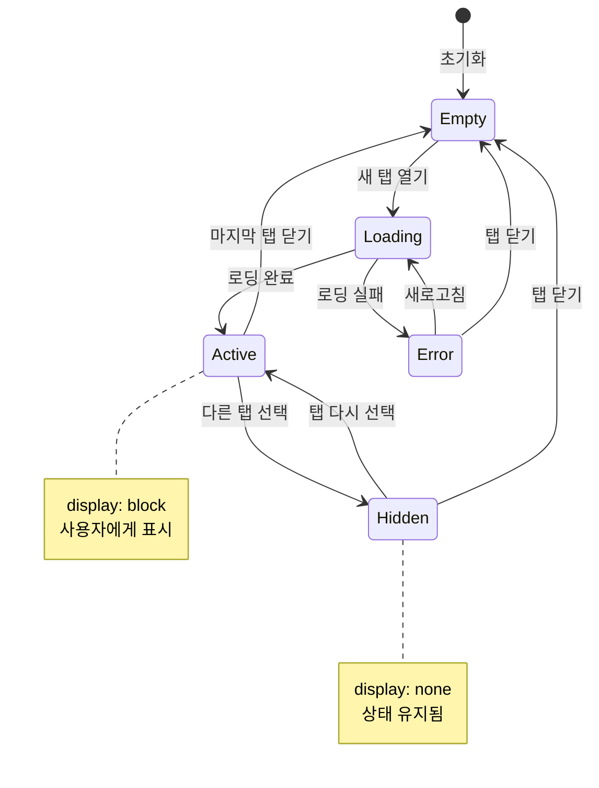

# TSK-02-05 - MDI 컨텐츠 영역 UI 설계

**Version:** 1.0 — **Last Updated:** 2026-01-20

> **목적**: MDI 탭 시스템에서 활성 탭의 화면을 렌더링하고 비활성 탭의 상태를 유지하는 컨텐츠 영역 UI 설계

---

## 1. 화면 목록

| 화면 ID | 화면명 | 목적 | SVG 참조 |
|---------|--------|------|----------|
| SCR-01 | 컨텐츠 영역 (활성 탭) | 활성화된 탭의 화면 컴포넌트 표시 | `screen-01-content-active.svg` |
| SCR-02 | 컨텐츠 영역 (로딩) | 화면 컴포넌트 동적 로딩 중 상태 | `screen-02-content-loading.svg` |
| SCR-03 | 컨텐츠 영역 (빈 상태) | 열린 탭이 없을 때 안내 화면 | `screen-03-content-empty.svg` |
| SCR-04 | 컨텐츠 영역 (에러) | 화면 로딩 실패 또는 접근 불가 | `screen-04-content-error.svg` |
| SCR-05 | 컨텐츠 영역 (다중 탭) | 여러 탭이 열린 상태, 상태 유지 시각화 | `screen-05-content-multi-tabs.svg` |
| SCR-06 | 컨텐츠 영역 (탭 에러 격리) | 개별 탭 에러 시 다른 탭 영향 없음 | `screen-06-content-tab-error.svg` |

---

## 2. 화면 전환 흐름

### 2.1 상태 다이어그램



### 2.2 액션-화면 매트릭스

| 액션 | 현재 상태 | 결과 상태 | 트리거 | 비고 |
|------|----------|----------|--------|------|
| 새 탭 열기 (최초) | Empty | Loading → Active | 메뉴 클릭 | 동적 import |
| 새 탭 열기 (추가) | Active | Loading → Active | 메뉴 클릭 | 기존 탭 Hidden |
| 탭 전환 | Active | Hidden ↔ Active | 탭 클릭 | 즉시 전환 |
| 탭 닫기 | Active | Active (다음 탭) / Empty | 닫기 버튼 | 인접 탭 활성화 |
| 화면 새로고침 | Error / Active | Loading → Active | 새로고침 버튼 | 컴포넌트 리마운트 |
| 로딩 실패 | Loading | Error | 네트워크 오류 | 에러 UI 표시 |

---

## 3. 화면별 상세

### 3.1 SCR-01: 컨텐츠 영역 (활성 탭)

**화면 목적**: 현재 선택된 탭의 화면 컴포넌트를 렌더링하여 사용자에게 표시

**레이아웃 구조**:
```
┌─────────────────────────────────────────────────────────────────┐
│  [Tab 1 x] [Tab 2 x] [Tab 3 x]          ← 탭 바 (TSK-02-02)    │
├─────────────────────────────────────────────────────────────────┤
│                                                                 │
│  ┌─────────────────────────────────────────────────────────┐   │
│  │                                                         │   │
│  │           활성 탭 화면 컴포넌트 (display: block)         │   │
│  │                                                         │   │
│  │   ┌─────────────────────────────────────────────────┐   │   │
│  │   │                                                 │   │   │
│  │   │        동적 import된 Screen 컴포넌트            │   │   │
│  │   │        (예: Dashboard, ProductionList)          │   │   │
│  │   │                                                 │   │   │
│  │   └─────────────────────────────────────────────────┘   │   │
│  │                                                         │   │
│  └─────────────────────────────────────────────────────────┘   │
│                                                                 │
│  ┌ ─ ─ ─ ─ ─ ─ ─ ─ ─ ─ ─ ─ ─ ─ ─ ─ ─ ─ ─ ─ ─ ─ ─ ─ ─ ─ ─ ┐   │
│  │         비활성 탭 화면 (display: none, 상태 유지)        │   │
│  └ ─ ─ ─ ─ ─ ─ ─ ─ ─ ─ ─ ─ ─ ─ ─ ─ ─ ─ ─ ─ ─ ─ ─ ─ ─ ─ ─ ┘   │
│                                                                 │
└─────────────────────────────────────────────────────────────────┘
```

**컴포넌트 구성**:

| 컴포넌트 | 역할 | Props | 비고 |
|----------|------|-------|------|
| `MDIContent` | 전체 컨테이너 | `tabs`, `activeTabId` | Context 구독 |
| `TabPane` | 개별 탭 패널 래퍼 | `tab`, `isActive` | display 스타일 적용 |
| `ScreenLoader` | 동적 화면 로더 | `path` | React.lazy 래퍼 |

**상태 관리**:
- `activeTabId`: 현재 활성화된 탭 ID (MDI Context)
- `tabs`: 열린 탭 목록 배열 (MDI Context)

**사용자 액션**:

| 액션 | 요소 | 결과 |
|------|------|------|
| 탭 클릭 | TabBar | 해당 탭 활성화, 이전 탭 숨김 |
| 스크롤 | Content 영역 | 화면 내 스크롤 (탭별 독립) |

---

### 3.2 SCR-02: 컨텐츠 영역 (로딩)

**화면 목적**: 화면 컴포넌트 동적 로딩 중 사용자에게 진행 상태 표시

**레이아웃 구조**:
```
┌─────────────────────────────────────────────────────────────────┐
│  [Tab 1] [Tab 2 ⟳]                                             │
├─────────────────────────────────────────────────────────────────┤
│                                                                 │
│                                                                 │
│                           ⟳                                    │
│                    화면을 불러오는 중...                          │
│                                                                 │
│                                                                 │
└─────────────────────────────────────────────────────────────────┘
```

**컴포넌트 구성**:

| 컴포넌트 | 역할 | Props |
|----------|------|-------|
| `Suspense` | 로딩 상태 처리 | `fallback={<LoadingFallback />}` |
| `LoadingFallback` | 로딩 UI | - |
| `Spin` (Ant Design) | 스피너 컴포넌트 | `size="large"`, `tip="Loading..."` |

**표시 조건**:
- 처음 접근하는 화면의 컴포넌트를 동적 import 할 때
- 네트워크 상태에 따라 0.1초 ~ 수초 지속

---

### 3.3 SCR-03: 컨텐츠 영역 (빈 상태)

**화면 목적**: 열린 탭이 없을 때 사용자에게 다음 행동 안내

**레이아웃 구조**:
```
┌─────────────────────────────────────────────────────────────────┐
│  (탭 없음)                                                      │
├─────────────────────────────────────────────────────────────────┤
│                                                                 │
│                           📋                                    │
│                                                                 │
│                 열린 화면이 없습니다                              │
│                                                                 │
│           좌측 메뉴에서 화면을 선택하거나                          │
│           Ctrl+K로 검색하여 화면을 열어주세요.                     │
│                                                                 │
│                       [Ctrl + K]                                │
│                                                                 │
└─────────────────────────────────────────────────────────────────┘
```

**컴포넌트 구성**:

| 컴포넌트 | 역할 | Props |
|----------|------|-------|
| `Empty` (Ant Design) | 빈 상태 UI | `description`, `image` |

**표시 조건**:
- `tabs.length === 0`
- 모든 탭을 닫은 후
- 초기 로딩 시 (홈 탭 자동 열기 비활성화된 경우)

---

### 3.4 SCR-04: 컨텐츠 영역 (에러)

**화면 목적**: 화면 로딩 실패 또는 접근 권한 없음을 사용자에게 알림

**레이아웃 구조**:
```
┌─────────────────────────────────────────────────────────────────┐
│  [Tab 1] [Tab 2 !]                                             │
├─────────────────────────────────────────────────────────────────┤
│                                                                 │
│                           ⚠                                    │
│                                                                 │
│            요청하신 화면에 접근할 수 없습니다                      │
│                                                                 │
│                 Path: /invalid/path/screen                      │
│                                                                 │
│              [홈으로 이동]    [탭 닫기]                           │
│                                                                 │
└─────────────────────────────────────────────────────────────────┘
```

**컴포넌트 구성**:

| 컴포넌트 | 역할 | Props |
|----------|------|-------|
| `Result` (Ant Design) | 결과 상태 UI | `status="warning"`, `title`, `extra` |
| `Button` | 액션 버튼 | `type="primary"`, `onClick` |

**에러 유형별 표시**:

| 에러 유형 | status | 메시지 | 보안 고려 |
|----------|--------|--------|----------|
| 화면 없음 (404) | warning | 화면에 접근할 수 없습니다 | 경로 열거 방지를 위해 403과 동일 메시지 |
| 권한 없음 (403) | warning | 화면에 접근할 수 없습니다 | 상동 |
| 로딩 실패 (500) | error | 화면을 불러올 수 없습니다 | 네트워크 오류 시 |

---

### 3.5 SCR-05: 컨텐츠 영역 (다중 탭)

**화면 목적**: 여러 탭이 열린 상태에서 상태 유지 메커니즘 시각화

**레이아웃 구조**:
```
┌───────────────────────────────────────────────────────────────────────┐
│  [Dashboard] [Production ✓] [Equipment]                               │
├───────────────────────────────────────────────────────────────────────┤
│                                                                       │
│  ┌─ ─ ─ ─ ─ ─ ─ ─ ─┐  ┌─────────────────────┐  ┌─ ─ ─ ─ ─ ─ ─ ─ ┐  │
│  │ Dashboard        │  │   Production List    │  │ Equipment       │  │
│  │ (display: none) │  │   (display: block)  │  │ (display: none) │  │
│  │                  │  │                     │  │                  │  │
│  │ [KPI preserved] │  │   ID | Product | Qty │  │ [Form preserved]│  │
│  │                  │  │   01 | WidgetA| 100 │  │                  │  │
│  └─ ─ ─ ─ ─ ─ ─ ─ ─┘  │   02 | WidgetB| 50  │  └─ ─ ─ ─ ─ ─ ─ ─ ┘  │
│                        │                     │                        │
│                        │ Filter: In Progress │                        │
│                        └─────────────────────┘                        │
│                                                                       │
└───────────────────────────────────────────────────────────────────────┘
```

**상태 유지 항목**:

| 항목 | 보존 방법 | 복원 시점 |
|------|----------|----------|
| 폼 입력 값 | React 컴포넌트 상태 유지 | 탭 재선택 시 즉시 |
| 스크롤 위치 | DOM 유지 (unmount 안 함) | 탭 재선택 시 즉시 |
| 필터/정렬 설정 | 컴포넌트 내부 상태 | 탭 재선택 시 즉시 |
| 선택된 행 | 컴포넌트 내부 상태 | 탭 재선택 시 즉시 |
| API 응답 데이터 | React Query 캐시 | 탭 재선택 시 즉시 |

---

### 3.6 SCR-06: 컨텐츠 영역 (탭 에러 격리)

**화면 목적**: 개별 탭에서 에러 발생 시 다른 탭에 영향을 주지 않음을 시각화

**레이아웃 구조**:
```
┌───────────────────────────────────────────────────────────────────────┐
│  [Dashboard ✓] [Broken Screen !] [Equipment]                          │
├───────────────────────────────────────────────────────────────────────┤
│                                                                       │
│  ┌─────────────────────┐  ┌─────────────────────┐                    │
│  │     Dashboard        │  │   Something went    │                    │
│  │   (정상 동작)        │  │      wrong          │                    │
│  │                     │  │                     │                    │
│  │   [KPI 1] [KPI 2]   │  │   ⊗ Error occurred  │                    │
│  │                     │  │                     │                    │
│  │   [   Chart   ]     │  │   [Refresh] [Close] │                    │
│  │                     │  │                     │                    │
│  └─────────────────────┘  └─────────────────────┘                    │
│                           ↑ ErrorBoundary 격리                        │
└───────────────────────────────────────────────────────────────────────┘
```

**에러 격리 구조**:

```typescript
// 각 TabPane은 독립적인 ErrorBoundary를 가짐
<MDIContent>
  {tabs.map(tab => (
    <TabPane key={tab.id} isActive={tab.id === activeTabId}>
      <ErrorBoundary fallback={<TabErrorFallback tab={tab} />}>
        <Suspense fallback={<LoadingFallback />}>
          <ScreenLoader path={tab.path} />
        </Suspense>
      </ErrorBoundary>
    </TabPane>
  ))}
</MDIContent>
```

**에러 복구 옵션**:

| 버튼 | 동작 | 결과 |
|------|------|------|
| 새로고침 | ErrorBoundary reset + 컴포넌트 리마운트 | 화면 재로딩 시도 |
| 탭 닫기 | 탭 제거 | 다른 탭 활성화 |

---

## 4. 공통 컴포넌트

### 4.1 TabPane

탭별 화면을 감싸는 래퍼 컴포넌트

```typescript
interface TabPaneProps {
  tab: Tab;
  isActive: boolean;
  children: React.ReactNode;
}
```

**스타일 적용**:
```css
.tab-pane {
  height: 100%;
  overflow: auto;
}

.tab-pane--active {
  display: block;
}

.tab-pane--hidden {
  display: none;
}
```

### 4.2 ScreenLoader

화면 컴포넌트를 동적으로 로딩하는 컴포넌트

```typescript
interface ScreenLoaderProps {
  path: string;  // 화면 경로 (예: '/dashboard')
}
```

**로딩 흐름**:
1. `path` 유효성 검증
2. `screenRegistry`에서 컴포넌트 찾기
3. 권한 검사 (선택적)
4. `React.lazy`로 동적 import
5. 컴포넌트 렌더링

### 4.3 LoadingFallback

Suspense의 fallback으로 사용되는 로딩 UI

```typescript
const LoadingFallback: React.FC = () => (
  <div className="loading-fallback">
    <Spin size="large" tip="화면을 불러오는 중..." />
  </div>
);
```

### 4.4 TabErrorFallback

ErrorBoundary의 fallback으로 사용되는 에러 UI

```typescript
interface TabErrorFallbackProps {
  tab: Tab;
  error: Error;
  resetErrorBoundary: () => void;
}
```

---

## 5. 반응형 설계

### 5.1 Breakpoint 정의

| Breakpoint | 너비 범위 | 컨텐츠 영역 동작 |
|------------|----------|-----------------|
| Desktop | 1024px+ | 사이드바 240px, 컨텐츠 flex-grow |
| Tablet | 768-1023px | 사이드바 60px, 컨텐츠 확장 |
| Mobile | 0-767px | 사이드바 숨김, 컨텐츠 전체 너비 |

### 5.2 컨텐츠 영역 크기 계산

```css
.mdi-content {
  /* 높이: 전체 뷰포트 - 헤더 - 탭바 - 푸터 */
  height: calc(100vh - var(--header-height) - var(--tab-bar-height) - var(--footer-height));
  /* 높이: 100vh - 60px - 40px - 30px = calc(100vh - 130px) */

  /* 너비: 뷰포트 - 사이드바 */
  width: calc(100vw - var(--sidebar-width));

  overflow: hidden; /* 내부 스크롤 */
}

.tab-pane {
  height: 100%;
  overflow: auto; /* 탭별 스크롤 */
}
```

---

## 6. 접근성

### 6.1 키보드 네비게이션

| 키 | 동작 | 조건 |
|-----|------|------|
| Tab | 컨텐츠 내 포커스 이동 | 기본 동작 |
| Ctrl+Tab | 다음 탭으로 전환 | MDI 단축키 (TSK-02-02) |
| Ctrl+Shift+Tab | 이전 탭으로 전환 | MDI 단축키 |
| Ctrl+W | 현재 탭 닫기 | MDI 단축키 |

### 6.2 ARIA 속성

| 요소 | ARIA 속성 | 값 |
|------|----------|-----|
| MDIContent | `role` | `main` |
| TabPane | `role` | `tabpanel` |
| TabPane | `aria-labelledby` | `tab-{id}` |
| TabPane (활성) | `aria-hidden` | `false` |
| TabPane (비활성) | `aria-hidden` | `true` |

### 6.3 색상 대비

- 모든 텍스트: WCAG 2.1 AA 기준 충족 (4.5:1 이상)
- 에러 메시지: 빨간색 (#DC2626) - 흰색 배경 대비 7.1:1
- 로딩 텍스트: 회색 (#6B7280) - 흰색 배경 대비 5.4:1

---

## 7. SVG 파일 목록

| 파일명 | 설명 | 뷰포트 |
|--------|------|--------|
| `screen-01-content-active.svg` | 활성 탭 컨텐츠 표시 | 1280x720 |
| `screen-02-content-loading.svg` | 화면 로딩 중 상태 | 1280x720 |
| `screen-03-content-empty.svg` | 탭 없음 빈 상태 | 1280x720 |
| `screen-04-content-error.svg` | 화면 로딩 에러 | 1280x720 |
| `screen-05-content-multi-tabs.svg` | 다중 탭 상태 유지 | 1280x720 |
| `screen-06-content-tab-error.svg` | 탭별 에러 격리 | 1280x720 |

---

## 8. 컴포넌트 구조

```
components/
└── mdi/
    ├── MDIContent.tsx          # 메인 컨텐츠 컨테이너
    ├── TabPane.tsx             # 개별 탭 패널 래퍼
    ├── ScreenLoader.tsx        # 동적 화면 로더
    ├── LoadingFallback.tsx     # 로딩 UI
    └── TabErrorFallback.tsx    # 탭별 에러 UI

lib/
└── mdi/
    └── screenRegistry.ts       # 화면-컴포넌트 매핑

screens/
├── _errors/
│   ├── ScreenNotFound.tsx      # 404 화면
│   └── AccessDenied.tsx        # 403 화면
└── ... (개별 화면들)
```

---

## 관련 문서

- 설계: `010-design.md`
- 테스트 명세: `026-test-specification.md`
- 추적성 매트릭스: `025-traceability-matrix.md`
