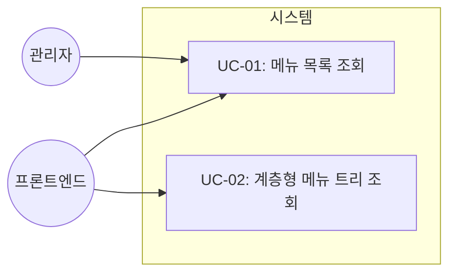
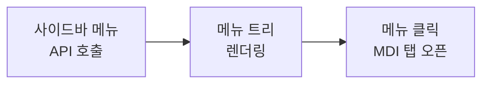
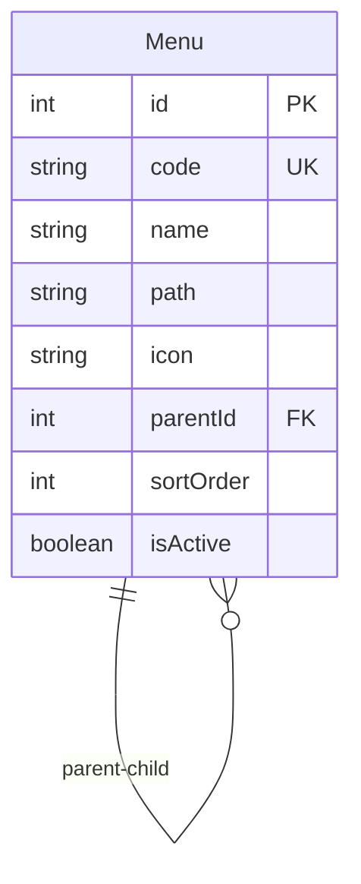

# TSK-03-01 - 메뉴 데이터 모델 설계 문서

## 문서 정보

| 항목 | 내용 |
|------|------|
| Task ID | TSK-03-01 |
| 문서 버전 | 1.0 |
| 작성일 | 2026-01-20 |
| 상태 | 작성중 |
| 카테고리 | development |

---

## 1. 개요

### 1.1 배경 및 문제 정의

**현재 상황:**
- MES Portal은 DB 기반 동적 메뉴 시스템이 필요함
- 현재 메뉴 구조가 정의되지 않아 사이드바 메뉴를 구현할 수 없음
- 역할별 메뉴 접근 제어를 위한 데이터 구조가 필요함

**해결하려는 문제:**
- 계층형 메뉴 구조를 DB에서 관리할 수 있어야 함
- 메뉴 순서, 아이콘, 활성 상태 등을 유연하게 관리해야 함
- 향후 역할-메뉴 매핑(TSK-03-02)의 기반이 되는 데이터 모델 필요

### 1.2 목적 및 기대 효과

**목적:**
- Prisma를 사용하여 Menu 테이블 생성
- 계층형 메뉴 구조 지원 (자기참조 parentId)
- 메뉴 CRUD API 제공

**기대 효과:**
- 코드 수정 없이 DB에서 메뉴 구조 변경 가능
- 계층형 트리 메뉴 (최대 3단계) 지원
- 메뉴 순서 및 활성화 상태 관리 용이

### 1.3 범위

**포함:**
- Menu 테이블 Prisma 스키마 정의
- 초기 메뉴 시드 데이터 작성
- GET /api/menus API 엔드포인트 (전체 메뉴 목록, 계층형 응답)

**제외:**
- 역할별 메뉴 필터링 (TSK-03-02에서 구현)
- 메뉴 관리 화면 (관리자 기능, Phase 2)
- 즐겨찾기 메뉴 (TSK-03-04에서 구현)

### 1.4 참조 문서

| 문서 | 경로 | 관련 섹션 |
|------|------|----------|
| PRD | `.orchay/projects/mes-portal/prd.md` | 4.1.1 동적 메뉴 시스템 |
| TRD | `.orchay/projects/mes-portal/trd.md` | 2.3 MVP Prisma 스키마 |

---

## 2. 사용자 분석

### 2.1 대상 사용자

| 사용자 유형 | 특성 | 주요 니즈 |
|------------|------|----------|
| 시스템 관리자 | 메뉴 구조 관리 권한 | DB 수준에서 메뉴 추가/수정/삭제 |
| 일반 사용자 | 포털 사용자 | 권한에 맞는 메뉴만 표시 |
| 프론트엔드 개발자 | 사이드바 구현 | 계층형 메뉴 API 응답 필요 |

### 2.2 사용자 페르소나

**페르소나 1: 시스템 관리자**
- 역할: IT 인프라 담당
- 목표: 메뉴 구조를 유연하게 관리
- 불만: 메뉴 변경을 위해 코드 수정 및 배포 필요
- 시나리오: prisma studio 또는 seed 스크립트로 메뉴 관리

---

## 3. 유즈케이스

### 3.1 유즈케이스 다이어그램



### 3.2 유즈케이스 상세

#### UC-01: 메뉴 목록 조회

| 항목 | 내용 |
|------|------|
| 액터 | 인증된 프론트엔드 애플리케이션 |
| 목적 | 전체 메뉴 목록을 계층형 구조로 조회 |
| 사전 조건 | 1. 사용자가 인증됨 (세션/토큰 유효)<br>2. 데이터베이스에 메뉴 데이터가 존재 |
| 사후 조건 | 계층형 메뉴 트리 JSON 응답 |
| 트리거 | 사이드바 컴포넌트 마운트 시 |

**기본 흐름:**
1. 프론트엔드가 GET /api/menus 요청 (인증 토큰 포함)
2. **서버가 Auth.js 세션/토큰 유효성 검증**
3. 서버가 DB에서 활성화된 메뉴 조회 (isActive = true)
4. 서버가 flat 데이터를 계층형 트리로 변환
5. 서버가 sortOrder 기준으로 정렬된 트리 응답
6. 프론트엔드가 사이드바 메뉴 렌더링

**예외 흐름:**
- 2a. 인증 실패 (세션 없음/만료):
  - 401 Unauthorized 응답
  - 프론트엔드에서 로그인 페이지로 리다이렉트
- 3a. 메뉴 데이터가 없는 경우:
  - 빈 배열 [] 응답
  - 프론트엔드에서 빈 상태 처리

---

## 4. 사용자 시나리오

### 4.1 시나리오 1: 사이드바 메뉴 로딩

**상황 설명:**
사용자가 포털에 로그인 후 메인 화면에 진입하면 사이드바에 메뉴가 표시되어야 한다.

**단계별 진행:**

| 단계 | 사용자 행동 | 시스템 반응 | 사용자 기대 |
|------|-----------|------------|------------|
| 1 | 포털 메인 진입 | 사이드바 컴포넌트 마운트 | 메뉴 로딩 중 표시 |
| 2 | - | GET /api/menus 호출 | - |
| 3 | - | 계층형 메뉴 트리 응답 | - |
| 4 | 사이드바 확인 | 3단계 계층형 메뉴 표시 | 메뉴가 올바른 순서로 표시 |

**성공 조건:**
- 메뉴가 계층형으로 표시됨 (1단계 > 2단계 > 3단계)
- 메뉴가 sortOrder 순서로 정렬됨
- 각 메뉴에 아이콘과 이름이 표시됨

### 4.2 시나리오 2: 메뉴 클릭하여 화면 열기

**상황 설명:**
사용자가 사이드바 메뉴 아이템을 클릭하면 해당 화면이 MDI 탭으로 열린다.

**단계별 진행:**

| 단계 | 사용자 행동 | 시스템 반응 | 사용자 기대 |
|------|-----------|------------|------------|
| 1 | 메뉴 아이템 클릭 | path 값으로 MDI 탭 오픈 | 해당 화면 표시 |

---

## 5. 화면 설계

### 5.1 화면 흐름도



### 5.2 사이드바 메뉴 구조

**와이어프레임:**
```
┌─────────────────────────────────────┐
│ 📁 대시보드                          │  <- 1단계 (폴더)
│   └─ 📊 메인 대시보드               │  <- 2단계 (화면)
│                                     │
│ 📁 생산 관리                         │  <- 1단계 (폴더)
│   ├─ 📄 작업 지시                   │  <- 2단계 (화면)
│   └─ 📁 실적 관리                   │  <- 2단계 (폴더)
│       ├─ 📄 생산 실적              │  <- 3단계 (화면)
│       └─ 📄 실적 조회              │  <- 3단계 (화면)
│                                     │
│ 📁 시스템 관리                       │  <- 1단계 (폴더)
│   ├─ 📄 사용자 관리                 │  <- 2단계 (화면)
│   └─ 📄 역할 관리                   │  <- 2단계 (화면)
└─────────────────────────────────────┘
```

**메뉴 아이템 구성:**
- 아이콘: @ant-design/icons 사용
- 메뉴명: 펼침 상태에서 표시
- 화살표: 하위 메뉴 있는 경우 표시

---

## 6. 인터랙션 설계

### 6.1 사용자 액션과 피드백

| 사용자 액션 | 즉각 피드백 | 결과 피드백 | 에러 피드백 |
|------------|-----------|------------|------------|
| 메뉴 그룹 클릭 | 펼침/접힘 애니메이션 | 하위 메뉴 표시/숨김 | - |
| 화면 메뉴 클릭 | 메뉴 하이라이트 | MDI 탭 오픈 | - |
| API 호출 실패 | - | - | 에러 토스트 |

### 6.2 상태별 화면 변화

| 상태 | 화면 표시 | 사용자 안내 |
|------|----------|------------|
| 초기 로딩 | 스켈레톤 메뉴 | - |
| 데이터 없음 | 빈 메뉴 영역 | "메뉴가 없습니다" |
| 에러 발생 | 에러 메시지 | "메뉴를 불러올 수 없습니다" |
| 정상 | 계층형 메뉴 | - |

---

## 7. 데이터 요구사항

### 7.1 Menu 테이블 스키마

| 컬럼 | 타입 | 설명 | 제약조건 |
|------|------|------|----------|
| id | Int | 메뉴 고유 ID | PK, Auto Increment |
| code | String | 메뉴 코드 | Unique, Not Null |
| name | String | 메뉴 표시명 | Not Null |
| path | String? | 화면 경로 | Nullable (폴더는 null) |
| icon | String? | 아이콘 이름 | Nullable |
| parentId | Int? | 상위 메뉴 ID | FK (self), Nullable |
| sortOrder | Int | 정렬 순서 | Default 0 |
| isActive | Boolean | 활성화 여부 | Default true |

### 7.2 데이터 관계



**관계 설명:**
- Menu는 자기 자신을 참조 (parentId → id)
- parentId가 null이면 1단계 메뉴
- parentId가 있으면 해당 메뉴의 하위 메뉴

### 7.3 Prisma 스키마 정의

```prisma
model Menu {
  id        Int      @id @default(autoincrement())
  code      String   @unique
  name      String
  path      String?  // 화면 경로 (null이면 폴더)
  icon      String?
  parentId  Int?
  sortOrder Int      @default(0)
  isActive  Boolean  @default(true)
  createdAt DateTime @default(now())
  updatedAt DateTime @updatedAt

  parent    Menu?    @relation("MenuHierarchy", fields: [parentId], references: [id])
  children  Menu[]   @relation("MenuHierarchy")
  roleMenus RoleMenu[]

  @@index([parentId])
  @@index([isActive])
  @@index([parentId, sortOrder])
  @@map("menus")
}

model RoleMenu {
  id        Int      @id @default(autoincrement())
  roleId    Int
  menuId    Int
  createdAt DateTime @default(now())

  menu      Menu     @relation(fields: [menuId], references: [id], onDelete: Cascade)

  @@unique([roleId, menuId])
  @@map("role_menus")
}
```

### 7.4 초기 시드 데이터

```typescript
// prisma/seed.ts - 메뉴 시드 데이터

const menus = [
  // 1단계: 대시보드
  { id: 1, code: 'DASHBOARD', name: '대시보드', icon: 'DashboardOutlined', parentId: null, sortOrder: 1 },
  { id: 2, code: 'DASHBOARD_MAIN', name: '메인 대시보드', path: '/portal/dashboard', icon: 'BarChartOutlined', parentId: 1, sortOrder: 1 },

  // 1단계: 생산 관리
  { id: 10, code: 'PRODUCTION', name: '생산 관리', icon: 'ToolOutlined', parentId: null, sortOrder: 2 },
  { id: 11, code: 'WORK_ORDER', name: '작업 지시', path: '/portal/production/work-order', icon: 'FileTextOutlined', parentId: 10, sortOrder: 1 },
  { id: 12, code: 'PRODUCTION_RESULT', name: '실적 관리', icon: 'FolderOutlined', parentId: 10, sortOrder: 2 },
  { id: 13, code: 'PRODUCTION_ENTRY', name: '생산 실적 입력', path: '/portal/production/result/entry', icon: 'EditOutlined', parentId: 12, sortOrder: 1 },
  { id: 14, code: 'PRODUCTION_HISTORY', name: '생산 이력 조회', path: '/portal/production/result/history', icon: 'HistoryOutlined', parentId: 12, sortOrder: 2 },

  // 1단계: 샘플 화면
  { id: 20, code: 'SAMPLE', name: '샘플 화면', icon: 'AppstoreOutlined', parentId: null, sortOrder: 3 },
  { id: 21, code: 'SAMPLE_USER_LIST', name: '사용자 목록', path: '/portal/sample/user-list', icon: 'UnorderedListOutlined', parentId: 20, sortOrder: 1 },
  { id: 22, code: 'SAMPLE_MASTER_DETAIL', name: '마스터-디테일', path: '/portal/sample/master-detail', icon: 'SplitCellsOutlined', parentId: 20, sortOrder: 2 },
  { id: 23, code: 'SAMPLE_WIZARD', name: '설정 마법사', path: '/portal/sample/wizard', icon: 'FundProjectionScreenOutlined', parentId: 20, sortOrder: 3 },

  // 1단계: 시스템 관리
  { id: 90, code: 'SYSTEM', name: '시스템 관리', icon: 'SettingOutlined', parentId: null, sortOrder: 9 },
  { id: 91, code: 'USER_MGMT', name: '사용자 관리', path: '/portal/system/users', icon: 'UserOutlined', parentId: 90, sortOrder: 1 },
  { id: 92, code: 'ROLE_MGMT', name: '역할 관리', path: '/portal/system/roles', icon: 'TeamOutlined', parentId: 90, sortOrder: 2 },
  { id: 93, code: 'MENU_MGMT', name: '메뉴 관리', path: '/portal/system/menus', icon: 'MenuOutlined', parentId: 90, sortOrder: 3 },
]
```

### 7.5 API 응답 형식

**요청:** `GET /api/menus`

**응답 (계층형 트리):**
```json
{
  "success": true,
  "data": [
    {
      "id": 1,
      "code": "DASHBOARD",
      "name": "대시보드",
      "path": null,
      "icon": "DashboardOutlined",
      "sortOrder": 1,
      "children": [
        {
          "id": 2,
          "code": "DASHBOARD_MAIN",
          "name": "메인 대시보드",
          "path": "/portal/dashboard",
          "icon": "BarChartOutlined",
          "sortOrder": 1,
          "children": []
        }
      ]
    },
    {
      "id": 10,
      "code": "PRODUCTION",
      "name": "생산 관리",
      "path": null,
      "icon": "ToolOutlined",
      "sortOrder": 2,
      "children": [...]
    }
  ]
}
```

---

## 8. 비즈니스 규칙

### 8.1 핵심 규칙

| 규칙 ID | 규칙 설명 | 적용 상황 | 예외 |
|---------|----------|----------|------|
| BR-01 | 메뉴 코드는 고유해야 함 | 메뉴 생성/수정 시 | 없음 |
| BR-02 | 계층 구조는 최대 3단계 | 메뉴 생성 시 | 없음 |
| BR-03 | isActive=false인 메뉴는 조회 제외 | API 조회 시 | 관리자 API |
| BR-04 | sortOrder 오름차순 정렬 | 메뉴 조회 시 | 없음 |
| BR-05 | 순환 참조 금지 | 메뉴 수정 시 | 없음 |
| BR-06 | 자식 메뉴가 있으면 삭제 불가 | 메뉴 삭제 시 | 없음 |

### 8.2 규칙 상세 설명

**BR-01: 메뉴 코드 고유성**

설명: 메뉴 코드(code)는 시스템 내에서 유일해야 하며, 프론트엔드에서 특정 메뉴를 식별하는 데 사용됩니다.

예시:
- DASHBOARD, PRODUCTION, SYSTEM 등 대문자 스네이크 케이스 사용
- 중복 코드 입력 시 DB 에러 발생

**BR-02: 최대 3단계 계층 구조**

설명: PRD 요구사항에 따라 메뉴 트리는 최대 3단계까지만 지원합니다.

예시:
- 1단계: 대시보드 (parentId: null)
- 2단계: 메인 대시보드 (parentId: 1)
- 3단계: 상세 화면 (parentId: 2)
- 4단계 이상은 UI에서 지원하지 않음

**검증 로직:**
```typescript
async function validateMenuDepth(parentId: number | null): Promise<void> {
  if (!parentId) return; // 최상위 메뉴는 검증 불필요

  let depth = 1;
  let currentId: number | null = parentId;

  while (currentId) {
    depth++;
    if (depth > 3) {
      throw new BadRequestException('메뉴 계층은 최대 3단계까지 허용됩니다');
    }
    const menu = await prisma.menu.findUnique({
      where: { id: currentId },
      select: { parentId: true }
    });
    currentId = menu?.parentId ?? null;
  }
}
```

**BR-05: 순환 참조 금지**

설명: parentId 변경 시 자기 자신이나 자식 메뉴를 부모로 지정할 수 없습니다.

**검증 로직:**
```typescript
async function validateNoCircularReference(menuId: number, newParentId: number | null): Promise<void> {
  if (!newParentId) return;
  if (menuId === newParentId) {
    throw new BadRequestException('자기 자신을 부모로 지정할 수 없습니다');
  }

  let currentId: number | null = newParentId;
  while (currentId) {
    if (currentId === menuId) {
      throw new BadRequestException('순환 참조: 자식 메뉴를 부모로 지정할 수 없습니다');
    }
    const menu = await prisma.menu.findUnique({
      where: { id: currentId },
      select: { parentId: true }
    });
    currentId = menu?.parentId ?? null;
  }
}
```

**BR-06: 자식 메뉴 삭제 보호**

설명: 하위 메뉴가 있는 메뉴는 삭제할 수 없습니다. 먼저 하위 메뉴를 삭제해야 합니다.

**검증 로직:**
```typescript
async function validateNoChildren(menuId: number): Promise<void> {
  const childCount = await prisma.menu.count({ where: { parentId: menuId } });
  if (childCount > 0) {
    throw new BadRequestException('하위 메뉴가 있어 삭제할 수 없습니다');
  }
}
```

---

## 8.3 입력 검증 규칙

### 필드별 검증

| 필드 | 규칙 | 정규식/조건 | 에러 메시지 |
|------|------|-------------|------------|
| code | 대문자 영문, 숫자, 언더스코어 | `^[A-Z][A-Z0-9_]*$` | 유효하지 않은 메뉴 코드 형식입니다 |
| code | 최대 50자 | length <= 50 | 메뉴 코드는 50자 이하입니다 |
| name | 최대 50자 | length <= 50 | 메뉴 이름은 50자 이하입니다 |
| name | HTML 특수문자 금지 | `<`, `>`, `&` 제외 | 유효하지 않은 문자가 포함되어 있습니다 |
| path | /portal/로 시작 | `^\/portal\/[a-z0-9\-\/]+$` | 경로는 /portal/로 시작해야 합니다 |
| path | 외부 URL 금지 | javascript:, // 제외 | 유효하지 않은 경로입니다 |
| path | Path traversal 금지 | `..` 제외 | 유효하지 않은 경로입니다 |
| icon | 허용 목록 기반 | @ant-design/icons 유효 아이콘명 | 유효하지 않은 아이콘입니다 |
| sortOrder | 음수 불가 | >= 0 | 정렬 순서는 0 이상이어야 합니다 |

### 아이콘 허용 목록 (발췌)

```typescript
const ALLOWED_ICONS = [
  'DashboardOutlined', 'BarChartOutlined', 'ToolOutlined',
  'FileTextOutlined', 'FolderOutlined', 'EditOutlined',
  'HistoryOutlined', 'AppstoreOutlined', 'UnorderedListOutlined',
  'SplitCellsOutlined', 'FundProjectionScreenOutlined',
  'SettingOutlined', 'UserOutlined', 'TeamOutlined', 'MenuOutlined',
  // ... 추가 아이콘은 구현 시 확장
];
```

---

## 9. 에러 처리

### 9.1 예상 에러 상황

| 상황 | 원인 | HTTP 상태 | 에러 코드 | 응답 메시지 |
|------|------|----------|----------|------------|
| 인증 실패 | 세션/토큰 없음 또는 만료 | 401 | UNAUTHORIZED | 인증이 필요합니다 |
| 메뉴 미존재 | 잘못된 ID 또는 삭제됨 | 404 | MENU_NOT_FOUND | 메뉴를 찾을 수 없습니다 |
| 중복 메뉴 코드 | 이미 존재하는 code | 409 | DUPLICATE_MENU_CODE | 이미 존재하는 메뉴 코드입니다 |
| 계층 깊이 초과 | 4단계 이상 메뉴 생성 | 400 | MAX_DEPTH_EXCEEDED | 메뉴 계층은 최대 3단계까지 허용됩니다 |
| 순환 참조 | 자기 참조 또는 자식→부모 | 400 | CIRCULAR_REFERENCE | 순환 참조가 발생합니다 |
| 자식 메뉴 존재 | 하위 메뉴 있는 상태로 삭제 | 400 | HAS_CHILDREN | 하위 메뉴가 있어 삭제할 수 없습니다 |
| 입력 검증 실패 | 필드 검증 규칙 위반 | 400 | VALIDATION_ERROR | (필드별 메시지) |
| DB 연결 실패 | 네트워크/DB 오류 | 500 | DB_CONNECTION_ERROR | 데이터베이스 연결에 실패했습니다 |
| 메뉴 데이터 없음 | 시드 미실행 | 200 | - | { success: true, data: [] } |

### 9.2 에러 응답 형식

```json
{
  "success": false,
  "error": {
    "code": "DUPLICATE_MENU_CODE",
    "message": "이미 존재하는 메뉴 코드입니다"
  }
}
```

---

## 9.3 비기능 요구사항 (NFR)

### 성능 요구사항

| 항목 | 목표 | 비고 |
|------|------|------|
| GET /api/menus 응답 시간 | 200ms 이내 (p95) | 메뉴 100개 기준 |
| 동시 요청 처리 | 50 req/s | MVP 기준 |
| 메모리 사용량 | 50MB 이하 | 메뉴 트리 변환 시 |

### 보안 요구사항

| 항목 | 요구사항 | 구현 방법 |
|------|----------|----------|
| 인증 필수 | 모든 메뉴 API는 인증 필요 | Auth.js 세션/JWT 검증 |
| 입력 검증 | 모든 입력 필드 서버 검증 | 섹션 8.3 규칙 적용 |
| XSS 방지 | icon, path 필드 허용 목록 검증 | 정규식 + 화이트리스트 |

### 가용성

| 항목 | 목표 |
|------|------|
| 서비스 가용성 | 99% (MVP) |
| 에러 복구 | DB 연결 실패 시 3회 재시도 |

### 의존성 참고

| 항목 | 내용 |
|------|------|
| 역할 기반 메뉴 필터링 | TSK-03-02에서 구현 (본 Task는 인증된 전체 메뉴 반환) |

---

## 10. 연관 문서

| 문서 | 경로 | 용도 |
|------|------|------|
| 요구사항 추적 매트릭스 | `025-traceability-matrix.md` | PRD → 설계 → 테스트 양방향 추적 |
| 테스트 명세서 | `026-test-specification.md` | 단위/E2E/매뉴얼 테스트 상세 정의 |

---

## 11. 구현 범위

### 11.1 영향받는 영역

| 영역 | 변경 내용 | 영향도 |
|------|----------|--------|
| prisma/schema.prisma | Menu 모델 추가 | 높음 |
| prisma/seed.ts | 초기 메뉴 데이터 추가 | 높음 |
| app/api/menus/route.ts | GET API 엔드포인트 생성 | 높음 |
| lib/types/menu.ts | MenuItem 타입 정의 | 중간 |

### 11.2 의존성

| 의존 항목 | 이유 | 상태 |
|----------|------|------|
| TSK-04-01 Prisma 설정 | Prisma 클라이언트가 필요 | 필요 |

### 11.3 제약 사항

| 제약 | 설명 | 대응 방안 |
|------|------|----------|
| Prisma 설정 필요 | TSK-04-01 완료 후 진행 가능 | 스키마 정의만 선행, 마이그레이션은 TSK-04-01 후 |

---

## 12. 체크리스트

### 12.1 설계 완료 확인

- [x] 문제 정의 및 목적 명확화
- [x] 사용자 분석 완료
- [x] 유즈케이스 정의 완료
- [x] 사용자 시나리오 작성 완료
- [x] 화면 설계 완료 (와이어프레임)
- [x] 인터랙션 설계 완료
- [x] 데이터 요구사항 정의 완료
- [x] 비즈니스 규칙 정의 완료
- [x] 에러 처리 정의 완료

### 12.2 연관 문서 작성

- [x] 요구사항 추적 매트릭스 작성 (→ `025-traceability-matrix.md`)
- [x] 테스트 명세서 작성 (→ `026-test-specification.md`)

### 12.3 구현 준비

- [x] 구현 우선순위 결정
- [x] 의존성 확인 완료
- [x] 제약 사항 검토 완료

---

## 변경 이력

| 버전 | 일자 | 작성자 | 변경 내용 |
|------|------|--------|----------|
| 1.0 | 2026-01-20 | Claude | 최초 작성 |
