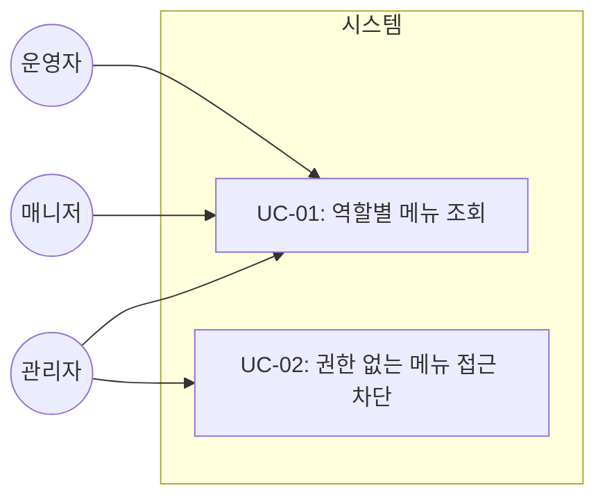
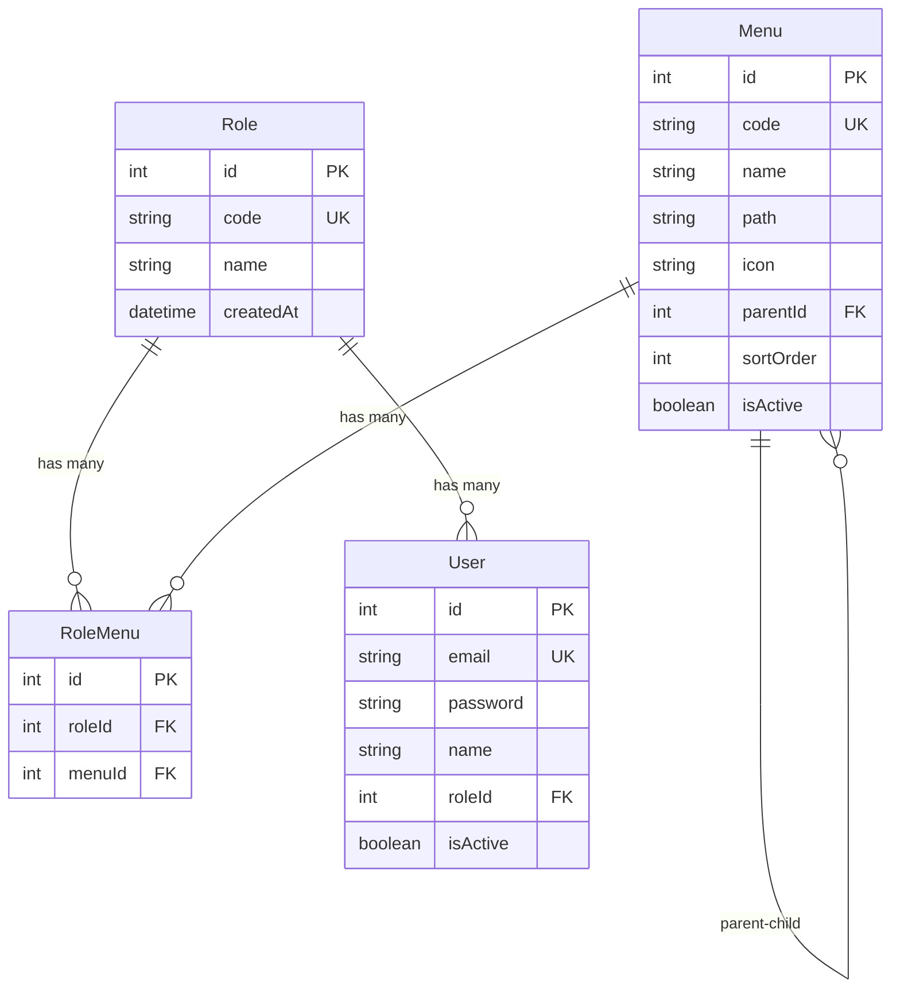

# TSK-03-02 - 역할-메뉴 매핑 설계 문서

## 문서 정보

| 항목 | 내용 |
|------|------|
| Task ID | TSK-03-02 |
| 문서 버전 | 1.1 |
| 작성일 | 2026-01-20 |
| 상태 | 리뷰 반영 완료 |
| 카테고리 | development |

---

## 1. 개요

### 1.1 배경 및 문제 정의

**현재 상황:**
- TSK-03-01에서 Menu 테이블이 생성되어 메뉴 데이터 관리 기반이 마련됨
- TSK-04-02에서 User, Role 테이블이 생성되어 사용자/역할 관리 기반이 마련됨
- 현재 모든 사용자가 동일한 메뉴를 볼 수 있어 권한 통제가 불가능함

**해결하려는 문제:**
- 역할(Role)별로 접근 가능한 메뉴를 제한하여 보안 강화 필요
- 관리자/매니저/운영자 등 역할에 따라 다른 메뉴를 표시해야 함
- 메뉴 조회 시 현재 로그인한 사용자의 역할에 따라 자동 필터링 필요

### 1.2 목적 및 기대 효과

**목적:**
- 역할 기반 메뉴 접근 제어(RBAC) 구현
- RoleMenu 테이블을 통한 역할-메뉴 매핑 관리

**기대 효과:**
- 역할별로 적절한 메뉴만 표시되어 사용자 혼란 감소
- 민감한 관리 기능에 대한 접근 통제로 보안 강화
- 역할별 메뉴 구성의 유연한 관리 가능

### 1.3 범위

**포함:**
- RoleMenu 테이블 스키마 정의 (Prisma)
- 역할-메뉴 매핑 관계 설정
- 메뉴 조회 API에서 권한 필터링 로직
- 초기 역할별 메뉴 시드 데이터

**제외:**
- 메뉴 관리 UI (관리자 화면) - 향후 과제
- 동적 권한 변경 UI - 향후 과제
- 메뉴 API 엔드포인트 구현 (TSK-03-03에서 처리)

### 1.4 참조 문서

| 문서 | 경로 | 관련 섹션 |
|------|------|----------|
| PRD | `.orchay/projects/mes-portal/prd.md` | 4.1.1 동적 메뉴 시스템 - 사용자 권한별 메뉴 필터링 |
| TRD | `.orchay/projects/mes-portal/trd.md` | 2.3 MVP Prisma 스키마 - RoleMenu 모델 |

---

## 2. 사용자 분석

### 2.1 대상 사용자

| 사용자 유형 | 특성 | 주요 니즈 |
|------------|------|----------|
| 관리자 (ADMIN) | 시스템 전체 관리 권한 | 모든 메뉴 접근, 시스템 설정 |
| 매니저 (MANAGER) | 생산 관리 권한 | 대시보드, 생산 관리, 품질 관리 메뉴 |
| 운영자 (OPERATOR) | 현장 작업 권한 | 작업 지시 조회, 실적 입력 메뉴 |

### 2.2 사용자 페르소나

**페르소나 1: 시스템 관리자 (김관리)**
- 역할: IT 시스템 관리자
- 목표: 시스템 전체 메뉴 접근 및 사용자/권한 관리
- 불만: 권한이 없는 사용자가 민감한 메뉴에 접근할 수 있음
- 시나리오: 로그인 후 관리자 전용 메뉴(사용자 관리, 시스템 설정)까지 모두 표시

**페르소나 2: 생산 담당자 (이생산)**
- 역할: 라인별 생산 관리자
- 목표: 생산 관련 메뉴만 빠르게 접근
- 불만: 불필요한 메뉴가 많아 원하는 기능 찾기 어려움
- 시나리오: 로그인 후 생산 관련 메뉴만 표시되어 업무 집중

---

## 3. 유즈케이스

### 3.1 유즈케이스 다이어그램



### 3.2 유즈케이스 상세

#### UC-01: 역할별 메뉴 조회

| 항목 | 내용 |
|------|------|
| 액터 | 로그인한 모든 사용자 |
| 목적 | 자신의 역할에 맞는 메뉴만 조회 |
| 사전 조건 | 사용자가 로그인하여 세션이 유효함 |
| 사후 조건 | 역할에 허용된 메뉴만 반환됨 |
| 트리거 | 포털 페이지 로드 또는 메뉴 API 호출 |

**기본 흐름:**
1. 사용자가 포털에 접근한다
2. 시스템이 현재 세션에서 사용자 정보와 역할을 조회한다
3. 시스템이 RoleMenu 테이블에서 해당 역할에 매핑된 메뉴 ID 목록을 조회한다
4. 시스템이 Menu 테이블에서 매핑된 메뉴만 필터링하여 계층 구조로 반환한다
5. 사이드바에 해당 메뉴만 표시된다

**대안 흐름:**
- 3a. 역할에 매핑된 메뉴가 없으면:
  - 빈 메뉴 목록이 반환된다
  - 사이드바에 "접근 가능한 메뉴가 없습니다" 표시

#### UC-02: 권한 없는 메뉴 접근 차단

| 항목 | 내용 |
|------|------|
| 액터 | 일반 사용자 (MANAGER, OPERATOR) |
| 목적 | 권한 없는 화면 직접 접근 방지 |
| 사전 조건 | 사용자가 로그인하여 세션이 유효함 |
| 사후 조건 | 권한 없는 경로 접근 시 차단됨 |
| 트리거 | URL 직접 입력으로 권한 없는 화면 접근 시도 |

**기본 흐름:**
1. 사용자가 URL을 직접 입력하여 특정 화면에 접근한다
2. **서버 사이드 미들웨어가 요청을 인터셉트한다**
3. 시스템이 세션에서 사용자 역할을 조회한다
4. **시스템이 RoleMenu에서 해당 역할의 허용 경로 목록을 조회한다**
5. **요청 경로가 허용 목록에 포함되어 있는지 검증한다**
6. 권한이 있으면 화면을 표시한다

**예외 흐름:**
- 5a. 권한이 없으면:
  - 시스템이 403 에러 페이지 또는 권한 없음 메시지를 표시한다
  - 사용자가 이전 화면으로 돌아갈 수 있다

**서버 사이드 접근 제어 설계:**

```typescript
// middleware.ts - 경로별 권한 검증

import { NextResponse } from 'next/server'
import type { NextRequest } from 'next/server'
import { getToken } from 'next-auth/jwt'

// 공개 경로 (인증 불필요)
const PUBLIC_PATHS = ['/login', '/api/auth']

// 보호된 경로 패턴
const PROTECTED_PATH_PATTERNS = [
  { pattern: /^\/system\//, requiredPaths: ['/system'] },
  { pattern: /^\/production\//, requiredPaths: ['/production'] },
]

export async function middleware(request: NextRequest) {
  const { pathname } = request.nextUrl

  // 1. 공개 경로는 통과
  if (PUBLIC_PATHS.some(p => pathname.startsWith(p))) {
    return NextResponse.next()
  }

  // 2. 세션 토큰 확인
  const token = await getToken({ req: request })
  if (!token) {
    return NextResponse.redirect(new URL('/login', request.url))
  }

  // 3. ADMIN 역할은 모든 경로 허용 (isSystemAdmin 플래그 사용)
  if (token.isSystemAdmin) {
    return NextResponse.next()
  }

  // 4. 사용자의 허용 경로 목록 확인 (토큰에 캐시된 allowedPaths)
  const allowedPaths = token.allowedPaths as string[] || []

  // 5. 경로 권한 검증
  const hasPermission = allowedPaths.some(allowedPath =>
    pathname === allowedPath || pathname.startsWith(allowedPath + '/')
  )

  if (!hasPermission) {
    return NextResponse.redirect(new URL('/403', request.url))
  }

  return NextResponse.next()
}

export const config = {
  matcher: ['/((?!_next/static|_next/image|favicon.ico).*)']
}
```

**API 레벨 권한 검증 (추가 방어층):**

```typescript
// lib/auth/checkRoutePermission.ts

export async function checkRoutePermission(
  userId: number,
  requestPath: string
): Promise<boolean> {
  // 사용자 역할 및 허용 메뉴 조회
  const user = await prisma.user.findUnique({
    where: { id: userId },
    include: {
      role: {
        include: {
          roleMenus: {
            include: { menu: { select: { path: true } } }
          }
        }
      }
    }
  })

  if (!user || !user.isActive) return false

  // ADMIN 역할 특별 처리 (ID 기반)
  if (user.role.id === SYSTEM_ADMIN_ROLE_ID) return true

  // 허용 경로 목록 추출
  const allowedPaths = user.role.roleMenus
    .map(rm => rm.menu.path)
    .filter(Boolean) as string[]

  // 경로 매칭
  return allowedPaths.some(path =>
    requestPath === path || requestPath.startsWith(path + '/')
  )
}
```

---

## 4. 데이터 모델

### 4.1 RoleMenu 테이블 스키마

```prisma
// prisma/schema.prisma

model RoleMenu {
  id     Int @id @default(autoincrement())
  roleId Int
  menuId Int

  role Role @relation(fields: [roleId], references: [id], onDelete: Cascade)
  menu Menu @relation(fields: [menuId], references: [id], onDelete: Cascade)

  @@unique([roleId, menuId])
  @@map("role_menus")
}
```

> **TRD 동기화 필요:** TRD 2.3절의 RoleMenu 스키마에 `onDelete: Cascade` 옵션이 누락되어 있습니다. 구현 전 TRD 업데이트가 필요합니다.

### 4.2 데이터 관계



**관계 설명:**
- Role : RoleMenu = 1:N (역할 하나에 여러 메뉴 매핑 가능)
- Menu : RoleMenu = 1:N (메뉴 하나가 여러 역할에 매핑 가능)
- Role : User = 1:N (역할 하나에 여러 사용자 가능)
- Menu : Menu = 1:N (계층형 메뉴 구조, parentId로 자기 참조)

### 4.3 역할별 메뉴 접근 권한 매트릭스

| 메뉴 | ADMIN | MANAGER | OPERATOR | 비고 |
|------|-------|---------|----------|------|
| 대시보드 | ✅ | ✅ | ✅ | |
| 생산 관리 | ✅ | ✅ | (자동) | BR-02에 의해 자식 권한으로 자동 표시 |
| ㄴ 작업 지시 | ✅ | ✅ | ✅ | |
| ㄴ 생산 실적 | ✅ | ✅ | ✅ | |
| ㄴ 생산 이력 | ✅ | ✅ | - | |
| 품질 관리 | ✅ | ✅ | - | |
| 설비 관리 | ✅ | ✅ | - | |
| 시스템 관리 | ✅ | - | - | |
| ㄴ 사용자 관리 | ✅ | - | - | |
| ㄴ 메뉴 관리 | ✅ | - | - | |
| ㄴ 권한 관리 | ✅ | - | - | |

> **참고:** "(자동)"으로 표시된 부모 메뉴는 RoleMenu에 직접 매핑하지 않아도 BR-02 규칙에 의해 자동으로 표시됩니다.

### 4.4 시드 데이터 구조

```typescript
// prisma/seed.ts (역할-메뉴 매핑 부분)

// 역할-메뉴 매핑 설계 (구현 시 참고)
// 참고: '*' 와일드카드는 설계상의 표현이며, 구현 시에는 모든 메뉴를 순회하여 매핑

const roleMenuMappings = [
  // ADMIN - 모든 메뉴 접근 (실제 구현 시 모든 메뉴 순회)
  { roleCode: 'ADMIN', menuCodes: ['*'] },

  // MANAGER - 생산/품질/설비 관리 (부모 메뉴 포함)
  { roleCode: 'MANAGER', menuCodes: [
    'DASHBOARD',
    'PRODUCTION', 'WORK_ORDER', 'PRODUCTION_RESULT', 'PRODUCTION_HISTORY',
    'QUALITY',
    'EQUIPMENT'
  ]},

  // OPERATOR - 작업 관련만 (부모 메뉴 제외, BR-02에 의해 자동 표시)
  { roleCode: 'OPERATOR', menuCodes: [
    'DASHBOARD',
    'WORK_ORDER', 'PRODUCTION_RESULT'
    // 'PRODUCTION' 부모 메뉴는 BR-02 규칙에 의해 자동 표시됨
  ]},
]
```

---

## 5. 비즈니스 규칙

### 5.1 핵심 규칙

| 규칙 ID | 규칙 설명 | 적용 상황 | 예외 |
|---------|----------|----------|------|
| BR-01 | 메뉴 조회 시 사용자 역할에 매핑된 메뉴만 반환 | 메뉴 API 호출 시 | 없음 |
| BR-02 | 자식 메뉴 권한이 있으면 부모 메뉴도 자동으로 표시 | 계층형 메뉴 필터링 시 | 없음 |
| BR-03 | ADMIN 역할은 Role.id 또는 isSystemAdmin 플래그로 식별하여 모든 메뉴에 접근 가능 | 권한 체크 시 | 없음 |
| BR-04 | RoleMenu에 중복 매핑은 허용하지 않음 | 역할-메뉴 생성 시 | 없음 |
| BR-05 | 역할 삭제 시 관련 RoleMenu 매핑도 함께 삭제 | CASCADE 삭제 | 없음 |

### 5.2 규칙 상세 설명

**BR-01: 역할 기반 메뉴 필터링**

설명: 사용자가 메뉴를 조회할 때, RoleMenu 테이블을 참조하여 해당 사용자의 역할에 매핑된 메뉴만 반환합니다. 이를 통해 권한 없는 메뉴는 아예 표시되지 않습니다.

```typescript
// 메뉴 조회 로직 예시
const menus = await prisma.menu.findMany({
  where: {
    isActive: true,
    roleMenus: {
      some: {
        roleId: currentUser.roleId
      }
    }
  }
})
```

**BR-02: 계층형 메뉴 필터링 (자식 → 부모 자동 표시)**

설명: 자식 메뉴에 대한 접근 권한이 있으면, 해당 자식의 부모 메뉴(폴더)도 자동으로 표시됩니다. 이를 통해 RoleMenu 매핑 시 자식 메뉴만 매핑해도 부모 메뉴가 네비게이션에 표시됩니다.

예시:
- OPERATOR에게 "작업 지시", "생산 실적" 권한만 부여한 경우:
  - 부모 메뉴 "생산 관리"도 자동으로 사이드바에 표시됨
  - 단, "생산 이력" 등 다른 자식은 표시 안 함

구현 로직:
```typescript
function buildMenuTreeWithInheritance(menus: Menu[], allowedMenuIds: number[]): MenuItem[] {
  // 1. 허용된 메뉴 ID 집합
  const allowedSet = new Set(allowedMenuIds)

  // 2. 자식 메뉴가 허용된 경우 부모 메뉴 ID도 추가
  const expandedSet = new Set(allowedSet)
  for (const menu of menus) {
    if (allowedSet.has(menu.id) && menu.parentId) {
      // 부모 체인을 따라 올라가며 추가
      let parentId = menu.parentId
      while (parentId) {
        expandedSet.add(parentId)
        const parent = menus.find(m => m.id === parentId)
        parentId = parent?.parentId ?? null
      }
    }
  }

  // 3. 확장된 허용 목록으로 메뉴 트리 구축
  return buildMenuTree(menus.filter(m => expandedSet.has(m.id)))
}
```

**BR-03: 관리자 전체 접근 (보안 강화)**

설명: ADMIN 역할은 시스템 관리자로서 모든 메뉴에 접근할 수 있습니다. 보안을 위해 문자열 비교 대신 다음 방식으로 식별합니다:

```typescript
// 상수 정의 (환경 변수 또는 설정 파일에서 관리)
const SYSTEM_ADMIN_ROLE_ID = 1  // Role 테이블의 ADMIN ID (시드 데이터로 고정)

// 권한 체크 시
function isSystemAdmin(user: User & { role: Role }): boolean {
  // 방법 1: Role ID 기반 (권장)
  return user.role.id === SYSTEM_ADMIN_ROLE_ID

  // 방법 2: isSystemAdmin 플래그 사용 (Role 테이블에 필드 추가 시)
  // return user.role.isSystemAdmin === true
}
```

보안 고려사항:
- 문자열 비교(`role.code === 'ADMIN'`)는 대소문자 변형 공격 가능성이 있어 사용 금지
- Role 생성 시 예약된 코드('ADMIN', 'SYSTEM', 'ROOT' 등) 사용 불가 검증 추가
- ADMIN Role ID는 시드 데이터에서 고정값으로 생성하여 변경 불가

---

## 6. API 인터페이스 (TSK-03-03에서 구현)

### 6.1 메뉴 조회 API 필터링 로직

```typescript
// GET /api/menus - 권한별 메뉴 목록

// 1. 세션에서 현재 사용자 정보 조회
const session = await auth()
if (!session?.user) {
  return Response.json({ error: 'Unauthorized' }, { status: 401 })
}

// 2. 사용자 역할 조회 (isActive 상태도 함께 검증)
const user = await prisma.user.findUnique({
  where: { id: session.user.id },
  include: { role: true }
})

// 2a. 사용자 상태 검증
if (!user || !user.isActive) {
  return Response.json({ error: 'User not found or inactive' }, { status: 403 })
}

// 3. ADMIN인 경우 모든 메뉴 반환 (ID 기반 검증)
const SYSTEM_ADMIN_ROLE_ID = 1
if (user.role.id === SYSTEM_ADMIN_ROLE_ID) {
  const menus = await prisma.menu.findMany({
    where: { isActive: true },
    orderBy: [{ sortOrder: 'asc' }]
  })
  return Response.json({ success: true, data: buildMenuTree(menus) })
}

// 4. 일반 역할인 경우 RoleMenu 필터링
const roleMenus = await prisma.roleMenu.findMany({
  where: { roleId: user.roleId },
  select: { menuId: true }
})
const menuIds = roleMenus.map(rm => rm.menuId)

const menus = await prisma.menu.findMany({
  where: {
    id: { in: menuIds },
    isActive: true
  },
  orderBy: [{ sortOrder: 'asc' }]
})

// 5. 계층 구조로 변환하여 반환
return Response.json({ success: true, data: buildMenuTree(menus) })
```

### 6.2 응답 형식

```typescript
interface MenuResponse {
  success: true
  data: MenuItem[]
}

interface MenuItem {
  id: number
  code: string
  name: string
  path: string | null
  icon: string | null
  children?: MenuItem[]
}
```

---

## 7. 초기 데이터 시드

### 7.1 역할 데이터 (TSK-04-02에서 생성)

```typescript
const roles = [
  { code: 'ADMIN', name: '관리자' },
  { code: 'MANAGER', name: '매니저' },
  { code: 'OPERATOR', name: '운영자' },
]
```

### 7.2 메뉴 데이터 (TSK-03-01에서 생성)

```typescript
const menus = [
  { code: 'DASHBOARD', name: '대시보드', path: '/dashboard', icon: 'DashboardOutlined', sortOrder: 1 },
  { code: 'PRODUCTION', name: '생산 관리', path: null, icon: 'ToolOutlined', sortOrder: 2 },
  { code: 'WORK_ORDER', name: '작업 지시', path: '/production/work-orders', icon: 'FileTextOutlined', parentCode: 'PRODUCTION', sortOrder: 1 },
  { code: 'PRODUCTION_RESULT', name: '생산 실적', path: '/production/results', icon: 'BarChartOutlined', parentCode: 'PRODUCTION', sortOrder: 2 },
  { code: 'PRODUCTION_HISTORY', name: '생산 이력', path: '/production/history', icon: 'HistoryOutlined', parentCode: 'PRODUCTION', sortOrder: 3 },
  { code: 'SYSTEM', name: '시스템 관리', path: null, icon: 'SettingOutlined', sortOrder: 10 },
  { code: 'USER_MGMT', name: '사용자 관리', path: '/system/users', icon: 'UserOutlined', parentCode: 'SYSTEM', sortOrder: 1 },
  { code: 'MENU_MGMT', name: '메뉴 관리', path: '/system/menus', icon: 'MenuOutlined', parentCode: 'SYSTEM', sortOrder: 2 },
  { code: 'ROLE_MGMT', name: '권한 관리', path: '/system/roles', icon: 'SafetyOutlined', parentCode: 'SYSTEM', sortOrder: 3 },
]
```

### 7.3 역할-메뉴 매핑 시드

```typescript
// prisma/seed.ts

async function seedRoleMenus() {
  // 역할 조회
  const adminRole = await prisma.role.findUnique({ where: { code: 'ADMIN' } })
  const managerRole = await prisma.role.findUnique({ where: { code: 'MANAGER' } })
  const operatorRole = await prisma.role.findUnique({ where: { code: 'OPERATOR' } })

  // 모든 메뉴 조회
  const allMenus = await prisma.menu.findMany()
  const menuByCode = (code: string) => allMenus.find(m => m.code === code)?.id

  // ADMIN - 모든 메뉴
  for (const menu of allMenus) {
    await prisma.roleMenu.upsert({
      where: { roleId_menuId: { roleId: adminRole.id, menuId: menu.id } },
      update: {},
      create: { roleId: adminRole.id, menuId: menu.id }
    })
  }

  // MANAGER - 생산/품질/설비 관리
  const managerMenuCodes = [
    'DASHBOARD', 'PRODUCTION', 'WORK_ORDER', 'PRODUCTION_RESULT', 'PRODUCTION_HISTORY'
  ]
  for (const code of managerMenuCodes) {
    const menuId = menuByCode(code)
    if (menuId) {
      await prisma.roleMenu.upsert({
        where: { roleId_menuId: { roleId: managerRole.id, menuId } },
        update: {},
        create: { roleId: managerRole.id, menuId }
      })
    }
  }

  // OPERATOR - 작업 관련만 (부모 메뉴 제외, BR-02에 의해 자동 표시)
  const operatorMenuCodes = ['DASHBOARD', 'WORK_ORDER', 'PRODUCTION_RESULT']
  for (const code of operatorMenuCodes) {
    const menuId = menuByCode(code)
    if (menuId) {
      await prisma.roleMenu.upsert({
        where: { roleId_menuId: { roleId: operatorRole.id, menuId } },
        update: {},
        create: { roleId: operatorRole.id, menuId }
      })
    }
  }

  console.log('Role-Menu mappings seeded')
}
```

---

## 8. 에러 처리

### 8.1 예상 에러 상황

| 상황 | 원인 | 사용자 메시지 | 복구 방법 |
|------|------|--------------|----------|
| 인증 없음 | 로그인 안 됨 | "로그인이 필요합니다" | 로그인 페이지로 리다이렉트 |
| 역할 없음 | 사용자에 역할 미할당 | "역할이 할당되지 않았습니다" | 관리자 문의 안내 |
| 메뉴 없음 | 역할에 메뉴 미매핑 | "접근 가능한 메뉴가 없습니다" | 관리자 문의 안내 |
| 권한 없음 | URL 직접 접근 시도 | "접근 권한이 없습니다" | 대시보드로 이동 |

### 8.2 에러 표시 방식

| 에러 유형 | 표시 위치 | 표시 방법 |
|----------|----------|----------|
| 인증 오류 | 전체 화면 | 로그인 페이지 리다이렉트 |
| 권한 오류 | 전체 화면 | Ant Design Result (403) |
| 메뉴 없음 | 사이드바 | Empty 컴포넌트 |

---

## 9. 구현 범위

### 9.1 영향받는 영역

| 영역 | 변경 내용 | 영향도 |
|------|----------|--------|
| prisma/schema.prisma | RoleMenu 모델 추가 | 높음 |
| prisma/seed.ts | 역할-메뉴 매핑 시드 데이터 추가 | 중간 |
| 메뉴 조회 API | 권한 필터링 로직 추가 (TSK-03-03) | 높음 |

### 9.2 의존성

| 의존 항목 | 이유 | 상태 |
|----------|------|------|
| TSK-03-01 (메뉴 데이터 모델) | Menu 테이블 필요 | 대기 |
| TSK-04-02 (사용자 및 역할 모델) | Role 테이블 필요 | 대기 |

### 9.3 제약 사항

| 제약 | 설명 | 대응 방안 |
|------|------|----------|
| 의존 Task 미완료 | Menu, Role 테이블이 먼저 생성되어야 함 | TSK-03-01, TSK-04-02 완료 후 구현 |

---

## 10. 연관 문서

> 상세 테스트 명세 및 요구사항 추적은 별도 문서에서 관리합니다.

| 문서 | 경로 | 용도 |
|------|------|------|
| 요구사항 추적 매트릭스 | `025-traceability-matrix.md` | PRD → 설계 → 테스트 양방향 추적 |
| 테스트 명세서 | `026-test-specification.md` | 단위/E2E/매뉴얼 테스트 상세 정의 |

---

## 11. 체크리스트

### 11.1 설계 완료 확인

- [x] 문제 정의 및 목적 명확화
- [x] 사용자 분석 완료
- [x] 유즈케이스 정의 완료
- [x] 데이터 모델 설계 완료
- [x] 비즈니스 규칙 정의 완료
- [x] API 인터페이스 정의 완료
- [x] 시드 데이터 구조 정의 완료
- [x] 에러 처리 정의 완료

### 11.2 연관 문서 작성

- [ ] 요구사항 추적 매트릭스 작성 (→ `025-traceability-matrix.md`)
- [ ] 테스트 명세서 작성 (→ `026-test-specification.md`)

### 11.3 구현 준비

- [x] 구현 우선순위 결정 (TSK-03-01, TSK-04-02 완료 후)
- [x] 의존성 확인 완료
- [x] 제약 사항 검토 완료

---

## 변경 이력

| 버전 | 일자 | 작성자 | 변경 내용 |
|------|------|--------|----------|
| 1.0 | 2026-01-20 | Claude | 최초 작성 |
| 1.1 | 2026-01-20 | Claude | 설계 리뷰(claude-1) 반영 - 서버 사이드 접근 제어 설계 추가, BR-02 규칙 재정의, ADMIN 검증 강화, 권한 매트릭스 일관성 확보 |
