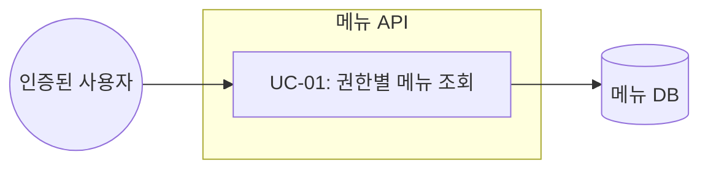
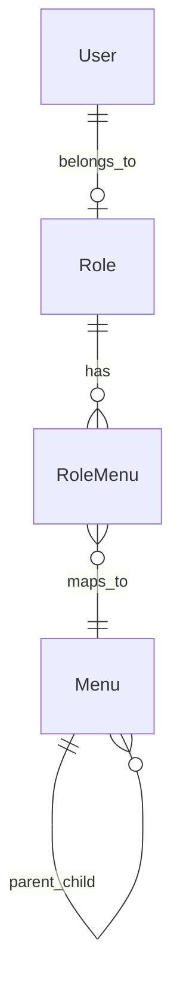

# TSK-03-03 - 메뉴 API 엔드포인트 설계 문서

## 문서 정보

| 항목 | 내용 |
|------|------|
| Task ID | TSK-03-03 |
| 문서 버전 | 1.0 |
| 작성일 | 2026-01-20 |
| 상태 | 작성중 |
| 카테고리 | development |

---

## 1. 개요

### 1.1 배경 및 문제 정의

**현재 상황:**
- MES Portal은 DB 기반 동적 메뉴 시스템을 필요로 함
- TSK-03-01에서 메뉴 데이터 모델이 구현됨
- TSK-03-02에서 역할-메뉴 매핑이 구현됨
- 프론트엔드에서 메뉴 데이터를 가져올 API 엔드포인트가 필요함

**해결하려는 문제:**
- 인증된 사용자의 역할에 맞는 메뉴만 필터링하여 제공
- 계층형 메뉴 구조를 트리 형태로 응답하여 프론트엔드에서 쉽게 렌더링

### 1.2 목적 및 기대 효과

**목적:**
- 권한별 메뉴 목록을 제공하는 REST API 구현
- 계층형 메뉴 데이터를 트리 구조로 변환하여 응답

**기대 효과:**
- 사용자 역할에 따른 메뉴 접근 제어 실현
- 프론트엔드 사이드바 메뉴 컴포넌트가 API 데이터를 직접 사용 가능
- 메뉴 변경 시 DB만 수정하면 즉시 반영

### 1.3 범위

**포함:**
- GET /api/menus API 엔드포인트 구현
- Auth.js 세션 기반 인증 확인
- 역할별 메뉴 필터링 로직
- 계층형 메뉴 트리 변환 로직

**제외:**
- 메뉴 CRUD API (관리자용, 별도 Task)
- 즐겨찾기 메뉴 API (TSK-03-04)
- 메뉴 권한 관리 UI

### 1.4 참조 문서

| 문서 | 경로 | 관련 섹션 |
|------|------|----------|
| PRD | `.orchay/projects/mes-portal/prd.md` | 4.1.1 동적 메뉴 시스템 |
| TRD | `.orchay/projects/mes-portal/trd.md` | 2.3 MVP API Routes |

---

## 2. 사용자 분석

### 2.1 대상 사용자

| 사용자 유형 | 특성 | 주요 니즈 |
|------------|------|----------|
| 관리자 (ADMIN) | 시스템 전체 관리 | 모든 메뉴에 접근 |
| 관리자 (MANAGER) | 생산/품질 관리 | 대시보드, 생산 관리, 품질 관리 메뉴 |
| 운영자 (OPERATOR) | 현장 작업 | 생산 실적 입력, 기본 조회 메뉴 |

### 2.2 사용자 페르소나

**페르소나 1: 공장장 김철수**
- 역할: MANAGER
- 목표: 전체 생산 현황 파악 및 관리
- 불만: 불필요한 메뉴가 보이면 화면이 복잡해짐
- 시나리오: 로그인 후 자신의 역할에 맞는 메뉴만 보고 싶음

**페르소나 2: 생산 담당자 이영희**
- 역할: OPERATOR
- 목표: 빠르게 생산 실적 입력
- 불만: 접근 권한 없는 메뉴 클릭 시 에러 발생
- 시나리오: 자신이 사용할 수 있는 메뉴만 보고 싶음

---

## 3. 유즈케이스

### 3.1 유즈케이스 다이어그램



### 3.2 유즈케이스 상세

#### UC-01: 권한별 메뉴 조회

| 항목 | 내용 |
|------|------|
| 액터 | 인증된 사용자 |
| 목적 | 자신의 역할에 맞는 메뉴 목록 조회 |
| 사전 조건 | 사용자가 로그인되어 유효한 세션 보유 |
| 사후 조건 | 계층형 메뉴 트리 데이터 반환 |
| 트리거 | 포털 페이지 진입 시 또는 메뉴 새로고침 시 |

**기본 흐름:**
1. 프론트엔드가 GET /api/menus 요청
2. 서버가 Auth.js 세션에서 사용자 정보 확인
3. 사용자의 역할(roleId) 조회
4. 역할에 매핑된 메뉴 목록 조회 (RoleMenu)
5. 메뉴를 계층형 트리 구조로 변환
6. JSON 응답 반환

**대안 흐름:**
- 2a. 세션이 없거나 만료된 경우:
  - 401 Unauthorized 응답 반환
  - 프론트엔드가 로그인 페이지로 리다이렉트

**예외 흐름:**
- 3a. 사용자 정보를 찾을 수 없는 경우:
  - 404 Not Found 응답 반환
- 4a. 역할에 매핑된 메뉴가 없는 경우:
  - 빈 배열 반환 (정상 응답)

---

## 4. API 명세

### 4.1 엔드포인트 정의

| 항목 | 내용 |
|------|------|
| Method | GET |
| Path | /api/menus |
| 인증 | 필수 (Auth.js 세션) |
| Content-Type | application/json |

### 4.2 요청

**Headers:**
```
Cookie: next-auth.session-token=<session_token>
```

**Query Parameters:** 없음

### 4.3 응답

**성공 응답 (200 OK):**
```typescript
interface MenuResponse {
  success: true;
  data: MenuItem[];
}

interface MenuItem {
  id: number;
  code: string;
  name: string;
  path: string | null;  // null이면 폴더
  icon: string | null;
  sortOrder: number;
  children: MenuItem[];  // 하위 메뉴
}
```

**응답 예시:**
```json
{
  "success": true,
  "data": [
    {
      "id": 1,
      "code": "DASHBOARD",
      "name": "대시보드",
      "path": "/portal/dashboard",
      "icon": "DashboardOutlined",
      "sortOrder": 1,
      "children": []
    },
    {
      "id": 2,
      "code": "PRODUCTION",
      "name": "생산 관리",
      "path": null,
      "icon": "ToolOutlined",
      "sortOrder": 2,
      "children": [
        {
          "id": 3,
          "code": "WORK_ORDER",
          "name": "작업 지시",
          "path": "/portal/production/work-order",
          "icon": "FileTextOutlined",
          "sortOrder": 1,
          "children": []
        },
        {
          "id": 4,
          "code": "PRODUCTION_RESULT",
          "name": "생산 실적",
          "path": "/portal/production/result",
          "icon": "BarChartOutlined",
          "sortOrder": 2,
          "children": []
        }
      ]
    }
  ]
}
```

**에러 응답:**

| 상태 코드 | 상황 | 응답 |
|----------|------|------|
| 401 | 인증 안됨 | `{ "success": false, "error": { "code": "UNAUTHORIZED", "message": "인증이 필요합니다" } }` |
| 404 | 사용자 없음 | `{ "success": false, "error": { "code": "USER_NOT_FOUND", "message": "사용자를 찾을 수 없습니다" } }` |
| 500 | 서버 오류 | `{ "success": false, "error": { "code": "INTERNAL_ERROR", "message": "서버 오류가 발생했습니다" } }` |

---

## 5. 데이터 요구사항

### 5.1 필요한 데이터

| 데이터 | 설명 | 출처 | 용도 |
|--------|------|------|------|
| User | 현재 로그인 사용자 | Auth.js 세션 | roleId 확인 |
| Menu | 메뉴 마스터 | menus 테이블 | 메뉴 정보 |
| RoleMenu | 역할-메뉴 매핑 | role_menus 테이블 | 권한 필터링 |

### 5.2 데이터 관계



**관계 설명:**
- 사용자는 하나의 역할(Role)에 속함
- 역할은 여러 개의 RoleMenu 매핑을 가짐
- RoleMenu는 역할과 메뉴를 다대다로 연결
- 메뉴는 자기참조로 부모-자식 계층 구성

### 5.3 쿼리 로직

```typescript
// 1. 세션에서 사용자 ID 추출
const session = await auth();
const userId = session?.user?.id;

// 2. 사용자의 역할 조회
const user = await prisma.user.findUnique({
  where: { id: userId },
  select: { roleId: true }
});

// 3. 역할에 매핑된 활성 메뉴 조회
const menus = await prisma.menu.findMany({
  where: {
    isActive: true,
    roleMenus: {
      some: {
        roleId: user.roleId
      }
    }
  },
  orderBy: [
    { parentId: 'asc' },
    { sortOrder: 'asc' }
  ]
});

// 4. 플랫 배열을 트리 구조로 변환
const menuTree = buildMenuTree(menus);
```

---

## 6. 비즈니스 규칙

### 6.1 핵심 규칙

| 규칙 ID | 규칙 설명 | 적용 상황 | 예외 |
|---------|----------|----------|------|
| BR-01 | 인증된 사용자만 메뉴 조회 가능 | 모든 요청 | 없음 |
| BR-02 | 역할에 매핑된 메뉴만 반환 | 메뉴 조회 시 | ADMIN은 전체 메뉴 |
| BR-03 | 비활성(isActive=false) 메뉴 제외 | 메뉴 조회 시 | 없음 |
| BR-04 | sortOrder 순서로 정렬 | 메뉴 반환 시 | 없음 |
| BR-05 | 부모 메뉴 권한 없으면 자식도 제외 | 계층 구성 시 | 없음 |

### 6.2 규칙 상세 설명

**BR-01: 인증 필수**
- Auth.js 세션 토큰이 유효해야 함
- 세션 만료 시 401 응답

**BR-02: 역할별 메뉴 필터링**
- RoleMenu 테이블에서 roleId로 조회
- 해당 역할에 매핑된 menuId만 포함
- ADMIN 역할은 모든 활성 메뉴 반환 가능 (선택적 구현)

**BR-05: 계층 권한 상속**
- 부모 메뉴가 권한 목록에 없으면 자식 메뉴도 반환하지 않음
- 예: "생산 관리" 폴더 권한 없으면 하위 "작업 지시" 메뉴도 제외

---

## 7. 에러 처리

### 7.1 예상 에러 상황

| 상황 | 원인 | HTTP 상태 | 에러 코드 | 사용자 메시지 |
|------|------|----------|----------|--------------|
| 미인증 | 세션 없음/만료 | 401 | UNAUTHORIZED | 인증이 필요합니다 |
| 사용자 없음 | DB에 사용자 없음 | 404 | USER_NOT_FOUND | 사용자를 찾을 수 없습니다 |
| DB 오류 | 연결 실패 등 | 500 | INTERNAL_ERROR | 서버 오류가 발생했습니다 |

### 7.2 에러 응답 형식

```typescript
interface ApiError {
  success: false;
  error: {
    code: string;
    message: string;
    details?: Record<string, string[]>;
  }
}
```

---

## 8. 기술 구현 명세

### 8.1 파일 구조

```
mes-portal/
├── app/
│   └── api/
│       └── menus/
│           └── route.ts    # GET /api/menus
├── lib/
│   ├── auth.ts             # Auth.js 설정 (기존)
│   ├── prisma.ts           # Prisma 클라이언트 (기존)
│   └── services/
│       └── menu.service.ts # 메뉴 비즈니스 로직
└── types/
    └── menu.ts             # 메뉴 관련 타입 정의
```

### 8.2 타입 정의

```typescript
// types/menu.ts

// API 응답용 메뉴 아이템
export interface MenuItem {
  id: number;
  code: string;
  name: string;
  path: string | null;
  icon: string | null;
  sortOrder: number;
  children: MenuItem[];
}

// API 응답
export interface MenuResponse {
  success: true;
  data: MenuItem[];
}
```

### 8.3 서비스 레이어

```typescript
// lib/services/menu.service.ts

import { prisma } from '@/lib/prisma';
import type { MenuItem } from '@/types/menu';

export async function getMenusByRoleId(roleId: number): Promise<MenuItem[]> {
  // 1. 역할에 매핑된 활성 메뉴 조회
  const menus = await prisma.menu.findMany({
    where: {
      isActive: true,
      roleMenus: {
        some: { roleId }
      }
    },
    orderBy: [
      { parentId: 'asc' },
      { sortOrder: 'asc' }
    ],
    select: {
      id: true,
      code: true,
      name: true,
      path: true,
      icon: true,
      parentId: true,
      sortOrder: true
    }
  });

  // 2. 트리 구조로 변환
  return buildMenuTree(menus);
}

function buildMenuTree(flatMenus: FlatMenu[]): MenuItem[] {
  const menuMap = new Map<number, MenuItem>();
  const roots: MenuItem[] = [];

  // 1차: 모든 메뉴를 Map에 저장
  for (const menu of flatMenus) {
    menuMap.set(menu.id, {
      id: menu.id,
      code: menu.code,
      name: menu.name,
      path: menu.path,
      icon: menu.icon,
      sortOrder: menu.sortOrder,
      children: []
    });
  }

  // 2차: 부모-자식 관계 구성
  for (const menu of flatMenus) {
    const node = menuMap.get(menu.id)!;
    if (menu.parentId === null) {
      roots.push(node);
    } else {
      const parent = menuMap.get(menu.parentId);
      if (parent) {
        parent.children.push(node);
      }
    }
  }

  return roots;
}
```

### 8.4 API Route 구현

```typescript
// app/api/menus/route.ts

import { NextResponse } from 'next/server';
import { auth } from '@/lib/auth';
import { prisma } from '@/lib/prisma';
import { getMenusByRoleId } from '@/lib/services/menu.service';

export async function GET() {
  try {
    // 1. 인증 확인
    const session = await auth();
    if (!session?.user?.id) {
      return NextResponse.json(
        {
          success: false,
          error: {
            code: 'UNAUTHORIZED',
            message: '인증이 필요합니다'
          }
        },
        { status: 401 }
      );
    }

    // 2. 사용자 역할 조회
    const user = await prisma.user.findUnique({
      where: { id: Number(session.user.id) },
      select: { roleId: true }
    });

    if (!user) {
      return NextResponse.json(
        {
          success: false,
          error: {
            code: 'USER_NOT_FOUND',
            message: '사용자를 찾을 수 없습니다'
          }
        },
        { status: 404 }
      );
    }

    // 3. 역할별 메뉴 조회
    const menus = await getMenusByRoleId(user.roleId);

    // 4. 성공 응답
    return NextResponse.json({
      success: true,
      data: menus
    });

  } catch (error) {
    console.error('Menu API Error:', error);
    return NextResponse.json(
      {
        success: false,
        error: {
          code: 'INTERNAL_ERROR',
          message: '서버 오류가 발생했습니다'
        }
      },
      { status: 500 }
    );
  }
}
```

---

## 9. 연관 문서

> 상세 테스트 명세 및 요구사항 추적은 별도 문서에서 관리합니다.

| 문서 | 경로 | 용도 |
|------|------|------|
| 요구사항 추적 매트릭스 | `025-traceability-matrix.md` | PRD → 설계 → 테스트 양방향 추적 |
| 테스트 명세서 | `026-test-specification.md` | 단위/E2E/매뉴얼 테스트 상세 정의 |

---

## 10. 구현 범위

### 10.1 영향받는 영역

| 영역 | 변경 내용 | 영향도 |
|------|----------|--------|
| app/api/menus/route.ts | 신규 생성 | 높음 |
| lib/services/menu.service.ts | 신규 생성 | 중간 |
| types/menu.ts | 신규 생성 | 낮음 |
| components/layout/Sidebar.tsx | API 연동 (향후) | 중간 |

### 10.2 의존성

| 의존 항목 | 이유 | 상태 |
|----------|------|------|
| TSK-03-01 메뉴 데이터 모델 | Menu 테이블 필요 | 대기 |
| TSK-03-02 역할-메뉴 매핑 | RoleMenu 테이블 필요 | 대기 |
| TSK-04-03 Auth.js 설정 | 인증 세션 필요 | 대기 |

### 10.3 제약 사항

| 제약 | 설명 | 대응 방안 |
|------|------|----------|
| 인증 의존성 | Auth.js 설정 완료 필요 | TSK-04-03 완료 후 구현 |
| DB 스키마 의존성 | Menu, RoleMenu 테이블 필요 | TSK-03-01, 03-02 완료 후 구현 |

---

## 11. 체크리스트

### 11.1 설계 완료 확인

- [x] 문제 정의 및 목적 명확화
- [x] 사용자 분석 완료
- [x] 유즈케이스 정의 완료
- [x] API 명세 정의 완료
- [x] 데이터 요구사항 정의 완료
- [x] 비즈니스 규칙 정의 완료
- [x] 에러 처리 정의 완료
- [x] 기술 구현 명세 완료

### 11.2 연관 문서 작성

- [ ] 요구사항 추적 매트릭스 작성 (→ `025-traceability-matrix.md`)
- [ ] 테스트 명세서 작성 (→ `026-test-specification.md`)

### 11.3 구현 준비

- [x] 구현 우선순위 결정 (의존성 완료 후)
- [x] 의존성 확인 완료
- [x] 제약 사항 검토 완료

---

## 변경 이력

| 버전 | 일자 | 작성자 | 변경 내용 |
|------|------|--------|----------|
| 1.0 | 2026-01-20 | Claude | 최초 작성 |
