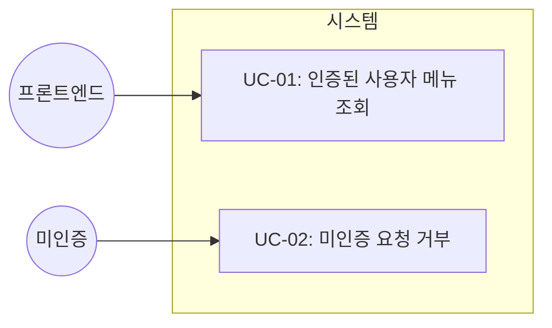
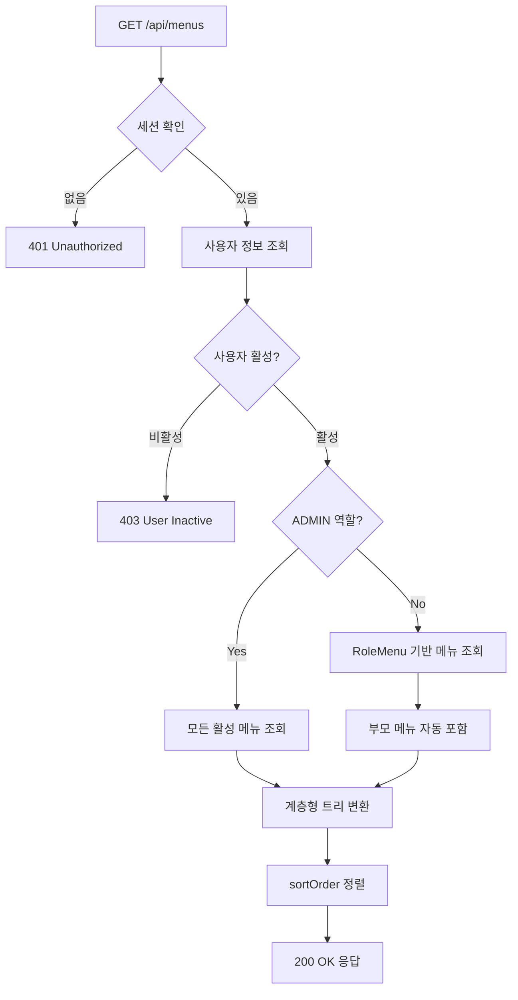

# TSK-03-03 - 메뉴 API 엔드포인트 설계 문서

## 문서 정보

| 항목 | 내용 |
|------|------|
| Task ID | TSK-03-03 |
| 문서 버전 | 1.0 |
| 작성일 | 2026-01-20 |
| 상태 | 작성중 |
| 카테고리 | development |

---

## 1. 개요

### 1.1 배경 및 문제 정의

**현재 상황:**
- TSK-03-01에서 Menu 테이블 스키마가 정의됨
- TSK-03-02에서 RoleMenu 테이블 및 역할-메뉴 매핑 규칙이 정의됨
- 프론트엔드 사이드바 컴포넌트에서 메뉴 데이터를 가져올 API가 필요함

**해결하려는 문제:**
- 인증된 사용자만 메뉴를 조회할 수 있어야 함
- 사용자 역할에 따라 허용된 메뉴만 응답해야 함
- 계층형 메뉴 트리 구조로 응답해야 함

### 1.2 목적 및 기대 효과

**목적:**
- GET /api/menus API 엔드포인트 구현
- Auth.js 세션 기반 인증 검증
- 역할 기반 메뉴 필터링 및 계층형 응답

**기대 효과:**
- 프론트엔드에서 사용자별 맞춤 메뉴 렌더링 가능
- 권한 없는 메뉴가 API 수준에서 제외되어 보안 강화
- 일관된 API 응답 형식으로 클라이언트 구현 단순화

### 1.3 범위

**포함:**
- GET /api/menus API 엔드포인트 (권한별 메뉴 목록)
- 계층형 메뉴 트리 변환 유틸리티
- 인증 필수 (미인증 시 401)
- ADMIN 역할은 모든 메뉴 반환
- 일반 역할은 RoleMenu 기반 필터링

**제외:**
- 메뉴 CRUD API (POST/PUT/DELETE) - 관리자 화면 구현 시 추가
- 즐겨찾기 메뉴 API (TSK-03-04에서 구현)

### 1.4 참조 문서

| 문서 | 경로 | 관련 섹션 |
|------|------|----------|
| PRD | `.orchay/projects/mes-portal/prd.md` | 4.1.1 동적 메뉴 시스템 |
| TRD | `.orchay/projects/mes-portal/trd.md` | 2.3 MVP API Routes |
| TSK-03-01 설계서 | `.orchay/projects/mes-portal/tasks/TSK-03-01/010-design.md` | 메뉴 데이터 모델 |
| TSK-03-02 설계서 | `.orchay/projects/mes-portal/tasks/TSK-03-02/010-design.md` | 역할-메뉴 매핑 |

---

## 2. 사용자 분석

### 2.1 대상 사용자

| 사용자 유형 | 특성 | 주요 니즈 |
|------------|------|----------|
| 프론트엔드 앱 | 사이드바 컴포넌트 | 계층형 메뉴 데이터 |
| 관리자 (ADMIN) | 시스템 전체 관리 | 모든 메뉴 접근 |
| 매니저 (MANAGER) | 생산 관리 담당 | 생산/품질 관련 메뉴 |
| 운영자 (OPERATOR) | 현장 작업자 | 작업 지시/실적 메뉴 |

### 2.2 사용자 페르소나

**페르소나 1: 사이드바 컴포넌트**
- 역할: UI 컴포넌트
- 목표: 페이지 로드 시 메뉴 데이터 획득
- 불만: 복잡한 응답 구조, 느린 응답
- 시나리오: 포털 진입 시 API 호출하여 메뉴 트리 렌더링

**페르소나 2: 일반 사용자**
- 역할: 생산 담당자
- 목표: 자신의 역할에 맞는 메뉴만 보기
- 불만: 권한 없는 메뉴가 표시되면 혼란
- 시나리오: 로그인 후 자신의 업무에 필요한 메뉴만 표시

---

## 3. 유즈케이스

### 3.1 유즈케이스 다이어그램



### 3.2 유즈케이스 상세

#### UC-01: 인증된 사용자 메뉴 조회

| 항목 | 내용 |
|------|------|
| 액터 | 인증된 사용자 (via 프론트엔드) |
| 목적 | 사용자 역할에 맞는 메뉴 목록 조회 |
| 사전 조건 | 사용자가 로그인하여 세션이 유효함 |
| 사후 조건 | 역할에 허용된 메뉴가 계층형으로 반환됨 |
| 트리거 | GET /api/menus 요청 |

**기본 흐름:**
1. 프론트엔드가 GET /api/menus 요청
2. 서버가 Auth.js 세션에서 사용자 정보 추출
3. 서버가 사용자의 역할 정보 조회
4. ADMIN 역할인 경우 모든 활성 메뉴 조회
5. 일반 역할인 경우 RoleMenu 기반 필터링
6. 부모 메뉴 자동 포함 (BR-02 규칙 적용)
7. flat 데이터를 계층형 트리로 변환
8. sortOrder 기준 정렬된 트리 응답

**대안 흐름:**
- 4a. 사용자에게 매핑된 메뉴가 없는 경우:
  - 빈 배열 [] 응답
  - success: true, data: []

#### UC-02: 미인증 요청 거부

| 항목 | 내용 |
|------|------|
| 액터 | 미인증 요청자 |
| 목적 | 인증 없는 접근 차단 |
| 사전 조건 | 세션이 없거나 만료됨 |
| 사후 조건 | 401 Unauthorized 응답 |
| 트리거 | GET /api/menus 요청 (인증 없이) |

**기본 흐름:**
1. 프론트엔드가 GET /api/menus 요청 (인증 헤더 없음)
2. 서버가 세션 확인 시 null 반환
3. 서버가 401 Unauthorized 응답

---

## 4. 사용자 시나리오

### 4.1 시나리오 1: 관리자 로그인 후 메뉴 로딩

**상황 설명:**
관리자가 포털에 로그인하면 모든 메뉴가 표시되어야 한다.

**단계별 진행:**

| 단계 | 사용자 행동 | 시스템 반응 | 사용자 기대 |
|------|-----------|------------|------------|
| 1 | 관리자 계정으로 로그인 | 세션 생성, 포털 리다이렉트 | 포털 메인 화면 |
| 2 | - | 사이드바가 GET /api/menus 호출 | - |
| 3 | - | 모든 활성 메뉴 계층형 응답 | - |
| 4 | 사이드바 확인 | 전체 메뉴 트리 렌더링 | 대시보드, 생산관리, 시스템관리 등 모두 표시 |

**성공 조건:**
- 모든 활성 메뉴가 계층형으로 표시됨
- 시스템 관리 메뉴 포함

### 4.2 시나리오 2: 운영자 로그인 후 메뉴 로딩

**상황 설명:**
운영자가 포털에 로그인하면 허용된 메뉴만 표시되어야 한다.

**단계별 진행:**

| 단계 | 사용자 행동 | 시스템 반응 | 사용자 기대 |
|------|-----------|------------|------------|
| 1 | 운영자 계정으로 로그인 | 세션 생성, 포털 리다이렉트 | 포털 메인 화면 |
| 2 | - | 사이드바가 GET /api/menus 호출 | - |
| 3 | - | RoleMenu 필터링 적용, 부모 메뉴 자동 포함 | - |
| 4 | 사이드바 확인 | 허용된 메뉴만 렌더링 | 대시보드, 생산관리(작업지시, 생산실적만) 표시 |

**성공 조건:**
- 대시보드 표시
- 생산 관리 폴더 표시 (자식 메뉴 권한으로 자동 포함)
- 작업 지시, 생산 실적 표시
- 시스템 관리 메뉴 미표시

### 4.3 시나리오 3: 미인증 상태 접근

**상황 설명:**
인증 없이 API에 직접 접근하면 거부되어야 한다.

**단계별 진행:**

| 단계 | 사용자 행동 | 시스템 반응 | 복구 방법 |
|------|-----------|------------|----------|
| 1 | curl로 /api/menus 호출 | 세션 없음 확인 | - |
| 2 | - | 401 Unauthorized 응답 | 로그인 후 재시도 |

---

## 5. API 설계

### 5.1 엔드포인트 명세

**GET /api/menus**

| 항목 | 내용 |
|------|------|
| URL | `/api/menus` |
| Method | GET |
| 인증 | 필수 (Auth.js 세션) |
| 권한 | 로그인한 모든 사용자 |

### 5.2 요청

**Headers:**
```
Cookie: next-auth.session-token=xxx
```

**Query Parameters:** 없음

### 5.3 응답

**성공 응답 (200 OK):**
```typescript
interface MenuResponse {
  success: true
  data: MenuItem[]
}

interface MenuItem {
  id: number
  code: string
  name: string
  path: string | null
  icon: string | null
  sortOrder: number
  children: MenuItem[]
}
```

**응답 예시:**
```json
{
  "success": true,
  "data": [
    {
      "id": 1,
      "code": "DASHBOARD",
      "name": "대시보드",
      "path": null,
      "icon": "DashboardOutlined",
      "sortOrder": 1,
      "children": [
        {
          "id": 2,
          "code": "DASHBOARD_MAIN",
          "name": "메인 대시보드",
          "path": "/portal/dashboard",
          "icon": "BarChartOutlined",
          "sortOrder": 1,
          "children": []
        }
      ]
    },
    {
      "id": 10,
      "code": "PRODUCTION",
      "name": "생산 관리",
      "path": null,
      "icon": "ToolOutlined",
      "sortOrder": 2,
      "children": [
        {
          "id": 11,
          "code": "WORK_ORDER",
          "name": "작업 지시",
          "path": "/portal/production/work-order",
          "icon": "FileTextOutlined",
          "sortOrder": 1,
          "children": []
        }
      ]
    }
  ]
}
```

**에러 응답:**

| HTTP 상태 | 에러 코드 | 메시지 | 상황 |
|----------|----------|--------|------|
| 401 | UNAUTHORIZED | 인증이 필요합니다 | 세션 없음/만료 |
| 403 | USER_INACTIVE | 비활성화된 사용자입니다 | isActive=false |
| 500 | DB_ERROR | 데이터베이스 오류가 발생했습니다 | DB 연결 실패 |

**에러 응답 형식:**
```json
{
  "success": false,
  "error": {
    "code": "UNAUTHORIZED",
    "message": "인증이 필요합니다"
  }
}
```

### 5.4 구현 로직 흐름



### 5.5 핵심 구현 코드

```typescript
// app/api/menus/route.ts

import { NextResponse } from 'next/server'
import { auth } from '@/lib/auth'
import { prisma } from '@/lib/prisma'

// 상수 정의
const SYSTEM_ADMIN_ROLE_ID = 1

// 메뉴 응답 타입
interface MenuItem {
  id: number
  code: string
  name: string
  path: string | null
  icon: string | null
  sortOrder: number
  children: MenuItem[]
}

// 계층형 트리 변환 함수
function buildMenuTree(
  menus: Array<{
    id: number
    code: string
    name: string
    path: string | null
    icon: string | null
    sortOrder: number
    parentId: number | null
  }>
): MenuItem[] {
  const menuMap = new Map<number, MenuItem>()
  const rootMenus: MenuItem[] = []

  // 1. 모든 메뉴를 Map에 저장 (children 초기화)
  for (const menu of menus) {
    menuMap.set(menu.id, {
      id: menu.id,
      code: menu.code,
      name: menu.name,
      path: menu.path,
      icon: menu.icon,
      sortOrder: menu.sortOrder,
      children: []
    })
  }

  // 2. 부모-자식 관계 설정
  for (const menu of menus) {
    const menuItem = menuMap.get(menu.id)!
    if (menu.parentId === null) {
      rootMenus.push(menuItem)
    } else {
      const parent = menuMap.get(menu.parentId)
      if (parent) {
        parent.children.push(menuItem)
      }
    }
  }

  // 3. 각 레벨에서 sortOrder로 정렬
  const sortMenus = (items: MenuItem[]): MenuItem[] => {
    items.sort((a, b) => a.sortOrder - b.sortOrder)
    for (const item of items) {
      sortMenus(item.children)
    }
    return items
  }

  return sortMenus(rootMenus)
}

// 부모 메뉴 ID 수집 함수 (BR-02 규칙)
function collectParentIds(
  menuIds: number[],
  allMenus: Array<{ id: number; parentId: number | null }>
): Set<number> {
  const result = new Set(menuIds)
  const menuMap = new Map(allMenus.map(m => [m.id, m.parentId]))

  for (const menuId of menuIds) {
    let parentId = menuMap.get(menuId)
    while (parentId !== null && parentId !== undefined) {
      result.add(parentId)
      parentId = menuMap.get(parentId)
    }
  }

  return result
}

export async function GET() {
  try {
    // 1. 세션 확인
    const session = await auth()
    if (!session?.user?.id) {
      return NextResponse.json(
        { success: false, error: { code: 'UNAUTHORIZED', message: '인증이 필요합니다' } },
        { status: 401 }
      )
    }

    // 2. 사용자 정보 조회
    const user = await prisma.user.findUnique({
      where: { id: parseInt(session.user.id) },
      include: { role: true }
    })

    if (!user || !user.isActive) {
      return NextResponse.json(
        { success: false, error: { code: 'USER_INACTIVE', message: '비활성화된 사용자입니다' } },
        { status: 403 }
      )
    }

    // 3. 모든 활성 메뉴 조회 (공통)
    const allMenus = await prisma.menu.findMany({
      where: { isActive: true },
      select: {
        id: true,
        code: true,
        name: true,
        path: true,
        icon: true,
        sortOrder: true,
        parentId: true
      }
    })

    // 4. ADMIN 역할인 경우 모든 메뉴 반환
    if (user.role.id === SYSTEM_ADMIN_ROLE_ID) {
      const tree = buildMenuTree(allMenus)
      return NextResponse.json({ success: true, data: tree })
    }

    // 5. 일반 역할: RoleMenu 기반 필터링
    const roleMenus = await prisma.roleMenu.findMany({
      where: { roleId: user.roleId },
      select: { menuId: true }
    })

    const allowedMenuIds = roleMenus.map(rm => rm.menuId)

    // 6. 부모 메뉴 자동 포함 (BR-02)
    const expandedMenuIds = collectParentIds(allowedMenuIds, allMenus)

    // 7. 필터링된 메뉴로 트리 구축
    const filteredMenus = allMenus.filter(m => expandedMenuIds.has(m.id))
    const tree = buildMenuTree(filteredMenus)

    return NextResponse.json({ success: true, data: tree })

  } catch (error) {
    console.error('Menu API Error:', error)
    return NextResponse.json(
      { success: false, error: { code: 'DB_ERROR', message: '데이터베이스 오류가 발생했습니다' } },
      { status: 500 }
    )
  }
}
```

---

## 6. 비즈니스 규칙

### 6.1 핵심 규칙

| 규칙 ID | 규칙 설명 | 적용 상황 | 예외 |
|---------|----------|----------|------|
| BR-01 | 인증된 사용자만 메뉴 조회 가능 | API 호출 시 | 없음 |
| BR-02 | 자식 메뉴 권한 있으면 부모 메뉴 자동 표시 | 트리 구축 시 | 없음 |
| BR-03 | ADMIN(Role ID=1)은 모든 메뉴 접근 | 권한 체크 시 | 없음 |
| BR-04 | isActive=false인 메뉴는 제외 | 메뉴 조회 시 | 없음 |
| BR-05 | sortOrder 오름차순 정렬 | 트리 구축 시 | 없음 |

### 6.2 규칙 상세 설명

**BR-01: 인증 필수**

설명: 메뉴 API는 반드시 인증된 사용자만 호출할 수 있습니다. Auth.js 세션을 통해 검증합니다.

검증 방법:
```typescript
const session = await auth()
if (!session?.user?.id) {
  return 401 Unauthorized
}
```

**BR-02: 부모 메뉴 자동 포함**

설명: TSK-03-02에서 정의된 규칙. 자식 메뉴에 권한이 있으면 부모 메뉴(폴더)도 자동으로 응답에 포함됩니다.

예시:
- OPERATOR에게 작업지시(id=11), 생산실적(id=13) 권한만 있는 경우
- 생산관리(id=10) 폴더도 자동 포함하여 트리 구조 유지

**BR-03: ADMIN 전체 접근**

설명: ADMIN 역할(Role ID=1)은 RoleMenu 필터링 없이 모든 활성 메뉴에 접근합니다.

보안 고려:
- 문자열 비교(`role.code === 'ADMIN'`) 대신 ID 기반 검증
- SYSTEM_ADMIN_ROLE_ID 상수로 관리

---

## 7. 에러 처리

### 7.1 예상 에러 상황

| 상황 | 원인 | HTTP 상태 | 에러 코드 | 복구 방법 |
|------|------|----------|----------|----------|
| 미인증 | 세션 없음/만료 | 401 | UNAUTHORIZED | 로그인 후 재시도 |
| 비활성 사용자 | user.isActive=false | 403 | USER_INACTIVE | 관리자 문의 |
| DB 오류 | 연결 실패 | 500 | DB_ERROR | 잠시 후 재시도 |

### 7.2 에러 응답 형식

```json
{
  "success": false,
  "error": {
    "code": "ERROR_CODE",
    "message": "사용자 친화적 메시지"
  }
}
```

---

## 8. 데이터 요구사항

### 8.1 입력 데이터

| 데이터 | 설명 | 출처 | 용도 |
|--------|------|------|------|
| 세션 토큰 | Auth.js 세션 쿠키 | 요청 헤더 | 사용자 인증 |
| 사용자 ID | 세션에서 추출 | Auth.js | 역할 조회 |

### 8.2 출력 데이터

| 데이터 | 설명 | 형식 | 용도 |
|--------|------|------|------|
| 메뉴 트리 | 계층형 메뉴 구조 | MenuItem[] | 사이드바 렌더링 |

### 8.3 의존 테이블

| 테이블 | 용도 | 참조 컬럼 |
|--------|------|----------|
| users | 사용자 정보 | id, roleId, isActive |
| roles | 역할 정보 | id |
| menus | 메뉴 목록 | id, code, name, path, icon, parentId, sortOrder, isActive |
| role_menus | 역할-메뉴 매핑 | roleId, menuId |

---

## 9. 구현 범위

### 9.1 영향받는 영역

| 영역 | 변경 내용 | 영향도 |
|------|----------|--------|
| app/api/menus/route.ts | API 엔드포인트 생성 | 높음 |
| lib/types/menu.ts | MenuItem 타입 정의 (선택) | 낮음 |

### 9.2 의존성

| 의존 항목 | 이유 | 상태 |
|----------|------|------|
| TSK-03-01 (Menu 테이블) | Menu 데이터 필요 | 필요 |
| TSK-03-02 (RoleMenu 테이블) | 역할-메뉴 매핑 필요 | 필요 |
| TSK-04-03 (Auth.js) | 세션 인증 필요 | 필요 |

### 9.3 제약 사항

| 제약 | 설명 | 대응 방안 |
|------|------|----------|
| 의존 Task 미완료 | DB 스키마 및 인증 설정 필요 | 의존 Task 완료 후 구현 |

---

## 10. 연관 문서

| 문서 | 경로 | 용도 |
|------|------|------|
| 요구사항 추적 매트릭스 | `025-traceability-matrix.md` | PRD → 설계 → 테스트 양방향 추적 |
| 테스트 명세서 | `026-test-specification.md` | 단위/E2E/매뉴얼 테스트 상세 정의 |

---

## 11. 체크리스트

### 11.1 설계 완료 확인

- [x] 문제 정의 및 목적 명확화
- [x] 사용자 분석 완료
- [x] 유즈케이스 정의 완료
- [x] 사용자 시나리오 작성 완료
- [x] API 설계 완료 (엔드포인트, 요청/응답)
- [x] 비즈니스 규칙 정의 완료
- [x] 에러 처리 정의 완료
- [x] 데이터 요구사항 정의 완료

### 11.2 연관 문서 작성

- [ ] 요구사항 추적 매트릭스 작성 (→ `025-traceability-matrix.md`)
- [ ] 테스트 명세서 작성 (→ `026-test-specification.md`)

### 11.3 구현 준비

- [x] 구현 우선순위 결정
- [x] 의존성 확인 완료
- [x] 제약 사항 검토 완료

---

## 변경 이력

| 버전 | 일자 | 작성자 | 변경 내용 |
|------|------|--------|----------|
| 1.0 | 2026-01-20 | Claude | 최초 작성 |
