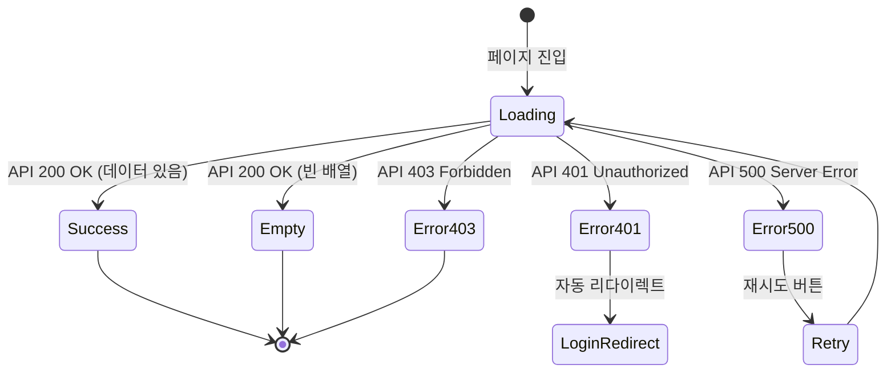

# TSK-03-03 - 메뉴 API 엔드포인트 화면설계 문서

## 문서 정보

| 항목 | 내용 |
|------|------|
| Task ID | TSK-03-03 |
| Task명 | 메뉴 API 엔드포인트 |
| 문서 버전 | 1.0 |
| 작성일 | 2026-01-20 |
| 상태 | 작성완료 |

---

## 1. 화면 개요

> **참고**: 이 Task는 백엔드 API 구현이 주 목적으로, 직접적인 사용자 대면 화면이 없습니다.
> API를 소비하는 프론트엔드 컴포넌트(사이드바)의 상태별 표시를 정의합니다.

### 1.1 화면 목록

| 화면 ID | 화면명 | 목적 | SVG 참조 |
|---------|--------|------|----------|
| SCR-01 | 사이드바 메뉴 (정상) | API 성공 시 메뉴 트리 렌더링 | `screen-01-sidebar-success.svg` |
| SCR-02 | 사이드바 메뉴 (로딩) | API 호출 중 로딩 상태 | `screen-02-sidebar-loading.svg` |
| SCR-03 | 사이드바 메뉴 (빈 상태) | 권한 없는 사용자 | `screen-03-sidebar-empty.svg` |
| SCR-04 | 에러 상태 | API 에러 발생 시 | `screen-04-sidebar-error.svg` |

### 1.2 화면 분류

| 분류 | 화면 | 비고 |
|------|------|------|
| 메뉴 표시 | SCR-01, SCR-02, SCR-03 | 사이드바 컴포넌트 |
| 에러 처리 | SCR-04 | 인증/권한 에러 |

---

## 2. 화면 전환 흐름

### 2.1 상태 다이어그램



### 2.2 액션-화면 매트릭스

| 액션 | 현재 화면 | 다음 화면 | 조건 |
|------|----------|----------|------|
| 페이지 로드 | - | SCR-02 (로딩) | 항상 |
| API 성공 (데이터 있음) | SCR-02 | SCR-01 (정상) | data.length > 0 |
| API 성공 (빈 배열) | SCR-02 | SCR-03 (빈 상태) | data.length === 0 |
| API 401 에러 | SCR-02 | 로그인 페이지 | 세션 만료 |
| API 403 에러 | SCR-02 | SCR-04 (에러) | 비활성 사용자 |
| API 500 에러 | SCR-02 | SCR-04 (에러) | 서버 오류 |
| 재시도 클릭 | SCR-04 | SCR-02 (로딩) | 에러 화면에서 |

---

## 3. 화면별 상세 설계

### 3.1 SCR-01: 사이드바 메뉴 (정상 상태)

#### 레이아웃

```
┌─────────────────────────────┐
│ ┌─────────────────────────┐ │
│ │       로고/앱 이름       │ │
│ └─────────────────────────┘ │
│ ┌─────────────────────────┐ │
│ │ ▼ 대시보드              │ │
│ │    메인 대시보드        │ │
│ │ ▼ 생산 관리             │ │
│ │    작업 지시            │ │
│ │    생산 실적            │ │
│ │    생산 이력            │ │
│ │ ▼ 시스템 관리           │ │
│ │    사용자 관리          │ │
│ │    메뉴 관리            │ │
│ │    권한 관리            │ │
│ └─────────────────────────┘ │
│ ┌─────────────────────────┐ │
│ │    사용자 정보/로그아웃  │ │
│ └─────────────────────────┘ │
└─────────────────────────────┘
```

#### 컴포넌트 목록

| 컴포넌트 | 속성 | 동작 |
|----------|------|------|
| MenuGroup | title, icon, expanded | 클릭 시 펼침/접힘 |
| MenuItem | name, path, icon, active | 클릭 시 페이지 이동 |
| MenuBadge | count (선택) | 알림 수 표시 |

#### 상태별 변화

| 상태 | 표시 내용 | 스타일 |
|------|----------|--------|
| 기본 | 메뉴 트리 전체 표시 | 기본 색상 |
| 호버 | 메뉴 항목 강조 | 배경색 변경 (#F3F4F6) |
| 활성 | 현재 페이지 메뉴 강조 | 파란색 배경 (#EBF5FF) + 왼쪽 테두리 |
| 펼침 | 하위 메뉴 표시 | 애니메이션 펼침 |
| 접힘 | 하위 메뉴 숨김 | 애니메이션 접힘 |

#### 액션 정의

| 트리거 | 결과 | 조건 |
|--------|------|------|
| 폴더 메뉴 클릭 | 하위 메뉴 펼침/접힘 토글 | path === null |
| 리프 메뉴 클릭 | 해당 페이지로 이동 | path !== null |
| 마우스 호버 | 배경색 변경 | 모든 메뉴 항목 |

### 3.2 SCR-02: 사이드바 메뉴 (로딩 상태)

#### 레이아웃

```
┌─────────────────────────────┐
│ ┌─────────────────────────┐ │
│ │       로고/앱 이름       │ │
│ └─────────────────────────┘ │
│ ┌─────────────────────────┐ │
│ │ ░░░░░░░░░░░░░░░░░░░░░░ │ │
│ │ ░░░░░░░░░░░░░░░░░░░░   │ │
│ │ ░░░░░░░░░░░░░░░░░░░░░░ │ │
│ │ ░░░░░░░░░░░░░░░░░░░    │ │
│ │ ░░░░░░░░░░░░░░░░░░░░░░ │ │
│ │ ░░░░░░░░░░░░░░░░░░░    │ │
│ │                        │ │
│ └─────────────────────────┘ │
│ ┌─────────────────────────┐ │
│ │    사용자 정보/로그아웃  │ │
│ └─────────────────────────┘ │
└─────────────────────────────┘
```

#### 컴포넌트 목록

| 컴포넌트 | 속성 | 동작 |
|----------|------|------|
| SkeletonLine | width, height | 펄스 애니메이션 |

#### 스타일

- 스켈레톤 색상: #E5E7EB (gray-200)
- 펄스 애니메이션: 0.8초 주기

### 3.3 SCR-03: 사이드바 메뉴 (빈 상태)

#### 레이아웃

```
┌─────────────────────────────┐
│ ┌─────────────────────────┐ │
│ │       로고/앱 이름       │ │
│ └─────────────────────────┘ │
│ ┌─────────────────────────┐ │
│ │                         │ │
│ │    ┌───────────────┐    │ │
│ │    │   📋 아이콘    │    │ │
│ │    └───────────────┘    │ │
│ │                         │ │
│ │   접근 가능한 메뉴가    │ │
│ │   없습니다.             │ │
│ │                         │ │
│ │   관리자에게 문의하세요  │ │
│ │                         │ │
│ └─────────────────────────┘ │
│ ┌─────────────────────────┐ │
│ │    사용자 정보/로그아웃  │ │
│ └─────────────────────────┘ │
└─────────────────────────────┘
```

#### 컴포넌트 목록

| 컴포넌트 | 속성 | 동작 |
|----------|------|------|
| EmptyIcon | icon="inbox" | 정적 표시 |
| EmptyTitle | text | 주요 메시지 |
| EmptyDescription | text | 보조 메시지 |

### 3.4 SCR-04: 에러 상태

#### 레이아웃

```
┌─────────────────────────────┐
│ ┌─────────────────────────┐ │
│ │       로고/앱 이름       │ │
│ └─────────────────────────┘ │
│ ┌─────────────────────────┐ │
│ │                         │ │
│ │    ┌───────────────┐    │ │
│ │    │   ⚠️ 아이콘    │    │ │
│ │    └───────────────┘    │ │
│ │                         │ │
│ │   메뉴를 불러올 수      │ │
│ │   없습니다.             │ │
│ │                         │ │
│ │   ┌─────────────────┐   │ │
│ │   │    다시 시도     │   │ │
│ │   └─────────────────┘   │ │
│ │                         │ │
│ └─────────────────────────┘ │
│ ┌─────────────────────────┐ │
│ │    사용자 정보/로그아웃  │ │
│ └─────────────────────────┘ │
└─────────────────────────────┘
```

#### 컴포넌트 목록

| 컴포넌트 | 속성 | 동작 |
|----------|------|------|
| ErrorIcon | icon="warning" | 정적 표시 |
| ErrorTitle | text | 에러 메시지 |
| RetryButton | onClick | 클릭 시 API 재호출 |

#### 액션 정의

| 트리거 | 결과 | 조건 |
|--------|------|------|
| 다시 시도 클릭 | API 재호출 → 로딩 상태 | 에러 화면일 때 |

---

## 4. 공통 컴포넌트

### 4.1 사이드바 레이아웃

| 속성 | 값 | 비고 |
|------|---|------|
| 너비 | 256px | 고정 |
| 배경색 | #FFFFFF | 흰색 |
| 테두리 | 1px solid #E5E7EB | 오른쪽 테두리 |
| 높이 | 100vh | 전체 높이 |

### 4.2 메뉴 아이템 스타일

| 상태 | 배경색 | 텍스트 색상 | 왼쪽 테두리 |
|------|--------|------------|------------|
| 기본 | transparent | #374151 | 없음 |
| 호버 | #F3F4F6 | #1F2937 | 없음 |
| 활성 | #EBF5FF | #1D4ED8 | 3px solid #3B82F6 |
| 비활성 | transparent | #9CA3AF | 없음 |

### 4.3 아이콘 사이즈

| 용도 | 크기 |
|------|------|
| 메뉴 아이콘 | 16px |
| 펼침/접힘 화살표 | 12px |
| 상태 아이콘 (빈/에러) | 48px |

---

## 5. 반응형 설계

### 5.1 Breakpoint

| 구분 | 너비 | 사이드바 동작 |
|------|------|--------------|
| Desktop | 1024px 이상 | 항상 표시 (256px) |
| Tablet | 768px ~ 1023px | 접힌 상태 (64px), 아이콘만 표시 |
| Mobile | 767px 이하 | 숨김, 햄버거 메뉴로 토글 |

### 5.2 모바일 사이드바

| 동작 | 설명 |
|------|------|
| 열기 | 햄버거 아이콘 클릭 → 왼쪽에서 슬라이드 |
| 닫기 | 외부 영역 클릭 또는 X 버튼 |
| 오버레이 | 배경 어둡게 (rgba(0,0,0,0.5)) |

---

## 6. 접근성

### 6.1 키보드 네비게이션

| 키 | 동작 |
|---|------|
| Tab | 다음 메뉴 항목으로 이동 |
| Shift+Tab | 이전 메뉴 항목으로 이동 |
| Enter | 메뉴 선택/펼침 토글 |
| Space | 메뉴 선택/펼침 토글 |
| ArrowDown | 다음 메뉴로 이동 |
| ArrowUp | 이전 메뉴로 이동 |
| ArrowRight | 하위 메뉴 펼침 |
| ArrowLeft | 하위 메뉴 접힘 |

### 6.2 ARIA 속성

| 요소 | 속성 | 값 |
|------|------|---|
| 사이드바 | role | navigation |
| 사이드바 | aria-label | 주 메뉴 |
| 메뉴 그룹 | aria-expanded | true/false |
| 메뉴 그룹 | aria-haspopup | true |
| 메뉴 항목 | role | menuitem |
| 활성 메뉴 | aria-current | page |

### 6.3 색상 대비

| 조합 | 대비율 | WCAG 레벨 |
|------|--------|----------|
| 텍스트 (#374151) / 배경 (#FFFFFF) | 7.2:1 | AAA |
| 활성 텍스트 (#1D4ED8) / 배경 (#EBF5FF) | 4.9:1 | AA |
| 비활성 텍스트 (#9CA3AF) / 배경 (#FFFFFF) | 3.1:1 | AA (Large) |

---

## 7. SVG 파일 목록

| 파일명 | 설명 | 상태 |
|--------|------|------|
| `screen-01-sidebar-success.svg` | 정상 메뉴 표시 | 생성완료 |
| `screen-02-sidebar-loading.svg` | 로딩 스켈레톤 | 생성완료 |
| `screen-03-sidebar-empty.svg` | 빈 상태 | 생성완료 |
| `screen-04-sidebar-error.svg` | 에러 상태 | 생성완료 |

---

## 8. API 응답 데이터 시각화

### 8.1 성공 응답 (200 OK)

```json
{
  "success": true,
  "data": [
    {
      "id": 1,
      "code": "DASHBOARD",
      "name": "대시보드",
      "path": null,
      "icon": "DashboardOutlined",
      "sortOrder": 1,
      "children": [
        {
          "id": 2,
          "code": "DASHBOARD_MAIN",
          "name": "메인 대시보드",
          "path": "/portal/dashboard",
          "icon": "BarChartOutlined",
          "sortOrder": 1,
          "children": []
        }
      ]
    }
  ]
}
```

### 8.2 에러 응답

| HTTP 상태 | 응답 | 화면 처리 |
|----------|------|----------|
| 401 | `{"success": false, "error": {"code": "UNAUTHORIZED"}}` | 로그인 페이지 리다이렉트 |
| 403 | `{"success": false, "error": {"code": "USER_INACTIVE"}}` | SCR-04 에러 화면 |
| 500 | `{"success": false, "error": {"code": "DB_ERROR"}}` | SCR-04 에러 화면 + 재시도 |

---

## 9. data-testid 목록

| data-testid | 요소 | 용도 |
|-------------|------|------|
| `sidebar` | 사이드바 컨테이너 | 사이드바 존재 확인 |
| `sidebar-menu-{code}` | 메뉴 항목 | 특정 메뉴 확인 |
| `sidebar-loading` | 로딩 스켈레톤 | 로딩 상태 확인 |
| `sidebar-empty` | 빈 상태 컨테이너 | 빈 상태 확인 |
| `sidebar-error` | 에러 컨테이너 | 에러 상태 확인 |
| `sidebar-retry-button` | 재시도 버튼 | 재시도 액션 |

---

## 변경 이력

| 버전 | 일자 | 작성자 | 변경 내용 |
|------|------|--------|----------|
| 1.0 | 2026-01-20 | Claude | 최초 작성 |
