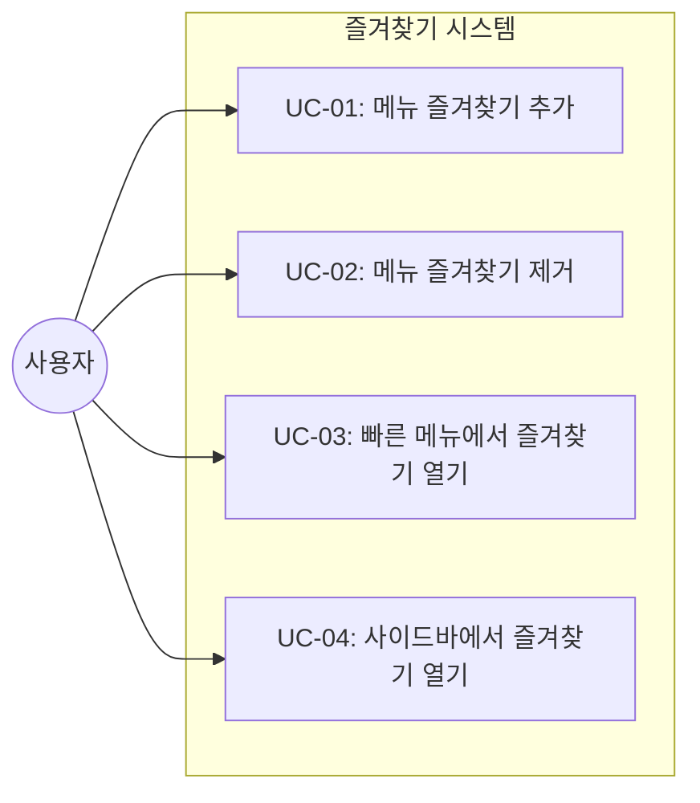
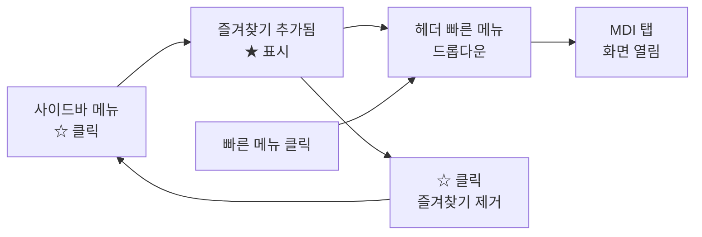
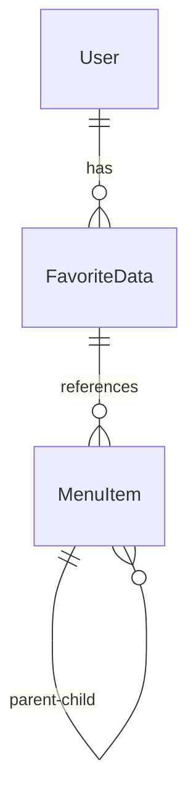

# TSK-03-04 - 즐겨찾기 메뉴 설계 문서

## 문서 정보

| 항목 | 내용 |
|------|------|
| Task ID | TSK-03-04 |
| 문서 버전 | 1.0 |
| 작성일 | 2026-01-20 |
| 상태 | 작성중 |
| 카테고리 | development |

---

## 1. 개요

### 1.1 배경 및 문제 정의

**현재 상황:**
- 사용자가 자주 사용하는 메뉴에 빠르게 접근하기 어려움
- 매번 사이드바 메뉴 트리를 탐색해야 함
- 깊은 계층의 메뉴는 접근하는 데 여러 번의 클릭이 필요

**해결하려는 문제:**
- 자주 사용하는 메뉴에 대한 빠른 접근성 부족
- 반복적인 메뉴 탐색으로 인한 작업 효율 저하

### 1.2 목적 및 기대 효과

**목적:**
- 사용자가 자주 사용하는 메뉴를 즐겨찾기로 등록하여 빠르게 접근할 수 있도록 함
- 헤더 빠른 메뉴 영역에서 즐겨찾기 목록에 즉시 접근 가능하게 함

**기대 효과:**
- 사용자 관점: 자주 사용하는 화면에 1-2번의 클릭으로 접근 가능
- 비즈니스 관점: 작업 효율성 향상, 사용자 경험 개선

### 1.3 범위

**포함:**
- 즐겨찾기 추가/제거 기능 (사이드바 메뉴에서)
- 헤더 빠른 메뉴 영역에 즐겨찾기 드롭다운 표시
- 즐겨찾기 목록 영속성 (localStorage 저장, MVP 단계)
- 즐겨찾기 클릭 시 해당 화면 열기 (MDI 탭)

**제외:**
- 즐겨찾기 순서 변경 (향후 과제)
- 서버 DB 저장 (Phase 2에서 UserPreference 테이블로 전환)
- 즐겨찾기 그룹/폴더 기능

### 1.4 참조 문서

| 문서 | 경로 | 관련 섹션 |
|------|------|----------|
| PRD | `.orchay/projects/mes-portal/prd.md` | 4.1.1 동적 메뉴 시스템 - 즐겨찾기 메뉴 기능 |
| TRD | `.orchay/projects/mes-portal/trd.md` | 2.3 MVP 백엔드 범위 |

---

## 2. 사용자 분석

### 2.1 대상 사용자

| 사용자 유형 | 특성 | 주요 니즈 |
|------------|------|----------|
| 공장장/관리자 | 전체 생산 현황 관리, 다양한 화면 사용 | 대시보드, 리포트 화면 빠른 접근 |
| 생산 담당자 | 라인별 생산 관리, 반복적인 화면 사용 | 작업 지시, 실적 입력 화면 빠른 접근 |
| 품질 담당자 | 품질 검사 관련 화면 집중 사용 | 검사 결과 입력 화면 빠른 접근 |
| 설비 담당자 | 설비 관련 화면 집중 사용 | 설비 현황 화면 빠른 접근 |

### 2.2 사용자 페르소나

**페르소나 1: 김생산 (생산 담당자)**
- 역할: 생산라인 2교대 담당자
- 목표: 작업 지시 확인 및 실적 입력을 빠르게 수행
- 불만: 매번 사이드바에서 "생산관리 > 작업지시 > 작업지시조회" 메뉴를 찾아가야 함
- 시나리오: 교대 시작 시 작업지시 화면을 먼저 열고, 이후 실적입력 화면을 자주 전환하며 사용

---

## 3. 유즈케이스

### 3.1 유즈케이스 다이어그램



### 3.2 유즈케이스 상세

#### UC-01: 메뉴 즐겨찾기 추가

| 항목 | 내용 |
|------|------|
| 액터 | 로그인한 사용자 |
| 목적 | 자주 사용하는 메뉴를 즐겨찾기에 추가 |
| 사전 조건 | 사용자가 로그인된 상태, 사이드바 메뉴가 표시된 상태 |
| 사후 조건 | 메뉴가 즐겨찾기 목록에 추가됨, localStorage에 저장됨 |
| 트리거 | 메뉴 항목의 즐겨찾기 버튼(별 아이콘) 클릭 |

**기본 흐름:**
1. 사용자가 사이드바 메뉴에서 특정 메뉴 항목을 호버한다
2. 메뉴 항목 우측에 빈 별(☆) 아이콘이 표시된다
3. 사용자가 별 아이콘을 클릭한다
4. 시스템이 해당 메뉴를 즐겨찾기 목록에 추가한다
5. 별 아이콘이 채워진 별(★)로 변경된다
6. 성공 토스트 메시지 "즐겨찾기에 추가되었습니다" 표시
7. 헤더 빠른 메뉴 드롭다운에 해당 메뉴가 추가된다

**대안 흐름:**
- 3a. 이미 즐겨찾기에 추가된 메뉴인 경우:
  - 별 아이콘이 이미 채워진 상태(★)로 표시됨
  - 클릭 시 UC-02(즐겨찾기 제거) 흐름으로 진행

**예외 흐름:**
- 4a. localStorage 저장 실패:
  - 에러 토스트 메시지 표시 "즐겨찾기 저장에 실패했습니다"
  - 별 아이콘 상태 유지 (변경 안 함)

#### UC-02: 메뉴 즐겨찾기 제거

| 항목 | 내용 |
|------|------|
| 액터 | 로그인한 사용자 |
| 목적 | 더 이상 필요 없는 즐겨찾기 제거 |
| 사전 조건 | 해당 메뉴가 즐겨찾기에 추가된 상태 |
| 사후 조건 | 메뉴가 즐겨찾기 목록에서 제거됨 |
| 트리거 | 즐겨찾기된 메뉴의 별 아이콘 클릭 |

**기본 흐름:**
1. 사용자가 즐겨찾기된 메뉴의 채워진 별(★) 아이콘을 클릭한다
2. 시스템이 해당 메뉴를 즐겨찾기 목록에서 제거한다
3. 별 아이콘이 빈 별(☆)로 변경된다
4. 성공 토스트 메시지 "즐겨찾기에서 제거되었습니다" 표시
5. 헤더 빠른 메뉴 드롭다운에서 해당 메뉴가 제거된다

#### UC-03: 빠른 메뉴에서 즐겨찾기 열기

| 항목 | 내용 |
|------|------|
| 액터 | 로그인한 사용자 |
| 목적 | 헤더 빠른 메뉴에서 즐겨찾기한 화면 빠르게 열기 |
| 사전 조건 | 1개 이상의 즐겨찾기가 등록된 상태 |
| 사후 조건 | 해당 화면이 MDI 탭으로 열림 |
| 트리거 | 헤더 빠른 메뉴 버튼 클릭 |

**기본 흐름:**
1. 사용자가 헤더의 빠른 메뉴 버튼(별 아이콘)을 클릭한다
2. 즐겨찾기 목록이 드롭다운으로 표시된다
3. 사용자가 원하는 메뉴를 클릭한다
4. 해당 화면이 MDI 탭으로 열린다
5. 드롭다운이 자동으로 닫힌다

**대안 흐름:**
- 2a. 즐겨찾기가 없는 경우:
  - "즐겨찾기한 메뉴가 없습니다" 메시지와 함께 안내 표시
  - "사이드바 메뉴에서 ☆ 아이콘을 클릭하여 추가하세요" 힌트 표시

#### UC-04: 사이드바에서 즐겨찾기 열기

| 항목 | 내용 |
|------|------|
| 액터 | 로그인한 사용자 |
| 목적 | 사이드바에서 즐겨찾기한 메뉴 확인 및 열기 |
| 사전 조건 | 사이드바가 펼쳐진 상태 |
| 사후 조건 | 해당 화면이 MDI 탭으로 열림 |
| 트리거 | 사이드바 메뉴에서 즐겨찾기 메뉴 클릭 |

**기본 흐름:**
1. 사용자가 사이드바 메뉴에서 즐겨찾기된 메뉴를 확인한다 (채워진 별 아이콘으로 구분)
2. 사용자가 메뉴명을 클릭한다
3. 해당 화면이 MDI 탭으로 열린다

---

## 4. 사용자 시나리오

### 4.1 시나리오 1: 자주 사용하는 화면 즐겨찾기 등록

**상황 설명:**
김생산 담당자가 교대 시작 시 작업지시 화면을 즐겨찾기에 추가하려고 한다.

**단계별 진행:**

| 단계 | 사용자 행동 | 시스템 반응 | 사용자 기대 |
|------|-----------|------------|------------|
| 1 | 사이드바에서 "생산관리" 메뉴 펼침 | 하위 메뉴 표시 | 하위 메뉴가 보여야 함 |
| 2 | "작업지시조회" 메뉴에 마우스 호버 | 메뉴 하이라이트 + 별 아이콘 표시 | 즐겨찾기 추가 버튼이 보여야 함 |
| 3 | 별 아이콘(☆) 클릭 | 별 아이콘 채워짐(★), 토스트 메시지 | 즐겨찾기 추가 완료 확인 |
| 4 | 헤더 빠른 메뉴 버튼 클릭 | 드롭다운에 "작업지시조회" 표시 | 즐겨찾기 목록에 추가 확인 |

**성공 조건:**
- 작업지시조회 메뉴가 헤더 빠른 메뉴에 표시됨
- 브라우저 새로고침 후에도 즐겨찾기 유지

### 4.2 시나리오 2: 즐겨찾기로 화면 빠르게 열기

**상황 설명:**
김생산 담당자가 이미 즐겨찾기에 등록한 작업지시 화면을 빠르게 열고자 한다.

**단계별 진행:**

| 단계 | 사용자 행동 | 시스템 반응 | 사용자 기대 |
|------|-----------|------------|------------|
| 1 | 헤더 빠른 메뉴 버튼 클릭 | 즐겨찾기 드롭다운 표시 | 즐겨찾기 목록이 보여야 함 |
| 2 | "작업지시조회" 메뉴 클릭 | 해당 화면이 MDI 탭으로 열림 | 화면이 열려야 함 |

**성공 조건:**
- 2번의 클릭으로 원하는 화면 열기 완료

### 4.3 시나리오 3: 즐겨찾기가 없는 경우

**상황 설명:**
신규 입사자가 처음 시스템을 사용하며 즐겨찾기 기능을 확인한다.

**단계별 진행:**

| 단계 | 사용자 행동 | 시스템 반응 | 복구 방법 |
|------|-----------|------------|----------|
| 1 | 헤더 빠른 메뉴 버튼 클릭 | 빈 상태 메시지 표시 | 안내 메시지 확인 |
| 2 | 안내 메시지 확인 | "사이드바에서 ☆ 클릭" 힌트 표시 | 힌트 따라 즐겨찾기 추가 |

---

## 5. 화면 설계

### 5.1 화면 흐름도



### 5.2 화면별 상세

#### 화면 1: 사이드바 메뉴 - 즐겨찾기 토글

**화면 목적:**
사용자가 사이드바 메뉴에서 특정 메뉴를 즐겨찾기에 추가하거나 제거할 수 있는 영역

**진입 경로:**
- 사이드바 메뉴의 모든 최하위(리프) 메뉴 항목에서 사용 가능

**와이어프레임:**
```
┌─────────────────────────────────────┐
│ SIDEBAR (펼침 상태: 240px)          │
├─────────────────────────────────────┤
│  📁 생산관리                    ▼   │
│  ├─ 📁 작업지시                 ▼   │
│  │  ├─ 📄 작업지시조회     ★ ← │   │
│  │  └─ 📄 작업지시등록     ☆   │   │
│  │                                  │
│  └─ 📁 생산실적                 ▶   │
│                                     │
│  📁 품질관리                    ▶   │
├─────────────────────────────────────┤
│  [◀ 접기]                           │
└─────────────────────────────────────┘

호버 시 별 아이콘 표시:
┌─────────────────────────────────────┐
│  │  ├─ 📄 작업지시조회     [★] │ ← 호버 시 클릭 가능 영역 강조
└─────────────────────────────────────┘
```

**화면 요소 설명:**

| 영역 | 설명 | 사용자 인터랙션 |
|------|------|----------------|
| 메뉴 아이콘 | 메뉴 유형 표시 (폴더/화면) | 없음 |
| 메뉴명 | 화면 이름 | 클릭 시 MDI 탭으로 화면 열기 |
| 별 아이콘 (☆/★) | 즐겨찾기 상태 표시 | 클릭 시 즐겨찾기 토글 |

**사용자 행동 시나리오:**
1. 사용자가 메뉴 항목에 마우스를 올리면 별 아이콘이 보인다
2. 별 아이콘을 클릭하면 즐겨찾기가 토글된다
3. 메뉴명을 클릭하면 해당 화면이 MDI 탭으로 열린다

#### 화면 2: 헤더 빠른 메뉴 드롭다운

**화면 목적:**
사용자가 즐겨찾기한 메뉴에 빠르게 접근할 수 있는 드롭다운 메뉴

**진입 경로:**
- 헤더 좌측 영역의 빠른 메뉴 버튼 클릭

**와이어프레임:**
```
┌─────────────────────────────────────────────────────────────────┐
│ HEADER                                                          │
├─────────────────────────────────────────────────────────────────┤
│  [Logo]  [★ 빠른메뉴▼]  홈 > 생산관리 > 작업지시   ...         │
│          ┌────────────────────────┐                              │
│          │ ★ 즐겨찾기             │                              │
│          ├────────────────────────┤                              │
│          │ 📄 작업지시조회        │ ← 클릭 시 MDI 탭 열기       │
│          │ 📄 생산실적입력        │                              │
│          │ 📄 대시보드            │                              │
│          ├────────────────────────┤                              │
│          │ 💡 사이드바 메뉴에서    │                              │
│          │    ☆를 클릭하여 추가   │ ← 하단 힌트 (즐겨찾기 있을 때)│
│          └────────────────────────┘                              │
└─────────────────────────────────────────────────────────────────┘

즐겨찾기가 없는 경우:
          ┌────────────────────────┐
          │ ★ 즐겨찾기             │
          ├────────────────────────┤
          │                        │
          │   즐겨찾기한 메뉴가    │
          │   없습니다.            │
          │                        │
          │   💡 사이드바 메뉴에서 │
          │   ☆를 클릭하여         │
          │   추가하세요           │
          │                        │
          └────────────────────────┘
```

**화면 요소 설명:**

| 영역 | 설명 | 사용자 인터랙션 |
|------|------|----------------|
| 빠른 메뉴 버튼 | 별 아이콘 + "빠른메뉴" 텍스트 | 클릭 시 드롭다운 열기 |
| 드롭다운 헤더 | "★ 즐겨찾기" 제목 | 없음 |
| 메뉴 목록 | 즐겨찾기된 메뉴 아이템 | 클릭 시 MDI 탭 열기 |
| 빈 상태 | 즐겨찾기 없을 때 안내 | 없음 |
| 힌트 영역 | 사용법 안내 | 없음 |

**사용자 행동 시나리오:**
1. 사용자가 빠른 메뉴 버튼을 클릭하면 드롭다운이 열린다
2. 즐겨찾기 목록에서 원하는 메뉴를 클릭한다
3. 해당 화면이 MDI 탭으로 열리고 드롭다운이 닫힌다

### 5.3 반응형 동작

| 화면 크기 | 레이아웃 변화 | 사용자 경험 |
|----------|--------------|------------|
| 데스크톱 (1024px+) | 사이드바 펼침, 빠른 메뉴 드롭다운 정상 표시 | 모든 기능 사용 가능 |
| 태블릿 (768-1023px) | 사이드바 접힘 기본, 빠른 메뉴 드롭다운 정상 | 빠른 메뉴 중심 사용 권장 |
| 모바일 (767px-) | 사이드바 오버레이, 빠른 메뉴 드롭다운 | 빠른 메뉴가 주요 접근 방법 |

---

## 6. 인터랙션 설계

### 6.1 사용자 액션과 피드백

| 사용자 액션 | 즉각 피드백 | 결과 피드백 | 에러 피드백 |
|------------|-----------|------------|------------|
| 별 아이콘 호버 | 아이콘 크기 살짝 확대, 커서 포인터 | - | - |
| 별 아이콘 클릭 (추가) | 아이콘 회전 애니메이션 | 성공 토스트 "즐겨찾기에 추가되었습니다" | 에러 토스트 표시 |
| 별 아이콘 클릭 (제거) | 아이콘 회전 애니메이션 | 성공 토스트 "즐겨찾기에서 제거되었습니다" | 에러 토스트 표시 |
| 빠른 메뉴 버튼 클릭 | 드롭다운 슬라이드 다운 | - | - |
| 드롭다운 메뉴 클릭 | 메뉴 항목 하이라이트 | MDI 탭 열림 | - |
| 드롭다운 외부 클릭 | 드롭다운 닫힘 | - | - |

### 6.2 상태별 화면 변화

| 상태 | 화면 표시 | 사용자 안내 |
|------|----------|------------|
| 즐겨찾기 없음 | 빈 상태 일러스트/메시지 | "즐겨찾기한 메뉴가 없습니다" |
| 즐겨찾기 1개 이상 | 목록 표시 | - |
| 즐겨찾기 추가 중 | 별 아이콘 회전 | "추가 중..." |
| 즐겨찾기 추가 성공 | 채워진 별(★) | 토스트 메시지 |
| 즐겨찾기 제거 성공 | 빈 별(☆) | 토스트 메시지 |

### 6.3 키보드/접근성

| 기능 | 키보드 단축키 | 스크린 리더 안내 |
|------|-------------|-----------------|
| 빠른 메뉴 열기 | Alt+F (향후) | "즐겨찾기 메뉴 열기" |
| 드롭다운 닫기 | Escape | "드롭다운 닫힘" |
| 메뉴 항목 이동 | 화살표 위/아래 | "{메뉴명}, 즐겨찾기 항목" |
| 메뉴 선택 | Enter | "{메뉴명} 화면 열기" |
| 즐겨찾기 토글 | Space (별 아이콘 포커스 시) | "즐겨찾기에 추가됨/제거됨" |

---

## 7. 데이터 요구사항

### 7.1 필요한 데이터

| 데이터 | 설명 | 출처 | 용도 |
|--------|------|------|------|
| 메뉴 목록 | 전체 메뉴 데이터 | 메뉴 API (TSK-03-03) | 메뉴 표시 및 즐겨찾기 대상 |
| 즐겨찾기 목록 | 사용자가 즐겨찾기한 메뉴 ID 배열 | localStorage | 즐겨찾기 상태 표시 |
| 사용자 ID | 현재 로그인한 사용자 | Auth.js 세션 | localStorage 키 구분 |

### 7.2 데이터 구조

**즐겨찾기 저장 구조 (localStorage):**

```typescript
// localStorage 키: `mes-favorites-{userId}`
// 값: JSON 문자열
interface FavoriteData {
  userId: number;
  menuIds: number[];  // 즐겨찾기한 메뉴 ID 배열
  updatedAt: string;  // ISO 8601 형식
}

// 예시
{
  "userId": 1,
  "menuIds": [101, 205, 312],
  "updatedAt": "2026-01-20T10:30:00Z"
}
```

**메뉴 데이터 구조 (API 응답):**

```typescript
interface MenuItem {
  id: number;
  code: string;
  name: string;
  path: string | null;
  icon: string | null;
  parentId: number | null;
  sortOrder: number;
  children?: MenuItem[];
}
```

### 7.3 데이터 관계



**관계 설명:**
- 각 사용자는 하나의 FavoriteData를 가짐 (localStorage에 저장)
- FavoriteData는 여러 개의 MenuItem ID를 참조함
- MenuItem은 계층 구조로 parent-child 관계를 가짐

### 7.4 데이터 유효성 규칙

| 데이터 필드 | 규칙 | 위반 시 처리 |
|------------|------|--------------|
| menuIds | 유효한 메뉴 ID만 포함 | 무효한 ID는 필터링하여 제거 |
| menuIds | 중복 없음 | 중복 제거 후 저장 |
| menuIds | 최대 20개 제한 (권장) | 경고 메시지 표시 |

---

## 8. 비즈니스 규칙

### 8.1 핵심 규칙

| 규칙 ID | 규칙 설명 | 적용 상황 | 예외 |
|---------|----------|----------|------|
| BR-01 | 화면(리프 노드) 메뉴만 즐겨찾기 가능 | 즐겨찾기 추가 시 | 폴더 메뉴는 즐겨찾기 불가 |
| BR-02 | 즐겨찾기는 사용자별로 독립 관리 | 모든 즐겨찾기 동작 | 없음 |
| BR-03 | 삭제된 메뉴는 즐겨찾기에서 자동 제거 | 메뉴 로드 시 | 없음 |
| BR-04 | 권한 없는 메뉴는 즐겨찾기해도 접근 불가 | 화면 열기 시 | 관리자 역할 |

### 8.2 규칙 상세 설명

**BR-01: 화면 메뉴만 즐겨찾기 가능**

설명: 폴더(그룹) 메뉴는 실제 화면이 아니므로 즐겨찾기에 추가할 수 없다. 사용자가 직접 접근하여 작업할 수 있는 화면 메뉴만 즐겨찾기 대상이다.

예시:
- "생산관리" (폴더): 즐겨찾기 불가 - 별 아이콘 표시 안 함
- "작업지시조회" (화면): 즐겨찾기 가능 - 별 아이콘 표시

**BR-02: 사용자별 독립 관리**

설명: 즐겨찾기는 각 사용자의 개인 설정이므로, 다른 사용자의 즐겨찾기에 영향을 주지 않는다. localStorage 키에 userId를 포함하여 구분한다.

**BR-03: 삭제된 메뉴 자동 정리**

설명: 관리자가 메뉴를 삭제하거나 비활성화한 경우, 해당 메뉴가 사용자의 즐겨찾기에 있더라도 표시하지 않는다. 메뉴 API 응답과 교차 검증하여 유효한 메뉴만 표시한다.

**BR-04: 권한 없는 메뉴 접근 제한**

설명: 사용자가 이전에 즐겨찾기한 메뉴에 대한 권한이 나중에 제거된 경우, 해당 메뉴는 빠른 메뉴에 표시되지만 클릭 시 "권한이 없습니다" 메시지를 표시한다.

---

## 9. 에러 처리

### 9.1 예상 에러 상황

| 상황 | 원인 | 사용자 메시지 | 복구 방법 |
|------|------|--------------|----------|
| localStorage 저장 실패 | 용량 초과, 비공개 모드 | "즐겨찾기 저장에 실패했습니다" | 일부 즐겨찾기 삭제 안내 |
| 메뉴 데이터 로드 실패 | 네트워크 오류 | "메뉴를 불러올 수 없습니다" | 재시도 버튼 |
| 잘못된 즐겨찾기 데이터 | 데이터 손상 | 자동 복구 (빈 배열로 초기화) | 사용자 알림 없음 |
| 권한 없는 메뉴 접근 | 권한 변경 | "해당 메뉴에 접근 권한이 없습니다" | 관리자 문의 안내 |

### 9.2 에러 표시 방식

| 에러 유형 | 표시 위치 | 표시 방법 |
|----------|----------|----------|
| 저장 실패 | 화면 우상단 | 에러 토스트 (3초) |
| 네트워크 오류 | 드롭다운 내부 | 에러 메시지 + 재시도 버튼 |
| 권한 없음 | 화면 중앙 | 모달 다이얼로그 |

---

## 10. 연관 문서

> 상세 테스트 명세 및 요구사항 추적은 별도 문서에서 관리합니다.

| 문서 | 경로 | 용도 |
|------|------|------|
| 요구사항 추적 매트릭스 | `025-traceability-matrix.md` | PRD → 설계 → 테스트 양방향 추적 |
| 테스트 명세서 | `026-test-specification.md` | 단위/E2E/매뉴얼 테스트 상세 정의 |

---

## 11. 구현 범위

### 11.1 영향받는 영역

| 영역 | 변경 내용 | 영향도 |
|------|----------|--------|
| components/layout/Sidebar.tsx | 즐겨찾기 별 아이콘 추가 | 중간 |
| components/layout/Header.tsx | 빠른 메뉴 버튼 추가 | 중간 |
| components/common/FavoriteMenu.tsx | 새 컴포넌트 생성 | 높음 |
| lib/hooks/useFavorites.ts | 새 훅 생성 | 높음 |

### 11.2 의존성

| 의존 항목 | 이유 | 상태 |
|----------|------|------|
| TSK-03-03 (메뉴 API 엔드포인트) | 메뉴 데이터 조회 필요 | 대기 |
| TSK-01-02 (헤더 컴포넌트) | 빠른 메뉴 버튼 배치 위치 | 완료 |
| TSK-02-01 (MDI 상태 관리) | 화면 열기 함수 (openTab) 필요 | 완료 |

### 11.3 제약 사항

| 제약 | 설명 | 대응 방안 |
|------|------|----------|
| localStorage 용량 제한 | 브라우저별 5-10MB | 즐겨찾기 개수 20개 제한 권장 |
| 비공개 브라우징 모드 | localStorage 사용 불가 | 세션 동안만 메모리에 유지 |
| 다중 탭/창 동기화 | localStorage 변경 감지 필요 | storage 이벤트 리스너 사용 |

---

## 12. 체크리스트

### 12.1 설계 완료 확인

- [x] 문제 정의 및 목적 명확화
- [x] 사용자 분석 완료
- [x] 유즈케이스 정의 완료
- [x] 사용자 시나리오 작성 완료
- [x] 화면 설계 완료 (와이어프레임)
- [x] 인터랙션 설계 완료
- [x] 데이터 요구사항 정의 완료
- [x] 비즈니스 규칙 정의 완료
- [x] 에러 처리 정의 완료

### 12.2 연관 문서 작성

- [ ] 요구사항 추적 매트릭스 작성 (→ `025-traceability-matrix.md`)
- [ ] 테스트 명세서 작성 (→ `026-test-specification.md`)

### 12.3 구현 준비

- [x] 구현 우선순위 결정
- [x] 의존성 확인 완료
- [x] 제약 사항 검토 완료

---

## 변경 이력

| 버전 | 일자 | 작성자 | 변경 내용 |
|------|------|--------|----------|
| 1.0 | 2026-01-20 | Claude | 최초 작성 |
