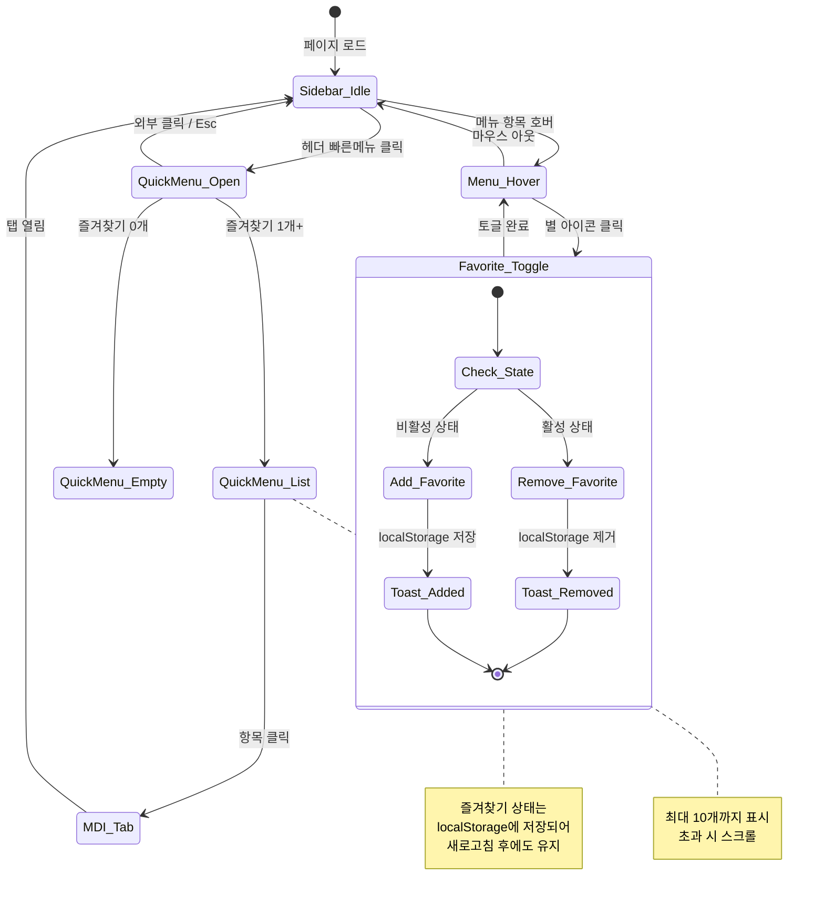
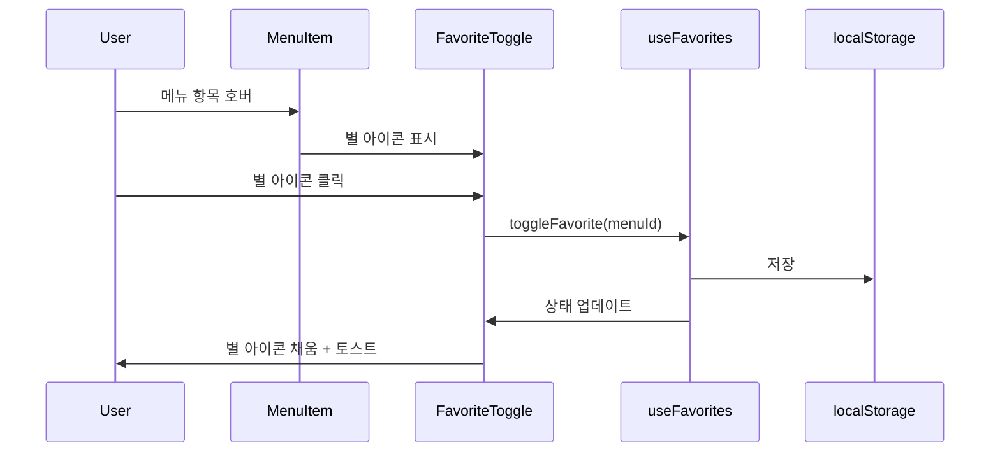
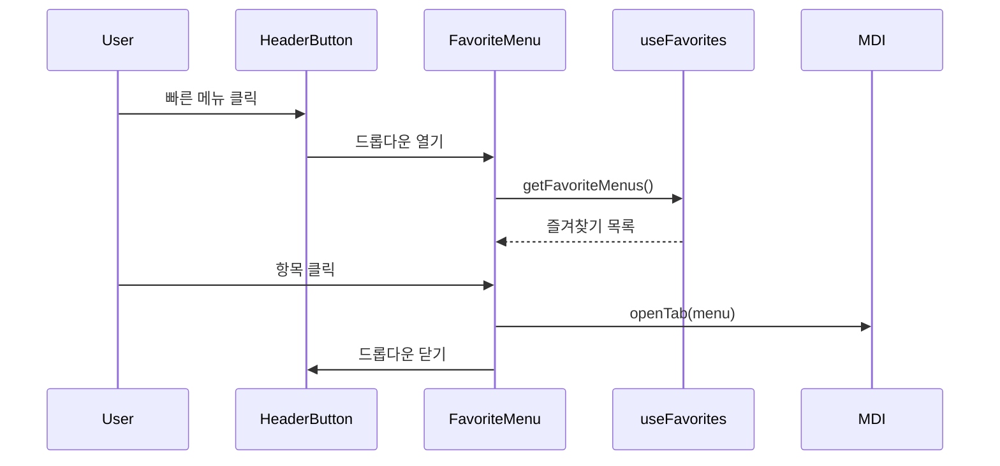

# TSK-03-04 - 즐겨찾기 메뉴 UI 설계

**Version:** 1.0 — **Last Updated:** 2026-01-20

> **목적**: 사용자가 자주 사용하는 메뉴를 즐겨찾기로 등록하고 빠르게 접근할 수 있는 기능의 UI 설계

---

## 1. 화면 목록

| 화면 ID | 화면명 | 목적 | SVG 참조 |
|---------|--------|------|----------|
| SCR-01 | 사이드바 메뉴 - 즐겨찾기 토글 | 사이드바 메뉴 항목에서 즐겨찾기 추가/제거 | `screen-01-sidebar-menu.svg` |
| SCR-02 | 헤더 빠른 메뉴 - 즐겨찾기 드롭다운 | 헤더에서 즐겨찾기 메뉴 빠른 접근 | `screen-02-quick-menu.svg` |

---

## 2. 화면 전환 흐름

### 2.1 상태 다이어그램



### 2.2 액션-화면 매트릭스

| 액션 | 현재 상태 | 결과 상태 | 트리거 | 비고 |
|------|----------|----------|--------|------|
| 메뉴 호버 | Sidebar_Idle | Menu_Hover | 마우스 진입 | 별 아이콘 표시 |
| 별 아이콘 클릭 (비활성) | Menu_Hover | Favorite_Toggle | 클릭 | 즐겨찾기 추가, 별 채움 |
| 별 아이콘 클릭 (활성) | Menu_Hover | Favorite_Toggle | 클릭 | 즐겨찾기 제거, 별 빈 상태 |
| 빠른메뉴 버튼 클릭 | Sidebar_Idle | QuickMenu_Open | 헤더 버튼 클릭 | 드롭다운 표시 |
| 드롭다운 항목 클릭 | QuickMenu_Open | MDI_Tab | 항목 클릭 | 해당 화면 탭 열기 |
| 외부 클릭 | QuickMenu_Open | Sidebar_Idle | 외부 영역 클릭 | 드롭다운 닫힘 |
| Escape 키 | QuickMenu_Open | Sidebar_Idle | 키보드 | 드롭다운 닫힘 |

---

## 3. 화면별 상세

### 3.1 SCR-01: 사이드바 메뉴 - 즐겨찾기 토글

**화면 목적**: 사이드바 메뉴 항목에 호버 시 즐겨찾기 토글 버튼(별 아이콘)을 표시하여 즐겨찾기 추가/제거 기능 제공

**레이아웃 구조**:
```
┌─────────────────────────────────────┐
│ SIDEBAR (240px)                     │
├─────────────────────────────────────┤
│                                     │
│  ▾ 생산관리                          │
│    ┌─────────────────────────┐      │
│    │ [icon] 작업지시     ☆  │ ← 호버 시 별 표시
│    └─────────────────────────┘      │
│    │ [icon] 생산실적     ★  │ ← 즐겨찾기 활성
│    │ [icon] 생산이력         │      │
│                                     │
│  ▾ 품질관리                          │
│    │ [icon] 검사결과         │      │
│    │ [icon] 불량관리         │      │
│                                     │
└─────────────────────────────────────┘

호버 상태 상세:
┌─────────────────────────────────────┐
│  [icon] 작업지시              ☆    │
│  └─────────────────────────┘  │    │
│     메뉴명                    │    │
│                          즐겨찾기   │
│                          토글 버튼  │
└─────────────────────────────────────┘
```

**컴포넌트 구성**:

| 컴포넌트 | Ant Design | 역할 | Props |
|----------|-----------|------|-------|
| `Menu` | Menu | 사이드바 메뉴 컨테이너 | `mode="inline"`, `items` |
| `MenuItem` | Menu.Item | 개별 메뉴 항목 | `icon`, `key`, `children` |
| `FavoriteToggle` | Button | 즐겨찾기 토글 버튼 | `icon`, `onClick`, `isFavorite` |
| `StarOutlined` | @ant-design/icons | 비활성 별 아이콘 | - |
| `StarFilled` | @ant-design/icons | 활성 별 아이콘 | `style={{ color: '#faad14' }}` |

**상태 정의**:

| 상태명 | 조건 | UI 변화 |
|--------|------|---------|
| 기본 | 마우스 없음 | 별 아이콘 숨김 (opacity: 0) |
| 호버 | 메뉴 항목 호버 | 별 아이콘 표시 (opacity: 1) |
| 즐겨찾기 비활성 | `isFavorite=false` | StarOutlined (빈 별, 회색) |
| 즐겨찾기 활성 | `isFavorite=true` | StarFilled (채운 별, 노란색) |
| 별 아이콘 호버 | 별 위 마우스 | 배경색 변경, 커서 포인터 |

**아이콘 상태별 스타일**:

| 상태 | 아이콘 | 색상 | 배경색 |
|------|--------|------|--------|
| 비활성 (기본) | StarOutlined | `#9CA3AF` | transparent |
| 비활성 (호버) | StarOutlined | `#6B7280` | `#F3F4F6` |
| 활성 (기본) | StarFilled | `#faad14` | transparent |
| 활성 (호버) | StarFilled | `#d48806` | `#FFF7E6` |

**사용자 액션**:

| 액션 | 요소 | 결과 | 이벤트 전파 |
|------|------|------|------------|
| 메뉴 항목 클릭 | MenuItem | MDI 탭 열기 | - |
| 별 아이콘 클릭 | FavoriteToggle | 즐겨찾기 토글 | `stopPropagation()` |
| 메뉴 항목 호버 | MenuItem | 별 아이콘 표시 | - |
| 마우스 아웃 | MenuItem | 별 아이콘 숨김 (활성 제외) | - |

---

### 3.2 SCR-02: 헤더 빠른 메뉴 - 즐겨찾기 드롭다운

**화면 목적**: 헤더의 빠른 메뉴 버튼 클릭 시 즐겨찾기 목록을 드롭다운으로 표시하여 빠른 접근 제공

**레이아웃 구조 (즐겨찾기 있음)**:
```
┌─────────────────────────────────────┐
│ HEADER                              │
│  [Logo] [★] [Breadcrumb] ... [User] │
│          │                          │
│          ▼                          │
│  ┌─────────────────────────┐        │
│  │ FAVORITES          ──── │        │
│  ├─────────────────────────┤        │
│  │ [📊] 대시보드        ★  │ ← hover │
│  │ [📋] 작업지시        ★  │        │
│  │ [📈] 생산실적        ★  │        │
│  ├─────────────────────────┤        │
│  │ ⓘ 사이드바에서 ☆ 클릭  │        │
│  │   으로 즐겨찾기 추가    │        │
│  └─────────────────────────┘        │
└─────────────────────────────────────┘
```

**레이아웃 구조 (즐겨찾기 없음)**:
```
┌─────────────────────────────────────┐
│ HEADER                              │
│  [Logo] [☆] [Breadcrumb] ... [User] │
│          │                          │
│          ▼                          │
│  ┌─────────────────────────┐        │
│  │         ☆               │        │
│  │                         │        │
│  │   즐겨찾기가 없습니다    │        │
│  │                         │        │
│  │   사이드바 메뉴에서      │        │
│  │   ☆ 아이콘을 클릭하여   │        │
│  │   즐겨찾기를 추가하세요  │        │
│  │                         │        │
│  └─────────────────────────┘        │
└─────────────────────────────────────┘
```

**컴포넌트 구성**:

| 컴포넌트 | Ant Design | 역할 | Props |
|----------|-----------|------|-------|
| `Dropdown` | Dropdown | 드롭다운 컨테이너 | `trigger={['click']}`, `placement="bottomLeft"` |
| `Button` | Button | 빠른 메뉴 버튼 | `type="text"`, `icon=<StarOutlined />` |
| `Menu` | Menu | 즐겨찾기 목록 | `items`, `onClick` |
| `Menu.Item` | Menu.Item | 개별 즐겨찾기 항목 | `icon`, `key` |
| `Empty` | Empty | 빈 상태 표시 | `image`, `description` |

**상태 정의**:

| 상태명 | 조건 | UI 변화 |
|--------|------|---------|
| 닫힘 | 기본 | 드롭다운 숨김 |
| 열림 (목록) | 즐겨찾기 1개+ | 즐겨찾기 목록 표시 |
| 열림 (빈 상태) | 즐겨찾기 0개 | Empty 컴포넌트 표시 |
| 항목 호버 | 목록 항목 호버 | 배경색 `#F3F4F6` |

**헤더 버튼 아이콘 상태**:

| 조건 | 아이콘 | 색상 | 설명 |
|------|--------|------|------|
| 즐겨찾기 0개 | StarOutlined | `#6B7280` | 빈 별 아이콘 |
| 즐겨찾기 1개+ | StarFilled | `#faad14` | 채운 별 아이콘 (노란색) |

**드롭다운 항목 구성**:

| 요소 | 위치 | 내용 |
|------|------|------|
| 헤더 | 상단 | "FAVORITES" 라벨 + 구분선 |
| 목록 | 중앙 | 즐겨찾기 메뉴 항목 (아이콘 + 이름 + 삭제 버튼) |
| 푸터 | 하단 | 도움말 텍스트 |

**사용자 액션**:

| 액션 | 요소 | 결과 |
|------|------|------|
| 빠른 메뉴 버튼 클릭 | Header Button | 드롭다운 열기/닫기 |
| 즐겨찾기 항목 클릭 | Menu.Item | MDI 탭 열기, 드롭다운 닫기 |
| 삭제 버튼 클릭 | 항목 내 ★ 버튼 | 즐겨찾기 제거, 목록 갱신 |
| 외부 영역 클릭 | - | 드롭다운 닫기 |
| Escape 키 | - | 드롭다운 닫기 |

---

## 4. 공통 컴포넌트

### 4.1 FavoriteToggle

즐겨찾기 토글 버튼 컴포넌트

```typescript
interface FavoriteToggleProps {
  menuId: string;
  isFavorite: boolean;
  onToggle: (menuId: string, isFavorite: boolean) => void;
  size?: 'small' | 'default';
}
```

**스타일 적용**:
```css
.favorite-toggle {
  display: flex;
  align-items: center;
  justify-content: center;
  width: 24px;
  height: 24px;
  border-radius: 4px;
  cursor: pointer;
  transition: all 0.2s ease;
  opacity: 0; /* 기본 숨김 */
}

/* 호버 시 표시 */
.menu-item:hover .favorite-toggle {
  opacity: 1;
}

/* 활성화된 즐겨찾기는 항상 표시 */
.favorite-toggle--active {
  opacity: 1;
}

/* 비활성 상태 */
.favorite-toggle--inactive {
  color: #9CA3AF;
}

.favorite-toggle--inactive:hover {
  color: #6B7280;
  background-color: #F3F4F6;
}

/* 활성 상태 */
.favorite-toggle--active {
  color: #faad14;
}

.favorite-toggle--active:hover {
  color: #d48806;
  background-color: #FFF7E6;
}
```

### 4.2 FavoriteMenu

헤더 빠른 메뉴 드롭다운 컴포넌트

```typescript
interface FavoriteMenuProps {
  favorites: FavoriteItem[];
  onItemClick: (menuId: string, path: string) => void;
  onRemove: (menuId: string) => void;
}

interface FavoriteItem {
  id: string;
  name: string;
  icon: string;
  path: string;
}
```

**스타일 적용**:
```css
.favorite-menu-dropdown {
  min-width: 240px;
  max-width: 320px;
  border-radius: 8px;
  box-shadow: 0 6px 16px rgba(0, 0, 0, 0.08);
}

.favorite-menu-header {
  padding: 12px 16px 8px;
  font-size: 12px;
  font-weight: 600;
  color: #6B7280;
  text-transform: uppercase;
  letter-spacing: 0.05em;
  border-bottom: 1px solid #E5E7EB;
}

.favorite-menu-item {
  display: flex;
  align-items: center;
  padding: 8px 16px;
  cursor: pointer;
  transition: background-color 0.2s;
}

.favorite-menu-item:hover {
  background-color: #F3F4F6;
}

.favorite-menu-item__icon {
  margin-right: 12px;
  color: #6B7280;
  font-size: 16px;
}

.favorite-menu-item__name {
  flex: 1;
  font-size: 14px;
  color: #1F2937;
  overflow: hidden;
  text-overflow: ellipsis;
  white-space: nowrap;
}

.favorite-menu-item__remove {
  opacity: 0;
  color: #faad14;
  transition: opacity 0.2s;
}

.favorite-menu-item:hover .favorite-menu-item__remove {
  opacity: 1;
}

.favorite-menu-footer {
  padding: 12px 16px;
  font-size: 12px;
  color: #9CA3AF;
  border-top: 1px solid #E5E7EB;
  text-align: center;
}

/* 빈 상태 */
.favorite-menu-empty {
  padding: 32px 24px;
  text-align: center;
}

.favorite-menu-empty__icon {
  font-size: 48px;
  color: #D1D5DB;
  margin-bottom: 16px;
}

.favorite-menu-empty__title {
  font-size: 14px;
  font-weight: 500;
  color: #6B7280;
  margin-bottom: 8px;
}

.favorite-menu-empty__description {
  font-size: 12px;
  color: #9CA3AF;
  line-height: 1.5;
}
```

### 4.3 useFavorites Hook

즐겨찾기 상태 관리 커스텀 훅

```typescript
interface UseFavoritesReturn {
  favorites: string[];  // 즐겨찾기 메뉴 ID 배열
  isFavorite: (menuId: string) => boolean;
  addFavorite: (menuId: string) => void;
  removeFavorite: (menuId: string) => void;
  toggleFavorite: (menuId: string) => void;
  getFavoriteMenus: () => FavoriteItem[];  // 메뉴 데이터와 조합
}

// 사용 예시
const { favorites, toggleFavorite, isFavorite } = useFavorites();
```

**저장소 전략**:

| 방식 | 저장소 | 장점 | 단점 |
|------|--------|------|------|
| MVP (Phase 1) | localStorage | 구현 간단, 서버 불필요 | 기기 간 동기화 불가 |
| 확장 (Phase 2) | DB (UserPreference) | 기기 간 동기화, 백업 | API 구현 필요 |

**localStorage 키 구조**:
```typescript
const STORAGE_KEY = 'mes-portal-favorites';

// 저장 형식
{
  "favorites": ["menu-01", "menu-02", "menu-03"]
}
```

---

## 5. 반응형 설계

### 5.1 Breakpoint 정의

| Breakpoint | 너비 범위 | 사이드바 즐겨찾기 | 헤더 빠른메뉴 |
|------------|----------|-----------------|-------------|
| Desktop | 1024px+ | 별 아이콘 표시 | 드롭다운 표시 |
| Tablet | 768-1023px | 별 아이콘 표시 | 드롭다운 표시 |
| Mobile | 0-767px | 별 아이콘 표시 (사이드바 드로어) | 드롭다운 표시 |

### 5.2 반응형 동작

**사이드바 접힘 상태에서**:

| 상태 | 동작 |
|------|------|
| 메뉴 호버 | 툴팁으로 메뉴명 + 즐겨찾기 버튼 표시 |
| 별 아이콘 | 툴팁 내에서 클릭 가능 |

**모바일 드로어 메뉴**:

| 요소 | 변화 |
|------|------|
| 별 아이콘 | 터치 영역 확대 (32px x 32px) |
| 호버 효과 | 제거 (터치 기기 특성) |
| 별 표시 | 항상 표시 (숨김 없음) |

---

## 6. 접근성

### 6.1 키보드 네비게이션

| 키 | 동작 | 컨텍스트 |
|----|------|----------|
| Tab | 포커스 이동 | 메뉴 항목 및 별 아이콘 간 |
| Enter / Space | 즐겨찾기 토글 | 별 아이콘 포커스 |
| Enter | 메뉴 열기 | 메뉴 항목 포커스 |
| Escape | 드롭다운 닫기 | 빠른 메뉴 열린 상태 |
| Arrow Up/Down | 드롭다운 항목 이동 | 빠른 메뉴 열린 상태 |

### 6.2 ARIA 속성

| 요소 | ARIA 속성 | 값 |
|------|----------|-----|
| FavoriteToggle (비활성) | `aria-label` | `{메뉴명} 즐겨찾기 추가` |
| FavoriteToggle (활성) | `aria-label` | `{메뉴명} 즐겨찾기 제거` |
| FavoriteToggle | `aria-pressed` | `true` / `false` |
| QuickMenu Button | `aria-label` | `즐겨찾기 메뉴` |
| QuickMenu Button | `aria-haspopup` | `menu` |
| QuickMenu Button | `aria-expanded` | `true` / `false` |
| Dropdown Menu | `role` | `menu` |
| Dropdown Item | `role` | `menuitem` |

### 6.3 포커스 표시

```css
.favorite-toggle:focus-visible {
  outline: 2px solid #1677ff;
  outline-offset: 2px;
}

.favorite-menu-item:focus-visible {
  outline: 2px solid #1677ff;
  outline-offset: -2px;
  background-color: #F3F4F6;
}
```

### 6.4 색상 대비

| 요소 | 전경색 | 배경색 | 대비율 | WCAG AA |
|------|--------|--------|--------|---------|
| 비활성 별 아이콘 | #9CA3AF | #FFFFFF | 3.2:1 | AA Large |
| 활성 별 아이콘 | #faad14 | #FFFFFF | 2.2:1 | 아이콘 (3:1 권장) |
| 드롭다운 텍스트 | #1F2937 | #FFFFFF | 14.7:1 | Pass |
| 드롭다운 보조 텍스트 | #6B7280 | #FFFFFF | 5.0:1 | Pass |
| 빈 상태 설명 | #9CA3AF | #FFFFFF | 3.2:1 | AA Large |

### 6.5 스크린 리더 안내

| 상황 | 안내 메시지 |
|------|------------|
| 즐겨찾기 추가 | "작업지시가 즐겨찾기에 추가되었습니다" |
| 즐겨찾기 제거 | "작업지시가 즐겨찾기에서 제거되었습니다" |
| 드롭다운 열림 | "즐겨찾기 메뉴, 3개 항목" |
| 빈 상태 | "즐겨찾기가 없습니다. 사이드바 메뉴에서 별 아이콘을 클릭하여 추가하세요" |

---

## 7. 토스트 알림

### 7.1 알림 유형

| 상황 | 유형 | 메시지 | 아이콘 |
|------|------|--------|--------|
| 즐겨찾기 추가 | success | "{메뉴명}이(가) 즐겨찾기에 추가되었습니다" | StarFilled |
| 즐겨찾기 제거 | info | "{메뉴명}이(가) 즐겨찾기에서 제거되었습니다" | StarOutlined |
| 최대 개수 초과 | warning | "즐겨찾기는 최대 10개까지 등록할 수 있습니다" | ExclamationCircle |

### 7.2 토스트 스타일

```typescript
// 즐겨찾기 추가
message.success({
  content: '작업지시가 즐겨찾기에 추가되었습니다',
  icon: <StarFilled style={{ color: '#faad14' }} />,
  duration: 2,
});

// 즐겨찾기 제거
message.info({
  content: '작업지시가 즐겨찾기에서 제거되었습니다',
  icon: <StarOutlined style={{ color: '#6B7280' }} />,
  duration: 2,
});
```

---

## 8. SVG 파일 목록

| 파일명 | 설명 | 뷰포트 |
|--------|------|--------|
| `screen-01-sidebar-menu.svg` | 사이드바 메뉴 즐겨찾기 토글 (호버/활성/비활성 상태) | 800x600 |
| `screen-02-quick-menu.svg` | 헤더 빠른 메뉴 드롭다운 (목록/빈 상태) | 800x600 |

---

## 9. 컴포넌트 구조

```
components/
├── layout/
│   └── Sidebar/
│       ├── Sidebar.tsx           # 사이드바 컨테이너
│       ├── MenuItem.tsx          # 메뉴 아이템 (FavoriteToggle 포함)
│       └── FavoriteToggle.tsx    # 즐겨찾기 토글 버튼
│
├── common/
│   └── FavoriteMenu/
│       ├── FavoriteMenu.tsx      # 빠른 메뉴 드롭다운
│       ├── FavoriteMenuItem.tsx  # 드롭다운 메뉴 항목
│       └── FavoriteEmpty.tsx     # 빈 상태 컴포넌트

hooks/
└── useFavorites.ts               # 즐겨찾기 상태 관리 훅
```

---

## 10. 디자인 토큰

### 10.1 색상 토큰

```css
:root {
  /* 즐겨찾기 비활성 */
  --favorite-inactive-color: #9CA3AF;
  --favorite-inactive-hover-color: #6B7280;
  --favorite-inactive-hover-bg: #F3F4F6;

  /* 즐겨찾기 활성 */
  --favorite-active-color: #faad14;
  --favorite-active-hover-color: #d48806;
  --favorite-active-hover-bg: #FFF7E6;

  /* 드롭다운 */
  --dropdown-bg: #FFFFFF;
  --dropdown-border: #E5E7EB;
  --dropdown-shadow: 0 6px 16px rgba(0, 0, 0, 0.08);
  --dropdown-item-hover-bg: #F3F4F6;

  /* 빈 상태 */
  --empty-icon-color: #D1D5DB;
  --empty-title-color: #6B7280;
  --empty-description-color: #9CA3AF;
}
```

### 10.2 크기 토큰

```css
:root {
  /* 즐겨찾기 토글 버튼 */
  --favorite-toggle-size: 24px;
  --favorite-toggle-icon-size: 14px;
  --favorite-toggle-mobile-size: 32px;

  /* 드롭다운 */
  --dropdown-min-width: 240px;
  --dropdown-max-width: 320px;
  --dropdown-item-padding: 8px 16px;
  --dropdown-item-icon-size: 16px;

  /* 빈 상태 */
  --empty-icon-size: 48px;
  --empty-padding: 32px 24px;
}
```

### 10.3 애니메이션 토큰

```css
:root {
  /* 전환 효과 */
  --transition-fast: 0.15s ease;
  --transition-normal: 0.2s ease;
  --transition-slow: 0.3s ease;
}

/* 별 아이콘 애니메이션 */
@keyframes star-pop {
  0% { transform: scale(1); }
  50% { transform: scale(1.2); }
  100% { transform: scale(1); }
}

.favorite-toggle--active {
  animation: star-pop 0.3s ease;
}
```

---

## 11. 데이터 흐름

### 11.1 즐겨찾기 추가 플로우



### 11.2 빠른 메뉴 접근 플로우



---

## 관련 문서

- 설계: `010-design.md`
- 테스트 명세: `026-test-specification.md`
- 추적성 매트릭스: `025-traceability-matrix.md`
- 관련 컴포넌트: TSK-01-02 (헤더 컴포넌트), TSK-01-03 (사이드바 메뉴)
