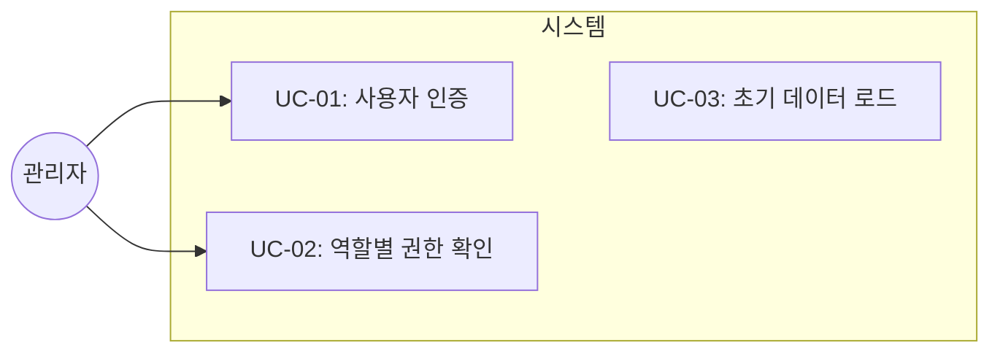
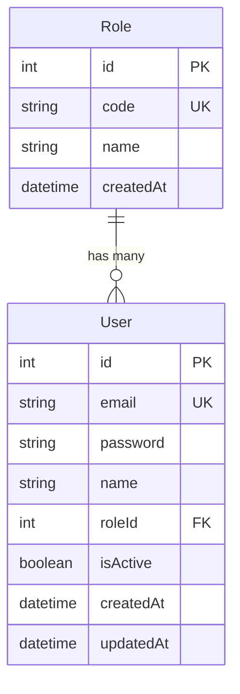

# TSK-04-02 - 사용자 및 역할 모델 설계 문서

## 문서 정보

| 항목 | 내용 |
|------|------|
| Task ID | TSK-04-02 |
| 문서 버전 | 1.0 |
| 작성일 | 2026-01-20 |
| 상태 | 작성중 |
| 카테고리 | development |

---

## 1. 개요

### 1.1 배경 및 문제 정의

**현재 상황:**
- MES Portal은 인증 및 권한 관리 기능이 필요함
- TSK-04-01에서 Prisma 및 SQLite 설정이 완료되어 DB 인프라가 준비됨
- 사용자 인증 및 역할 기반 접근 제어(RBAC)를 위한 데이터 모델이 필요

**해결하려는 문제:**
- 사용자 정보를 저장하고 관리할 데이터 모델 부재
- 역할(Role) 기반 권한 관리를 위한 구조 필요
- 초기 운영을 위한 기본 사용자/역할 데이터 필요

### 1.2 목적 및 기대 효과

**목적:**
- User 및 Role 데이터 모델 정의
- Prisma 스키마를 통한 타입 안전한 데이터 접근 구현
- 초기 운영 데이터 시드 스크립트 제공

**기대 효과:**
- Auth.js 인증 시스템과 연동 가능한 사용자 모델 확보
- 역할 기반 메뉴 권한 필터링의 기반 마련
- 비밀번호 보안(bcrypt 해시) 적용

### 1.3 범위

**포함:**
- User 모델 정의 (id, email, password, name, roleId, isActive, createdAt, updatedAt)
- Role 모델 정의 (id, code, name, createdAt)
- User-Role 관계 설정 (N:1)
- 초기 데이터 시드 스크립트 (admin, manager, operator 역할 및 테스트 사용자)
- bcrypt를 이용한 비밀번호 해시 처리

**제외:**
- Auth.js 인증 설정 (TSK-04-03에서 구현)
- 로그인 페이지 UI (TSK-04-04에서 구현)
- RoleMenu 매핑 테이블 (TSK-03-02에서 구현)
- 사용자 관리 CRUD API (Phase 2 범위)

### 1.4 참조 문서

| 문서 | 경로 | 관련 섹션 |
|------|------|----------|
| TRD | `.orchay/projects/mes-portal/trd.md` | 2.3 MVP 백엔드 범위 정의, MVP Prisma 스키마 |
| PRD | `.orchay/projects/mes-portal/prd.md` | 4.1.4 사용자 관리 (공통) |

---

## 2. 사용자 분석

### 2.1 대상 사용자

| 사용자 유형 | 특성 | 주요 니즈 |
|------------|------|----------|
| 시스템 관리자 (admin) | 전체 시스템 관리 권한 | 모든 메뉴 접근, 사용자 관리 |
| 생산 관리자 (manager) | 부서/라인별 관리 권한 | 대시보드, 생산 관리 메뉴 접근 |
| 현장 작업자 (operator) | 제한된 조회 권한 | 기본 조회 화면 접근 |

### 2.2 사용자 페르소나

**페르소나 1: 시스템 관리자**
- 역할: IT 부서 담당자
- 목표: 사용자 계정 관리, 권한 설정
- 불만: 복잡한 권한 관리 체계
- 시나리오: 새 직원 입사 시 계정 생성 및 역할 부여

**페르소나 2: 생산 관리자**
- 역할: 공장 라인 관리자
- 목표: 담당 라인 생산 현황 모니터링
- 불만: 불필요한 메뉴 노출
- 시나리오: 로그인 후 대시보드 및 생산 관리 메뉴만 사용

---

## 3. 유즈케이스

### 3.1 유즈케이스 다이어그램



### 3.2 유즈케이스 상세

#### UC-01: 사용자 인증

| 항목 | 내용 |
|------|------|
| 액터 | 모든 사용자 |
| 목적 | 이메일/비밀번호로 시스템 인증 |
| 사전 조건 | 사용자 계정이 DB에 존재 |
| 사후 조건 | 인증 성공 시 세션/토큰 발급 |
| 트리거 | 로그인 요청 |

**기본 흐름:**
1. 사용자가 이메일과 비밀번호를 입력한다
2. 시스템이 이메일로 사용자를 조회한다
3. 시스템이 bcrypt로 비밀번호를 검증한다
4. 검증 성공 시 사용자 정보(역할 포함)를 반환한다
5. Auth.js가 세션/JWT를 생성한다

**예외 흐름:**
- 2a. 사용자가 존재하지 않으면:
  - 시스템이 "인증 실패" 에러를 반환한다
- 3a. 비밀번호가 일치하지 않으면:
  - 시스템이 "인증 실패" 에러를 반환한다
- 2b. 사용자가 비활성(isActive=false)이면:
  - 시스템이 "계정 비활성" 에러를 반환한다

#### UC-02: 역할별 권한 확인

| 항목 | 내용 |
|------|------|
| 액터 | 인증된 사용자 |
| 목적 | 사용자 역할에 따른 메뉴/기능 접근 권한 확인 |
| 사전 조건 | 사용자 인증 완료 |
| 사후 조건 | 역할 기반 권한 정보 제공 |
| 트리거 | 메뉴 조회 요청 |

**기본 흐름:**
1. 시스템이 세션에서 사용자 역할을 확인한다
2. 시스템이 역할에 해당하는 권한 정보를 조회한다
3. 권한에 맞는 메뉴/기능 목록을 반환한다

#### UC-03: 초기 데이터 로드

| 항목 | 내용 |
|------|------|
| 액터 | 시스템 (배포 시) |
| 목적 | 기본 역할 및 관리자 계정 생성 |
| 사전 조건 | DB 마이그레이션 완료 |
| 사후 조건 | 기본 데이터가 DB에 존재 |
| 트리거 | prisma db seed 실행 |

**기본 흐름:**
1. 시스템이 기본 역할(admin, manager, operator)을 생성한다
2. 시스템이 관리자 테스트 계정을 생성한다
3. 비밀번호는 bcrypt로 해시하여 저장한다

---

## 4. 사용자 시나리오

### 4.1 시나리오 1: 관리자 로그인

**상황 설명:**
시스템 관리자가 MES Portal에 처음 로그인하여 시스템을 확인하는 상황

**단계별 진행:**

| 단계 | 사용자 행동 | 시스템 반응 | 사용자 기대 |
|------|-----------|------------|------------|
| 1 | 로그인 페이지 접근 | 로그인 폼 표시 | 이메일/비밀번호 입력 필드 |
| 2 | admin@example.com / password123 입력 | DB 조회 및 비밀번호 검증 | 검증 진행 |
| 3 | 로그인 버튼 클릭 | 인증 성공, 포털로 리다이렉트 | 대시보드 화면 |
| 4 | 메뉴 확인 | 전체 메뉴 표시 (관리자 권한) | 모든 메뉴 접근 가능 |

**성공 조건:**
- 관리자가 성공적으로 로그인됨
- 세션에 사용자 정보(id, email, role) 저장됨
- 관리자 역할에 해당하는 전체 메뉴 표시

### 4.2 시나리오 2: 잘못된 비밀번호 입력

**상황 설명:**
사용자가 잘못된 비밀번호를 입력한 상황

**단계별 진행:**

| 단계 | 사용자 행동 | 시스템 반응 | 복구 방법 |
|------|-----------|------------|----------|
| 1 | 이메일/잘못된 비밀번호 입력 | bcrypt 검증 실패 | 에러 메시지 확인 |
| 2 | 로그인 버튼 클릭 | "이메일 또는 비밀번호가 올바르지 않습니다" 표시 | 재입력 |

---

## 5. 화면 설계

> 이 Task는 백엔드 데이터 모델 구현으로, 직접적인 화면은 없습니다.
> 관련 화면은 TSK-04-04 (로그인 페이지)에서 설계합니다.

### 5.1 데이터 활용 화면

| 화면 | 관련 Task | 데이터 활용 |
|------|----------|------------|
| 로그인 페이지 | TSK-04-04 | User 모델 인증 |
| 사이드바 메뉴 | TSK-01-03 | Role 기반 메뉴 필터링 |
| 사용자 프로필 | TSK-01-02 | User 정보 표시 |

---

## 6. 인터랙션 설계

> 백엔드 모델로 직접 인터랙션은 없으나, API 응답 형식을 정의합니다.

### 6.1 API 응답 형식

**사용자 조회 응답:**
```typescript
interface UserResponse {
  id: number;
  email: string;
  name: string;
  role: {
    id: number;
    code: string;
    name: string;
  };
  isActive: boolean;
  createdAt: string;
}
```

**역할 목록 응답:**
```typescript
interface RoleResponse {
  id: number;
  code: string;
  name: string;
}
```

---

## 7. 데이터 요구사항

### 7.1 필요한 데이터

| 데이터 | 설명 | 출처 | 용도 |
|--------|------|------|------|
| User | 사용자 계정 정보 | 시스템 생성 | 인증, 권한 관리 |
| Role | 역할 정의 | 시스템 시드 | 권한 그룹화 |

### 7.2 데이터 관계



**관계 설명:**
- Role은 여러 User를 가질 수 있다 (1:N)
- User는 반드시 하나의 Role을 가진다 (N:1)
- Role.code는 유니크하여 코드로 역할 식별 가능 (ADMIN, MANAGER, OPERATOR)

### 7.3 데이터 모델 상세

#### User 모델

| 필드 | 타입 | 제약 | 설명 |
|------|------|------|------|
| id | Int | PK, Auto Increment | 고유 식별자 |
| email | String | Unique, Not Null | 로그인 이메일 |
| password | String | Not Null | bcrypt 해시된 비밀번호 |
| name | String | Not Null | 사용자 표시명 |
| roleId | Int | FK → Role.id | 역할 참조 |
| isActive | Boolean | Default: true | 계정 활성 상태 |
| createdAt | DateTime | Default: now() | 생성 일시 |
| updatedAt | DateTime | Auto Update | 수정 일시 |

#### Role 모델

| 필드 | 타입 | 제약 | 설명 |
|------|------|------|------|
| id | Int | PK, Auto Increment | 고유 식별자 |
| code | String | Unique, Not Null | 역할 코드 (ADMIN, MANAGER, OPERATOR) |
| name | String | Not Null | 역할 표시명 |
| createdAt | DateTime | Default: now() | 생성 일시 |

### 7.4 Prisma 스키마

```prisma
// prisma/schema.prisma

model User {
  id        Int      @id @default(autoincrement())
  email     String   @unique
  password  String   // bcrypt 해시
  name      String
  roleId    Int
  isActive  Boolean  @default(true)
  createdAt DateTime @default(now())
  updatedAt DateTime @updatedAt

  role      Role     @relation(fields: [roleId], references: [id])

  @@map("users")
}

model Role {
  id        Int      @id @default(autoincrement())
  code      String   @unique // ADMIN, MANAGER, OPERATOR
  name      String
  createdAt DateTime @default(now())

  users     User[]

  @@map("roles")
}
```

### 7.5 초기 시드 데이터

#### 역할 데이터

| id | code | name |
|----|------|------|
| 1 | ADMIN | 시스템 관리자 |
| 2 | MANAGER | 생산 관리자 |
| 3 | OPERATOR | 현장 작업자 |

#### 테스트 사용자 데이터

| id | email | password (원문) | name | roleId |
|----|-------|----------------|------|--------|
| 1 | admin@example.com | password123 | 관리자 | 1 (ADMIN) |
| 2 | manager@example.com | password123 | 생산관리자 | 2 (MANAGER) |
| 3 | operator@example.com | password123 | 작업자 | 3 (OPERATOR) |

> **참고:** 비밀번호는 DB 저장 시 bcrypt로 해시됩니다.

### 7.6 데이터 유효성 규칙

| 데이터 필드 | 규칙 | 위반 시 메시지 |
|------------|------|---------------|
| email | 필수, 이메일 형식, 유니크 | "올바른 이메일 형식이 아닙니다" |
| password | 필수, 최소 8자 | "비밀번호는 8자 이상이어야 합니다" |
| name | 필수, 2-50자 | "이름은 2-50자 사이로 입력해주세요" |
| roleId | 필수, 유효한 Role ID | "유효하지 않은 역할입니다" |

---

## 8. 비즈니스 규칙

### 8.1 핵심 규칙

| 규칙 ID | 규칙 설명 | 적용 상황 | 예외 |
|---------|----------|----------|------|
| BR-01 | 비밀번호는 평문 저장 금지 | 사용자 생성/수정 시 | 없음 |
| BR-02 | 이메일은 시스템 내 유일해야 함 | 사용자 생성 시 | 없음 |
| BR-03 | 비활성 사용자는 로그인 불가 | 인증 시 | 관리자 직접 활성화 |
| BR-04 | 모든 사용자는 역할이 필수 | 사용자 생성 시 | 없음 |

### 8.2 규칙 상세 설명

**BR-01: 비밀번호 보안 저장**

설명: 비밀번호는 반드시 bcrypt 알고리즘으로 해시하여 저장해야 합니다.
보안 사유: 데이터베이스 유출 시에도 원본 비밀번호 노출 방지

구현:
```typescript
import bcrypt from 'bcrypt';

// 해시 생성 (cost factor: 10)
const hashedPassword = await bcrypt.hash(plainPassword, 10);

// 검증
const isValid = await bcrypt.compare(inputPassword, hashedPassword);
```

**BR-02: 이메일 유일성**

설명: 동일 이메일로 중복 계정 생성 불가
이유: 이메일이 로그인 ID로 사용됨

**BR-03: 계정 비활성화 처리**

설명: isActive=false인 계정은 인증 시 거부
용도: 퇴사자 처리, 계정 일시 정지

---

## 9. 에러 처리

### 9.1 예상 에러 상황

| 상황 | 원인 | 에러 코드 | 메시지 |
|------|------|----------|--------|
| 중복 이메일 | 이미 등록된 이메일 | P2002 (Prisma) | "이미 등록된 이메일입니다" |
| 역할 미존재 | 잘못된 roleId | P2003 (Prisma) | "유효하지 않은 역할입니다" |
| 인증 실패 | 이메일/비밀번호 불일치 | AUTH_FAILED | "이메일 또는 비밀번호가 올바르지 않습니다" |
| 계정 비활성 | isActive=false | ACCOUNT_DISABLED | "비활성화된 계정입니다" |

### 9.2 에러 처리 패턴

```typescript
// 사용자 조회 시
const user = await prisma.user.findUnique({
  where: { email },
  include: { role: true }
});

if (!user) {
  throw new Error('AUTH_FAILED');
}

if (!user.isActive) {
  throw new Error('ACCOUNT_DISABLED');
}

const isValidPassword = await bcrypt.compare(password, user.password);
if (!isValidPassword) {
  throw new Error('AUTH_FAILED');
}
```

---

## 10. 연관 문서

| 문서 | 경로 | 용도 |
|------|------|------|
| 요구사항 추적 매트릭스 | `025-traceability-matrix.md` | PRD → 설계 → 테스트 양방향 추적 |
| 테스트 명세서 | `026-test-specification.md` | 단위/E2E/매뉴얼 테스트 상세 정의 |

---

## 11. 구현 범위

### 11.1 영향받는 영역

| 영역 | 변경 내용 | 영향도 |
|------|----------|--------|
| prisma/schema.prisma | User, Role 모델 추가 | 높음 |
| prisma/seed.ts | 초기 데이터 시드 스크립트 | 높음 |
| package.json | bcrypt 의존성 추가 | 중간 |
| lib/prisma.ts | Prisma Client 싱글톤 (기존 유지) | 낮음 |

### 11.2 의존성

| 의존 항목 | 이유 | 상태 |
|----------|------|------|
| TSK-04-01 (Prisma 및 SQLite 설정) | DB 인프라 필요 | 완료 필요 |

### 11.3 제약 사항

| 제약 | 설명 | 대응 방안 |
|------|------|----------|
| SQLite 제약 | MVP 단계에서 SQLite 사용 | PostgreSQL 전환 시 마이그레이션 |
| bcrypt 선택 | 보안 표준 해시 알고리즘 | argon2 대비 범용성 우선 |

### 11.4 파일 구조

```
mes-portal/
├── prisma/
│   ├── schema.prisma    # User, Role 모델 추가
│   └── seed.ts          # 초기 데이터 시드 (신규)
├── lib/
│   └── prisma.ts        # Prisma Client (기존)
└── package.json         # bcrypt 의존성 추가
```

---

## 12. 체크리스트

### 12.1 설계 완료 확인

- [x] 문제 정의 및 목적 명확화
- [x] 사용자 분석 완료
- [x] 유즈케이스 정의 완료
- [x] 사용자 시나리오 작성 완료
- [x] 데이터 모델 설계 완료
- [x] 비즈니스 규칙 정의 완료
- [x] 에러 처리 정의 완료

### 12.2 연관 문서 작성

- [ ] 요구사항 추적 매트릭스 작성 (→ `025-traceability-matrix.md`)
- [ ] 테스트 명세서 작성 (→ `026-test-specification.md`)

### 12.3 구현 준비

- [x] 구현 우선순위 결정
- [x] 의존성 확인 완료
- [x] 제약 사항 검토 완료

---

## 변경 이력

| 버전 | 일자 | 작성자 | 변경 내용 |
|------|------|--------|----------|
| 1.0 | 2026-01-20 | Claude | 최초 작성 |
