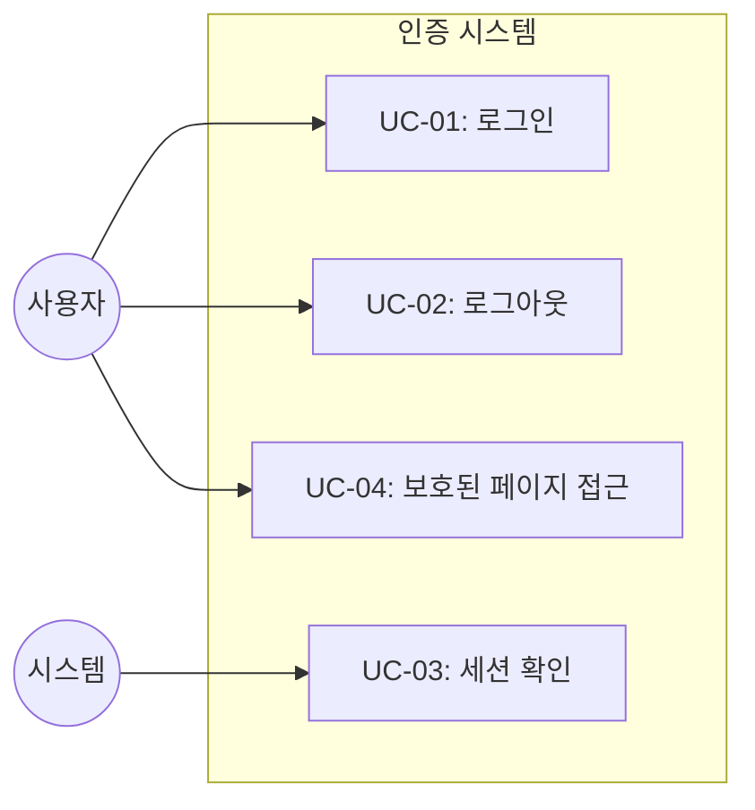
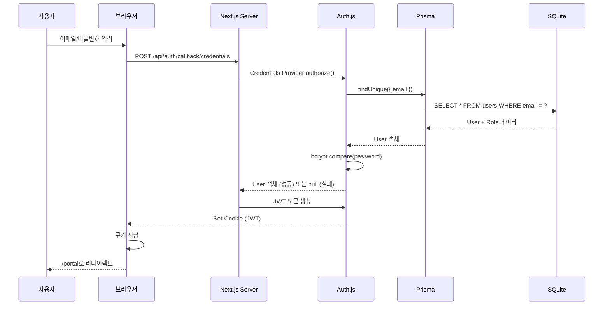
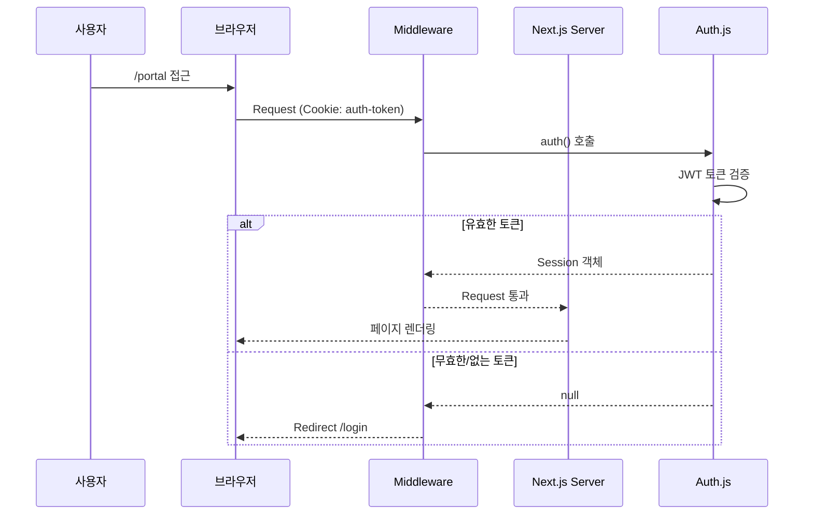

# TSK-04-03 - Auth.js 인증 설정 설계 문서

## 문서 정보

| 항목 | 내용 |
|------|------|
| Task ID | TSK-04-03 |
| 문서 버전 | 1.0 |
| 작성일 | 2026-01-20 |
| 상태 | 작성중 |
| 카테고리 | development |

---

## 1. 개요

### 1.1 배경 및 문제 정의

**현재 상황:**
- MES Portal MVP 프로젝트에서 인증 및 권한 관리 기능 구현이 필요함
- TSK-04-01에서 Prisma 및 SQLite 데이터베이스 설정 완료
- TSK-04-02에서 User, Role 데이터 모델 정의 완료
- 사용자 인증을 처리할 인증 시스템이 필요함

**해결하려는 문제:**
- 이메일/비밀번호 기반 사용자 인증 메커니즘 부재
- 인증된 사용자 정보(세션/토큰)를 관리할 시스템 필요
- 서버/클라이언트 양쪽에서 인증 상태를 확인할 수 있는 구조 필요
- 역할(Role) 정보를 세션에 포함하여 권한 관리 기반 마련 필요

### 1.2 목적 및 기대 효과

**목적:**
- Auth.js (NextAuth v5)를 사용한 인증 시스템 구축
- Credentials Provider를 통한 이메일/비밀번호 인증 구현
- JWT 세션 전략으로 상태 관리
- 세션에 사용자 역할(Role) 정보 포함

**기대 효과:**
- Next.js와 네이티브 통합된 안전한 인증 시스템
- 서버 컴포넌트 및 API Route에서 세션 확인 가능
- 미들웨어를 통한 보호된 라우트 접근 제어
- 역할 기반 메뉴 필터링의 기반 제공

### 1.3 범위

**포함:**
- Auth.js (NextAuth v5) 설치 및 설정
- Credentials Provider 구현 (이메일/비밀번호 인증)
- JWT 세션 전략 설정
- 세션에 사용자 역할(role) 포함 (JWT 콜백 확장)
- 인증 미들웨어 설정 (보호된 라우트)
- API Route 핸들러 (`/api/auth/[...nextauth]`)
- 현재 사용자 정보 API (`/api/auth/me`)

**제외:**
- 로그인 페이지 UI (TSK-04-04에서 구현)
- 소셜 로그인 (OAuth) - MVP 범위 외
- 비밀번호 재설정 기능 - MVP 범위 외
- 회원가입 기능 - MVP 범위 외 (관리자가 사용자 생성)

### 1.4 참조 문서

| 문서 | 경로 | 관련 섹션 |
|------|------|----------|
| TRD | `.orchay/projects/mes-portal/trd.md` | 1.1 인증, 2.3 MVP API Routes 범위 |
| PRD | `.orchay/projects/mes-portal/prd.md` | 4.1.4 사용자 관리 (로그인/로그아웃) |
| TSK-04-02 설계서 | `tasks/TSK-04-02/010-design.md` | User/Role 데이터 모델 |

---

## 2. 사용자 분석

### 2.1 대상 사용자

| 사용자 유형 | 특성 | 주요 니즈 |
|------------|------|----------|
| 시스템 관리자 (ADMIN) | 전체 시스템 관리 권한 | 로그인 후 모든 메뉴 접근 |
| 생산 관리자 (MANAGER) | 부서/라인별 관리 권한 | 로그인 후 권한에 맞는 메뉴 접근 |
| 현장 작업자 (OPERATOR) | 제한된 조회 권한 | 로그인 후 기본 조회 화면 접근 |

### 2.2 사용자 페르소나

**페르소나 1: 시스템 관리자 - 김관리**
- 역할: IT 부서 시스템 담당자
- 목표: 매일 출근하여 시스템에 로그인, 전체 현황 확인
- 불만: 로그인 과정이 복잡하거나 세션이 자주 끊김
- 시나리오: 아침에 PC 켜고 이메일/비밀번호로 빠르게 로그인

**페르소나 2: 현장 작업자 - 박작업**
- 역할: 생산 라인 작업자
- 목표: 공용 터미널에서 빠르게 로그인하여 작업 현황 확인
- 불만: 이전 사용자 세션이 남아있거나 권한 오류
- 시나리오: 교대 시작 시 로그인, 교대 종료 시 로그아웃

---

## 3. 유즈케이스

### 3.1 유즈케이스 다이어그램



### 3.2 유즈케이스 상세

#### UC-01: 로그인

| 항목 | 내용 |
|------|------|
| 액터 | 모든 사용자 |
| 목적 | 이메일/비밀번호로 시스템 인증 |
| 사전 조건 | 사용자 계정이 DB에 존재하고 활성 상태 |
| 사후 조건 | JWT 토큰 발급, 세션 생성 |
| 트리거 | 로그인 폼 제출 |

**기본 흐름:**
1. 사용자가 이메일과 비밀번호를 입력하고 제출한다
2. Auth.js Credentials Provider가 요청을 받는다
3. authorize 함수에서 이메일로 사용자를 조회한다
4. bcrypt로 비밀번호를 검증한다
5. 검증 성공 시 사용자 정보(id, email, name, role)를 반환한다
6. Auth.js가 JWT 토큰을 생성하고 쿠키에 저장한다
7. 사용자가 포털 메인 페이지로 리다이렉트된다

**대안 흐름:**
- 5a. 비밀번호가 일치하지 않으면:
  - authorize 함수가 null을 반환한다
  - Auth.js가 CredentialsSignin 에러를 발생시킨다
  - 로그인 페이지에 에러 메시지 표시

**예외 흐름:**
- 3a. 사용자가 존재하지 않으면:
  - authorize 함수가 null을 반환한다
  - 로그인 실패 처리
- 3b. 사용자 계정이 비활성(isActive=false)이면:
  - authorize 함수가 null을 반환하거나 커스텀 에러
  - 로그인 거부

#### UC-02: 로그아웃

| 항목 | 내용 |
|------|------|
| 액터 | 인증된 사용자 |
| 목적 | 현재 세션 종료 |
| 사전 조건 | 사용자가 로그인된 상태 |
| 사후 조건 | JWT 쿠키 삭제, 세션 종료 |
| 트리거 | 로그아웃 버튼 클릭 |

**기본 흐름:**
1. 사용자가 로그아웃 버튼을 클릭한다
2. signOut() 함수가 호출된다
3. Auth.js가 세션 쿠키를 삭제한다
4. 사용자가 로그인 페이지로 리다이렉트된다

#### UC-03: 세션 확인

| 항목 | 내용 |
|------|------|
| 액터 | 시스템 |
| 목적 | 현재 요청의 인증 상태 확인 |
| 사전 조건 | HTTP 요청 수신 |
| 사후 조건 | 세션 정보 또는 null 반환 |
| 트리거 | 페이지 로드, API 호출 |

**기본 흐름:**
1. 서버 컴포넌트/API Route에서 auth() 함수 호출
2. Auth.js가 요청 쿠키에서 JWT 토큰 추출
3. JWT 토큰 검증 및 디코딩
4. 세션 정보(user.id, email, name, role) 반환

#### UC-04: 보호된 페이지 접근

| 항목 | 내용 |
|------|------|
| 액터 | 모든 요청 |
| 목적 | 인증되지 않은 사용자의 보호된 페이지 접근 차단 |
| 사전 조건 | 보호된 경로에 대한 요청 |
| 사후 조건 | 인증됨: 페이지 표시 / 미인증: 로그인으로 리다이렉트 |
| 트리거 | 보호된 URL 접근 |

**기본 흐름:**
1. 사용자가 /portal/* 경로에 접근한다
2. middleware.ts가 요청을 가로챈다
3. Auth.js 미들웨어가 세션을 확인한다
4. 인증됨: 요청 통과
5. 미인증: /login으로 리다이렉트

---

## 4. 사용자 시나리오

### 4.1 시나리오 1: 관리자 정상 로그인

**상황 설명:**
시스템 관리자가 아침에 출근하여 MES Portal에 로그인하는 상황

**단계별 진행:**

| 단계 | 사용자 행동 | 시스템 반응 | 사용자 기대 |
|------|-----------|------------|------------|
| 1 | 브라우저에서 MES Portal URL 접근 | /login 페이지로 리다이렉트 (미인증) | 로그인 폼 표시 |
| 2 | admin@example.com 입력 | 이메일 필드에 값 표시 | 입력 확인 |
| 3 | password123 입력 | 비밀번호 마스킹 표시 | 입력 확인 |
| 4 | 로그인 버튼 클릭 | 로딩 스피너 표시, 인증 처리 | 잠시 대기 |
| 5 | - | 인증 성공, /portal로 리다이렉트 | 대시보드 화면 |
| 6 | 사이드바 메뉴 확인 | 관리자 권한 전체 메뉴 표시 | 모든 메뉴 접근 가능 |

**성공 조건:**
- JWT 토큰이 쿠키에 저장됨
- 세션에 userId, email, name, role.code 포함
- 관리자 역할(ADMIN)에 해당하는 메뉴 표시

### 4.2 시나리오 2: 잘못된 자격 증명

**상황 설명:**
사용자가 잘못된 비밀번호를 입력한 상황

**단계별 진행:**

| 단계 | 사용자 행동 | 시스템 반응 | 복구 방법 |
|------|-----------|------------|----------|
| 1 | 이메일 입력 | 정상 | - |
| 2 | 잘못된 비밀번호 입력 | - | - |
| 3 | 로그인 버튼 클릭 | "이메일 또는 비밀번호가 올바르지 않습니다" 표시 | 올바른 정보 재입력 |

### 4.3 시나리오 3: 세션 만료 후 재로그인

**상황 설명:**
사용자가 장시간 자리를 비운 후 세션이 만료된 상황

**단계별 진행:**

| 단계 | 사용자 행동 | 시스템 반응 | 사용자 기대 |
|------|-----------|------------|------------|
| 1 | 페이지 새로고침 또는 메뉴 클릭 | 세션 만료 감지 | - |
| 2 | - | /login으로 리다이렉트 | 로그인 페이지 |
| 3 | 다시 로그인 | 새 세션 생성 | 포털 접근 |

---

## 5. 기술 설계

### 5.1 기술 스택

| 구성요소 | 기술 | 버전 | 선정 근거 |
|---------|------|------|----------|
| 인증 라이브러리 | Auth.js (NextAuth) | 5.x | Next.js 네이티브 통합, JWT/세션 지원 |
| 인증 제공자 | Credentials Provider | - | 이메일/비밀번호 인증 (DB 직접 조회) |
| 세션 전략 | JWT | - | 상태 비저장(Stateless), DB 세션 테이블 불필요 |
| 비밀번호 검증 | bcrypt | - | TSK-04-02에서 정의한 해시 방식 |

### 5.2 디렉토리 구조

```
mes-portal/
├── lib/
│   └── auth.ts                      # Auth.js 설정 (NextAuth config)
├── app/
│   └── api/
│       └── auth/
│           ├── [...nextauth]/
│           │   └── route.ts         # Auth.js API 핸들러
│           └── me/
│               └── route.ts         # 현재 사용자 정보 API
├── middleware.ts                    # 인증 미들웨어
└── types/
    └── next-auth.d.ts               # Auth.js 타입 확장
```

### 5.3 Auth.js 설정 구조

#### 5.3.1 핵심 설정 파일 (lib/auth.ts)

```typescript
// lib/auth.ts
import NextAuth from 'next-auth';
import Credentials from 'next-auth/providers/credentials';
import bcrypt from 'bcrypt';
import { prisma } from '@/lib/prisma';

export const { handlers, auth, signIn, signOut } = NextAuth({
  providers: [
    Credentials({
      name: 'Credentials',
      credentials: {
        email: { label: 'Email', type: 'email' },
        password: { label: 'Password', type: 'password' },
      },
      async authorize(credentials) {
        if (!credentials?.email || !credentials?.password) {
          return null;
        }

        const user = await prisma.user.findUnique({
          where: { email: credentials.email as string },
          include: { role: true },
        });

        if (!user || !user.isActive) {
          return null;
        }

        const isValidPassword = await bcrypt.compare(
          credentials.password as string,
          user.password
        );

        if (!isValidPassword) {
          return null;
        }

        return {
          id: String(user.id),
          email: user.email,
          name: user.name,
          role: {
            id: user.role.id,
            code: user.role.code,
            name: user.role.name,
          },
        };
      },
    }),
  ],
  session: {
    strategy: 'jwt',
    maxAge: 30 * 24 * 60 * 60, // 30일
  },
  pages: {
    signIn: '/login',
    error: '/login',
  },
  callbacks: {
    async jwt({ token, user }) {
      if (user) {
        token.id = user.id;
        token.role = user.role;
      }
      return token;
    },
    async session({ session, token }) {
      if (token) {
        session.user.id = token.id as string;
        session.user.role = token.role as {
          id: number;
          code: string;
          name: string;
        };
      }
      return session;
    },
  },
});
```

#### 5.3.2 API Route 핸들러

```typescript
// app/api/auth/[...nextauth]/route.ts
import { handlers } from '@/lib/auth';

export const { GET, POST } = handlers;
```

#### 5.3.3 현재 사용자 정보 API

```typescript
// app/api/auth/me/route.ts
import { NextResponse } from 'next/server';
import { auth } from '@/lib/auth';

export async function GET() {
  const session = await auth();

  if (!session?.user) {
    return NextResponse.json(
      { success: false, error: 'Unauthorized' },
      { status: 401 }
    );
  }

  return NextResponse.json({
    success: true,
    data: {
      id: session.user.id,
      email: session.user.email,
      name: session.user.name,
      role: session.user.role,
    },
  });
}
```

### 5.4 미들웨어 설정

```typescript
// middleware.ts
import { auth } from '@/lib/auth';
import { NextResponse } from 'next/server';

export default auth((req) => {
  const isLoggedIn = !!req.auth;
  const isOnPortal = req.nextUrl.pathname.startsWith('/portal');
  const isOnApi = req.nextUrl.pathname.startsWith('/api');
  const isAuthApi = req.nextUrl.pathname.startsWith('/api/auth');

  // API 인증 경로는 통과
  if (isAuthApi) {
    return NextResponse.next();
  }

  // 포털 경로: 로그인 필수
  if (isOnPortal && !isLoggedIn) {
    return NextResponse.redirect(new URL('/login', req.nextUrl.origin));
  }

  // 이미 로그인한 사용자가 /login 접근 시 포털로 리다이렉트
  if (req.nextUrl.pathname === '/login' && isLoggedIn) {
    return NextResponse.redirect(new URL('/portal', req.nextUrl.origin));
  }

  return NextResponse.next();
});

export const config = {
  matcher: [
    '/portal/:path*',
    '/login',
    '/api/:path*',
  ],
};
```

### 5.5 타입 확장

```typescript
// types/next-auth.d.ts
import 'next-auth';

declare module 'next-auth' {
  interface User {
    id: string;
    email: string;
    name: string;
    role: {
      id: number;
      code: string;
      name: string;
    };
  }

  interface Session {
    user: {
      id: string;
      email: string;
      name: string;
      role: {
        id: number;
        code: string;
        name: string;
      };
    };
  }
}

declare module 'next-auth/jwt' {
  interface JWT {
    id: string;
    role: {
      id: number;
      code: string;
      name: string;
    };
  }
}
```

### 5.6 환경변수 설정

```bash
# .env
AUTH_SECRET=your-super-secret-key-at-least-32-chars
AUTH_URL=http://localhost:3000

# .env.example
AUTH_SECRET=your-super-secret-key-at-least-32-chars
AUTH_URL=http://localhost:3000
```

**환경변수 설명:**
- `AUTH_SECRET`: JWT 토큰 서명용 비밀 키 (최소 32자)
- `AUTH_URL`: 애플리케이션 기본 URL

---

## 6. 인터랙션 설계

### 6.1 인증 흐름 다이어그램



### 6.2 세션 확인 흐름



### 6.3 사용자 액션과 피드백

| 사용자 액션 | 즉각 피드백 | 결과 피드백 | 에러 피드백 |
|------------|-----------|------------|------------|
| 로그인 버튼 클릭 | 버튼 로딩 상태, 비활성화 | 포털로 리다이렉트 | "이메일 또는 비밀번호가 올바르지 않습니다" |
| 로그아웃 클릭 | - | 로그인 페이지로 이동 | - |
| 보호된 페이지 접근 | - | 페이지 표시 | 로그인 페이지로 리다이렉트 |

### 6.4 상태별 화면 변화

| 상태 | 화면 표시 | 사용자 안내 |
|------|----------|------------|
| 로그인 중 | 로딩 스피너, 버튼 비활성화 | "로그인 중..." |
| 로그인 성공 | 포털로 리다이렉트 | - |
| 로그인 실패 | 에러 메시지 박스 | "이메일 또는 비밀번호가 올바르지 않습니다" |
| 세션 만료 | 로그인 페이지로 이동 | "세션이 만료되었습니다. 다시 로그인해주세요." |

---

## 7. 데이터 요구사항

### 7.1 필요한 데이터

| 데이터 | 설명 | 출처 | 용도 |
|--------|------|------|------|
| User | 사용자 계정 정보 | TSK-04-02 | 인증 대상 조회 |
| Role | 역할 정보 | TSK-04-02 | 세션에 역할 포함 |

### 7.2 세션 데이터 구조

#### JWT 토큰 페이로드

```typescript
interface JWTPayload {
  id: string;          // 사용자 ID
  email: string;       // 이메일
  name: string;        // 표시명
  role: {
    id: number;        // 역할 ID
    code: string;      // 역할 코드 (ADMIN, MANAGER, OPERATOR)
    name: string;      // 역할명
  };
  iat: number;         // 발급 시간
  exp: number;         // 만료 시간
}
```

#### 세션 객체

```typescript
interface Session {
  user: {
    id: string;
    email: string;
    name: string;
    role: {
      id: number;
      code: string;
      name: string;
    };
  };
  expires: string;     // ISO 8601 만료 시간
}
```

### 7.3 API 응답 형식

#### GET /api/auth/me (성공)

```json
{
  "success": true,
  "data": {
    "id": "1",
    "email": "admin@example.com",
    "name": "관리자",
    "role": {
      "id": 1,
      "code": "ADMIN",
      "name": "시스템 관리자"
    }
  }
}
```

#### GET /api/auth/me (실패 - 미인증)

```json
{
  "success": false,
  "error": "Unauthorized"
}
```

---

## 8. 비즈니스 규칙

### 8.1 핵심 규칙

| 규칙 ID | 규칙 설명 | 적용 상황 | 예외 |
|---------|----------|----------|------|
| BR-01 | 비활성 사용자(isActive=false)는 로그인 불가 | 인증 시 | 없음 |
| BR-02 | JWT 토큰 유효기간 30일 | 토큰 발급 시 | 없음 |
| BR-03 | 비밀번호 오류는 상세 원인 노출 금지 | 인증 실패 시 | 없음 |
| BR-04 | 포털 경로(/portal/*) 접근은 인증 필수 | 페이지 접근 시 | /login 페이지 |
| BR-05 | 세션에는 역할 정보가 반드시 포함 | 토큰 생성 시 | 없음 |

### 8.2 규칙 상세 설명

**BR-01: 비활성 사용자 로그인 차단**

설명: isActive=false인 사용자는 올바른 비밀번호를 입력해도 로그인이 거부됩니다.
용도: 퇴사자 처리, 계정 일시 정지
구현: authorize() 함수에서 user.isActive 확인

**BR-02: JWT 토큰 유효기간**

설명: 토큰은 30일 동안 유효합니다.
근거: MVP 단계에서 적절한 보안과 사용 편의성 균형
설정: `session.maxAge: 30 * 24 * 60 * 60`

**BR-03: 보안 오류 메시지**

설명: "사용자가 없습니다" 또는 "비밀번호가 틀립니다"를 구분하지 않습니다.
보안: 사용자 존재 여부 노출 방지 (열거 공격 차단)
메시지: "이메일 또는 비밀번호가 올바르지 않습니다"

---

## 9. 에러 처리

### 9.1 예상 에러 상황

| 상황 | 원인 | 에러 코드 | 사용자 메시지 |
|------|------|----------|--------------|
| 사용자 미존재 | 이메일로 조회 실패 | CredentialsSignin | "이메일 또는 비밀번호가 올바르지 않습니다" |
| 비밀번호 불일치 | bcrypt 검증 실패 | CredentialsSignin | "이메일 또는 비밀번호가 올바르지 않습니다" |
| 계정 비활성 | isActive=false | CredentialsSignin | "비활성화된 계정입니다" |
| 세션 만료 | JWT 만료 | - | "세션이 만료되었습니다" |
| AUTH_SECRET 미설정 | 환경변수 누락 | 서버 에러 | "시스템 설정 오류" |

### 9.2 에러 처리 패턴

```typescript
// authorize 함수 내 에러 처리
async authorize(credentials) {
  // 1. 입력값 검증
  if (!credentials?.email || !credentials?.password) {
    return null; // Auth.js가 CredentialsSignin 에러 발생
  }

  // 2. 사용자 조회
  const user = await prisma.user.findUnique({
    where: { email: credentials.email as string },
    include: { role: true },
  });

  // 3. 사용자 미존재
  if (!user) {
    return null;
  }

  // 4. 계정 비활성
  if (!user.isActive) {
    // 커스텀 에러 처리가 필요하면 throw 사용
    return null;
  }

  // 5. 비밀번호 검증
  const isValid = await bcrypt.compare(
    credentials.password as string,
    user.password
  );

  if (!isValid) {
    return null;
  }

  // 6. 인증 성공
  return { ... };
}
```

### 9.3 에러 표시 방식

| 에러 유형 | 표시 위치 | 표시 방법 |
|----------|----------|----------|
| 인증 실패 | 로그인 폼 상단 | Ant Design Alert (error) |
| 세션 만료 | 로그인 페이지 | URL 파라미터 + 메시지 표시 |
| 서버 오류 | 전체 화면 | Ant Design Result (500) |

---

## 10. 연관 문서

| 문서 | 경로 | 용도 |
|------|------|------|
| 요구사항 추적 매트릭스 | `025-traceability-matrix.md` | PRD → 설계 → 테스트 양방향 추적 |
| 테스트 명세서 | `026-test-specification.md` | 단위/E2E/매뉴얼 테스트 상세 정의 |

---

## 11. 구현 범위

### 11.1 영향받는 영역

| 영역 | 변경 내용 | 영향도 |
|------|----------|--------|
| lib/auth.ts | Auth.js 설정 파일 신규 생성 | 높음 |
| app/api/auth/[...nextauth]/route.ts | API 핸들러 신규 생성 | 높음 |
| app/api/auth/me/route.ts | 현재 사용자 API 신규 생성 | 중간 |
| middleware.ts | 인증 미들웨어 신규 생성 | 높음 |
| types/next-auth.d.ts | 타입 확장 파일 신규 생성 | 낮음 |
| package.json | next-auth 의존성 추가 | 중간 |
| .env | AUTH_SECRET, AUTH_URL 추가 | 중간 |

### 11.2 의존성

| 의존 항목 | 이유 | 상태 |
|----------|------|------|
| TSK-04-01 (Prisma 및 SQLite 설정) | Prisma Client 사용 | 완료 필요 |
| TSK-04-02 (사용자 및 역할 모델) | User, Role 테이블 필요 | 완료 필요 |

### 11.3 후속 Task에 미치는 영향

| Task | 영향 | 필요 사항 |
|------|------|----------|
| TSK-04-04 (로그인 페이지) | signIn() 함수 사용 | Auth.js 설정 완료 |
| TSK-03-02 (역할-메뉴 매핑) | 세션에서 role 사용 | 세션에 role 포함 |
| TSK-01-02 (헤더 컴포넌트) | 사용자 정보 표시 | 세션 조회 가능 |

### 11.4 제약 사항

| 제약 | 설명 | 대응 방안 |
|------|------|----------|
| Credentials Provider 제한 | OAuth 대비 보안 고려 필요 | HTTPS 필수, Rate Limiting 검토 |
| JWT 무효화 불가 | 서버 측 세션 없이 토큰 강제 만료 불가 | 로그아웃 시 클라이언트 쿠키 삭제 |

### 11.5 파일 구조

```
mes-portal/
├── lib/
│   ├── auth.ts                      # Auth.js 설정 (신규)
│   └── prisma.ts                    # Prisma Client (기존)
├── app/
│   └── api/
│       └── auth/
│           ├── [...nextauth]/
│           │   └── route.ts         # Auth.js 핸들러 (신규)
│           └── me/
│               └── route.ts         # 현재 사용자 API (신규)
├── middleware.ts                    # 인증 미들웨어 (신규)
├── types/
│   └── next-auth.d.ts               # 타입 확장 (신규)
├── .env                             # AUTH_SECRET, AUTH_URL 추가
└── package.json                     # next-auth 의존성 추가
```

---

## 12. 체크리스트

### 12.1 설계 완료 확인

- [x] 문제 정의 및 목적 명확화
- [x] 사용자 분석 완료
- [x] 유즈케이스 정의 완료
- [x] 사용자 시나리오 작성 완료
- [x] 기술 설계 완료 (Auth.js 설정, 미들웨어)
- [x] 인터랙션 설계 완료 (인증 흐름)
- [x] 데이터 요구사항 정의 완료
- [x] 비즈니스 규칙 정의 완료
- [x] 에러 처리 정의 완료

### 12.2 연관 문서 작성

- [ ] 요구사항 추적 매트릭스 작성 (→ `025-traceability-matrix.md`)
- [ ] 테스트 명세서 작성 (→ `026-test-specification.md`)

### 12.3 구현 준비

- [x] 구현 우선순위 결정
- [x] 의존성 확인 완료
- [x] 제약 사항 검토 완료

---

## 변경 이력

| 버전 | 일자 | 작성자 | 변경 내용 |
|------|------|--------|----------|
| 1.0 | 2026-01-20 | Claude | 최초 작성 |
