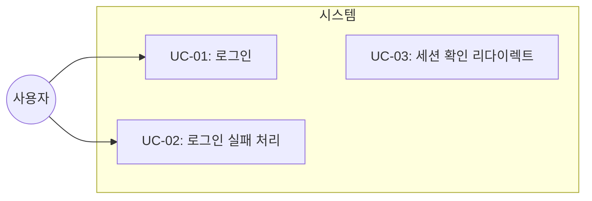
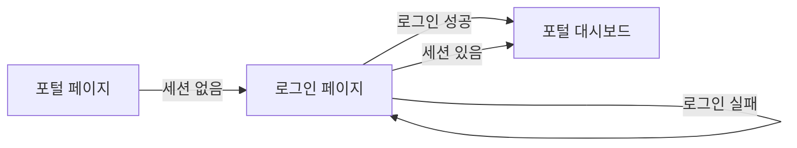
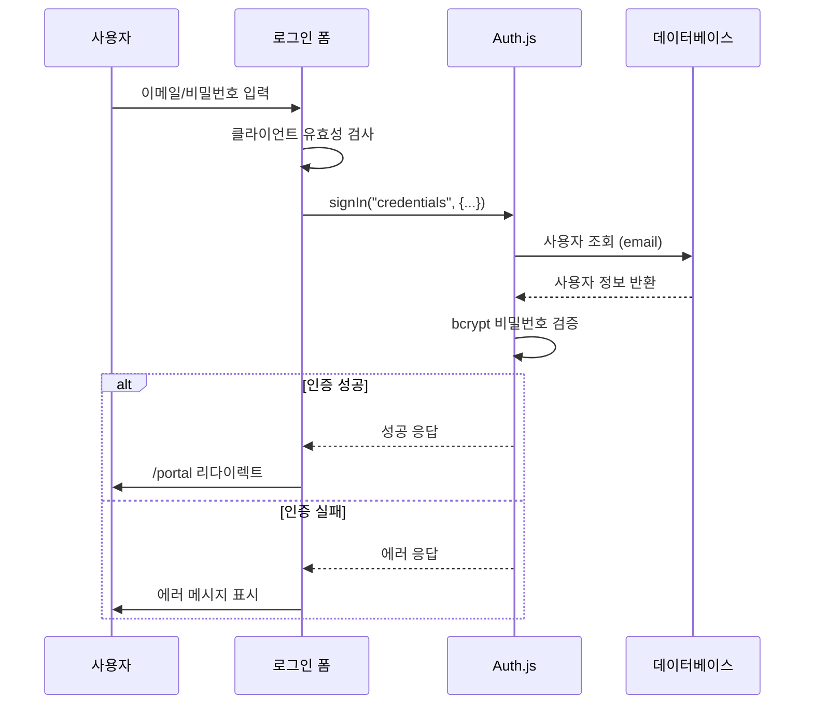

# TSK-04-04 - 로그인 페이지 설계 문서

## 문서 정보

| 항목 | 내용 |
|------|------|
| Task ID | TSK-04-04 |
| 문서 버전 | 1.0 |
| 작성일 | 2026-01-20 |
| 상태 | 작성중 |
| 카테고리 | development |

---

## 1. 개요

### 1.1 배경 및 문제 정의

**현재 상황:**
- MES Portal은 인증 시스템이 필요함
- TSK-04-02에서 User/Role 데이터 모델이 정의됨
- TSK-04-03에서 Auth.js 인증 백엔드가 구현될 예정
- 사용자가 시스템에 접근하기 위한 로그인 UI가 필요

**해결하려는 문제:**
- 사용자가 이메일/비밀번호로 인증할 수 있는 UI 부재
- 로그인 성공 시 포털로 이동하는 플로우 필요
- 유효성 검사 및 에러 메시지 표시 기능 필요

### 1.2 목적 및 기대 효과

**목적:**
- 사용자 친화적인 로그인 폼 UI 제공
- Auth.js signIn 함수를 통한 인증 처리
- 로그인 성공/실패에 대한 명확한 피드백 제공

**기대 효과:**
- 사용자가 쉽게 시스템에 로그인 가능
- 보안적인 인증 플로우 구현
- 일관된 디자인 시스템 적용 (Ant Design)

### 1.3 범위

**포함:**
- 로그인 폼 UI (이메일, 비밀번호 입력 필드)
- 클라이언트 측 유효성 검사
- Auth.js signIn 함수 연동
- 로그인 에러 메시지 표시
- 로그인 성공 시 /portal 리다이렉트
- 로그인 중 로딩 상태 표시

**제외:**
- 회원가입 페이지 (Phase 2 범위)
- 비밀번호 찾기/재설정 (Phase 2 범위)
- 소셜 로그인 (OAuth) (Phase 2 범위)
- Remember me 기능 (Phase 2 범위)

### 1.4 참조 문서

| 문서 | 경로 | 관련 섹션 |
|------|------|----------|
| PRD | `.orchay/projects/mes-portal/prd.md` | 4.1.4 사용자 관리 (로그인/로그아웃) |
| TRD | `.orchay/projects/mes-portal/trd.md` | 1.1 인증 (Auth.js), 2.3 MVP API Routes |
| TSK-04-02 설계 | `tasks/TSK-04-02/010-design.md` | 사용자 데이터 모델 |

---

## 2. 사용자 분석

### 2.1 대상 사용자

| 사용자 유형 | 특성 | 주요 니즈 |
|------------|------|----------|
| 시스템 관리자 (admin) | IT 전문 지식 보유 | 빠른 로그인, 보안 유지 |
| 생산 관리자 (manager) | 업무 중심 사용 | 직관적인 UI, 명확한 피드백 |
| 현장 작업자 (operator) | 기술 수준 다양 | 단순하고 쉬운 인터페이스 |

### 2.2 사용자 페르소나

**페르소나 1: 김관리 (시스템 관리자)**
- 역할: IT 부서 담당자
- 목표: 매일 아침 시스템 점검을 위해 빠르게 로그인
- 불만: 복잡한 로그인 절차, 불필요한 단계
- 시나리오: 출근 후 PC에서 MES Portal에 로그인하여 시스템 상태 확인

**페르소나 2: 박생산 (생산 관리자)**
- 역할: 공장 라인 관리자
- 목표: 생산 현황 모니터링을 위한 로그인
- 불만: 에러 발생 시 원인 불명확
- 시나리오: 사무실에서 대시보드 확인을 위해 로그인

---

## 3. 유즈케이스

### 3.1 유즈케이스 다이어그램



### 3.2 유즈케이스 상세

#### UC-01: 로그인

| 항목 | 내용 |
|------|------|
| 액터 | 모든 사용자 |
| 목적 | 이메일/비밀번호로 시스템 인증 |
| 사전 조건 | 사용자가 유효한 계정 보유 |
| 사후 조건 | 인증 성공, /portal로 리다이렉트 |
| 트리거 | 로그인 페이지 접근 |

**기본 흐름:**
1. 사용자가 로그인 페이지에 접근한다
2. 시스템이 로그인 폼을 표시한다
3. 사용자가 이메일과 비밀번호를 입력한다
4. 사용자가 로그인 버튼을 클릭한다
5. 시스템이 유효성 검사를 수행한다
6. 시스템이 Auth.js signIn 함수를 호출한다
7. 인증 성공 시 /portal로 리다이렉트한다

**대안 흐름:**
- 3a. 세션이 이미 존재하면:
  - 시스템이 자동으로 /portal로 리다이렉트한다

**예외 흐름:**
- 5a. 유효성 검사 실패 시:
  - 시스템이 해당 필드에 에러 메시지를 표시한다
- 6a. 인증 실패 시:
  - 시스템이 "이메일 또는 비밀번호가 올바르지 않습니다" 에러를 표시한다
- 6b. 계정 비활성 시:
  - 시스템이 "비활성화된 계정입니다. 관리자에게 문의하세요" 에러를 표시한다

#### UC-02: 로그인 실패 처리

| 항목 | 내용 |
|------|------|
| 액터 | 모든 사용자 |
| 목적 | 로그인 실패 시 사용자에게 피드백 제공 |
| 사전 조건 | 로그인 시도 실패 |
| 사후 조건 | 에러 메시지 표시, 재입력 가능 상태 |
| 트리거 | 인증 실패 |

**기본 흐름:**
1. 시스템이 에러 메시지를 폼 상단에 표시한다
2. 입력 필드는 유지되어 재입력 가능하다
3. 사용자가 수정 후 다시 로그인을 시도할 수 있다

#### UC-03: 세션 확인 리다이렉트

| 항목 | 내용 |
|------|------|
| 액터 | 시스템 |
| 목적 | 이미 로그인된 사용자 처리 |
| 사전 조건 | 유효한 세션 존재 |
| 사후 조건 | /portal로 자동 리다이렉트 |
| 트리거 | 로그인 페이지 접근 |

**기본 흐름:**
1. 사용자가 로그인 페이지에 접근한다
2. 시스템이 세션을 확인한다
3. 유효한 세션이 존재하면 /portal로 리다이렉트한다

---

## 4. 사용자 시나리오

### 4.1 시나리오 1: 정상 로그인

**상황 설명:**
생산 관리자 박생산이 출근 후 MES Portal에 로그인하여 대시보드를 확인하려는 상황

**단계별 진행:**

| 단계 | 사용자 행동 | 시스템 반응 | 사용자 기대 |
|------|-----------|------------|------------|
| 1 | 브라우저에서 MES Portal URL 접근 | 로그인 페이지 표시 | 로그인 폼이 보임 |
| 2 | 이메일 입력 (manager@example.com) | 입력값 표시 | 입력 확인 |
| 3 | 비밀번호 입력 (password123) | 마스킹 표시 (●●●●) | 보안 유지 |
| 4 | 로그인 버튼 클릭 | 로딩 스피너 표시 | 처리 중 인지 |
| 5 | (대기) | 인증 완료, 포털로 리다이렉트 | 대시보드 표시 |

**성공 조건:**
- 로그인 성공 후 /portal 페이지로 이동
- 세션에 사용자 정보 저장됨

### 4.2 시나리오 2: 잘못된 비밀번호 입력

**상황 설명:**
사용자가 비밀번호를 잘못 입력한 상황

**단계별 진행:**

| 단계 | 사용자 행동 | 시스템 반응 | 복구 방법 |
|------|-----------|------------|----------|
| 1 | 이메일 입력 (admin@example.com) | 입력값 표시 | - |
| 2 | 잘못된 비밀번호 입력 | 마스킹 표시 | - |
| 3 | 로그인 버튼 클릭 | 로딩 후 에러 표시 | - |
| 4 | 에러 메시지 확인 | "이메일 또는 비밀번호가 올바르지 않습니다" | 비밀번호 재입력 |

### 4.3 시나리오 3: 필수 입력 누락

**상황 설명:**
사용자가 필수 필드를 입력하지 않고 로그인 시도

**단계별 진행:**

| 단계 | 사용자 행동 | 시스템 반응 | 복구 방법 |
|------|-----------|------------|----------|
| 1 | 이메일 미입력, 비밀번호만 입력 | - | - |
| 2 | 로그인 버튼 클릭 | 이메일 필드 하단에 "이메일을 입력해주세요" 표시 | 이메일 입력 |
| 3 | 이메일 필드 포커스 | 입력 커서 이동 | 입력 진행 |

---

## 5. 화면 설계

### 5.1 화면 흐름도



### 5.2 화면별 상세

#### 화면 1: 로그인 페이지 (/login)

**화면 목적:**
사용자 인증을 위한 로그인 폼 제공. MES Portal 진입점 역할.

**진입 경로:**
- 브라우저에서 직접 URL 접근
- 인증되지 않은 상태로 포털 접근 시 리다이렉트
- 로그아웃 후 리다이렉트

**와이어프레임:**
```
┌─────────────────────────────────────────────────────────────────┐
│                                                                 │
│                                                                 │
│                                                                 │
│                    ┌───────────────────────┐                    │
│                    │                       │                    │
│                    │      🏭 MES Portal    │                    │
│                    │                       │                    │
│                    │  ┌─────────────────┐  │                    │
│                    │  │ 이메일           │  │                    │
│                    │  │ ________________│  │                    │
│                    │  └─────────────────┘  │                    │
│                    │                       │                    │
│                    │  ┌─────────────────┐  │                    │
│                    │  │ 비밀번호         │  │                    │
│                    │  │ ________________│  │                    │
│                    │  └─────────────────┘  │                    │
│                    │                       │                    │
│                    │  ┌─────────────────┐  │                    │
│                    │  │     로그인      │  │                    │
│                    │  └─────────────────┘  │                    │
│                    │                       │                    │
│                    └───────────────────────┘                    │
│                                                                 │
│                    © 2026 MES Portal v1.0.0                     │
│                                                                 │
└─────────────────────────────────────────────────────────────────┘
```

**화면 요소 설명:**

| 영역 | 설명 | 사용자 인터랙션 |
|------|------|----------------|
| 로고 | MES Portal 로고/텍스트 | 클릭 시 로그인 페이지 새로고침 |
| 이메일 필드 | 이메일 입력 (Input) | 텍스트 입력, 포커스 시 하이라이트 |
| 비밀번호 필드 | 비밀번호 입력 (Input.Password) | 마스킹 입력, 표시/숨김 토글 |
| 로그인 버튼 | Primary 버튼 | 클릭 시 인증 시도 |
| 에러 영역 | Alert 컴포넌트 (조건부 표시) | 에러 발생 시 표시 |
| 푸터 | 저작권 및 버전 정보 | 정보 표시만 |

**사용자 행동 시나리오:**
1. 사용자가 로그인 페이지에 진입하면 중앙에 로그인 카드를 본다
2. 이메일 필드에 이메일을 입력한다
3. Tab 또는 클릭으로 비밀번호 필드로 이동한다
4. 비밀번호를 입력한다
5. Enter 키 또는 로그인 버튼 클릭으로 로그인을 시도한다
6. 성공 시 포털 대시보드로 이동, 실패 시 에러 메시지 확인

#### 화면 상세 레이아웃

**카드 스타일:**
- 최대 너비: 400px
- 패딩: 32px
- 배경: 흰색 (라이트 모드) / 어두운 회색 (다크 모드)
- 그림자: Ant Design Card 기본 그림자
- 테두리 반경: 8px

**입력 필드:**
- 너비: 100%
- 높이: Ant Design 기본 (controlHeight)
- 라벨: 필드 상단
- 플레이스홀더: "이메일을 입력하세요", "비밀번호를 입력하세요"

**로그인 버튼:**
- 타입: Primary
- 너비: 100%
- 높이: 40px
- 텍스트: "로그인"

### 5.3 반응형 동작

| 화면 크기 | 레이아웃 변화 | 사용자 경험 |
|----------|--------------|------------|
| 데스크톱 (1024px+) | 카드 중앙 배치, 최대 400px | 여백 있는 깔끔한 UI |
| 태블릿 (768-1023px) | 카드 중앙 배치, 최대 400px | 동일 레이아웃 유지 |
| 모바일 (767px-) | 카드 전체 너비 (좌우 패딩 16px) | 터치 친화적 큰 입력 필드 |

---

## 6. 인터랙션 설계

### 6.1 사용자 액션과 피드백

| 사용자 액션 | 즉각 피드백 | 결과 피드백 | 에러 피드백 |
|------------|-----------|------------|------------|
| 필드 포커스 | 테두리 색상 변경 (Primary) | - | - |
| 텍스트 입력 | 실시간 표시 | - | - |
| 필드 블러 | 유효성 검사 실행 | 통과 시 변화 없음 | 필드 하단 에러 메시지 |
| 로그인 버튼 클릭 | 버튼 로딩 상태 (스피너) | 포털로 리다이렉트 | Alert 에러 메시지 |
| Enter 키 입력 | 폼 제출 동작 | 위와 동일 | 위와 동일 |

### 6.2 상태별 화면 변화

| 상태 | 화면 표시 | 사용자 안내 |
|------|----------|------------|
| 초기 상태 | 빈 폼 표시 | 플레이스홀더 텍스트 |
| 입력 중 | 입력값 표시 | 실시간 피드백 |
| 유효성 에러 | 필드 하단 빨간색 텍스트 | "이메일을 입력해주세요" 등 |
| 로그인 중 | 버튼 로딩 스피너 + 비활성화 | "로그인 중..." |
| 인증 실패 | 폼 상단 Alert (error) | "이메일 또는 비밀번호가 올바르지 않습니다" |
| 인증 성공 | 리다이렉트 전 로딩 유지 | 자동 화면 전환 |

### 6.3 키보드/접근성

| 기능 | 키보드 단축키 | 스크린 리더 안내 |
|------|-------------|-----------------|
| 다음 필드 이동 | Tab | "비밀번호 입력 필드" |
| 이전 필드 이동 | Shift+Tab | "이메일 입력 필드" |
| 폼 제출 | Enter | "로그인 버튼" |
| 비밀번호 표시 토글 | (버튼 클릭) | "비밀번호 표시/숨김" |

---

## 7. 데이터 요구사항

### 7.1 필요한 데이터

| 데이터 | 설명 | 출처 | 용도 |
|--------|------|------|------|
| 이메일 | 사용자 입력 | 로그인 폼 | 인증 요청 |
| 비밀번호 | 사용자 입력 | 로그인 폼 | 인증 요청 |
| 세션 정보 | Auth.js 세션 | 서버 | 인증 상태 확인 |
| 리다이렉트 URL | 쿼리 파라미터 | URL | 로그인 후 이동 경로 |

### 7.2 데이터 흐름



### 7.3 데이터 유효성 규칙

| 데이터 필드 | 규칙 | 위반 시 메시지 |
|------------|------|---------------|
| 이메일 | 필수, 이메일 형식 | "이메일을 입력해주세요" / "올바른 이메일 형식이 아닙니다" |
| 비밀번호 | 필수, 최소 1자 | "비밀번호를 입력해주세요" |

---

## 8. 비즈니스 규칙

### 8.1 핵심 규칙

| 규칙 ID | 규칙 설명 | 적용 상황 | 예외 |
|---------|----------|----------|------|
| BR-01 | 이메일과 비밀번호 모두 필수 입력 | 폼 제출 시 | 없음 |
| BR-02 | 비밀번호는 마스킹 처리 | 비밀번호 입력 시 | 표시 토글 시 평문 표시 |
| BR-03 | 로그인 실패 시 구체적 원인 미공개 | 인증 실패 시 | 보안상 이유 |
| BR-04 | 이미 로그인된 사용자는 자동 리다이렉트 | 로그인 페이지 접근 시 | 없음 |

### 8.2 규칙 상세 설명

**BR-03: 로그인 실패 시 구체적 원인 미공개**

설명: 보안상의 이유로 "이메일이 존재하지 않음" 또는 "비밀번호가 틀림"을 구분하지 않고 일괄적인 에러 메시지 표시

예시:
- 이메일 미존재 시: "이메일 또는 비밀번호가 올바르지 않습니다"
- 비밀번호 불일치 시: "이메일 또는 비밀번호가 올바르지 않습니다"
- 계정 비활성 시: "비활성화된 계정입니다. 관리자에게 문의하세요" (예외)

---

## 9. 에러 처리

### 9.1 예상 에러 상황

| 상황 | 원인 | 사용자 메시지 | 복구 방법 |
|------|------|--------------|----------|
| 필수 값 누락 | 이메일 또는 비밀번호 미입력 | "이메일을 입력해주세요" 등 | 해당 필드 입력 |
| 이메일 형식 오류 | 잘못된 이메일 형식 | "올바른 이메일 형식이 아닙니다" | 올바른 형식으로 재입력 |
| 인증 실패 | 이메일/비밀번호 불일치 | "이메일 또는 비밀번호가 올바르지 않습니다" | 재입력 |
| 계정 비활성 | isActive=false | "비활성화된 계정입니다. 관리자에게 문의하세요" | 관리자 문의 |
| 네트워크 오류 | 서버 연결 실패 | "네트워크 오류가 발생했습니다. 다시 시도해주세요" | 재시도 |
| 서버 오류 | 500 에러 | "서버 오류가 발생했습니다. 잠시 후 다시 시도해주세요" | 대기 후 재시도 |

### 9.2 에러 표시 방식

| 에러 유형 | 표시 위치 | 표시 방법 |
|----------|----------|----------|
| 필드 유효성 오류 | 해당 필드 하단 | Ant Design Form.Item 에러 상태 (빨간색 텍스트) |
| 인증 실패 | 폼 상단 | Ant Design Alert (type="error") |
| 네트워크/서버 오류 | 폼 상단 | Ant Design Alert (type="error") |

---

## 10. 연관 문서

| 문서 | 경로 | 용도 |
|------|------|------|
| 요구사항 추적 매트릭스 | `025-traceability-matrix.md` | PRD → 설계 → 테스트 양방향 추적 |
| 테스트 명세서 | `026-test-specification.md` | 단위/E2E/매뉴얼 테스트 상세 정의 |

---

## 11. 구현 범위

### 11.1 영향받는 영역

| 영역 | 변경 내용 | 영향도 |
|------|----------|--------|
| app/(auth)/login/page.tsx | 로그인 페이지 신규 생성 | 높음 |
| app/(auth)/layout.tsx | 인증 레이아웃 (선택적) | 중간 |
| components/auth/LoginForm.tsx | 로그인 폼 컴포넌트 | 높음 |

### 11.2 의존성

| 의존 항목 | 이유 | 상태 |
|----------|------|------|
| TSK-00-02 (UI 라이브러리 및 테마 설정) | Ant Design 컴포넌트 사용 | 완료 |
| TSK-04-02 (사용자 및 역할 모델) | User 데이터 모델 | [dd] 상태 |
| TSK-04-03 (Auth.js 인증 설정) | signIn 함수 사용 | [ ] Todo |

### 11.3 제약 사항

| 제약 | 설명 | 대응 방안 |
|------|------|----------|
| Auth.js 의존 | TSK-04-03 완료 후 완전 동작 | Mock signIn으로 개발 가능 |
| MVP 범위 | 회원가입, 비밀번호 찾기 제외 | Phase 2에서 구현 |

### 11.4 파일 구조

```
mes-portal/
├── app/
│   └── (auth)/
│       ├── layout.tsx          # 인증 레이아웃 (선택적)
│       └── login/
│           └── page.tsx        # 로그인 페이지
├── components/
│   └── auth/
│       └── LoginForm.tsx       # 로그인 폼 컴포넌트
```

### 11.5 기술 스택

| 기술 | 용도 |
|------|------|
| Next.js App Router | 페이지 라우팅 |
| Ant Design Form | 폼 레이아웃 및 유효성 검사 |
| Ant Design Input | 이메일/비밀번호 입력 |
| Ant Design Button | 로그인 버튼 |
| Ant Design Card | 로그인 카드 |
| Ant Design Alert | 에러 메시지 |
| Auth.js signIn | 인증 함수 |

---

## 12. 체크리스트

### 12.1 설계 완료 확인

- [x] 문제 정의 및 목적 명확화
- [x] 사용자 분석 완료
- [x] 유즈케이스 정의 완료
- [x] 사용자 시나리오 작성 완료
- [x] 화면 설계 완료 (와이어프레임)
- [x] 인터랙션 설계 완료
- [x] 데이터 요구사항 정의 완료
- [x] 비즈니스 규칙 정의 완료
- [x] 에러 처리 정의 완료

### 12.2 연관 문서 작성

- [ ] 요구사항 추적 매트릭스 작성 (→ `025-traceability-matrix.md`)
- [ ] 테스트 명세서 작성 (→ `026-test-specification.md`)

### 12.3 구현 준비

- [x] 구현 우선순위 결정
- [x] 의존성 확인 완료
- [x] 제약 사항 검토 완료

---

## 변경 이력

| 버전 | 일자 | 작성자 | 변경 내용 |
|------|------|--------|----------|
| 1.0 | 2026-01-20 | Claude | 최초 작성 |
