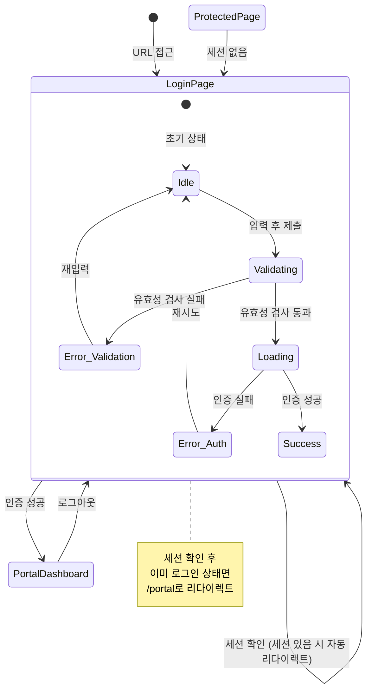

# TSK-04-04 로그인 페이지 - UI 설계 문서

## 문서 정보

| 항목 | 내용 |
|------|------|
| Task ID | TSK-04-04 |
| 문서 유형 | UI 설계 (011-ui-design) |
| 작성일 | 2026-01-20 |
| 버전 | 1.0 |
| 상태 | 작성 완료 |

---

## 1. 화면 목록

| 화면 ID | 화면명 | 경로 | 설명 |
|---------|--------|------|------|
| SCR-01 | 로그인 페이지 | /login | 사용자 인증을 위한 로그인 폼 화면 |

---

## 2. 화면 전환 흐름



---

## 3. 화면별 상세 설계

### SCR-01: 로그인 페이지

#### 3.1 화면 개요

| 항목 | 내용 |
|------|------|
| 화면 ID | SCR-01 |
| 화면명 | 로그인 페이지 |
| 경로 | /login |
| 목적 | 사용자 인증을 위한 로그인 폼 제공 |
| 진입 경로 | 직접 URL 접근, 인증 필요 페이지에서 리다이렉트, 로그아웃 후 |

#### 3.2 레이아웃 구조

```
+------------------------------------------------------------------+
|                                                                  |
|                                                                  |
|                                                                  |
|                   +----------------------------+                 |
|                   |                            |                 |
|                   |      [Logo/Title Area]     |                 |
|                   |        MES Portal          |                 |
|                   |                            |                 |
|                   |  +----------------------+  |                 |
|                   |  | [Error Alert Area]   |  |  <- 조건부 표시  |
|                   |  +----------------------+  |                 |
|                   |                            |                 |
|                   |  Email                     |                 |
|                   |  +----------------------+  |                 |
|                   |  | example@company.com  |  |                 |
|                   |  +----------------------+  |                 |
|                   |  [Field Error Message]     |  <- 조건부 표시  |
|                   |                            |                 |
|                   |  Password                  |                 |
|                   |  +----------------------+  |                 |
|                   |  | ************     [O] |  |  <- Eye Toggle  |
|                   |  +----------------------+  |                 |
|                   |  [Field Error Message]     |  <- 조건부 표시  |
|                   |                            |                 |
|                   |  +----------------------+  |                 |
|                   |  |       Login          |  |  <- Primary Btn |
|                   |  +----------------------+  |                 |
|                   |                            |                 |
|                   +----------------------------+                 |
|                                                                  |
|                   (c) 2026 MES Portal v1.0.0                     |
|                                                                  |
+------------------------------------------------------------------+
```

#### 3.3 컴포넌트 목록

| 컴포넌트 ID | 컴포넌트명 | Ant Design | Props/설정 |
|------------|-----------|------------|------------|
| CMP-01 | 로그인 카드 | Card | bordered, style: maxWidth 400px |
| CMP-02 | 로고/타이틀 | Typography.Title | level=2, 중앙 정렬 |
| CMP-03 | 에러 알림 | Alert | type="error", showIcon, closable |
| CMP-04 | 로그인 폼 | Form | layout="vertical" |
| CMP-05 | 이메일 입력 | Input | prefix: MailOutlined, placeholder |
| CMP-06 | 비밀번호 입력 | Input.Password | prefix: LockOutlined, placeholder |
| CMP-07 | 로그인 버튼 | Button | type="primary", block, htmlType="submit" |

#### 3.4 상태 관리

```typescript
interface LoginPageState {
  // 폼 상태
  email: string;
  password: string;

  // UI 상태
  isLoading: boolean;

  // 에러 상태
  authError: string | null;      // 인증 에러 메시지
  fieldErrors: {
    email?: string;
    password?: string;
  };
}

// 초기 상태
const initialState: LoginPageState = {
  email: '',
  password: '',
  isLoading: false,
  authError: null,
  fieldErrors: {}
};
```

#### 3.5 상태별 화면 변화

| 상태 | 화면 변화 | 와이어프레임 참조 |
|------|----------|-----------------|
| **Idle (기본)** | 빈 폼, 플레이스홀더 표시 | screen-01-login.svg |
| **Validating** | 필드별 유효성 검사 실행 | - |
| **Error_Validation** | 필드 하단 에러 메시지 (빨간색) | screen-01-login-error.svg |
| **Loading** | 버튼 로딩 스피너, 폼 비활성화 | screen-01-login-loading.svg |
| **Error_Auth** | 폼 상단 Alert 표시 | screen-01-login-error.svg |
| **Success** | 로딩 유지 후 리다이렉트 | - |

#### 3.6 사용자 액션

| 액션 ID | 액션 | 트리거 | 핸들러 | 결과 |
|---------|------|--------|--------|------|
| ACT-01 | 이메일 입력 | onChange | handleEmailChange | state.email 업데이트 |
| ACT-02 | 비밀번호 입력 | onChange | handlePasswordChange | state.password 업데이트 |
| ACT-03 | 비밀번호 표시 토글 | Click (eye icon) | - | 마스킹/평문 전환 |
| ACT-04 | 폼 제출 | Enter 또는 버튼 클릭 | handleSubmit | 인증 프로세스 시작 |
| ACT-05 | 에러 알림 닫기 | Click (close icon) | handleCloseAlert | authError = null |

#### 3.7 유효성 검사 규칙

| 필드 | 규칙 | 에러 메시지 |
|------|------|------------|
| email | required | 이메일을 입력해주세요 |
| email | type: email | 올바른 이메일 형식이 아닙니다 |
| password | required | 비밀번호를 입력해주세요 |

---

## 4. 반응형 설계

### 4.1 브레이크포인트 정의

| 브레이크포인트 | 범위 | 디바이스 |
|---------------|------|----------|
| Desktop | >= 1024px | 데스크톱 모니터 |
| Tablet | 768px - 1023px | 태블릿 (가로/세로) |
| Mobile | < 768px | 스마트폰 |

### 4.2 레이아웃별 변화

#### Desktop (>= 1024px)

```
+------------------------------------------------------------------+
|                                                                  |
|                                                                  |
|                                                                  |
|                   +----------------------------+                 |
|                   |                            |                 |
|                   |      MES Portal            |                 |
|                   |                            |                 |
|                   |      [Login Form]          |                 |
|                   |                            |                 |
|                   |      Width: 400px          |                 |
|                   |      Padding: 32px         |                 |
|                   |                            |                 |
|                   +----------------------------+                 |
|                                                                  |
|                   (c) 2026 MES Portal v1.0.0                     |
|                                                                  |
+------------------------------------------------------------------+
```

- 카드 너비: 400px (고정)
- 카드 패딩: 32px
- 화면 중앙 정렬 (flex justify-center align-center)
- 그림자: Card 기본 그림자

#### Tablet (768px - 1023px)

```
+---------------------------------------------+
|                                             |
|                                             |
|          +----------------------------+     |
|          |                            |     |
|          |      MES Portal            |     |
|          |                            |     |
|          |      [Login Form]          |     |
|          |                            |     |
|          |      Width: 400px          |     |
|          |      Padding: 32px         |     |
|          |                            |     |
|          +----------------------------+     |
|                                             |
|          (c) 2026 MES Portal v1.0.0         |
|                                             |
+---------------------------------------------+
```

- Desktop과 동일한 카드 크기 유지
- 화면 중앙 정렬

#### Mobile (< 768px)

```
+---------------------------+
|                           |
| +------------------------+|
| |                        ||
| |     MES Portal         ||
| |                        ||
| |     [Login Form]       ||
| |                        ||
| |     Width: 100%        ||
| |     Padding: 24px      ||
| |     Margin: 16px       ||
| |                        ||
| +------------------------+|
|                           |
| (c) 2026 MES Portal       |
|                           |
+---------------------------+
```

- 카드 너비: 100% (좌우 마진 16px)
- 카드 패딩: 24px (축소)
- 입력 필드 높이: 44px (터치 친화적)
- 버튼 높이: 44px

### 4.3 반응형 스타일 명세

```typescript
const responsiveStyles = {
  card: {
    desktop: {
      width: '400px',
      padding: '32px',
      borderRadius: '8px',
    },
    tablet: {
      width: '400px',
      padding: '32px',
      borderRadius: '8px',
    },
    mobile: {
      width: 'calc(100% - 32px)',
      margin: '0 16px',
      padding: '24px',
      borderRadius: '8px',
    },
  },
  input: {
    desktop: {
      height: '40px', // Ant Design controlHeight
    },
    mobile: {
      height: '44px', // 터치 친화적
    },
  },
  button: {
    desktop: {
      height: '40px',
    },
    mobile: {
      height: '44px',
    },
  },
};
```

---

## 5. 접근성 설계

### 5.1 키보드 네비게이션

| 키 | 동작 | 요소 |
|----|------|------|
| Tab | 다음 포커스 가능 요소로 이동 | 이메일 -> 비밀번호 -> 표시토글 -> 로그인버튼 |
| Shift+Tab | 이전 포커스 가능 요소로 이동 | 역순 |
| Enter | 폼 제출 (입력 필드 포커스 시) | 이메일, 비밀번호 필드 |
| Space | 버튼 활성화 | 로그인 버튼, 비밀번호 표시 토글 |
| Escape | 에러 알림 닫기 (알림 포커스 시) | Alert 닫기 버튼 |

### 5.2 포커스 순서 (Tab Index)

```
1. 이메일 입력 필드
2. 비밀번호 입력 필드
3. 비밀번호 표시/숨김 토글 버튼
4. 로그인 버튼
5. 에러 알림 닫기 버튼 (표시 시)
```

### 5.3 ARIA 속성

| 요소 | ARIA 속성 | 값 |
|------|----------|-----|
| 로그인 폼 | aria-label | "로그인 폼" |
| 이메일 입력 | aria-label | "이메일" |
| 이메일 입력 | aria-required | "true" |
| 이메일 입력 | aria-invalid | 에러 시 "true" |
| 이메일 입력 | aria-describedby | 에러 메시지 ID |
| 비밀번호 입력 | aria-label | "비밀번호" |
| 비밀번호 입력 | aria-required | "true" |
| 비밀번호 입력 | aria-invalid | 에러 시 "true" |
| 비밀번호 표시 토글 | aria-label | "비밀번호 표시/숨김" |
| 로그인 버튼 | aria-label | "로그인" |
| 로그인 버튼 | aria-busy | 로딩 시 "true" |
| 에러 알림 | role | "alert" |
| 에러 알림 | aria-live | "assertive" |

### 5.4 스크린 리더 안내

| 상황 | 안내 메시지 |
|------|------------|
| 페이지 진입 | "MES Portal 로그인 페이지입니다. 이메일과 비밀번호를 입력해주세요." |
| 이메일 필드 포커스 | "이메일, 텍스트 입력, 필수 입력 항목" |
| 이메일 에러 | "오류, 이메일을 입력해주세요" |
| 비밀번호 필드 포커스 | "비밀번호, 비밀번호 입력, 필수 입력 항목" |
| 비밀번호 에러 | "오류, 비밀번호를 입력해주세요" |
| 로그인 버튼 포커스 | "로그인 버튼" |
| 로딩 중 | "로그인 처리 중입니다. 잠시 기다려주세요." |
| 인증 실패 | "오류, 이메일 또는 비밀번호가 올바르지 않습니다" |
| 인증 성공 | "로그인 성공. 포털 페이지로 이동합니다." |

### 5.5 색상 대비

| 요소 | 전경색 | 배경색 | 대비율 | WCAG AA |
|------|--------|--------|--------|---------|
| 일반 텍스트 (라이트) | #000000 | #FFFFFF | 21:1 | Pass |
| 일반 텍스트 (다크) | #FFFFFF | #141414 | 15.3:1 | Pass |
| Primary 버튼 텍스트 | #FFFFFF | #1677FF | 4.6:1 | Pass |
| 에러 텍스트 | #FF4D4F | #FFFFFF | 4.5:1 | Pass |
| 플레이스홀더 (라이트) | #BFBFBF | #FFFFFF | 1.7:1 | Fail* |

*플레이스홀더는 장식적 텍스트로 WCAG 대비 요구사항에서 제외될 수 있음

---

## 6. 테마 지원

### 6.1 라이트 모드

| 요소 | 색상 변수 | 값 |
|------|----------|-----|
| 페이지 배경 | colorBgLayout | #F5F5F5 |
| 카드 배경 | colorBgContainer | #FFFFFF |
| 카드 테두리 | colorBorder | #D9D9D9 |
| 텍스트 (기본) | colorText | #000000 |
| 텍스트 (보조) | colorTextSecondary | #595959 |
| Primary | colorPrimary | #1677FF |
| Error | colorError | #FF4D4F |
| 입력 필드 배경 | colorBgContainer | #FFFFFF |
| 입력 필드 테두리 | colorBorder | #D9D9D9 |
| 입력 필드 포커스 테두리 | colorPrimary | #1677FF |

### 6.2 다크 모드

| 요소 | 색상 변수 | 값 |
|------|----------|-----|
| 페이지 배경 | colorBgLayout | #000000 |
| 카드 배경 | colorBgContainer | #141414 |
| 카드 테두리 | colorBorder | #424242 |
| 텍스트 (기본) | colorText | #FFFFFF |
| 텍스트 (보조) | colorTextSecondary | #A6A6A6 |
| Primary | colorPrimary | #1677FF |
| Error | colorError | #FF4D4F |
| 입력 필드 배경 | colorBgContainer | #1F1F1F |
| 입력 필드 테두리 | colorBorder | #424242 |
| 입력 필드 포커스 테두리 | colorPrimary | #1677FF |

---

## 7. 와이어프레임 목록

| 파일명 | 설명 | 상태 |
|--------|------|------|
| ui-assets/screen-01-login.svg | 기본 상태 (Idle) | 작성 완료 |
| ui-assets/screen-01-login-error.svg | 에러 상태 (유효성/인증 에러) | 작성 완료 |
| ui-assets/screen-01-login-loading.svg | 로딩 상태 | 작성 완료 |

---

## 8. 구현 가이드

### 8.1 컴포넌트 구조

```
app/(auth)/
  login/
    page.tsx          # 로그인 페이지 (Server Component wrapper)

components/auth/
  LoginForm.tsx       # 로그인 폼 컴포넌트 (Client Component)
```

### 8.2 사용할 Ant Design 컴포넌트

```typescript
import {
  Card,
  Form,
  Input,
  Button,
  Alert,
  Typography,
} from 'antd';
import {
  MailOutlined,
  LockOutlined,
} from '@ant-design/icons';
```

### 8.3 TailwindCSS 유틸리티 (레이아웃용)

```typescript
// 페이지 컨테이너
<div className="min-h-screen flex items-center justify-center">

// 카드 래퍼 (반응형)
<div className="w-full max-w-[400px] mx-4 md:mx-0">

// 푸터
<div className="text-center mt-8 text-gray-500">
```

### 8.4 폼 유효성 검사 (Ant Design Form)

```typescript
const rules = {
  email: [
    { required: true, message: '이메일을 입력해주세요' },
    { type: 'email', message: '올바른 이메일 형식이 아닙니다' },
  ],
  password: [
    { required: true, message: '비밀번호를 입력해주세요' },
  ],
};
```

---

## 변경 이력

| 버전 | 일자 | 작성자 | 변경 내용 |
|------|------|--------|----------|
| 1.0 | 2026-01-20 | Claude | 최초 작성 |
