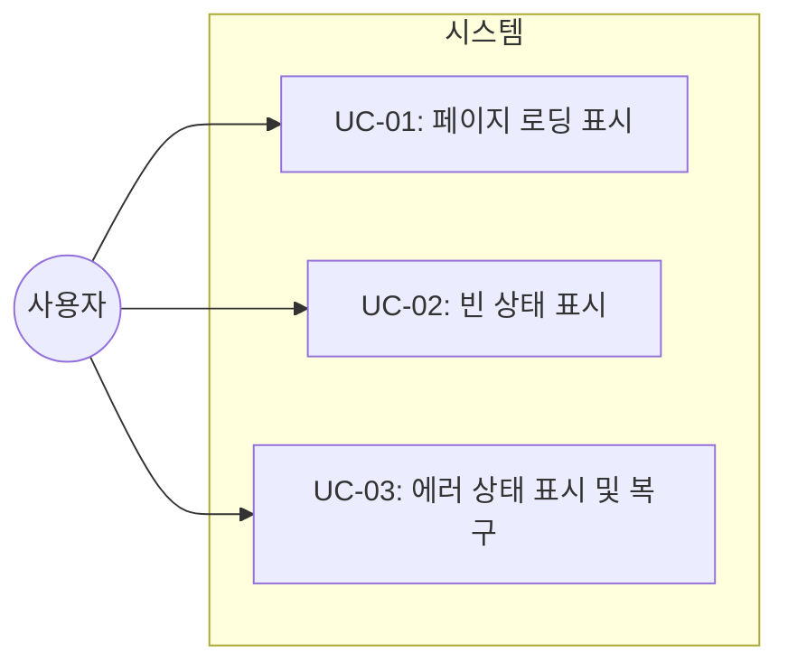
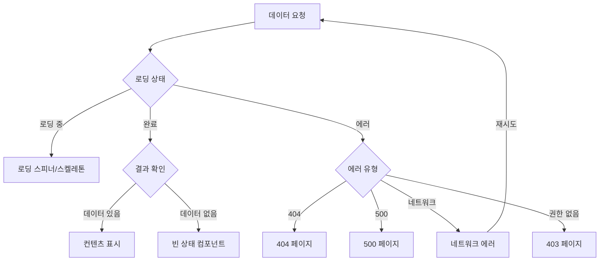

# TSK-05-01 - 로딩 및 에러 상태 컴포넌트 설계 문서

## 문서 정보

| 항목 | 내용 |
|------|------|
| Task ID | TSK-05-01 |
| 문서 버전 | 1.0 |
| 작성일 | 2026-01-20 |
| 상태 | 설계완료 |
| 카테고리 | development |

---

## 1. 개요

### 1.1 배경 및 문제 정의

**현재 상황:**
- 데이터 로딩 중 사용자에게 진행 상태를 알려주는 시각적 피드백이 없음
- 데이터가 없는 상태에서 사용자가 시스템 오류인지 실제로 데이터가 없는 것인지 구분 불가
- API 에러 발생 시 사용자 친화적인 안내 없이 기술적 오류만 표시됨

**해결하려는 문제:**
- 로딩 중 사용자의 불안감 해소 및 시스템 동작 상태 안내
- 빈 상태에서 사용자에게 적절한 안내와 행동 유도 제공
- 에러 발생 시 복구 방법 안내 및 재시도 기능 제공

### 1.2 목적 및 기대 효과

**목적:**
- 시스템 상태에 따른 일관된 UI 피드백 제공
- 공통 로딩/에러/빈 상태 컴포넌트를 통한 UX 표준화

**기대 효과:**
- 사용자 경험 향상: 시스템 상태를 명확히 인지
- 개발 효율성: 공통 컴포넌트 재사용으로 일관된 UI 구현
- 에러 복구율 향상: 재시도 버튼으로 간편한 복구

### 1.3 범위

**포함:**
- 전체 페이지 로딩 스피너 (PageLoading)
- 컴포넌트별 로딩 스켈레톤 (Skeleton)
- 빈 상태 컴포넌트 (EmptyState)
- 에러 경계 컴포넌트 (ErrorBoundary)
- 에러 상태 컴포넌트 (404, 500, 네트워크 오류)

**제외:**
- 비즈니스 로직별 커스텀 에러 처리 (개별 화면에서 처리)
- 서버사이드 에러 페이지 (Next.js 기본 error.tsx 사용)

### 1.4 참조 문서

| 문서 | 경로 | 관련 섹션 |
|------|------|----------|
| PRD | `.orchay/projects/mes-portal/prd.md` | 4.1.1 로딩 및 에러 상태 |
| TRD | `.orchay/projects/mes-portal/trd.md` | UI 컴포넌트 |

---

## 2. 사용자 분석

### 2.1 대상 사용자

| 사용자 유형 | 특성 | 주요 니즈 |
|------------|------|----------|
| 포털 사용자 | 다양한 기술 수준 | 시스템 상태를 직관적으로 파악하고 싶음 |
| 관리자 | 시스템 운영 담당 | 에러 발생 시 원인 파악 및 복구 필요 |

### 2.2 사용자 페르소나

**페르소나 1: 생산 담당자 김철수**
- 역할: 생산 라인 모니터링
- 목표: 빠르게 데이터 확인 및 작업 수행
- 불만: 로딩 중인지 에러인지 구분이 안 됨
- 시나리오: 대시보드 조회 시 데이터 로딩 상태 확인

---

## 3. 유즈케이스

### 3.1 유즈케이스 다이어그램



### 3.2 유즈케이스 상세

#### UC-01: 페이지 로딩 표시

| 항목 | 내용 |
|------|------|
| 액터 | 포털 사용자 |
| 목적 | 데이터 로딩 중임을 인지 |
| 사전 조건 | 데이터 요청 시작 |
| 사후 조건 | 데이터 로드 완료 또는 에러 |
| 트리거 | 페이지 진입, 데이터 조회 |

**기본 흐름:**
1. 사용자가 페이지에 진입한다
2. 시스템이 로딩 스피너를 표시한다
3. 데이터 로드가 완료된다
4. 시스템이 로딩 스피너를 숨기고 컨텐츠를 표시한다

**대안 흐름:**
- 2a. 부분 로딩인 경우:
  - 시스템이 컴포넌트별 스켈레톤을 표시한다
  - 각 컴포넌트가 개별적으로 로드 완료 후 실제 컨텐츠로 교체된다

#### UC-02: 빈 상태 표시

| 항목 | 내용 |
|------|------|
| 액터 | 포털 사용자 |
| 목적 | 데이터가 없음을 인지하고 다음 행동 유도 |
| 사전 조건 | 데이터 로드 완료 |
| 사후 조건 | 사용자가 다음 행동 선택 |
| 트리거 | 조회 결과 0건 |

**기본 흐름:**
1. 시스템이 데이터 조회를 완료한다
2. 결과가 0건이다
3. 시스템이 빈 상태 컴포넌트를 표시한다
4. 사용자가 안내 메시지와 행동 버튼을 확인한다

**대안 흐름:**
- 3a. 검색 결과가 없는 경우:
  - "검색 결과가 없습니다" 메시지와 필터 초기화 버튼 표시

#### UC-03: 에러 상태 표시 및 복구

| 항목 | 내용 |
|------|------|
| 액터 | 포털 사용자 |
| 목적 | 에러 상황 인지 및 복구 시도 |
| 사전 조건 | API 호출 실패 |
| 사후 조건 | 에러 복구 또는 안내 확인 |
| 트리거 | 네트워크 오류, 서버 오류 |

**기본 흐름:**
1. API 호출이 실패한다
2. 시스템이 에러 상태 컴포넌트를 표시한다
3. 사용자가 에러 메시지를 확인한다
4. 사용자가 재시도 버튼을 클릭한다
5. 시스템이 API를 재호출한다

**예외 흐름:**
- 2a. 404 에러인 경우:
  - "페이지를 찾을 수 없습니다" 메시지와 홈으로 이동 버튼 표시
- 2b. 403 에러인 경우:
  - "접근 권한이 없습니다" 메시지와 관리자 문의 안내 표시

---

## 4. 사용자 시나리오

### 4.1 시나리오 1: 대시보드 로딩

**상황 설명:**
생산 담당자 김철수가 아침에 출근하여 대시보드를 열어 전일 생산 현황을 확인하려고 한다.

**단계별 진행:**

| 단계 | 사용자 행동 | 시스템 반응 | 사용자 기대 |
|------|-----------|------------|------------|
| 1 | 대시보드 메뉴 클릭 | 페이지 로딩 스피너 표시 | 데이터를 불러오는 중임을 인지 |
| 2 | 로딩 화면 확인 | 스피너 애니메이션 동작 | 시스템이 동작 중임을 확인 |
| 3 | 대기 | 데이터 로드 완료, 대시보드 표시 | 원하는 정보 확인 |

**성공 조건:**
- 로딩 중 시각적 피드백으로 사용자 불안감 해소
- 로딩 완료 후 즉시 컨텐츠 표시

### 4.2 시나리오 2: 빈 목록 조회

**상황 설명:**
품질 담당자가 특정 날짜의 불량 이력을 조회했으나 해당 날짜에 불량이 없었다.

**단계별 진행:**

| 단계 | 사용자 행동 | 시스템 반응 | 사용자 기대 |
|------|-----------|------------|------------|
| 1 | 날짜 선택 후 조회 | 로딩 표시 후 빈 상태 컴포넌트 표시 | 결과가 없음을 명확히 인지 |
| 2 | 빈 상태 메시지 확인 | "해당 기간에 불량 이력이 없습니다" | 데이터가 없는 것이 정상임을 이해 |

**성공 조건:**
- 빈 상태가 오류가 아님을 명확히 전달
- 다른 날짜 선택 등 다음 행동 안내

### 4.3 시나리오 3: 네트워크 오류 발생

**상황 설명:**
사용자가 데이터를 조회하는 중 일시적인 네트워크 오류가 발생했다.

**단계별 진행:**

| 단계 | 사용자 행동 | 시스템 반응 | 복구 방법 |
|------|-----------|------------|----------|
| 1 | 데이터 조회 | 네트워크 오류 발생 | - |
| 2 | 에러 화면 확인 | "연결에 실패했습니다. 네트워크 상태를 확인해주세요." | 재시도 버튼 클릭 |
| 3 | 재시도 버튼 클릭 | 다시 로딩 시작 | 정상 조회 |

---

## 5. 화면 설계

### 5.1 화면 흐름도



### 5.2 화면별 상세

#### 화면 1: 전체 페이지 로딩 (PageLoading)

**화면 목적:**
페이지 전체 데이터 로딩 시 사용자에게 진행 상태 표시

**진입 경로:**
- 페이지 최초 진입 시
- 페이지 전환 시

**와이어프레임:**
```
┌─────────────────────────────────────────────────────────┐
│                                                         │
│                                                         │
│                                                         │
│                         ⟳                               │
│                   Loading...                            │
│                                                         │
│                                                         │
│                                                         │
└─────────────────────────────────────────────────────────┘
```

**화면 요소 설명:**

| 영역 | 설명 | 사용자 인터랙션 |
|------|------|----------------|
| 스피너 | Ant Design Spin 컴포넌트 | 없음 (자동 표시/숨김) |
| 텍스트 | "Loading..." 또는 커스텀 메시지 | 없음 |

#### 화면 2: 스켈레톤 로딩

**화면 목적:**
컴포넌트별 로딩 상태를 실제 레이아웃과 유사하게 표시

**와이어프레임:**
```
┌─────────────────────────────────────────────────────────┐
│  ┌─────────────────────────────────────────────────┐   │
│  │  ████████████████████                           │   │
│  │  ███████████████                                │   │
│  └─────────────────────────────────────────────────┘   │
│                                                         │
│  ┌─────────────────────────────────────────────────┐   │
│  │  ████████████████  │  ████████████████  │       │   │
│  │  ██████████████    │  ██████████████    │       │   │
│  │  ████████████████  │  ████████████████  │       │   │
│  └─────────────────────────────────────────────────┘   │
└─────────────────────────────────────────────────────────┘
```

#### 화면 3: 빈 상태 (EmptyState)

**화면 목적:**
데이터가 없을 때 사용자에게 상황 설명 및 행동 유도

**와이어프레임:**
```
┌─────────────────────────────────────────────────────────┐
│                                                         │
│                         📋                              │
│                                                         │
│                   데이터가 없습니다                      │
│           검색 조건을 변경하거나 새로 추가해보세요          │
│                                                         │
│                   [ 필터 초기화 ]                        │
│                                                         │
└─────────────────────────────────────────────────────────┘
```

**화면 요소 설명:**

| 영역 | 설명 | 사용자 인터랙션 |
|------|------|----------------|
| 아이콘 | 상황에 맞는 아이콘 | 없음 |
| 제목 | 빈 상태 설명 | 없음 |
| 설명 | 다음 행동 안내 | 없음 |
| 액션 버튼 | 필터 초기화, 추가 등 | 클릭 시 해당 액션 수행 |

#### 화면 4: 에러 상태 (404)

**와이어프레임:**
```
┌─────────────────────────────────────────────────────────┐
│                                                         │
│                         🔍                              │
│                                                         │
│                         404                             │
│                페이지를 찾을 수 없습니다                   │
│        요청하신 페이지가 존재하지 않거나 이동되었습니다        │
│                                                         │
│                   [ 홈으로 이동 ]                        │
│                                                         │
└─────────────────────────────────────────────────────────┘
```

#### 화면 5: 에러 상태 (500)

**와이어프레임:**
```
┌─────────────────────────────────────────────────────────┐
│                                                         │
│                         ⚠️                              │
│                                                         │
│                      서버 오류                           │
│              일시적인 오류가 발생했습니다                   │
│            잠시 후 다시 시도해주세요                       │
│                                                         │
│              [ 다시 시도 ]  [ 홈으로 ]                   │
│                                                         │
└─────────────────────────────────────────────────────────┘
```

#### 화면 6: 에러 상태 (403 권한 없음)

**화면 목적:**
접근 권한이 없는 페이지에 대한 안내 표시

**와이어프레임:**
```
┌─────────────────────────────────────────────────────────┐
│                                                         │
│                         🔒                              │
│                                                         │
│                    접근 권한 없음                         │
│           이 페이지에 접근할 권한이 없습니다                │
│           필요한 권한이 있는지 확인해주세요                 │
│                                                         │
│          [ 이전으로 ]  [ 홈으로 ]                        │
│                                                         │
└─────────────────────────────────────────────────────────┘
```

#### 화면 7: 에러 상태 (세션 만료)

**화면 목적:**
세션 만료 시 재로그인 안내 표시

**와이어프레임:**
```
┌─────────────────────────────────────────────────────────┐
│                                                         │
│                         🔒                              │
│                                                         │
│                   세션이 만료되었습니다                    │
│           보안을 위해 자동으로 로그아웃되었습니다            │
│                                                         │
│                   [ 다시 로그인 ]                        │
│                                                         │
└─────────────────────────────────────────────────────────┘
```

#### 화면 8: 에러 상태 (네트워크)

**화면 목적:**
네트워크 연결 실패 시 재시도 안내 표시

**와이어프레임:**
```
┌─────────────────────────────────────────────────────────┐
│                                                         │
│                         📡                              │
│                                                         │
│                    연결 실패                             │
│             네트워크 연결을 확인해주세요                    │
│                                                         │
│                   [ 다시 시도 ]                         │
│                                                         │
└─────────────────────────────────────────────────────────┘
```

**화면 요소 설명:**

| 영역 | 설명 | 사용자 인터랙션 |
|------|------|----------------|
| 아이콘 | 상황에 맞는 아이콘 (📡) | 없음 |
| 제목 | 에러 상태 설명 | 없음 |
| 설명 | 복구 방법 안내 | 없음 |
| 재시도 버튼 | Primary 버튼 | 클릭 시 API 재호출 |

### 5.3 반응형 동작

| 화면 크기 | 레이아웃 변화 | 사용자 경험 |
|----------|--------------|------------|
| 데스크톱 (1024px+) | 중앙 정렬, 여유 있는 간격 | 명확한 상태 인지 |
| 태블릿 (768-1023px) | 중앙 정렬, 간격 축소 | 동일한 경험 |
| 모바일 (767px-) | 중앙 정렬, 폰트 크기 축소 | 터치 친화적 버튼 |

---

## 6. 인터랙션 설계

### 6.1 사용자 액션과 피드백

| 사용자 액션 | 즉각 피드백 | 결과 피드백 | 에러 피드백 |
|------------|-----------|------------|------------|
| 페이지 진입 | 스피너 표시 | 컨텐츠 표시 | 에러 화면 |
| 재시도 버튼 클릭 | 버튼 로딩 상태 | 컨텐츠 표시 | 에러 재표시 |
| 홈으로 버튼 클릭 | 버튼 눌림 효과 | 홈 화면 이동 | - |

### 6.2 상태별 화면 변화

| 상태 | 화면 표시 | 사용자 안내 |
|------|----------|------------|
| 로딩 중 | Spin 컴포넌트 | "불러오는 중..." |
| 데이터 없음 | Empty 컴포넌트 | "데이터가 없습니다" |
| 404 에러 | Result warning | "페이지를 찾을 수 없습니다" |
| 500 에러 | Result error | "서버 오류가 발생했습니다" |
| 네트워크 에러 | Result info | "연결을 확인해주세요" |

### 6.3 키보드/접근성

| 기능 | 키보드 단축키 | 스크린 리더 안내 |
|------|-------------|-----------------|
| 재시도 | Enter (포커스 시) | "다시 시도 버튼" |
| 홈으로 | Enter (포커스 시) | "홈으로 이동 버튼" |
| 탭 이동 | Tab | 각 버튼으로 포커스 이동 |

---

## 7. 데이터 요구사항

### 7.1 필요한 데이터

| 데이터 | 설명 | 출처 | 용도 |
|--------|------|------|------|
| 로딩 상태 | boolean | 컴포넌트 상태 | 로딩 표시 여부 |
| 에러 정보 | Error 객체 | API 응답 | 에러 메시지 표시 |
| 데이터 배열 | Array | API 응답 | 빈 상태 판단 |

### 7.2 Props 인터페이스

**PageLoading:**
```typescript
interface PageLoadingProps {
  loading?: boolean;      // 로딩 표시 여부 (기본: true)
  tip?: string;           // 로딩 메시지 (기본: "불러오는 중...")
  size?: 'small' | 'default' | 'large';
  fullScreen?: boolean;   // 전체 화면 오버레이
  delay?: number;         // 깜빡임 방지 지연 (기본: 200ms)
}
```

**EmptyState:**
```typescript
interface EmptyStateProps {
  icon?: ReactNode;       // 커스텀 아이콘
  title?: string;         // 제목
  description?: string;   // 설명
  action?: ReactNode;     // 액션 버튼
  type?: 'default' | 'search' | 'filter';  // 프리셋 타입
}
```

**ErrorBoundary:**
```typescript
// ErrorBoundary: 런타임 에러 캐치 전용 (React Class 컴포넌트)
interface ErrorBoundaryProps {
  children: ReactNode;
  fallbackRender?: (props: { error: Error; resetError: () => void }) => ReactNode;
  onError?: (error: Error, errorInfo: ErrorInfo) => void;  // 에러 로깅 (민감 정보 필터링 적용)
}

// ErrorPage: HTTP 상태 코드 기반 에러 표시 전용 (Functional 컴포넌트)
interface ErrorPageProps {
  status: 403 | 404 | 500 | 'network' | 'session-expired';
  onRetry?: () => void;
  onGoHome?: () => void;
}
```

### 7.3 데이터 유효성 규칙

| 데이터 필드 | 규칙 | 위반 시 메시지 |
|------------|------|---------------|
| tip | 최대 50자 | - (잘림 처리) |
| title | 최대 30자 | - |
| description | 최대 100자 | - |

---

## 8. 비즈니스 규칙

### 8.1 핵심 규칙

| 규칙 ID | 규칙 설명 | 적용 상황 | 예외 |
|---------|----------|----------|------|
| BR-01 | 로딩 200ms 미만 시 스피너 미표시 (깜빡임 방지) | 전체 로딩 | 없음 |
| BR-02 | 재시도 3회 실패 시 관리자 문의 안내 | 네트워크 에러 | 없음 |
| BR-03 | 빈 상태에서 항상 다음 행동 안내 제공 | 데이터 없음 | 없음 |
| BR-04 | 로딩 시간 3초 이상 시 추가 안내 표시 | 장시간 로딩 | 없음 |

### 8.2 규칙 상세 설명

**BR-01: 로딩 깜빡임 방지**

설명: 로딩 시간이 200ms 미만일 경우 스피너를 표시하지 않아 깜빡임을 방지

예시:
- 로딩 0-200ms: 스피너 미표시
- 로딩 200ms+: 스피너 표시

**BR-04: 장시간 로딩 안내**

설명: 로딩이 3초 이상 지속되면 "잠시만 기다려주세요..." 등의 추가 메시지를 표시하여 사용자의 이탈 방지

예시:
- 로딩 0-3초: "불러오는 중..."
- 로딩 3초+: "잠시만 기다려주세요. 데이터를 준비 중입니다."

**BR-02: 재시도 제한**

설명: 무한 재시도 방지 및 사용자에게 다른 해결 방법 안내

예시:
- 재시도 1-2회: "다시 시도" 버튼 표시
- 재시도 3회 실패: "문제가 지속되면 관리자에게 문의해주세요" 안내

---

## 9. 에러 처리

### 9.1 예상 에러 상황

| 상황 | 원인 | 사용자 메시지 | 복구 방법 |
|------|------|--------------|----------|
| 404 | 페이지 없음 | "페이지를 찾을 수 없습니다" | 홈으로 이동 |
| 403 | 권한 없음 | "접근 권한이 없습니다" | 관리자 문의 |
| 500 | 서버 오류 | "서버 오류가 발생했습니다" | 재시도 |
| 네트워크 | 연결 끊김 | "네트워크 연결을 확인해주세요" | 재시도 |
| 타임아웃 | 응답 지연 | "요청 시간이 초과되었습니다" | 재시도 |

### 9.2 에러 표시 방식

| 에러 유형 | 표시 위치 | 표시 방법 |
|----------|----------|----------|
| 페이지 에러 | 전체 화면 | Result 컴포넌트 |
| 컴포넌트 에러 | 해당 영역 | ErrorBoundary fallback |
| API 에러 | 화면 상단 | Toast 알림 |

---

## 10. 연관 문서

> 상세 테스트 명세 및 요구사항 추적은 별도 문서에서 관리합니다.

| 문서 | 경로 | 용도 |
|------|------|------|
| 요구사항 추적 매트릭스 | `025-traceability-matrix.md` | PRD → 설계 → 테스트 양방향 추적 |
| 테스트 명세서 | `026-test-specification.md` | 단위/E2E/매뉴얼 테스트 상세 정의 |

---

## 11. 구현 범위

### 11.1 파일 구조

```
components/
├── common/
│   ├── PageLoading.tsx        # 전체 페이지 로딩
│   ├── EmptyState.tsx         # 빈 상태 컴포넌트
│   └── ErrorBoundary.tsx      # 에러 경계 컴포넌트
app/
├── not-found.tsx              # 404 페이지
├── error.tsx                  # 에러 페이지
└── loading.tsx                # 로딩 페이지 (선택적)
```

### 11.2 영향받는 영역

| 영역 | 변경 내용 | 영향도 |
|------|----------|--------|
| components/common | 새 컴포넌트 추가 | 높음 |
| app/ | 에러/로딩 페이지 추가 | 중간 |

### 11.3 의존성

| 의존 항목 | 이유 | 상태 |
|----------|------|------|
| TSK-00-02 UI 라이브러리 설정 | Ant Design 컴포넌트 사용 | 완료 |

### 11.4 사용할 Ant Design 컴포넌트

| 컴포넌트 | 용도 |
|----------|------|
| Spin | 로딩 스피너 |
| Skeleton | 스켈레톤 로딩 |
| Empty | 빈 상태 |
| Result | 에러 상태 (404, 500 등) |
| Button | 재시도, 홈으로 버튼 |

### 11.5 제약 사항

| 제약 | 설명 | 대응 방안 |
|------|------|----------|
| ErrorBoundary 클래스 컴포넌트 | React 제약 | 클래스 컴포넌트로 구현 |

---

## 12. 체크리스트

### 12.1 설계 완료 확인

- [x] 문제 정의 및 목적 명확화
- [x] 사용자 분석 완료
- [x] 유즈케이스 정의 완료
- [x] 사용자 시나리오 작성 완료
- [x] 화면 설계 완료 (와이어프레임)
- [x] 인터랙션 설계 완료
- [x] 데이터 요구사항 정의 완료
- [x] 비즈니스 규칙 정의 완료
- [x] 에러 처리 정의 완료

### 12.2 연관 문서 작성

- [x] 요구사항 추적 매트릭스 작성 (→ `025-traceability-matrix.md`)
- [x] 테스트 명세서 작성 (→ `026-test-specification.md`)

### 12.3 구현 준비

- [x] 구현 우선순위 결정
- [x] 의존성 확인 완료
- [x] 제약 사항 검토 완료

---

## 변경 이력

| 버전 | 일자 | 작성자 | 변경 내용 |
|------|------|--------|----------|
| 1.0 | 2026-01-20 | Claude | 최초 작성 |
| 1.1 | 2026-01-20 | Claude | 설계 리뷰 반영 (P1/P2 이슈 적용) |
