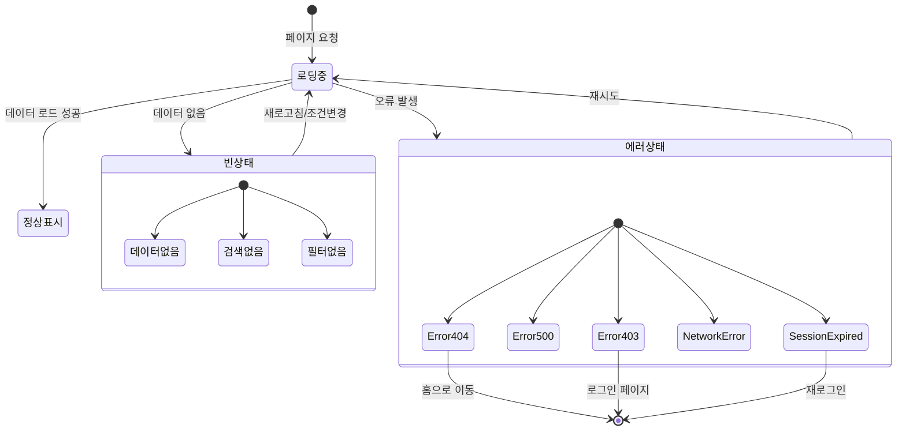

# TSK-05-01 - 로딩 및 에러 상태 컴포넌트 UI 설계

**Version:** 1.0 — **Last Updated:** 2026-01-20

> **목적**: 로딩, 빈 상태, 에러 상태에 대한 일관된 UX 패턴 및 컴포넌트 설계

---

## 1. 화면 목록

| 화면 ID | 화면명 | 목적 | SVG 참조 |
|---------|--------|------|----------|
| SCR-01 | 전체 페이지 로딩 | 페이지 전환/초기 로딩 시 중앙 스피너 표시 | `screen-01-page-loading.svg` |
| SCR-02 | 컴포넌트 스켈레톤 | 데이터 로딩 중 콘텐츠 영역 스켈레톤 표시 | `screen-02-skeleton.svg` |
| SCR-03 | 빈 상태 - 데이터 없음 | 조회 결과가 없을 때 안내 메시지 표시 | `screen-03-empty-nodata.svg` |
| SCR-04 | 빈 상태 - 검색 없음 | 검색 결과가 없을 때 안내 메시지 표시 | `screen-04-empty-search.svg` |
| SCR-05 | 빈 상태 - 필터 없음 | 필터 조건에 맞는 결과가 없을 때 표시 | `screen-05-empty-filter.svg` |
| SCR-06 | 에러 - 404 | 페이지를 찾을 수 없음 | `screen-06-error-404.svg` |
| SCR-07 | 에러 - 500 | 서버 내부 오류 | `screen-07-error-500.svg` |
| SCR-08 | 에러 - 네트워크 | 네트워크 연결 오류 | `screen-08-error-network.svg` |
| SCR-09 | 에러 - 403 권한없음 | 접근 권한 없음 | `screen-09-error-403.svg` |
| SCR-10 | 세션 만료 | 세션 타임아웃/인증 만료 | `screen-10-session-expired.svg` |

---

## 2. 화면 전환 흐름

### 2.1 상태 다이어그램



### 2.2 액션-화면 매트릭스

| 액션 | 현재 상태 | 결과 상태 | 트리거 |
|------|----------|----------|--------|
| 페이지 요청 | 정상표시 | 로딩중 | 사용자/라우터 |
| 로드 완료 | 로딩중 | 정상표시 | 시스템 |
| 데이터 없음 | 로딩중 | 빈상태 | 시스템 |
| 오류 발생 | 로딩중 | 에러상태 | 시스템 |
| 재시도 클릭 | 에러상태 | 로딩중 | 사용자 |
| 홈으로 클릭 | 404 | 홈 페이지 | 사용자 |
| 재로그인 클릭 | 세션만료 | 로그인 페이지 | 사용자 |
| 필터 초기화 | 필터없음 | 로딩중 | 사용자 |

---

## 3. 화면별 상세

### 3.1 SCR-01: 전체 페이지 로딩

**화면 목적**: 페이지 전환 또는 초기 로딩 시 전체 화면 로딩 표시

**레이아웃 구조**:
```
┌─────────────────────────────────────────────────────────────────────────┐
│                                                                         │
│                                                                         │
│                                                                         │
│                              ┌──────┐                                   │
│                              │  ◯   │ ← Spin (size="large")             │
│                              │  ↻   │                                   │
│                              └──────┘                                   │
│                                                                         │
│                          로딩 중입니다...                                │
│                                                                         │
│                                                                         │
│                                                                         │
└─────────────────────────────────────────────────────────────────────────┘
```

**컴포넌트 구성**:

| 영역 | 컴포넌트 | Props | 비고 |
|------|----------|-------|------|
| Container | `div` | `display: flex, align-items: center, justify-content: center` | 전체 화면 |
| Spinner | `Spin` | `size="large", tip="로딩 중입니다..."` | Ant Design |

**상태 관리**:
- `isLoading: boolean`
- `loadingMessage: string` (커스텀 메시지)

**사용자 액션**:
- 없음 (자동 상태 전환)

**스타일 토큰**:
```css
.page-loading {
  position: fixed;
  inset: 0;
  display: flex;
  flex-direction: column;
  align-items: center;
  justify-content: center;
  background: rgba(255, 255, 255, 0.9);
  z-index: 1000;
}

.page-loading-text {
  margin-top: 16px;
  color: var(--color-text-secondary);
  font-size: 14px;
}
```

---

### 3.2 SCR-02: 컴포넌트 스켈레톤

**화면 목적**: 데이터 로딩 중 콘텐츠 영역에 스켈레톤 UI 표시

**레이아웃 구조**:
```
┌─────────────────────────────────────────────────────────────────────────┐
│  테이블 스켈레톤                                                          │
├─────────────────────────────────────────────────────────────────────────┤
│  ▓▓▓▓▓▓▓▓▓▓  │  ▓▓▓▓▓▓▓▓  │  ▓▓▓▓▓▓▓▓▓▓▓▓  │  ▓▓▓▓▓▓  │  ▓▓▓▓▓▓▓▓    │ ← 헤더
├─────────────────────────────────────────────────────────────────────────┤
│  ░░░░░░░░░░  │  ░░░░░░░░  │  ░░░░░░░░░░░░  │  ░░░░░░  │  ░░░░░░░░    │
│  ░░░░░░░░░░  │  ░░░░░░░░  │  ░░░░░░░░░░░░  │  ░░░░░░  │  ░░░░░░░░    │
│  ░░░░░░░░░░  │  ░░░░░░░░  │  ░░░░░░░░░░░░  │  ░░░░░░  │  ░░░░░░░░    │
│  ░░░░░░░░░░  │  ░░░░░░░░  │  ░░░░░░░░░░░░  │  ░░░░░░  │  ░░░░░░░░    │
│  ░░░░░░░░░░  │  ░░░░░░░░  │  ░░░░░░░░░░░░  │  ░░░░░░  │  ░░░░░░░░    │
└─────────────────────────────────────────────────────────────────────────┘

┌──────────────────────┐  ┌──────────────────────┐  ┌──────────────────────┐
│  카드 스켈레톤         │  │  카드 스켈레톤         │  │  카드 스켈레톤         │
├──────────────────────┤  ├──────────────────────┤  ├──────────────────────┤
│  ┌───┐ ░░░░░░░░░░░░  │  │  ┌───┐ ░░░░░░░░░░░░  │  │  ┌───┐ ░░░░░░░░░░░░  │
│  │ ○ │ ░░░░░░░░░░░░  │  │  │ ○ │ ░░░░░░░░░░░░  │  │  │ ○ │ ░░░░░░░░░░░░  │
│  └───┘               │  │  └───┘               │  │  └───┘               │
│  ░░░░░░░░░░░░░░░░░░  │  │  ░░░░░░░░░░░░░░░░░░  │  │  ░░░░░░░░░░░░░░░░░░  │
│  ░░░░░░░░░░░░░░░░░░  │  │  ░░░░░░░░░░░░░░░░░░  │  │  ░░░░░░░░░░░░░░░░░░  │
│  ░░░░░░░░░░░░        │  │  ░░░░░░░░░░░░        │  │  ░░░░░░░░░░░░        │
└──────────────────────┘  └──────────────────────┘  └──────────────────────┘

┌─────────────────────────────────────────────────────────────────────────┐
│  폼 스켈레톤                                                             │
├─────────────────────────────────────────────────────────────────────────┤
│  ░░░░░░░░░░  (Label)                                                    │
│  ▓▓▓▓▓▓▓▓▓▓▓▓▓▓▓▓▓▓▓▓▓▓▓▓▓▓▓▓▓▓▓▓▓▓▓▓▓▓▓▓▓▓▓▓▓▓▓▓▓▓  (Input)           │
│                                                                         │
│  ░░░░░░░░░░  (Label)                                                    │
│  ▓▓▓▓▓▓▓▓▓▓▓▓▓▓▓▓▓▓▓▓▓▓▓▓▓▓▓▓▓▓▓▓▓▓▓▓▓▓▓▓▓▓▓▓▓▓▓▓▓▓  (Input)           │
│                                                                         │
│  ░░░░░░░░░░  (Label)                                                    │
│  ▓▓▓▓▓▓▓▓▓▓▓▓▓▓▓▓▓▓▓▓▓▓▓▓▓▓▓▓▓▓▓▓▓▓▓▓▓▓▓▓▓▓▓▓▓▓▓▓▓▓▓▓▓▓▓▓▓▓▓▓▓▓▓▓▓▓▓▓  │
│  ▓▓▓▓▓▓▓▓▓▓▓▓▓▓▓▓▓▓▓▓▓▓▓▓▓▓▓▓▓▓▓▓▓▓▓▓▓▓▓▓▓▓▓▓▓▓▓▓▓▓▓▓▓▓▓▓▓▓▓▓▓▓▓▓▓▓▓▓  │ (Textarea)
└─────────────────────────────────────────────────────────────────────────┘
```

**컴포넌트 구성**:

| 영역 | 컴포넌트 | Props | 비고 |
|------|----------|-------|------|
| 테이블 | `Skeleton.Input` | `active, style={{ width: '100%' }}` | 행 단위 반복 |
| 카드 | `Skeleton` | `active, avatar, paragraph={{ rows: 3 }}` | 카드 레이아웃 |
| 폼 | `Skeleton.Input` | `active, size="large"` | 필드별 적용 |

**스켈레톤 타입별 Props**:

```typescript
// 테이블 스켈레톤
interface TableSkeletonProps {
  columns: number;
  rows: number;
  showHeader?: boolean;
}

// 카드 스켈레톤
interface CardSkeletonProps {
  count: number;
  hasAvatar?: boolean;
}

// 폼 스켈레톤
interface FormSkeletonProps {
  fields: Array<'input' | 'textarea' | 'select'>;
}
```

---

### 3.3 SCR-03: 빈 상태 - 데이터 없음

**화면 목적**: 조회한 데이터가 없을 때 안내 메시지 표시

**레이아웃 구조**:
```
┌─────────────────────────────────────────────────────────────────────────┐
│                                                                         │
│                                                                         │
│                              ┌──────────┐                               │
│                              │   📭     │ ← Empty 이미지 (inbox)        │
│                              │          │                               │
│                              └──────────┘                               │
│                                                                         │
│                          데이터가 없습니다                                │
│                                                                         │
│                    조회된 데이터가 없습니다.                               │
│                    새로운 데이터를 등록해 주세요.                           │
│                                                                         │
│                          ┌─────────────┐                                │
│                          │  + 새로 등록  │ (선택적)                       │
│                          └─────────────┘                                │
│                                                                         │
└─────────────────────────────────────────────────────────────────────────┘
```

**컴포넌트 구성**:

| 영역 | 컴포넌트 | Props | 비고 |
|------|----------|-------|------|
| Container | `Empty` | `image={Empty.PRESENTED_IMAGE_SIMPLE}` | Ant Design |
| Description | `Empty.description` | - | 커스텀 메시지 |
| Action | `Button` | `type="primary"` | 선택적 CTA |

**Props Interface**:
```typescript
interface EmptyNoDataProps {
  title?: string;          // 기본: "데이터가 없습니다"
  description?: string;    // 기본: "조회된 데이터가 없습니다."
  showAction?: boolean;    // 기본: false
  actionText?: string;     // 버튼 텍스트
  onAction?: () => void;   // 버튼 클릭 핸들러
}
```

---

### 3.4 SCR-04: 빈 상태 - 검색 없음

**화면 목적**: 검색 결과가 없을 때 안내 메시지 표시

**레이아웃 구조**:
```
┌─────────────────────────────────────────────────────────────────────────┐
│                                                                         │
│                                                                         │
│                              ┌──────────┐                               │
│                              │   🔍     │ ← 검색 아이콘                   │
│                              │    ?     │                               │
│                              └──────────┘                               │
│                                                                         │
│                       검색 결과가 없습니다                                │
│                                                                         │
│                  "키워드"에 대한 검색 결과가 없습니다.                     │
│                  다른 검색어로 다시 시도해 주세요.                         │
│                                                                         │
│                          ┌─────────────┐                                │
│                          │  검색어 지우기 │                               │
│                          └─────────────┘                                │
│                                                                         │
└─────────────────────────────────────────────────────────────────────────┘
```

**컴포넌트 구성**:

| 영역 | 컴포넌트 | Props | 비고 |
|------|----------|-------|------|
| Container | `Empty` | `image={<SearchOutlined />}` | 커스텀 이미지 |
| Description | - | - | 검색어 포함 메시지 |
| Action | `Button` | `type="default"` | 검색어 초기화 |

**Props Interface**:
```typescript
interface EmptySearchProps {
  searchKeyword: string;   // 검색어
  onClear: () => void;     // 검색어 초기화 핸들러
}
```

---

### 3.5 SCR-05: 빈 상태 - 필터 없음

**화면 목적**: 필터 조건에 맞는 결과가 없을 때 안내 메시지 표시

**레이아웃 구조**:
```
┌─────────────────────────────────────────────────────────────────────────┐
│                                                                         │
│                                                                         │
│                              ┌──────────┐                               │
│                              │   🗂️     │ ← 필터 아이콘                   │
│                              │          │                               │
│                              └──────────┘                               │
│                                                                         │
│                    필터 조건에 맞는 결과가 없습니다                         │
│                                                                         │
│                  현재 적용된 필터: 상태(진행중), 담당자(홍길동)             │
│                  필터 조건을 변경하거나 초기화해 주세요.                    │
│                                                                         │
│                          ┌─────────────┐                                │
│                          │  필터 초기화  │                                │
│                          └─────────────┘                                │
│                                                                         │
└─────────────────────────────────────────────────────────────────────────┘
```

**컴포넌트 구성**:

| 영역 | 컴포넌트 | Props | 비고 |
|------|----------|-------|------|
| Container | `Empty` | `image={<FilterOutlined />}` | 커스텀 이미지 |
| Filter Info | `Tag` | `closable` | 적용된 필터 표시 |
| Action | `Button` | `type="default"` | 필터 초기화 |

**Props Interface**:
```typescript
interface EmptyFilterProps {
  appliedFilters: Array<{
    key: string;
    label: string;
    value: string;
  }>;
  onReset: () => void;     // 필터 초기화 핸들러
}
```

---

### 3.6 SCR-06: 에러 - 404

**화면 목적**: 요청한 페이지를 찾을 수 없음

**레이아웃 구조**:
```
┌─────────────────────────────────────────────────────────────────────────┐
│                                                                         │
│                                                                         │
│                              ┌──────────┐                               │
│                              │   404    │ ← Result status="404"         │
│                              │    🚫    │                               │
│                              └──────────┘                               │
│                                                                         │
│                       페이지를 찾을 수 없습니다                           │
│                                                                         │
│                  요청하신 페이지가 존재하지 않거나                         │
│                  이동되었을 수 있습니다.                                  │
│                                                                         │
│                          ┌─────────────┐                                │
│                          │   홈으로    │                                 │
│                          └─────────────┘                                │
│                                                                         │
└─────────────────────────────────────────────────────────────────────────┘
```

**컴포넌트 구성**:

| 영역 | 컴포넌트 | Props | 비고 |
|------|----------|-------|------|
| Container | `Result` | `status="404"` | Ant Design Result |
| Title | - | - | "페이지를 찾을 수 없습니다" |
| SubTitle | - | - | 상세 안내 |
| Action | `Button` | `type="primary"` | 홈으로 이동 |

---

### 3.7 SCR-07: 에러 - 500

**화면 목적**: 서버 내부 오류 발생

**레이아웃 구조**:
```
┌─────────────────────────────────────────────────────────────────────────┐
│                                                                         │
│                                                                         │
│                              ┌──────────┐                               │
│                              │   500    │ ← Result status="500"         │
│                              │    ⚠️    │                               │
│                              └──────────┘                               │
│                                                                         │
│                       서버 오류가 발생했습니다                            │
│                                                                         │
│                  일시적인 오류가 발생했습니다.                            │
│                  잠시 후 다시 시도해 주세요.                              │
│                                                                         │
│               ┌─────────────┐      ┌─────────────┐                      │
│               │   재시도    │      │   홈으로    │                       │
│               └─────────────┘      └─────────────┘                      │
│                                                                         │
└─────────────────────────────────────────────────────────────────────────┘
```

**컴포넌트 구성**:

| 영역 | 컴포넌트 | Props | 비고 |
|------|----------|-------|------|
| Container | `Result` | `status="500"` | Ant Design Result |
| Actions | `Space` | - | 버튼 그룹 |
| Retry | `Button` | `type="primary"` | 재시도 |
| Home | `Button` | `type="default"` | 홈으로 |

---

### 3.8 SCR-08: 에러 - 네트워크

**화면 목적**: 네트워크 연결 오류

**레이아웃 구조**:
```
┌─────────────────────────────────────────────────────────────────────────┐
│                                                                         │
│                                                                         │
│                              ┌──────────┐                               │
│                              │   📡    │ ← Result status="warning"      │
│                              │    ✕    │                                │
│                              └──────────┘                               │
│                                                                         │
│                       네트워크 연결 오류                                  │
│                                                                         │
│                  인터넷 연결을 확인해 주세요.                             │
│                  연결이 복구되면 자동으로 재시도합니다.                     │
│                                                                         │
│                          ┌─────────────┐                                │
│                          │   재시도    │                                 │
│                          └─────────────┘                                │
│                                                                         │
└─────────────────────────────────────────────────────────────────────────┘
```

**컴포넌트 구성**:

| 영역 | 컴포넌트 | Props | 비고 |
|------|----------|-------|------|
| Container | `Result` | `status="warning", icon={<WifiOutlined />}` | 커스텀 아이콘 |
| Auto Retry | `Typography.Text` | `type="secondary"` | 자동 재시도 안내 |
| Action | `Button` | `type="primary"` | 수동 재시도 |

---

### 3.9 SCR-09: 에러 - 403 권한없음

**화면 목적**: 접근 권한이 없음

**레이아웃 구조**:
```
┌─────────────────────────────────────────────────────────────────────────┐
│                                                                         │
│                                                                         │
│                              ┌──────────┐                               │
│                              │   403    │ ← Result status="403"         │
│                              │    🔒    │                               │
│                              └──────────┘                               │
│                                                                         │
│                        접근 권한이 없습니다                               │
│                                                                         │
│                  이 페이지에 접근할 권한이 없습니다.                       │
│                  관리자에게 문의하거나 다시 로그인해 주세요.                │
│                                                                         │
│               ┌─────────────┐      ┌─────────────┐                      │
│               │  다시 로그인 │      │  관리자 문의 │                      │
│               └─────────────┘      └─────────────┘                      │
│                                                                         │
└─────────────────────────────────────────────────────────────────────────┘
```

**컴포넌트 구성**:

| 영역 | 컴포넌트 | Props | 비고 |
|------|----------|-------|------|
| Container | `Result` | `status="403"` | Ant Design Result |
| Actions | `Space` | - | 버튼 그룹 |
| Login | `Button` | `type="primary"` | 로그인 페이지 |
| Contact | `Button` | `type="default"` | 관리자 문의 |

---

### 3.10 SCR-10: 세션 만료

**화면 목적**: 세션이 만료되어 재로그인 필요

**레이아웃 구조**:
```
┌─────────────────────────────────────────────────────────────────────────┐
│                                                                         │
│                                                                         │
│                              ┌──────────┐                               │
│                              │   ⏰    │ ← Result status="info"         │
│                              │          │                               │
│                              └──────────┘                               │
│                                                                         │
│                        세션이 만료되었습니다                              │
│                                                                         │
│                  보안을 위해 세션이 만료되었습니다.                        │
│                  계속 사용하시려면 다시 로그인해 주세요.                    │
│                                                                         │
│                          ┌─────────────┐                                │
│                          │  다시 로그인 │                                │
│                          └─────────────┘                                │
│                                                                         │
└─────────────────────────────────────────────────────────────────────────┘
```

**컴포넌트 구성**:

| 영역 | 컴포넌트 | Props | 비고 |
|------|----------|-------|------|
| Container | `Result` | `status="info", icon={<ClockCircleOutlined />}` | 커스텀 아이콘 |
| Action | `Button` | `type="primary"` | 로그인 페이지 |

---

## 4. 공통 컴포넌트

### 4.1 PageLoading

```typescript
interface PageLoadingProps {
  loading: boolean;
  tip?: string;
  fullscreen?: boolean;  // 기본: true
  delay?: number;        // 기본: 200ms (깜빡임 방지)
}
```

### 4.2 ContentSkeleton

```typescript
interface ContentSkeletonProps {
  type: 'table' | 'card' | 'form' | 'list';
  config?: {
    // 테이블
    columns?: number;
    rows?: number;
    // 카드
    count?: number;
    hasAvatar?: boolean;
    // 폼
    fields?: number;
  };
}
```

### 4.3 EmptyState

```typescript
interface EmptyStateProps {
  type: 'no-data' | 'no-search' | 'no-filter';
  title?: string;
  description?: string;
  extra?: React.ReactNode;
  // no-search 전용
  searchKeyword?: string;
  onClearSearch?: () => void;
  // no-filter 전용
  appliedFilters?: FilterItem[];
  onResetFilter?: () => void;
}
```

### 4.4 ErrorPage

```typescript
interface ErrorPageProps {
  status: 404 | 403 | 500 | 'network' | 'session-expired';
  title?: string;
  subTitle?: string;
  onRetry?: () => void;
  onGoHome?: () => void;
  onLogin?: () => void;
  showContact?: boolean;
}
```

---

## 5. 반응형 설계

### 5.1 Breakpoint별 레이아웃

| Breakpoint | 너비 범위 | 로딩/에러 컴포넌트 | 스켈레톤 |
|------------|----------|-------------------|---------|
| Desktop | 1024px+ | 중앙 정렬, 표준 크기 | 전체 열 표시 |
| Tablet | 768-1023px | 중앙 정렬, 표준 크기 | 열 수 축소 |
| Mobile | 0-767px | 전체 너비, 패딩 축소 | 단일 열 |

### 5.2 반응형 스켈레톤

```css
/* Desktop: 4열 카드 그리드 */
@media (min-width: 1024px) {
  .skeleton-card-grid {
    grid-template-columns: repeat(4, 1fr);
  }
}

/* Tablet: 2열 카드 그리드 */
@media (min-width: 768px) and (max-width: 1023px) {
  .skeleton-card-grid {
    grid-template-columns: repeat(2, 1fr);
  }
}

/* Mobile: 1열 카드 그리드 */
@media (max-width: 767px) {
  .skeleton-card-grid {
    grid-template-columns: 1fr;
  }
}
```

### 5.3 반응형 에러 페이지

```css
/* 에러 페이지 반응형 */
.error-page {
  padding: 48px 24px;
}

@media (max-width: 767px) {
  .error-page {
    padding: 24px 16px;
  }

  .error-page .ant-result-icon svg {
    width: 64px;
    height: 64px;
  }

  .error-page .ant-result-title {
    font-size: 20px;
  }
}
```

---

## 6. 접근성

### 6.1 키보드 네비게이션

| 키 | 동작 |
|----|------|
| Tab | 버튼/액션 요소로 포커스 이동 |
| Enter | 버튼 활성화 |
| Escape | 모달 닫기 (해당 시) |

### 6.2 ARIA 속성

| 요소 | ARIA 속성 | 값 |
|------|----------|-----|
| 로딩 컨테이너 | `role` | `status` |
| 로딩 컨테이너 | `aria-live` | `polite` |
| 로딩 컨테이너 | `aria-busy` | `true` |
| 스켈레톤 | `aria-hidden` | `true` |
| 빈 상태 | `role` | `alert` |
| 에러 페이지 | `role` | `alert` |
| 에러 페이지 | `aria-live` | `assertive` |

### 6.3 스크린 리더 안내

```typescript
// 로딩 상태 안내
<div role="status" aria-live="polite" aria-busy={loading}>
  {loading && <span className="sr-only">페이지를 불러오는 중입니다. 잠시만 기다려 주세요.</span>}
</div>

// 에러 상태 안내
<div role="alert" aria-live="assertive">
  <span className="sr-only">오류가 발생했습니다. {errorMessage}</span>
</div>
```

### 6.4 색상 대비

- 모든 텍스트: WCAG 2.1 AA 기준 충족 (4.5:1 이상)
- 아이콘: 비텍스트 요소 대비 3:1 이상
- 버튼: 배경과 텍스트 대비 4.5:1 이상

### 6.5 포커스 관리

```typescript
// 에러 페이지 진입 시 포커스 이동
useEffect(() => {
  if (error) {
    const errorTitle = document.querySelector('.error-page-title');
    errorTitle?.focus();
  }
}, [error]);
```

---

## 7. SVG 파일 목록

| 파일명 | 설명 | 뷰박스 |
|--------|------|--------|
| `screen-01-page-loading.svg` | 전체 페이지 로딩 | 800x600 |
| `screen-02-skeleton.svg` | 컴포넌트 스켈레톤 (테이블/카드/폼) | 800x600 |
| `screen-03-empty-nodata.svg` | 빈 상태 - 데이터 없음 | 800x600 |
| `screen-04-empty-search.svg` | 빈 상태 - 검색 없음 | 800x600 |
| `screen-05-empty-filter.svg` | 빈 상태 - 필터 없음 | 800x600 |
| `screen-06-error-404.svg` | 에러 - 404 | 800x600 |
| `screen-07-error-500.svg` | 에러 - 500 | 800x600 |
| `screen-08-error-network.svg` | 에러 - 네트워크 | 800x600 |
| `screen-09-error-403.svg` | 에러 - 403 권한없음 | 800x600 |
| `screen-10-session-expired.svg` | 세션 만료 | 800x600 |

---

## 관련 문서

- PRD: `../../../prd.md`
- TRD: `../../../trd.md`
- 디자인 시스템: `../../design-system.md`
