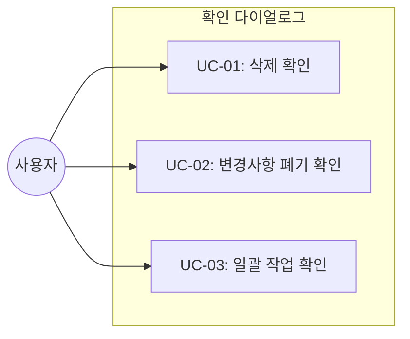
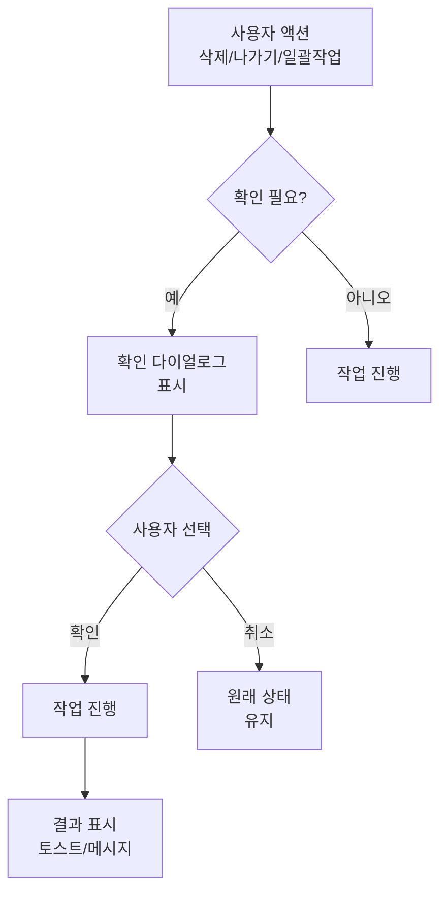

# TSK-05-02 - 확인 다이얼로그 설계 문서

## 문서 정보

| 항목 | 내용 |
|------|------|
| Task ID | TSK-05-02 |
| 문서 버전 | 1.0 |
| 작성일 | 2026-01-20 |
| 상태 | 작성중 |
| 카테고리 | development |

---

## 1. 개요

### 1.1 배경 및 문제 정의

**현재 상황:**
- 사용자가 삭제, 저장 취소 등 중요한 작업을 수행할 때 별도의 확인 절차가 없음
- 실수로 데이터를 삭제하거나 작업 내용을 잃을 위험이 있음
- 일괄 작업 시 영향받는 데이터 수를 사전에 인지하기 어려움

**해결하려는 문제:**
- 사용자의 실수로 인한 데이터 손실 방지
- 중요한 작업 전 사용자에게 명확한 확인 절차 제공
- 일관된 UX를 통한 사용자 경험 향상

### 1.2 목적 및 기대 효과

**목적:**
- 삭제, 저장 취소 등 위험 작업에 대한 확인 다이얼로그 제공
- 재사용 가능한 확인 다이얼로그 유틸리티 함수 구현

**기대 효과:**
- 사용자 관점: 실수로 인한 데이터 손실 방지, 안전한 작업 환경
- 개발자 관점: 일관된 API로 확인 다이얼로그 호출 가능

### 1.3 범위

**포함:**
- 삭제 확인 다이얼로그
- 저장되지 않은 변경사항 경고 다이얼로그
- 일괄 작업 확인 다이얼로그
- 유틸리티 함수 (confirmDelete, confirmDiscard)

**제외:**
- 세션 만료 경고 (별도 Task에서 처리)
- 작업 취소 확인 (별도 Task에서 처리)

### 1.4 참조 문서

| 문서 | 경로 | 관련 섹션 |
|------|------|----------|
| PRD | `.orchay/projects/mes-portal/prd.md` | 4.1.1 확인 다이얼로그 |
| TRD | `.orchay/projects/mes-portal/trd.md` | - |

---

## 2. 사용자 분석

### 2.1 대상 사용자

| 사용자 유형 | 특성 | 주요 니즈 |
|------------|------|----------|
| 모든 포털 사용자 | 다양한 기술 수준 | 실수 방지, 명확한 확인 절차 |
| 관리자 | 데이터 관리 담당 | 일괄 삭제 시 안전한 확인 |

### 2.2 사용자 페르소나

**페르소나 1: 생산 담당자 김철수**
- 역할: 생산 실적 입력 및 관리
- 목표: 빠르고 정확한 데이터 입력
- 불만: 실수로 데이터를 삭제했을 때 복구가 어려움
- 시나리오: 작업 지시서를 잘못 삭제하려다 확인 다이얼로그에서 취소

---

## 3. 유즈케이스

### 3.1 유즈케이스 다이어그램



### 3.2 유즈케이스 상세

#### UC-01: 삭제 확인

| 항목 | 내용 |
|------|------|
| 액터 | 포털 사용자 |
| 목적 | 데이터 삭제 전 사용자 확인 |
| 사전 조건 | 삭제할 대상 데이터가 선택됨 |
| 사후 조건 | 확인 시 삭제 진행, 취소 시 원상태 유지 |
| 트리거 | 삭제 버튼 클릭 |

**기본 흐름:**
1. 사용자가 삭제 버튼을 클릭한다
2. 시스템이 확인 다이얼로그를 표시한다 ("정말 삭제하시겠습니까?")
3. 사용자가 "삭제" 버튼을 클릭한다
4. 시스템이 삭제 작업을 수행한다
5. 성공 메시지가 표시된다

**대안 흐름:**
- 3a. 사용자가 "취소" 버튼을 클릭하면:
  - 다이얼로그가 닫히고 원래 화면으로 돌아간다
  - 데이터는 삭제되지 않는다

#### UC-02: 변경사항 폐기 확인

| 항목 | 내용 |
|------|------|
| 액터 | 포털 사용자 |
| 목적 | 저장하지 않은 변경사항 폐기 전 경고 |
| 사전 조건 | 폼에 저장되지 않은 변경사항이 있음 |
| 사후 조건 | 확인 시 변경사항 폐기, 취소 시 현재 상태 유지 |
| 트리거 | 탭 닫기, 페이지 이동, 취소 버튼 클릭 |

**기본 흐름:**
1. 사용자가 저장하지 않고 페이지를 벗어나려 한다
2. 시스템이 경고 다이얼로그를 표시한다 ("저장하지 않은 내용이 있습니다")
3. 사용자가 "나가기" 버튼을 클릭한다
4. 변경사항이 폐기되고 원하는 페이지로 이동한다

**대안 흐름:**
- 3a. 사용자가 "계속 수정" 버튼을 클릭하면:
  - 다이얼로그가 닫히고 현재 폼에 머무른다

#### UC-03: 일괄 작업 확인

| 항목 | 내용 |
|------|------|
| 액터 | 포털 사용자 |
| 목적 | 여러 건의 데이터에 대한 작업 확인 |
| 사전 조건 | 여러 개의 항목이 선택됨 |
| 사후 조건 | 확인 시 일괄 작업 수행 |
| 트리거 | 일괄 삭제/수정 버튼 클릭 |

**기본 흐름:**
1. 사용자가 여러 항목을 선택한다
2. 일괄 삭제 버튼을 클릭한다
3. 시스템이 확인 다이얼로그를 표시한다 ("5건을 삭제하시겠습니까?")
4. 사용자가 "삭제" 버튼을 클릭한다
5. 시스템이 선택된 항목들을 삭제한다

---

## 4. 사용자 시나리오

### 4.1 시나리오 1: 단일 항목 삭제

**상황 설명:**
생산 담당자가 잘못 입력된 작업 지시서를 삭제하려고 한다.

**단계별 진행:**

| 단계 | 사용자 행동 | 시스템 반응 | 사용자 기대 |
|------|-----------|------------|------------|
| 1 | 삭제 버튼 클릭 | 확인 다이얼로그 표시 | 실수 방지를 위한 확인 절차 |
| 2 | 다이얼로그 내용 확인 | "정말 삭제하시겠습니까?" 메시지 | 명확한 안내 |
| 3 | "삭제" 버튼 클릭 | 삭제 진행, 성공 토스트 | 작업 완료 확인 |

**성공 조건:**
- 확인 버튼 클릭 시에만 삭제가 진행됨

### 4.2 시나리오 2: 저장 안 하고 나가기

**상황 설명:**
관리자가 사용자 정보를 수정하다가 저장 없이 다른 화면으로 이동하려 한다.

**단계별 진행:**

| 단계 | 사용자 행동 | 시스템 반응 | 복구 방법 |
|------|-----------|------------|----------|
| 1 | 폼 수정 후 탭 닫기 | 경고 다이얼로그 표시 | "계속 수정" 클릭 |
| 2 | "계속 수정" 클릭 | 다이얼로그 닫힘, 폼 유지 | - |

### 4.3 시나리오 3: 일괄 삭제

**상황 설명:**
관리자가 비활성 사용자 10명을 일괄 삭제하려 한다.

**단계별 진행:**

| 단계 | 사용자 행동 | 시스템 반응 | 사용자 기대 |
|------|-----------|------------|------------|
| 1 | 10개 항목 체크박스 선택 | 선택 항목 강조 | 선택 확인 |
| 2 | "선택 삭제" 버튼 클릭 | 확인 다이얼로그 표시 | 건수 확인 |
| 3 | "10건을 삭제하시겠습니까?" 확인 | - | 정확한 건수 표시 |
| 4 | "삭제" 버튼 클릭 | 일괄 삭제 진행 | 모든 항목 삭제 |

---

## 5. 화면 설계

### 5.1 화면 흐름도



### 5.2 다이얼로그 유형별 상세

#### 다이얼로그 1: 삭제 확인

**화면 목적:**
데이터 삭제 전 사용자의 최종 확인을 받음

**와이어프레임:**
```
┌───────────────────────────────────────────────┐
│  ⚠️  삭제 확인                           [×]  │
├───────────────────────────────────────────────┤
│                                               │
│     정말 삭제하시겠습니까?                     │
│                                               │
│     이 작업은 되돌릴 수 없습니다.              │
│                                               │
├───────────────────────────────────────────────┤
│                      [취소]    [🗑️ 삭제]      │
└───────────────────────────────────────────────┘
```

**화면 요소 설명:**

| 영역 | 설명 | 사용자 인터랙션 |
|------|------|----------------|
| 헤더 | 다이얼로그 제목 + 닫기 버튼 | 닫기 클릭 시 취소와 동일 |
| 메시지 영역 | 확인 질문 + 경고 문구 | 읽기 전용 |
| 취소 버튼 | 기본 버튼 스타일 | 클릭 시 다이얼로그 닫힘 |
| 삭제 버튼 | 빨간색 위험 버튼 스타일 | 클릭 시 삭제 진행 |

#### 다이얼로그 2: 변경사항 폐기 경고

**와이어프레임:**
```
┌───────────────────────────────────────────────┐
│  ⚠️  저장되지 않은 변경사항               [×]  │
├───────────────────────────────────────────────┤
│                                               │
│     저장하지 않은 내용이 있습니다.             │
│                                               │
│     페이지를 벗어나면 변경사항이 사라집니다.   │
│                                               │
├───────────────────────────────────────────────┤
│                  [계속 수정]    [🚪 나가기]    │
└───────────────────────────────────────────────┘
```

**화면 요소 설명:**

| 영역 | 설명 | 사용자 인터랙션 |
|------|------|----------------|
| 메시지 영역 | 경고 메시지 | 읽기 전용 |
| 계속 수정 버튼 | Primary 버튼 스타일 | 클릭 시 폼으로 돌아감 |
| 나가기 버튼 | Default 버튼 스타일 | 클릭 시 이동 진행 |

#### 다이얼로그 3: 일괄 작업 확인

**와이어프레임:**
```
┌───────────────────────────────────────────────┐
│  ⚠️  일괄 삭제 확인                       [×]  │
├───────────────────────────────────────────────┤
│                                               │
│     5건을 삭제하시겠습니까?                   │
│                                               │
│     이 작업은 되돌릴 수 없습니다.              │
│                                               │
├───────────────────────────────────────────────┤
│                      [취소]    [🗑️ 삭제]      │
└───────────────────────────────────────────────┘
```

---

## 6. 인터랙션 설계

### 6.1 사용자 액션과 피드백

| 사용자 액션 | 즉각 피드백 | 결과 피드백 | 에러 피드백 |
|------------|-----------|------------|------------|
| 다이얼로그 열기 | 모달 애니메이션 (fade in) | - | - |
| 확인 버튼 클릭 | 버튼 로딩 상태 | 작업 결과 토스트 | 에러 토스트 |
| 취소 버튼 클릭 | 모달 닫힘 (fade out) | - | - |
| ESC 키 | 모달 닫힘 | - | - |
| 오버레이 클릭 | 모달 닫힘 | - | - |

### 6.2 상태별 화면 변화

| 상태 | 화면 표시 | 사용자 안내 |
|------|----------|------------|
| 다이얼로그 오픈 | 배경 딤 처리, 모달 표시 | 포커스 모달 내부로 이동 |
| 로딩 중 | 확인 버튼에 스피너 | 버튼 비활성화 |
| 작업 완료 | 모달 닫힘 | 결과 토스트 표시 |

### 6.3 키보드/접근성

| 기능 | 키보드 단축키 | 스크린 리더 안내 |
|------|-------------|-----------------|
| 다이얼로그 닫기 | ESC | "다이얼로그가 닫혔습니다" |
| 확인 버튼 포커스 | Tab | "삭제 버튼" |
| 확인 실행 | Enter (확인 버튼 포커스 시) | "삭제 진행" |

---

## 7. 데이터 요구사항

### 7.1 필요한 데이터

| 데이터 | 설명 | 출처 | 용도 |
|--------|------|------|------|
| 제목 | 다이얼로그 제목 | 호출 시 전달 | 헤더 표시 |
| 내용 | 확인 메시지 | 호출 시 전달 | 본문 표시 |
| 확인 버튼 텍스트 | 버튼 레이블 | 호출 시 전달 (기본값 있음) | 버튼 표시 |
| 위험 여부 | 위험 작업인지 | 호출 시 전달 | 버튼 스타일 결정 |
| 건수 | 일괄 작업 대상 수 | 호출 시 전달 | 메시지에 표시 |

### 7.2 유틸리티 함수 인터페이스

```typescript
interface ConfirmOptions {
  title?: string;
  content: string;
  okText?: string;
  cancelText?: string;
  danger?: boolean;
  onOk?: () => void | Promise<void>;
  onCancel?: () => void;
}

// 삭제 확인
function confirmDelete(options: {
  itemName?: string;
  count?: number;
  onOk: () => void | Promise<void>;
}): void;

// 변경사항 폐기 확인
function confirmDiscard(options: {
  onOk: () => void;
  onCancel?: () => void;
}): void;

// 일괄 작업 확인
function confirmBulkAction(options: {
  action: string;
  count: number;
  onOk: () => void | Promise<void>;
}): void;
```

---

## 8. 비즈니스 규칙

### 8.1 핵심 규칙

| 규칙 ID | 규칙 설명 | 적용 상황 | 예외 |
|---------|----------|----------|------|
| BR-01 | 삭제 작업은 항상 확인 필요 | 모든 삭제 버튼 | 없음 |
| BR-02 | 위험 작업은 빨간색 버튼 | 삭제, 영구 삭제 | 없음 |
| BR-03 | 변경사항 있으면 이탈 시 경고 | 폼 dirty 상태 | 저장 후 이동 시 |
| BR-04 | 일괄 작업은 건수 명시 | 2건 이상 선택 시 | 1건은 단일 삭제 |

### 8.2 규칙 상세 설명

**BR-01: 삭제 확인 필수**

설명: 사용자가 데이터를 삭제하려 할 때 반드시 확인 다이얼로그를 표시하여 실수 방지

예시:
- 테이블에서 행 삭제 버튼 클릭 시: 확인 다이얼로그 표시
- 상세 화면에서 삭제 버튼 클릭 시: 확인 다이얼로그 표시

**BR-02: 위험 버튼 스타일**

설명: 삭제 등 되돌릴 수 없는 작업의 확인 버튼은 빨간색으로 표시하여 위험성 인지

**BR-04: 일괄 작업 건수 표시**

설명: 여러 건의 데이터에 대한 작업 시 정확한 건수를 메시지에 포함

예시:
- 5개 선택 후 삭제: "5건을 삭제하시겠습니까?"
- 10개 선택 후 상태 변경: "10건의 상태를 변경하시겠습니까?"

---

## 9. 에러 처리

### 9.1 예상 에러 상황

| 상황 | 원인 | 사용자 메시지 | 복구 방법 |
|------|------|--------------|----------|
| 삭제 실패 | 서버 오류 | "삭제에 실패했습니다. 다시 시도해주세요." | 재시도 |
| 권한 없음 | 삭제 권한 없음 | "삭제 권한이 없습니다." | 관리자 문의 |
| 이미 삭제됨 | 동시성 이슈 | "이미 삭제된 항목입니다." | 목록 새로고침 |

### 9.2 에러 표시 방식

| 에러 유형 | 표시 위치 | 표시 방법 |
|----------|----------|----------|
| 서버 오류 | 화면 상단 | 에러 토스트 |
| 권한 오류 | 화면 상단 | 경고 토스트 |

---

## 10. 연관 문서

| 문서 | 경로 | 용도 |
|------|------|------|
| 요구사항 추적 매트릭스 | `025-traceability-matrix.md` | PRD → 설계 → 테스트 양방향 추적 |
| 테스트 명세서 | `026-test-specification.md` | 단위/E2E/매뉴얼 테스트 상세 정의 |

---

## 11. 구현 범위

### 11.1 영향받는 영역

| 영역 | 변경 내용 | 영향도 |
|------|----------|--------|
| lib/utils/confirm.ts | 유틸리티 함수 생성 | 높음 |
| 모든 삭제 기능 화면 | 확인 다이얼로그 적용 | 중간 |
| 모든 폼 화면 | 변경사항 경고 적용 | 중간 |

### 11.2 의존성

| 의존 항목 | 이유 | 상태 |
|----------|------|------|
| TSK-00-02 UI 라이브러리 설정 | Ant Design Modal.confirm 사용 | 완료 |

### 11.3 제약 사항

| 제약 | 설명 | 대응 방안 |
|------|------|----------|
| Ant Design 의존 | Modal.confirm API 사용 | Ant Design 6.x 버전 기준 |

---

## 12. 체크리스트

### 12.1 설계 완료 확인

- [x] 문제 정의 및 목적 명확화
- [x] 사용자 분석 완료
- [x] 유즈케이스 정의 완료
- [x] 사용자 시나리오 작성 완료
- [x] 화면 설계 완료 (와이어프레임)
- [x] 인터랙션 설계 완료
- [x] 데이터 요구사항 정의 완료
- [x] 비즈니스 규칙 정의 완료
- [x] 에러 처리 정의 완료

### 12.2 연관 문서 작성

- [ ] 요구사항 추적 매트릭스 작성 (→ `025-traceability-matrix.md`)
- [ ] 테스트 명세서 작성 (→ `026-test-specification.md`)

### 12.3 구현 준비

- [x] 구현 우선순위 결정
- [x] 의존성 확인 완료
- [x] 제약 사항 검토 완료

---

## 변경 이력

| 버전 | 일자 | 작성자 | 변경 내용 |
|------|------|--------|----------|
| 1.0 | 2026-01-20 | Claude | 최초 작성 |
