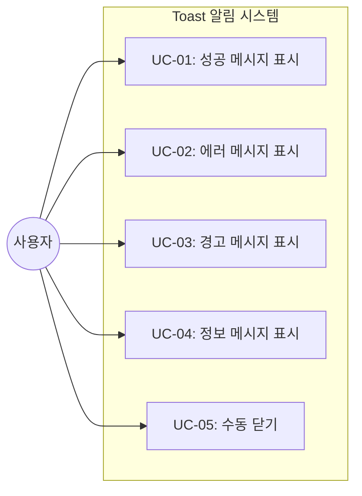
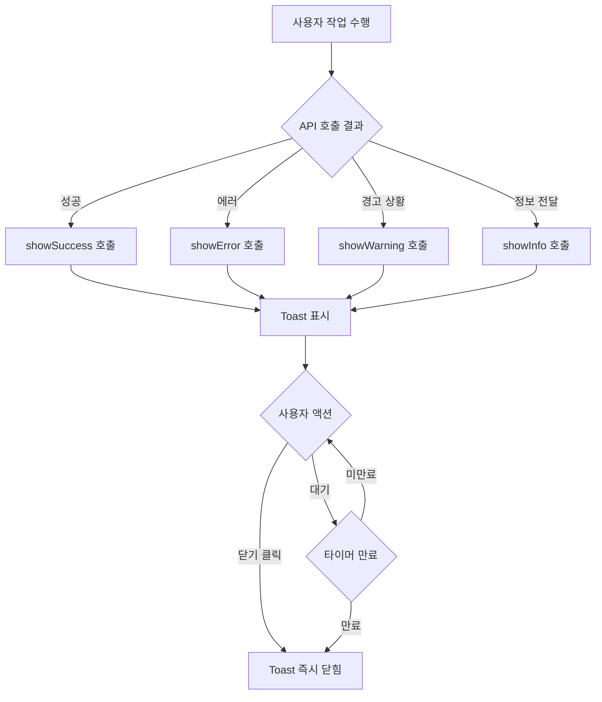

# TSK-05-03 - Toast 알림 컴포넌트 설계 문서

## 문서 정보

| 항목 | 내용 |
|------|------|
| Task ID | TSK-05-03 |
| 문서 버전 | 1.0 |
| 작성일 | 2026-01-20 |
| 상태 | 작성중 |
| 카테고리 | development |

---

## 1. 개요

### 1.1 배경 및 문제 정의

**현재 상황:**
- API 호출 성공/실패 시 사용자에게 즉각적인 피드백이 없음
- 폼 저장, 데이터 삭제 등 중요한 작업 완료 여부를 확인하기 어려움
- 시스템에서 발생하는 알림 메시지가 일관되지 않은 방식으로 표시됨

**해결하려는 문제:**
- 사용자 작업에 대한 즉각적인 피드백 제공
- 성공/정보/경고/에러 상황별 일관된 메시지 표시
- 개발자가 쉽게 호출할 수 있는 공통 유틸리티 함수 제공

### 1.2 목적 및 기대 효과

**목적:**
- 4가지 타입(성공/정보/경고/에러)의 Toast 알림 메시지 시스템 구현
- 재사용 가능한 유틸리티 함수를 통한 일관된 알림 표시

**기대 효과:**
- 사용자 관점: 작업 결과를 즉시 인지하여 다음 행동 결정 가능
- 개발자 관점: 간단한 함수 호출로 일관된 알림 표시
- 시스템 관점: 통일된 피드백 UX로 사용자 경험 향상

### 1.3 범위

**포함:**
- Toast 유틸리티 함수 (showSuccess, showError, showWarning, showInfo)
- 자동 닫힘 기능 (3-5초)
- 수동 닫기 버튼
- 메시지 타입별 아이콘 및 색상

**제외:**
- 알림 히스토리 관리 (알림 패널은 TSK-01-06에서 처리)
- 지속적인 알림 (영구 배너 등)
- 커스텀 액션 버튼이 포함된 복잡한 알림

### 1.4 참조 문서

| 문서 | 경로 | 관련 섹션 |
|------|------|----------|
| PRD | `.orchay/projects/mes-portal/prd.md` | 4.1.1 알림 (Toast/Notification) |
| TRD | `.orchay/projects/mes-portal/trd.md` | 7. PRD 요구사항 - 피드백/상태 |

---

## 2. 사용자 분석

### 2.1 대상 사용자

| 사용자 유형 | 특성 | 주요 니즈 |
|------------|------|----------|
| 포털 사용자 | 다양한 기술 수준 | 작업 결과를 즉시 알고 싶음 |
| 관리자 | 대량 데이터 처리 담당 | 일괄 작업 결과 확인 |
| 개발자 | 화면 개발 담당 | 쉽게 사용할 수 있는 알림 API |

### 2.2 사용자 페르소나

**페르소나 1: 생산 담당자 김철수**
- 역할: 생산 실적 입력
- 목표: 데이터 저장이 성공했는지 빠르게 확인
- 불만: 저장 버튼을 눌러도 성공했는지 바로 알 수 없음
- 시나리오: 생산 실적 입력 후 "저장되었습니다" 메시지로 확인

**페르소나 2: 품질 담당자 이영희**
- 역할: 품질 검사 결과 입력
- 목표: 입력 오류 발생 시 즉시 인지
- 불만: 에러가 발생해도 어디서 문제인지 모름
- 시나리오: 유효성 검사 실패 시 "필수 항목을 입력해주세요" 메시지 확인

---

## 3. 유즈케이스

### 3.1 유즈케이스 다이어그램



### 3.2 유즈케이스 상세

#### UC-01: 성공 메시지 표시

| 항목 | 내용 |
|------|------|
| 액터 | 시스템 (사용자 작업에 대한 응답) |
| 목적 | 작업이 성공적으로 완료되었음을 사용자에게 알림 |
| 사전 조건 | 사용자 작업 수행 (저장, 삭제, 수정 등) |
| 사후 조건 | Toast 메시지가 표시되고 자동으로 사라짐 |
| 트리거 | API 성공 응답, 작업 완료 |

**기본 흐름:**
1. 사용자가 데이터 저장 버튼을 클릭한다
2. API가 성공 응답을 반환한다
3. 시스템이 showSuccess("저장되었습니다")를 호출한다
4. 화면 상단에 녹색 성공 Toast가 나타난다
5. 3초 후 Toast가 자동으로 사라진다

**대안 흐름:**
- 4a. 사용자가 닫기(X) 버튼을 클릭하면:
  - Toast가 즉시 사라진다

#### UC-02: 에러 메시지 표시

| 항목 | 내용 |
|------|------|
| 액터 | 시스템 (에러 발생 시) |
| 목적 | 에러 발생을 사용자에게 알림 |
| 사전 조건 | API 호출 실패 또는 시스템 오류 |
| 사후 조건 | 에러 Toast 표시 |
| 트리거 | API 에러 응답, 네트워크 오류, 유효성 검사 실패 |

**기본 흐름:**
1. 사용자가 데이터 저장을 시도한다
2. API가 에러 응답을 반환한다
3. 시스템이 showError("저장에 실패했습니다")를 호출한다
4. 화면 상단에 빨간색 에러 Toast가 나타난다
5. 5초 후 Toast가 자동으로 사라진다 (에러는 더 오래 표시)

#### UC-03: 경고 메시지 표시

| 항목 | 내용 |
|------|------|
| 액터 | 시스템 (주의가 필요한 상황) |
| 목적 | 사용자에게 주의 사항 전달 |
| 사전 조건 | 주의가 필요한 상황 발생 |
| 사후 조건 | 경고 Toast 표시 |
| 트리거 | 세션 만료 임박, 대량 데이터 처리 시작 등 |

**기본 흐름:**
1. 세션 만료 5분 전이 된다
2. 시스템이 showWarning("5분 후 자동 로그아웃됩니다")를 호출한다
3. 화면 상단에 노란색 경고 Toast가 나타난다
4. 4초 후 Toast가 자동으로 사라진다

#### UC-04: 정보 메시지 표시

| 항목 | 내용 |
|------|------|
| 액터 | 시스템 (정보 전달) |
| 목적 | 일반적인 정보를 사용자에게 전달 |
| 사전 조건 | 사용자에게 전달할 정보 발생 |
| 사후 조건 | 정보 Toast 표시 |
| 트리거 | 데이터 로딩 완료, 상태 변경 알림 등 |

**기본 흐름:**
1. 백그라운드 데이터 동기화가 완료된다
2. 시스템이 showInfo("데이터가 동기화되었습니다")를 호출한다
3. 화면 상단에 파란색 정보 Toast가 나타난다
4. 3초 후 Toast가 자동으로 사라진다

#### UC-05: 수동 닫기

| 항목 | 내용 |
|------|------|
| 액터 | 포털 사용자 |
| 목적 | Toast를 즉시 닫기 |
| 사전 조건 | Toast가 화면에 표시 중 |
| 사후 조건 | Toast가 즉시 사라짐 |
| 트리거 | 닫기(X) 버튼 클릭 |

**기본 흐름:**
1. Toast가 화면에 표시된다
2. 사용자가 닫기(X) 버튼을 클릭한다
3. Toast가 즉시 사라진다

---

## 4. 사용자 시나리오

### 4.1 시나리오 1: 데이터 저장 성공

**상황 설명:**
생산 담당자 김철수가 오늘의 생산 실적을 입력하고 저장 버튼을 눌렀다.

**단계별 진행:**

| 단계 | 사용자 행동 | 시스템 반응 | 사용자 기대 |
|------|-----------|------------|------------|
| 1 | 생산 실적 입력 | 입력 폼 업데이트 | 데이터 입력 |
| 2 | 저장 버튼 클릭 | 로딩 상태 표시 | 저장 진행 중 |
| 3 | - | 성공 Toast "저장되었습니다" 표시 | 저장 완료 확인 |
| 4 | 다른 작업 진행 | Toast 3초 후 자동 사라짐 | 화면 방해 없음 |

**성공 조건:**
- 저장 성공 시 녹색 성공 Toast 표시
- 3초 후 자동으로 사라짐

### 4.2 시나리오 2: API 에러 발생

**상황 설명:**
품질 담당자 이영희가 검사 결과를 저장하려는데 서버 오류가 발생했다.

**단계별 진행:**

| 단계 | 사용자 행동 | 시스템 반응 | 복구 방법 |
|------|-----------|------------|----------|
| 1 | 저장 버튼 클릭 | 로딩 표시 | - |
| 2 | - | 에러 Toast "서버 오류가 발생했습니다. 다시 시도해주세요." | 재시도 |
| 3 | 닫기 버튼 클릭 | Toast 즉시 사라짐 | - |
| 4 | 저장 버튼 재클릭 | 저장 성공 | - |

### 4.3 시나리오 3: 여러 Toast 동시 표시

**상황 설명:**
사용자가 여러 항목을 일괄 처리하면서 여러 알림이 동시에 발생했다.

**단계별 진행:**

| 단계 | 사용자 행동 | 시스템 반응 | 사용자 기대 |
|------|-----------|------------|------------|
| 1 | 일괄 처리 실행 | 처리 시작 | - |
| 2 | - | 첫 번째 Toast 표시 | 메시지 확인 |
| 3 | - | 두 번째 Toast 표시 (위로 쌓임) | 순서대로 확인 |
| 4 | - | 각 Toast 순서대로 사라짐 | 겹치지 않음 |

**성공 조건:**
- 여러 Toast가 겹치지 않고 순서대로 쌓임
- 각각 개별적으로 닫히거나 자동 사라짐

---

## 5. 화면 설계

### 5.1 화면 흐름도



### 5.2 Toast 유형별 상세

#### Toast 1: 성공 (Success)

**화면 목적:**
작업 성공을 알리고 사용자에게 긍정적인 피드백 제공

**와이어프레임:**
```
                    화면 상단 중앙
                         ↓
┌─────────────────────────────────────────────────────────┐
│                        (기존 화면 컨텐츠)                 │
├─────────────────────────────────────────────────────────┤
│  ┌──────────────────────────────────────────────────┐   │
│  │  [V] 저장되었습니다.                          [×] │   │
│  └──────────────────────────────────────────────────┘   │
│                                                         │
│                        ...                              │
└─────────────────────────────────────────────────────────┘
```

**화면 요소 설명:**

| 영역 | 설명 | 스타일 |
|------|------|--------|
| 아이콘 [V] | 체크 아이콘 | 녹색 (#52c41a) |
| 메시지 | 성공 메시지 텍스트 | 기본 텍스트 |
| 닫기 [x] | 수동 닫기 버튼 | 회색, 호버 시 진하게 |
| 배경 | Toast 배경 | 연한 녹색 배경 또는 흰색 + 녹색 테두리 |

#### Toast 2: 에러 (Error)

**와이어프레임:**
```
┌──────────────────────────────────────────────────┐
│  [!] 저장에 실패했습니다. 다시 시도해주세요.  [×] │
└──────────────────────────────────────────────────┘
```

| 영역 | 설명 | 스타일 |
|------|------|--------|
| 아이콘 [!] | 에러/경고 아이콘 | 빨간색 (#ff4d4f) |
| 메시지 | 에러 메시지 텍스트 | 기본 텍스트 |
| 배경 | Toast 배경 | 연한 빨간색 배경 또는 흰색 + 빨간색 테두리 |

#### Toast 3: 경고 (Warning)

**와이어프레임:**
```
┌──────────────────────────────────────────────────┐
│  [⚠] 5분 후 자동 로그아웃됩니다.              [×] │
└──────────────────────────────────────────────────┘
```

| 영역 | 설명 | 스타일 |
|------|------|--------|
| 아이콘 [⚠] | 경고 아이콘 | 노란색 (#faad14) |
| 메시지 | 경고 메시지 텍스트 | 기본 텍스트 |
| 배경 | Toast 배경 | 연한 노란색 배경 또는 흰색 + 노란색 테두리 |

#### Toast 4: 정보 (Info)

**와이어프레임:**
```
┌──────────────────────────────────────────────────┐
│  [i] 데이터가 동기화되었습니다.               [×] │
└──────────────────────────────────────────────────┘
```

| 영역 | 설명 | 스타일 |
|------|------|--------|
| 아이콘 [i] | 정보 아이콘 | 파란색 (#1677ff) |
| 메시지 | 정보 메시지 텍스트 | 기본 텍스트 |
| 배경 | Toast 배경 | 연한 파란색 배경 또는 흰색 + 파란색 테두리 |

### 5.3 Toast 위치 및 스택

**위치:**
- 화면 상단 중앙에 표시 (Ant Design message 기본 위치)
- 헤더 아래, 컨텐츠 영역 위에 오버레이

**스택 동작:**
```
┌─────────────────────────────────────────────────────────┐
│                       HEADER                             │
├─────────────────────────────────────────────────────────┤
│                                                         │
│  ┌──────────────────────────────────────────────────┐   │  ← Toast 3 (가장 최근)
│  │  [V] 세 번째 메시지                          [×] │   │
│  └──────────────────────────────────────────────────┘   │
│  ┌──────────────────────────────────────────────────┐   │  ← Toast 2
│  │  [V] 두 번째 메시지                          [×] │   │
│  └──────────────────────────────────────────────────┘   │
│  ┌──────────────────────────────────────────────────┐   │  ← Toast 1 (가장 오래됨)
│  │  [V] 첫 번째 메시지                          [×] │   │
│  └──────────────────────────────────────────────────┘   │
│                                                         │
│                     (컨텐츠 영역)                        │
└─────────────────────────────────────────────────────────┘
```

### 5.4 반응형 동작

| 화면 크기 | 레이아웃 변화 | 사용자 경험 |
|----------|--------------|------------|
| 데스크톱 (1024px+) | 상단 중앙, 고정 너비 | 명확한 메시지 확인 |
| 태블릿 (768-1023px) | 상단 중앙, 패딩 축소 | 동일한 경험 |
| 모바일 (767px-) | 좌우 여백 최소화, 전체 너비 근접 | 메시지 잘 보임 |

---

## 6. 인터랙션 설계

### 6.1 사용자 액션과 피드백

| 사용자 액션 | 즉각 피드백 | 결과 피드백 | 에러 피드백 |
|------------|-----------|------------|------------|
| 저장 버튼 클릭 | 버튼 로딩 | 성공 Toast | 에러 Toast |
| 삭제 버튼 클릭 | 확인 다이얼로그 | 성공 Toast | 에러 Toast |
| Toast 닫기 클릭 | Toast 즉시 사라짐 | - | - |

### 6.2 애니메이션 및 전환

| 상태 | 애니메이션 | 지속 시간 |
|------|----------|----------|
| Toast 나타남 | fade-in + slide-down | 0.3초 |
| Toast 사라짐 | fade-out + slide-up | 0.3초 |
| 닫기 버튼 호버 | opacity 변경 | 0.2초 |

### 6.3 자동 닫힘 타이머

| Toast 유형 | 자동 닫힘 시간 | 근거 |
|-----------|--------------|------|
| 성공 (Success) | 3초 | 긍정적 메시지, 빠른 확인 |
| 정보 (Info) | 3초 | 일반 정보, 빠른 확인 |
| 경고 (Warning) | 4초 | 주의 필요, 조금 더 긴 노출 |
| 에러 (Error) | 5초 | 오류 인지 필요, 충분한 노출 |

### 6.4 키보드/접근성

| 기능 | 키보드 단축키 | 스크린 리더 안내 |
|------|-------------|-----------------|
| 닫기 | Escape (선택적) | "알림 메시지: [메시지 내용]" |
| 포커스 | Tab | Toast 영역으로 포커스 이동 가능 |

---

## 7. 데이터 요구사항

### 7.1 필요한 데이터

| 데이터 | 설명 | 출처 | 용도 |
|--------|------|------|------|
| content | 표시할 메시지 | 호출 시 전달 | Toast 본문 |
| duration | 자동 닫힘 시간 (초) | 호출 시 전달 (선택) | 타이머 설정 |
| key | 고유 식별자 | 자동 생성 또는 전달 | 중복 방지, 업데이트 |
| onClose | 닫힘 콜백 | 호출 시 전달 (선택) | 후처리 |

### 7.2 유틸리티 함수 인터페이스

```typescript
// lib/utils/toast.ts

// 기본 옵션 인터페이스
interface ToastOptions {
  content: string;           // 표시할 메시지 (필수)
  duration?: number;         // 자동 닫힘 시간 (초), 0이면 자동 닫힘 안 함
  key?: string;              // 고유 키 (중복 방지)
  onClose?: () => void;      // 닫힘 콜백
}

// 성공 Toast
function showSuccess(content: string, options?: Omit<ToastOptions, 'content'>): void;
function showSuccess(options: ToastOptions): void;

// 에러 Toast
function showError(content: string, options?: Omit<ToastOptions, 'content'>): void;
function showError(options: ToastOptions): void;

// 경고 Toast
function showWarning(content: string, options?: Omit<ToastOptions, 'content'>): void;
function showWarning(options: ToastOptions): void;

// 정보 Toast
function showInfo(content: string, options?: Omit<ToastOptions, 'content'>): void;
function showInfo(options: ToastOptions): void;

// 로딩 Toast (작업 중 표시)
function showLoading(content: string, key?: string): void;

// Toast 숨기기 (특정 key로 표시된 Toast)
function hideToast(key: string): void;

// 모든 Toast 숨기기
function hideAllToasts(): void;
```

### 7.3 사용 예시

```typescript
import { showSuccess, showError, showWarning, showInfo, showLoading, hideToast } from '@/lib/utils/toast';

// 간단한 사용
showSuccess('저장되었습니다.');
showError('저장에 실패했습니다.');
showWarning('5분 후 자동 로그아웃됩니다.');
showInfo('데이터가 동기화되었습니다.');

// 옵션 사용
showSuccess('저장되었습니다.', { duration: 5 });
showError({
  content: '네트워크 오류가 발생했습니다.',
  duration: 0,  // 자동으로 닫히지 않음
  onClose: () => console.log('Toast closed')
});

// 로딩 → 성공 패턴
const key = 'save-loading';
showLoading('저장 중...', key);
// ... API 호출
hideToast(key);
showSuccess('저장되었습니다.');
```

### 7.4 데이터 유효성 규칙

| 데이터 필드 | 규칙 | 기본값 |
|------------|------|--------|
| content | 필수, 비어있지 않음 | - |
| duration | 0 이상의 숫자 | 유형별 기본값 |
| key | 문자열 | 자동 생성 |

---

## 8. 비즈니스 규칙

### 8.1 핵심 규칙

| 규칙 ID | 규칙 설명 | 적용 상황 | 예외 |
|---------|----------|----------|------|
| BR-01 | API 성공 시 성공 Toast 표시 | 저장, 수정, 삭제 완료 | 무음 처리가 필요한 경우 |
| BR-02 | API 에러 시 에러 Toast 표시 | 모든 API 에러 | 별도 에러 페이지로 이동하는 경우 |
| BR-03 | Toast는 자동으로 닫혀야 함 | 모든 Toast | duration: 0 설정 시 |
| BR-04 | 에러 Toast는 더 오래 표시 | 에러 발생 시 | 없음 |
| BR-05 | 동일 key Toast는 업데이트 | 같은 key로 재호출 | 없음 |

### 8.2 규칙 상세 설명

**BR-01: API 성공 시 성공 Toast**

설명: 데이터 저장, 수정, 삭제 등 사용자 작업이 성공하면 반드시 성공 메시지를 표시하여 사용자에게 피드백 제공

예시:
- 사용자 정보 저장 성공: "저장되었습니다."
- 데이터 삭제 성공: "삭제되었습니다."
- 상태 변경 성공: "상태가 변경되었습니다."

**BR-04: 에러 Toast 지속 시간**

설명: 에러 메시지는 사용자가 충분히 인지할 수 있도록 성공 메시지보다 더 오래 표시

예시:
- 성공: 3초 후 자동 닫힘
- 에러: 5초 후 자동 닫힘

**BR-05: 동일 key Toast 업데이트**

설명: 같은 key로 Toast를 호출하면 새로운 Toast가 추가되지 않고 기존 Toast 내용이 업데이트됨

예시:
- 로딩 중 → 성공: 같은 key 사용하여 "로딩 중..." → "저장되었습니다."로 전환

---

## 9. 에러 처리

### 9.1 예상 에러 상황

| 상황 | 원인 | 사용자 메시지 | 복구 방법 |
|------|------|--------------|----------|
| 네트워크 오류 | 인터넷 연결 끊김 | "네트워크 연결을 확인해주세요." | 네트워크 확인 후 재시도 |
| 서버 오류 (500) | 서버 장애 | "서버 오류가 발생했습니다. 잠시 후 다시 시도해주세요." | 잠시 대기 후 재시도 |
| 권한 오류 (403) | 권한 없음 | "이 작업을 수행할 권한이 없습니다." | 관리자 문의 |
| 유효성 오류 (400) | 잘못된 입력 | "입력 내용을 확인해주세요." | 입력값 수정 |
| 세션 만료 (401) | 로그인 만료 | "세션이 만료되었습니다. 다시 로그인해주세요." | 재로그인 |

### 9.2 에러 Toast 표시 원칙

| 에러 유형 | Toast 유형 | 표시 방법 |
|----------|----------|----------|
| 네트워크 오류 | error | showError 함수 |
| 서버 오류 | error | showError 함수 |
| 권한 오류 | warning | showWarning 함수 |
| 유효성 오류 | warning 또는 error | 상황에 따라 선택 |

---

## 10. 연관 문서

> 상세 테스트 명세 및 요구사항 추적은 별도 문서에서 관리합니다.

| 문서 | 경로 | 용도 |
|------|------|------|
| 요구사항 추적 매트릭스 | `025-traceability-matrix.md` | PRD → 설계 → 테스트 양방향 추적 |
| 테스트 명세서 | `026-test-specification.md` | 단위/E2E/매뉴얼 테스트 상세 정의 |

---

## 11. 구현 범위

### 11.1 파일 구조

```
lib/
├── utils/
│   └── toast.ts              # Toast 유틸리티 함수
```

### 11.2 영향받는 영역

| 영역 | 변경 내용 | 영향도 |
|------|----------|--------|
| lib/utils/toast.ts | 새 유틸리티 파일 생성 | 높음 |
| 모든 API 호출 화면 | Toast 함수 사용 | 중간 |

### 11.3 의존성

| 의존 항목 | 이유 | 상태 |
|----------|------|------|
| TSK-00-02 UI 라이브러리 설정 | Ant Design message API 사용 | 완료 |

### 11.4 사용할 Ant Design API

| API | 용도 | 비고 |
|-----|------|------|
| message.success | 성공 Toast | 기본 3초 |
| message.error | 에러 Toast | 기본 3초 → 5초로 변경 |
| message.warning | 경고 Toast | 기본 3초 → 4초로 변경 |
| message.info | 정보 Toast | 기본 3초 |
| message.loading | 로딩 Toast | duration: 0 (수동 닫기) |
| message.destroy | 특정 Toast 닫기 | key 기반 |

### 11.5 Ant Design message vs notification

| 기준 | message | notification |
|------|---------|--------------|
| 위치 | 화면 상단 중앙 | 화면 우측 상단 |
| 용도 | 간단한 피드백 | 상세한 알림 |
| 스타일 | 가벼움 | 카드형 |
| 선택 근거 | 빠른 피드백, 덜 방해 | - |

**선택: Ant Design message**
- 간결하고 빠른 피드백에 적합
- 화면 중앙 상단에 표시되어 눈에 띄면서도 덜 방해됨
- API 응답에 대한 즉각적인 피드백 용도에 적합

### 11.6 제약 사항

| 제약 | 설명 | 대응 방안 |
|------|------|----------|
| SSR 환경 | message는 클라이언트에서만 동작 | 'use client' 컴포넌트에서만 사용 |
| App Router | message.config 설정 위치 | AntdRegistry 또는 최상위 레이아웃 |

---

## 12. 체크리스트

### 12.1 설계 완료 확인

- [x] 문제 정의 및 목적 명확화
- [x] 사용자 분석 완료
- [x] 유즈케이스 정의 완료
- [x] 사용자 시나리오 작성 완료
- [x] 화면 설계 완료 (와이어프레임)
- [x] 인터랙션 설계 완료
- [x] 데이터 요구사항 정의 완료
- [x] 비즈니스 규칙 정의 완료
- [x] 에러 처리 정의 완료

### 12.2 연관 문서 작성

- [ ] 요구사항 추적 매트릭스 작성 (→ `025-traceability-matrix.md`)
- [ ] 테스트 명세서 작성 (→ `026-test-specification.md`)

### 12.3 구현 준비

- [x] 구현 우선순위 결정
- [x] 의존성 확인 완료
- [x] 제약 사항 검토 완료

---

## 변경 이력

| 버전 | 일자 | 작성자 | 변경 내용 |
|------|------|--------|----------|
| 1.0 | 2026-01-20 | Claude | 최초 작성 |
