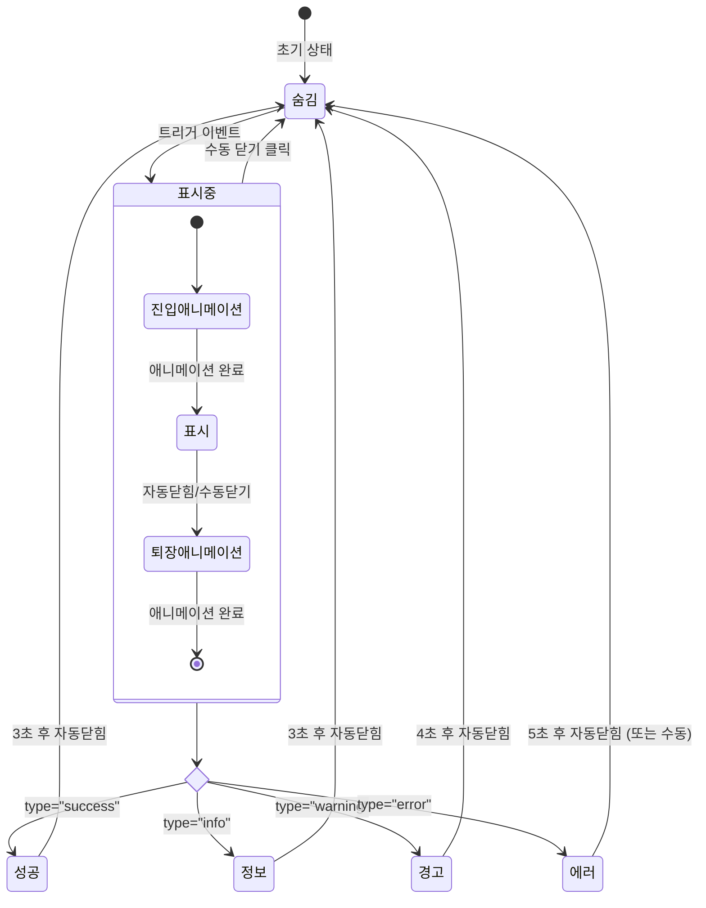

# TSK-05-03 - Toast 알림 컴포넌트 UI 설계

**Version:** 1.0 — **Last Updated:** 2026-01-20

> **목적**: 사용자 액션 결과 또는 시스템 이벤트를 알리는 Toast 알림 컴포넌트 설계

---

## 1. 화면 목록

| 화면 ID | 화면명 | 목적 | SVG 참조 |
|---------|--------|------|----------|
| SCR-01 | 성공 토스트 | 작업 완료, 저장 성공 등 긍정적 결과 알림 | `screen-01-toast-success.svg` |
| SCR-02 | 정보 토스트 | 일반 정보 안내, 힌트 제공 | `screen-02-toast-info.svg` |
| SCR-03 | 경고 토스트 | 주의가 필요한 상황 알림 | `screen-03-toast-warning.svg` |
| SCR-04 | 에러 토스트 | 오류 발생, 실패 결과 알림 | `screen-04-toast-error.svg` |

---

## 2. 화면 전환 흐름

### 2.1 상태 다이어그램



### 2.2 액션-화면 매트릭스

| 액션 | 현재 상태 | 결과 상태 | 트리거 |
|------|----------|----------|--------|
| 성공 이벤트 | 숨김 | 성공 토스트 표시 | API 성공 응답, 폼 저장 완료 |
| 정보 이벤트 | 숨김 | 정보 토스트 표시 | 힌트 표시, 일반 안내 |
| 경고 이벤트 | 숨김 | 경고 토스트 표시 | 유효성 경고, 주의 필요 |
| 에러 이벤트 | 숨김 | 에러 토스트 표시 | API 오류, 작업 실패 |
| 자동 닫힘 | 표시중 | 숨김 | 타이머 만료 |
| 수동 닫기 | 표시중 | 숨김 | 닫기 버튼 클릭 |
| 호버 | 표시중 | 표시 유지 | 마우스 호버 (타이머 일시정지) |

---

## 3. 화면별 상세

### 3.1 SCR-01: 성공 토스트

**화면 목적**: 작업 완료, 저장 성공 등 긍정적인 결과를 사용자에게 알림

**레이아웃 구조**:
```
┌─────────────────────────────────────────────────────────────────────────┐
│  [Header]                                                               │
├─────────────────────────────────────────────────────────────────────────┤
│                                                                         │
│                                    ┌─────────────────────────────────┐  │
│                                    │ ✓  저장이 완료되었습니다.    ✕  │  │
│                                    │    변경사항이 성공적으로         │  │
│                                    │    저장되었습니다.              │  │
│                                    └─────────────────────────────────┘  │
│                                           ↑                              │
│                                    우상단 위치 (top-right)              │
│                                                                         │
│  [Main Content Area]                                                    │
│                                                                         │
│                                                                         │
│                                                                         │
└─────────────────────────────────────────────────────────────────────────┘
```

**컴포넌트 구성**:

| 영역 | 컴포넌트 | Props | 비고 |
|------|----------|-------|------|
| Container | `message` / `notification` | `type="success"` | Ant Design |
| Icon | `CheckCircleFilled` | `style={{ color: '#52c41a' }}` | 초록색 |
| Title | `Typography.Text` | `strong` | 주요 메시지 |
| Description | `Typography.Text` | `type="secondary"` | 상세 설명 (선택) |
| Close | `CloseOutlined` | - | 수동 닫기 버튼 |

**상태 관리**:
- `visible: boolean` - 표시 여부
- `duration: number` - 자동 닫힘 시간 (기본: 3초)
- `pauseOnHover: boolean` - 호버 시 타이머 일시정지

**사용자 액션**:
- 닫기 버튼 클릭 → 토스트 닫힘
- 마우스 호버 → 타이머 일시정지
- 마우스 아웃 → 타이머 재개

**스타일 토큰**:
```css
.toast-success {
  background: #f6ffed;
  border: 1px solid #b7eb8f;
  border-radius: 8px;
  box-shadow: 0 6px 16px 0 rgba(0, 0, 0, 0.08),
              0 3px 6px -4px rgba(0, 0, 0, 0.12),
              0 9px 28px 8px rgba(0, 0, 0, 0.05);
  padding: 16px 24px;
  min-width: 300px;
  max-width: 400px;
}

.toast-success-icon {
  color: #52c41a;
  font-size: 24px;
  margin-right: 12px;
}
```

---

### 3.2 SCR-02: 정보 토스트

**화면 목적**: 일반적인 정보 안내 또는 힌트 제공

**레이아웃 구조**:
```
┌─────────────────────────────────────────────────────────────────────────┐
│  [Header]                                                               │
├─────────────────────────────────────────────────────────────────────────┤
│                                                                         │
│                                    ┌─────────────────────────────────┐  │
│                                    │ ⓘ  새로운 기능이 추가되었습니다. ✕│  │
│                                    │    메뉴에서 확인해 보세요.       │  │
│                                    └─────────────────────────────────┘  │
│                                                                         │
│                                                                         │
│  [Main Content Area]                                                    │
│                                                                         │
│                                                                         │
│                                                                         │
└─────────────────────────────────────────────────────────────────────────┘
```

**컴포넌트 구성**:

| 영역 | 컴포넌트 | Props | 비고 |
|------|----------|-------|------|
| Container | `message` / `notification` | `type="info"` | Ant Design |
| Icon | `InfoCircleFilled` | `style={{ color: '#1890ff' }}` | 파란색 |
| Title | `Typography.Text` | `strong` | 주요 메시지 |
| Description | `Typography.Text` | `type="secondary"` | 상세 설명 (선택) |
| Close | `CloseOutlined` | - | 수동 닫기 버튼 |

**상태 관리**:
- `visible: boolean`
- `duration: number` - 기본: 3초

**스타일 토큰**:
```css
.toast-info {
  background: #e6f7ff;
  border: 1px solid #91d5ff;
  border-radius: 8px;
  box-shadow: 0 6px 16px 0 rgba(0, 0, 0, 0.08),
              0 3px 6px -4px rgba(0, 0, 0, 0.12),
              0 9px 28px 8px rgba(0, 0, 0, 0.05);
  padding: 16px 24px;
  min-width: 300px;
  max-width: 400px;
}

.toast-info-icon {
  color: #1890ff;
  font-size: 24px;
  margin-right: 12px;
}
```

---

### 3.3 SCR-03: 경고 토스트

**화면 목적**: 주의가 필요한 상황을 사용자에게 알림

**레이아웃 구조**:
```
┌─────────────────────────────────────────────────────────────────────────┐
│  [Header]                                                               │
├─────────────────────────────────────────────────────────────────────────┤
│                                                                         │
│                                    ┌─────────────────────────────────┐  │
│                                    │ ⚠  세션이 곧 만료됩니다.      ✕  │  │
│                                    │    5분 내에 활동이 없으면        │  │
│                                    │    자동 로그아웃됩니다.          │  │
│                                    └─────────────────────────────────┘  │
│                                                                         │
│                                                                         │
│  [Main Content Area]                                                    │
│                                                                         │
│                                                                         │
│                                                                         │
└─────────────────────────────────────────────────────────────────────────┘
```

**컴포넌트 구성**:

| 영역 | 컴포넌트 | Props | 비고 |
|------|----------|-------|------|
| Container | `message` / `notification` | `type="warning"` | Ant Design |
| Icon | `ExclamationCircleFilled` | `style={{ color: '#faad14' }}` | 노란색 |
| Title | `Typography.Text` | `strong` | 주요 메시지 |
| Description | `Typography.Text` | `type="secondary"` | 상세 설명 (선택) |
| Close | `CloseOutlined` | - | 수동 닫기 버튼 |

**상태 관리**:
- `visible: boolean`
- `duration: number` - 기본: 4초 (경고는 조금 더 길게)

**스타일 토큰**:
```css
.toast-warning {
  background: #fffbe6;
  border: 1px solid #ffe58f;
  border-radius: 8px;
  box-shadow: 0 6px 16px 0 rgba(0, 0, 0, 0.08),
              0 3px 6px -4px rgba(0, 0, 0, 0.12),
              0 9px 28px 8px rgba(0, 0, 0, 0.05);
  padding: 16px 24px;
  min-width: 300px;
  max-width: 400px;
}

.toast-warning-icon {
  color: #faad14;
  font-size: 24px;
  margin-right: 12px;
}
```

---

### 3.4 SCR-04: 에러 토스트

**화면 목적**: 오류 발생 또는 작업 실패 결과를 사용자에게 알림

**레이아웃 구조**:
```
┌─────────────────────────────────────────────────────────────────────────┐
│  [Header]                                                               │
├─────────────────────────────────────────────────────────────────────────┤
│                                                                         │
│                                    ┌─────────────────────────────────┐  │
│                                    │ ✗  저장에 실패했습니다.       ✕  │  │
│                                    │    네트워크 연결을 확인하고      │  │
│                                    │    다시 시도해 주세요.          │  │
│                                    └─────────────────────────────────┘  │
│                                                                         │
│                                                                         │
│  [Main Content Area]                                                    │
│                                                                         │
│                                                                         │
│                                                                         │
└─────────────────────────────────────────────────────────────────────────┘
```

**컴포넌트 구성**:

| 영역 | 컴포넌트 | Props | 비고 |
|------|----------|-------|------|
| Container | `message` / `notification` | `type="error"` | Ant Design |
| Icon | `CloseCircleFilled` | `style={{ color: '#ff4d4f' }}` | 빨간색 |
| Title | `Typography.Text` | `strong` | 주요 메시지 |
| Description | `Typography.Text` | `type="secondary"` | 상세 설명 (선택) |
| Close | `CloseOutlined` | - | 수동 닫기 버튼 |

**상태 관리**:
- `visible: boolean`
- `duration: number` - 기본: 5초 (에러는 가장 길게)
- `closable: boolean` - 항상 true (수동 닫기 필수)

**스타일 토큰**:
```css
.toast-error {
  background: #fff2f0;
  border: 1px solid #ffccc7;
  border-radius: 8px;
  box-shadow: 0 6px 16px 0 rgba(0, 0, 0, 0.08),
              0 3px 6px -4px rgba(0, 0, 0, 0.12),
              0 9px 28px 8px rgba(0, 0, 0, 0.05);
  padding: 16px 24px;
  min-width: 300px;
  max-width: 400px;
}

.toast-error-icon {
  color: #ff4d4f;
  font-size: 24px;
  margin-right: 12px;
}
```

---

## 4. 공통 컴포넌트

### 4.1 Toast 인터페이스

```typescript
type ToastType = 'success' | 'info' | 'warning' | 'error';

interface ToastConfig {
  type: ToastType;
  message: string;           // 주요 메시지 (필수)
  description?: string;      // 상세 설명 (선택)
  duration?: number;         // 자동 닫힘 시간 (ms), 0 = 수동 닫기만
  closable?: boolean;        // 닫기 버튼 표시 (기본: true)
  icon?: React.ReactNode;    // 커스텀 아이콘
  key?: string;              // 고유 키 (중복 방지)
  onClose?: () => void;      // 닫힘 콜백
  placement?: 'topRight' | 'topLeft' | 'bottomRight' | 'bottomLeft';
}
```

### 4.2 Toast 서비스

```typescript
// 전역 Toast 서비스
const toast = {
  success: (message: string, description?: string, config?: Partial<ToastConfig>) => void,
  info: (message: string, description?: string, config?: Partial<ToastConfig>) => void,
  warning: (message: string, description?: string, config?: Partial<ToastConfig>) => void,
  error: (message: string, description?: string, config?: Partial<ToastConfig>) => void,
  destroy: (key?: string) => void,  // 특정 또는 모든 토스트 제거
};

// 사용 예시
toast.success('저장이 완료되었습니다.', '변경사항이 성공적으로 저장되었습니다.');
toast.error('저장에 실패했습니다.', '네트워크 연결을 확인해 주세요.');
```

### 4.3 ToastProvider

```typescript
interface ToastProviderProps {
  children: React.ReactNode;
  maxCount?: number;         // 최대 동시 표시 개수 (기본: 3)
  placement?: 'topRight' | 'topLeft' | 'bottomRight' | 'bottomLeft';
  top?: number;              // 상단 여백 (기본: 24px)
  duration?: number;         // 기본 지속 시간 (기본: 3000ms)
}

// 사용
<ToastProvider maxCount={3} placement="topRight">
  <App />
</ToastProvider>
```

### 4.4 기본 Duration 설정

| Toast 유형 | 기본 Duration | 비고 |
|------------|--------------|------|
| success | 3000ms (3초) | 빠른 확인 후 사라짐 |
| info | 3000ms (3초) | 빠른 확인 후 사라짐 |
| warning | 4000ms (4초) | 주의 메시지이므로 조금 더 길게 |
| error | 5000ms (5초) | 중요 메시지이므로 가장 길게 |

---

## 5. 반응형 설계

### 5.1 Breakpoint별 레이아웃

| Breakpoint | 너비 범위 | Toast 너비 | 위치 | 비고 |
|------------|----------|-----------|------|------|
| Desktop | 1024px+ | 300-400px | 우상단 24px | 기본 레이아웃 |
| Tablet | 768-1023px | 300-380px | 우상단 16px | 약간 좁게 |
| Mobile | 0-767px | 100% - 32px | 상단 중앙 | 전체 너비 |

### 5.2 반응형 스타일

```css
/* Desktop (기본) */
.toast-container {
  position: fixed;
  top: 24px;
  right: 24px;
  z-index: 1050;
  display: flex;
  flex-direction: column;
  gap: 12px;
}

.toast-item {
  min-width: 300px;
  max-width: 400px;
}

/* Tablet */
@media (min-width: 768px) and (max-width: 1023px) {
  .toast-container {
    top: 16px;
    right: 16px;
  }

  .toast-item {
    min-width: 280px;
    max-width: 380px;
  }
}

/* Mobile */
@media (max-width: 767px) {
  .toast-container {
    top: 16px;
    right: 16px;
    left: 16px;
  }

  .toast-item {
    min-width: auto;
    max-width: none;
    width: 100%;
  }

  .toast-item .toast-description {
    display: -webkit-box;
    -webkit-line-clamp: 2;
    -webkit-box-orient: vertical;
    overflow: hidden;
  }
}
```

### 5.3 모바일 특화 설계

- **전체 너비**: 모바일에서는 좌우 16px 여백을 두고 전체 너비 사용
- **스와이프 닫기**: 좌우 스와이프로 토스트 닫기 지원 (터치 디바이스)
- **설명 축약**: 긴 설명은 2줄로 제한하고 말줄임 처리

---

## 6. 접근성

### 6.1 키보드 네비게이션

| 키 | 동작 |
|----|------|
| Tab | 닫기 버튼으로 포커스 이동 |
| Enter/Space | 닫기 버튼 활성화 (토스트 닫기) |
| Escape | 가장 최근 토스트 닫기 |

### 6.2 ARIA 속성

| 요소 | ARIA 속성 | 값 | 비고 |
|------|----------|-----|------|
| Toast Container | `role` | `alert` | 즉각적 알림 |
| Toast Container | `aria-live` | `polite` (info/success) / `assertive` (warning/error) | 우선순위 |
| Toast Container | `aria-atomic` | `true` | 전체 내용 읽기 |
| Close Button | `aria-label` | `"알림 닫기"` | 버튼 설명 |
| Icon | `aria-hidden` | `true` | 장식적 아이콘 |

### 6.3 스크린 리더 안내

```typescript
// Toast 컴포넌트 구조
<div
  role="alert"
  aria-live={type === 'error' || type === 'warning' ? 'assertive' : 'polite'}
  aria-atomic="true"
  className={`toast toast-${type}`}
>
  <span aria-hidden="true" className="toast-icon">{icon}</span>
  <div className="toast-content">
    <div className="toast-message">{message}</div>
    {description && <div className="toast-description">{description}</div>}
  </div>
  <button
    type="button"
    aria-label="알림 닫기"
    className="toast-close"
    onClick={onClose}
  >
    <CloseOutlined aria-hidden="true" />
  </button>
</div>
```

### 6.4 색상 대비

| Toast 유형 | 배경색 | 테두리색 | 아이콘색 | 텍스트 대비 |
|------------|--------|---------|---------|------------|
| Success | #f6ffed | #b7eb8f | #52c41a | 7.2:1 |
| Info | #e6f7ff | #91d5ff | #1890ff | 5.1:1 |
| Warning | #fffbe6 | #ffe58f | #faad14 | 4.6:1 |
| Error | #fff2f0 | #ffccc7 | #ff4d4f | 5.5:1 |

> 모든 유형이 WCAG 2.1 AA 기준 (4.5:1) 충족

### 6.5 포커스 관리

```typescript
// 토스트 표시 시 포커스 관리
useEffect(() => {
  if (visible && closable) {
    // 포커스를 토스트로 이동하지 않음 (사용자 작업 방해 방지)
    // 대신 aria-live로 스크린 리더에 알림
  }
}, [visible]);

// Escape 키로 닫기
useEffect(() => {
  const handleEscape = (e: KeyboardEvent) => {
    if (e.key === 'Escape' && visible) {
      onClose?.();
    }
  };
  window.addEventListener('keydown', handleEscape);
  return () => window.removeEventListener('keydown', handleEscape);
}, [visible, onClose]);
```

### 6.6 동작 감소 (Reduced Motion)

```css
/* 기본 애니메이션 */
.toast-enter {
  animation: toast-slide-in 0.3s ease-out;
}

.toast-exit {
  animation: toast-slide-out 0.3s ease-in;
}

@keyframes toast-slide-in {
  from {
    transform: translateX(100%);
    opacity: 0;
  }
  to {
    transform: translateX(0);
    opacity: 1;
  }
}

@keyframes toast-slide-out {
  from {
    transform: translateX(0);
    opacity: 1;
  }
  to {
    transform: translateX(100%);
    opacity: 0;
  }
}

/* 동작 감소 설정 시 */
@media (prefers-reduced-motion: reduce) {
  .toast-enter,
  .toast-exit {
    animation: none;
  }

  .toast-enter {
    opacity: 1;
  }

  .toast-exit {
    opacity: 0;
    transition: opacity 0.1s;
  }
}
```

---

## 7. SVG 파일 목록

| 파일명 | 설명 | 뷰박스 |
|--------|------|--------|
| `screen-01-toast-success.svg` | 성공 토스트 (초록색, 체크 아이콘) | 800x600 |
| `screen-02-toast-info.svg` | 정보 토스트 (파란색, 정보 아이콘) | 800x600 |
| `screen-03-toast-warning.svg` | 경고 토스트 (노란색, 경고 아이콘) | 800x600 |
| `screen-04-toast-error.svg` | 에러 토스트 (빨간색, 에러 아이콘) | 800x600 |

---

## 8. 사용 가이드라인

### 8.1 Toast 유형 선택 기준

| 상황 | 권장 유형 | 예시 메시지 |
|------|----------|------------|
| 작업 성공 완료 | success | "저장이 완료되었습니다." |
| 데이터 생성/수정/삭제 성공 | success | "사용자가 등록되었습니다." |
| 일반 정보 안내 | info | "새로운 기능이 추가되었습니다." |
| 힌트 또는 팁 제공 | info | "단축키 Ctrl+S로 저장할 수 있습니다." |
| 주의가 필요한 상황 | warning | "세션이 5분 후 만료됩니다." |
| 잠재적 문제 경고 | warning | "입력한 데이터가 중복될 수 있습니다." |
| 작업 실패 | error | "저장에 실패했습니다." |
| 시스템 오류 | error | "서버 연결에 실패했습니다." |

### 8.2 메시지 작성 가이드

**DO**:
- 명확하고 간결하게 작성
- 사용자가 취해야 할 행동 안내
- 존댓말 사용 (예: "~되었습니다", "~해 주세요")

**DON'T**:
- 기술적 오류 코드 직접 노출
- 너무 긴 메시지 작성 (2줄 이내 권장)
- 부정적인 어조 사용

---

## 관련 문서

- PRD: `../../../prd.md` - 4.1.1 알림 (Toast/Notification)
- TRD: `../../../trd.md`
- 디자인 시스템: `../../design-system.md`
- TSK-05-01 로딩/에러 상태: `../TSK-05-01/011-ui-design.md`
