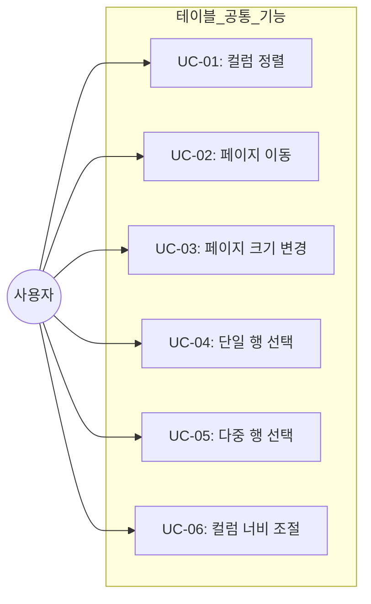
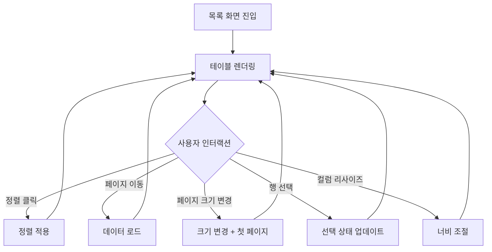
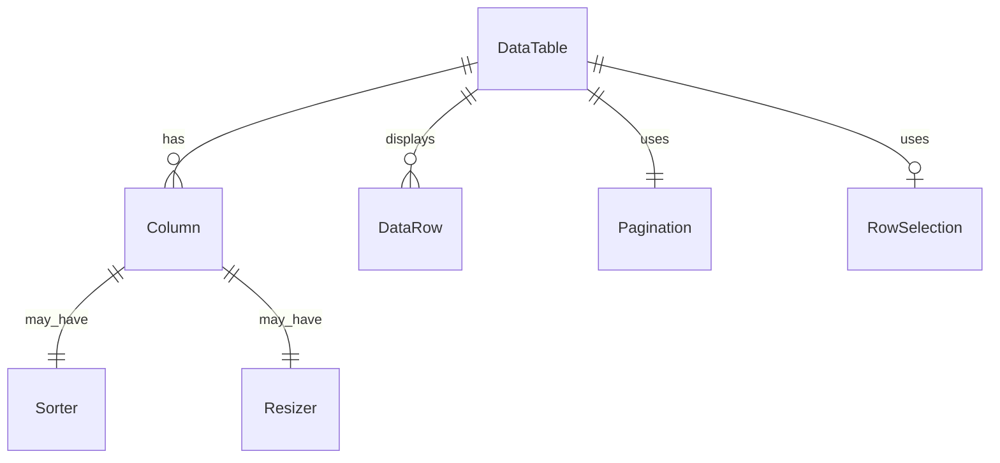

# TSK-05-04 - 테이블 공통 기능 설계 문서

## 문서 정보

| 항목 | 내용 |
|------|------|
| Task ID | TSK-05-04 |
| 문서 버전 | 1.0 |
| 작성일 | 2026-01-20 |
| 상태 | 작성중 |
| 카테고리 | development |

---

## 1. 개요

### 1.1 배경 및 문제 정의

**현재 상황:**
- MES Portal에서 다양한 데이터 목록을 표시하는 화면이 필요함
- 각 화면마다 테이블 기능을 개별 구현하면 일관성 없는 UX와 코드 중복 발생
- 사용자들이 대량의 데이터를 효율적으로 탐색하고 관리해야 함

**해결하려는 문제:**
- 테이블 기능의 표준화 및 재사용성 확보
- 일관된 사용자 경험 제공 (정렬, 페이징, 선택 등)
- 개발 생산성 향상을 위한 공통 컴포넌트 제공

### 1.2 목적 및 기대 효과

**목적:**
- 재사용 가능한 DataTable 래퍼 컴포넌트 구현
- Ant Design Table의 공통 기능을 표준화하여 제공

**기대 효과:**
- 사용자 관점: 모든 목록 화면에서 일관된 테이블 조작 경험
- 개발자 관점: 테이블 기능 구현 시간 단축, 코드 중복 제거
- 비즈니스 관점: 빠른 화면 개발로 프로젝트 일정 단축

### 1.3 범위

**포함:**
- 컬럼 정렬 (오름차순/내림차순)
- 페이징 (페이지 크기 선택: 10, 20, 50, 100)
- 행 선택 (단일/다중 선택)
- 컬럼 리사이즈 (드래그로 너비 조절)

**제외:**
- 컬럼별 필터링 (향후 구현)
- 컬럼 고정 (좌측/우측) - 향후 구현
- 셀 인라인 편집 - 향후 구현
- 행 드래그 앤 드롭 - 향후 구현
- 가상 스크롤 (대용량 데이터) - 향후 구현
- 엑셀 내보내기 - 별도 Task에서 구현

### 1.4 참조 문서

| 문서 | 경로 | 관련 섹션 |
|------|------|----------|
| PRD | `.orchay/projects/mes-portal/prd.md` | 4.1.1 테이블(그리드) 기능 |
| TRD | `.orchay/projects/mes-portal/trd.md` | 7. PRD 요구사항 ↔ 기술 스택 매핑 - 테이블/그리드 기능 |

---

## 2. 사용자 분석

### 2.1 대상 사용자

| 사용자 유형 | 특성 | 주요 니즈 |
|------------|------|----------|
| 공장장/관리자 | 전체 현황 파악, 데이터 분석 | 대량 데이터 빠른 탐색, 정렬 및 필터링 |
| 생산 담당자 | 작업 지시 확인, 실적 입력 | 특정 항목 빠른 검색, 다중 선택 후 일괄 처리 |
| 품질 담당자 | 검사 결과 조회, 불량 관리 | 정렬을 통한 이상치 발견, 페이지별 데이터 확인 |
| 설비 담당자 | 설비 목록 관리, 유지보수 조회 | 컬럼 너비 조절로 긴 텍스트 확인 |

### 2.2 사용자 페르소나

**페르소나 1: 김생산 (생산 담당자)**
- 역할: 라인별 생산 관리
- 목표: 작업 지시 목록에서 담당 작업 빠르게 찾기
- 불만: 페이지를 넘기며 찾는 것이 번거로움, 한 번에 더 많은 데이터를 보고 싶음
- 시나리오: 페이지 크기를 50건으로 늘리고, 시작일 기준 정렬하여 당일 작업 확인

**페르소나 2: 박품질 (품질 담당자)**
- 역할: 품질 검사 및 불량 관리
- 목표: 불량률이 높은 항목 찾아서 분석
- 불만: 불량률 컬럼이 좁아서 숫자가 잘려 보임
- 시나리오: 불량률 컬럼 내림차순 정렬, 컬럼 너비 조절로 전체 값 확인

---

## 3. 유즈케이스

### 3.1 유즈케이스 다이어그램



### 3.2 유즈케이스 상세

#### UC-01: 컬럼 정렬

| 항목 | 내용 |
|------|------|
| 액터 | 모든 사용자 |
| 목적 | 특정 기준으로 데이터 정렬하여 원하는 항목 빠르게 찾기 |
| 사전 조건 | 테이블에 데이터가 로드되어 있음 |
| 사후 조건 | 선택한 컬럼 기준으로 정렬된 데이터 표시 |
| 트리거 | 컬럼 헤더 클릭 |

**기본 흐름:**
1. 사용자가 정렬하려는 컬럼 헤더를 클릭한다
2. 시스템이 해당 컬럼 기준 오름차순으로 정렬한다
3. 컬럼 헤더에 오름차순 화살표(↑) 아이콘이 표시된다
4. 사용자가 동일 컬럼 헤더를 다시 클릭한다
5. 시스템이 내림차순으로 정렬한다
6. 컬럼 헤더에 내림차순 화살표(↓) 아이콘이 표시된다
7. 사용자가 동일 컬럼 헤더를 다시 클릭한다
8. 시스템이 정렬을 해제하고 원래 순서로 복원한다

**대안 흐름:**
- 4a. 사용자가 다른 컬럼 헤더를 클릭하면:
  - 기존 정렬이 해제되고 새로운 컬럼 기준으로 오름차순 정렬된다

#### UC-02: 페이지 이동

| 항목 | 내용 |
|------|------|
| 액터 | 모든 사용자 |
| 목적 | 대량 데이터를 페이지 단위로 탐색 |
| 사전 조건 | 데이터가 한 페이지 크기를 초과함 |
| 사후 조건 | 선택한 페이지의 데이터가 표시됨 |
| 트리거 | 페이지네이션 컨트롤 클릭 |

**기본 흐름:**
1. 사용자가 페이지 번호를 클릭한다
2. 시스템이 해당 페이지의 데이터를 로드한다
3. 테이블에 해당 페이지 데이터가 표시된다
4. 현재 페이지 번호가 강조 표시된다

**대안 흐름:**
- 1a. 이전/다음 화살표 클릭 시:
  - 현재 페이지 기준 이전/다음 페이지로 이동
- 1b. 처음/끝 화살표 클릭 시:
  - 첫 페이지/마지막 페이지로 이동

#### UC-03: 페이지 크기 변경

| 항목 | 내용 |
|------|------|
| 액터 | 모든 사용자 |
| 목적 | 한 번에 표시되는 데이터 개수 조절 |
| 사전 조건 | 테이블이 표시되어 있음 |
| 사후 조건 | 선택한 크기만큼 데이터가 표시됨 |
| 트리거 | 페이지 크기 셀렉터 변경 |

**기본 흐름:**
1. 사용자가 페이지 크기 드롭다운을 클릭한다
2. 시스템이 옵션 목록을 표시한다 (10, 20, 50, 100)
3. 사용자가 원하는 크기를 선택한다
4. 시스템이 해당 크기만큼 데이터를 표시한다
5. 첫 페이지로 이동한다

#### UC-04: 단일 행 선택

| 항목 | 내용 |
|------|------|
| 액터 | 모든 사용자 |
| 목적 | 특정 행 선택하여 상세 보기 또는 액션 수행 |
| 사전 조건 | 테이블에 데이터가 있음, rowSelection 활성화 |
| 사후 조건 | 선택된 행이 하이라이트됨 |
| 트리거 | 행 클릭 또는 라디오 버튼 클릭 |

**기본 흐름:**
1. 사용자가 테이블 행을 클릭한다
2. 시스템이 해당 행을 선택 상태로 변경한다
3. 행 배경색이 강조 표시된다
4. onRowSelect 콜백이 호출된다

**대안 흐름:**
- 1a. 이미 선택된 행을 클릭하면:
  - 선택이 해제된다

#### UC-05: 다중 행 선택

| 항목 | 내용 |
|------|------|
| 액터 | 모든 사용자 |
| 목적 | 여러 행 선택하여 일괄 작업 수행 |
| 사전 조건 | 테이블에 데이터가 있음, 다중 선택 모드 활성화 |
| 사후 조건 | 선택된 행들이 하이라이트됨 |
| 트리거 | 체크박스 클릭 |

**기본 흐름:**
1. 사용자가 행의 체크박스를 클릭한다
2. 시스템이 해당 행을 선택 목록에 추가한다
3. 체크박스가 체크 상태로 변경된다
4. 사용자가 추가로 다른 행의 체크박스를 클릭한다
5. 시스템이 해당 행도 선택 목록에 추가한다

**대안 흐름:**
- 1a. 헤더의 전체 선택 체크박스 클릭 시:
  - 현재 페이지의 모든 행이 선택됨
- 2a. 이미 선택된 행의 체크박스 클릭 시:
  - 해당 행이 선택 해제됨

#### UC-06: 컬럼 너비 조절

| 항목 | 내용 |
|------|------|
| 액터 | 모든 사용자 |
| 목적 | 컬럼 내용에 맞게 너비 조절하여 가독성 향상 |
| 사전 조건 | 테이블이 표시되어 있음, 컬럼 리사이즈 활성화 |
| 사후 조건 | 컬럼 너비가 변경됨 |
| 트리거 | 컬럼 경계 드래그 |

**기본 흐름:**
1. 사용자가 컬럼 헤더 경계에 마우스를 올린다
2. 커서가 리사이즈 커서(col-resize)로 변경된다
3. 사용자가 드래그를 시작한다
4. 시스템이 드래그에 따라 컬럼 너비를 실시간으로 조절한다
5. 사용자가 드래그를 놓는다
6. 최종 너비가 적용된다

**예외 흐름:**
- 4a. 최소 너비(50px) 이하로 줄이려 하면:
  - 최소 너비에서 더 이상 줄어들지 않음

---

## 4. 사용자 시나리오

### 4.1 시나리오 1: 작업 지시 목록에서 당일 작업 찾기

**상황 설명:**
김생산 담당자가 오늘 진행할 작업 지시를 확인하기 위해 작업 지시 목록 화면에 접근했다. 기본적으로 50건씩 표시되고 최신순으로 정렬되어 있지만, 당일 시작 예정인 작업만 빠르게 확인하고 싶다.

**단계별 진행:**

| 단계 | 사용자 행동 | 시스템 반응 | 사용자 기대 |
|------|-----------|------------|------------|
| 1 | 페이지 크기를 100건으로 변경 | 100건의 데이터가 한 페이지에 표시됨 | 더 많은 작업을 한 눈에 보기 |
| 2 | '시작예정일' 컬럼 헤더 클릭 | 오름차순 정렬, 날짜가 빠른 순서로 표시 | 가장 빠른 일정부터 확인 |
| 3 | 다시 '시작예정일' 헤더 클릭 | 내림차순 정렬, 오늘 날짜가 상단에 표시 | 오늘/최근 작업이 먼저 보임 |
| 4 | 당일 작업 3건의 체크박스 클릭 | 3건이 선택됨, 선택된 행 강조 표시 | 일괄 작업 시작 준비 완료 |

**성공 조건:**
- 페이지 크기 변경 즉시 적용됨
- 정렬 토글이 정확히 동작함 (오름차순 → 내림차순 → 정렬해제)
- 다중 선택이 정상 동작하고 선택된 행 목록을 확인 가능

### 4.2 시나리오 2: 품질 검사 결과에서 이상치 발견

**상황 설명:**
박품질 담당자가 품질 검사 결과 목록에서 불량률이 높은 항목을 찾아 분석하려 한다. 불량률 컬럼이 좁아서 숫자가 잘려 보이는 문제가 있다.

**단계별 진행:**

| 단계 | 사용자 행동 | 시스템 반응 | 복구 방법 |
|------|-----------|------------|----------|
| 1 | '불량률' 컬럼 헤더 경계를 드래그하여 확장 | 컬럼 너비가 늘어나며 전체 숫자가 표시됨 | - |
| 2 | '불량률' 컬럼 헤더 클릭 | 내림차순 정렬 (높은 불량률이 상단) | - |
| 3 | 상위 5개 행 체크박스 클릭 | 5건이 선택됨 | - |
| 4 | 상세 분석 버튼 클릭 | 선택된 5건의 상세 분석 화면으로 이동 | - |

---

## 5. 화면 설계

### 5.1 화면 흐름도



### 5.2 화면별 상세

#### DataTable 컴포넌트

**화면 목적:**
모든 목록 화면에서 재사용되는 공통 테이블 컴포넌트. 정렬, 페이징, 선택, 리사이즈 기능을 표준화하여 제공한다.

**와이어프레임:**
```
┌────────────────────────────────────────────────────────────────────────────────┐
│  ┌──────────────┬──────────────┬──────────────┬──────────────┬───────────────┐│
│  │ □ 전체선택   │ 이름 ↕      │ 상태 ↕      │ 생성일 ↕    │ 작업 ↕        ││
│  │              │ ‖           │ ‖           │ ‖           │ ‖             ││
│  ├──────────────┼──────────────┼──────────────┼──────────────┼───────────────┤│
│  │ □            │ 홍길동       │ 활성         │ 2026-01-15   │ [수정][삭제]  ││
│  ├──────────────┼──────────────┼──────────────┼──────────────┼───────────────┤│
│  │ ☑            │ 김철수       │ 비활성       │ 2026-01-14   │ [수정][삭제]  ││
│  ├──────────────┼──────────────┼──────────────┼──────────────┼───────────────┤│
│  │ □            │ 이영희       │ 활성         │ 2026-01-13   │ [수정][삭제]  ││
│  ├──────────────┼──────────────┼──────────────┼──────────────┼───────────────┤│
│  │ □            │ 박민수       │ 대기         │ 2026-01-12   │ [수정][삭제]  ││
│  ├──────────────┼──────────────┼──────────────┼──────────────┼───────────────┤│
│  │ □            │ 정수연       │ 활성         │ 2026-01-11   │ [수정][삭제]  ││
│  └──────────────┴──────────────┴──────────────┴──────────────┴───────────────┘│
│                                                                                │
│  ┌────────────────────────────────────────────────────────────────────────────┐│
│  │ 총 125건                    │ [10 ▼] 건/페이지  [<][1][2][3][4][5][>]     ││
│  └────────────────────────────────────────────────────────────────────────────┘│
└────────────────────────────────────────────────────────────────────────────────┘

범례:
↕ : 정렬 가능 아이콘 (클릭 시 ↑ 또는 ↓로 변경)
‖ : 컬럼 리사이즈 핸들 (드래그 가능)
□ : 체크박스 (미선택)
☑ : 체크박스 (선택됨)
```

**화면 요소 설명:**

| 영역 | 설명 | 사용자 인터랙션 |
|------|------|----------------|
| 헤더 행 | 컬럼명 + 정렬 아이콘 + 리사이즈 핸들 | 클릭으로 정렬, 드래그로 리사이즈 |
| 전체선택 체크박스 | 현재 페이지 전체 선택/해제 | 클릭 시 토글 |
| 데이터 행 | 각 레코드 표시 | 클릭 시 선택, 체크박스로 다중 선택 |
| 행 체크박스 | 개별 행 선택 | 클릭 시 해당 행 선택/해제 |
| 페이지네이션 | 페이지 이동 컨트롤 | 번호 클릭으로 이동 |
| 페이지 크기 셀렉터 | 한 페이지당 표시 건수 | 드롭다운에서 선택 |
| 총 건수 표시 | 전체 데이터 개수 | 정보 표시 (인터랙션 없음) |

**사용자 행동 시나리오:**
1. 사용자가 화면에 진입하면 기본 페이지 크기(10건)로 첫 페이지 데이터를 본다
2. 컬럼 헤더의 정렬 아이콘을 클릭하면 해당 컬럼 기준으로 정렬된다
3. 컬럼 경계를 드래그하면 컬럼 너비가 조절된다
4. 체크박스를 클릭하면 해당 행이 선택되고 배경색이 변경된다
5. 페이지 번호를 클릭하면 해당 페이지 데이터가 로드된다

### 5.3 반응형 동작

| 화면 크기 | 레이아웃 변화 | 사용자 경험 |
|----------|--------------|------------|
| 데스크톱 (1024px+) | 모든 컬럼 표시, 가로 스크롤 없음 | 전체 정보 한눈에 파악 |
| 태블릿 (768-1023px) | 컬럼 일부 숨김 또는 가로 스크롤 | 주요 컬럼 우선 표시 |
| 모바일 (767px-) | 카드형 레이아웃 또는 가로 스크롤 | 터치 친화적 인터랙션 |

---

## 6. 인터랙션 설계

### 6.1 사용자 액션과 피드백

| 사용자 액션 | 즉각 피드백 | 결과 피드백 | 에러 피드백 |
|------------|-----------|------------|------------|
| 컬럼 헤더 클릭 | 클릭 효과 | 정렬 아이콘 변경 + 데이터 재정렬 | - |
| 컬럼 경계 드래그 | 커서 변경 + 실시간 너비 변화 | 최종 너비 적용 | 최소 너비 도달 시 더 이상 줄어들지 않음 |
| 체크박스 클릭 | 체크 상태 토글 | 행 배경색 변경 | - |
| 페이지 번호 클릭 | 버튼 눌림 효과 | 데이터 로드 + 페이지 표시 | 로딩 실패 시 에러 메시지 |
| 페이지 크기 변경 | 드롭다운 선택 효과 | 데이터 재로드 + 첫 페이지 이동 | - |

### 6.2 상태별 화면 변화

| 상태 | 화면 표시 | 사용자 안내 |
|------|----------|------------|
| 초기 로딩 | 테이블 스켈레톤 또는 Spin | "데이터를 불러오는 중..." |
| 데이터 없음 | Empty 컴포넌트 | "표시할 데이터가 없습니다" |
| 정렬 중 | 로딩 오버레이 (선택적) | 즉각 반영 (클라이언트 정렬 시) |
| 선택됨 | 행 배경색 강조 (primary-1 계열) | 선택된 행 수 표시 (선택적) |
| 리사이즈 중 | 컬럼 경계에 드래그 라인 표시 | - |

### 6.3 키보드/접근성

| 기능 | 키보드 단축키 | 스크린 리더 안내 |
|------|-------------|-----------------|
| 행 선택 | Space (포커스된 행) | "행 선택됨/해제됨" |
| 페이지 이동 | Tab으로 페이지네이션 포커스 후 Enter | "페이지 X로 이동" |
| 정렬 | Tab으로 헤더 포커스 후 Enter | "컬럼명 오름차순/내림차순 정렬" |

---

## 7. 데이터 요구사항

### 7.1 필요한 데이터

| 데이터 | 설명 | 출처 | 용도 |
|--------|------|------|------|
| dataSource | 테이블에 표시할 데이터 배열 | 부모 컴포넌트 (API 응답) | 행 렌더링 |
| columns | 컬럼 정의 배열 | 부모 컴포넌트 (정적 정의) | 헤더 및 셀 렌더링 |
| total | 전체 데이터 건수 | API 응답 | 페이지네이션 표시 |
| selectedRowKeys | 선택된 행의 키 목록 | 컴포넌트 상태 | 선택 상태 관리 |

### 7.2 데이터 관계



**관계 설명:**
- DataTable은 여러 개의 Column을 가진다
- DataTable은 여러 개의 DataRow를 표시한다
- DataTable은 하나의 Pagination을 사용한다
- DataTable은 선택적으로 RowSelection을 사용한다
- Column은 Sorter(정렬)와 Resizer(리사이즈) 기능을 선택적으로 가진다

### 7.3 데이터 유효성 규칙

| 데이터 필드 | 규칙 | 위반 시 메시지 |
|------------|------|---------------|
| dataSource | 배열이어야 함 | 콘솔 경고 후 빈 배열로 처리 |
| columns | 최소 1개 이상 | "컬럼 정의가 필요합니다" |
| pageSize | 양수 정수 | 기본값 10으로 대체 |
| rowKey | 각 행의 고유 식별자 | "rowKey가 중복되었습니다" (개발 경고) |

---

## 8. 비즈니스 규칙

### 8.1 핵심 규칙

| 규칙 ID | 규칙 설명 | 적용 상황 | 예외 |
|---------|----------|----------|------|
| BR-01 | 페이지 크기 옵션은 10, 20, 50, 100으로 제한 | 페이지 크기 셀렉터 | 커스텀 옵션 prop으로 변경 가능 |
| BR-02 | 정렬은 한 번에 하나의 컬럼만 가능 | 컬럼 정렬 시 | 다중 정렬 향후 지원 예정 |
| BR-03 | 컬럼 최소 너비는 50px | 컬럼 리사이즈 시 | 없음 |
| BR-04 | 전체 선택은 현재 페이지의 데이터만 선택 | 헤더 체크박스 클릭 시 | preserveSelectedRowKeys로 페이지 간 유지 가능 |

### 8.2 규칙 상세 설명

**BR-01: 페이지 크기 옵션 제한**

설명: 서버 부하 및 브라우저 성능을 고려하여 한 페이지에 표시할 수 있는 최대 건수를 100건으로 제한한다. 기본값은 10건이다.

예시:
- 사용자가 100건을 선택하면 100건까지 표시
- 100건 초과 옵션은 제공하지 않음 (가상 스크롤로 별도 지원 예정)

**BR-02: 단일 컬럼 정렬**

설명: UI 복잡성과 사용성을 고려하여 한 번에 하나의 컬럼만 정렬 기준으로 사용한다.

예시:
- '이름' 컬럼 정렬 중 '날짜' 컬럼 클릭 시: '이름' 정렬 해제, '날짜' 정렬 적용

**BR-03: 컬럼 최소 너비**

설명: 컬럼이 너무 좁아져서 내용을 식별할 수 없게 되는 것을 방지한다.

**BR-04: 전체 선택 범위**

설명: 성능과 사용자 의도를 고려하여 전체 선택은 현재 페이지에만 적용된다. 전체 데이터 선택이 필요한 경우 별도 "전체 선택" 기능을 제공할 수 있다.

---

## 9. 에러 처리

### 9.1 예상 에러 상황

| 상황 | 원인 | 사용자 메시지 | 복구 방법 |
|------|------|--------------|----------|
| 데이터 로드 실패 | API 오류, 네트워크 끊김 | "데이터를 불러오지 못했습니다" | 재시도 버튼 표시 |
| 빈 데이터 | 조건에 맞는 데이터 없음 | "표시할 데이터가 없습니다" | 검색 조건 초기화 안내 |
| 페이지 범위 초과 | 유효하지 않은 페이지 접근 | 마지막 페이지로 자동 이동 | - |

### 9.2 에러 표시 방식

| 에러 유형 | 표시 위치 | 표시 방법 |
|----------|----------|----------|
| 데이터 로드 실패 | 테이블 영역 | Result 컴포넌트 (status="error") |
| 빈 데이터 | 테이블 영역 | Empty 컴포넌트 |
| 네트워크 오류 | 테이블 상단 | Alert 컴포넌트 (재시도 버튼 포함) |

---

## 10. 연관 문서

> 상세 테스트 명세 및 요구사항 추적은 별도 문서에서 관리합니다.

| 문서 | 경로 | 용도 |
|------|------|------|
| 요구사항 추적 매트릭스 | `025-traceability-matrix.md` | PRD → 설계 → 테스트 양방향 추적 |
| 테스트 명세서 | `026-test-specification.md` | 단위/E2E/매뉴얼 테스트 상세 정의 |

---

## 11. 구현 범위

### 11.1 영향받는 영역

| 영역 | 변경 내용 | 영향도 |
|------|----------|--------|
| components/common/DataTable.tsx | 신규 생성 | 높음 |
| lib/hooks/useTableColumns.ts | 리사이즈 훅 (신규) | 중간 |
| components/templates/ListTemplate.tsx | DataTable 사용 | 중간 |
| screens/* (목록 화면들) | DataTable 적용 | 중간 |

### 11.2 의존성

| 의존 항목 | 이유 | 상태 |
|----------|------|------|
| TSK-00-02 (UI 라이브러리 설정) | Ant Design Table 사용 | 완료 |
| react-resizable | 컬럼 리사이즈 기능 | TRD에서 확인됨 |

### 11.3 제약 사항

| 제약 | 설명 | 대응 방안 |
|------|------|----------|
| Ant Design Table 의존 | 커스텀 기능은 Ant Design Table 확장으로 구현 | Ant Design 컴포넌트 패턴 준수 |
| 클라이언트 정렬 vs 서버 정렬 | MVP에서는 클라이언트 정렬, 대용량 시 서버 정렬 필요 | sorter 콜백으로 서버 정렬 지원 |

---

## 12. 체크리스트

### 12.1 설계 완료 확인

- [x] 문제 정의 및 목적 명확화
- [x] 사용자 분석 완료
- [x] 유즈케이스 정의 완료
- [x] 사용자 시나리오 작성 완료
- [x] 화면 설계 완료 (와이어프레임)
- [x] 인터랙션 설계 완료
- [x] 데이터 요구사항 정의 완료
- [x] 비즈니스 규칙 정의 완료
- [x] 에러 처리 정의 완료

### 12.2 연관 문서 작성

- [ ] 요구사항 추적 매트릭스 작성 (→ `025-traceability-matrix.md`)
- [ ] 테스트 명세서 작성 (→ `026-test-specification.md`)

### 12.3 구현 준비

- [x] 구현 우선순위 결정
- [x] 의존성 확인 완료
- [x] 제약 사항 검토 완료

---

## 변경 이력

| 버전 | 일자 | 작성자 | 변경 내용 |
|------|------|--------|----------|
| 1.0 | 2026-01-20 | Claude | 최초 작성 |
