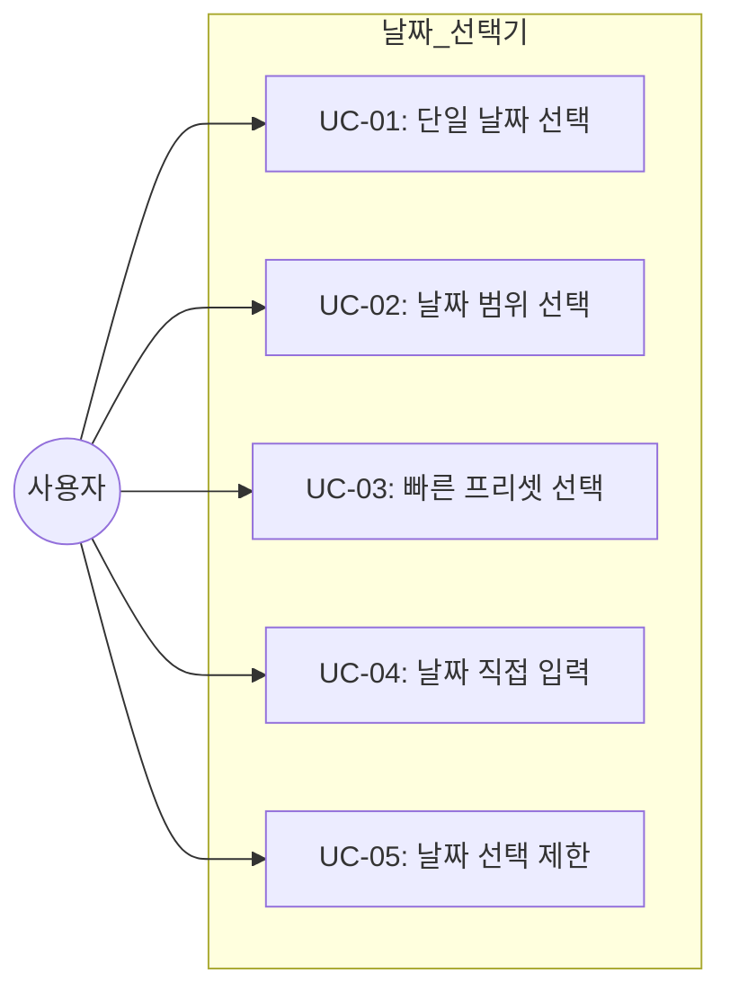
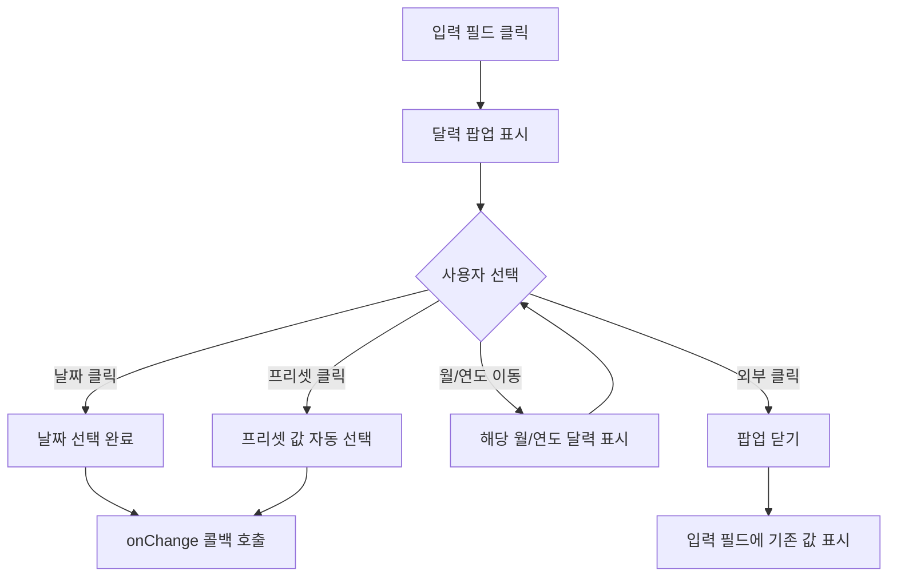

# TSK-05-05 - 날짜 선택기 공통 컴포넌트 설계 문서

## 문서 정보

| 항목 | 내용 |
|------|------|
| Task ID | TSK-05-05 |
| 문서 버전 | 1.0 |
| 작성일 | 2026-01-20 |
| 상태 | 작성중 |
| 카테고리 | development |

---

## 1. 개요

### 1.1 배경 및 문제 정의

**현재 상황:**
- MES Portal에서 생산 일정, 실적 조회, 검사 이력 등 날짜 기반 데이터 조회가 빈번히 발생
- 각 화면마다 DatePicker를 개별 설정하면 일관성 없는 날짜 포맷과 UX 발생
- 한국어 환경에서 영문 요일/월 표시로 사용자 혼란 발생 가능

**해결하려는 문제:**
- 날짜 선택 기능의 표준화 및 재사용성 확보
- 한국어 로케일 적용으로 일관된 사용자 경험 제공
- 날짜 포맷(YYYY-MM-DD) 통일로 데이터 처리 간소화

### 1.2 목적 및 기대 효과

**목적:**
- 재사용 가능한 날짜 선택기 컴포넌트 구현 (단일/범위)
- dayjs 한국어 로케일 설정을 통한 사용자 친화적 UI 제공
- MES Portal 테마 시스템과 통합된 일관된 디자인

**기대 효과:**
- 사용자 관점: 한글 요일/월 표시로 직관적인 날짜 선택
- 개발자 관점: 공통 컴포넌트 재사용으로 개발 시간 단축
- 비즈니스 관점: 날짜 데이터 표준화로 리포트 및 분석 용이

### 1.3 범위

**포함:**
- 단일 날짜 선택기 (DatePicker)
- 날짜 범위 선택기 (RangePicker)
- 한국어 로케일 설정 (요일, 월 한글 표시)
- 기본 날짜 포맷: YYYY-MM-DD
- 날짜 선택 제한 (min/max date)
- 빠른 선택 프리셋 (오늘, 이번 주, 이번 달 등)

**제외:**
- 시간 선택기 (TimePicker) - 향후 별도 Task
- 달력 뷰 컴포넌트 (Calendar) - 향후 별도 Task
- 날짜/시간 복합 선택기 (DateTimePicker) - 향후 별도 Task

### 1.4 참조 문서

| 문서 | 경로 | 관련 섹션 |
|------|------|----------|
| PRD | `.orchay/projects/mes-portal/prd.md` | 4.1.1 확장 컴포넌트 - 날짜 선택기 |
| TRD | `.orchay/projects/mes-portal/trd.md` | 7. PRD 요구사항 - 폼/입력 |

---

## 2. 사용자 분석

### 2.1 대상 사용자

| 사용자 유형 | 특성 | 주요 니즈 |
|------------|------|----------|
| 공장장/관리자 | 기간별 리포트 조회, 생산 분석 | 시작일-종료일 범위 선택, 월간/분기별 빠른 선택 |
| 생산 담당자 | 일별 작업 지시 확인, 실적 입력 | 오늘/특정 날짜 빠른 선택, 캘린더 보기 |
| 품질 담당자 | 검사 이력 조회, 불량 추이 분석 | 날짜 범위 선택, 최근 7일/30일 프리셋 |
| 설비 담당자 | 설비 가동 이력, 유지보수 일정 | 특정 날짜 선택, 미래 날짜 선택 |

### 2.2 사용자 페르소나

**페르소나 1: 김관리 (공장장)**
- 역할: 전체 생산 현황 관리
- 목표: 월간 생산 실적 리포트를 빠르게 조회
- 불만: 날짜를 하나씩 클릭해서 선택하는 것이 번거로움
- 시나리오: "이번 달" 버튼을 눌러 빠르게 월간 데이터 조회

**페르소나 2: 박생산 (생산 담당자)**
- 역할: 라인별 일일 생산 관리
- 목표: 당일 작업 지시 목록 조회
- 불만: 영문 요일 표시로 한눈에 파악이 어려움
- 시나리오: 한글 요일이 표시된 달력에서 오늘 날짜 선택

**페르소나 3: 이품질 (품질 담당자)**
- 역할: 품질 검사 및 불량 추적
- 목표: 최근 7일간 불량 발생 추이 확인
- 불만: 시작일과 종료일을 각각 선택하는 것이 비효율적
- 시나리오: RangePicker에서 "최근 7일" 프리셋 버튼 클릭

---

## 3. 유즈케이스

### 3.1 유즈케이스 다이어그램



### 3.2 유즈케이스 상세

#### UC-01: 단일 날짜 선택

| 항목 | 내용 |
|------|------|
| 액터 | 모든 사용자 |
| 목적 | 특정 날짜를 선택하여 해당 날짜 기준 데이터 조회 |
| 사전 조건 | DatePicker 컴포넌트가 화면에 표시됨 |
| 사후 조건 | 선택된 날짜 값이 부모 컴포넌트에 전달됨 |
| 트리거 | DatePicker 입력 필드 클릭 |

**기본 흐름:**
1. 사용자가 DatePicker 입력 필드를 클릭한다
2. 시스템이 달력 팝업을 표시한다 (현재 월 기준)
3. 사용자가 원하는 날짜를 클릭한다
4. 시스템이 달력 팝업을 닫는다
5. 입력 필드에 선택된 날짜가 "YYYY-MM-DD" 형식으로 표시된다
6. onChange 콜백이 호출되어 선택된 날짜 값이 전달된다

**대안 흐름:**
- 2a. 다른 월의 날짜를 선택하려는 경우:
  - 좌우 화살표로 이전/다음 월로 이동
  - 월 표시 영역 클릭으로 월 선택 패널 표시
  - 연도 표시 영역 클릭으로 연도 선택 패널 표시

**예외 흐름:**
- 3a. 선택 불가 날짜를 클릭한 경우:
  - 시스템이 클릭을 무시하고 날짜가 선택되지 않음
  - 선택 불가 날짜는 비활성화 스타일로 표시

#### UC-02: 날짜 범위 선택

| 항목 | 내용 |
|------|------|
| 액터 | 모든 사용자 |
| 목적 | 시작일과 종료일 범위를 선택하여 기간별 데이터 조회 |
| 사전 조건 | RangePicker 컴포넌트가 화면에 표시됨 |
| 사후 조건 | 시작일-종료일 범위 값이 부모 컴포넌트에 전달됨 |
| 트리거 | RangePicker 입력 필드 클릭 |

**기본 흐름:**
1. 사용자가 RangePicker 입력 필드를 클릭한다
2. 시스템이 2개월 달력 팝업을 표시한다 (현재 월 + 다음 월)
3. 사용자가 시작일을 클릭한다
4. 시스템이 시작일을 강조 표시하고 종료일 선택 대기
5. 사용자가 종료일을 클릭한다
6. 시스템이 시작일-종료일 사이 날짜들을 강조 표시한다
7. 달력 팝업이 닫히고 입력 필드에 "YYYY-MM-DD ~ YYYY-MM-DD" 형식으로 표시된다
8. onChange 콜백이 호출되어 [시작일, 종료일] 배열이 전달된다

**대안 흐름:**
- 5a. 시작일보다 이전 날짜를 종료일로 선택한 경우:
  - 해당 날짜가 새로운 시작일이 되고 종료일 선택 대기 상태로 전환

#### UC-03: 빠른 프리셋 선택

| 항목 | 내용 |
|------|------|
| 액터 | 모든 사용자 |
| 목적 | 자주 사용하는 날짜/기간을 한 번의 클릭으로 선택 |
| 사전 조건 | 프리셋이 설정된 DatePicker/RangePicker 표시됨 |
| 사후 조건 | 프리셋에 해당하는 날짜/범위 값이 전달됨 |
| 트리거 | 프리셋 버튼 클릭 |

**기본 흐름:**
1. 사용자가 DatePicker/RangePicker 팝업을 연다
2. 시스템이 달력과 함께 프리셋 버튼들을 표시한다 (오늘, 최근 7일, 이번 달 등)
3. 사용자가 원하는 프리셋 버튼을 클릭한다
4. 시스템이 해당 프리셋의 날짜/범위를 자동 선택한다
5. 달력 팝업이 닫히고 입력 필드에 선택된 값이 표시된다

**프리셋 종류:**

| 프리셋 | DatePicker | RangePicker |
|--------|------------|-------------|
| 오늘 | O | - |
| 어제 | O | - |
| 최근 7일 | - | O |
| 최근 30일 | - | O |
| 이번 주 | - | O |
| 지난 주 | - | O |
| 이번 달 | - | O |
| 지난 달 | - | O |

#### UC-04: 날짜 직접 입력

| 항목 | 내용 |
|------|------|
| 액터 | 모든 사용자 |
| 목적 | 키보드로 날짜를 직접 입력하여 빠르게 선택 |
| 사전 조건 | DatePicker 입력 필드에 포커스 |
| 사후 조건 | 유효한 날짜인 경우 값이 전달됨 |
| 트리거 | 키보드 입력 |

**기본 흐름:**
1. 사용자가 DatePicker 입력 필드에 포커스한다
2. 사용자가 날짜를 직접 입력한다 (예: 2026-01-20)
3. 시스템이 입력값의 형식을 실시간 검증한다
4. 유효한 날짜인 경우 onChange 콜백이 호출된다
5. 유효하지 않은 경우 입력 필드 테두리가 빨간색으로 변경된다

**예외 흐름:**
- 3a. 잘못된 형식 입력 시:
  - 입력 필드에 에러 표시 (빨간 테두리)
  - 포커스 아웃 시 이전 유효 값으로 복원

#### UC-05: 날짜 선택 제한

| 항목 | 내용 |
|------|------|
| 액터 | 모든 사용자 |
| 목적 | 비즈니스 규칙에 따라 선택 가능 날짜 제한 |
| 사전 조건 | minDate/maxDate 또는 disabledDate가 설정됨 |
| 사후 조건 | 제한된 날짜는 선택 불가 |
| 트리거 | 달력 팝업 표시 |

**기본 흐름:**
1. 사용자가 달력 팝업을 연다
2. 시스템이 제한된 날짜들을 비활성화 스타일로 표시한다
3. 사용자가 비활성화된 날짜를 클릭한다
4. 시스템이 클릭을 무시한다 (선택되지 않음)
5. 사용자가 활성화된 날짜를 클릭한다
6. 정상적으로 날짜가 선택된다

---

## 4. 사용자 시나리오

### 4.1 시나리오 1: 월간 생산 실적 리포트 조회

**상황 설명:**
김관리 공장장이 월간 생산 실적 리포트를 조회하기 위해 생산 실적 화면에 접근했다. 이번 달 전체 실적을 한 번에 보고 싶다.

**단계별 진행:**

| 단계 | 사용자 행동 | 시스템 반응 | 사용자 기대 |
|------|-----------|------------|------------|
| 1 | RangePicker 클릭 | 2개월 달력 + 프리셋 버튼 표시 | 빠른 선택 옵션 확인 |
| 2 | "이번 달" 프리셋 버튼 클릭 | 이번 달 1일~오늘 날짜 자동 선택 | 한 번의 클릭으로 기간 설정 |
| 3 | 조회 버튼 클릭 | 해당 기간 데이터 로드 | 월간 리포트 확인 |

**성공 조건:**
- 프리셋 버튼으로 2번의 클릭(시작일, 종료일)을 1번으로 단축
- 한글로 "이번 달" 표시되어 직관적 이해

### 4.2 시나리오 2: 당일 작업 지시 조회

**상황 설명:**
박생산 담당자가 오늘 진행할 작업 지시를 확인하기 위해 작업 지시 목록 화면에 접근했다.

**단계별 진행:**

| 단계 | 사용자 행동 | 시스템 반응 | 사용자 기대 |
|------|-----------|------------|------------|
| 1 | DatePicker 클릭 | 달력 팝업 표시 (오늘 날짜 강조) | 오늘 날짜가 쉽게 눈에 띔 |
| 2 | "오늘" 버튼 클릭 또는 강조된 오늘 날짜 클릭 | 오늘 날짜 선택, 팝업 닫힘 | 즉시 날짜 선택 완료 |
| 3 | 입력 필드 확인 | "2026-01-20 (월)" 형식 표시 | 요일까지 확인 가능 |

**성공 조건:**
- 오늘 날짜가 시각적으로 강조되어 빠른 선택
- 한글 요일 표시로 직관적 확인

### 4.3 시나리오 3: 품질 불량 추이 분석 (범위 선택)

**상황 설명:**
이품질 담당자가 최근 7일간 불량 발생 추이를 분석하기 위해 품질 검사 이력 화면에 접근했다.

**단계별 진행:**

| 단계 | 사용자 행동 | 시스템 반응 | 사용자 기대 |
|------|-----------|------------|------------|
| 1 | RangePicker 클릭 | 달력 팝업 + "최근 7일" 프리셋 표시 | 자주 쓰는 기간 프리셋 확인 |
| 2 | "최근 7일" 클릭 | 오늘 기준 7일 전 ~ 오늘 자동 선택 | 빠른 기간 설정 |
| 3 | 조회 후 기간 조정 필요 | 달력에서 수동으로 날짜 변경 | 세부 조정 가능 |

**성공 조건:**
- 프리셋으로 빠른 기간 설정 후 필요시 수동 조정 가능
- 선택된 범위가 달력에 시각적으로 표시

### 4.4 시나리오 4: 미래 날짜 선택 제한

**상황 설명:**
생산 실적 입력 화면에서 미래 날짜에 실적을 입력할 수 없도록 제한되어 있다.

**단계별 진행:**

| 단계 | 사용자 행동 | 시스템 반응 | 복구 방법 |
|------|-----------|------------|----------|
| 1 | DatePicker 클릭 | 달력 표시, 내일 이후 날짜 비활성화 | - |
| 2 | 비활성화된 미래 날짜 클릭 | 클릭 무시, 날짜 선택 안 됨 | 오늘 또는 과거 날짜 선택 |
| 3 | 오늘 날짜 클릭 | 정상 선택, 팝업 닫힘 | - |

---

## 5. 화면 설계

### 5.1 화면 흐름도



### 5.2 화면별 상세

#### 화면 1: 단일 날짜 선택기 (DatePicker)

**화면 목적:**
특정 날짜를 선택하여 데이터 조회 조건으로 사용

**와이어프레임:**
```
┌─────────────────────────────────────────────────────────────────────────────┐
│                                                                             │
│  [입력 필드]                                                                │
│  ┌─────────────────────────────────┐                                       │
│  │ 2026-01-20 (월)           📅   │                                       │
│  └─────────────────────────────────┘                                       │
│                                                                             │
│  [달력 팝업 - 열린 상태]                                                     │
│  ┌─────────────────────────────────────────────────────────────────────────┐│
│  │ ┌─────────────────────────┐ ┌─────────────────┐                        ││
│  │ │        달력 영역         │ │  프리셋 영역     │                        ││
│  │ │  < 2026년 1월 >         │ │                 │                        ││
│  │ │                         │ │  [오늘]         │                        ││
│  │ │  일  월  화  수  목  금  토│ │  [어제]         │                        ││
│  │ │           1   2   3   4 │ │                 │                        ││
│  │ │   5   6   7   8   9  10  11│ │                 │                        ││
│  │ │  12  13  14  15  16  17  18│ │                 │                        ││
│  │ │  19 [20] 21  22  23  24  25│ │                 │                        ││
│  │ │  26  27  28  29  30  31    │ │                 │                        ││
│  │ │                         │ │                 │                        ││
│  │ └─────────────────────────┘ └─────────────────┘                        ││
│  └─────────────────────────────────────────────────────────────────────────┘│
│                                                                             │
└─────────────────────────────────────────────────────────────────────────────┘

범례:
📅 : 달력 아이콘 (클릭 시 팝업 열기)
[20] : 선택된 날짜 (배경색 강조)
< > : 이전/다음 월 이동 버튼
```

**화면 요소 설명:**

| 영역 | 설명 | 사용자 인터랙션 |
|------|------|----------------|
| 입력 필드 | 선택된 날짜 표시 | 클릭 시 팝업 열기, 직접 입력 가능 |
| 달력 아이콘 | 달력 열기 버튼 | 클릭 시 팝업 열기 |
| 월 이동 버튼 | 이전/다음 월 이동 | 클릭 시 해당 월로 이동 |
| 연월 표시 | 현재 보고 있는 연월 | 클릭 시 월/연도 선택 패널 |
| 요일 헤더 | 한글 요일 표시 | 없음 |
| 날짜 셀 | 각 날짜 | 클릭 시 선택 |
| 프리셋 영역 | 빠른 선택 버튼 | 클릭 시 해당 날짜 선택 |

#### 화면 2: 날짜 범위 선택기 (RangePicker)

**화면 목적:**
시작일과 종료일을 선택하여 기간별 데이터 조회

**와이어프레임:**
```
┌─────────────────────────────────────────────────────────────────────────────────┐
│                                                                                 │
│  [입력 필드]                                                                    │
│  ┌───────────────────────────────────────────────────────────────┐             │
│  │ 2026-01-14 (화) ~ 2026-01-20 (월)                       📅   │             │
│  └───────────────────────────────────────────────────────────────┘             │
│                                                                                 │
│  [달력 팝업 - 열린 상태]                                                         │
│  ┌─────────────────────────────────────────────────────────────────────────────┐│
│  │ ┌──────────────────────────────────────────────────┐ ┌───────────────────┐ ││
│  │ │                  2개월 달력 영역                   │ │    프리셋 영역     │ ││
│  │ │  < 2026년 1월 >           < 2026년 2월 >         │ │                   │ ││
│  │ │                                                  │ │  [최근 7일]       │ ││
│  │ │  일 월 화 수 목 금 토     일 월 화 수 목 금 토    │ │  [최근 30일]      │ ││
│  │ │        1  2  3  4        1  2  3  4  5  6  7     │ │  [이번 주]        │ ││
│  │ │   5  6  7  8  9 10 11    8  9 10 11 12 13 14     │ │  [지난 주]        │ ││
│  │ │  12 13[14 15 16 17 18]  15 16 17 18 19 20 21     │ │  [이번 달]        │ ││
│  │ │ [19 20]21 22 23 24 25   22 23 24 25 26 27 28     │ │  [지난 달]        │ ││
│  │ │  26 27 28 29 30 31                               │ │                   │ ││
│  │ │                                                  │ │                   │ ││
│  │ └──────────────────────────────────────────────────┘ └───────────────────┘ ││
│  └─────────────────────────────────────────────────────────────────────────────┘│
│                                                                                 │
└─────────────────────────────────────────────────────────────────────────────────┘

범례:
[14 15 16 17 18 19 20] : 선택된 범위 (배경색 강조)
[14] : 시작일 (좌측 끝 강조)
[20] : 종료일 (우측 끝 강조)
```

**화면 요소 설명:**

| 영역 | 설명 | 사용자 인터랙션 |
|------|------|----------------|
| 입력 필드 | 시작일 ~ 종료일 표시 | 클릭 시 팝업 열기 |
| 2개월 달력 | 연속된 2개월 표시 | 날짜 클릭으로 범위 선택 |
| 선택 범위 표시 | 시작일-종료일 사이 강조 | 시각적 피드백 |
| 프리셋 영역 | 자주 쓰는 기간 버튼 | 클릭 시 해당 기간 선택 |

### 5.3 상태별 표시

#### 날짜 셀 상태

| 상태 | 시각적 표현 | 설명 |
|------|------------|------|
| 기본 | 검정 텍스트, 흰색 배경 | 선택 가능한 일반 날짜 |
| 오늘 | 파란 테두리 | 현재 날짜 강조 |
| 선택됨 | 파란 배경, 흰색 텍스트 | 선택된 날짜 |
| 범위 내 | 연한 파란 배경 | 선택된 범위 내 날짜 |
| 호버 | 연한 회색 배경 | 마우스 오버 상태 |
| 비활성 | 회색 텍스트 | 선택 불가 날짜 |
| 주말 | 빨간색/파란색 텍스트 (선택적) | 토/일요일 구분 |

### 5.4 반응형 동작

| 화면 크기 | 레이아웃 변화 | 사용자 경험 |
|----------|--------------|------------|
| 데스크톱 (1024px+) | RangePicker 2개월 나란히 표시 | 넓은 화면에서 범위 한눈에 파악 |
| 태블릿 (768-1023px) | RangePicker 2개월 나란히 (축소) | 터치 친화적 크기 유지 |
| 모바일 (767px-) | RangePicker 1개월씩 세로 배치 | 좁은 화면에 최적화, 스와이프로 월 이동 |

---

## 6. 인터랙션 설계

### 6.1 사용자 액션과 피드백

| 사용자 액션 | 즉각 피드백 | 결과 피드백 | 에러 피드백 |
|------------|-----------|------------|------------|
| 입력 필드 클릭 | 필드 포커스 스타일 | 달력 팝업 표시 | - |
| 날짜 클릭 | 클릭한 날짜 강조 | 팝업 닫힘 + 값 표시 | - |
| 비활성 날짜 클릭 | 커서 not-allowed | 반응 없음 | - |
| 프리셋 버튼 클릭 | 버튼 눌림 효과 | 날짜 자동 선택 + 팝업 닫힘 | - |
| 월 이동 버튼 클릭 | 버튼 눌림 효과 | 해당 월 달력 표시 | - |
| 직접 입력 | 입력 중 표시 | 유효한 경우 값 반영 | 잘못된 형식 시 빨간 테두리 |
| 외부 클릭 | - | 팝업 닫힘 | - |
| Escape 키 | - | 팝업 닫힘 | - |

### 6.2 상태별 화면 변화

| 상태 | 화면 표시 | 사용자 안내 |
|------|----------|------------|
| 초기 (빈 값) | 플레이스홀더 텍스트 | "날짜 선택" |
| 값 있음 | 선택된 날짜 표시 | "YYYY-MM-DD (요일)" |
| 달력 열림 | 팝업 표시 | 오늘 날짜 시각적 강조 |
| 범위 선택 중 | 시작일만 선택됨 | "종료일을 선택하세요" 안내 (선택적) |
| 에러 | 빨간 테두리 | 잘못된 형식 안내 |
| 비활성화 | 회색 배경 | 입력 불가 상태 |

### 6.3 키보드/접근성

| 기능 | 키보드 단축키 | 스크린 리더 안내 |
|------|-------------|-----------------|
| 팝업 열기 | Enter, Space | "날짜 선택기 열림" |
| 팝업 닫기 | Escape | "날짜 선택기 닫힘" |
| 날짜 이동 | 화살표 키 | "1월 20일 월요일" |
| 날짜 선택 | Enter | "2026년 1월 20일 선택됨" |
| 월 이동 | Page Up/Down | "2026년 2월로 이동" |
| 연도 이동 | Ctrl + Page Up/Down | "2027년으로 이동" |

---

## 7. 데이터 요구사항

### 7.1 필요한 데이터

| 데이터 | 설명 | 출처 | 용도 |
|--------|------|------|------|
| value | 선택된 날짜 값 | 부모 컴포넌트 | 초기값 설정 및 표시 |
| locale | 로케일 설정 | 전역 설정 (ko) | 요일/월 한글 표시 |
| format | 날짜 포맷 | prop (기본: YYYY-MM-DD) | 표시 및 출력 형식 |
| disabledDate | 비활성 날짜 함수 | prop | 선택 제한 |
| presets | 프리셋 목록 | prop | 빠른 선택 버튼 |

### 7.2 Props 인터페이스

**DatePicker:**
```typescript
interface MesDatePickerProps {
  // 기본 props
  value?: Dayjs | null;
  defaultValue?: Dayjs;
  onChange?: (date: Dayjs | null, dateString: string) => void;

  // 포맷 및 로케일
  format?: string;                      // 기본: 'YYYY-MM-DD'
  showToday?: boolean;                  // 오늘 버튼 표시 (기본: true)

  // 제한
  minDate?: Dayjs;
  maxDate?: Dayjs;
  disabledDate?: (currentDate: Dayjs) => boolean;

  // 프리셋
  presets?: Array<{ label: string; value: Dayjs }>;

  // 상태
  disabled?: boolean;
  placeholder?: string;                 // 기본: '날짜 선택'
  size?: 'small' | 'middle' | 'large';
  status?: 'error' | 'warning';

  // 스타일
  className?: string;
  style?: React.CSSProperties;
  allowClear?: boolean;                 // 지우기 버튼 (기본: true)
}
```

**RangePicker:**
```typescript
interface MesRangePickerProps {
  // 기본 props
  value?: [Dayjs, Dayjs] | null;
  defaultValue?: [Dayjs, Dayjs];
  onChange?: (dates: [Dayjs, Dayjs] | null, dateStrings: [string, string]) => void;

  // 포맷 및 로케일
  format?: string;                      // 기본: 'YYYY-MM-DD'
  separator?: string;                   // 기본: '~'

  // 제한
  minDate?: Dayjs;
  maxDate?: Dayjs;
  disabledDate?: (currentDate: Dayjs) => boolean;

  // 프리셋
  presets?: Array<{ label: string; value: [Dayjs, Dayjs] }>;

  // 상태
  disabled?: boolean;
  placeholder?: [string, string];       // 기본: ['시작일', '종료일']
  size?: 'small' | 'middle' | 'large';
  status?: 'error' | 'warning';

  // 스타일
  className?: string;
  style?: React.CSSProperties;
  allowClear?: boolean;                 // 기본: true
}
```

### 7.3 데이터 유효성 규칙

| 데이터 필드 | 규칙 | 위반 시 처리 |
|------------|------|-------------|
| value | Dayjs 객체 또는 null | 잘못된 값은 무시 |
| format | 유효한 날짜 포맷 문자열 | 기본값 'YYYY-MM-DD' 사용 |
| minDate/maxDate | minDate <= maxDate | 경고 로그 출력, 동작은 유지 |
| disabledDate 반환값 | boolean | false로 처리 |

---

## 8. 비즈니스 규칙

### 8.1 핵심 규칙

| 규칙 ID | 규칙 설명 | 적용 상황 | 예외 |
|---------|----------|----------|------|
| BR-01 | 기본 날짜 포맷은 YYYY-MM-DD | 모든 DatePicker/RangePicker | format prop으로 변경 가능 |
| BR-02 | 한국어 로케일 기본 적용 | 달력 요일/월 표시 | 없음 |
| BR-03 | 오늘 날짜는 항상 시각적 강조 | 달력 표시 시 | 없음 |
| BR-04 | RangePicker에서 시작일 > 종료일 선택 시 시작일로 재설정 | 범위 선택 시 | 없음 |
| BR-05 | 빈 값 허용 (allowClear 기본 true) | 값 초기화 | allowClear={false}로 비활성화 |

### 8.2 규칙 상세 설명

**BR-01: 기본 날짜 포맷**

설명: MES 시스템 전체에서 날짜 데이터의 일관성을 위해 기본 포맷을 YYYY-MM-DD로 통일한다.

예시:
- 표시: "2026-01-20"
- API 전송: "2026-01-20"
- 필요시 요일 포함: "2026-01-20 (월)"

**BR-02: 한국어 로케일**

설명: MES Portal의 주 사용자가 한국인이므로 달력의 요일과 월을 한글로 표시한다.

예시:
- 요일: 일, 월, 화, 수, 목, 금, 토
- 월: 1월, 2월, ..., 12월
- 오늘 버튼: "오늘"

**BR-04: RangePicker 역순 선택 처리**

설명: 사용자가 시작일보다 이전 날짜를 종료일로 선택하면, 해당 날짜를 새로운 시작일로 설정하고 종료일 선택을 다시 요청한다. 이는 사용자의 혼란을 방지하기 위함이다.

예시:
- 1월 20일 선택 (시작일) → 1월 15일 클릭 → 1월 15일이 새 시작일로 설정
- 종료일 선택 대기 상태로 전환

---

## 9. 에러 처리

### 9.1 예상 에러 상황

| 상황 | 원인 | 사용자 메시지 | 복구 방법 |
|------|------|--------------|----------|
| 잘못된 날짜 형식 입력 | 키보드로 잘못된 형식 입력 | 입력 필드 빨간 테두리 | 포커스 아웃 시 이전 값 복원 |
| 비활성 날짜 선택 시도 | 제한된 날짜 클릭 | 클릭 무반응, 커서 변경 | 활성화된 날짜 선택 |
| minDate > maxDate 설정 | 개발자 설정 오류 | 콘솔 경고 | 경고만 출력, 동작은 유지 |
| value와 format 불일치 | 개발자 설정 오류 | 콘솔 경고 | 기본 포맷으로 표시 시도 |

### 9.2 에러 표시 방식

| 에러 유형 | 표시 위치 | 표시 방법 |
|----------|----------|----------|
| 유효성 검사 실패 | 입력 필드 | 빨간 테두리 (status="error") |
| 입력 형식 오류 | 입력 필드 하단 | Form.Item 에러 메시지 |
| 비활성 날짜 | 달력 셀 | 회색 텍스트 + not-allowed 커서 |

---

## 10. 연관 문서

> 상세 테스트 명세 및 요구사항 추적은 별도 문서에서 관리합니다.

| 문서 | 경로 | 용도 |
|------|------|------|
| 요구사항 추적 매트릭스 | `025-traceability-matrix.md` | PRD - 설계 - 테스트 양방향 추적 |
| 테스트 명세서 | `026-test-specification.md` | 단위/E2E/매뉴얼 테스트 상세 정의 |

---

## 11. 구현 범위

### 11.1 파일 구조

```
lib/
├── dayjs/
│   └── locale.ts                # dayjs 한국어 로케일 설정
components/
├── common/
│   ├── MesDatePicker.tsx        # 단일 날짜 선택기 래퍼
│   └── MesRangePicker.tsx       # 날짜 범위 선택기 래퍼
├── (또는 통합)
│   └── MesDatePicker/
│       ├── index.tsx            # 통합 export
│       ├── DatePicker.tsx       # 단일 선택기
│       └── RangePicker.tsx      # 범위 선택기
```

### 11.2 영향받는 영역

| 영역 | 변경 내용 | 영향도 |
|------|----------|--------|
| lib/dayjs/locale.ts | dayjs 한국어 로케일 초기화 | 높음 |
| components/common/MesDatePicker.tsx | 신규 생성 | 높음 |
| components/common/MesRangePicker.tsx | 신규 생성 | 높음 |
| app/layout.tsx 또는 providers | dayjs locale import | 중간 |
| 화면 템플릿 (ListTemplate 등) | 검색 조건에 날짜 선택기 사용 | 중간 |

### 11.3 의존성

| 의존 항목 | 이유 | 상태 |
|----------|------|------|
| TSK-00-02 (UI 라이브러리 설정) | Ant Design DatePicker 사용 | 완료 |
| dayjs | Ant Design DatePicker의 날짜 라이브러리 | TRD에서 확인됨 |
| dayjs/locale/ko | 한국어 로케일 | npm 설치 필요 |

### 11.4 사용할 Ant Design 컴포넌트

| 컴포넌트 | 용도 |
|----------|------|
| DatePicker | 단일 날짜 선택 |
| DatePicker.RangePicker | 날짜 범위 선택 |

### 11.5 dayjs 로케일 설정 예시

```typescript
// lib/dayjs/locale.ts
import dayjs from 'dayjs';
import 'dayjs/locale/ko';
import weekday from 'dayjs/plugin/weekday';
import localeData from 'dayjs/plugin/localeData';
import customParseFormat from 'dayjs/plugin/customParseFormat';

// 플러그인 확장
dayjs.extend(weekday);
dayjs.extend(localeData);
dayjs.extend(customParseFormat);

// 한국어 로케일 기본 설정
dayjs.locale('ko');

export default dayjs;
```

### 11.6 기본 프리셋 정의

```typescript
// 단일 날짜 프리셋
export const datePickerPresets = [
  { label: '오늘', value: dayjs() },
  { label: '어제', value: dayjs().subtract(1, 'day') },
];

// 범위 날짜 프리셋
export const rangePickerPresets = [
  { label: '최근 7일', value: [dayjs().subtract(6, 'day'), dayjs()] as [Dayjs, Dayjs] },
  { label: '최근 30일', value: [dayjs().subtract(29, 'day'), dayjs()] as [Dayjs, Dayjs] },
  { label: '이번 주', value: [dayjs().startOf('week'), dayjs()] as [Dayjs, Dayjs] },
  { label: '지난 주', value: [dayjs().subtract(1, 'week').startOf('week'), dayjs().subtract(1, 'week').endOf('week')] as [Dayjs, Dayjs] },
  { label: '이번 달', value: [dayjs().startOf('month'), dayjs()] as [Dayjs, Dayjs] },
  { label: '지난 달', value: [dayjs().subtract(1, 'month').startOf('month'), dayjs().subtract(1, 'month').endOf('month')] as [Dayjs, Dayjs] },
];
```

### 11.7 제약 사항

| 제약 | 설명 | 대응 방안 |
|------|------|----------|
| Ant Design DatePicker 의존 | 커스텀 기능은 Ant Design 확장으로 구현 | Ant Design 컴포넌트 패턴 준수 |
| dayjs 필수 | Ant Design v5+ 기본 날짜 라이브러리 | moment.js 대신 dayjs 사용 |
| SSR 호환성 | dayjs locale 설정 시점 주의 | 클라이언트 사이드에서 locale 설정 |

---

## 12. 체크리스트

### 12.1 설계 완료 확인

- [x] 문제 정의 및 목적 명확화
- [x] 사용자 분석 완료
- [x] 유즈케이스 정의 완료
- [x] 사용자 시나리오 작성 완료
- [x] 화면 설계 완료 (와이어프레임)
- [x] 인터랙션 설계 완료
- [x] 데이터 요구사항 정의 완료
- [x] 비즈니스 규칙 정의 완료
- [x] 에러 처리 정의 완료

### 12.2 연관 문서 작성

- [ ] 요구사항 추적 매트릭스 작성 (-> `025-traceability-matrix.md`)
- [ ] 테스트 명세서 작성 (-> `026-test-specification.md`)

### 12.3 구현 준비

- [x] 구현 우선순위 결정
- [x] 의존성 확인 완료
- [x] 제약 사항 검토 완료

---

## 변경 이력

| 버전 | 일자 | 작성자 | 변경 내용 |
|------|------|--------|----------|
| 1.0 | 2026-01-20 | Claude | 최초 작성 |
