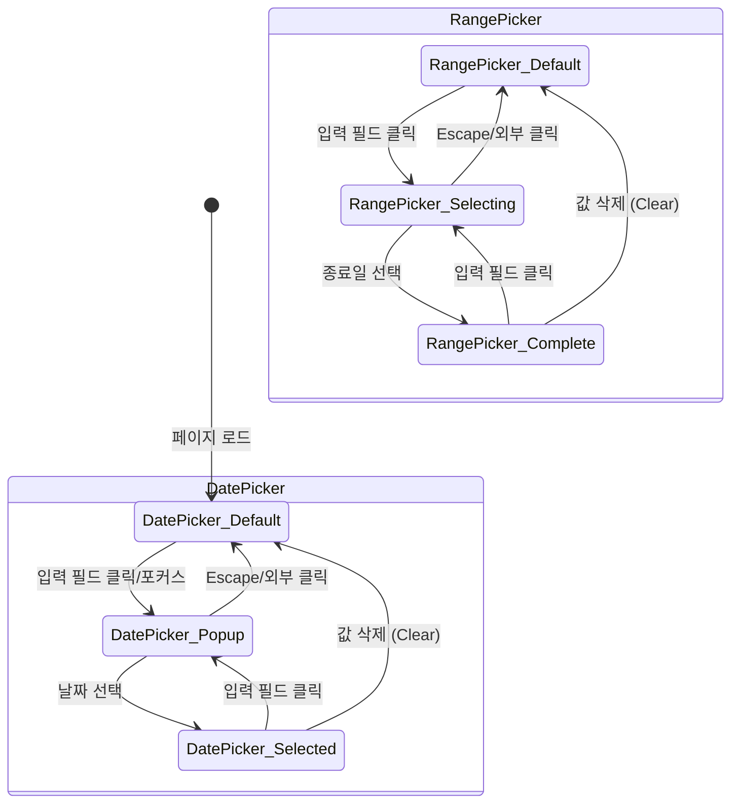
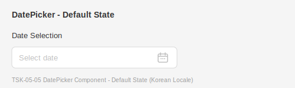
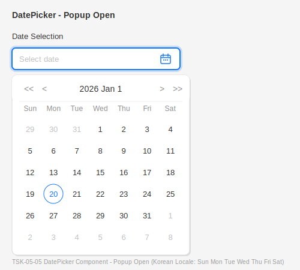
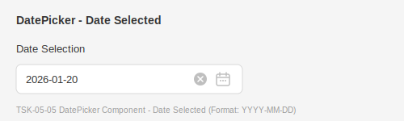
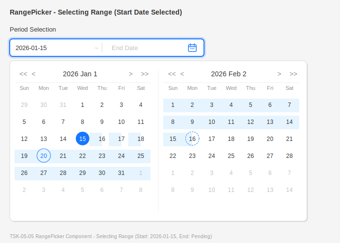
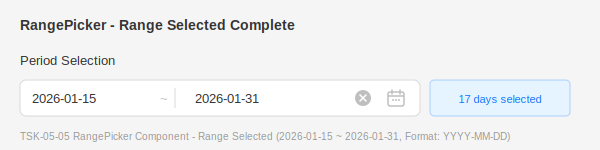

# TSK-05-05 - 날짜 선택기 공통 컴포넌트 UI 설계

## 문서 정보

| 항목 | 내용 |
|------|------|
| Task ID | TSK-05-05 |
| 문서 버전 | 1.0 |
| 작성일 | 2026-01-20 |
| 상태 | 작성완료 |
| 참조 설계 문서 | `010-design.md` |

---

## 1. 화면 목록

| 화면 ID | 화면명 | 목적 | SVG 참조 |
|---------|--------|------|----------|
| SCR-01 | DatePicker 기본 상태 | 단일 날짜 선택 입력 필드 (기본 상태) | `screen-01-datepicker-default.svg` |
| SCR-02 | DatePicker 팝업 열림 | 달력 팝업이 표시된 상태 | `screen-02-datepicker-popup.svg` |
| SCR-03 | DatePicker 날짜 선택됨 | 날짜가 선택된 상태 | `screen-03-datepicker-selected.svg` |
| SCR-04 | RangePicker 기본 상태 | 날짜 범위 선택 입력 필드 (기본 상태) | `screen-04-rangepicker-default.svg` |
| SCR-05 | RangePicker 범위 선택 중 | 시작일이 선택되고 종료일 선택 대기 | `screen-05-rangepicker-selecting.svg` |
| SCR-06 | RangePicker 범위 선택 완료 | 시작일과 종료일 모두 선택된 상태 | `screen-06-rangepicker-complete.svg` |

---

## 2. 화면 전환 흐름



### 액션-화면 매트릭스

| 현재 상태 | 액션 | 다음 상태 |
|----------|------|----------|
| DatePicker 기본 | 입력 필드 클릭 | DatePicker 팝업 열림 |
| DatePicker 기본 | 입력 필드 포커스 | DatePicker 팝업 열림 |
| DatePicker 팝업 열림 | 날짜 클릭 | DatePicker 날짜 선택됨 |
| DatePicker 팝업 열림 | 월 이동 버튼 클릭 | DatePicker 팝업 열림 (월 변경) |
| DatePicker 팝업 열림 | 연도 이동 버튼 클릭 | DatePicker 팝업 열림 (연도 변경) |
| DatePicker 팝업 열림 | 외부 영역 클릭 | DatePicker 기본 |
| DatePicker 팝업 열림 | Escape 키 | DatePicker 기본 |
| DatePicker 날짜 선택됨 | Clear 버튼 클릭 | DatePicker 기본 |
| DatePicker 날짜 선택됨 | 입력 필드 클릭 | DatePicker 팝업 열림 |
| RangePicker 기본 | 시작일 필드 클릭 | RangePicker 범위 선택 중 |
| RangePicker 범위 선택 중 | 시작일 선택 | RangePicker 범위 선택 중 (종료일 대기) |
| RangePicker 범위 선택 중 | 종료일 선택 | RangePicker 범위 선택 완료 |
| RangePicker 범위 선택 중 | 외부 영역 클릭 | RangePicker 기본 |
| RangePicker 범위 선택 완료 | Clear 버튼 클릭 | RangePicker 기본 |
| RangePicker 범위 선택 완료 | 입력 필드 클릭 | RangePicker 범위 선택 중 |

---

## 3. 화면별 상세

### 3.1 SCR-01: DatePicker 기본 상태

**화면 목적:**
단일 날짜를 선택하기 위한 입력 필드. 플레이스홀더와 달력 아이콘이 표시된다.

**레이아웃:**

```
┌────────────────────────────────────────────────────────────────┐
│ 날짜 선택                                                      │
├────────────────────────────────────────────────────────────────┤
│  ┌──────────────────────────────────────────────────────┬───┐  │
│  │ 날짜를 선택하세요                                    │ 📅│  │
│  └──────────────────────────────────────────────────────┴───┘  │
└────────────────────────────────────────────────────────────────┘
```

**컴포넌트 구성:**

| 컴포넌트 | Ant Design | Props |
|----------|------------|-------|
| 입력 필드 | `DatePicker` | placeholder, format, locale |
| 달력 아이콘 | 내장 (suffixIcon) | CalendarOutlined |

**상태 정의:**

| 상태 | 설명 | 시각적 표현 |
|------|------|------------|
| 기본 | 값 없음, 비활성 | 회색 플레이스홀더, 회색 테두리 |
| 호버 | 마우스 올림 | 테두리 색상 primary (#1677ff) |
| 포커스 | 입력 필드 포커스 | 파란색 테두리, 그림자 효과 |
| 비활성 | disabled=true | 회색 배경, 입력 불가 |

**액션 정의:**

| 액션 | 트리거 | 결과 |
|------|--------|------|
| 팝업 열기 | 클릭/포커스 | 달력 팝업 표시 |
| 값 삭제 | Clear 아이콘 클릭 | 값 초기화 |

### 3.2 SCR-02: DatePicker 팝업 열림

**화면 목적:**
달력 팝업이 표시된 상태. 현재 월의 날짜들과 월/연도 네비게이션이 표시된다.

**레이아웃:**

```
┌────────────────────────────────────────────────────────────────┐
│ 날짜 선택                                                      │
├────────────────────────────────────────────────────────────────┤
│  ┌──────────────────────────────────────────────────────┬───┐  │
│  │ 날짜를 선택하세요                                    │ 📅│  │
│  └──────────────────────────────────────────────────────┴───┘  │
│                                                                │
│  ┌──────────────────────────────────────────────────────────┐  │
│  │  ◀◀  ◀      2026년 1월      ▶  ▶▶                       │  │
│  ├──────────────────────────────────────────────────────────┤  │
│  │   일    월    화    수    목    금    토                 │  │
│  ├──────────────────────────────────────────────────────────┤  │
│  │        29    30    31     1     2     3     4           │  │
│  │    5     6     7     8     9    10    11                │  │
│  │   12    13    14    15    16    17    18                │  │
│  │   19   [20]   21    22    23    24    25                │  │
│  │   26    27    28    29    30    31     1                │  │
│  └──────────────────────────────────────────────────────────┘  │
└────────────────────────────────────────────────────────────────┘
```

**컴포넌트 구성:**

| 컴포넌트 | 설명 | 위치 |
|----------|------|------|
| 연도 이동 버튼 | `<<` / `>>` | 좌/우측 끝 |
| 월 이동 버튼 | `<` / `>` | 연도 버튼 안쪽 |
| 월/연도 표시 | "2026년 1월" | 중앙 |
| 요일 헤더 | 일~토 | 달력 상단 |
| 날짜 그리드 | 6x7 (42칸) | 달력 본문 |

**상태 정의:**

| 날짜 상태 | 설명 | 시각적 표현 |
|----------|------|------------|
| 현재 월 | 이번 달 날짜 | 검은색 텍스트 |
| 다른 월 | 이전/다음 달 날짜 | 회색 텍스트 |
| 오늘 | 오늘 날짜 | 파란색 테두리 |
| 호버 | 마우스 올림 | 연한 파란색 배경 |
| 선택됨 | 선택된 날짜 | 파란색 배경, 흰색 텍스트 |
| 비활성 | 선택 불가 날짜 | 회색 텍스트, 클릭 불가 |

**액션 정의:**

| 액션 | 트리거 | 결과 |
|------|--------|------|
| 날짜 선택 | 날짜 클릭 | 값 설정, 팝업 닫힘 |
| 이전 월 | `<` 클릭 | 이전 월 표시 |
| 다음 월 | `>` 클릭 | 다음 월 표시 |
| 이전 연도 | `<<` 클릭 | 이전 연도 표시 |
| 다음 연도 | `>>` 클릭 | 다음 연도 표시 |
| 팝업 닫기 | 외부 클릭/Escape | 팝업 닫힘 |

### 3.3 SCR-03: DatePicker 날짜 선택됨

**화면 목적:**
날짜가 선택된 후의 입력 필드 상태. 선택된 날짜가 YYYY-MM-DD 포맷으로 표시된다.

**레이아웃:**

```
┌────────────────────────────────────────────────────────────────┐
│ 날짜 선택                                                      │
├────────────────────────────────────────────────────────────────┤
│  ┌──────────────────────────────────────────────────────┬───┐  │
│  │ 2026-01-20                                       [X] │ 📅│  │
│  └──────────────────────────────────────────────────────┴───┘  │
└────────────────────────────────────────────────────────────────┘
```

**컴포넌트 구성:**

| 컴포넌트 | 설명 | 위치 |
|----------|------|------|
| 날짜 텍스트 | YYYY-MM-DD 포맷 | 입력 필드 좌측 |
| Clear 버튼 | X 아이콘 (호버 시 표시) | 달력 아이콘 좌측 |
| 달력 아이콘 | CalendarOutlined | 입력 필드 우측 |

**상태 정의:**

| 상태 | 설명 | 시각적 표현 |
|------|------|------------|
| 기본 | 값 있음 | 검은색 날짜 텍스트 |
| 호버 | 마우스 올림 | Clear 버튼 표시 |

### 3.4 SCR-04: RangePicker 기본 상태

**화면 목적:**
날짜 범위(시작일 ~ 종료일)를 선택하기 위한 입력 필드.

**레이아웃:**

```
┌────────────────────────────────────────────────────────────────┐
│ 기간 선택                                                      │
├────────────────────────────────────────────────────────────────┤
│  ┌────────────────────────┬───┬────────────────────────┬───┐  │
│  │ 시작일                 │ ~ │ 종료일                 │ 📅│  │
│  └────────────────────────┴───┴────────────────────────┴───┘  │
└────────────────────────────────────────────────────────────────┘
```

**컴포넌트 구성:**

| 컴포넌트 | Ant Design | Props |
|----------|------------|-------|
| 범위 선택기 | `DatePicker.RangePicker` | placeholder, format, locale |
| 구분자 | 내장 (separator) | "~" |
| 달력 아이콘 | 내장 (suffixIcon) | CalendarOutlined |

**상태 정의:**

| 상태 | 설명 | 시각적 표현 |
|------|------|------------|
| 기본 | 값 없음 | 회색 플레이스홀더 |
| 호버 | 마우스 올림 | 테두리 색상 변경 |
| 포커스 | 시작/종료 필드 포커스 | 해당 필드 강조 |

### 3.5 SCR-05: RangePicker 범위 선택 중

**화면 목적:**
시작일이 선택되고 종료일 선택을 대기하는 상태. 두 개의 달력 패널이 나란히 표시된다.

**레이아웃:**

```
┌────────────────────────────────────────────────────────────────┐
│ 기간 선택                                                      │
├────────────────────────────────────────────────────────────────┤
│  ┌────────────────────────┬───┬────────────────────────┬───┐  │
│  │ 2026-01-15             │ ~ │ 종료일                 │ 📅│  │
│  └────────────────────────┴───┴────────────────────────┴───┘  │
│                                                                │
│  ┌────────────────────────────┬────────────────────────────┐  │
│  │  ◀◀ ◀  2026년 1월  ▶ ▶▶   │  ◀◀ ◀  2026년 2월  ▶ ▶▶   │  │
│  ├────────────────────────────┼────────────────────────────┤  │
│  │ 일 월 화 수 목 금 토       │ 일 월 화 수 목 금 토       │  │
│  ├────────────────────────────┼────────────────────────────┤  │
│  │    29 30 31  1  2  3  4   │     1  2  3  4  5  6  7   │  │
│  │  5  6  7  8  9 10 11      │  8  9 10 11 12 13 14      │  │
│  │ 12 13 14[15]16 17 18      │ 15 16 17 18 19 20 21      │  │
│  │ 19 20 21 22 23 24 25      │ 22 23 24 25 26 27 28      │  │
│  │ 26 27 28 29 30 31  1      │  1  2  3  4  5  6  7      │  │
│  └────────────────────────────┴────────────────────────────┘  │
└────────────────────────────────────────────────────────────────┘
```

**컴포넌트 구성:**

| 컴포넌트 | 설명 | 위치 |
|----------|------|------|
| 좌측 달력 | 시작일 선택용 | 좌측 패널 |
| 우측 달력 | 종료일 선택용 | 우측 패널 |
| 연결된 월 표시 | 연속 두 달 | 양쪽 패널 |

**상태 정의:**

| 날짜 상태 | 설명 | 시각적 표현 |
|----------|------|------------|
| 시작일 | 선택된 시작 날짜 | 파란색 배경, 흰색 텍스트 |
| 범위 내 | 시작~종료 사이 | 연한 파란색 배경 |
| 호버 (범위) | 마우스가 올라간 날짜까지 | 연한 파란색 배경 미리보기 |
| 종료일 후보 | 마우스 위치 날짜 | 파란색 테두리 |

### 3.6 SCR-06: RangePicker 범위 선택 완료

**화면 목적:**
시작일과 종료일이 모두 선택된 상태.

**레이아웃:**

```
┌────────────────────────────────────────────────────────────────┐
│ 기간 선택                                                      │
├────────────────────────────────────────────────────────────────┤
│  ┌────────────────────────┬───┬────────────────────────┬───┐  │
│  │ 2026-01-15             │ ~ │ 2026-01-31         [X] │ 📅│  │
│  └────────────────────────┴───┴────────────────────────┴───┘  │
└────────────────────────────────────────────────────────────────┘
```

**컴포넌트 구성:**

| 컴포넌트 | 설명 | 위치 |
|----------|------|------|
| 시작일 텍스트 | YYYY-MM-DD 포맷 | 좌측 필드 |
| 구분자 | "~" | 중앙 |
| 종료일 텍스트 | YYYY-MM-DD 포맷 | 우측 필드 |
| Clear 버튼 | X 아이콘 (호버 시) | 달력 아이콘 좌측 |

---

## 4. 공통 컴포넌트

### 4.1 DatePicker (단일 날짜 선택)

| 요소 | 설명 | 스타일 |
|------|------|--------|
| 입력 필드 | 날짜 표시 영역 | height: 32px, border-radius: 6px |
| 플레이스홀더 | "날짜를 선택하세요" | color: #BFBFBF |
| 달력 아이콘 | CalendarOutlined | color: #BFBFBF, 호버 시 #1677ff |
| Clear 아이콘 | CloseCircleFilled | 호버 시 표시, color: #BFBFBF |

### 4.2 RangePicker (날짜 범위 선택)

| 요소 | 설명 | 스타일 |
|------|------|--------|
| 입력 필드 | 시작일 ~ 종료일 | 두 개 입력 필드 연결 |
| 구분자 | "~" 또는 "to" | color: #BFBFBF |
| 플레이스홀더 | "시작일", "종료일" | 각 필드별 |
| 달력 아이콘 | CalendarOutlined | 우측 끝 |

### 4.3 달력 패널 (Calendar Panel)

| 요소 | 설명 | 스타일 |
|------|------|--------|
| 헤더 | 연도/월 표시 및 네비게이션 | font-weight: 500 |
| 요일 행 | 일~토 | color: #8C8C8C, font-size: 12px |
| 날짜 셀 | 개별 날짜 | width: 36px, height: 36px |
| 오늘 표시 | 현재 날짜 강조 | border: 1px solid #1677ff |
| 선택 표시 | 선택된 날짜 | background: #1677ff, color: #fff |

### 4.4 한국어 로케일 설정

| 항목 | 값 |
|------|-----|
| 요일 | 일, 월, 화, 수, 목, 금, 토 |
| 월 | 1월, 2월, 3월, 4월, 5월, 6월, 7월, 8월, 9월, 10월, 11월, 12월 |
| 날짜 포맷 | YYYY-MM-DD |
| 오늘 버튼 | "오늘" |
| 지금 버튼 | "현재 시간" |
| 확인 버튼 | "확인" |

---

## 5. 반응형 설계

### 5.1 Breakpoint 정의

| Breakpoint | 크기 | 설명 |
|------------|------|------|
| Desktop | 1024px+ | 기본 레이아웃, RangePicker 양쪽 패널 표시 |
| Tablet | 768-1023px | 기본 레이아웃 유지 |
| Mobile | 767px- | RangePicker 패널 세로 배치 |

### 5.2 반응형 동작

| 화면 크기 | DatePicker | RangePicker |
|----------|------------|-------------|
| Desktop | 기본 표시 | 양쪽 패널 가로 배치 |
| Tablet | 기본 표시 | 양쪽 패널 가로 배치 |
| Mobile | 전체 너비 | 패널 세로 배치 또는 단일 패널 |

### 5.3 RangePicker 모바일 레이아웃

```
Mobile (< 768px):
┌────────────────────────────┐
│  ◀◀ ◀  2026년 1월  ▶ ▶▶   │
├────────────────────────────┤
│ 일 월 화 수 목 금 토       │
│ ...                        │
├────────────────────────────┤
│  ◀◀ ◀  2026년 2월  ▶ ▶▶   │
├────────────────────────────┤
│ 일 월 화 수 목 금 토       │
│ ...                        │
└────────────────────────────┘
```

---

## 6. 접근성

### 6.1 키보드 네비게이션

| 키 | 동작 |
|-----|------|
| Tab | 입력 필드 포커스 이동 |
| Enter/Space | 팝업 열기/날짜 선택 |
| Escape | 팝업 닫기 |
| Arrow Left | 이전 날짜로 이동 |
| Arrow Right | 다음 날짜로 이동 |
| Arrow Up | 이전 주로 이동 |
| Arrow Down | 다음 주로 이동 |
| Page Up | 이전 월로 이동 |
| Page Down | 다음 월로 이동 |
| Home | 현재 주의 첫 날로 이동 |
| End | 현재 주의 마지막 날로 이동 |

### 6.2 ARIA 속성

| 요소 | ARIA 속성 | 값 |
|------|----------|-----|
| 입력 필드 | role | combobox |
| 입력 필드 | aria-haspopup | dialog |
| 입력 필드 | aria-expanded | true/false |
| 입력 필드 | aria-label | "날짜 선택" |
| 달력 패널 | role | dialog |
| 달력 패널 | aria-modal | true |
| 달력 그리드 | role | grid |
| 날짜 셀 | role | gridcell |
| 날짜 셀 | aria-selected | true/false |
| 날짜 셀 (오늘) | aria-current | date |
| 날짜 셀 (비활성) | aria-disabled | true |
| 월 이동 버튼 | aria-label | "이전 월", "다음 월" |
| 연도 이동 버튼 | aria-label | "이전 연도", "다음 연도" |

### 6.3 색상 대비

| 요소 | 전경색 | 배경색 | 대비율 |
|------|--------|--------|--------|
| 기본 텍스트 | #000000 | #FFFFFF | 21:1 |
| 플레이스홀더 | #BFBFBF | #FFFFFF | 1.9:1 (장식적) |
| 선택된 날짜 | #FFFFFF | #1677FF | 4.6:1 |
| 오늘 날짜 | #1677FF | #FFFFFF | 4.6:1 |
| 다른 월 날짜 | #BFBFBF | #FFFFFF | 1.9:1 |
| 호버 상태 | #000000 | #E6F4FF | 19.7:1 |
| 비활성 날짜 | #D9D9D9 | #FFFFFF | 1.4:1 (비활성 표시) |

### 6.4 스크린 리더 지원

- 날짜 선택 시 "2026년 1월 20일 선택됨" 음성 안내
- 월 변경 시 "2026년 2월" 음성 안내
- 범위 선택 시 "시작일: 2026년 1월 15일, 종료일: 2026년 1월 31일" 음성 안내

---

## 7. SVG 파일 목록

| 파일명 | 화면 | 상태 |
|--------|------|------|
| `screen-01-datepicker-default.svg` | DatePicker 기본 | 입력 필드만 표시 |
| `screen-02-datepicker-popup.svg` | DatePicker 팝업 | 달력 팝업 열림 |
| `screen-03-datepicker-selected.svg` | DatePicker 선택됨 | 날짜 선택 완료 |
| `screen-04-rangepicker-default.svg` | RangePicker 기본 | 범위 입력 필드 |
| `screen-05-rangepicker-selecting.svg` | RangePicker 선택 중 | 시작일 선택됨 |
| `screen-06-rangepicker-complete.svg` | RangePicker 완료 | 범위 선택 완료 |

### 7.1 SVG 미리보기

#### screen-01-datepicker-default.svg


#### screen-02-datepicker-popup.svg


#### screen-03-datepicker-selected.svg


#### screen-04-rangepicker-default.svg


#### screen-05-rangepicker-selecting.svg


#### screen-06-rangepicker-complete.svg


---

## 변경 이력

| 버전 | 일자 | 작성자 | 변경 내용 |
|------|------|--------|----------|
| 1.0 | 2026-01-20 | Claude | 최초 작성 |
