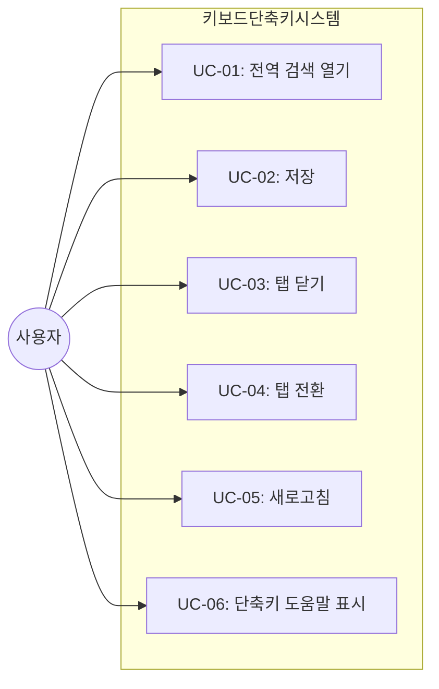
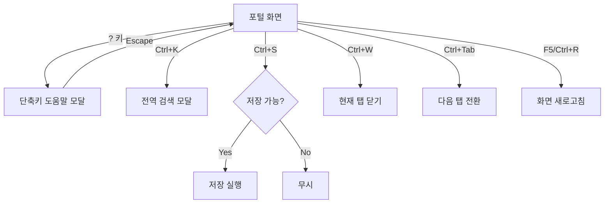

# TSK-05-06 - 키보드 단축키 시스템 설계 문서

## 문서 정보

| 항목 | 내용 |
|------|------|
| Task ID | TSK-05-06 |
| 문서 버전 | 1.0 |
| 작성일 | 2026-01-20 |
| 상태 | 작성중 |
| 카테고리 | development |

---

## 1. 개요

### 1.1 배경 및 문제 정의

**현재 상황:**
- 사용자가 모든 작업을 마우스로만 수행해야 하여 작업 효율이 저하됨
- 키보드 중심 사용자(파워 유저)를 위한 빠른 접근 방법이 없음
- 자주 사용하는 기능(저장, 검색, 탭 전환 등)을 매번 마우스로 클릭해야 함
- 단축키가 있더라도 사용자가 알 수 없어 활용도가 낮음

**해결하려는 문제:**
- 자주 사용하는 기능에 대한 키보드 단축키 제공으로 작업 효율 향상
- 입력 필드에서의 단축키 충돌 방지
- OS별(Windows/Mac) 다른 modifier 키 통합 처리
- 단축키 목록을 쉽게 확인할 수 있는 도움말 제공

### 1.2 목적 및 기대 효과

**목적:**
- 일관된 키보드 단축키 시스템 구축
- 사용자가 키보드만으로 핵심 기능을 수행할 수 있도록 지원
- 단축키 도움말을 통한 사용자 학습 지원

**기대 효과:**
- 사용자: 마우스 의존도 감소, 작업 속도 향상
- 파워 유저: 키보드 중심 워크플로우 가능
- 접근성 향상: 마우스 사용이 어려운 사용자 지원
- 개발 효율성: 중앙 집중화된 단축키 관리로 유지보수 용이

### 1.3 범위

**포함:**
- 전역 단축키 시스템 (useHotkeys 커스텀 훅)
- 단축키 도움말 모달 (HotkeyHelp)
- OS별 modifier 키 자동 감지 및 표시
- 입력 필드 포커스 시 단축키 비활성화 로직

**단축키 목록:**
| 단축키 | 기능 |
|--------|------|
| Ctrl/Cmd + K | 전역 검색 모달 열기 |
| Ctrl/Cmd + S | 저장 |
| Ctrl/Cmd + W | 현재 탭 닫기 |
| Ctrl/Cmd + Tab | 다음 탭으로 전환 |
| Ctrl/Cmd + Shift + Tab | 이전 탭으로 전환 |
| F5 또는 Ctrl/Cmd + R | 새로고침 |
| ? | 단축키 도움말 표시 |

**제외:**
- 개별 화면별 커스텀 단축키 (향후 과제)
- 단축키 커스터마이징 기능 (향후 과제)
- 시퀀스 단축키 (예: gg, dd) (향후 과제)

### 1.4 참조 문서

| 문서 | 경로 | 관련 섹션 |
|------|------|----------|
| PRD | `.orchay/projects/mes-portal/prd.md` | 4.1.1 키보드 및 접근성 |
| TRD | `.orchay/projects/mes-portal/trd.md` | 7. PRD 요구사항 - 접근성/키보드 |

---

## 2. 사용자 분석

### 2.1 대상 사용자

| 사용자 유형 | 특성 | 주요 니즈 |
|------------|------|----------|
| 파워 유저 | 키보드 단축키에 익숙, 빠른 작업 선호 | 마우스 없이 모든 핵심 작업 수행 |
| 일반 사용자 | 단축키를 잘 모름, 마우스 위주 사용 | 단축키 도움말로 학습 기회 제공 |
| 접근성 필요 사용자 | 마우스 사용이 어려움 | 키보드만으로 시스템 조작 |
| 데이터 입력 담당자 | 폼 입력 작업이 많음 | 입력 중 실수로 단축키 실행 방지 |

### 2.2 사용자 페르소나

**페르소나 1: 이파워 (생산 관리자)**
- 역할: 생산 데이터 관리 및 모니터링
- 목표: 여러 화면을 빠르게 오가며 데이터 확인 및 입력
- 불만: 탭 전환, 저장 등을 매번 마우스로 클릭하는 것이 비효율적
- 시나리오: Ctrl+S로 저장, Ctrl+Tab으로 탭 전환하며 빠르게 작업

**페르소나 2: 박신입 (신규 입사자)**
- 역할: 생산 실적 입력 담당
- 목표: 시스템을 빠르게 익히고 효율적으로 사용
- 불만: 어떤 단축키가 있는지 모름
- 시나리오: ? 키를 눌러 도움말을 보고 단축키 학습

**페르소나 3: 김입력 (데이터 입력 담당)**
- 역할: 대량의 데이터 입력 작업
- 목표: 빠르고 정확한 데이터 입력
- 불만: 폼 입력 중 실수로 단축키가 동작하면 곤란
- 시나리오: 입력 필드에서는 단축키가 동작하지 않아 안심하고 타이핑

---

## 3. 유즈케이스

### 3.1 유즈케이스 다이어그램



### 3.2 유즈케이스 상세

#### UC-01: 전역 검색 열기

| 항목 | 내용 |
|------|------|
| 액터 | 로그인한 사용자 |
| 목적 | 키보드로 전역 검색 모달을 빠르게 열기 |
| 사전 조건 | 포털 화면에 접속, 입력 필드에 포커스 없음 |
| 사후 조건 | 전역 검색 모달이 열림 |
| 트리거 | Ctrl+K (Windows) / Cmd+K (Mac) |

**기본 흐름:**
1. 사용자가 Ctrl/Cmd + K를 누른다
2. 시스템이 브라우저 기본 동작을 차단한다
3. 전역 검색 모달이 열린다
4. 검색 입력창에 포커스가 이동한다

**예외 흐름:**
- 1a. 입력 필드에 포커스가 있을 때:
  - 단축키가 동작하지 않음
  - 브라우저 기본 동작도 차단되지 않음

#### UC-02: 저장

| 항목 | 내용 |
|------|------|
| 액터 | 로그인한 사용자 |
| 목적 | 현재 화면의 데이터를 저장 |
| 사전 조건 | 저장 가능한 화면(폼 화면)이 활성화됨 |
| 사후 조건 | 데이터가 저장됨 |
| 트리거 | Ctrl+S (Windows) / Cmd+S (Mac) |

**기본 흐름:**
1. 사용자가 Ctrl/Cmd + S를 누른다
2. 시스템이 브라우저 기본 저장 다이얼로그를 차단한다
3. 현재 활성 화면에 저장 이벤트를 전달한다
4. 화면이 저장 로직을 수행한다
5. 성공/실패 토스트 메시지가 표시된다

**대안 흐름:**
- 3a. 저장할 데이터가 없는 화면인 경우:
  - 아무 동작 없음 (브라우저 기본 동작만 차단)

**예외 흐름:**
- 1a. 입력 필드에 포커스가 있을 때:
  - 입력 필드의 내용과 상관없이 저장 동작 수행 (저장은 예외적으로 동작)

#### UC-03: 탭 닫기

| 항목 | 내용 |
|------|------|
| 액터 | 로그인한 사용자 |
| 목적 | 현재 활성 탭을 닫기 |
| 사전 조건 | 열린 탭이 1개 이상 존재 |
| 사후 조건 | 현재 탭이 닫히고 다른 탭이 활성화됨 |
| 트리거 | Ctrl+W (Windows) / Cmd+W (Mac) |

**기본 흐름:**
1. 사용자가 Ctrl/Cmd + W를 누른다
2. 시스템이 브라우저 탭 닫기를 차단한다
3. 현재 활성 MDI 탭을 닫는다
4. 이전 탭 또는 다음 탭이 활성화된다

**대안 흐름:**
- 3a. 저장하지 않은 변경사항이 있는 경우:
  - 확인 다이얼로그 표시 ("저장하지 않은 내용이 있습니다. 닫으시겠습니까?")
  - 사용자 선택에 따라 닫기 또는 취소

**예외 흐름:**
- 3b. 탭이 1개만 있고 닫기 불가 설정인 경우:
  - 아무 동작 없음 또는 안내 메시지 표시

#### UC-04: 탭 전환

| 항목 | 내용 |
|------|------|
| 액터 | 로그인한 사용자 |
| 목적 | 열린 탭 사이를 빠르게 전환 |
| 사전 조건 | 열린 탭이 2개 이상 존재 |
| 사후 조건 | 다음/이전 탭이 활성화됨 |
| 트리거 | Ctrl+Tab (다음) / Ctrl+Shift+Tab (이전) |

**기본 흐름:**
1. 사용자가 Ctrl + Tab을 누른다
2. 다음 탭이 활성화된다
3. 마지막 탭에서 누르면 첫 번째 탭으로 순환

**대안 흐름:**
- 1a. Ctrl+Shift+Tab을 누르면:
  - 이전 탭이 활성화된다
  - 첫 번째 탭에서 누르면 마지막 탭으로 순환

#### UC-05: 새로고침

| 항목 | 내용 |
|------|------|
| 액터 | 로그인한 사용자 |
| 목적 | 현재 화면의 데이터를 새로고침 |
| 사전 조건 | 활성 화면이 존재 |
| 사후 조건 | 화면 데이터가 갱신됨 |
| 트리거 | F5 또는 Ctrl+R (Windows) / Cmd+R (Mac) |

**기본 흐름:**
1. 사용자가 F5 또는 Ctrl/Cmd + R을 누른다
2. 시스템이 브라우저 전체 새로고침을 차단한다
3. 현재 활성 화면에 새로고침 이벤트를 전달한다
4. 화면이 데이터를 다시 로드한다

#### UC-06: 단축키 도움말 표시

| 항목 | 내용 |
|------|------|
| 액터 | 로그인한 사용자 |
| 목적 | 사용 가능한 단축키 목록 확인 |
| 사전 조건 | 포털 화면에 접속, 입력 필드에 포커스 없음 |
| 사후 조건 | 단축키 도움말 모달이 열림 |
| 트리거 | ? 키 |

**기본 흐름:**
1. 사용자가 ? 키를 누른다
2. 단축키 도움말 모달이 열린다
3. 전체 단축키 목록이 카테고리별로 표시된다
4. Escape 또는 모달 바깥 클릭으로 닫기

**예외 흐름:**
- 1a. 입력 필드에 포커스가 있을 때:
  - 단축키가 동작하지 않음 (? 문자가 입력됨)

---

## 4. 사용자 시나리오

### 4.1 시나리오 1: 파워 유저의 빠른 작업

**상황 설명:**
이파워 관리자가 여러 생산 화면을 오가며 데이터를 확인하고 수정하는 작업을 수행한다.

**단계별 진행:**

| 단계 | 사용자 행동 | 시스템 반응 | 사용자 기대 |
|------|-----------|------------|------------|
| 1 | Ctrl+K 입력 | 전역 검색 모달 열림 | 검색창 포커스 |
| 2 | "생산실적" 검색 후 Enter | 생산실적 화면이 새 탭으로 열림 | 화면 즉시 이동 |
| 3 | 데이터 수정 후 Ctrl+S | 저장 완료 토스트 표시 | 데이터 저장됨 |
| 4 | Ctrl+Tab | 이전 탭으로 전환 | 빠른 탭 전환 |
| 5 | Ctrl+W | 현재 탭 닫힘 | 탭 정리 |

**성공 조건:**
- 마우스 사용 없이 전체 작업 완료
- 각 단축키가 즉각적으로 반응
- 저장 결과에 대한 피드백 확인

### 4.2 시나리오 2: 신규 사용자의 단축키 학습

**상황 설명:**
박신입 사원이 처음 시스템을 사용하며 단축키가 있는지 궁금해한다.

**단계별 진행:**

| 단계 | 사용자 행동 | 시스템 반응 | 사용자 기대 |
|------|-----------|------------|------------|
| 1 | ? 키 입력 | 단축키 도움말 모달 열림 | 단축키 목록 확인 |
| 2 | 도움말 내용 확인 | 카테고리별 단축키 목록 표시 | 단축키 학습 |
| 3 | Escape 입력 | 도움말 모달 닫힘 | 작업 복귀 |
| 4 | 학습한 Ctrl+K 사용 | 전역 검색 열림 | 단축키 동작 확인 |

**성공 조건:**
- 도움말 모달에서 모든 단축키 확인 가능
- OS에 맞는 modifier 키 표시 (Ctrl 또는 Cmd)

### 4.3 시나리오 3: 데이터 입력 중 단축키 충돌 방지

**상황 설명:**
김입력 담당자가 폼에 데이터를 입력하는 중에 실수로 단축키가 동작하지 않아야 한다.

**단계별 진행:**

| 단계 | 사용자 행동 | 시스템 반응 | 사용자 기대 |
|------|-----------|------------|------------|
| 1 | 텍스트 입력 필드에 포커스 | 커서 표시 | 입력 준비 |
| 2 | "What?" 타이핑 (? 포함) | ? 문자가 입력됨 | 도움말 안 열림 |
| 3 | Ctrl+K 입력 | 아무 동작 없음 | 검색 안 열림 |
| 4 | 입력 필드 외부 클릭 | 포커스 해제 | - |
| 5 | ? 키 입력 | 도움말 모달 열림 | 정상 동작 |

**성공 조건:**
- 입력 필드에서는 대부분의 단축키가 동작하지 않음
- Ctrl+S (저장)는 입력 중에도 동작 (예외 케이스)

---

## 5. 화면 설계

### 5.1 화면 흐름도



### 5.2 화면별 상세

#### 화면 1: 단축키 도움말 모달 (HotkeyHelp)

**화면 목적:**
사용자에게 시스템에서 사용 가능한 모든 단축키를 카테고리별로 안내

**진입 경로:**
- ? 키 입력
- 설정 메뉴에서 "단축키 도움말" 클릭 (선택적)

**와이어프레임:**
```
┌─────────────────────────────────────────────────────────┐
│                    (오버레이 배경)                        │
│                                                          │
│    ┌─────────────────────────────────────────────┐      │
│    │  ⌨️ 키보드 단축키                        ✕  │      │
│    ├─────────────────────────────────────────────┤      │
│    │                                              │      │
│    │  일반                                        │      │
│    │  ─────────────────────────────────────────  │      │
│    │  전역 검색             Ctrl + K              │      │
│    │  단축키 도움말         ?                     │      │
│    │                                              │      │
│    │  탭 관리                                     │      │
│    │  ─────────────────────────────────────────  │      │
│    │  탭 닫기               Ctrl + W             │      │
│    │  다음 탭               Ctrl + Tab           │      │
│    │  이전 탭               Ctrl + Shift + Tab   │      │
│    │                                              │      │
│    │  편집                                        │      │
│    │  ─────────────────────────────────────────  │      │
│    │  저장                  Ctrl + S             │      │
│    │  새로고침              F5 / Ctrl + R        │      │
│    │                                              │      │
│    │  💡 입력 필드에서는 단축키가 비활성화됩니다   │      │
│    │                                              │      │
│    └─────────────────────────────────────────────┘      │
│                                                          │
└─────────────────────────────────────────────────────────┘
```

**화면 요소 설명:**

| 영역 | 설명 | 사용자 인터랙션 |
|------|------|----------------|
| 오버레이 배경 | 반투명 어두운 배경 | 클릭 시 모달 닫기 |
| 모달 헤더 | 제목 + 닫기 버튼 | 닫기 버튼 클릭 |
| 카테고리 섹션 | 일반, 탭 관리, 편집 등 | - |
| 단축키 행 | 기능명 + 키 조합 | - |
| 키 조합 표시 | kbd 스타일 뱃지 | - |
| 안내 메시지 | 입력 필드 예외 안내 | - |

**사용자 행동 시나리오:**
1. 사용자가 ? 키를 눌러 모달을 열음
2. 단축키 목록을 카테고리별로 확인
3. OS에 맞게 Ctrl 또는 Cmd로 표시됨 (Mac에서는 Cmd)
4. Escape 또는 닫기 버튼으로 모달 닫기

### 5.3 키 조합 표시 스타일

**kbd 스타일 가이드:**
```
┌───────────────────────────────────┐
│  단축키 표시 예시                   │
├───────────────────────────────────┤
│                                    │
│   [Ctrl] + [K]      ← Windows     │
│   [Cmd] + [K]       ← Mac         │
│                                    │
│   [Ctrl] + [Shift] + [Tab]        │
│                                    │
│   [F5]              ← 단일 키     │
│   [?]               ← 특수 문자    │
│                                    │
└───────────────────────────────────┘

스타일:
- 배경: 회색 계열 (#f5f5f5 / 다크모드: #3a3a3a)
- 테두리: 1px solid 회색 계열
- 둥근 모서리: 4px
- 패딩: 2px 8px
- 폰트: monospace
- + 기호: 일반 텍스트, 양쪽 여백
```

### 5.4 반응형 동작

| 화면 크기 | 레이아웃 변화 | 사용자 경험 |
|----------|--------------|------------|
| 데스크톱 (1024px+) | 모달 너비 450px, 중앙 정렬 | 최적의 가독성 |
| 태블릿 (768-1023px) | 모달 너비 90%, 중앙 정렬 | 동일한 UX |
| 모바일 (767px-) | 모달 너비 100%, 하단 정렬 | 터치 친화적 |

---

## 6. 인터랙션 설계

### 6.1 사용자 액션과 피드백

| 사용자 액션 | 즉각 피드백 | 결과 피드백 | 에러 피드백 |
|------------|-----------|------------|------------|
| ? 키 입력 | 모달 즉시 표시 (fade-in) | - | - |
| Ctrl+K 입력 | 검색 모달 열림 | - | - |
| Ctrl+S 입력 | - | 저장 완료 토스트 | 저장 실패 에러 토스트 |
| Ctrl+W 입력 | 탭 닫힘 애니메이션 | - | 변경사항 확인 다이얼로그 |
| Ctrl+Tab 입력 | 탭 전환 (즉시) | 새 탭 활성화 | - |
| F5/Ctrl+R 입력 | 로딩 표시 | 데이터 갱신 | 갱신 실패 에러 |

### 6.2 상태별 동작 분기

| 상태 | 단축키 동작 | 비고 |
|------|------------|------|
| 입력 필드 포커스 | 대부분 비활성화 | Ctrl+S는 예외적으로 동작 |
| 모달이 열린 상태 | 모달 단축키만 동작 | Escape로 닫기 |
| 드롭다운/팝오버 열린 상태 | Escape로 닫기 | 전역 단축키 비활성화 |
| 확인 다이얼로그 표시 중 | Enter/Escape만 동작 | 다이얼로그 제어 |

### 6.3 키보드/접근성

| 기능 | 키보드 단축키 | 스크린 리더 안내 |
|------|-------------|-----------------|
| 도움말 모달 열기 | ? | "키보드 단축키 도움말 열기" |
| 도움말 모달 닫기 | Escape | "단축키 도움말 닫기" |
| 전역 검색 | Ctrl/Cmd + K | "전역 검색 열기" |
| 저장 | Ctrl/Cmd + S | "저장" |
| 탭 닫기 | Ctrl/Cmd + W | "현재 탭 닫기" |

---

## 7. 데이터 요구사항

### 7.1 필요한 데이터

| 데이터 | 설명 | 출처 | 용도 |
|--------|------|------|------|
| OS 정보 | Windows/Mac 구분 | navigator.platform | modifier 키 표시 |
| 활성 탭 정보 | 현재 열린 탭 목록 | MDI Context | 탭 전환/닫기 |
| 현재 화면 상태 | 저장 가능 여부, 변경사항 | 화면 컴포넌트 | 저장/닫기 로직 |
| 포커스 상태 | 입력 필드 포커스 여부 | document.activeElement | 단축키 활성화 판단 |

### 7.2 단축키 정의 데이터 구조

```typescript
interface HotkeyDefinition {
  id: string;                  // 고유 식별자
  key: string;                 // 키 조합 (hotkeys-js 형식)
  keyMac?: string;             // Mac용 키 조합 (선택적)
  description: string;         // 설명
  category: HotkeyCategory;    // 카테고리
  handler: () => void;         // 실행 함수
  enableOnInput?: boolean;     // 입력 필드에서 활성화 여부 (기본: false)
  enableInModal?: boolean;     // 모달에서 활성화 여부 (기본: false)
}

type HotkeyCategory = 'general' | 'tab' | 'edit';

interface HotkeyGroup {
  category: HotkeyCategory;
  label: string;              // 표시용 레이블
  hotkeys: HotkeyDefinition[];
}
```

### 7.3 단축키 목록 데이터

```typescript
const HOTKEY_GROUPS: HotkeyGroup[] = [
  {
    category: 'general',
    label: '일반',
    hotkeys: [
      {
        id: 'global-search',
        key: 'ctrl+k',
        keyMac: 'meta+k',
        description: '전역 검색',
        category: 'general',
        handler: () => { /* openGlobalSearch() */ },
      },
      {
        id: 'help',
        key: '?',
        description: '단축키 도움말',
        category: 'general',
        handler: () => { /* openHotkeyHelp() */ },
      },
    ],
  },
  {
    category: 'tab',
    label: '탭 관리',
    hotkeys: [
      {
        id: 'close-tab',
        key: 'ctrl+w',
        keyMac: 'meta+w',
        description: '탭 닫기',
        category: 'tab',
        handler: () => { /* closeCurrentTab() */ },
      },
      {
        id: 'next-tab',
        key: 'ctrl+tab',
        description: '다음 탭',
        category: 'tab',
        handler: () => { /* switchToNextTab() */ },
      },
      {
        id: 'prev-tab',
        key: 'ctrl+shift+tab',
        description: '이전 탭',
        category: 'tab',
        handler: () => { /* switchToPrevTab() */ },
      },
    ],
  },
  {
    category: 'edit',
    label: '편집',
    hotkeys: [
      {
        id: 'save',
        key: 'ctrl+s',
        keyMac: 'meta+s',
        description: '저장',
        category: 'edit',
        handler: () => { /* saveCurrentScreen() */ },
        enableOnInput: true,  // 입력 중에도 동작
      },
      {
        id: 'refresh',
        key: 'f5,ctrl+r',
        keyMac: 'f5,meta+r',
        description: '새로고침',
        category: 'edit',
        handler: () => { /* refreshCurrentScreen() */ },
      },
    ],
  },
];
```

---

## 8. 비즈니스 규칙

### 8.1 핵심 규칙

| 규칙 ID | 규칙 설명 | 적용 상황 | 예외 |
|---------|----------|----------|------|
| BR-01 | 입력 필드 포커스 시 단축키 비활성화 | 모든 텍스트 입력 상황 | Ctrl+S (저장)는 동작 |
| BR-02 | 브라우저 기본 동작 차단 | Ctrl+S, Ctrl+W, F5 등 | 차단 실패 시 무시 |
| BR-03 | OS별 modifier 키 자동 감지 | 항상 | Mac은 Cmd, 그 외는 Ctrl |
| BR-04 | 모달 열린 상태에서 전역 단축키 비활성화 | 모달 표시 중 | Escape는 모달 닫기로 동작 |
| BR-05 | 탭 닫기 시 변경사항 확인 | 저장하지 않은 변경사항 있을 때 | 사용자 확인 후 진행 |

### 8.2 규칙 상세 설명

**BR-01: 입력 필드 포커스 시 단축키 비활성화**

설명: 사용자가 텍스트를 입력하는 중에는 대부분의 단축키가 동작하지 않아야 합니다. 이는 타이핑 중 실수로 단축키가 실행되는 것을 방지합니다.

예시:
- input, textarea에 포커스 → ? 키 입력 시 ? 문자가 입력됨 (도움말 안 열림)
- contenteditable 요소에 포커스 → Ctrl+K가 동작하지 않음

예외:
- Ctrl+S (저장)는 폼 입력 중에도 동작하여 데이터 손실 방지
- Escape는 입력 취소 또는 드롭다운 닫기로 동작 가능

**BR-02: 브라우저 기본 동작 차단**

설명: 일부 단축키는 브라우저 기본 동작이 있어 이를 차단해야 합니다.

| 단축키 | 브라우저 기본 동작 | 포털 동작 |
|--------|------------------|----------|
| Ctrl+S | 페이지 저장 다이얼로그 | 데이터 저장 |
| Ctrl+W | 브라우저 탭 닫기 | MDI 탭 닫기 |
| F5 | 페이지 전체 새로고침 | 화면 데이터 새로고침 |
| Ctrl+K | Chrome 주소창 포커스 | 전역 검색 열기 |

**BR-03: OS별 modifier 키 자동 감지**

설명: Mac 사용자에게는 Cmd 키로, Windows/Linux 사용자에게는 Ctrl 키로 표시하고 동작합니다.

감지 방법:
```typescript
const isMac = navigator.platform.toUpperCase().indexOf('MAC') >= 0;
const modKey = isMac ? 'Cmd' : 'Ctrl';
```

**BR-04: 모달 열린 상태에서 전역 단축키 비활성화**

설명: 모달이 열려있을 때는 모달 내부 조작 단축키만 동작해야 합니다.

예시:
- 검색 모달 열림 → Ctrl+K 눌러도 새 검색 모달 안 열림
- 도움말 모달 열림 → Escape만 동작 (모달 닫기)

---

## 9. 에러 처리

### 9.1 예상 에러 상황

| 상황 | 원인 | 사용자 메시지 | 복구 방법 |
|------|------|--------------|----------|
| 저장 실패 | 네트워크 오류, 서버 에러 | "저장에 실패했습니다" | 재시도 안내 |
| 탭 닫기 실패 | 내부 오류 | - | 수동으로 닫기 버튼 클릭 |
| 단축키 충돌 | 브라우저 확장 프로그램 | - | 확장 프로그램 설정 변경 안내 |
| 새로고침 실패 | 네트워크 오류 | "데이터를 불러오지 못했습니다" | 재시도 버튼 |

### 9.2 에러 표시 방식

| 에러 유형 | 표시 위치 | 표시 방법 |
|----------|----------|----------|
| 저장 실패 | 화면 우측 상단 | 에러 토스트 |
| 새로고침 실패 | 화면 중앙 | 에러 상태 컴포넌트 |
| 확인 필요 | 화면 중앙 | 확인 다이얼로그 |

---

## 10. 연관 문서

> 상세 테스트 명세 및 요구사항 추적은 별도 문서에서 관리합니다.

| 문서 | 경로 | 용도 |
|------|------|------|
| 요구사항 추적 매트릭스 | `025-traceability-matrix.md` | PRD → 설계 → 테스트 양방향 추적 |
| 테스트 명세서 | `026-test-specification.md` | 단위/E2E/매뉴얼 테스트 상세 정의 |

---

## 11. 구현 범위

### 11.1 파일 구조

```
lib/
├── hooks/
│   ├── useHotkeys.ts          # 단축키 커스텀 훅
│   └── useHotkeyHelp.ts       # 도움말 모달 상태 훅
├── hotkeys/
│   ├── index.ts               # 단축키 시스템 진입점
│   ├── definitions.ts         # 단축키 정의 데이터
│   ├── types.ts               # 타입 정의
│   └── utils.ts               # 유틸리티 (OS 감지 등)
components/
├── common/
│   ├── HotkeyHelp.tsx         # 도움말 모달 컴포넌트
│   └── KeyboardShortcut.tsx   # 키 조합 표시 컴포넌트
```

### 11.2 영향받는 영역

| 영역 | 변경 내용 | 영향도 |
|------|----------|--------|
| lib/hooks/useHotkeys.ts | 신규 훅 생성 | 높음 |
| components/common/HotkeyHelp.tsx | 신규 컴포넌트 생성 | 높음 |
| components/layout/PortalLayout.tsx | 전역 단축키 등록 | 중간 |
| lib/mdi/context.tsx | 탭 닫기/전환 함수 연결 | 낮음 |

### 11.3 의존성

| 의존 항목 | 이유 | 상태 |
|----------|------|------|
| TSK-00-02 UI 라이브러리 설정 | Ant Design Modal 사용 | 완료 |
| react-hotkeys-hook | 키보드 이벤트 처리 | TRD에 명시됨 |
| TSK-02-01 MDI 상태 관리 | 탭 전환/닫기 기능 | 의존 |
| TSK-01-05 전역 검색 모달 | Ctrl+K 연동 | 의존 |

### 11.4 사용할 Ant Design 컴포넌트

| 컴포넌트 | 용도 |
|----------|------|
| Modal | 도움말 모달 |
| Typography | 제목, 설명 텍스트 |
| Space | 키 조합 간격 |
| Tag | kbd 스타일 키 표시 |
| Divider | 카테고리 구분선 |

### 11.5 사용할 외부 라이브러리

| 라이브러리 | 버전 | 용도 |
|-----------|------|------|
| react-hotkeys-hook | ^4.x | 키보드 단축키 처리 |

### 11.6 제약 사항

| 제약 | 설명 | 대응 방안 |
|------|------|----------|
| 브라우저 단축키 충돌 | 일부 단축키는 브라우저가 가로챔 | preventDefault 사용 |
| 확장 프로그램 충돌 | 일부 확장 프로그램이 단축키 가로챔 | 사용자 안내 문서 제공 |
| Ctrl+Tab 제한 | 일부 브라우저에서 제어 불가 | 대체 단축키 제공 검토 |

---

## 12. 체크리스트

### 12.1 설계 완료 확인

- [x] 문제 정의 및 목적 명확화
- [x] 사용자 분석 완료
- [x] 유즈케이스 정의 완료
- [x] 사용자 시나리오 작성 완료
- [x] 화면 설계 완료 (와이어프레임)
- [x] 인터랙션 설계 완료
- [x] 데이터 요구사항 정의 완료
- [x] 비즈니스 규칙 정의 완료
- [x] 에러 처리 정의 완료

### 12.2 연관 문서 작성

- [ ] 요구사항 추적 매트릭스 작성 (→ `025-traceability-matrix.md`)
- [ ] 테스트 명세서 작성 (→ `026-test-specification.md`)

### 12.3 구현 준비

- [x] 구현 우선순위 결정
- [x] 의존성 확인 완료
- [x] 제약 사항 검토 완료

---

## 변경 이력

| 버전 | 일자 | 작성자 | 변경 내용 |
|------|------|--------|----------|
| 1.0 | 2026-01-20 | Claude | 최초 작성 |
