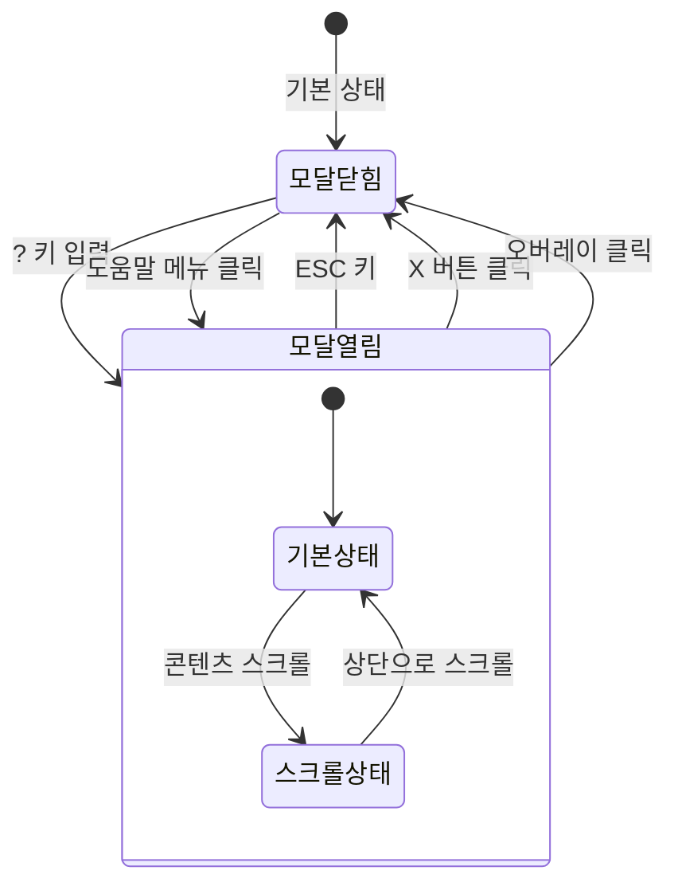
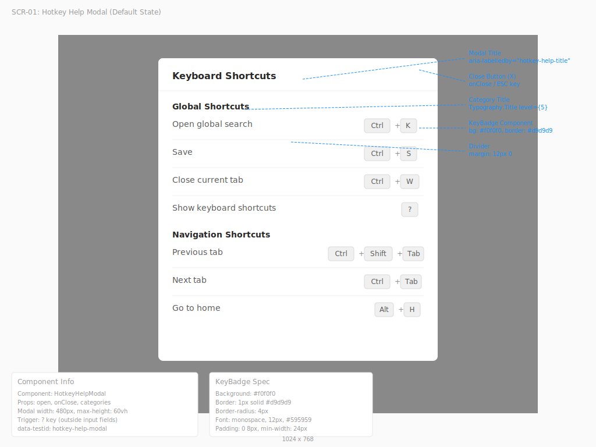
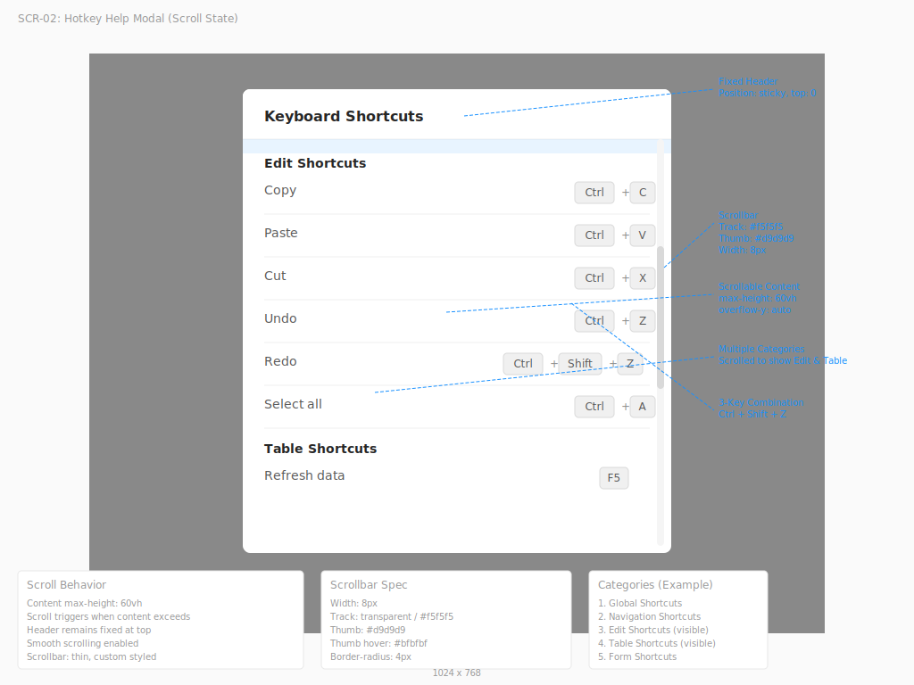

# TSK-05-06 - 키보드 단축키 시스템 UI 설계

**Version:** 1.0 — **Last Updated:** 2026-01-20

> **목적**: 키보드 단축키 도움말 모달 및 단축키 배지 컴포넌트 UI 설계

---

## 1. 화면 목록

| 화면 ID | 화면명 | 목적 | SVG 참조 |
|---------|--------|------|----------|
| SCR-01 | 단축키 도움말 모달 (기본 상태) | ? 키 입력 시 단축키 목록 모달 표시 | `screen-01-hotkey-help-modal.svg` |
| SCR-02 | 단축키 도움말 모달 (스크롤 상태) | 단축키 목록이 많을 때 스크롤 표시 | `screen-02-hotkey-help-scroll.svg` |

---

## 2. 화면 전환 흐름

### 2.1 상태 다이어그램



### 2.2 액션-화면 매트릭스

| 액션 | 현재 상태 | 결과 상태 | 트리거 |
|------|----------|----------|--------|
| ? 키 입력 | 모달닫힘 | 모달열림 | 사용자 (입력 필드 외) |
| ESC 키 | 모달열림 | 모달닫힘 | 사용자 |
| X 버튼 클릭 | 모달열림 | 모달닫힘 | 사용자 |
| 오버레이 클릭 | 모달열림 | 모달닫힘 | 사용자 |
| 스크롤 | 기본상태 | 스크롤상태 | 사용자 |
| 상단으로 스크롤 | 스크롤상태 | 기본상태 | 사용자 |

---

## 3. 화면별 상세

### 3.1 SCR-01: 단축키 도움말 모달 (기본 상태)

**화면 목적**: 사용 가능한 키보드 단축키를 카테고리별로 그룹화하여 표시

**레이아웃 구조**:
```
┌─────────────────────────────────────────────────────────────────────────┐
│  ◇ 배경 오버레이 (rgba(0,0,0,0.45))                                      │
│  ┌───────────────────────────────────────────────────────────────────┐  │
│  │  단축키 도움말                                              [X]   │  │ ← 모달 헤더
│  ├───────────────────────────────────────────────────────────────────┤  │
│  │                                                                   │  │
│  │  전역 단축키                                                       │  │ ← 카테고리 제목
│  │  ─────────────────────────────────────────────────────────────    │  │
│  │  전역 검색 열기                              ┌──────┐ + ┌───┐     │  │
│  │                                             │ Ctrl │   │ K │     │  │ ← 단축키 배지
│  │                                             └──────┘   └───┘     │  │
│  │  ─────────────────────────────────────────────────────────────    │  │
│  │  저장하기                                    ┌──────┐ + ┌───┐     │  │
│  │                                             │ Ctrl │   │ S │     │  │
│  │                                             └──────┘   └───┘     │  │
│  │  ─────────────────────────────────────────────────────────────    │  │
│  │  현재 탭 닫기                                ┌──────┐ + ┌───┐     │  │
│  │                                             │ Ctrl │   │ W │     │  │
│  │                                             └──────┘   └───┘     │  │
│  │  ─────────────────────────────────────────────────────────────    │  │
│  │  단축키 도움말                               ┌───┐                 │  │
│  │                                             │ ? │                 │  │
│  │                                             └───┘                 │  │
│  │                                                                   │  │
│  │  탐색 단축키                                                       │  │ ← 카테고리 제목
│  │  ─────────────────────────────────────────────────────────────    │  │
│  │  이전 탭으로 이동                            ┌──────┐ + ┌─────┐   │  │
│  │                                             │ Ctrl │   │ Tab │   │  │
│  │                                             └──────┘   └─────┘   │  │
│  │  ─────────────────────────────────────────────────────────────    │  │
│  │  다음 탭으로 이동                    ┌──────┐ + ┌───────┐ + ┌─────┐│  │
│  │                                     │ Ctrl │   │ Shift │   │ Tab ││  │
│  │                                     └──────┘   └───────┘   └─────┘│  │
│  │                                                                   │  │
│  └───────────────────────────────────────────────────────────────────┘  │
└─────────────────────────────────────────────────────────────────────────┘
```

**컴포넌트 구성**:

| 영역 | 컴포넌트 | Props | 비고 |
|------|----------|-------|------|
| Container | `Modal` | `open, title, footer=null, width=480` | Ant Design |
| Header | `Modal.Header` | `closable=true` | X 버튼 포함 |
| Content | `div` | `style={{ maxHeight: '60vh', overflowY: 'auto' }}` | 스크롤 영역 |
| Category | `Typography.Title` | `level={5}` | 카테고리 제목 |
| Divider | `Divider` | `style={{ margin: '12px 0' }}` | 항목 구분선 |
| Item | `HotkeyItem` | `label, keys` | 커스텀 컴포넌트 |
| KeyBadge | `KeyBadge` | `keys, separator="+"` | 단축키 배지 |

**상태 관리**:
```typescript
interface HotkeyHelpModalState {
  isOpen: boolean;
}
```

**사용자 액션**:

| 액션 | 이벤트 | 핸들러 |
|------|--------|--------|
| ? 키 입력 | onKeyDown | `openModal()` |
| ESC 키 입력 | onCancel | `closeModal()` |
| X 버튼 클릭 | onCancel | `closeModal()` |
| 오버레이 클릭 | onCancel | `closeModal()` |

**스타일 토큰**:
```css
.hotkey-help-modal {
  /* 모달 크기 */
  --modal-width: 480px;
  --modal-max-height: 60vh;

  /* 패딩 */
  --content-padding: 24px;
  --item-padding: 12px 0;

  /* 색상 */
  --category-color: var(--color-text-primary);
  --label-color: var(--color-text-secondary);
  --divider-color: var(--color-border);
}

.hotkey-help-modal .ant-modal-body {
  max-height: var(--modal-max-height);
  overflow-y: auto;
  padding: var(--content-padding);
}

.hotkey-item {
  display: flex;
  justify-content: space-between;
  align-items: center;
  padding: var(--item-padding);
}

.hotkey-item-label {
  color: var(--label-color);
  font-size: 14px;
}
```

---

### 3.2 SCR-02: 단축키 도움말 모달 (스크롤 상태)

**화면 목적**: 단축키 목록이 많을 때 스크롤하여 전체 목록 확인

**레이아웃 구조**:
```
┌─────────────────────────────────────────────────────────────────────────┐
│  ◇ 배경 오버레이 (rgba(0,0,0,0.45))                                      │
│  ┌───────────────────────────────────────────────────────────────────┐  │
│  │  단축키 도움말                                              [X]   │  │ ← 모달 헤더 (고정)
│  ├───────────────────────────────────────────────────────────────────┤  │
│  │  ┌────────────────────────────────────────────────────────────┐▲  │  │ ← 스크롤바
│  │  │  편집 단축키                                                │█  │  │
│  │  │  ─────────────────────────────────────────────────────────  │█  │  │
│  │  │  복사                                    ┌──────┐ + ┌───┐   │█  │  │
│  │  │                                         │ Ctrl │   │ C │   │█  │  │
│  │  │                                         └──────┘   └───┘   │█  │  │
│  │  │  ─────────────────────────────────────────────────────────  │█  │  │
│  │  │  붙여넣기                                ┌──────┐ + ┌───┐   │█  │  │
│  │  │                                         │ Ctrl │   │ V │   │   │  │
│  │  │                                         └──────┘   └───┘   │   │  │
│  │  │  ─────────────────────────────────────────────────────────  │   │  │
│  │  │  실행 취소                               ┌──────┐ + ┌───┐   │   │  │
│  │  │                                         │ Ctrl │   │ Z │   │   │  │
│  │  │                                         └──────┘   └───┘   │   │  │
│  │  │  ─────────────────────────────────────────────────────────  │   │  │
│  │  │  다시 실행                       ┌──────┐ + ┌───────┐ + ┌───┐│   │  │
│  │  │                                 │ Ctrl │   │ Shift │   │ Z ││   │  │
│  │  │                                 └──────┘   └───────┘   └───┘│▼  │  │
│  │  └────────────────────────────────────────────────────────────┘   │  │
│  └───────────────────────────────────────────────────────────────────┘  │
└─────────────────────────────────────────────────────────────────────────┘
```

**스크롤 동작**:
- `max-height: 60vh` 초과 시 세로 스크롤바 표시
- 헤더(제목 + 닫기 버튼)는 고정
- 콘텐츠 영역만 스크롤

**스크롤 관련 스타일**:
```css
.hotkey-help-modal .ant-modal-body {
  max-height: 60vh;
  overflow-y: auto;
  scrollbar-width: thin;
  scrollbar-color: #d9d9d9 transparent;
}

.hotkey-help-modal .ant-modal-body::-webkit-scrollbar {
  width: 8px;
}

.hotkey-help-modal .ant-modal-body::-webkit-scrollbar-track {
  background: transparent;
}

.hotkey-help-modal .ant-modal-body::-webkit-scrollbar-thumb {
  background-color: #d9d9d9;
  border-radius: 4px;
}

.hotkey-help-modal .ant-modal-body::-webkit-scrollbar-thumb:hover {
  background-color: #bfbfbf;
}
```

---

## 4. 공통 컴포넌트

### 4.1 KeyBadge (단축키 배지)

**목적**: 개별 키 또는 키 조합을 시각적으로 표시

**레이아웃**:
```
단일 키:    ┌───┐
            │ K │
            └───┘

키 조합:    ┌──────┐     ┌───┐
            │ Ctrl │  +  │ K │
            └──────┘     └───┘

3키 조합:   ┌──────┐     ┌───────┐     ┌───┐
            │ Ctrl │  +  │ Shift │  +  │ K │
            └──────┘     └───────┘     └───┘
```

**컴포넌트 Props**:
```typescript
interface KeyBadgeProps {
  keys: string[];           // 키 배열 (예: ['Ctrl', 'K'])
  separator?: string;       // 구분자 (기본: '+')
  size?: 'small' | 'default' | 'large';  // 크기
  platform?: 'auto' | 'mac' | 'windows'; // OS 자동 감지 또는 수동 지정
}

// 플랫폼별 modifier 키 매핑
const MODIFIER_MAP = {
  mac: {
    Ctrl: '\u2318',    // Command (⌘)
    Alt: '\u2325',     // Option (⌥)
    Shift: '\u21E7',   // Shift (⇧)
    Meta: '\u2318',    // Command (⌘)
  },
  windows: {
    Ctrl: 'Ctrl',
    Alt: 'Alt',
    Shift: 'Shift',
    Meta: 'Win',
  }
};
```

**스타일**:
```css
.key-badge {
  display: inline-flex;
  align-items: center;
  gap: 4px;
}

.key-badge-item {
  display: inline-flex;
  align-items: center;
  justify-content: center;
  min-width: 24px;
  height: 24px;
  padding: 0 8px;
  font-family: 'SFMono-Regular', Consolas, 'Liberation Mono', Menlo, monospace;
  font-size: 12px;
  font-weight: 500;
  color: #595959;
  background-color: #f0f0f0;
  border: 1px solid #d9d9d9;
  border-radius: 4px;
  box-shadow: 0 2px 0 rgba(0, 0, 0, 0.02);
}

.key-badge-separator {
  color: #8c8c8c;
  font-size: 12px;
  margin: 0 2px;
}

/* 크기 변형 */
.key-badge-item--small {
  min-width: 20px;
  height: 20px;
  padding: 0 6px;
  font-size: 11px;
}

.key-badge-item--large {
  min-width: 28px;
  height: 28px;
  padding: 0 10px;
  font-size: 14px;
}

/* 다크 모드 */
.dark .key-badge-item {
  color: #d9d9d9;
  background-color: #262626;
  border-color: #434343;
}
```

### 4.2 HotkeyItem (단축키 항목)

**목적**: 단축키 설명과 키 배지를 한 줄에 표시

**레이아웃**:
```
┌─────────────────────────────────────────────────────────────────────┐
│  전역 검색 열기                              ┌──────┐ + ┌───┐       │
│                                             │ Ctrl │   │ K │       │
│                                             └──────┘   └───┘       │
└─────────────────────────────────────────────────────────────────────┘
```

**컴포넌트 Props**:
```typescript
interface HotkeyItemProps {
  label: string;            // 설명 텍스트
  keys: string[];           // 단축키 배열
  description?: string;     // 추가 설명 (선택)
  disabled?: boolean;       // 비활성화 상태
}
```

**스타일**:
```css
.hotkey-item {
  display: flex;
  justify-content: space-between;
  align-items: center;
  padding: 12px 0;
}

.hotkey-item-label {
  flex: 1;
  color: var(--color-text-secondary);
  font-size: 14px;
  line-height: 1.5;
}

.hotkey-item-label--disabled {
  color: var(--color-text-disabled);
}

.hotkey-item-keys {
  flex-shrink: 0;
  margin-left: 16px;
}
```

### 4.3 HotkeyHelpModal (도움말 모달)

**목적**: 전체 단축키 목록을 카테고리별로 그룹화하여 표시

**컴포넌트 Props**:
```typescript
interface HotkeyCategory {
  id: string;
  title: string;
  items: Array<{
    label: string;
    keys: string[];
    description?: string;
  }>;
}

interface HotkeyHelpModalProps {
  open: boolean;
  onClose: () => void;
  categories?: HotkeyCategory[];  // 커스텀 카테고리 (선택)
}

// 기본 카테고리 데이터
const DEFAULT_HOTKEY_CATEGORIES: HotkeyCategory[] = [
  {
    id: 'global',
    title: '전역 단축키',
    items: [
      { label: '전역 검색 열기', keys: ['Ctrl', 'K'] },
      { label: '저장하기', keys: ['Ctrl', 'S'] },
      { label: '현재 탭 닫기', keys: ['Ctrl', 'W'] },
      { label: '단축키 도움말', keys: ['?'] },
    ],
  },
  {
    id: 'navigation',
    title: '탐색 단축키',
    items: [
      { label: '이전 탭으로 이동', keys: ['Ctrl', 'Shift', 'Tab'] },
      { label: '다음 탭으로 이동', keys: ['Ctrl', 'Tab'] },
      { label: '홈으로 이동', keys: ['Alt', 'H'] },
    ],
  },
  {
    id: 'edit',
    title: '편집 단축키',
    items: [
      { label: '복사', keys: ['Ctrl', 'C'] },
      { label: '붙여넣기', keys: ['Ctrl', 'V'] },
      { label: '실행 취소', keys: ['Ctrl', 'Z'] },
      { label: '다시 실행', keys: ['Ctrl', 'Shift', 'Z'] },
    ],
  },
];
```

---

## 5. 반응형 설계

### 5.1 Breakpoint별 레이아웃

| Breakpoint | 너비 범위 | 모달 너비 | 레이아웃 조정 |
|------------|----------|----------|--------------|
| Desktop | 1024px+ | 480px | 기본 레이아웃 |
| Tablet | 768-1023px | 480px | 기본 레이아웃 유지 |
| Mobile | 0-767px | 100% - 32px | 전체 너비, 좌우 여백 16px |

### 5.2 반응형 스타일

```css
/* Desktop & Tablet: 고정 너비 */
@media (min-width: 768px) {
  .hotkey-help-modal .ant-modal {
    width: 480px !important;
  }
}

/* Mobile: 전체 너비 */
@media (max-width: 767px) {
  .hotkey-help-modal .ant-modal {
    width: calc(100% - 32px) !important;
    max-width: 480px;
    margin: 16px;
  }

  .hotkey-help-modal .ant-modal-body {
    max-height: 70vh;  /* 모바일에서 더 많은 공간 */
    padding: 16px;
  }

  .hotkey-item {
    flex-direction: column;
    align-items: flex-start;
    gap: 8px;
  }

  .hotkey-item-keys {
    margin-left: 0;
  }
}
```

### 5.3 터치 디바이스 고려사항

- 모바일에서는 단축키 기능 대부분 미적용
- 도움말 모달은 메뉴에서 접근 가능하도록 제공
- 터치 디바이스 감지 시 안내 문구 표시:
  ```
  "터치 디바이스에서는 일부 단축키가 지원되지 않을 수 있습니다."
  ```

---

## 6. 접근성

### 6.1 키보드 네비게이션

| 키 | 동작 |
|----|------|
| ? | 도움말 모달 열기 (입력 필드 외부) |
| Escape | 모달 닫기 |
| Tab | 닫기 버튼으로 포커스 이동 |
| Enter | 포커스된 버튼 활성화 |

### 6.2 ARIA 속성

| 요소 | ARIA 속성 | 값 |
|------|----------|-----|
| Modal | `role` | `dialog` |
| Modal | `aria-modal` | `true` |
| Modal | `aria-labelledby` | `hotkey-help-title` |
| Modal Title | `id` | `hotkey-help-title` |
| Close Button | `aria-label` | `닫기` |
| Category Title | `role` | `heading` |
| Category Title | `aria-level` | `2` |
| Hotkey List | `role` | `list` |
| Hotkey Item | `role` | `listitem` |
| Key Badge | `role` | `img` |
| Key Badge | `aria-label` | 키 조합 설명 (예: "Control + K") |

### 6.3 스크린 리더 안내

```typescript
// 모달 열림 시 안내
<Modal
  role="dialog"
  aria-modal="true"
  aria-labelledby="hotkey-help-title"
>
  <h2 id="hotkey-help-title">키보드 단축키 도움말</h2>
  {/* ... */}
</Modal>

// 키 배지 접근성
<span
  className="key-badge"
  role="img"
  aria-label="Control 키와 K 키를 함께 누르세요"
>
  <span className="key-badge-item">Ctrl</span>
  <span className="key-badge-separator" aria-hidden="true">+</span>
  <span className="key-badge-item">K</span>
</span>
```

### 6.4 색상 대비

| 요소 | 전경색 | 배경색 | 대비율 | WCAG |
|------|--------|--------|--------|------|
| 카테고리 제목 | #262626 | #ffffff | 14.6:1 | AAA |
| 항목 라벨 | #595959 | #ffffff | 7.0:1 | AA |
| 키 배지 텍스트 | #595959 | #f0f0f0 | 5.3:1 | AA |
| 키 배지 테두리 | #d9d9d9 | #f0f0f0 | 1.3:1 | - |

### 6.5 포커스 관리

```typescript
// 모달 열릴 때 제목으로 포커스 이동
useEffect(() => {
  if (open) {
    const title = document.getElementById('hotkey-help-title');
    title?.focus();
  }
}, [open]);

// 모달 닫힐 때 이전 포커스 복원
const [previousFocus, setPreviousFocus] = useState<HTMLElement | null>(null);

useEffect(() => {
  if (open) {
    setPreviousFocus(document.activeElement as HTMLElement);
  } else if (previousFocus) {
    previousFocus.focus();
  }
}, [open]);
```

---

## 7. SVG 파일 목록

| 파일명 | 설명 | 뷰박스 |
|--------|------|--------|
| `screen-01-hotkey-help-modal.svg` | 단축키 도움말 모달 (기본 상태) | 1024x768 |
| `screen-02-hotkey-help-scroll.svg` | 단축키 도움말 모달 (스크롤 상태) | 1024x768 |

### 7.1 SVG 미리보기

#### SCR-01: 단축키 도움말 모달 (기본 상태)


#### SCR-02: 단축키 도움말 모달 (스크롤 상태)


---

## 관련 문서

- PRD: `../../../prd.md`
- TRD: `../../../trd.md`
- 디자인 시스템: `../../design-system.md`
- 기술 설계: `010-tech-design.md`
