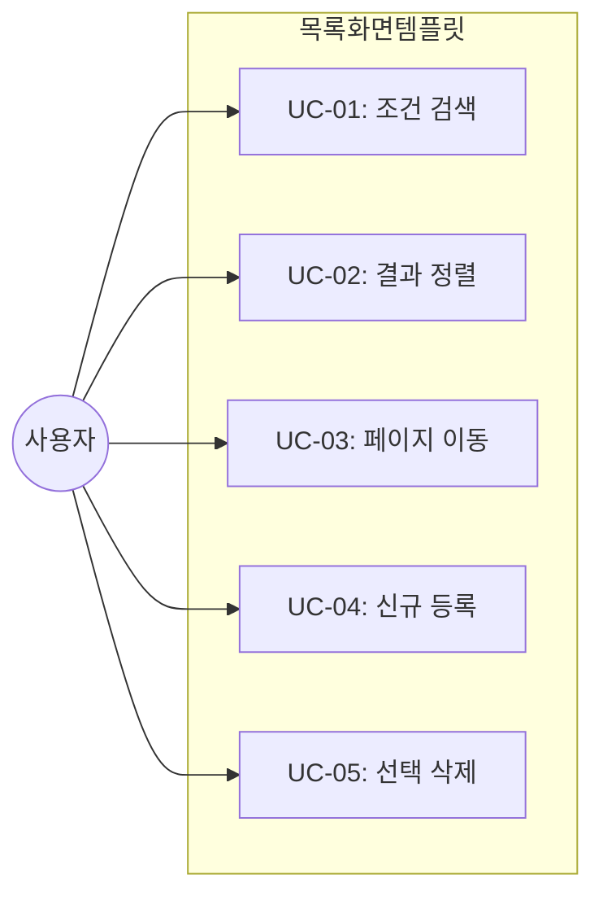
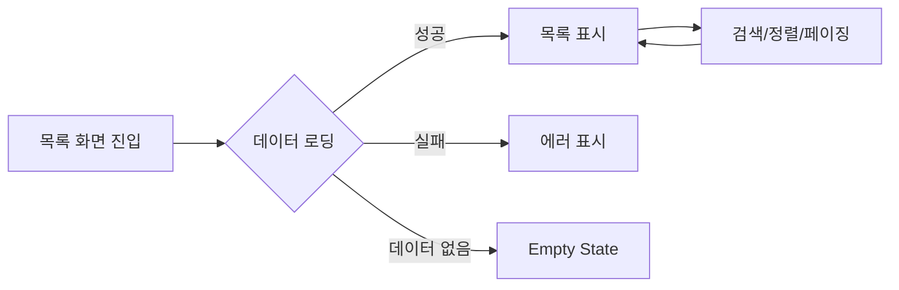

# TSK-06-01 - 목록(조회) 화면 템플릿 설계 문서

## 문서 정보

| 항목 | 내용 |
|------|------|
| Task ID | TSK-06-01 |
| 문서 버전 | 1.0 |
| 작성일 | 2026-01-20 |
| 상태 | 작성중 |
| 카테고리 | development |

---

## 1. 개요

### 1.1 배경 및 문제 정의

**현재 상황:**
- MES Portal에서 데이터 목록을 조회하는 화면이 여러 곳에서 필요함
- 각 화면마다 검색 조건, 그리드, 버튼 영역을 반복 구현해야 함
- 일관된 UX 패턴 없이 개별 구현 시 품질 편차 발생

**해결하려는 문제:**
- 목록(조회) 화면의 표준 템플릿 부재로 인한 개발 생산성 저하
- 화면별 일관성 부족

### 1.2 목적 및 기대 효과

**목적:**
- 재사용 가능한 목록(조회) 화면 템플릿 컴포넌트 제공
- 검색 조건, 그리드, 액션 버튼 영역의 표준 레이아웃 정의

**기대 효과:**
- 새 목록 화면 개발 시간 단축
- 일관된 UX 제공
- 유지보수 용이성 향상

### 1.3 범위

**포함:**
- ListTemplate 컴포넌트 구현
- 검색 조건 영역 (Card 기반)
- 그리드 영역 (DataTable 연동)
- 검색/초기화/신규/삭제 등 액션 버튼

**제외:**
- 개별 화면 데이터 로직 (사용처에서 구현)
- API 연동 로직 (props로 전달)

### 1.4 참조 문서

| 문서 | 경로 | 관련 섹션 |
|------|------|----------|
| PRD | `.orchay/projects/mes-portal/prd.md` | 4.1.1 화면 템플릿 - 목록(조회) 화면 |
| TRD | `.orchay/projects/mes-portal/trd.md` | 7. PRD 요구사항 ↔ 기술 스택 매핑 |

---

## 2. 사용자 분석

### 2.1 대상 사용자

| 사용자 유형 | 특성 | 주요 니즈 |
|------------|------|----------|
| 공장장/관리자 | 데이터 조회 빈번, 필터링 중요 | 빠른 검색, 정렬, 내보내기 |
| 생산 담당자 | 특정 조건 데이터 조회 | 조건별 필터링, 페이지네이션 |
| 개발자 | 템플릿 사용자 | 간편한 API, 커스터마이징 용이 |

### 2.2 사용자 페르소나

**페르소나 1: 생산 관리자 김철수**
- 역할: 생산 실적 조회 담당
- 목표: 조건별 데이터 빠른 검색
- 불만: 검색 조건이 복잡하면 사용하기 어려움
- 시나리오: 날짜, 라인, 상태 조건으로 생산 실적 조회

---

## 3. 유즈케이스

### 3.1 유즈케이스 다이어그램



### 3.2 유즈케이스 상세

#### UC-01: 조건 검색

| 항목 | 내용 |
|------|------|
| 액터 | 일반 사용자 |
| 목적 | 원하는 데이터 필터링 |
| 사전 조건 | 목록 화면 진입 |
| 사후 조건 | 필터링된 데이터 표시 |
| 트리거 | 검색 버튼 클릭 |

**기본 흐름:**
1. 사용자가 검색 조건을 입력한다
2. 검색 버튼을 클릭한다
3. 시스템이 조건에 맞는 데이터를 조회한다
4. 그리드에 결과가 표시된다

**대안 흐름:**
- 2a. 초기화 버튼 클릭 시:
  - 검색 조건이 기본값으로 리셋된다
  - 전체 데이터가 다시 조회된다

#### UC-02: 결과 정렬

| 항목 | 내용 |
|------|------|
| 액터 | 일반 사용자 |
| 목적 | 데이터 정렬 순서 변경 |
| 사전 조건 | 목록 데이터 존재 |
| 사후 조건 | 정렬된 데이터 표시 |
| 트리거 | 컬럼 헤더 클릭 |

---

## 4. 사용자 시나리오

### 4.1 시나리오 1: 생산 실적 조회

**상황 설명:**
생산 담당자가 특정 날짜와 라인의 생산 실적을 조회하려 한다.

**단계별 진행:**

| 단계 | 사용자 행동 | 시스템 반응 | 사용자 기대 |
|------|-----------|------------|------------|
| 1 | 날짜 범위 선택 | DatePicker 팝업 | 직관적인 날짜 선택 |
| 2 | 라인 선택 | Select 드롭다운 | 라인 목록 표시 |
| 3 | 검색 클릭 | 로딩 표시 후 결과 | 빠른 응답 |
| 4 | 컬럼 정렬 | 정렬된 결과 | 즉시 반영 |

**성공 조건:**
- 검색 조건이 정확히 적용됨
- 3초 이내 결과 표시

### 4.2 시나리오 2: 검색 결과 없음

**상황 설명:**
조건에 맞는 데이터가 없는 경우

**단계별 진행:**

| 단계 | 사용자 행동 | 시스템 반응 | 복구 방법 |
|------|-----------|------------|----------|
| 1 | 조건 입력 후 검색 | Empty State 표시 | 조건 변경 안내 |

---

## 5. 화면 설계

### 5.1 화면 흐름도



### 5.2 화면별 상세

#### 화면 1: 목록(조회) 화면 템플릿

**화면 목적:**
데이터 목록 조회를 위한 표준 레이아웃 제공

**진입 경로:**
- 사이드바 메뉴에서 목록 화면 클릭
- MDI 탭으로 열림

**와이어프레임:**
```
┌─────────────────────────────────────────────────────────────────┐
│  ┌───────────────────────────────────────────────────────────┐  │
│  │  📋 검색 조건 영역 (Card)                                  │  │
│  │  ┌─────────────┐ ┌─────────────┐ ┌─────────────────────┐  │  │
│  │  │ 조건 1      │ │ 조건 2      │ │ 조건 3 (DateRange) │  │  │
│  │  └─────────────┘ └─────────────┘ └─────────────────────┘  │  │
│  │                                                            │  │
│  │  ┌─────────────┐ ┌─────────────┐ ┌─────────────────────┐  │  │
│  │  │ 조건 4      │ │ 조건 5      │ │                     │  │  │
│  │  └─────────────┘ └─────────────┘ └─────────────────────┘  │  │
│  │                                                            │  │
│  │                            [초기화]  [🔍 검색]            │  │
│  └───────────────────────────────────────────────────────────┘  │
│                                                                  │
│  ┌───────────────────────────────────────────────────────────┐  │
│  │  📊 그리드 영역                                            │  │
│  │  ┌─────────────────────────────────────────────────────┐  │  │
│  │  │ [+ 신규]  [🗑️ 삭제]                     총 N건      │  │  │
│  │  └─────────────────────────────────────────────────────┘  │  │
│  │  ┌─────────────────────────────────────────────────────┐  │  │
│  │  │ ☐ │ 컬럼1 ▲ │ 컬럼2    │ 컬럼3    │ 컬럼4    │     │  │  │
│  │  ├───┼──────────┼──────────┼──────────┼──────────┼─────┤  │  │
│  │  │ ☐ │ 데이터1  │ 데이터2  │ 데이터3  │ 데이터4  │     │  │  │
│  │  │ ☐ │ 데이터1  │ 데이터2  │ 데이터3  │ 데이터4  │     │  │  │
│  │  │ ☐ │ 데이터1  │ 데이터2  │ 데이터3  │ 데이터4  │     │  │  │
│  │  └─────────────────────────────────────────────────────┘  │  │
│  │                                                            │  │
│  │  ┌─────────────────────────────────────────────────────┐  │  │
│  │  │              < 1 2 3 4 5 >    10건/페이지 ▼          │  │  │
│  │  └─────────────────────────────────────────────────────┘  │  │
│  └───────────────────────────────────────────────────────────┘  │
└─────────────────────────────────────────────────────────────────┘
```

**화면 요소 설명:**

| 영역 | 설명 | 사용자 인터랙션 |
|------|------|----------------|
| 검색 조건 Card | 조건 입력 폼 | 조건 입력 후 검색 |
| 초기화 버튼 | 조건 리셋 | 클릭 시 기본값 복원 |
| 검색 버튼 | 검색 실행 | 클릭 시 데이터 조회 |
| 신규 버튼 | 등록 화면 이동 | 클릭 시 폼 열기 |
| 삭제 버튼 | 선택 행 삭제 | 선택 후 클릭 |
| 그리드 | 데이터 목록 | 정렬, 선택, 클릭 |
| 페이지네이션 | 페이지 이동 | 페이지 번호 클릭 |

### 5.3 반응형 동작

| 화면 크기 | 레이아웃 변화 | 사용자 경험 |
|----------|--------------|------------|
| 데스크톱 (1024px+) | 검색 조건 가로 배치 | 한 눈에 조건 확인 |
| 태블릿 (768-1023px) | 검색 조건 2열 배치 | 스크롤 최소화 |
| 모바일 (767px-) | 검색 조건 1열 배치, 그리드 가로 스크롤 | 터치 친화적 |

---

## 6. 인터랙션 설계

### 6.1 사용자 액션과 피드백

| 사용자 액션 | 즉각 피드백 | 결과 피드백 | 에러 피드백 |
|------------|-----------|------------|------------|
| 검색 클릭 | 버튼 로딩 | 결과 표시 | 조회 실패 토스트 |
| 정렬 클릭 | 헤더 아이콘 변경 | 정렬된 목록 | - |
| 행 선택 | 체크박스 체크 | 선택 개수 표시 | - |
| 삭제 클릭 | 확인 다이얼로그 | 성공 토스트 | 삭제 실패 메시지 |

### 6.2 상태별 화면 변화

| 상태 | 화면 표시 | 사용자 안내 |
|------|----------|------------|
| 초기 로딩 | Skeleton | "데이터를 불러오는 중..." |
| 데이터 없음 | Empty | "검색 결과가 없습니다." |
| 에러 발생 | Result(error) | "조회에 실패했습니다. 다시 시도해주세요." |
| 성공 완료 | 목록 표시 | - |

### 6.3 키보드/접근성

| 기능 | 키보드 단축키 | 스크린 리더 안내 |
|------|-------------|-----------------|
| 검색 | Enter (폼 내) | "검색 버튼" |
| 전체 선택 | Ctrl+A | "전체 선택됨" |
| 행 이동 | 화살표 키 | "{행번호}행 선택됨" |

---

## 7. 데이터 요구사항

### 7.1 필요한 데이터

| 데이터 | 설명 | 출처 | 용도 |
|--------|------|------|------|
| searchParams | 검색 조건 객체 | 부모 컴포넌트 | 조건 전달 |
| columns | 테이블 컬럼 정의 | 부모 컴포넌트 | 그리드 렌더링 |
| dataSource | 목록 데이터 | API/Props | 그리드 표시 |
| pagination | 페이징 정보 | API | 페이지 네비게이션 |

### 7.2 Props 인터페이스

```typescript
interface ListTemplateProps<T> {
  // 검색 조건 영역
  searchForm?: ReactNode
  onSearch?: (values: Record<string, unknown>) => void
  onReset?: () => void

  // 테이블 영역
  columns: ColumnType<T>[]
  dataSource: T[]
  loading?: boolean
  rowKey: keyof T | ((record: T) => string)

  // 페이지네이션
  pagination?: TablePaginationConfig | false

  // 액션
  onAdd?: () => void
  onDelete?: (selectedRows: T[]) => void
  onRowClick?: (record: T) => void

  // 선택
  rowSelection?: TableRowSelection<T>

  // 기타
  title?: string
  extra?: ReactNode
}
```

### 7.3 데이터 유효성 규칙

| 데이터 필드 | 규칙 | 위반 시 메시지 |
|------------|------|---------------|
| columns | 필수, 1개 이상 | "컬럼 정의가 필요합니다" |
| dataSource | 배열 타입 | "데이터는 배열이어야 합니다" |
| rowKey | 필수 | "rowKey가 필요합니다" |

---

## 8. 비즈니스 규칙

### 8.1 핵심 규칙

| 규칙 ID | 규칙 설명 | 적용 상황 | 예외 |
|---------|----------|----------|------|
| BR-01 | 삭제 시 확인 필수 | 삭제 버튼 클릭 | 없음 |
| BR-02 | 검색 조건 유지 | 페이지 이동 시 | 초기화 클릭 시 |
| BR-03 | 선택 없이 삭제 불가 | 삭제 버튼 클릭 | 선택된 행 있을 때만 활성화 |

### 8.2 규칙 상세 설명

**BR-01: 삭제 시 확인 필수**

설명: 데이터 삭제는 되돌릴 수 없으므로 반드시 확인 다이얼로그를 표시한다.

예시:
- 단일 삭제: "해당 항목을 삭제하시겠습니까?"
- 다중 삭제: "N건의 항목을 삭제하시겠습니까?"

---

## 9. 에러 처리

### 9.1 예상 에러 상황

| 상황 | 원인 | 사용자 메시지 | 복구 방법 |
|------|------|--------------|----------|
| 조회 실패 | 네트워크 오류 | "데이터를 불러오지 못했습니다" | 재시도 버튼 |
| 삭제 실패 | 서버 오류 | "삭제에 실패했습니다" | 재시도 안내 |
| 페이지 오류 | 잘못된 페이지 | 첫 페이지로 이동 | 자동 복구 |

### 9.2 에러 표시 방식

| 에러 유형 | 표시 위치 | 표시 방법 |
|----------|----------|----------|
| 조회 실패 | 그리드 영역 | Result 컴포넌트 |
| 액션 실패 | 화면 상단 | message.error() |

---

## 10. 연관 문서

| 문서 | 경로 | 용도 |
|------|------|------|
| 요구사항 추적 매트릭스 | `025-traceability-matrix.md` | PRD → 설계 → 테스트 추적 |
| 테스트 명세서 | `026-test-specification.md` | 테스트 케이스 정의 |

---

## 11. 구현 범위

### 11.1 영향받는 영역

| 영역 | 변경 내용 | 영향도 |
|------|----------|--------|
| components/templates/ | ListTemplate.tsx 신규 | 높음 |
| 샘플 화면 | 템플릿 사용 | 중간 |

### 11.2 의존성

| 의존 항목 | 이유 | 상태 |
|----------|------|------|
| TSK-05-04 테이블 공통 기능 | DataTable 필요 | [dd] |
| Ant Design Table | 기반 컴포넌트 | 완료 |
| Ant Design Card | 검색 영역 | 완료 |

### 11.3 제약 사항

| 제약 | 설명 | 대응 방안 |
|------|------|----------|
| 검색 폼 커스텀 | 각 화면마다 다른 조건 | ReactNode로 전달 |

---

## 12. 체크리스트

### 12.1 설계 완료 확인

- [x] 문제 정의 및 목적 명확화
- [x] 사용자 분석 완료
- [x] 유즈케이스 정의 완료
- [x] 사용자 시나리오 작성 완료
- [x] 화면 설계 완료 (와이어프레임)
- [x] 인터랙션 설계 완료
- [x] 데이터 요구사항 정의 완료
- [x] 비즈니스 규칙 정의 완료
- [x] 에러 처리 정의 완료

### 12.2 연관 문서 작성

- [ ] 요구사항 추적 매트릭스 작성 (→ `025-traceability-matrix.md`)
- [ ] 테스트 명세서 작성 (→ `026-test-specification.md`)

### 12.3 구현 준비

- [x] 구현 우선순위 결정
- [x] 의존성 확인 완료
- [x] 제약 사항 검토 완료

---

## 변경 이력

| 버전 | 일자 | 작성자 | 변경 내용 |
|------|------|--------|----------|
| 1.0 | 2026-01-20 | Claude | 최초 작성 |
